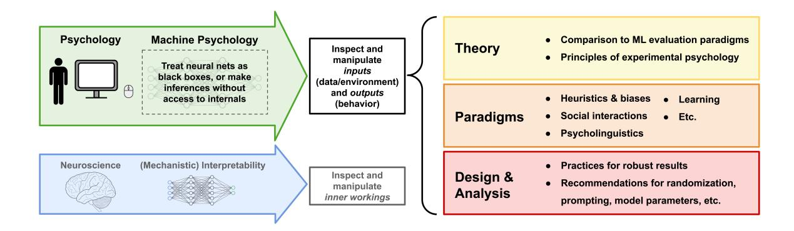

# MACHINE PSYCHOLOGY

Thilo Hagendorff∗ University of Stuttgart Ishita Dasgupta∗ Google DeepMind Marcel Binz† Helmholtz Institute for Human-Centered AI Stephanie C.Y. Chan† Google DeepMind Andrew Lampinen† Google DeepMind Jane X. Wang† Google DeepMind Zeynep Akata TU Munich Eric Schulz Helmholtz Institute for

August 9, 2024

Human-Centered AI

# ABSTRACT

Large language models (LLMs) show increasingly advanced emergent capabilities and are being incorporated across various societal domains. Understanding their behavior and reasoning abilities therefore holds significant importance. We argue that a fruitful direction for research is engaging LLMs in behavioral experiments inspired by psychology that have traditionally been aimed at understanding human cognition and behavior. In this article, we highlight and summarize theoretical perspectives, experimental paradigms, and computational analysis techniques that this approach brings to the table. It paves the way for a "machine psychology" for generative artificial intelligence (AI) that goes beyond performance benchmarks and focuses instead on computational insights that move us toward a better understanding and discovery of emergent abilities and behavioral patterns in LLMs. We review existing work taking this approach, synthesize best practices, and highlight promising future directions. We also highlight the important caveats of applying methodologies designed for understanding humans to machines. We posit that leveraging tools from experimental psychology to study AI will become increasingly valuable as models evolve to be more powerful, opaque, multi-modal, and integrated into complex real-world settings.

# Introduction

Recent advances in computing power, data availability, and machine learning algorithms have yielded powerful artificial intelligence systems that are used in almost all parts of society. Among these, large language models (LLMs), gigantic neural network architectures trained on large amounts of text, have seen a particularly meteoric rise in their influence. The ability of LLMs to interface directly with natural language has made them accessible to the public in a way that was not seen before, leading to widespread adoption with millions of daily users (Gemini Team et al., [2024;](#page-11-0) Anthropic, [2024;](#page-9-0) OpenAI, [2022;](#page-13-0) OpenAI, [2023a\)](#page-13-1). Also contributing to their rise in influence is that LLMs are wide-ranging in the kinds of tasks they can do – from writing text or code to calling functions, accessing the Internet, retrieving external information, reasoning about complex problems, and many more (Bubeck et al., [2023;](#page-9-1) Lo et al., [2022;](#page-12-0) Elkins and Chun, [2020\)](#page-10-0). Recently, LLMs have been extended to interact with other modalities such as vision and speech (Fei et al., [2022;](#page-10-1) Radford et al., [2023\)](#page-13-2). The ever-growing capabilities of these systems make them challenging but also increasingly important to characterize and understand, especially since these expanding capabilities also bring greater potential for unforeseen harm (Bommasani et al., [2021;](#page-9-2) Hagendorff, [2024b;](#page-11-1) Weidinger et al., [2022;](#page-15-0) Bender et al., [2021;](#page-9-3) Schramowski et al., [2022\)](#page-14-0).

∗Shared first authorship. Contact: [thilo.hagendorff@iris.uni-stuttgart.de,](mailto:thilo.hagendorff@iris.uni-stuttgart.de) [idg@google.com](mailto:idg@google.com)

†Co-authors are listed in alphabetical order.

Figure 1: Overview of key concepts of machine psychology.

Understanding behavioral patterns and emergent abilities in LLMs requires explaining their operating principles. Of the approaches focused on explaining AI systems, many rely on trying to understand the inner workings of these neural networks. This approach, often termed mechanistic interpretability, seeks to investigate LLMs by analyzing how their weights and activation patterns implement the observable behavior. It uses simplifications in terms of data, the model, or both, that make causal interventions possible and the internal mechanisms easier to characterize (Stolfo et al., [2023;](#page-15-1) Conmy et al., [2023;](#page-10-2) Wang, Variengien, et al., [2022;](#page-15-2) Gao et al., [2024\)](#page-11-2). A related set of approaches draws inspiration more directly from neuroscience to characterize broader correlational similarities and differences between the internal processing of LLMs and humans (Hosseini and Fedorenko, [2023;](#page-11-3) Kumar et al., [2022\)](#page-12-1).

In contrast, this review focuses on the class of approaches that directly study the *behavior* of LLMs, analyzing relationships between inputs and outputs instead of inspecting the inner workings. This approach includes not only analyses of static trained models, but also experimental manipulations of inputs both during and after training. It also encompasses analyses of inputs and outputs that reveal insights about internal mechanisms, even if those internal mechanisms are not directly inspected. For this set of approaches, experiments can be inspired by human psychology, cognitive science, and the behavioral sciences. This is what we want to term *machine psychology* (see [Figure](#page-1-0) [1\)](#page-1-0). Over several decades, the mentioned disciplines have developed a wide range of methods and frameworks to understand and characterize observable intelligent behaviors in human and non-human animals (Edwards, [1954;](#page-10-3) Festinger and Katz, [1953\)](#page-10-4), much of which can now be adapted to LLMs as well.

Thus far, the research community has responded to the challenges of understanding behavioral patterns and growing capabilities in LLMs in several ways (Schwartz, [2022;](#page-14-1) Zhao, Chen, et al., [2023\)](#page-16-0). The traditional machine learning benchmark-driven approach has released new datasets that capture specific aspects only recently seen emerging in models (Srivastava et al., [2022;](#page-14-2) Hendrycks et al., [2021;](#page-11-4) Zellers et al., [2019\)](#page-15-3). Traditional benchmarking aims primarily to enable the community to compare and optimize LLM performance. In contrast, machine psychology research is not primarily interested in increasing (or measuring) an LLM's performance, but rather in understanding behavioral patterns. While traditional natural language processing benchmarks measure abilities such as translation, numerical reasoning, or factual accuracy, machine psychology is also interested in how these observable abilities indirectly reflect the underlying constructs and algorithms (Frank et al., [2024\)](#page-10-5). Understanding these constructs lets us make new predictions about e.g. how the model will generalize, how it will perform with different training data, and specific failure modes.

The relative importance of behavior-based inspection (or psychology) versus internal inspection (or neuroscience) has been a long-standing debate (Jonas and Kording, [2017\)](#page-12-2). We believe that both approaches have value for understanding both humans and LLMs. Directly inspecting LLMs' behavior, however, does come with multiple advantages. The behavior of LLMs is expressed at the interface of the model, where human users interact, and thus is what we ultimately care about the most (Binz and Schulz, [2023;](#page-9-4) Chang and Bergen, [2024;](#page-10-6) Ivanova, [2023\)](#page-11-5). Such behavior is often too complex to predict purely from our current mechanistic understanding of model weights and activation patterns (Grön et al., [2003\)](#page-11-6). Many interesting behaviors are only displayed by large models with billions of parameters (Kaplan et al., [2020;](#page-12-3) Wei, Tay, et al., [2022\)](#page-15-4), and behavioral methods in psychology that treat behavior directly as the experimental variable of interest scale gracefully with model size. Another practical advantage is that these behavioral approaches

can easily be applied by the broader academic community to closed-source state-of-the-art models whose internal workings are not disclosed to the public.

In this article, we review and chart future directions in this emerging field of directly modeling LLM behavior. We outline how established behavioral sciences can guide and inform our understanding of LLMs, and discuss important caveats for when and how to apply methods to LLMs, given that they were originally developed for humans and animals. In the first section, we discuss the theoretical frameworks developed and used in psychology to organize our understanding of intelligence and intelligent behaviors. We then review the many empirical paradigms that have been developed to study and characterize different aspects of intelligent behavior. Finally, we discuss and make recommendations for robust empirical methods both for designing experiments and analyzing behavioral data. We end the article by discussing the potentials and limitations of conducting machine psychology experiments with increasingly capable black-box models.

# Theory: Evaluation paradigms for understanding intelligent systems

The traditional framework in machine learning algorithms has revolved around benchmark datasets (Bowman et al., [2015;](#page-9-5) Russakovsky et al., [2015\)](#page-14-3). These datasets are designed to require specific capabilities (e.g. object recognition, sentiment analysis, etc.) for good performance. Researchers train on a train dataset and evaluate on a held-out test dataset that was not seen during training. This framework does not generalize well to large-scale foundation models for two reasons. First, when using Internet-scale training data for models, this split has become harder to maintain (Li and Flanigan, [2023;](#page-12-4) Khan et al., [2023\)](#page-12-5). Second, foundation models are only directly trained for next-token prediction but exhibit many other "intelligent" behaviors that can, with some reservations (Schaeffer et al., [2023\)](#page-14-4), be considered emergent. For example, practitioners did not explicitly encode or train for a transformer LLM's ability to learn from a few examples in context (Brown et al., [2020\)](#page-9-6), but it nonetheless arose from the machine learning architecture, data, and learning signal (Chan et al., [2022;](#page-10-7) Oswald et al., [2023\)](#page-13-3). Emergent behaviors can be difficult to study through the lens of the components that gave rise to it (Anderson, [1972\)](#page-9-7), and the ones that emerge can seem surprising (Wei, Tay, et al., [2022\)](#page-15-4) – the most interesting evaluations are not 'held-out' exemplars of the training task.

Researchers have therefore started building test-only benchmarks – i.e. smaller scale datasets unsuitable for training and intended solely as a test set – to investigate model capabilities, e.g. the BIG-bench comprising more than 200 tests (Srivastava et al., [2022\)](#page-14-2), the Abstraction and Reasoning Challenge (Chollet et al., [2020\)](#page-10-8), as well as many others (Ivanova et al., [2024;](#page-11-7) Mazumder et al., [2024\)](#page-13-4). In several cases, these benchmarks already resemble evaluation frameworks from the behavioral sciences (Bubeck et al., [2023\)](#page-9-1) – like personality tests, intelligence tests, implicit association tests, etc. that are applied to humans – which similarly do not follow the train-test paradigm. They also tend to fall into two categories. Some evaluations focus on scalar performance metrics, e.g. intelligence quotients. Others focus on *characterizing* behavior, i.e. the questions are not designed with accuracy in mind, but designed to elicit responses that reveal behavioral strategies, or underlying constructs. In this review, we focus on test-only evaluations that provide this latter kind of understanding, as a novel evaluation paradigm that is starting to gain traction in the machine learning field.

Several such diagnostic evaluations have been developed even for pre-LLM models where, despite the models being trained for specific tasks, *how* to solve them is not specified. Such diagnostic datasets were used to expose the *ways* in which learned systems solved tasks – often counter to human intuitions (Geirhos et al., [2020;](#page-11-8) McCoy, Pavlick, et al., [2019;](#page-13-5) Hermann and Lampinen, [2020;](#page-11-9) Dasgupta et al., [2022;](#page-10-9) Singla and Feizi, [2021\)](#page-14-5). Researchers have also made the case for borrowing from ethology, a branch of zoology that studies the behavior of non-human animals, to explain machine behavior in machine learning systems (Rahwan et al., [2019\)](#page-14-6). However, in the era of LLMs, not only are the *how* unspecified, but the model abilities themselves are neither directly known nor intentionally engineered. Furthermore, since LLMs can be evaluated via natural language, this can enhance or replace comparatively simpler methods from ethology. This has led to the widespread adoption of language-based diagnostic evaluations, making it easier and more intuitive for practitioners to develop relevant tests.

However, this comes with important caveats. In trying to shed light on the workings of a black-box system that can produce language, it is tempting to use the simplest approach of asking the system about it. Self-report measures have been extensively used in psychology as well; but their reliability is questionable in humans (Jobe, [2003\)](#page-12-6) as well as LLMs. Properties that such measures usually consider, such as personality, morality, or clinical disorders, are famously sensitive to prompting (Dominguez-Olmedo et al., [2023;](#page-10-10) Röttger et al., [2024\)](#page-14-7); to the extent that several recent works even simulate groups of humans of different social groups, opinions, and personalities with differently prompted LLMs (Salewski et al., [2023;](#page-14-8) Park et al., [2022;](#page-13-6) Argyle et al., [2023;](#page-9-8) Shanahan et al., [2023\)](#page-14-9). There remains value in using self-report stimuli from psychology – for example, to characterize behavior on a default prompt, as well as to understand how steerable (i.e. sensitive to prompting) models are along these dimensions. But results drawn from these measures should be taken contextually (e.g. as a property of a specific system prompt on a model) instead of as a fundamental or general property of the LLM itself.

In contrast, the empirical tradition in psychology is significantly different from self-reports. This tradition has yielded lasting understanding of natural intelligence (Frank et al., [2024\)](#page-10-5), and is the tradition we argue is the most amenable for transferring insights to machine psychology. In this paradigm, externally observed behavior continues to be the measured experimental variable, but stimuli are designed such that different observed behaviors map onto and measure different internal representations, capabilities, or constructs – like compositionality, theory of mind, logic, causality, etc. A key principle is that experiments are hypothesis-driven: if the agent has representation or construct X, we would expect to see behavior Y, otherwise we would see behavior Z. We highlight two key principles from this tradition that are crucial to keep in mind when performing and interpreting machine psychology evaluations. First, does seeing behavior Y reliably imply having the construct X? To answer this, the design of a good control is crucial – to ensure that behavior Y does not have another explanation and does, in fact, implicate X. A large part of experimental psychology has been coming up with the right controls for these subtle constructs (Boring, [1954\)](#page-9-9), and has been providing a valuable foundation for future research in machine psychology. Second, does the absence of behavior Y indicate the absence of the construct X? This is a more subtle question. Research in psychology often grapples with the fact that human performance can be noisy or biased; for example, humans may make mistakes even on an easy calculation, or produce ungrammatical language colloquially. These should not be taken to mean that they lack the abstract capability for math or language. These inconsistencies led to the concept of the *performance-competence distinction* (e.g. Chomsky, [1965\)](#page-10-11): that the way humans *perform* in a particular situation may not fully capture their underlying *competence*. More recent work has suggested that similar issues apply when assessing the capabilities of machine learning systems (Firestone, [2020\)](#page-10-12), and particularly LLMs (Lampinen, [2022\)](#page-12-7).

# Paradigms: The many aspects of intelligent behavior

There are many aspects of intelligent behavior, each of which has been studied by different sub-fields of the behavioral sciences. Each of these has developed domain-specific empirical paradigms. While some of these sub-fields (e.g. motor learning) and paradigms (e.g. pupillometry) are not directly transferable to LLMs since they rely on the existence of a physical body, several of these paradigms are purely linguistic and can be easily transferred. As LLMs expand in the kinds of stimuli they can interpret – e.g. visual (OpenAI, [2023b;](#page-13-7) Zhang, Huang, et al., [2024;](#page-15-5) Gemini Team et al., [2024\)](#page-11-0) – and the ways in which they can interact with the world – e.g. embodiment and tool use (Mialon et al., [2023\)](#page-13-8) –, the space of transferable paradigms increases. Humans also interact with several modalities, and the paradigms developed to understand us often compare and integrate these modalities (Schulze Buschoff et al., [2023\)](#page-14-10) – e.g. the Stroop test which spans vision and reading capabilities (Scarpina and Tagini, [2017\)](#page-14-11).

In this article, we focus on language-based tests, since these are the most widely used in the current research landscape. Moreover, we believe that even in light of the growing trend toward multi-modal models, language will remain a primary modality due to its fundamental role in models' reasoning processes. We concentrate on four research areas that can inform distinct strands in machine psychology research: heuristics and biases, social interactions, the psychology of language, and learning. Apart from these four areas, there are, of course, multiple other domains of psychology that can also provide valuable paradigms for, for instance when investigating creativity in LLMs (Stevenson et al., [2022\)](#page-15-6), clinical psychology (Li, Li, et al., [2022\)](#page-12-8), moral behavior (Khandelwal et al., [2024\)](#page-12-9), and others.

#### Heuristics and biases

The heuristics and biases framework is one of the most influential research paradigms in psychology (Gigerenzer and Gaissmaier, [2011;](#page-11-10) Tversky and Kahneman, [1974\)](#page-15-7). Heuristics are mental shortcuts that simplify reasoning or decision-making processes, and this field studies how such shortcuts can help explain both the successes and the biases in human behavior. The large existing literature on heuristics and biases in humans is a fertile ground for examining such shortcuts in the newest generation of LLMs – whose capabilities now overlap more with the human abilities this literature studies. Binz and Schulz [\(2023\)](#page-9-4) were among the first to use this paradigm to better understand the decision-making processes of LLMs. They found that GPT-3 (Brown et al., [2020\)](#page-9-6) displays some of the same cognitive biases observed in people. Several other works have also been done in this vein (Jones and Steinhardt, [2022;](#page-12-10) Yax et al., [2024;](#page-15-8) Hagendorff et al., [2023;](#page-11-11) Macmillan-Scott and Musolesi, [2024;](#page-12-11) Schulze Buschoff et al., [2023;](#page-14-10) Hayes et al., [2024;](#page-11-12) Coda-Forno, Binz, Wang, et al., [2024\)](#page-10-13). Interestingly, there is evidence from several studies showing that, while the previous generation of models frequently exhibited human-like heuristics and biases, they have largely disappeared in the latest generation of LLMs (Chen, Liu, et al., [2023;](#page-10-14) Hagendorff et al., [2023\)](#page-11-11). The test stimuli were originally designed to be challenging for human study participants and possibly no longer challenge the growing reasoning abilities in LLMs. This could also be due to leakage into the training set – we discuss this challenge in the section on design and analysis.

The literature on heuristics and biases also suggests that how a problem is phrased can influence how people solve it (Cheng and Holyoak, [1985;](#page-10-15) Tversky and Kahneman, [1981\)](#page-15-9). It is well-known that LLMs are also susceptible to similar manipulations. For example, Dasgupta et al. [\(2022\)](#page-10-9) have investigated whether LLMs are affected by the semantic content of logical reasoning problems using several existing tasks from the literature. They found that, like people, LLMs reason more accurately about familiar, believable, or grounded situations, compared to unfamiliar, unbelievable, or abstract problems. Likewise, Schubert et al., [2024](#page-14-12) have shown that how LLMs learn in-context depends on the problem formulation.

Finally, people do not simply apply arbitrary heuristics. Instead, they use heuristics that are adapted to the problems they encounter during their everyday interactions with the world (Todd and Gigerenzer, [2012\)](#page-15-10). In the context of LLMs, one can look at how the properties of the training data shape their behavior. For example, Chan et al., [2022](#page-10-7) have demonstrated that the presence of in-context learning in LLMs can be traced back to data distributional properties such as burstiness, where items appear in clusters rather than being uniformly distributed over time, and the presence of large numbers of rarely occurring classes. Researchers also proposed that one should try to understand LLMs through the problem they are trained to solve, similarly to how behavioral scientists attempt to understand human cognition through the lens of ecological rationality (Todd and Gigerenzer, [2012;](#page-15-10) McCoy, Yao, et al., [2023;](#page-13-9) Jagadish et al., [2024\)](#page-12-12).

#### Social interactions

Traditionally, developmental psychology explores how humans develop cognitively, socially, and emotionally throughout their lives. This includes studying the various factors that influence development, such as social intelligence or social skills. By applying paradigms from this area of developmental psychology to LLMs, researchers can gain deeper insights into how these models manage complex social interactions. In particular, once LLMs are deployed as chat agents, they should become versed in modeling human communicators. Therefore, it is important to assess the level of social intelligence in LLMs. One example in this context is the application of theory of mind tests to LLMs, where researchers use tasks from human experiments, such as those famously conducted by Wimmer and Perner [\(1983\)](#page-15-11) and Perner et al. [\(1987\)](#page-13-10). While early experiments with models such as GPT-3 showed that they struggle to solve theory of mind tasks (Sap et al., [2022\)](#page-14-13), later models demonstrate an increasing ability to reliably infer unobservable mental states in others (Strachan et al., [2024;](#page-15-12) Holterman and Deemter, [2023;](#page-11-13) Moghaddam and Honey, [2023\)](#page-13-11). Further related research examines how LLM performance on theory of mind tests compares to that of children (Duijn et al., [2023\)](#page-10-16), LLM ability to handle higher-order theory of mind tasks requiring recursive reasoning about multiple mental states (Street et al., [2024\)](#page-15-13), or measures the robustness of theory of mind test setups against distracting alterations in the tasks LLMs receive as inputs (Ullman, [2023\)](#page-15-14). As theory of mind tests measure, among other things, the ability to understand false beliefs, further research has explored the emerging capability of LLMs to induce false beliefs in other agents (Hagendorff, [2024a\)](#page-11-14), or how LLMs trade off various communicative values like honesty and helpfulness (Liu et al., [2024\)](#page-12-13) – these investigations also contribute to understanding and improving alignment with human values for AI safety (Ji et al., [2023\)](#page-12-14).

The space of relevant paradigms increases as LLMs are allowed to interact through self-reflection (Nair et al., [2023\)](#page-13-12), self-instruction (Wang, Wei, et al., [2022\)](#page-15-15), or in swarms (Zhuge et al., [2023\)](#page-16-1). For example, researchers looked at cooperative and coordinative behavior in LLMs playing games, revealing persistent behavioral signatures in the models (Akata et al., [2023\)](#page-9-10). Similarly, researchers investigated cooperative or competitive LLMs behavior in psychologyinspired dilemma situations to assess the ability of LLMs to participate in real-world negotiations (Phelps and Russell, [2024\)](#page-13-13). Another study, which is influenced by works in human social psychology, looked at how multiple LLMs form and evolve networks, investigating micro-level network principles such as preferential attachment or triadic closure, as well as macro-level principles such as community structures (Papachristou and Yuan, [2024\)](#page-13-14). In sum, machine psychology can reveal patterns of social behavior and interaction among LLMs, individually and collectively, be it for

problem solving or world simulation (Guo et al., [2024\)](#page-11-15). By drawing from human developmental psychology and social dynamics, researchers can better understand and design LLMs that navigate complex social interactions and exhibit advanced social skills.

#### Psychology of language

A long history of work has studied the psychology of how humans use and understand language, ranging from how they use semantic and syntactic features to understand a sentence to how they use pragmatic inferences in a discourse context to help interpret what someone has said. Correspondingly, a long-standing body of work has studied how language processing models capture these features of human language processing. Early connectionist works studied these topics in simple recurrent predictive models (Elman, [1991;](#page-10-17) McClelland et al., [1989\)](#page-13-15); more recently, researchers have applied similar techniques to study LLMs. A wide range of work has studied what models learn about syntax (Linzen and Baroni, [2021\)](#page-12-15), often using methods from psycholinguistics. For example, Wilcox et al. [\(2023\)](#page-15-16) used psycholinguistics-inspired surprisal measures to show that LLMs learn filler-gap dependencies, a challenging syntactic structure. Other researchers have used related measures to study what LLMs learn about the semantics of entailment (Merrill et al., [2024\)](#page-13-16). Moreover, researchers used psycholinguistic techniques like priming to study how models represent and process language (Prasad et al., [2019;](#page-13-17) Sinclair et al., [2022\)](#page-14-14), and methods like deconfounded stimuli to identify where models may rely on semantic heuristics rather than syntax (McCoy, Pavlick, et al., [2019\)](#page-13-5). Several recent works (Hu, Floyd, et al., [2023;](#page-11-16) Ruis, Khan, et al., [2023\)](#page-14-15) studied pragmatic judgments of LLMs, and found that larger models, as well as those with instruction tuning, tend to better approximate human responses and error patterns – though some deficiencies remain. In another study, researchers examined long-form analogies generated by ChatGPT, finding that AI-generated analogies lack some human-like psycholinguistic properties (Seals and Shalin, [2023\)](#page-14-16), particularly in text cohesion, language, and readability. Furthermore, researchers applied garden path sentences – sentences that lead the reader to initially interpret them incorrectly due to their ambiguous structure – to LLMs, showing that the models respond similarly to humans (Aher et al., [2023;](#page-9-11) Christianson et al., [2001\)](#page-10-18). At a higher level, some researchers have drawn inspiration from aspects of human language development to attempt to identify the causes of the relative data inefficiency of language models (Warstadt et al., [2023;](#page-15-17) Frank, [2023\)](#page-10-19). In each of these cases, methods and ideas from psychology and psycholinguistics provide guidance on how to assess processes through language behaviors in LLMs, potentially by drawing comparisons between LLMs and humans.

#### Learning

The psychology of learning is concerned with how individuals acquire and retain knowledge and skills. At first blush, it may appear that experimental paradigms for the study of learning are less applicable to LLMs, given that the aim of behavioral experiments is often to help uncover the underlying learning algorithm – whereas for LLMs the learning algorithms used in training are designed and already known. However, the behavioral sciences can still benefit from the study of LLMs in this context, since LLMs exhibit learning abilities that were not explicitly designed into the models (they are emergent), and thus one does not understand the underlying learning algorithm. In particular, LLMs exhibit emergent in-context learning – the ability to learn from context (the prompt) without requiring any gradient-based updates in weights (Brown et al., [2020\)](#page-9-6). Understanding in-context learning is a burgeoning field that is rapidly gaining in importance, given the increasing size of LLMs context windows and consequent gains in capabilities, e.g. the capability to learn an entire language from context alone (Munkhdalai et al., [2024;](#page-13-18) Gemini Team et al., [2024\)](#page-11-0), or the ability to overcome safety fine-tuning (Anil et al., [2024;](#page-9-12) Zheng et al., [2024\)](#page-16-2).

Uncovering the implicit learning algorithm implemented by in-context learning is a burgeoning research field, and utilizes many of the methods common in cognitive science. For example, multiple studies have compared the outputs of transformer in-context learning with the outputs of hypothesized learning algorithms (Oswald et al., [2023;](#page-13-3) Akyürek et al., [2022\)](#page-9-13). This is a staple of cognitive modeling, and could potentially benefit even further from model comparison procedures from psychology and statistics (Yang, [2006;](#page-15-18) Arlot and Celisse, [2010;](#page-9-14) Vrieze, [2012\)](#page-15-19). Recent work in cognitive science has used machine learning to discover new theories of human decision-making (Peterson et al., [2021\)](#page-13-19) – it might be interesting to apply related approaches to in-context learning as well. Researchers might also benefit from considering particular models as normative starting points (Niv, [2009\)](#page-13-20).

Researchers may also wish to understand other interesting and important characteristics of learning, such as inductive biases and generalization, the data dependence of learning, and the dynamics of learning over time. These characteristics are often not obvious even in cases where the learning algorithm is known, and thus researchers would like to understand them not only for in-context learning, but also for other forms of LLM learning, e.g. self-supervised gradient-based learning, reinforcement learning (Ouyang et al., [2022\)](#page-13-21), or "fast" memory retrieval (Borgeaud et al., [2022;](#page-9-15) Lewis et al., [2020\)](#page-12-16).

To characterize inductive biases and generalization of LLMs, researchers have borrowed both concepts and experimental paradigms from cognitive sciences (Schubert et al., [2024;](#page-14-12) Coda-Forno, Binz, Akata, et al., [2023\)](#page-10-20) and Bayesian inference (Xie et al., [2022\)](#page-15-20). Studies utilized paradigms for measuring systematic generalization to characterize those capabilities in LLMs, and as inspiration to improve these abilities (Lake and Baroni, [2023;](#page-12-17) Ruis, Andreas, et al., [2022\)](#page-14-17). Webb et al. [\(2023\)](#page-15-21) created novel variants of classic analogy problems from cognitive science, in order to examine the analogical capabilities of large language models. Chan et al. [\(2022\)](#page-10-7) have borrowed ideas and experimental paradigms on "rule-based" vs. "exemplar-based" generalization to characterize the inductive biases of in-weights vs. in-context learning in transformers. Furthermore, researchers borrowed paradigms and measures from developmental psychology to characterize the domains where LLM inductive biases may match those of children, and where they may fall short (including in causal reasoning and innovation) (Kosoy et al., [2023;](#page-12-18) Yiu et al., [2023\)](#page-15-22).

To characterize the data dependence of in-context learning, existing work has drawn inspiration from research in developmental psychology on skewed and bursty distributions (Chan et al., [2022\)](#page-10-7). An important aspect of data dependence is the structure of data over time (during training). AI researchers have long drawn inspiration from curriculum learning in human and non-human animals to better understand how to structure training data so that earlier learning on easier tasks can scaffold later learning on harder tasks (Bengio et al., [2009\)](#page-9-16). There remain many areas of behavioral research on learning that may serve as rich sources of inspiration on data dependence, e.g. research on repetition and spacing (Dempster, [1989\)](#page-10-21), working memory (Baddeley, [2010;](#page-9-17) Chai et al., [2018\)](#page-9-18), blocking vs. interleaving tasks (Carvalho and Goldstone, [2015\)](#page-9-19), and continual learning (Greco et al., [2019\)](#page-11-17). Data dependence is particularly interesting for LLMs because text training data (being sourced largely from unstructured web-scale corpora) is very different from the structured training data typically used for traditional discriminatory machine learning techniques, and because data is one of the major levers one can manipulate in training LLMs to adjust their behaviors.

# Design and analysis: Good behavioral experimentation

Computer science has not historically been an empirical science. While machine learning (especially since the era of neural network models) has been significantly driven by empirical rather than theoretical work, the settings under which those protocols were developed – a test set that is fixed for all practitioners and is effectively infinitely large – no longer hold in the small test-only behavioral experiments setting. Current LLMs are famously sensitive to small changes in prompt structure or they rely on shallow syntactic heuristics (McCoy, Pavlick, et al., [2019\)](#page-13-5), and studies that are not careful about testing the robustness of their conclusions risk being spurious and non-generalizable. Psychology too has had its own share of reproducibility crises (Open Science Collaboration, [2015;](#page-13-22) Haibe-Kains et al., [2020\)](#page-11-18), and machine psychology should not share the same fate. In this section, we provide recommendations for sound methodologies in behavioral test settings with LLMs, which should be valuable to practitioners in the field of machine psychology.

#### Prompting methods and biases

Many studies conducted in the field of machine psychology have a significant shortcoming in common, namely that they do not avoid training data contamination. They use prompts from existing psychology studies and apply them to LLMs without changing their wording, task orders, etc. In this way, LLMs are likely to have already experienced identical or similar tasks during training, thus causing LLMs to simply reproduce known token patterns. When adopting test frameworks from psychology – meaning vignettes, cognitive tasks, or other test setups – researchers must ensure that LLMs have never seen the tests before and go beyond mere memorization. Hence, prompts may indeed be structurally like already existing tasks, but they should contain new wordings, agents, orders, actions, etc. That being said, some experiments may be procedurally generated (instead of consisting of a static dataset), which makes them inherently less susceptible to data contamination issues (Coda-Forno, Binz, Wang, et al., [2024\)](#page-10-13).

Another common shortcoming of several existing machine psychology studies is that they rely on small sample sizes or convenience samples, meaning non-systematic sequences of prompts. Sampling biases in the used benchmarks or task datasets, which are especially prevalent in small sample sizes, can diminish the quality of machine psychology studies. This is because slight changes in prompts can change model outputs significantly. Because of this high sensitivity to prompt wording, it is important to test multiple versions of one task and to create representative samples, meaning batteries of varied prompts. Only in this way can one reliably measure whether a certain behavior is systematically reoccurring and generalizable (Yarkoni, [2022\)](#page-15-23). Furthermore, LLMs can succumb to various biases influencing the processing of prompts (Zhao, Wallace, et al., [2021;](#page-16-3) Chan et al., [2022\)](#page-10-7). Recency biases in LLMs, for instance, lead to a tendency to rely more heavily on information appearing toward the end of prompts. LLMs can also possess a common token bias, meaning that models are biased toward outputting tokens that are common in their training data. Moreover, majority label biases can cause LLMs to be skewed towards labels, classes, or examples that are frequent in a few-shot learning setting. Technical biases like these can at least in part be controlled for when designing prompts or prompt variations that tend to avoid triggering them. If this is not done, LLMs may rely on shortcuts exploiting such biases.

#### Eliciting capabilities with prompts

The standard prompt design, comprising a vignette plus an open- or close-ended question or task, can be enhanced by prefixes or suffixes eliciting improved reasoning capabilities in LLMs. On the other hand, omitting such prefixes and suffixes can lead to underestimations of the model's capabilities. Although it is likely that most specific prompt augmentations have a positive influence on one kind of task but not another, reducing our ability to systematically understand LLM behavior, a few prompt design approaches have nonetheless been found to confer broader performance benefits. Most notably, (zero-shot) chain-of-thought prompting (Wei, Wang, et al., [2022;](#page-15-24) Kojima et al., [2022\)](#page-12-19) – which simply adds "Let's think step by step" at the end of a prompt – improves reasoning performance. This can be extended even further by generating multiple chain-of-thought reasoning paths and taking the majority response as the final one (Wang, Wei, et al., [2022\)](#page-15-15). Similar to chain-of-thought prompting is least-to-most prompting, which also decomposes problems into a set of subproblems to increase accuracy in LLMs (Zhou et al., [2022\)](#page-16-4). Yet another approach is to frame questions in a multiple-choice format. This was shown to improve reasoning capabilities in some cases (Kadavath et al., [2022\)](#page-12-20), but can also limit them because LLMs might be prompted to provide brief responses, thereby circumventing reasoning in the process of prompt completion. Nevertheless, many prominent NLP benchmarks use multiple choice formats instead of open-ended questions. Here, one must keep in mind that different expressions of the same concept compete for probability, which can lower the chances of selecting the correct answer (Holtzman et al., [2021\)](#page-11-19). Moreover, one has to consider potential recency biases, which require neutralizing this effect by shuffling the order of answers in multiple test runs to cover all possible combinations. Another method to increase reasoning is to utilize the ability for few-shot learning in LLMs (Brown et al., [2020\)](#page-9-6), where the LLM's performance improves after repeated exposure to a given task. Moreover, self-reflection, meaning the automated, recursive criticizing and subsequent self-improvement of LLM outputs by the LLM itself, is a further technique that can improve reasoning abilities (Nair et al., [2023;](#page-13-12) Kim et al., [2023\)](#page-12-21). Regarding improvements in symbolic or numeric reasoning, another technique is to prompt LLMs to use code for solving tasks (Zhang, Ge, et al., [2024\)](#page-16-5). Eventually, all mentioned methods to improve reasoning can be not just leveraged for machine psychology; they can also become objects of study themselves.

#### Setting parameters and evaluating outputs

LLMs come with a variety of parameters researchers can set. For example, most models come in a variety of sizes. Analyses across different sizes are valuable: while the largest ones usually have the highest capabilities, some recent works find "inverse-scaling" (McKenzie et al., [2023\)](#page-13-23). Moreover, temperature settings control randomness. If exact reproducibility is required, studies should use temperature 0 or assign a seed to ensure complete determinacy. However, this can be prone to (intentional or unintentional) biases in seed choice. The effect of temperature on capabilities is not established (Renze and Guven, [2024\)](#page-14-18), and reporting averages or "best of K" – considering all the responses over K samples that meet certain simple criteria, e.g. formatting (Chen, Tworek, et al., [2021\)](#page-10-22) – is valuable.

After conducting the experiments, a list of LLM responses must be evaluated and compared with the ground truth. The simplest case is when the results can be framed and scored as a multiple-choice question – though even in this case, scoring the answers so that the model responds directly inline, rather than selecting a choice, can yield more signal (Hu and Levy, [2023\)](#page-11-20). If possible, multiple scoring methods should be compared, to evaluate whether the effects are dependent on the scoring method (Tsvilodub et al., [2024\)](#page-15-25). If the questions must be answered with free generations, the evaluation process can still be automated if the results exhibit sufficient simplicity and regularity, meaning that the LLM responses are similar to the ground truth strings in terms of length and wording, which is particularly common when using masked language models. Methods such as testing word overlaps with regular expressions or using metrics such

as the F1 score can be employed. State-of-the-art LLMs, however, tend to produce highly variable and comprehensive outputs, which can complicate classification. While stop sequences, token limits, or prompt instructions that interrupt further text generation can facilitate classification by promoting output uniformity, they also improperly constrain LLM behavior. Therefore, researchers are increasingly relying on LLM-based evaluations of outputs where a single model or multiple stacked model instances perform the classification using carefully crafted instructions. Although this method might still be inaccurate for very comprehensive outputs, a solution is to instruct the LLM under scrutiny to output its final answer or summary after a specific string sequence like "####" (Cobbe et al., [2021\)](#page-10-23). This approach allows the LLM to reason during verbose prompt completions, which is necessary for many prompt engineering techniques such as chain-of-thought reasoning. The classification then only involves processing the string following "####". If this method still proves to be unreliable, evaluations might have to be performed manually, possibly by hiring research assistants or contractors. Following the evaluation, a statistical analysis can be carried out.

# Discussion

Machine psychology provides a new approach to explaining AI. Instead of interpreting a neural network's design components (Barredo Arrieta et al., [2019\)](#page-9-20), one analyzes the relationships between inputs and outputs, i.e. prompt design and prompt completion. Although this may allow the identification of hitherto unknown abilities or behavioral traits in LLMs, interpreting LLM responses comes with a challenge. A strong tendency exists to confer mental concepts or psychological terms to LLMs that were hitherto reserved for human and animal minds. This tendency manifests in common terms like "machine learning," but will become more prevalent in machine psychology when concepts such as reasoning (Huang and Chang, [2022\)](#page-11-21), intuition (Hagendorff et al., [2023\)](#page-11-11), creativity (Stevenson et al., [2022\)](#page-15-6), intelligence (Webb et al., [2023\)](#page-15-21), personality (Miotto et al., [2022\)](#page-13-24), mental illnesses (Li, Li, et al., [2022\)](#page-12-8), etc. are transferred to LLMs. In this context, researchers have demanded caution by stressing that the underlying neural mechanisms for these concepts are different in humans and machines (Shanahan, [2022;](#page-14-19) Mahowald et al., [2024\)](#page-12-22). Moreover, many psychological concepts are normatively laden and can foster mismatches in expectations between AI experts and the public regarding machine capabilities (Shevlin and Halina, [2019\)](#page-14-20). Nevertheless, the problem that many abilities in LLMs cannot be reasonably grasped by only referring to the inner workings of their neural architecture remains.

By adopting a concept from ethnography, one could call such an approach "thin descriptions" (Ryle, [1971;](#page-14-21) Geertz, [1973\)](#page-11-22), meaning that one only explains internal representations in AI systems, for instance via activation atlases, which visualize how different parts of a neural network respond to various inputs (Carter et al., [2019\)](#page-9-21). In this sense, LLMs simply hijack humans' intuitions to explain machine behavior patterns by using psychological or other anthropocentric terms. Contrary to thin descriptions, though, there are "thick descriptions." They imply using psychological terms to add a layer of explainability. LLMs are, like the human brain, black boxes to some extent. By applying psychological terms to them, the explanatory power increases, even if no direct neural correlates to these terms exist. This holds for humans, too, where mental terms used to explain behavior do not directly correlate with specific sets of neural activations. By postulating (mental) unobservable states, be it with regard to brains or artificial neural networks, one increases explanatory resources (Sellars, [1997\)](#page-14-22). Thick descriptions help in making sense of LLMs when thin descriptions are insufficient to explain behavioral patterns. Thin descriptions assume that LLMs merely possess syntax or a statistical capacity to associate words (Searle, [1980;](#page-14-23) Floridi and Chiriatti, [2020;](#page-10-24) Bender et al., [2021\)](#page-9-3), but not semantics. Thick descriptions, though, assume that LLMs show patterns and regularities that go beyond mere syntax. These patterns can be explained by means of machine psychology.

Beyond potential habituations regarding the use of terminology borrowed from psychology in the context of machines, machine psychology, as a nascent field of research, aims to identify behavioral patterns, emergent abilities, and mechanisms of decision-making and reasoning in LLMs by treating them as participants in psychology experiments. This new discipline of evaluating LLMs will become even more important when taking multimodal or augmented LLMs into account, meaning LLMs that are allowed to interact with images, external information sources, sensory data, physical objects, and various other tools (Mialon et al., [2023;](#page-13-8) Schick et al., [2023;](#page-14-24) Ma et al., [2024\)](#page-12-23). Moreover, once test settings for machine psychology are established, researchers can investigate how LLMs develop over time by applying the same tasks multiple times, yielding longitudinal data. This data can serve as a baseline to extrapolate trends regarding the development of reasoning abilities in LLMs. Such estimations may be increasingly important for AI safety and AI alignment research to predict future behavioral potentials in LLMs. By gaining a deeper understanding of these potentials, machine psychology is providing a new approach to AI explainability as well as an important addition to traditional benchmarking methods in natural language processing.

# Author contributions

TH and ID conceptualized and led the initial design of the manuscript. TH and ID wrote the initial drafts, with contributions from MB, SCYC, AL, JW, ZA, and ES to flesh out the sections and create the figure. All authors assisted with iterations and edited and reviewed the paper.

# References

Aher, Gati, Rosa I. Arriaga, and Adam Tauman Kalai. "Using Large Language Models to Simulate Multiple Humans and Replicate Human Subject Studies". In: *Proceedings of the 40th International Conference on Machine Learning*. 2023, pp. 1–35.

Akata, Elif, Lion Schulz, Julian Coda-Forno, Seong Joon Oh, Matthias Bethge, and Eric Schulz. "Playing repeated games with Large Language Models". In: *arXiv* (2023), pp. 1–13.

Akyürek, Ekin, Dale Schuurmans, Jacob Andreas, Tengyu Ma, and Denny Zhou. "What learning algorithm is in-context learning? Investigations with linear models". In: *arXiv* (2022), pp. 1–29.

Anderson, Philip W. "More is different: Broken symmetry and the nature of the hierarchical structure of science". In: *Science* 177.4047 (1972), pp. 393–396.

Anil, Cem et al. *Many-shot jailbreaking*. 2024.

Anthropic. *The Claude 3 Model Family: Opus, Sonnet, Haiku*. 2024.

Argyle, Lisa P, Ethan C Busby, Nancy Fulda, Joshua R Gubler, Christopher Rytting, and David Wingate. "Out of One, Many: Using Language Models to Simulate Human Samples". In: *Political Analysis* 31.3 (2023), pp. 337–351.

Arlot, Sylvain and Alain Celisse. "A survey of cross-validation procedures for model selection". In: *Statistics Surveys* 4 (2010), pp. 40–79.

Baddeley, Alan. "Working memory". In: *Current Biology* 20.4 (2010), R136–R140.

Barredo Arrieta, Alejandro et al. "Explainable Artificial Intelligence (XAI): Concepts, Taxonomies, Opportunities and Challenges toward Responsible AI". In: *Information Fusion* 58 (2019), pp. 82–115.

Bender, Emily M, Timnit Gebru, Angelina McMillan-Major, and Shmargaret Shmitchell. "On the Dangers of Stochastic Parrots: Can Language Models Be Too Big?" In: *Proceedings of the 2021 ACM conference on fairness, accountability, and transparency*. 2021, pp. 610–623.

Bengio, Yoshua, Jérôme Louradour, Ronan Collobert, and Jason Weston. "Curriculum learning". In: *Proceedings of the 26th Annual International Conference on Machine Learning*. 2009, pp. 41–48.

Binz, Marcel and Eric Schulz. "Using cognitive psychology to understand GPT-3". In: *Proceedings of the National Academy of Sciences* 120.6 (2023), pp. 1–10.

Bommasani, Rishi et al. "On the opportunities and risks of foundation models". In: *arXiv* (2021), pp. 1–214.

Borgeaud, Sebastian, Arthur Mensch, Jordan Hoffmann, Trevor Cai, Eliza Rutherford, and Katie Millican. "Improving Language Models by Retrieving from Trillions of Tokens". In: *Proceedings of the 39th International Conference on Machine Learning*. Ed. by Kamalika Chaudhuri, Stefanie Jegelka, Le Song, Csaba Szepesvari, Gang Niu, and Sivan Sabato. Vol. 162. 2022, pp. 2206–2240.

Boring, Edwin G. "The Nature and History of Experimental Control". In: *The American Journal of Psychology* 67.4 (1954), pp. 573–589.

Bowman, Samuel R., Gabor Angeli, Christopher Potts, and Christopher D. Manning. "A large annotated corpus for learning natural language inference". In: *Proceedings of the 2015 Conference on Empirical Methods in Natural Language Processing*. Ed. by Lluís Màrquez, Chris Callison-Burch, and Jian Su. 2015, pp. 632–642.

Brown, Tom et al. "Language Models are Few-Shot Learners". In: *Advances in Neural Information Processing Systems*. Ed. by H. Larochelle, M. Ranzato, R. Hadsell, M.F. Balcan, and H. Lin. Vol. 33. Curran Associates, Inc., 2020, pp. 1877–1901.

Bubeck, Sébastien et al. "Sparks of Artificial General Intelligence: Early experiments with GPT-4". In: *arXiv* (2023), pp. 1–155.

Carter, Shan, Zan Armstrong, Ludwig Schubert, Ian Johnson, and Chris Olah. "Exploring Neural Networks with Activation Atlases". In: *Distill* 4.3 (2019).

Carvalho, Paulo F. and Robert L. Goldstone. "The benefits of interleaved and blocked study: different tasks benefit from different schedules of study". In: *Psychonomic Bulletin & Review* 22.1 (2015), pp. 281–288.

Chai, Wen Jia, Aini Ismafairus Abd Hamid, and Jafri Malin Abdullah. "Working Memory From the Psychological and Neurosciences Perspectives: A Review". In: *Frontiers in Psychology* 9 (2018), pp. 1–16.

- Chan, Stephanie, Adam Santoro, Andrew Lampinen, Jane Wang, Aaditya Singh, Pierre Richemond, James McClelland, and Felix Hill. "Data Distributional Properties Drive Emergent In-Context Learning in Transformers". In: *Advances in Neural Information Processing Systems* 35 (2022), pp. 18878–18891.
- Chang, Tyler A and Benjamin K Bergen. "Language Model Behavior: A Comprehensive Survey". In: *Computational Linguistics* 50.1 (2024), pp. 293–350.
- Chen, Mark, Jerry Tworek, et al. "Evaluating Large Language Models Trained on Code". In: *arXiv* (2021), pp. 1–35.
- Chen, Yiting, Tracy Xiao Liu, You Shan, and Songfa Zhong. "The emergence of economic rationality of GPT". In: *Proceedings of the National Academy of Sciences* 120.51 (2023), e2316205120.
- Cheng, Patricia W and Keith J Holyoak. "Pragmatic reasoning schemas". In: *Cognitive Psychology* 17.4 (1985), pp. 391–416.
- Chollet, François, Katherine Tong, Walter Reade, and Julia Elliott. *Abstraction and Reasoning Challenge*. 2020. URL: <https://kaggle.com/competitions/abstraction-and-reasoning-challenge>.
- Chomsky, Noam. *Aspects of the Theory of Syntax*. MIT Press, 1965.
- Christianson, Kiel, Andrew Hollingworth, John F. Halliwell, and Fernanda Ferreira. "Thematic Roles Assigned along the Garden Path Linger". In: *Cognitive Psychology* 42.4 (2001), pp. 368–407.
- Cobbe, Karl et al. "Training Verifiers to Solve Math Word Problems". In: *arXiv* (2021), pp. 1–22.
- Coda-Forno, Julian, Marcel Binz, Zeynep Akata, Matt Botvinick, Jane Wang, and Eric Schulz. "Meta-in-context learning in large language models". In: *Advances in Neural Information Processing Systems* 36 (2023), pp. 65189–65201.
- Coda-Forno, Julian, Marcel Binz, Jane X Wang, and Eric Schulz. "CogBench: a large language model walks into a psychology lab". In: *arXiv* (2024), pp. 1–26.
- Conmy, Arthur, Augustine N. Mavor-Parker, Aengus Lynch, Stefan Heimersheim, and Adrià Garriga-Alonso. "Towards Automated Circuit Discovery for Mechanistic Interpretability". In: *Advances in Neural Information Processing Systems*. Ed. by A. Oh, T. Naumann, A. Globerson, K. Saenko, M. Hardt, and S. Levine. Vol. 36. Curran Associates, Inc., 2023, pp. 16318–16352.
- Dasgupta, Ishita, Andrew K. Lampinen, Stephanie C. Y. Chan, Antonia Creswell, Dharshan Kumaran, James L. McClelland, and Felix Hill. "Language models show human-like content effects on reasoning". In: *arXiv* (2022), pp. 1–36.
- Dempster, Frank N. "Spacing effects and their implications for theory and practice". In: *Educational Psychology Review* 1.4 (1989), pp. 309–330.
- Dominguez-Olmedo, Ricardo, Moritz Hardt, and Celestine Mendler-Dünner. "Questioning the Survey Responses of Large Language Models". In: *arXiv* (2023), pp. 1–25.
- Duijn, Max J. van, Bram van Dijk, Tom Kouwenhoven, Werner de Valk, Marco R. Spruit, and Peter van der Putten. "Theory of Mind in Large Language Models: Examining Performance of 11 State-of-the-Art models vs. Children Aged 7-10 on Advanced Tests". In: *Proceedings of the 27th Conference on Computational Natural Language Learning (CoNLL)*. Ed. by Jing Jiang, David Reitter, and Shumin Deng. 2023, pp. 389–402.
- Edwards, Allen L. *Statistical Methods for the Behavioral Sciences*. Rinehart, 1954.
- Elkins, Katherine and Jon Chun. "Can GPT-3 Pass a Writer's Turing Test?" In: *Journal of Cultural Analytics* 5.2 (2020), pp. 1–16.
- Elman, Jeffrey L. "Distributed representations, simple recurrent networks, and grammatical structure". In: *Machine Learning* 7 (1991), pp. 195–225.
- Fei, Nanyi et al. "Towards artificial general intelligence via a multimodal foundation model". In: *Nature Communications* 13.1 (2022), pp. 1–13.
- Festinger, Leon Ed and Daniel Ed Katz. *Research methods in the behavioral sciences.* Holt, Rinehart and Winston, 1953.
- Firestone, Chaz. "Performance vs. competence in human–machine comparisons". In: *Proceedings of the National Academy of Sciences* 117.43 (2020), pp. 26562–26571.
- Floridi, Luciano and Massimo Chiriatti. "GPT-3: Its Nature, Scope, Limits, and Consequences". In: *Minds and Machines* 30.4 (2020), pp. 681–694.
- Frank, Michael C. "Bridging the data gap between children and large language models". In: *Trends in Cognitive Sciences* 27.11 (2023), pp. 990–992.
- Frank, Michael C., Mika Braginsky, Julie Cachia, Nicholas Coles, Tom E. Hardwicke, Robert D. Hawkins, Maya B. Mathur, and Rondeline Williams. *Experimentology: An Open Science Approach to Experimental Psychology Methods*. MIT Press, 2024.

- Gao, Leo, Tom Dupré la Tour, Henk Tillman, Gabriel Goh, Rajan Troll, Alec Radford, Ilya Sutskever, Jan Leike, and Jeffrey Wu. "Scaling and evaluating sparse autoencoders". In: *arXiv* (2024), pp. 1–34.
- Geertz, Clifford. *The Interpretation of Cultures: Selected Essays*. Basic Books, 1973.
- Geirhos, Robert, Jörn-Henrik Jacobsen, Claudio Michaelis, Richard Zemel, Wieland Brendel, Matthias Bethge, and Felix A. Wichmann. "Shortcut learning in deep neural networks". In: *Nature Machine Intelligence* 2 (2020), pp. 665– 673.
- Gemini Team et al. "Gemini 1.5: Unlocking multimodal understanding across millions of tokens of context". In: *arXiv* (2024), pp. 1–90.
- Gigerenzer, Gerd and Wolfgang Gaissmaier. "Heuristic decision making". In: *Annual Review of Psychology* 62 (2011), pp. 451–482.
- Greco, Claudio, Barbara Plank, Raquel Fernández, and Raffaella Bernardi. "Psycholinguistics Meets Continual Learning: Measuring Catastrophic Forgetting in Visual Question Answering". In: *Proceedings of the 57th Annual Meeting of the Association for Computational Linguistics*. Ed. by Anna Korhonen, David Traum, and Lluís Màrquez. Florence, Italy: Association for Computational Linguistics, 2019, pp. 3601–3605.
- Grön, Georg, David Schul, Volker Bretschneider, AP Wunderlich, and Matthias W Riepe. "Alike performance during nonverbal episodic learning from diversely imprinted neural networks". In: *European Journal of Neuroscience* 18.11 (2003), pp. 3112–3120.
- Guo, Taicheng, Xiuying Chen, Yaqi Wang, Ruidi Chang, Shichao Pei, Nitesh V. Chawla, Olaf Wiest, and Xiangliang Zhang. "Large Language Model based Multi-Agents: A Survey of Progress and Challenges". In: *arXiv* (2024), pp. 1–15.
- Hagendorff, Thilo. "Deception abilities emerged in large language models". In: *Proceedings of the National Academy of Sciences* 121.24 (2024), pp. 1–8.
- – "Mapping the Ethics of Generative AI: A Comprehensive Scoping Review". In: *arXiv* (2024), pp. 1–25.
- Hagendorff, Thilo, Sarah Fabi, and Michal Kosinski. "Human-like intuitive behavior and reasoning biases emerged in large language models but disappeared in ChatGPT". In: *Nature Computational Science* 3.10 (2023), pp. 833–838.
- Haibe-Kains, Benjamin et al. "Transparency and reproducibility in artificial intelligence". In: *Nature* 586.7829 (2020), pp. 1–7.
- Hayes, William M, Nicolas Yax, and Stefano Palminteri. "Relative Value Biases in Large Language Models". In: *arXiv* (2024), pp. 1–7.
- Hendrycks, Dan, Collin Burns, Saurav Kadavath, Akul Arora, Steven Basart, Eric Tang, Dawn Xiaodong Song, and Jacob Steinhardt. "Measuring Mathematical Problem Solving With the MATH Dataset". In: *Thirty-fifth Conference on Neural Information Processing Systems*. 2021, pp. 1–11.
- Hermann, Katherine and Andrew Lampinen. "What shapes feature representations? Exploring datasets, architectures, and training". In: *34th Conference on Neural Information Processing Systems*. 2020, pp. 1–12.
- Holterman, Bart and Kees van Deemter. "Does ChatGPT have Theory of Mind?" In: *arXiv* (2023), pp. 1–15.
- Holtzman, Ari, Peter West, Vered Shwartz, Yejin Choi, and Luke Zettlemoyer. "Surface Form Competition: Why the Highest Probability Answer Isn't Always Right". In: *Proceedings of the 2021 Conference on Empirical Methods in Natural Language Processing*. Ed. by Marie-Francine Moens, Xuanjing Huang, Lucia Specia, and Scott Wen-tau Yih. 2021, pp. 7038–7051.
- Hosseini, Eghbal A and Evelina Fedorenko. "Large language models implicitly learn to straighten neural sentence trajectories to construct a predictive representation of natural language". In: *Advances in Neural Information Processing Systems*. Ed. by A. Oh, T. Naumann, A. Globerson, K. Saenko, M. Hardt, and S. Levine. Vol. 36. 2023, pp. 43918–43930.
- Hu, Jennifer, Sammy Floyd, Olessia Jouravlev, Evelina Fedorenko, and Edward Gibson. "A fine-grained comparison of pragmatic language understanding in humans and language models". In: *The 61st Annual Meeting Of The Association For Computational Linguistics*. 2023, pp. 4194–4213.
- Hu, Jennifer and Roger P Levy. "Prompting is not a substitute for probability measurements in large language models". In: *The 2023 Conference on Empirical Methods in Natural Language Processing*. 2023, pp. 5040–5060.
- Huang, Jie and Kevin Chen-Chuan Chang. "Towards Reasoning in Large Language Models: A Survey". In: *arXiv* (2022), pp. 1–14.
- Ivanova, Anna A. "Running cognitive evaluations on large language models: The do's and the don'ts". In: *arXiv* (2023), pp. 1–12.
- Ivanova, Anna A et al. "Elements of World Knowledge (EWOK): A cognition-inspired framework for evaluating basic world knowledge in language models". In: *arXiv* (2024), pp. 1–21.

- Jagadish, Akshay K, Julian Coda-Forno, Mirko Thalmann, Eric Schulz, and Marcel Binz. "Human-like Category Learning by Injecting Ecological Priors from Large Language Models into Neural Networks". In: *arXiv* (2024), pp. 1–27.
- Ji, Jiaming et al. "AI Alignment: A Comprehensive Survey". In: *arXiv* (2023), pp. 1–102.
- Jobe, Jared B. "Cognitive psychology and self-reports: models and methods". In: *Quality of Life Research* 12 (2003), pp. 219–227.
- Jonas, Eric and Konrad Paul Kording. "Could a Neuroscientist Understand a Microprocessor?" In: *PLOS Computational Biology* 13.1 (2017), pp. 1–24.
- Jones, Erik and Jacob Steinhardt. "Capturing failures of large language models via human cognitive biases". In: *Advances in Neural Information Processing Systems* 35 (2022), pp. 11785–11799.
- Kadavath, Saurav et al. "Language Models (Mostly) Know What They Know". In: *arXiv* (2022), pp. 1–42.
- Kaplan, Jared et al. "Scaling Laws for Neural Language Models". In: *arXiv* (2020), pp. 1–30.
- Khan, Mohammad Abdullah Matin, M. Saiful Bari, Xuan Long Do, Weishi Wang, Md Rizwan Parvez, and Shafiq Joty. "xCodeEval: A Large Scale Multilingual Multitask Benchmark for Code Understanding, Generation, Translation and Retrieval". In: *arXiv* (2023), pp. 1–44.
- Khandelwal, Aditi, Utkarsh Agarwal, Kumar Tanmay, and Monojit Choudhury. "Do Moral Judgment and Reasoning Capability of LLMs Change with Language? A Study using the Multilingual Defining Issues Test". In: *Proceedings of the 18th Conference of the European Chapter of the Association for Computational Linguistics*. Association for Computational Linguistics, 2024, pp. 2882–2894.
- Kim, Geunwoo, Pierre Baldi, and Stephen McAleer. "Language Models can Solve Computer Tasks". In: *arXiv* (2023), pp. 1–26.
- Kojima, Takeshi, Shixiang Shane Gu, Machel Reid, Yutaka Matsuo, and Yusuke Iwasawa. "Large Language Models are Zero-Shot Reasoners". In: *arXiv* (2022), pp. 1–36.
- Kosoy, Eliza, Emily Rose Reagan, Leslie Lai, Alison Gopnik, and Danielle Krettek Cobb. "Comparing Machines and Children: Using Developmental Psychology Experiments to Assess the Strengths and Weaknesses of LaMDA Responses". In: *NeurIPS Workshop: AI Meets Moral Philosophy and Moral Psychology*. 2023, pp. 1–11.
- Kumar, Sreejan, Theodore R Sumers, Takateru Yamakoshi, Ariel Goldstein, Uri Hasson, Kenneth A Norman, Thomas L Griffiths, Robert D Hawkins, and Samuel A Nastase. "Reconstructing the cascade of language processing in the brain using the internal computations of a transformer-based language model". In: *BioRxiv* (2022), pp. 1–56.
- Lake, Brenden M. and Marco Baroni. "Human-like systematic generalization through a meta-learning neural network". In: *Nature* 623 (2023), pp. 1–23.
- Lampinen, Andrew Kyle. "Can language models handle recursively nested grammatical structures? A case study on comparing models and humans". In: *arXiv* (2022), pp. 1–22.
- Lewis, Patrick et al. "Retrieval-Augmented Generation for Knowledge-Intensive NLP Tasks". In: *Advances in Neural Information Processing Systems*. Ed. by H. Larochelle, M. Ranzato, R. Hadsell, M.F. Balcan, and H. Lin. Vol. 33. Curran Associates, Inc., 2020, pp. 9459–9474.
- Li, Changmao and Jeffrey Flanigan. "Task Contamination: Language Models May Not Be Few-Shot Anymore". In: *arXiv* (2023), pp. 1–20.
- Li, Xingxuan, Yutong Li, Linlin Liu, Lidong Bing, and Shafiq Joty. "Is GPT-3 a Psychopath? Evaluating Large Language Models from a Psychological Perspective". In: *arXiv* (2022), pp. 1–13.
- Linzen, Tal and Marco Baroni. "Syntactic Structure from Deep Learning". In: *Annual Review of Linguistics* 7.1 (2021), pp. 195–212.
- Liu, Ryan, Theodore R Sumers, Ishita Dasgupta, and Thomas L Griffiths. "How do Large Language Models Navigate Conflicts between Honesty and Helpfulness?" In: *arXiv* (2024), pp. 1–21.
- Lo, Kai-Ling, Rami Ariss, and Philipp Kurz. "GPoeT-2: A GPT-2 Based Poem Generator". In: *arXiv* (2022), pp. 1–10. Ma, Yecheng Jason, William Liang, Hung-Ju Wang, Sam Wang, Yuke Zhu, Linxi Fan, Osbert Bastani, and Dinesh Jayaraman. "DrEureka: Language Model Guided Sim-To-Real Transfer". In: *Robotics: Science and Systems (RSS)*. 2024, pp. 1–28.
- Macmillan-Scott, Olivia and Mirco Musolesi. "(Ir)rationality and cognitive biases in large language models". In: *Royal Society Open Science* 11 (2024), pp. 1–14.
- Mahowald, Kyle, Anna A Ivanova, Idan A Blank, Nancy Kanwisher, Joshua B Tenenbaum, and Evelina Fedorenko. "Dissociating language and thought in large language models". In: *Trends in Cognitive Sciences* 28.6 (2024), pp. 517– 540.

- Mazumder, Mark et al. "DataPerf: Benchmarks for Data-Centric AI Development". In: *Advances in Neural Information Processing Systems*. Ed. by A. Oh, T. Naumann, A. Globerson, K. Saenko, M. Hardt, and S. Levine. Vol. 36. 2024, pp. 5320–5347.
- McClelland, Jay L, Mark St. John, and Roman Taraban. "Sentence comprehension: A parallel distributed processing approach". In: *Language and Cognitive Processes* 4.3-4 (1989), SI287–SI335.
- McCoy, R Thomas, Shunyu Yao, Dan Friedman, Matthew Hardy, and Thomas L Griffiths. "Embers of Autoregression: Understanding Large Language Models Through the Problem They are Trained to Solve". In: *arXiv* (2023), pp. 1–84.
- McCoy, Tom, Ellie Pavlick, and Tal Linzen. "Right for the Wrong Reasons: Diagnosing Syntactic Heuristics in Natural Language Inference". In: *Proceedings of the 57th Annual Meeting of the Association for Computational Linguistics*. 2019, pp. 3428–3448.
- McKenzie, Ian R. et al. "Inverse Scaling: When Bigger Isn't Better". In: *arXiv* (2023), pp. 1–39.
- Merrill, William, Zhaofeng Wu, Norihito Naka, Yoon Kim, and Tal Linzen. "Can You Learn Semantics Through Next-Word Prediction? The Case of Entailment". In: *arXiv* (2024), pp. 1–22.
- Mialon, Grégoire, Roberto Dessì, Maria Lomeli, Christoforos Nalmpantis, Ram Pasunuru, and Roberta et al Raileanu. "Augmented Language Models: a Survey". In: *arXiv* (2023), pp. 1–33.
- Miotto, Marilù, Nicola Rossberg, and Bennett Kleinberg. "Who is GPT-3? An Exploration of Personality, Values and Demographics". In: *arXiv* (2022), pp. 1–10.
- Moghaddam, Shima Rahimi and Christopher J. Honey. "Boosting Theory-of-Mind Performance in Large Language Models via Prompting". In: *arXiv* (2023), pp. 1–27.
- Munkhdalai, Tsendsuren, Manaal Faruqui, and Siddharth Gopal. "Leave No Context Behind: Efficient Infinite Context Transformers with Infini-attention". In: *arXiv* (2024), pp. 1–12.
- Nair, Varun, Elliot Schumacher, Geoffrey Tso, and Anitha Kannan. "DERA: Enhancing Large Language Model Completions with Dialog-Enabled Resolving Agents". In: *arXiv* (2023), pp. 1–38.
- Niv, Yael. *Reinforcement learning in the brain*. 2009.
- Open Science Collaboration. "Estimating the reproducibility of psychological science". In: *Science* 349.6251 (2015), pp. 1–10.
- OpenAI. *ChatGPT: Optimizing Language Models for Dialogue*. 2022. URL: <https://openai.com/blog/chatgpt/> (visited on 02/13/2023).
- – *GPT-4 Technical Report*. 2023. URL: <https://cdn.openai.com/papers/gpt-4.pdf> (visited on 03/19/2023).
- – *GPT-4V(ision) System Card*. 2023. URL: [https://cdn.openai.com/papers/GPTV\\_System\\_Card.pdf](https://cdn.openai.com/papers/GPTV_System_Card.pdf) (visited on 10/13/2023).
- Oswald, Johannes von, Eyvind Niklasson, Ettore Randazzo, João Sacramento, Alexander Mordvintsev, Andrey Zhmoginov, and Max Vladymyrov. "Transformers learn in-context by gradient descent". In: *Proceedings of the 40th International Conference on Machine Learning*. 1464. JMLR, 2023, pp. 35151–35174.
- Ouyang, Long et al. "Training language models to follow instructions with human feedback". In: *Advances in Neural Information Processing Systems*. Ed. by S. Koyejo, S. Mohamed, A. Agarwal, D. Belgrave, K. Cho, and A. Oh. Vol. 35. 2022, pp. 27730–27744.
- Papachristou, Marios and Yuan Yuan. "Network Formation and Dynamics Among Multi-LLMs". In: *arXiv* (2024), pp. 1–27.
- Park, Joon Sung, Lindsay Popowski, Carrie Cai, Meredith Ringel Morris, Percy Liang, and Michael S Bernstein. "Social Simulacra: Creating Populated Prototypes for Social Computing Systems". In: *Proceedings of the 35th Annual ACM Symposium on User Interface Software and Technology*. 2022, pp. 1–18.
- Perner, Josef, Susan R. Leekam, and Heinz Wimmer. "Three-year-olds' difficulty with false belief: The case for a conceptual deficit". In: *The British Journal of Developmental Psychology* 5.2 (1987), pp. 125–137.
- Peterson, Joshua C., David D. Bourgin, Mayank Agrawal, Daniel Reichman, and Thomas L. Griffiths. *Using large-scale experiments and machine learning to discover theories of human decision-making*. 2021.
- Phelps, Steve and Yvan I. Russell. "The Machine Psychology of Cooperation: Can GPT models operationalise prompts for altruism, cooperation, competitiveness and selfishness in economic games?" In: *arXiv* (2024), pp. 1–38.
- Prasad, Grusha, Marten Van Schijndel, and Tal Linzen. "Using Priming to Uncover the Organization of Syntactic Representations in Neural Language Models". In: *23rd Conference on Computational Natural Language Learning, CoNLL 2019*. 2019, pp. 66–76.
- Radford, Alec, Jong Wook Kim, Tao Xu, Greg Brockman, Christine McLeavey, and Ilya Sutskever. "Robust speech recognition via large-scale weak supervision". In: *International Conference on Machine Learning*. 2023, pp. 28492– 28518.

- Rahwan, Iyad, Manuel Cebrian, Nick Obradovich, Josh Bongard, Jean-François Bonnefon, and Cynthia et al Breazeal. "Machine behaviour". In: *Nature* 568.7753 (2019), pp. 477–486.
- Renze, Matthew and Erhan Guven. "The Effect of Sampling Temperature on Problem Solving in Large Language Models". In: *arXiv* (2024).
- Röttger, Paul, Valentin Hofmann, Valentina Pyatkin, Musashi Hinck, Hannah Rose Kirk, Hinrich Schütze, and Dirk Hovy. "Political Compass or Spinning Arrow? Towards More Meaningful Evaluations for Values and Opinions in Large Language Models". In: *arXiv* (2024), pp. 1–17.
- Ruis, Laura, Jacob Andreas, and Brenden M. Lake. "Improving Systematic Generalization Through Modularity and Augmentation". In: *arXiv* (2022), pp. 1–9.
- Ruis, Laura Eline, Akbir Khan, Stella Biderman, Sara Hooker, Tim Rocktäschel, and Edward Grefenstette. "The Goldilocks of Pragmatic Understanding: Fine-Tuning Strategy Matters for Implicature Resolution by LLMs". In: *Advances in Neural Information Processing Systems*. Ed. by A. Oh, T. Naumann, A. Globerson, K. Saenko, M. Hardt, and S. Levine. Vol. 36. 2023, pp. 20827–20905.
- Russakovsky, Olga et al. "ImageNet Large Scale Visual Recognition Challenge". In: *International Journal of Computer Vision* 115 (2015), pp. 211–252.
- Ryle, Gilbert. *Collected Papers*. Hutchinson, 1971.
- Salewski, Leonard, Stephan Alaniz, Isabel Rio-Torto, Eric Schulz, and Zeynep Akata. "In-Context Impersonation Reveals Large Language Models' Strengths and Biases". In: *arXiv* (2023), pp. 1–27.
- Sap, Maarten, Ronan Le Bras, Daniel Fried, and Yejin Choi. "Neural Theory-of-Mind? On the Limits of Social Intelligence in Large LMs". In: *Proceedings of the 2022 Conference on Empirical Methods in Natural Language Processing*. Ed. by Yoav Goldberg, Zornitsa Kozareva, and Yue Zhang. Association for Computational Linguistics, 2022, pp. 3762–3780.
- Scarpina, Federica and Sofia Tagini. "The Stroop Color and Word Test". In: *Frontiers in Psychology* 8 (2017), pp. 1–8. Schaeffer, Rylan, Brando Miranda, and Sanmi Koyejo. "Are Emergent Abilities of Large Language Models a Mirage?" In: *Proceedings of the 37th International Conference on Neural Information Processing Systems*. 2425. Curran Associates Inc., 2023, pp. 1–17.
- Schick, Timo, Jane Dwivedi-Yu, Roberto Dessì, Roberta Raileanu, Maria Lomeli, Luke Zettlemoyer, Nicola Cancedda, and Thomas Scialom. "Toolformer: Language Models Can Teach Themselves to Use Tools". In: *arXiv* (2023), pp. 1–17.
- Schramowski, Patrick, Cigdem Turan, Nico Andersen, Constantin A Rothkopf, and Kristian Kersting. "Large pre-trained language models contain human-like biases of what is right and wrong to do". In: *Nature Machine Intelligence* 4.3 (2022), pp. 258–268.
- Schubert, Johannes A, Akshay K Jagadish, Marcel Binz, and Eric Schulz. "In-context learning agents are asymmetric belief updaters". In: *arXiv* (2024), pp. 1–16.
- Schulze Buschoff, Luca M, Elif Akata, Matthias Bethge, and Eric Schulz. "Visual cognition in multimodal large language models". In: *arXiv* (2023), pp. 1–18.
- Schwartz, Matthew D. "Should artificial intelligence be interpretable to humans?" In: *Nature Reviews Physics* 4.12 (2022), pp. 741–742.
- Seals, S. M. and Valerie L. Shalin. "Long-form analogies generated by chatGPT lack human-like psycholinguistic properties". In: *arXiv* (2023), pp. 1–8.
- Searle, John R. "Minds, brains, and programs". In: *Behavioral and Brain Sciences* 568.7753 (1980), pp. 417–424.
- Sellars, Wilfrid. *Empiricism and the Philosophy of Mind*. Harvard University Press, 1997.
- Shanahan, Murray. "Talking About Large Language Models". In: *arXiv* (2022), pp. 1–11.
- Shanahan, Murray, Kyle McDonell, and Laria Reynolds. "Role play with large language models". In: *Nature* 623.7987 (2023), pp. 493–498.
- Shevlin, Henry and Marta Halina. "Apply rich psychological terms in AI with care". In: *Nature Machine Intelligence* 1 (2019), pp. 165–167.
- Sinclair, Arabella, Jaap Jumelet, Willem Zuidema, and Raquel Fernández. "Structural Persistence in Language Models: Priming as a Window into Abstract Language Representations". In: *Transactions of the Association for Computational Linguistics* 10 (2022), pp. 1031–1050.
- Singla, Sahil and Soheil Feizi. "Causal ImageNet: How to discover spurious features in Deep Learning?" In: *arXiv* (2021), pp. 1–76.
- Srivastava, Aarohi et al. "Beyond the Imitation Game: Quantifying and extrapolating the capabilities of language models". In: *arXiv* (2022), pp. 1–100.

- Stevenson, Claire, Iris Smal, Matthijs Baas, Raoul Grasman, and Han van der Maas. "Putting GPT-3's Creativity to the (Alternative Uses) Test". In: *arXiv* (2022), pp. 1–5.
- Stolfo, Alessandro, Yonatan Belinkov, and Mrinmaya Sachan. "A Mechanistic Interpretation of Arithmetic Reasoning in Language Models using Causal Mediation Analysis". In: *Proceedings of the 2023 Conference on Empirical Methods in Natural Language Processing*. 2023, pp. 7035–7052.
- Strachan, James W. A. et al. "Testing theory of mind in large language models and humans". In: *Nature Human Behaviour* 8 (2024), pp. 1285–1295.
- Street, Winnie et al. "LLMs achieve adult human performance on higher-order theory of mind tasks". In: *arXiv* (2024), pp. 1–18.
- Todd, Peter M and Gerd Gigerenzer. *Ecological Rationality: Intelligence in the World*. Oxford University Press, 2012. Tsvilodub, Polina, Hening Wang, Sharon Grosch, and Michael Franke. "Predictions from language models for multiplechoice tasks are not robust under variation of scoring methods". In: *arXiv* (2024), pp. 1–8.
- Tversky, Amos and Daniel Kahneman. "Judgment under Uncertainty: Heuristics and Biases". In: *Science* 185.4157 (1974), pp. 1124–1131.
- – "The Framing of Decisions and the Psychology of Choice". In: *Science* 211.4481 (1981), pp. 453–458.
- Ullman, Tomer. "Large Language Models Fail on Trivial Alterations to Theory-of-Mind Tasks". In: *arXiv* (2023), pp. 1–11.
- Vrieze, Scott I. "Model selection and psychological theory: a discussion of the differences between the Akaike information criterion (AIC) and the Bayesian information criterion (BIC)". In: *Psychological Methods* 17.2 (2012), pp. 228–243.
- Wang, Kevin, Alexandre Variengien, Arthur Conmy, Buck Shlegeris, and Jacob Steinhardt. "Interpretability in the Wild: a Circuit for Indirect Object Identification in GPT-2 small". In: *arXiv* (2022), pp. 1–25.
- Wang, Xuezhi, Jason Wei, Dale Schuurmans, Quoc Le, Ed Chi, Sharan Narang, Aakanksha Chowdhery, and Denny Zhou. "Self-Consistency Improves Chain of Thought Reasoning in Language Models". In: *arXiv* (2022), pp. 1–24.
- Warstadt, Alex et al. "Findings of the BabyLM Challenge: Sample-Efficient Pretraining on Developmentally Plausible Corpora". In: *Proceedings of the BabyLM Challenge at the 27th Conference on Computational Natural Language Learning*. Ed. by Alex Warstadt et al. Association for Computational Linguistics, 2023, pp. 1–34.
- Webb, Taylor, Keith J Holyoak, and Hongjing Lu. "Emergent analogical reasoning in large language models". In: *Nature Human Behaviour* 7.9 (2023), pp. 1526–1541.
- Wei, Jason, Yi Tay, et al. "Emergent Abilities of Large Language Models". In: *Transactions on Machine Learning Research* (2022), pp. 1–30.
- Wei, Jason, Xuezhi Wang, Dale Schuurmans, Maarten Bosma, Brian Ichter, Fei Xia, Ed Chi, Le Quoc, and Denny Zhou. "Chain of Thought Prompting Elicits Reasoning in Large Language Models". In: *arXiv* (2022), pp. 1–41.
- Weidinger, Laura, Jonathan Uesato, Maribeth Rauh, Conor Griffin, Po-Sen Huang, and John et al Mellor. "Taxonomy of Risks posed by Language Models". In: *Proceedings of the 2022 ACM Conference on Fairness, Accountability, and Transparency*. Association for Computing Machinery, 2022, pp. 214–229.
- Wilcox, Ethan Gotlieb, Richard Futrell, and Roger Levy. "Using Computational Models to Test Syntactic Learnability". In: *Linguistic Inquiry* (2023), pp. 1–44.
- Wimmer, H. and J Perner. "Beliefs about beliefs: representation and constraining function of wrong beliefs in young children's understanding of deception". In: *Cognition* 13.1 (1983), pp. 103–128.
- Xie, Sang Michael, Aditi Raghunathan, Percy Liang, and Tengyu Ma. "An Explanation of In-context Learning as Implicit Bayesian Inference". In: *International Conference on Learning Representations*. 2022, pp. 1–25.
- Yang, Yuhong. "COMPARING LEARNING METHODS FOR CLASSIFICATION". In: *Statistica Sinica* 2 (2006), pp. 635–657.
- Yarkoni, Tal. "The generalizability crisis". In: *Behavioral and Brain Sciences* 45 (2022), pp. 1–37.
- Yax, Nicolas, Hernan Anlló, and Stefano Palminteri. "Studying and improving reasoning in humans and machines". In: *Communications Psychology* 2.1 (2024), pp. 1–16.
- Yiu, Eunice, Eliza Kosoy, and Alison Gopnik. "Transmission Versus Truth, Imitation Versus Innovation: What Children Can Do That Large Language and Language-and-Vision Models Cannot (Yet)". In: *Perspectives on Psychological Science* 0.0 (2023), pp. 1–10.
- Zellers, Rowan, Ari Holtzman, Yonatan Bisk, Ali Farhadi, and Yejin Choi. "HellaSwag: Can a Machine Really Finish Your Sentence?" In: *Annual Meeting of the Association for Computational Linguistics*. 2019, pp. 1–10.
- Zhang, Jingyi, Jiaxing Huang, Sheng Jin, and Shijian Lu. "Vision-Language Models for Vision Tasks: A Survey". In: *arXiv* (2024), pp. 1–24.

- Zhang, Tianhua, Jiaxin Ge, et al. "Natural Language Embedded Programs for Hybrid Language Symbolic Reasoning". In: *Findings of the Association for Computational Linguistics: NAACL 2024*. Ed. by Kevin Duh, Helena Gomez, and Steven Bethard. 2024, pp. 4131–4155.
- Zhao, Haiyan, Hanjie Chen, F. Yang, Ninghao Liu, Huiqi Deng, Hengyi Cai, Shuaiqiang Wang, Dawei Yin, and Mengnan Du. "Explainability for Large Language Models: A Survey". In: *ACM Transactions on Intelligent Systems and Technology* 15 (2023), pp. 1–38.
- Zhao, Tony Z., Eric Wallace, Shi Feng, Dan Klein, and Sameer Singh. "Calibrate Before Use: Improving Few-Shot Performance of Language Models". In: *arXiv* (2021), pp. 1–15.
- Zheng, Xiaosen, Tianyu Pang, Chao Du, Qian Liu, Jing Jiang, and Min Lin. "Improved Few-Shot Jailbreaking Can Circumvent Aligned Language Models and Their Defenses". In: *arXiv* (2024), pp. 1–22.
- Zhou, Denny, Nathanael Schärli, Le Hou, Jason Wei, Nathan Scales, and Xuezhi et al Wang. "Least-to-Most Prompting Enables Complex Reasoning in Large Language Models". In: *arXiv* (2022), pp. 1–63.
- Zhuge, Mingchen et al. "Mindstorms in Natural Language-Based Societies of Mind". In: *arXiv* (2023), pp. 1–54.