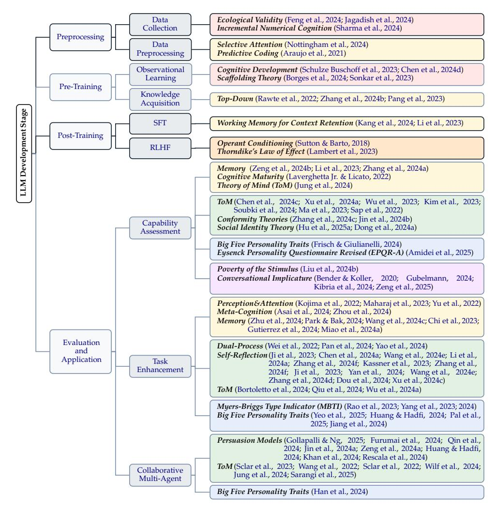

# The Mind in the Machine: A Survey of Incorporating Psychological Theories in LLMs

Zizhou Liu\*, Ziwei Gong\*, Lin Ai\*, Zheng Hui\*, Run Chen\*, Colin Wayne Leach, Michelle R. Greene, Julia Hirschberg

Department of Computer Science, Columbia University,
Department of Psychology, Barnard College,

{sara.ziweigong, lin.ai, runchen, julia}@cs.columbia.edu, {cleach, mgreene}@barnard.edu,{zl2889, zh2483}@columbia.edu

#### **Abstract**

Psychological insights have long shaped pivotal NLP breakthroughs, including the cognitive underpinnings of attention mechanisms, formative reinforcement learning, and Theory of Mind-inspired social modeling. As Large Language Models (LLMs) continue to grow in scale and complexity, there is a rising consensus that psychology is essential for capturing human-like cognition, behavior, and interaction. This paper reviews how psychological theories can inform and enhance stages of LLM development, including data, pre-training, post-training, and evaluation&application. Our survey integrates insights from cognitive, developmental, behavioral, social, personality psychology, and psychological theories are applied. By examining both cross-domain connections and points of tension, we aim to bridge disciplinary divides and promote more thoughtful integration of psychology into future NLP research.

#### 1 Introduction

As Large Language Models (LLMs) grow in scale and complexity, the Natural Language Processing (NLP) community is increasingly recognizing psychology as essential for capturing human-like cognition, behavior, and interaction (Qu et al., 2024; Lewis, 2025). Psychology, grounded in empirically validated and computationally adaptable frameworks (Sartori & Orrù, 2023; Ong, 2024), can address core LLM challenges such as reasoning fidelity, context retention, and user interaction. Reflecting these strengths, psychological insights have long shaped pivotal NLP advances, including the cognitive inspirations of attention mechanisms, formative reinforcement learning approaches, and Theory of Mindinspired social modeling.

Despite extensive multidisciplinary efforts, a holistic review systematically integrating psychology across the LLM lifecycle remains missing. Most surveys and position papers remain fragmented, typically falling into three broad categories: (1) Some investigate how LLMs can empower traditional psychology or cognitive science research, for instance by modeling human reasoning and behavior at scale (Demszky et al., 2023; Abdurahman et al., 2024; Ong, 2024; Ke et al., 2024). (2) Others approach LLMs as subjects of psychological analysis, aiming to adapt or extend psychological theory – such as personality or cognition frameworks – to interpret and evaluate model behavior (Li et al., 2024b; Hagendorff et al., 2023; tse Huang et al., 2024; Pellert et al., 2024). (3) Finally, a third group leverages a single or limited set of psychological constructs to enhance model alignment or multi-agent frameworks – improving system reliability, social interaction, and trustwor-

&lt;sup>†The Language Technology Lab, University of Cambridge

\*Equal contributions.

thiness [\(Liu et al.,](#page-20-0) [2023](#page-20-0); [Dong et al.,](#page-13-1) [2024b\)](#page-13-1). This includes research on social influence for AI safety [\(Zeng et al.](#page-31-0), [2024a\)](#page-31-0), moral reasoning in legal tasks [\(Almeida et al.](#page-10-1), [2024](#page-10-1)), and partial integrations of social or developmental psychology [\(Sartori & Orr `u](#page-25-0), [2023;](#page-25-0) [Zhang et al.,](#page-32-0) [2024c;](#page-32-0) [Serapio-Garc´ıa et al.,](#page-25-1) [2025](#page-25-1)). However, no existing work provides a unified map of how diverse psychological sub-areas can be harnessed, from data through application. Our survey fills this gap by offering a stage-wise view of how psychology can strengthen LLM capabilities and alignment across the entire lifecycle.

To address this gap, we present a structured review that situates **psychological theories from six major areas** across the entire LLM development pipeline. Drawing on research from multiple NLP and AI conferences[1](#page-1-0) , our contributions are twofold: **(1)** We systematically review psychological theories applied in key stages of LLM development, identifying gaps and inconsistencies. **(2)** We highlight under-explored concepts alongside critical issues and debates at the intersection of psychology and NLP. Collectively, these contributions demonstrate how integrating diverse psychological frameworks can strengthen LLM design, enhance alignment, and broaden the practical and ethical impact of modern NLP systems.

As shown in Figure [1,](#page-2-0) the remainder of this paper illustrates how cognitive, developmental, behavioral, social, psycholinguistic, and personality theories integrate into **four key stages of LLM development**: preprocessing (Section [2\)](#page-1-1), pre-training (Section [3\)](#page-2-1), post-training (Section [4\)](#page-3-0), and evaluation and application (Section [5\)](#page-3-1). Finally, Section [6](#page-7-0) examines three overarching questions: *How does current LLM development leverage psychological theories? Which untapped psychological insights could advance LLM development? And what debates loom at the intersection of NLP and psychology?*

# **2 Preprocessing**

We begin our stage-by-stage analysis of LLM development with preprocessing, the foundation that shapes downstream capabilities. During data collection and processing, psychology provides valuable frameworks into human learning and filtering, underscoring the need for realistic, developmentally informed datasets and effective filtering strategies.

**Data Collection** Recent evidence shows that LLMs can align with human brain responses under biologically plausible training conditions [\(Hosseini et al.,](#page-16-0) [2024](#page-16-0)), despite LLMs typically requiring orders of magnitude more training data than humans receive. This supports the application of *ecological validity* [\(Schmuckler](#page-25-2), [2001\)](#page-25-2) that *emphasizes real-world data to mimic cognitive development*. Drawing from this principle, [Jagadish et al.](#page-17-0) [\(2024\)](#page-17-0) selects linguistically diverse environments to reflect children's language acquisition processes, while [Feng et al.](#page-14-0) [\(2024](#page-14-0)) utilizes child-directed speech to mirror naturalistic learning contexts. In parallel, developmental theories like *incremental numerical understanding* [\(Piaget](#page-23-1), [2013\)](#page-23-1) that *views numerical concepts as gradually acquired through exposure* offer insights into sequential data organization. Applying this framework, [Sharma et al.](#page-25-3) [\(2024\)](#page-25-3) introduces mathematically coherent numeric anchors to align the collection process.

**Data Preprocessing** Data preprocessing inspired by cognitive psychology involves refining data to enhance informational coherence prior to training. *Selective attention* [\(Treisman,](#page-28-1) [1969](#page-28-1)) – distinct from the attention mechanisms in transformers – *prioritizes cognitively salient information while filtering out irrelevant stimuli*. Implementing this principle, [Nottingham et al.](#page-22-1) [\(2024](#page-22-1)) develops a preprocessing model that identifies and filters irrelevant data. Meanwhile, *predictive coding* [\(Rao & Ballard,](#page-24-1) [1999\)](#page-24-1) proposes *anticipatory processing based on prior knowledge*, providing a framework for structuring sequential information. Leveraging this insight, [Araujo et al.](#page-10-2) [\(2021\)](#page-10-2) structures sentences to enable anticipation of subsequent content, improving semantic coherence through expectation-driven processing.

1We survey 175 papers from major \*CL venues (ACL Anthology), plus COLING, NeurIPS, ICML, ICLR, and influential arXiv preprints from late 2021 to early 2025 via keyword search.

Figure 1: Our structured survey of how psychological theories apply across the main stages of LLM development. Colors indicate six distinct psychology areas: red for *Developmental Psychology* ; orange for *Behavioral Psychology* ; yellow for *Cognitive Psychology* ; green for *Social Psychology* ; blue for *Personality Psychology* ; purple for *Psycholinguistics* .

# **3 Pre-Training**

Building on the foundations established during preprocessing, pre-training in LLMs mirrors aspects of human cognitive development, where core linguistic and reasoning abilities emerge through exposure to stimuli. This section explores how psychological insights inform observational learning and knowledge acquisition in LLMs.

**Observational Learning and Self-Supervision** *Incremental cognitive development* [\(Piaget](#page-23-3), [1976\)](#page-23-3), which posits *children acquire knowledge through sequential tasks*, informs how LLMs can master nuanced concepts with explicit structured exposure. This principle manifests in [Schulze Buschoff et al.](#page-25-4) [\(2023\)](#page-25-4)'s gradually expanding pre-training tasks and [Chen et al.](#page-12-0) [\(2024d\)](#page-12-0)'s use of contradictory historical tasks for conceptual restructuring. Additionally, *scaffolding theory* [\(Park & Reuter-Lorenz,](#page-23-4) [2009](#page-23-4)), which *emphasizes gradually challenging interactions*, addresses the challenge of maintaining coherent learning trajectories – demonstrated by [Borges et al.](#page-11-2) [\(2024\)](#page-11-2)'s structured feedback loops and [Sonkar et al.](#page-26-0) [\(2023\)](#page-26-0)'s dynamic adjustment of task complexity based on performance metrics.

**World Knowledge Acquisition** Semantic coherence during pre-training draw insights from *top-down and bottom-up perception* [\(Gregory,](#page-15-4) [1997\)](#page-15-4), which *frames cognition as interaction between conceptual frameworks and detailed data*. Top-down processing is leveraged to prioritize high-level semantic processing before syntactic details [\(Rawte et al.,](#page-24-6) [2022\)](#page-24-6) and to generate test case [\(Zhang et al.](#page-32-3), [2024b\)](#page-32-3). Meanwhile, [Pang et al.](#page-23-5) [\(2023\)](#page-23-5) fuses granular bottom-up encoding with top-down corrections for document summarization.

# **4 Post-Training and Alignment**

With foundational knowledge acquired in pre-training, post-training refines LLMs from general proficiency to task-specific, goal-oriented behavior. We explore how psychology guide post-training setups for more context-aware, interpretable, and human-aligned outcomes.

**Supervised Fine-Tuning (SFT)** In SFT, works that draw on psychological insights focus on retaining contextual information. Building on *working memory theory* [\(Baddeley & Hitch,](#page-11-3) [1974b\)](#page-11-3) that proposes *a short-term system for temporarily holding information*, [Kang et al.](#page-18-1) [\(2024\)](#page-18-1) adds a module into Decision Transformers, enabling LLMs to retain and process short-term information. Beyond retaining, [Li et al.](#page-19-2) [\(2023\)](#page-19-2) proposes a working memory approach that dynamically balances stored information with provided contexts for SFT.

**Reinforcement Learning from Human Feedback (RLHF)** A classic behavioral theory, the *Operant Conditioning theory* posits that *behaviors are systematically strengthened or weakened by the consequences (rewards or punishments) that immediately follow them* [\(Thorndike](#page-27-2), [1898;](#page-27-2) [Skinner,](#page-26-1) [1957\)](#page-26-1). The principles of reinforcement learning align closely with this psychological framework, particularly in the post-training phase of LLM development, where RLHF explicitly operationalizes *Operant Conditioning theory* to align model behaviors with human values and preferences. Through repeated feedback, the model gradually adapts to favor outputs that consistently yield higher reward signals, thereby aligning closer with human preferences – reflecting *Thorndike's Law of Effect*, which asserts that *behaviors followed by satisfying outcomes are more likely to recur* [\(Lambert et al.,](#page-19-5) [2023\)](#page-19-5). During RLHF, the model generates responses, and a learned reward function *R*(*x*) assigns scores to outputs *x*, guiding subsequent policy updates. For instance, [Ouyang et al.](#page-22-4) [\(2022\)](#page-22-4) train InstructGPT using Proximal Policy Optimization [\(Schulman et al.](#page-25-9), [2017](#page-25-9)), rewarding responses preferred by humans and penalizing less desirable ones. Foundational frameworks [\(Christiano et al.](#page-13-4), [2017;](#page-13-4) [Sutton & Barto](#page-27-0), [2018;](#page-27-0) [Stiennon et al.](#page-27-3), [2022\)](#page-27-3) established methods for explicitly translating human judgments into reward signals, operationalizing the insights of *Operant Conditioning*. More recent work incorporates human cognitive biases [\(Siththaranjan et al.](#page-26-2), [2024](#page-26-2)) and personalizes reward functions for individual values [\(Poddar et al.,](#page-23-6) [2024\)](#page-23-6). These developments illustrate how *Operant Conditioning* remains central to aligning LLMs with nuanced human values. While our survey focuses on psychological dimensions, a technical overview of RLHF methods is provided in Appendix [B.](#page-34-0)

# **5 Evaluation and Application**

In the evaluation and application stage of LLM development, psychology offers valuable tools for both assessing and enhancing model behavior. In this section, we review three key areas of challenges where psychology can inform this stage: **(1)** evaluating emergent capabilities such as reasoning, **(2)** improving task performance in domains involving human cognition, and **(3)** designing socially aware, multi-agent systems.

#### **5.1 Benchmarks and Capability Assessment**

Evaluating LLMs with psychologically grounded metrics offers a deeper window into their real-world viability. By mapping classic theories onto benchmarks that probe model responses under diverse, human-like scenarios, researchers can move beyond surface-level

performance measures, revealing emergent model behavior and illuminating strengths, blind spots, and opportunities to refine LLM training and alignment practices.

#### *5.1.1 Social Reasoning and Intelligence*

Social intelligence is vital for LLMs that navigate human contexts, enabling the interpretation of implicit cues, adaptation to social norms, and authentic interaction – defining advanced AI beyond mere text prediction. As LLMs increasingly mediate communication, their grasp of social dynamics becomes pivotal for both efficacy and safety.

Notably, *Theory of Mind (ToM)* offers a framework for evaluating *how individuals understand and attribute mental states – such as beliefs, desires, and intentions – to others* [\(Baron-Cohen et al.](#page-11-4), [1985\)](#page-11-4). By measuring an LLM's capacity to represent and reason about beliefs, researchers can assess core social intelligence. Recent benchmarks include *ToMBENCH* [\(Chen et al.](#page-12-1), [2024c\)](#page-12-1), *OpenToM* [\(Xu et al.,](#page-30-0) [2024a\)](#page-30-0), *HI-TOM* [\(Wu et al.,](#page-29-0) [2023\)](#page-29-0), and *FANTOM* [\(Kim et al.](#page-18-2), [2023\)](#page-18-2), each probing distinct facets of *ToM*. Extending these efforts to spoken dialogues, [Soubki et al.](#page-27-1) [\(2024\)](#page-27-1) reveal lingering gaps between LLM and human performance. Surveys [\(Ma et al.,](#page-20-1) [2023](#page-20-1); [Sap et al.](#page-25-5), [2022\)](#page-25-5) then consolidate methods and underscore the challenges of building robust *ToM*-based evaluations.

Beyond individual cognition, social influence theories, such as *Conformity Theories*, capture *how group pressure shapes individual judgments* [\(Asch,](#page-11-5) [2016](#page-11-5)). Recent work tests LLMbased agents' collaboration and bias dynamics under these principles [\(Zhang et al.](#page-32-0), [2024c;](#page-32-0) [Jin et al.](#page-17-1), [2024b\)](#page-17-1), bridging individual and group-level cognition.

Emotion recognition is another pillar of social intelligence. *Ekman's Basic Emotion Theory* [\(Ekman](#page-13-5), [1992\)](#page-13-5) identifies six universal emotions, often used for labeling [\(Gong et al.](#page-14-4), [2024\)](#page-14-4), while *Dimensional Models* like the *Circumplex Model* conceptualize emotions along valence and arousal [\(Morrill et al.,](#page-22-5) [2024\)](#page-22-5). LLMs increasingly excel at emotion recognition, benefitting dialogue and sentiment tasks [\(Zhang et al.](#page-32-4), [2024e;](#page-32-4) [Wu et al.,](#page-29-5) [2024c](#page-29-5)[;d](#page-29-6); [Sabour et al.,](#page-24-7) [2024\)](#page-24-7).

These efforts collectively demonstrate both progress and limitations in LLMs' social cognition, establishing benchmarks against which future developments can be measured.

#### *5.1.2 Language Proficiency*

Recent work adopts psycholinguistic assessments, originally designed for humans, to test LLMs' language proficiency. These experiments probe a wide range of linguistic domains: morphology [\(Anh et al.](#page-10-3), [2024\)](#page-10-3), syntax [\(Liu et al.,](#page-20-3) [2024b;](#page-20-3) [Hale & Stanojevi´c](#page-15-5), [2024\)](#page-15-5), phonology [\(Duan et al.,](#page-13-6) [2025\)](#page-13-6), semantics [\(Duan et al.](#page-13-6), [2025;](#page-13-6) [Hayashi,](#page-15-6) [2025\)](#page-15-6) and their interactions [\(Miaschi et al.,](#page-21-1) [2024;](#page-21-1) [Zhou et al.](#page-32-5), [2025](#page-32-5)).

Although LLMs exhibit comparable performance to human speakers on many psycholinguistic tasks, the underlying processing mechanism they rely on may seem different from humans [\(Lee et al.,](#page-19-6) [2024\)](#page-19-6). Human language acquisition is often characterized by the *Poverty of the Stimulus*, i.e. *children acquire complex grammar from relatively little input* [\(Chomsky](#page-13-7), [1980\)](#page-13-7), whereas LLMs typically require developmentally implausible amounts of linguistic data to learn morphological rules. On the other hand, some evidence suggests that the learning patterns of LLMs mirror aspects of human language acquisition [\(Liu et al.,](#page-20-3) [2024b\)](#page-20-3).

Several studies have explored the pragmatic abilities of LLMs, motivated by the close link between language and broader cognitive functions in humans. *[Grice](#page-15-7) [\(1975](#page-15-7))'s Theory of conversational implicature* posits that *utterance interpretation depends on both literal content and surrounding context*. Researchers [\(Bender & Koller](#page-11-0), [2020;](#page-11-0) [Gubelmann](#page-15-1), [2024](#page-15-1)) have contrasting perspectives on LLMs with respect to the [Harnad](#page-15-8) [\(1990\)](#page-15-8)'s *Symbol Grounding Problem*, i.e. *linguistic symbols must be grounded in sensorimotor interactions to be meaningful*. Failures of LLMs in pragmatic and semantic tasks [\(Kibria et al.,](#page-18-3) [2024;](#page-18-3) [Zeng et al.,](#page-31-3) [2025\)](#page-31-3), as well as their neuron patterns [\(Wu et al.,](#page-29-7) [2024b\)](#page-29-7), point to limitations beyond pure linguistic knowledge, which potentially parallel human higher-level cognitive processes.

#### *5.1.3 Memory and Cognitive Evaluation*

Assessing memory and cognition is crucial given LLMs' limited capacity and risk of catastrophic forgetting. *Cognitive load* is measured by [Xu et al.](#page-30-6) [\(2024b\)](#page-30-6) on jail-breaking and [Zeng et al.](#page-31-1) [\(2024b](#page-31-1)) on memorization patterns. *Memory* is measured by [Li et al.](#page-19-2) [\(2023](#page-19-2)) on parametric knowledge, by [Zhang et al.](#page-31-2) [\(2024a\)](#page-31-2) on n-back tasks and by [Timkey & Linzen](#page-27-4) [\(2023\)](#page-27-4) on capacity. Meanwhile, cognitive development and reasoning capabilities have been assessed through *cognitive maturity* [\(Laverghetta Jr. & Licato,](#page-19-3) [2022\)](#page-19-3), *subjective similarity* [\(Malloy et al.,](#page-21-2) [2024](#page-21-2)), reasoning strategies [\(Mondorf & Plank](#page-21-3), [2024;](#page-21-3) [Yuan et al.](#page-31-6), [2023\)](#page-31-6), *decision-making* [\(Ying et al.](#page-31-7), [2024\)](#page-31-7), and *ToM* [\(Jung et al.](#page-17-5), [2024](#page-17-5)).

#### *5.1.4 Personality Capability*

Personality consistency examines how stably LLMs maintain traits across contexts. [Frisch & Giulianelli](#page-14-1) [\(2024\)](#page-14-1) show LLMs with asymmetric profiles vary in *Big Five* traits – *Openness, Conscientiousness, Extraversion, Agreeableness, Neuroticism*, while [Amidei et al.](#page-10-4) [\(2025\)](#page-10-4) find language switching alters GPT-4o's traits on the *Eysenck Personality Questionnaire Revised*, underscoring challenges in preserving stable traits and reducing context dependence. Parallel research examines how LLMs display and control personality traits. [Jiang et al.](#page-17-3) [\(2024\)](#page-17-3) show LLMs can express distinct *Big Five* traits recognized by human evaluators. [Mao et al.](#page-21-4) [\(2024\)](#page-21-4) introduce PersonalityEdit, revealing difficulties in maintaining consistent alignment for *Neuroticism*, *Extraversion*, and *Agreeableness*, while [Hu & Collier](#page-16-2) [\(2024\)](#page-16-2) find persona-based prompting improves annotation accuracy.

#### *5.1.5 Bias and Ethics Evaluation*

Evaluating biases and ethical risks is crucial for responsible AI that avoids reinforcing harmful social patterns. As LLMs increasingly shape public discourse, thorough assessments are essential to prevent discriminatory outputs and promote equitable benefits across diverse communities. Recent work tests LLMs on gender [\(Oba et al.,](#page-22-6) [2024;](#page-22-6) [Zhao et al.](#page-32-6), [2024\)](#page-32-6), broader social biases [\(Shin et al.](#page-26-3), [2024;](#page-26-3) [Lee et al.,](#page-19-7) [2023](#page-19-7); [Nozza et al.,](#page-22-7) [2022\)](#page-22-7), toxic content [\(Gehman et al.,](#page-14-5) [2020;](#page-14-5) [Luong et al.,](#page-20-4) [2024;](#page-20-4) [Hui et al.,](#page-16-3) [2024\)](#page-16-3), and harmful stereotypes [\(Shrawgi et al.](#page-26-4), [2024;](#page-26-4) [Huang & Xiong,](#page-16-4) [2024;](#page-16-4) [Grigoreva et al.,](#page-15-9) [2024\)](#page-15-9), establishing benchmarks across cultures and languages. Evidence also suggests that LLMs replicate social identity biases, mirroring human tendencies toward ingroup favoritism and outgroup hostility [\(Hu et al.,](#page-16-5) [2025a;](#page-16-5) [Dong et al.](#page-13-8), [2024a\)](#page-13-8) – patterns central to *social identity theory*, which posits that *group membership shapes self-concept and intergroup behavior* [\(Tajfel,](#page-27-5) [1979\)](#page-27-5).

#### **5.2 Task Performance Enhancement**

Building on the benchmarks, we review how psychological insights boost LLM task performance. We highlight techniques that enhance complex reasoning and enrich dialogue, illustrating how psychology improves capabilities and alignment across applications.

#### *5.2.1 Reasoning Enhancement*

LLMs often struggle with complex reasoning – social inference [\(Liu et al.,](#page-20-5) [2024a\)](#page-20-5), logical errors [\(Turpin et al.,](#page-28-4) [2023](#page-28-4); [McKenna et al.](#page-21-5), [2023\)](#page-21-5), hallucinations [\(Huang et al.](#page-16-6), [2025;](#page-16-6) [Ai et al.,](#page-10-5) [2024a\)](#page-10-5), and multi-step planning [\(Wang et al.,](#page-28-5) [2024a\)](#page-28-5). Psychological theories of human cognition offer frameworks to address these issues by implementing analogous cognitive mechanisms. For instance, *Dual-process theories*, a social cognition framework, *distinguish between fast (System 1) and slow (System 2) reasoning* [\(Kahneman,](#page-18-7) [2011\)](#page-18-7), offering a blueprint for LLM improvement. Chain-of-thought prompting [\(Wei et al.,](#page-29-1) [2022\)](#page-29-1) operationalizes System 2 via intermediate steps, while DynaThink [\(Pan et al.](#page-22-2), [2024\)](#page-22-2) dynamically selects rapid or thorough inference. Tree of Thoughts [\(Yao et al.](#page-30-1), [2024](#page-30-1)) further explores multiple reasoning paths concurrently.

Similarly, *Self-reflection* – *introspection focused on the self-concept* [\(Phillips,](#page-23-7) [2020](#page-23-7)) – has guided LLM enhancements in hallucination mitigation [\(Ji et al.](#page-17-2), [2023\)](#page-17-2), translation

[\(Chen et al.,](#page-12-2) [2024a](#page-12-2); [Wang et al.](#page-29-2), [2024e\)](#page-29-2), question-answering [\(Li et al.,](#page-19-4) [2024a](#page-19-4); [Zhang et al.,](#page-32-1) [2024f;](#page-32-1) [Kassner et al.,](#page-18-5) [2023\)](#page-18-5), and math reasoning [\(Zhang et al.](#page-32-1), [2024f\)](#page-32-1). Approaches include iterative self-assessment [\(Ji et al.](#page-17-2), [2023;](#page-17-2) [Yan et al.](#page-30-2), [2024\)](#page-30-2), task decomposition [\(Wang et al.,](#page-29-2) [2024e;](#page-29-2) [Zhang et al.](#page-32-2), [2024d\)](#page-32-2), reflection-driven self-training [\(Dou et al.](#page-13-3), [2024\)](#page-13-3), and confidence-tuned reward functions [\(Xu et al.,](#page-30-3) [2024c\)](#page-30-3). Additionally, *ToM* adaptations boost LLMs' interpersonal reasoning, aiding missing knowledge inference [\(Bortoletto et al.,](#page-11-1) [2024\)](#page-11-1), common ground alignment [\(Qiu et al.,](#page-24-2) [2024\)](#page-24-2), and cognitive modeling [\(Wu et al.,](#page-29-3) [2024a\)](#page-29-3).

Beyond social reasoning, *Perception, Attention, and Memory* support coherence and retrieval. [Kojima et al.](#page-18-4) [\(2022\)](#page-18-4) uses "Let's think step by step" prompts for *top-down* reasoning. [Maharaj et al.](#page-20-2) [\(2023\)](#page-20-2); [Yu et al.](#page-31-4) [\(2022\)](#page-31-4) leverages *selective attention* to detect hallucinations and extract relation. [Zhu et al.](#page-33-0) [\(2024\)](#page-33-0) employs recitation for retrieval, and [Park & Bak](#page-23-2) [\(2024\)](#page-23-2) introduce separate short- and long-term memory modules. Finally, [Wang et al.](#page-28-2) [\(2024c\)](#page-28-2); [Chi et al.](#page-13-2) [\(2023](#page-13-2)) improve complex reasoning via *symbolic* and *adaptive memory* structures.

Another challenge is multi-step reasoning with external knowledge, as in retrievalaugmented generation (RAG). *Hippocampal indexing theory* [\(Teyler & DiScenna,](#page-27-6) [1986\)](#page-27-6), *viewing the hippocampus as a pointer to neocortical memory*, enhances RAG [\(Gutierrez et al.](#page-15-2), [2024\)](#page-15-2) and counterfactual reasoning [\(Miao et al.](#page-21-0), [2024a\)](#page-21-0). Meanwhile, *selfreflection and meta-cognition* [\(Phillips](#page-23-7), [2020;](#page-23-7) [Flavell](#page-14-6), [1979](#page-14-6)), *supporting iterative introspection*, improve retrieval [\(Asai et al.,](#page-11-6) [2024\)](#page-11-6) and multi-step inference [\(Zhou et al.](#page-32-7), [2024](#page-32-7)).

#### *5.2.2 Dialogue Understanding and Generation*

**Dialogue understanding** is a key area where personality psychology aids trait-based inferences from user interactions. NLP research has explored dynamic ways to measure personality beyond structured tests. The *Myers–Briggs Type Indicator (MBTI)*, *a selfreport questionnaire that makes pseudo-scientific claims to categorize individuals into 16 distinct personality types*, remains popular [\(Rao et al.,](#page-24-3) [2023;](#page-24-3) [Yang et al.,](#page-30-4) [2023\)](#page-30-4), while PsychoGAT [\(Yang et al.,](#page-30-5) [2024\)](#page-30-5) gamifies *MBTI*, and *PADO* [\(Yeo et al.,](#page-31-5) [2025\)](#page-31-5) adopts a *Big Five*-based multi-agent approach. Beyond assessments, traits guide dialogue generation: [Huang & Hadfi](#page-16-1) [\(2024\)](#page-16-1) show higher agreeability improves negotiation, while [Cheng et al.](#page-13-9) [\(2023\)](#page-13-9) reveal social and racial biases in persona creation, raising representational concerns.

**Dialogue generation** research further incorporates personality to improve coherence, empathy, and consistency. [Pal et al.](#page-22-3) [\(2025](#page-22-3)); [Chen et al.](#page-12-3) [\(2025a](#page-12-3)) leveraged Reddit-based journal entries to model *Big Five* traits in large-scale dialogue datasets. Other efforts improve persona consistency without referencing explicit psychological theory [\(Wu et al.,](#page-29-8) [2025b;](#page-29-8) [Takayama et al.](#page-27-7), [2025\)](#page-27-7). Similarly, personality is used to improve truthfulness, consistency, and context-aware generation in LLMs, as further detailed in Appendix [C.](#page-37-0) These approaches support personality alignment but lack grounding in deeper psychological theory.

#### **5.3 Collaborative and Multi-Agent Frameworks**

Beyond task-specific capabilities, the surge in multi-agent LLM frameworks reflects a growing emphasis on collaborative decision-making – where modeling social dynamics is crucial. Social and personality psychology theories offer key insights into designing agent interaction, negotiation, and consensus, guiding more socially intelligent LLM systems.

**Social Influence** *Persuasion models* [\(Petty & Cacioppo,](#page-23-8) [2012\)](#page-23-8) illustrate *how central or peripheral routes shape attitudes in collaborative settings*. Leveraging this, [Gollapalli & Ng](#page-14-2) [\(2025\)](#page-14-2) merges persuasive dialog acts with reinforcement learning, [Furumai et al.](#page-14-3) [\(2024\)](#page-14-3) combines LLM strategies and retrieval, [Qin et al.](#page-24-4) [\(2024](#page-24-4)); [Jin et al.](#page-17-4) [\(2024a\)](#page-17-4) emphasize credibility-aware generation, and [Zeng et al.](#page-31-0) [\(2024a\)](#page-31-0) uncovers LLM vulnerabilities. Multiagent research simulates personality-driven negotiation [\(Huang & Hadfi](#page-16-1), [2024](#page-16-1); [Hu et al.,](#page-16-7) [2025b\)](#page-16-7), boosts truthfulness via structured debates [\(Khan et al.,](#page-18-6) [2024](#page-18-6)), and curates argument-strength datasets [\(Rescala et al.](#page-24-5), [2024\)](#page-24-5).

**Social Cognition** *ToM* complements social influence by enabling agents to grasp others' mental states. Some efforts integrate belief tracking [\(Sclar et al.](#page-25-6), [2023\)](#page-25-6) and coordination [\(Wang et al.,](#page-28-3) [2022;](#page-28-3) [Sclar et al.,](#page-25-7) [2022\)](#page-25-7), while recent approaches [\(Wilf et al.](#page-29-4), [2024](#page-29-4); [Jung et al.,](#page-17-5) [2024\)](#page-17-5) refine *ToM* via task decomposition and recursive simulation [\(Sarangi et al.,](#page-25-8) [2025\)](#page-25-8).

**Role-Play and Multi-Agent Simulation** Recent work on persona-driven LLM agents focuses on simulating diverse perspectives, persona alignment, and socially intelligent interactions. [Han et al.](#page-15-3) [\(2024\)](#page-15-3) introduce **PSYDIAL** (*Big Five*-based Extraversion), [Castricato et al.](#page-12-4) [\(2025\)](#page-12-4) present **PERSONA** (1,586 synthetic personas), and [Wu et al.](#page-29-9) [\(2025a\)](#page-29-9) release the **RAIDEN Benchmark** (40K multi-turn dialogues). Agents also model opinion dynamics [\(Wang et al.,](#page-28-6) [2025\)](#page-28-6) and evaluate social intelligence [\(Chen et al.](#page-12-5), [2024b\)](#page-12-5), with **RoleLLM** [\(Wang et al.](#page-28-7), [2024b\)](#page-28-7), **Character100** [\(Wang et al.](#page-28-8), [2024d](#page-28-8)), and persona-aware graph transformers [\(Mahajan & Shaikh](#page-20-6), [2024\)](#page-20-6) further supporting multi-party simulations. Additionally, [Kumarage et al.](#page-18-8) [\(2025](#page-18-8)) simulate multi-turn social engineering attacks with LLM agents of varied personality traits, highlighting how psychological profiles shape user vulnerability and the need for more robust defenses against personalized manipulation.

# **6 Trends and Discussion**

#### **6.1 How Does Current LLM Development Harness Psychological Theories?**

From the review from Section [2-](#page-1-1)[5,](#page-3-1) we observe psychological theories have been incorporated into LLM development in stage-specific ways, with uneven coverage across theoretical domains. Figure [1](#page-2-0) maps this integration across the development stages.

In early stages, data selection and pretraining, **developmental psychology** is often referenced. Its emphasis on staged learning and knowledge acquisition aligns with curriculum learning and progressive data exposure, mirroring human developmental trajectories. In post-training, especially RLHF, **behavioral psychology** ideas are most prominent. Conditioning, reinforcement schedules, and reward design are commonly used to guide model alignment with human preferences. In evaluation and application, theories from **social psychology**, **personality psychology**, and **psycholinguistics** are commonly cited, reflecting a focus on interaction patterns, user modeling, and linguistic variation – areas traditionally explored within these sub-fields. Their prominence in later stages aligns with their emphasis on human-centered communication. **Cognitive psychology** appears across all stages, particularly in modeling internal mechanisms such as reasoning, memory, and attention. Its breadth makes it a foundational influence, though less visible in agentic interaction settings.

*The observed unevenness in integration reflects, perhaps a gap, but more probably a functional alignment* – some psychological domains are naturally better suited for certain stages of model development. Meanwhile, these trends expose under-explored opportunities, which motivate the research questions that follow.

#### **6.2 What Untapped Psychological Insights Could Advance LLM Development?**

Although psychological theory is increasingly applied in LLM research, its use remains simplified and uneven. As shown in Tables [1,](#page-34-1) [2,](#page-35-0) and [3,](#page-36-0) many theories are under-utilized despite their potential to improve model behavior and interpretability. Below, we outline theories in four key areas that deserve greater attention in future LLM research.

**Social psychology** remains underutilized in areas like *group dynamics* and *self and identity*, limiting personalization, adaptability, and inclusivity. Prompting LLMs to adopt specific social identities can reduce bias [\(Dong et al.](#page-13-8), [2024a\)](#page-13-8) and mirror human-like ingroup favoritism [\(Hu et al.,](#page-16-5) [2025a\)](#page-16-5). Incorporating social identity frameworks could enhance user alignment in identity-sensitive contexts [\(Chen et al.,](#page-12-6) [2020\)](#page-12-6). Likewise, while bias detection is common, classic *social influence theories* (e.g., conformity, obedience) and *attitude change theories* (e.g., balance theory, cognitive dissonance) are rarely applied to interaction dynamics or bias mitigation, despite their relevance to ethical and socially adaptive behavior. Additionally, malicious actors leveraging social influence can severely undermine trust in digital spaces [\(Zeng et al.](#page-31-0), [2024a](#page-31-0); [Liu et al.,](#page-19-8) [2025](#page-19-8); [Ai et al.](#page-10-6), [2024b](#page-10-6)), highlighting the potential of constructs like *inoculation theory* to proactively guard against manipulative strategies.

**Behavioral psychology** inspires RLHF, yet key concepts like *partial reinforcement*, which improves behavior persistence [\(Ferster](#page-14-7), [1966;](#page-14-7) [Jensen,](#page-17-6) [1961](#page-17-6)), and *shaping*, which supports gradual learning through successive approximations [\(Love et al.,](#page-20-7) [2009\)](#page-20-7), are overlooked. Current RLHF relies on uniform rewards, yet behavioral theory warns that flawed rewards can lead to reward hacking. Adding *reward variability* may reduce premature convergence and improve alignment with human intent [\(Dayan & Daw](#page-13-10), [2008;](#page-13-10) [Amodei et al.,](#page-10-7) [2016\)](#page-10-7).

**Personality Psychology** use focuses on *Trait Theory*, overlooking *developmental theories* that explain how individual traits emerge, evolve, and adapt across contexts. These developmental models could enable more coherent and interpretable personality representations, offering a deeper alternative to static prompt-based personas.

**Cognitive psychology** remains underused, particularly *Schema Theory*, which holds that *humans store knowledge as dynamic, structured representations formed through repeated experience* [\(Anderson & Pearson,](#page-10-8) [1984\)](#page-10-8), guiding inference, memory, and learning. Recent work explores schema-inspired methods for compressing user histories and modeling knowledge activation cycles [\(Panagoulias et al.](#page-23-9), [2024;](#page-23-9) [Xia et al.](#page-30-7), [2024\)](#page-30-7), though these remain peripheral. Further integration may improve long-term context handling and generalization.

#### **6.3 What Debates Loom at the NLP–Psychology Intersection, and Where Next?**

A recurring question is whether human psychology can be directly mapped to LLMs without distortion [\(L ¨ohn et al.,](#page-20-8) [2024\)](#page-20-8). Below, we highlight key controversies at this boundary; see Appendix [D](#page-38-0) for an extended discussion. These challenges motivate new recommendations and highlight open directions for cross-disciplinary exploration.

**Terminology Mismatches** A core tension is the mismatch between psychological terminology and their NLP usage. For example, **attention** in psychology means *selective mental focus*, but in transformers it is a token weighting mechanism without cognitive awareness [\(Lindsay,](#page-19-9) [2020\)](#page-19-9), leading to misleading attributions of intentionality. Similarly, **memory** in psychology entails *structured encoding and recall*, whereas in LLMs it typically refers to context windows or parameters. Such anthropomorphic language is increasingly prevalent and shapes public and scholarly assumptions about LLMs, as recent studies show rising human-like descriptors [\(Ibrahim & Cheng,](#page-17-7) [2025\)](#page-17-7). This calls for disentangling metaphor from mechanism through a precise cross-disciplinary lexicon, preventing both oversimplification and over-anthropomorphization – an underexplored but crucial research challenge.

**Theoretical Discrepancies in Use of Psychology** Beyond terminology, deeper theoretical mismatches arise when the NLP community adopts outdated or disputed concepts from psychology. For instance, *predictive coding* [\(Rao & Ballard,](#page-24-1) [1999\)](#page-24-1) is used to analogize LLMs' next-token prediction, although current research emphasizes hierarchical, multiscale brain mechanisms [\(Antonello & Huth](#page-10-9), [2024](#page-10-9); [Caucheteux et al.](#page-12-7), [2023\)](#page-12-7). Likewise, folkpsychological typologies like *MBTI* persist in LLM applications despite its criticized validity and reliability [\(Pittenger,](#page-23-10) [1993;](#page-23-10) [McCrae & Costa Jr,](#page-21-6) [1989\)](#page-21-6).

*Working memory* [\(Baddeley & Hitch](#page-11-7), [1974a\)](#page-11-7) illustrates another gap: LLM 'memory' modules [\(Kang et al.](#page-18-1), [2024;](#page-18-1) [Li et al.,](#page-19-2) [2023](#page-19-2)) do not replicate human constraints, prompting questions about whether AI should emulate human cognitive limits or exceed them for performance gains. **Behavioral psychology** faces similar critiques [\(Miller,](#page-21-7) [2003;](#page-21-7) [Flavell et al.](#page-14-8), [2022](#page-14-8)), as RLHF often focuses on reward optimization [\(Ouyang et al.,](#page-22-4) [2022;](#page-22-4) [Rafailov et al.](#page-24-8), [2023](#page-24-8); [Ramesh et al.,](#page-24-9) [2024\)](#page-24-9), neglecting internal states and risking reward hacking [\(Skalse et al.](#page-26-5), [2022](#page-26-5); [Krakovna,](#page-18-9) [2020](#page-18-9)). Broader debates remain over whether LLMs

truly **"understand" language** or function as "stochastic parrots" [\(Ambridge & Blything,](#page-10-10) [2024;](#page-10-10) [Park et al.,](#page-23-11) [2024\)](#page-23-11).

In response, we recommend refining how psychological theories are mapped into computational models, replacing outdated constructs with supported frameworks, exploring whether human-like constraints aid interpretability, and designing evaluations that track both outputs and internal states. Sustained collaboration between computational and psychological sciences is essential for robust and theory-aligned LLMs.

**Evaluation and Validity Debates** Another major debate is how we evaluate LLM "psychological" abilities – whether current tests really measure what they claim. For instance, GPT-4 solves around 75% of false-belief tasks, matching a 6-year-old's performance [\(Kosinski](#page-18-10), [2024;](#page-18-10) [Strachan et al.,](#page-27-8) [2024](#page-27-8)); some see emergent *ToM*-like reasoning [\(Kosinski,](#page-18-10) [2024\)](#page-18-10), but others argue it may be pattern matching [\(Strachan et al.,](#page-27-8) [2024](#page-27-8)), noting that minor prompt changes can derail results [\(Shapira et al.](#page-25-10), [2024\)](#page-25-10). This calls for more theorygrounded evaluation and clearer definitions.

A parallel controversy involves **personality**: some studies find stable simulated traits [\(Sorokovikova et al.](#page-27-9), [2024;](#page-27-9) [Huang et al.,](#page-16-8) [2024\)](#page-16-8), while others reveal variability under different prompt conditions [\(Gupta et al.,](#page-15-10) [2024](#page-15-10); [Shu et al.](#page-26-6), [2024\)](#page-26-6), raising questions about inherent vs. mimicked personas [\(Tseng et al.,](#page-28-9) [2024\)](#page-28-9). These debates underscore the need for a systematic, theory-driven framework beyond surface metrics, guiding more faithful replication of human cognition and behavior in LLMs.

# **7 Conclusions**

We systematically review how psychology can ground LLM innovation in both past and future across key subfields: cognitive, developmental, behavioral, social, personality, and psycholinguistic. We examine how psychological theories inform each stage of LLM development, revealing both meaningful connections across domains and critical points of tension, which we explore through discussion to help bridge interdisciplinary gaps. We hope this survey sparks reflection, and inspires future work to continue integrating psychological perspectives into NLP in meaningful and impactful ways.

# **Limitations**

Our survey primarily focuses on literature within NLP, particularly in how personality is modeled, evaluated, and leveraged in LLMs. As a result, we do not extensively cover research from psychology and cognitive sciences that might offer deeper theoretical insights into human-like behaviors in AI. This limitation may exclude valuable methodologies or perspectives that could enhance personality evaluation frameworks for LLMs. We encourage future surveys to integrate findings from psychology and linguistics to bridge theoretical foundations with computational approaches, fostering a more comprehensive understanding of personality in AI systems.

While our survey advocates for a deeper integration of psychology into LLM design, we also caution against the ethical risks posed by overuse or misapplication of psychological principles. A concrete example is *operant conditioning* [\(Skinner](#page-26-1), [1957](#page-26-1)), which describes how behavior can be shaped by consequences. Applied to LLMs – for instance, through timely, gratifying feedback to reinforce engagement – these mechanisms can be beneficial in contexts like language learning or motivation. However, reinforcement schedules such as variable ratio or interval rewards may unintentionally condition users to engage compulsively, raising the risk of manipulative design. This presents a key ethical limitation: distinguishing between genuinely supportive interactions and those that encourage excessive use is inherently difficult. To address this, we emphasize the need for transparent disclosure of reinforcement mechanisms and the establishment of clear ethical guidelines by professional communities. These safeguards are essential to ensure that psychological insights enhance user well-being without enabling exploitative practices.

# **References**

- Suhaib Abdurahman, Mohammad Atari, Farzan Karimi-Malekabadi, Mona J Xue, Jackson Trager, Peter S Park, Preni Golazizian, Ali Omrani, and Morteza Dehghani. Perils and opportunities in using large language models in psychological research. *PNAS nexus*, 3 (7):pgae245, 2024.
- Lin Ai, Zheng Hui, Zizhou Liu, and Julia Hirschberg. Enhancing pre-trained generative language models with question attended span extraction on machine reading comprehension. In Yaser Al-Onaizan, Mohit Bansal, and Yun-Nung Chen (eds.), *Proceedings of the 2024 Conference on Empirical Methods in Natural Language Processing*, pp. 10046–10063, Miami, Florida, USA, November 2024a. Association for Computational Linguistics. doi: 10.18653/v1/2024.emnlp-main.560. URL <https://aclanthology.org/2024.emnlp-main.560/>.
- Lin Ai, Tharindu Sandaruwan Kumarage, Amrita Bhattacharjee, Zizhou Liu, Zheng Hui, Michael S. Davinroy, James Cook, Laura Cassani, Kirill Trapeznikov, Matthias Kirchner, Arslan Basharat, Anthony Hoogs, Joshua Garland, Huan Liu, and Julia Hirschberg. Defending against social engineering attacks in the age of LLMs. In Yaser Al-Onaizan, Mohit Bansal, and Yun-Nung Chen (eds.), *Proceedings of the 2024 Conference on Empirical Methods in Natural Language Processing*, pp. 12880–12902, Miami, Florida, USA, November 2024b. Association for Computational Linguistics. doi: 10.18653/v1/2024. emnlp-main.716. URL <https://aclanthology.org/2024.emnlp-main.716/>.
- Guilherme FCF Almeida, Jos´e Luiz Nunes, Neele Engelmann, Alex Wiegmann, and Marcelo de Ara ´ujo. Exploring the psychology of llms' moral and legal reasoning. *Artificial Intelligence*, 333:104145, 2024.
- Ben Ambridge and Liam Blything. Large language models are better than theoretical linguists at theoretical linguistics. *Theoretical Linguistics*, 50(1-2):33–48, 2024. doi: doi:10.1515/tl-2024-2002. URL <https://doi.org/10.1515/tl-2024-2002>.
- Jacopo Amidei, Jose Gregorio Ferreira De S ´a, Rub´en Nieto Luna, and Andreas Kaltenbrunner. Exploring the impact of language switching on personality traits in LLMs. In Owen Rambow, Leo Wanner, Marianna Apidianaki, Hend Al-Khalifa, Barbara Di Eugenio, and Steven Schockaert (eds.), *Proceedings of the 31st International Conference on Computational Linguistics*, pp. 2370–2378, Abu Dhabi, UAE, January 2025. Association for Computational Linguistics. URL <https://aclanthology.org/2025.coling-main.162/>.
- Dario Amodei, Chris Olah, Jacob Steinhardt, Paul Christiano, John Schulman, and Dan Man´e. Concrete problems in ai safety, 2016. URL <https://arxiv.org/abs/1606.06565>.
- Richard C Anderson and P David Pearson. A schema-theoretic view of basic processes in reading comprehension. *Handbook of reading research*, 1:255–291, 1984.
- Dang Anh, Limor Raviv, and Lukas Galke. Morphology matters: Probing the crosslinguistic morphological generalization abilities of large language models through a wug test. In Tatsuki Kuribayashi, Giulia Rambelli, Ece Takmaz, Philipp Wicke, and Yohei Oseki (eds.), *Proceedings of the Workshop on Cognitive Modeling and Computational Linguistics*, pp. 177–188, Bangkok, Thailand, August 2024. Association for Computational Linguistics. doi: 10.18653/v1/2024.cmcl-1.15. URL <https://aclanthology.org/2024.cmcl-1.15/>.
- Richard Antonello and Alexander Huth. Predictive coding or just feature discovery? an alternative account of why language models fit brain data. *Neurobiology of Language*, 5(1):64–79, 04 2024. ISSN 2641-4368. doi: 10.1162/nol a 00087. URL [https://doi.org/10.1162/nol](https://doi.org/10.1162/nol_a_00087) a 00087.
- Vladimir Araujo, Andr´es Villa, Marcelo Mendoza, Marie-Francine Moens, and Alvaro Soto. Augmenting BERT-style models with predictive coding to improve discourse-level representations. In Marie-Francine Moens, Xuanjing Huang, Lucia Specia, and Scott Wen-tau

- Yih (eds.), *Proceedings of the 2021 Conference on Empirical Methods in Natural Language Processing*, pp. 3016–3022, Online and Punta Cana, Dominican Republic, November 2021. Association for Computational Linguistics. doi: 10.18653/v1/2021.emnlp-main.240. URL <https://aclanthology.org/2021.emnlp-main.240/>.
- Akari Asai, Zeqiu Wu, Yizhong Wang, Avirup Sil, and Hannaneh Hajishirzi. Self-RAG: Learning to retrieve, generate, and critique through self-reflection. In *The Twelfth International Conference on Learning Representations*, 2024. URL <https://openreview.net/forum?id=hSyW5go0v8>.
- Solomon E Asch. Effects of group pressure upon the modification and distortion of judgments. In *Organizational influence processes*, pp. 295–303. Routledge, 2016.
- Alan D Baddeley and Graham Hitch. Working memory. *Psychology of learning and motivation*, 8:47–89, 1974a.
- Alan D. Baddeley and Graham Hitch. Working memory. volume 8 of *Psychology of Learning and Motivation*, pp. 47–89. Academic Press, 1974b. doi: https://doi.org/10.1016/S0079-7421(08)60452-1. URL <https://www.sciencedirect.com/science/article/pii/S0079742108604521>.
- Simon Baron-Cohen. *The science of evil: On empathy and the origins of cruelty*. Basic books, 2012.
- Simon Baron-Cohen, Alan M Leslie, and Uta Frith. Does the autistic child have a "theory of mind"? *Cognition*, 21(1):37–46, 1985.
- Daryl J Bem. Self-perception theory. *Advances in experimental social psychology*, 6, 1972.
- Emily M. Bender and Alexander Koller. Climbing towards NLU: On meaning, form, and understanding in the age of data. In Dan Jurafsky, Joyce Chai, Natalie Schluter, and Joel Tetreault (eds.), *Proceedings of the 58th Annual Meeting of the Association for Computational Linguistics*, pp. 5185–5198, Online, July 2020. Association for Computational Linguistics. doi: 10.18653/v1/2020.acl-main.463. URL <https://aclanthology.org/2020.acl-main.463/>.
- Emily M. Bender, Timnit Gebru, Angelina McMillan-Major, and Shmargaret Shmitchell. On the dangers of stochastic parrots: Can language models be too big? In *Proceedings of the 2021 ACM Conference on Fairness, Accountability, and Transparency*, FAccT '21, pp. 610–623, New York, NY, USA, 2021. Association for Computing Machinery. ISBN 9781450383097. doi: 10.1145/3442188.3445922. URL <https://doi.org/10.1145/3442188.3445922>.
- Beatriz Borges, Niket Tandon, Tanja K¨aser, and Antoine Bosselut. Let me teach you: Pedagogical foundations of feedback for language models. In Yaser Al-Onaizan, Mohit Bansal, and Yun-Nung Chen (eds.), *Proceedings of the 2024 Conference on Empirical Methods in Natural Language Processing*, pp. 12082–12104, Miami, Florida, USA, November 2024. Association for Computational Linguistics. doi: 10.18653/v1/2024.emnlp-main.674. URL <https://aclanthology.org/2024.emnlp-main.674/>.
- Matteo Bortoletto, Constantin Ruhdorfer, Adnen Abdessaied, Lei Shi, and Andreas Bulling. Limits of theory of mind modelling in dialogue-based collaborative plan acquisition. In Lun-Wei Ku, Andre Martins, and Vivek Srikumar (eds.), *Proceedings of the 62nd Annual Meeting of the Association for Computational Linguistics (Volume 1: Long Papers)*, pp. 4856– 4871, Bangkok, Thailand, August 2024. Association for Computational Linguistics. doi: 10.18653/v1/2024.acl-long.266. URL <https://aclanthology.org/2024.acl-long.266/>.
- Meng Cao, Lei Shu, Lei Yu, Yun Zhu, Nevan Wichers, Yinxiao Liu, and Lei Meng. Enhancing reinforcement learning with dense rewards from language model critic. In Yaser Al-Onaizan, Mohit Bansal, and Yun-Nung Chen (eds.), *Proceedings of the 2024 Conference on Empirical Methods in Natural Language Processing*, pp. 9119–9138, Miami, Florida, USA, November 2024. Association for Computational Linguistics. doi: 10.18653/v1/ 2024.emnlp-main.515. URL <https://aclanthology.org/2024.emnlp-main.515/>.

- D.S. Cartwright. *Theories and Models of Personality*. W. C. Brown Company, 1979. ISBN 9780697066244. URL <https://books.google.com/books?id=NQURAQAAIAAJ>.
- Louis Castricato, Nathan Lile, Rafael Rafailov, Jan-Philipp Fr ¨anken, and Chelsea Finn. PER-SONA: A reproducible testbed for pluralistic alignment. In Owen Rambow, Leo Wanner, Marianna Apidianaki, Hend Al-Khalifa, Barbara Di Eugenio, and Steven Schockaert (eds.), *Proceedings of the 31st International Conference on Computational Linguistics*, pp. 11348–11368, Abu Dhabi, UAE, January 2025. Association for Computational Linguistics. URL <https://aclanthology.org/2025.coling-main.752/>.
- Charlotte Caucheteux, Alexandre Gramfort, and Jean-R´emi King. Evidence of a predictive coding hierarchy in the human brain listening to speech. *Nature human behaviour*, 7(3): 430–441, 2023.
- Andong Chen, Lianzhang Lou, Kehai Chen, Xuefeng Bai, Yang Xiang, Muyun Yang, Tiejun Zhao, and Min Zhang. DUAL-REFLECT: Enhancing large language models for reflective translation through dual learning feedback mechanisms. In Lun-Wei Ku, Andre Martins, and Vivek Srikumar (eds.), *Proceedings of the 62nd Annual Meeting of the Association for Computational Linguistics (Volume 2: Short Papers)*, pp. 693–704, Bangkok, Thailand, August 2024a. Association for Computational Linguistics. doi: 10.18653/v1/2024.acl-short. 64. URL <https://aclanthology.org/2024.acl-short.64/>.
- Guanyi Chen, Yinhe Zheng, and Yupei Du. Listener's social identity matters in personalised response generation. In Brian Davis, Yvette Graham, John Kelleher, and Yaji Sripada (eds.), *Proceedings of the 13th International Conference on Natural Language Generation*, pp. 205–215, Dublin, Ireland, December 2020. Association for Computational Linguistics. doi: 10.18653/v1/2020.inlg-1.26. URL <https://aclanthology.org/2020.inlg-1.26/>.
- Hongzhan Chen, Hehong Chen, Ming Yan, Wenshen Xu, Gao Xing, Weizhou Shen, Xiaojun Quan, Chenliang Li, Ji Zhang, and Fei Huang. SocialBench: Sociality evaluation of role-playing conversational agents. In Lun-Wei Ku, Andre Martins, and Vivek Srikumar (eds.), *Findings of the Association for Computational Linguistics: ACL 2024*, pp. 2108–2126, Bangkok, Thailand, August 2024b. Association for Computational Linguistics. doi: 10.18653/v1/2024.findings-acl.125. URL <https://aclanthology.org/2024.findings-acl.125/>.
- Run Chen, Jun Shin, and Julia Hirschberg. Synthempathy: A scalable empathy corpus generated using llms without any crowdsourcing, 2025a. URL <https://arxiv.org/abs/2502.17857>.
- Yuxuan Chen, Wei Wei, Shixuan Fan, Kaihe Xu, and Dangyang Chen. CoMIF: Modeling of complex multiple interaction factors for conversation generation. In Owen Rambow, Leo Wanner, Marianna Apidianaki, Hend Al-Khalifa, Barbara Di Eugenio, and Steven Schockaert (eds.), *Proceedings of the 31st International Conference on Computational Linguistics*, pp. 7355–7366, Abu Dhabi, UAE, January 2025b. Association for Computational Linguistics. URL <https://aclanthology.org/2025.coling-main.492/>.
- Zhuang Chen, Jincenzi Wu, Jinfeng Zhou, Bosi Wen, Guanqun Bi, Gongyao Jiang, Yaru Cao, Mengting Hu, Yunghwei Lai, Zexuan Xiong, and Minlie Huang. ToMBench: Benchmarking theory of mind in large language models. In Lun-Wei Ku, Andre Martins, and Vivek Srikumar (eds.), *Proceedings of the 62nd Annual Meeting of the Association for Computational Linguistics (Volume 1: Long Papers)*, pp. 15959–15983, Bangkok, Thailand, August 2024c. Association for Computational Linguistics. doi: 10.18653/v1/2024.acl-long.847. URL <https://aclanthology.org/2024.acl-long.847/>.
- Ziyang Chen, Dongfang Li, Xiang Zhao, Baotian Hu, and Min Zhang. Temporal knowledge question answering via abstract reasoning induction. In Lun-Wei Ku, Andre Martins, and Vivek Srikumar (eds.), *Proceedings of the 62nd Annual Meeting of the Association for Computational Linguistics (Volume 1: Long Papers)*, pp. 4872–4889, Bangkok, Thailand, August 2024d. Association for Computational Linguistics. doi: 10.18653/v1/2024.acl-long. 267. URL <https://aclanthology.org/2024.acl-long.267/>.

- Myra Cheng, Esin Durmus, and Dan Jurafsky. Marked personas: Using natural language prompts to measure stereotypes in language models. In Anna Rogers, Jordan Boyd-Graber, and Naoaki Okazaki (eds.), *Proceedings of the 61st Annual Meeting of the Association for Computational Linguistics (Volume 1: Long Papers)*, pp. 1504–1532, Toronto, Canada, July 2023. Association for Computational Linguistics. doi: 10.18653/v1/2023.acl-long.84. URL <https://aclanthology.org/2023.acl-long.84/>.
- Ta-Chung Chi, Ting-Han Fan, Alexander Rudnicky, and Peter Ramadge. Transformer working memory enables regular language reasoning and natural language length extrapolation. In Houda Bouamor, Juan Pino, and Kalika Bali (eds.), *Findings of the Association for Computational Linguistics: EMNLP 2023*, pp. 5972–5984, Singapore, December 2023. Association for Computational Linguistics. doi: 10.18653/v1/2023.findings-emnlp. 397. URL <https://aclanthology.org/2023.findings-emnlp.397/>.
- N. Chomsky. *Syntactic Structures*. Janua linguarum (Mouton, Paris).: Series Minor. Mouton, 1957. ISBN 9789027933850. URL <https://books.google.com/books?id=55YaAAAAIAAJ>.
- Noam Chomsky. *Aspects of the Theory of Syntax*. The MIT Press, 50 edition, 1965. ISBN 9780262527408. URL <http://www.jstor.org/stable/j.ctt17kk81z>.
- Noam Chomsky. Rules and representations. *Behavioral and Brain Sciences*, 3(1):1–15, 1980. doi: 10.1017/S0140525X00001515.
- Paul F Christiano, Jan Leike, Tom Brown, Miljan Martic, Shane Legg, and Dario Amodei. Deep reinforcement learning from human preferences. In I. Guyon, U. Von Luxburg, S. Bengio, H. Wallach, R. Fergus, S. Vishwanathan, and R. Garnett (eds.), *Advances in Neural Information Processing Systems*, volume 30. Curran Associates, Inc., 2017. URL https://proceedings.neurips.cc/paper [files/paper/2017/file/d5e2c0adad503c91f91df240d0cd4e49-Paper.pdf](https://proceedings.neurips.cc/paper_files/paper/2017/file/d5e2c0adad503c91f91df240d0cd4e49-Paper.pdf)
- Peter Dayan and Nathaniel D Daw. Decision theory, reinforcement learning, and the brain. *Cognitive, Affective, & Behavioral Neuroscience*, 8(4):429–453, 2008.
- Dorottya Demszky, Diyi Yang, David S Yeager, Christopher J Bryan, Margarett Clapper, Susannah Chandhok, Johannes C Eichstaedt, Cameron Hecht, Jeremy Jamieson, Meghann Johnson, et al. Using large language models in psychology. *Nature Reviews Psychology*, 2 (11):688–701, 2023.
- Wenchao Dong, Assem Zhunis, Dongyoung Jeong, Hyojin Chin, Jiyoung Han, and Meeyoung Cha. Persona setting pitfall: Persistent outgroup biases in large language models arising from social identity adoption. *arXiv preprint arXiv:2409.03843*, 2024a.
- Xiaofei Dong, Xueqiang Zhang, Weixin Bu, Dan Zhang, and Feng Cao. A survey of llmbased agents: Theories, technologies, applications and suggestions. In *2024 3rd International Conference on Artificial Intelligence, Internet of Things and Cloud Computing Technology (AIoTC)*, pp. 407–413. IEEE, 2024b.
- Zi-Yi Dou, Cheng-Fu Yang, Xueqing Wu, Kai-Wei Chang, and Nanyun Peng. Re-ReST: Reflection-reinforced self-training for language agents. In Yaser Al-Onaizan, Mohit Bansal, and Yun-Nung Chen (eds.), *Proceedings of the 2024 Conference on Empirical Methods in Natural Language Processing*, pp. 15394–15411, Miami, Florida, USA, November 2024. Association for Computational Linguistics. doi: 10.18653/v1/2024.emnlp-main.861. URL <https://aclanthology.org/2024.emnlp-main.861/>.
- Xufeng Duan, Xinyu Zhou, Bei Xiao, and Zhenguang Cai. Unveiling language competence neurons: A psycholinguistic approach to model interpretability. In Owen Rambow, Leo Wanner, Marianna Apidianaki, Hend Al-Khalifa, Barbara Di Eugenio, and Steven Schockaert (eds.), *Proceedings of the 31st International Conference on Computational Linguistics*, pp. 10148–10157, Abu Dhabi, UAE, January 2025. Association for Computational Linguistics. URL <https://aclanthology.org/2025.coling-main.677/>.
- Paul Ekman. Are there basic emotions? 1992.
- HJ Eysenck and SBG Eysenck. Eysenck personality questionnaire-revised. 1984.

- Steven Y. Feng, Noah Goodman, and Michael Frank. Is child-directed speech effective training data for language models? In Yaser Al-Onaizan, Mohit Bansal, and Yun-Nung Chen (eds.), *Proceedings of the 2024 Conference on Empirical Methods in Natural Language Processing*, pp. 22055–22071, Miami, Florida, USA, November 2024. Association for Computational Linguistics. doi: 10.18653/v1/2024.emnlp-main.1231. URL <https://aclanthology.org/2024.emnlp-main.1231/>.
- Fernanda Ferreira and Nikole D Patson. The 'good enough'approach to language comprehension. *Language and linguistics compass*, 1(1-2):71–83, 2007.
- Ch B Ferster. Animal behavior and mental illness. *The Psychological Record*, 16(3):345–356, 1966.
- Susan T Tufts Fiske and Shelley E Taylor. Social cognition: From brains to culture. 2020.
- John H Flavell. Metacognition and cognitive monitoring: A new area of cognitive– developmental inquiry. *American psychologist*, 34(10):906, 1979.
- Steven W Flavell, Nadine Gogolla, Matthew Lovett-Barron, and Moriel Zelikowsky. The emergence and influence of internal states. *Neuron*, 110(16):2545–2570, 2022.
- Lyn Frazier and Keith Rayner. Making and correcting errors during sentence comprehension: Eye movements in the analysis of structurally ambiguous sentences. *Cognitive Psychology*, 14(2):178–210, 1982. ISSN 0010-0285. doi: https://doi.org/10.1016/0010-0285(82)90008-1. URL <https://www.sciencedirect.com/science/article/pii/0010028582900081>.
- Ivar Frisch and Mario Giulianelli. LLM agents in interaction: Measuring personality consistency and linguistic alignment in interacting populations of large language models. In Ameet Deshpande, EunJeong Hwang, Vishvak Murahari, Joon Sung Park, Diyi Yang, Ashish Sabharwal, Karthik Narasimhan, and Ashwin Kalyan (eds.), *Proceedings of the 1st Workshop on Personalization of Generative AI Systems (PERSONALIZE 2024)*, pp. 102– 111, St. Julians, Malta, March 2024. Association for Computational Linguistics. URL <https://aclanthology.org/2024.personalize-1.9/>.
- Kazuaki Furumai, Roberto Legaspi, Julio Cesar Vizcarra Romero, Yudai Yamazaki, Yasutaka Nishimura, Sina Semnani, Kazushi Ikeda, Weiyan Shi, and Monica Lam. Zero-shot persuasive chatbots with LLM-generated strategies and information retrieval. In Yaser Al-Onaizan, Mohit Bansal, and Yun-Nung Chen (eds.), *Findings of the Association for Computational Linguistics: EMNLP 2024*, pp. 11224–11249, Miami, Florida, USA, November 2024. Association for Computational Linguistics. doi: 10.18653/v1/2024.findings-emnlp. 656. URL <https://aclanthology.org/2024.findings-emnlp.656/>.
- Samuel Gehman, Suchin Gururangan, Maarten Sap, Yejin Choi, and Noah A. Smith. RealToxicityPrompts: Evaluating neural toxic degeneration in language models. In Trevor Cohn, Yulan He, and Yang Liu (eds.), *Findings of the Association for Computational Linguistics: EMNLP 2020*, pp. 3356–3369, Online, November 2020. Association for Computational Linguistics. doi: 10.18653/v1/2020.findings-emnlp.301. URL <https://aclanthology.org/2020.findings-emnlp.301/>.
- Matthew Goldrick and Brenda Rapp. Lexical and post-lexical phonological representations in spoken production. *Cognition*, 102(2):219–260, 2007.
- Sujatha Das Gollapalli and See-Kiong Ng. PIRsuader: A persuasive chatbot for mitigating psychological insulin resistance in type-2 diabetic patients. In Owen Rambow, Leo Wanner, Marianna Apidianaki, Hend Al-Khalifa, Barbara Di Eugenio, and Steven Schockaert (eds.), *Proceedings of the 31st International Conference on Computational Linguistics*, pp. 5997– 6013, Abu Dhabi, UAE, January 2025. Association for Computational Linguistics. URL <https://aclanthology.org/2025.coling-main.401/>.
- Ziwei Gong, Muyin Yao, Xinyi Hu, Xiaoning Zhu, and Julia Hirschberg. A mapping on current classifying categories of emotions used in multimodal models for emotion recognition. In Sophie Henning and Manfred Stede (eds.), *Proceedings of The 18th Linguistic*

- *Annotation Workshop (LAW-XVIII)*, pp. 19–28, St. Julians, Malta, March 2024. Association for Computational Linguistics. URL <https://aclanthology.org/2024.law-1.3/>.
- Richard L Gregory. Knowledge in perception and illusion. *Philosophical Transactions of the Royal Society of London. Series B: Biological Sciences*, 352(1358):1121–1127, 1997.
- H. Paul Grice. Logic and conversation. In Donald Davidson (ed.), *The logic of grammar*, pp. 64–75. Dickenson Pub. Co., 1975.
- Veronika Grigoreva, Anastasiia Ivanova, Ilseyar Alimova, and Ekaterina Artemova. Ru-Bia: A Russian language bias detection dataset. In Nicoletta Calzolari, Min-Yen Kan, Veronique Hoste, Alessandro Lenci, Sakriani Sakti, and Nianwen Xue (eds.), *Proceedings of the 2024 Joint International Conference on Computational Linguistics, Language Resources and Evaluation (LREC-COLING 2024)*, pp. 14227–14239, Torino, Italia, May 2024. ELRA and ICCL. URL <https://aclanthology.org/2024.lrec-main.1240/>.
- Reto Gubelmann. Pragmatic norms are all you need – why the symbol grounding problem does not apply to LLMs. In Yaser Al-Onaizan, Mohit Bansal, and Yun-Nung Chen (eds.), *Proceedings of the 2024 Conference on Empirical Methods in Natural Language Processing*, pp. 11663–11678, Miami, Florida, USA, November 2024. Association for Computational Linguistics. doi: 10.18653/v1/2024.emnlp-main.651. URL <https://aclanthology.org/2024.emnlp-main.651/>.
- Akshat Gupta, Xiaoyang Song, and Gopala Anumanchipalli. Self-assessment tests are unreliable measures of LLM personality. In Yonatan Belinkov, Najoung Kim, Jaap Jumelet, Hosein Mohebbi, Aaron Mueller, and Hanjie Chen (eds.), *Proceedings of the 7th BlackboxNLP Workshop: Analyzing and Interpreting Neural Networks for NLP*, pp. 301–314, Miami, Florida, US, November 2024. Association for Computational Linguistics. doi: 10.18653/v1/2024.blackboxnlp-1.20. URL <https://aclanthology.org/2024.blackboxnlp-1.20/>.
- Bernal Jimenez Gutierrez, Yiheng Shu, Yu Gu, Michihiro Yasunaga, and Yu Su. HippoRAG: Neurobiologically inspired long-term memory for large language models. In *The Thirty-eighth Annual Conference on Neural Information Processing Systems*, 2024. URL <https://openreview.net/forum?id=hkujvAPVsg>.
- Thilo Hagendorff, Ishita Dasgupta, Marcel Binz, Stephanie C. Y. Chan, Andrew Lampinen, Jane X. Wang, Zeynep Akata, and Eric Schulz. Machine Psychology. *arXiv e-prints*, art. arXiv:2303.13988, March 2023. doi: 10.48550/arXiv.2303.13988.
- John T. Hale and Miloˇs Stanojevi´c. Do LLMs learn a true syntactic universal? In Yaser Al-Onaizan, Mohit Bansal, and Yun-Nung Chen (eds.), *Proceedings of the 2024 Conference on Empirical Methods in Natural Language Processing*, pp. 17106–17119, Miami, Florida, USA, November 2024. Association for Computational Linguistics. doi: 10.18653/v1/ 2024.emnlp-main.950. URL <https://aclanthology.org/2024.emnlp-main.950/>.
- Ji-Eun Han, Jun-Seok Koh, Hyeon-Tae Seo, Du-Seong Chang, and Kyung-Ah Sohn. PSYDIAL: Personality-based synthetic dialogue generation using large language models. In Nicoletta Calzolari, Min-Yen Kan, Veronique Hoste, Alessandro Lenci, Sakriani Sakti, and Nianwen Xue (eds.), *Proceedings of the 2024 Joint International Conference on Computational Linguistics, Language Resources and Evaluation (LREC-COLING 2024)*, pp. 13321–13331, Torino, Italia, May 2024. ELRA and ICCL. URL <https://aclanthology.org/2024.lrec-main.1166/>.
- Stevan Harnad. The symbol grounding problem. *Physica D: Nonlinear Phenomena*, 42(1):335– 346, 1990. ISSN 0167-2789. doi: https://doi.org/10.1016/0167-2789(90)90087-6. URL <https://www.sciencedirect.com/science/article/pii/0167278990900876>.
- Yoshihiko Hayashi. Evaluating LLMs' capability to identify lexical semantic equivalence: Probing with the word-in-context task. In Owen Rambow, Leo Wanner, Marianna Apidianaki, Hend Al-Khalifa, Barbara Di Eugenio, and Steven Schockaert (eds.),

- *Proceedings of the 31st International Conference on Computational Linguistics*, pp. 6985– 6998, Abu Dhabi, UAE, January 2025. Association for Computational Linguistics. URL <https://aclanthology.org/2025.coling-main.466/>.
- Fritz Heider. Attitudes and cognitive organization. *The Journal of psychology*, 21(1):107–112, 1946.
- Joey Hejna, Rafael Rafailov, Harshit Sikchi, Chelsea Finn, Scott Niekum, W. Bradley Knox, and Dorsa Sadigh. Contrastive preference learning: Learning from human feedback without reinforcement learning. In *The Twelfth International Conference on Learning Representations*, 2024. URL <https://openreview.net/forum?id=iX1RjVQODj>.
- Eghbal A Hosseini, Martin Schrimpf, Yian Zhang, Samuel Bowman, Noga Zaslavsky, and Evelina Fedorenko. Artificial neural network language models predict human brain responses to language even after a developmentally realistic amount of training. *Neurobiology of Language*, 5(1):43–63, 2024.
- Tiancheng Hu and Nigel Collier. Quantifying the persona effect in LLM simulations. In Lun-Wei Ku, Andre Martins, and Vivek Srikumar (eds.), *Proceedings of the 62nd Annual Meeting of the Association for Computational Linguistics (Volume 1: Long Papers)*, pp. 10289– 10307, Bangkok, Thailand, August 2024. Association for Computational Linguistics. doi: 10.18653/v1/2024.acl-long.554. URL <https://aclanthology.org/2024.acl-long.554/>.
- Tiancheng Hu, Yara Kyrychenko, Steve Rathje, Nigel Collier, Sander van der Linden, and Jon Roozenbeek. Generative language models exhibit social identity biases. *Nature Computational Science*, 5(1):65–75, 2025a.
- Zhe Hu, Hou Pong Chan, Jing Li, and Yu Yin. Debate-to-write: A persona-driven multiagent framework for diverse argument generation. In Owen Rambow, Leo Wanner, Marianna Apidianaki, Hend Al-Khalifa, Barbara Di Eugenio, and Steven Schockaert (eds.), *Proceedings of the 31st International Conference on Computational Linguistics*, pp. 4689– 4703, Abu Dhabi, UAE, January 2025b. Association for Computational Linguistics. URL <https://aclanthology.org/2025.coling-main.314/>.
- Jen-tse Huang, Wenxiang Jiao, Man Ho Lam, Eric John Li, Wenxuan Wang, and Michael Lyu. On the reliability of psychological scales on large language models. In Yaser Al-Onaizan, Mohit Bansal, and Yun-Nung Chen (eds.), *Proceedings of the 2024 Conference on Empirical Methods in Natural Language Processing*, pp. 6152–6173, Miami, Florida, USA, November 2024. Association for Computational Linguistics. doi: 10.18653/v1/2024. emnlp-main.354. URL <https://aclanthology.org/2024.emnlp-main.354/>.
- Lei Huang, Weijiang Yu, Weitao Ma, Weihong Zhong, Zhangyin Feng, Haotian Wang, Qianglong Chen, Weihua Peng, Xiaocheng Feng, Bing Qin, et al. A survey on hallucination in large language models: Principles, taxonomy, challenges, and open questions. *ACM Transactions on Information Systems*, 43(2):1–55, 2025.
- Yin Jou Huang and Rafik Hadfi. How personality traits influence negotiation outcomes? a simulation based on large language models. In Yaser Al-Onaizan, Mohit Bansal, and Yun-Nung Chen (eds.), *Findings of the Association for Computational Linguistics: EMNLP 2024*, pp. 10336–10351, Miami, Florida, USA, November 2024. Association for Computational Linguistics. doi: 10.18653/v1/2024.findings-emnlp.605. URL <https://aclanthology.org/2024.findings-emnlp.605/>.
- Yufei Huang and Deyi Xiong. CBBQ: A Chinese bias benchmark dataset curated with human-AI collaboration for large language models. In Nicoletta Calzolari, Min-Yen Kan, Veronique Hoste, Alessandro Lenci, Sakriani Sakti, and Nianwen Xue (eds.), *Proceedings of the 2024 Joint International Conference on Computational Linguistics, Language Resources and Evaluation (LREC-COLING 2024)*, pp. 2917–2929, Torino, Italia, May 2024. ELRA and ICCL. URL <https://aclanthology.org/2024.lrec-main.260/>.
- Zheng Hui, Zhaoxiao Guo, Hang Zhao, Juanyong Duan, Lin Ai, Yinheng Li, Julia Hirschberg, and Congrui Huang. Can open-source llms enhance data augmentation for toxic detection?: An experimental study. *arXiv preprint arXiv:2411.15175*, 2024.

- Lujain Ibrahim and Myra Cheng. Thinking beyond the anthropomorphic paradigm benefits llm research. *arXiv preprint arXiv:2502.09192*, 2025.
- Gary M Ingersoll, Donald P Orr, Alison J Herrold, and Michael P Golden. Cognitive maturity and self-management among adolescents with insulin-dependent diabetes mellitus. *The Journal of pediatrics*, 108(4):620–623, 1986.
- Akshay K. Jagadish, Julian Coda-Forno, Mirko Thalmann, Eric Schulz, and Marcel Binz. Human-like category learning by injecting ecological priors from large language models into neural networks. In *Proceedings of the 41st International Conference on Machine Learning*, ICML'24. JMLR.org, 2024.
- Irving L Janis. Victims of groupthink: A psychological study of foreign-policy decisions and fiascoes. 1972.
- Glen D. Jensen. Partial reinforcement effects (pres) and inverse pres determined by position of a nonrewarded block of responses. *Journal of Experimental Psychology*, 62(5):461, 1961. doi: 10.1037/h0046335.
- Ziwei Ji, Tiezheng Yu, Yan Xu, Nayeon Lee, Etsuko Ishii, and Pascale Fung. Towards mitigating LLM hallucination via self reflection. In Houda Bouamor, Juan Pino, and Kalika Bali (eds.), *Findings of the Association for Computational Linguistics: EMNLP 2023*, pp. 1827–1843, Singapore, December 2023. Association for Computational Linguistics. doi: 10.18653/v1/2023.findings-emnlp.123. URL <https://aclanthology.org/2023.findings-emnlp.123/>.
- Hang Jiang, Xiajie Zhang, Xubo Cao, Cynthia Breazeal, Deb Roy, and Jad Kabbara. PersonaLLM: Investigating the ability of large language models to express personality traits. In Kevin Duh, Helena Gomez, and Steven Bethard (eds.), *Findings of the Association for Computational Linguistics: NAACL 2024*, pp. 3605–3627, Mexico City, Mexico, June 2024. Association for Computational Linguistics. doi: 10.18653/v1/2024.findings-naacl.229. URL <https://aclanthology.org/2024.findings-naacl.229/>.
- Chuhao Jin, Kening Ren, Lingzhen Kong, Xiting Wang, Ruihua Song, and Huan Chen. Persuading across diverse domains: a dataset and persuasion large language model. In Lun-Wei Ku, Andre Martins, and Vivek Srikumar (eds.), *Proceedings of the 62nd Annual Meeting of the Association for Computational Linguistics (Volume 1: Long Papers)*, pp. 1678– 1706, Bangkok, Thailand, August 2024a. Association for Computational Linguistics. doi: 10.18653/v1/2024.acl-long.92. URL <https://aclanthology.org/2024.acl-long.92/>.
- Yiqiao Jin, Qinlin Zhao, Yiyang Wang, Hao Chen, Kaijie Zhu, Yijia Xiao, and Jindong Wang. AgentReview: Exploring peer review dynamics with LLM agents. In Yaser Al-Onaizan, Mohit Bansal, and Yun-Nung Chen (eds.), *Proceedings of the 2024 Conference on Empirical Methods in Natural Language Processing*, pp. 1208–1226, Miami, Florida, USA, November 2024b. Association for Computational Linguistics. doi: 10.18653/v1/2024.emnlp-main. 70. URL <https://aclanthology.org/2024.emnlp-main.70/>.
- Nitish Joshi, Javier Rando, Abulhair Saparov, Najoung Kim, and He He. Personas as a way to model truthfulness in language models. In Yaser Al-Onaizan, Mohit Bansal, and Yun-Nung Chen (eds.), *Proceedings of the 2024 Conference on Empirical Methods in Natural Language Processing*, pp. 6346–6359, Miami, Florida, USA, November 2024. Association for Computational Linguistics. doi: 10.18653/v1/2024.emnlp-main.364. URL <https://aclanthology.org/2024.emnlp-main.364/>.
- Chani Jung, Dongkwan Kim, Jiho Jin, Jiseon Kim, Yeon Seonwoo, Yejin Choi, Alice Oh, and Hyunwoo Kim. Perceptions to beliefs: Exploring precursory inferences for theory of mind in large language models. In Yaser Al-Onaizan, Mohit Bansal, and Yun-Nung Chen (eds.), *Proceedings of the 2024 Conference on Empirical Methods in Natural Language Processing*, pp. 19794–19809, Miami, Florida, USA, November 2024. Association for Computational Linguistics. doi: 10.18653/v1/2024.emnlp-main.1105. URL <https://aclanthology.org/2024.emnlp-main.1105/>.

- Daniel Kahneman. Thinking, fast and slow. *Farrar, Straus and Giroux*, 2011.
- Jikun Kang, Romain Laroche, Xingdi Yuan, Adam Trischler, Xue Liu, and Jie Fu. Think before you act: Decision transformers with working memory. In Ruslan Salakhutdinov, Zico Kolter, Katherine Heller, Adrian Weller, Nuria Oliver, Jonathan Scarlett, and Felix Berkenkamp (eds.), *Proceedings of the 41st International Conference on Machine Learning*, volume 235 of *Proceedings of Machine Learning Research*, pp. 23001–23021. PMLR, 21–27 Jul 2024. URL <https://proceedings.mlr.press/v235/kang24b.html>.
- Nora Kassner, Oyvind Tafjord, Ashish Sabharwal, Kyle Richardson, Hinrich Schuetze, and Peter Clark. Language models with rationality. In Houda Bouamor, Juan Pino, and Kalika Bali (eds.), *Proceedings of the 2023 Conference on Empirical Methods in Natural Language Processing*, pp. 14190–14201, Singapore, December 2023. Association for Computational Linguistics. doi: 10.18653/v1/2023.emnlp-main.877. URL <https://aclanthology.org/2023.emnlp-main.877/>.
- Luoma Ke, Song Tong, Peng Cheng, and Kaiping Peng. Exploring the frontiers of llms in psychological applications: A comprehensive review, 2024. URL <https://arxiv.org/abs/2401.01519>.
- Akbir Khan, John Hughes, Dan Valentine, Laura Ruis, Kshitij Sachan, Ansh Radhakrishnan, Edward Grefenstette, Samuel R. Bowman, Tim Rockt ¨aschel, and Ethan Perez. Debating with more persuasive llms leads to more truthful answers. In *Proceedings of the 41st International Conference on Machine Learning*, ICML'24. JMLR.org, 2024.
- Raihan Kibria, Sheikh Intiser Uddin Dipta, and Muhammad Abdullah Adnan. On functional competence of LLMs for linguistic disambiguation. In Libby Barak and Malihe Alikhani (eds.), *Proceedings of the 28th Conference on Computational Natural Language Learning*, pp. 143–160, Miami, FL, USA, November 2024. Association for Computational Linguistics. doi: 10.18653/v1/2024.conll-1.12. URL <https://aclanthology.org/2024.conll-1.12/>.
- Hyunwoo Kim, Melanie Sclar, Xuhui Zhou, Ronan Bras, Gunhee Kim, Yejin Choi, and Maarten Sap. FANToM: A benchmark for stress-testing machine theory of mind in interactions. In Houda Bouamor, Juan Pino, and Kalika Bali (eds.), *Proceedings of the 2023 Conference on Empirical Methods in Natural Language Processing*, pp. 14397–14413, Singapore, December 2023. Association for Computational Linguistics. doi: 10.18653/v1/2023. emnlp-main.890. URL <https://aclanthology.org/2023.emnlp-main.890/>.
- Jinsung Kim, Seonmin Koo, and Heuiseok Lim. PANDA: Persona attributes navigation for detecting and alleviating overuse problem in large language models. In Yaser Al-Onaizan, Mohit Bansal, and Yun-Nung Chen (eds.), *Proceedings of the 2024 Conference on Empirical Methods in Natural Language Processing*, pp. 12005–12026, Miami, Florida, USA, November 2024. Association for Computational Linguistics. doi: 10.18653/v1/ 2024.emnlp-main.670. URL <https://aclanthology.org/2024.emnlp-main.670/>.
- Walter Kintsch. The role of knowledge in discourse comprehension: a constructionintegration model. *Psychological review*, 95(2):163, 1988.
- Takeshi Kojima, Shixiang Shane Gu, Machel Reid, Yutaka Matsuo, and Yusuke Iwasawa. Large language models are zero-shot reasoners. In *Proceedings of the 36th International Conference on Neural Information Processing Systems*, NIPS '22, Red Hook, NY, USA, 2022. Curran Associates Inc. ISBN 9781713871088.
- Michal Kosinski. Evaluating large language models in theory of mind tasks. *Proceedings of the National Academy of Sciences*, 121(45):e2405460121, 2024.
- Victoria Krakovna. Specification gaming: The flip side of ai ingenuity, Apr 2020. URL <https://deepmind.google/discover/blog/specification-gaming-the-flip-side-of-ai-ingenuity/>.
- Tharindu Kumarage, Cameron Johnson, Jadie Adams, Lin Ai, Matthias Kirchner, Anthony Hoogs, Joshua Garland, Julia Hirschberg, Arslan Basharat, and Huan Liu. Personalized attacks of social engineering in multi-turn conversations–llm agents for simulation and detection. *arXiv preprint arXiv:2503.15552*, 2025.

- Nathan Lambert, Thomas Krendl Gilbert, and Tom Zick. The history and risks of reinforcement learning and human feedback, 2023. URL <https://arxiv.org/abs/2310.13595>.
- Bibb Latan´e. The psychology of social impact. *American psychologist*, 36(4):343, 1981.
- Bibb Latan´e, Kipling Williams, and Stephen Harkins. Many hands make light the work: The causes and consequences of social loafing. *Journal of personality and social psychology*, 37(6):822, 1979.
- Antonio Laverghetta Jr. and John Licato. Developmental negation processing in transformer language models. In Smaranda Muresan, Preslav Nakov, and Aline Villavicencio (eds.), *Proceedings of the 60th Annual Meeting of the Association for Computational Linguistics (Volume 2: Short Papers)*, pp. 545–551, Dublin, Ireland, May 2022. Association for Computational Linguistics. doi: 10.18653/v1/2022.acl-short.60. URL <https://aclanthology.org/2022.acl-short.60/>.
- Eun-Kyoung Rosa Lee, Sathvik Nair, and Naomi Feldman. A psycholinguistic evaluation of language models' sensitivity to argument roles. In Yaser Al-Onaizan, Mohit Bansal, and Yun-Nung Chen (eds.), *Findings of the Association for Computational Linguistics: EMNLP 2024*, pp. 3262–3274, Miami, Florida, USA, November 2024. Association for Computational Linguistics. doi: 10.18653/v1/2024.findings-emnlp.186. URL <https://aclanthology.org/2024.findings-emnlp.186/>.
- Hwaran Lee, Seokhee Hong, Joonsuk Park, Takyoung Kim, Gunhee Kim, and Jung-woo Ha. KoSBI: A dataset for mitigating social bias risks towards safer large language model applications. In Sunayana Sitaram, Beata Beigman Klebanov, and Jason D Williams (eds.), *Proceedings of the 61st Annual Meeting of the Association for Computational Linguistics (Volume 5: Industry Track)*, pp. 208–224, Toronto, Canada, July 2023. Association for Computational Linguistics. doi: 10.18653/v1/2023.acl-industry.21. URL <https://aclanthology.org/2023.acl-industry.21/>.
- Willem JM Levelt, Ardi Roelofs, and Antje S Meyer. A theory of lexical access in speech production. *Behavioral and brain sciences*, 22(1):1–38, 1999.
- Clayton Lewis. Artificial psychology. *Synthesis Lectures on Human-Centered Informatics*, 2025.
- Daliang Li, Ankit Singh Rawat, Manzil Zaheer, Xin Wang, Michal Lukasik, Andreas Veit, Felix Yu, and Sanjiv Kumar. Large language models with controllable working memory. In Anna Rogers, Jordan Boyd-Graber, and Naoaki Okazaki (eds.), *Findings of the Association for Computational Linguistics: ACL 2023*, pp. 1774–1793, Toronto, Canada, July 2023. Association for Computational Linguistics. doi: 10.18653/v1/2023.findings-acl.112. URL <https://aclanthology.org/2023.findings-acl.112/>.
- Yanhong Li, Chenghao Yang, and Allyson Ettinger. When hindsight is not 20/20: Testing limits on reflective thinking in large language models. In Kevin Duh, Helena Gomez, and Steven Bethard (eds.), *Findings of the Association for Computational Linguistics: NAACL 2024*, pp. 3741–3753, Mexico City, Mexico, June 2024a. Association for Computational Linguistics. doi: 10.18653/v1/2024.findings-naacl.237. URL <https://aclanthology.org/2024.findings-naacl.237/>.
- Yuan Li, Yue Huang, Hongyi Wang, Xiangliang Zhang, James Zou, and Lichao Sun. Quantifying ai psychology: A psychometrics benchmark for large language models, 2024b. URL <https://arxiv.org/abs/2406.17675>.
- Grace W Lindsay. Attention in psychology, neuroscience, and machine learning. *Frontiers in computational neuroscience*, 14:29, 2020.
- Jiateng Liu, Lin Ai, Zizhou Liu, Payam Karisani, Zheng Hui, Yi Fung, Preslav Nakov, Julia Hirschberg, and Heng Ji. PropaInsight: Toward deeper understanding of propaganda in terms of techniques, appeals, and intent. In Owen Rambow, Leo Wanner, Marianna Apidianaki, Hend Al-Khalifa, Barbara Di Eugenio, and Steven Schockaert

- (eds.), *Proceedings of the 31st International Conference on Computational Linguistics*, pp. 5607– 5628, Abu Dhabi, UAE, January 2025. Association for Computational Linguistics. URL <https://aclanthology.org/2025.coling-main.376/>.
- Xuan Liu, Jie Zhang, Haoyang Shang, Song Guo, Chengxu Yang, and Quanyan Zhu. Exploring prosocial irrationality for llm agents: A social cognition view. *arXiv preprint arXiv:2405.14744*, 2024a.
- Yang Liu, Yuanshun Yao, Jean-Francois Ton, Xiaoying Zhang, Ruocheng Guo, Hao Cheng, Yegor Klochkov, Muhammad Faaiz Taufiq, and Hang Li. Trustworthy llms: a survey and guideline for evaluating large language models' alignment. *arXiv preprint arXiv:2308.05374*, 2023.
- Yikang Liu, Yeting Shen, Hongao Zhu, Lilong Xu, Zhiheng Qian, Siyuan Song, Kejia Zhang, Jialong Tang, Pei Zhang, Baosong Yang, Rui Wang, and Hai Hu. Zhoblimp: a systematic assessment of language models with linguistic minimal pairs in chinese, 2024b. URL <https://arxiv.org/abs/2411.06096>.
- Lea L ¨ohn, Niklas Kiehne, Alexander Ljapunov, and Wolf-Tilo Balke. Is machine psychology here? on requirements for using human psychological tests on large language models. In Saad Mahamood, Nguyen Le Minh, and Daphne Ippolito (eds.), *Proceedings of the 17th International Natural Language Generation Conference*, pp. 230– 242, Tokyo, Japan, September 2024. Association for Computational Linguistics. URL <https://aclanthology.org/2024.inlg-main.19/>.
- Jessa R. Love, James E. Carr, Season M. Almason, and Anna Ingeborg Petursdottir. Early and intensive behavioral intervention for autism: A survey of clinical practices. *Research in Autism Spectrum Disorders*, 3(2):421–428, 2009. ISSN 1750-9467. doi: https://doi.org/10.1016/j.rasd.2008.08.008. URL <https://www.sciencedirect.com/science/article/pii/S1750946708001190>.
- Tinh Luong, Thanh-Thien Le, Linh Ngo, and Thien Nguyen. Realistic evaluation of toxicity in large language models. In Lun-Wei Ku, Andre Martins, and Vivek Srikumar (eds.), *Findings of the Association for Computational Linguistics: ACL 2024*, pp. 1038–1047, Bangkok, Thailand, August 2024. Association for Computational Linguistics. doi: 10.18653/v1/2024.findings-acl.61. URL <https://aclanthology.org/2024.findings-acl.61/>.
- Ziqiao Ma, Jacob Sansom, Run Peng, and Joyce Chai. Towards a holistic landscape of situated theory of mind in large language models. In Houda Bouamor, Juan Pino, and Kalika Bali (eds.), *Findings of the Association for Computational Linguistics: EMNLP 2023*, pp. 1011–1031, Singapore, December 2023. Association for Computational Linguistics. doi: 10.18653/v1/2023.findings-emnlp.72. URL <https://aclanthology.org/2023.findings-emnlp.72/>.
- Maryellen C MacDonald, Neal J Pearlmutter, and Mark S Seidenberg. The lexical nature of syntactic ambiguity resolution. *Psychological review*, 101(4):676, 1994.
- Khyati Mahajan and Samira Shaikh. Persona-aware multi-party conversation response generation. In Nicoletta Calzolari, Min-Yen Kan, Veronique Hoste, Alessandro Lenci, Sakriani Sakti, and Nianwen Xue (eds.), *Proceedings of the 2024 Joint International Conference on Computational Linguistics, Language Resources and Evaluation (LREC-COLING 2024)*, pp. 12712–12723, Torino, Italia, May 2024. ELRA and ICCL. URL <https://aclanthology.org/2024.lrec-main.1113/>.
- Kishan Maharaj, Ashita Saxena, Raja Kumar, Abhijit Mishra, and Pushpak Bhattacharyya. Eyes show the way: Modelling gaze behaviour for hallucination detection. In Houda Bouamor, Juan Pino, and Kalika Bali (eds.), *Findings of the Association for Computational Linguistics: EMNLP 2023*, pp. 11424–11438, Singapore, December 2023. Association for Computational Linguistics. doi: 10.18653/v1/2023.findings-emnlp.764. URL <https://aclanthology.org/2023.findings-emnlp.764/>.

- David R Maines. Rediscovering the social group: A self-categorization theory., 1989.
- Tyler Malloy, Maria Jos´e Ferreira, Fei Fang, and Cleotilde Gonzalez. Leveraging a cognitive model to measure subjective similarity of human and GPT-4 written content. In Libby Barak and Malihe Alikhani (eds.), *Proceedings of the 28th Conference on Computational Natural Language Learning*, pp. 517–527, Miami, FL, USA, November 2024. Association for Computational Linguistics. doi: 10.18653/v1/2024.conll-1.40. URL <https://aclanthology.org/2024.conll-1.40/>.
- Shengyu Mao, Xiaohan Wang, Mengru Wang, Yong Jiang, Pengjun Xie, Fei Huang, and Ningyu Zhang. Editing personality for large language models. In *Natural Language Processing and Chinese Computing: 13th National CCF Conference, NLPCC 2024, Hangzhou, China, November 1–3, 2024, Proceedings, Part II*, pp. 241–254, Berlin, Heidelberg, 2024. Springer-Verlag. ISBN 978-981-97-9433-1. doi: 10.1007/978-981-97-9434-8 19. URL [https://doi.org/10.1007/978-981-97-9434-8](https://doi.org/10.1007/978-981-97-9434-8_19) 19.
- Robert R McCrae and Paul T Costa Jr. Reinterpreting the myers-briggs type indicator from the perspective of the five-factor model of personality. *Journal of personality*, 57(1):17–40, 1989.
- WJ McGuire. Inducing resistance to persuasion: Some contemporary approaches. *Advances in Experimental Social Psychology/Academic Press*, 1964.
- Nick McKenna, Tianyi Li, Liang Cheng, Mohammad Hosseini, Mark Johnson, and Mark Steedman. Sources of hallucination by large language models on inference tasks. In Houda Bouamor, Juan Pino, and Kalika Bali (eds.), *Findings of the Association for Computational Linguistics: EMNLP 2023*, pp. 2758–2774, Singapore, December 2023. Association for Computational Linguistics. doi: 10.18653/v1/2023.findings-emnlp.182. URL <https://aclanthology.org/2023.findings-emnlp.182/>.
- Xin Miao, Yongqi Li, Shen Zhou, and Tieyun Qian. Episodic memory retrieval from LLMs: A neuromorphic mechanism to generate commonsense counterfactuals for relation extraction. In Lun-Wei Ku, Andre Martins, and Vivek Srikumar (eds.), *Findings of the Association for Computational Linguistics: ACL 2024*, pp. 2489–2511, Bangkok, Thailand, August 2024a. Association for Computational Linguistics. doi: 10.18653/v1/2024.findings-acl. 146. URL <https://aclanthology.org/2024.findings-acl.146/>.
- Yuchun Miao, Sen Zhang, Liang Ding, Rong Bao, Lefei Zhang, and Dacheng Tao. InfoRM: Mitigating reward hacking in RLHF via information-theoretic reward modeling. In *The Thirty-eighth Annual Conference on Neural Information Processing Systems*, 2024b. URL <https://openreview.net/forum?id=3XnBVK9sD6>.
- Alessio Miaschi, Felice Dell'Orletta, and Giulia Venturi. Evaluating large language models via linguistic profiling. In Yaser Al-Onaizan, Mohit Bansal, and Yun-Nung Chen (eds.), *Proceedings of the 2024 Conference on Empirical Methods in Natural Language Processing*, pp. 2835–2848, Miami, Florida, USA, November 2024. Association for Computational Linguistics. doi: 10.18653/v1/2024.emnlp-main.166. URL <https://aclanthology.org/2024.emnlp-main.166/>.
- Stanley Milgram. Behavioral study of obedience. *The Journal of abnormal and social psychology*, 67(4):371, 1963.
- George A Miller. The cognitive revolution: a historical perspective. *Trends in cognitive sciences*, 7(3):141–144, 2003.
- Philipp Mondorf and Barbara Plank. Comparing inferential strategies of humans and large language models in deductive reasoning. In Lun-Wei Ku, Andre Martins, and Vivek Srikumar (eds.), *Proceedings of the 62nd Annual Meeting of the Association for Computational Linguistics (Volume 1: Long Papers)*, pp. 9370–9402, Bangkok, Thailand, August 2024. Association for Computational Linguistics. doi: 10.18653/v1/2024.acl-long.508. URL <https://aclanthology.org/2024.acl-long.508/>.

- Todd Morrill, Zhaoyuan Deng, Yanda Chen, Amith Ananthram, Colin Wayne Leach, and Kathleen McKeown. Social orientation: A new feature for dialogue analysis. In Nicoletta Calzolari, Min-Yen Kan, Veronique Hoste, Alessandro Lenci, Sakriani Sakti, and Nianwen Xue (eds.), *Proceedings of the 2024 Joint International Conference on Computational Linguistics, Language Resources and Evaluation (LREC-COLING 2024)*, pp. 14995–15011, Torino, Italia, May 2024. ELRA and ICCL. URL <https://aclanthology.org/2024.lrec-main.1304/>.
- Camille Morvan and Alexander O'Connor. *An analysis of Leon Festinger's a theory of cognitive dissonance*. Macat Library, 2017.
- Ted Moskovitz, Aaditya K Singh, DJ Strouse, Tuomas Sandholm, Ruslan Salakhutdinov, Anca Dragan, and Stephen Marcus McAleer. Confronting reward model overoptimization with constrained RLHF. In *The Twelfth International Conference on Learning Representations*, 2024. URL <https://openreview.net/forum?id=gkfUvn0fLU>.
- I.B. Myers and P.B. Myers. *Gifts Differing: Understanding Personality Type*. Mobius, 1995. ISBN 9780891060741. URL <https://books.google.com/books?id=D3V-AAAAMAAJ>.
- Kolby Nottingham, Yasaman Razeghi, Kyungmin Kim, Jb Lanier, Pierre Baldi, Roy Fox, and Sameer Singh. Selective perception: Learning concise state descriptions for language model actors. In Kevin Duh, Helena Gomez, and Steven Bethard (eds.), *Proceedings of the 2024 Conference of the North American Chapter of the Association for Computational Linguistics: Human Language Technologies (Volume 2: Short Papers)*, pp. 327–341, Mexico City, Mexico, June 2024. Association for Computational Linguistics. doi: 10.18653/v1/2024. naacl-short.29. URL <https://aclanthology.org/2024.naacl-short.29/>.
- Debora Nozza, Federico Bianchi, and Dirk Hovy. Pipelines for social bias testing of large language models. In Angela Fan, Suzana Ilic, Thomas Wolf, and Matthias Gall´e (eds.), *Proceedings of BigScience Episode #5 – Workshop on Challenges & Perspectives in Creating Large Language Models*, pp. 68–74, virtual+Dublin, May 2022. Association for Computational Linguistics. doi: 10.18653/v1/2022.bigscience-1.6. URL <https://aclanthology.org/2022.bigscience-1.6/>.
- Daisuke Oba, Masahiro Kaneko, and Danushka Bollegala. In-contextual gender bias suppression for large language models. In Yvette Graham and Matthew Purver (eds.), *Findings of the Association for Computational Linguistics: EACL 2024*, pp. 1722– 1742, St. Julian's, Malta, March 2024. Association for Computational Linguistics. URL <https://aclanthology.org/2024.findings-eacl.121/>.
- Desmond Ong. Gpt-ology, computational models, silicon sampling: How should we think about llms in cognitive science? In *Proceedings of the Annual Meeting of the Cognitive Science Society*, volume 46, 2024.
- Long Ouyang, Jeffrey Wu, Xu Jiang, Diogo Almeida, Carroll Wainwright, Pamela Mishkin, Chong Zhang, Sandhini Agarwal, Katarina Slama, Alex Ray, et al. Training language models to follow instructions with human feedback. *Advances in neural information processing systems*, 35:27730–27744, 2022.
- Sayantan Pal, Souvik Das, and Rohini K. Srihari. Beyond discrete personas: Personality modeling through journal intensive conversations. In Owen Rambow, Leo Wanner, Marianna Apidianaki, Hend Al-Khalifa, Barbara Di Eugenio, and Steven Schockaert (eds.), *Proceedings of the 31st International Conference on Computational Linguistics*, pp. 7055–7074, Abu Dhabi, UAE, January 2025. Association for Computational Linguistics. URL <https://aclanthology.org/2025.coling-main.470/>.
- Jiabao Pan, Yan Zhang, Chen Zhang, Zuozhu Liu, Hongwei Wang, and Haizhou Li. Dyna-Think: Fast or slow? a dynamic decision-making framework for large language models. In Yaser Al-Onaizan, Mohit Bansal, and Yun-Nung Chen (eds.), *Proceedings of the 2024 Conference on Empirical Methods in Natural Language Processing*, pp. 14686–14695, Miami, Florida, USA, November 2024. Association for Computational Linguistics. doi: 10.18653/ v1/2024.emnlp-main.814. URL <https://aclanthology.org/2024.emnlp-main.814/>.

- Dimitrios P. Panagoulias, Persephone Papatheodosiou, Anastasios Bonakis, Dimitrios Dikeos, Maria Virvou, and George A. Tsihrintzis. Memory and schema in humangenerative artificial intelligence interactions. In *2024 IEEE 36th International Conference on Tools with Artificial Intelligence (ICTAI)*, pp. 462–467, 2024. doi: 10.1109/ICTAI62512. 2024.00072.
- Bo Pang, Erik Nijkamp, Wojciech Kryscinski, Silvio Savarese, Yingbo Zhou, and Caiming Xiong. Long document summarization with top-down and bottom-up inference. In Andreas Vlachos and Isabelle Augenstein (eds.), *Findings of the Association for Computational Linguistics: EACL 2023*, pp. 1267–1284, Dubrovnik, Croatia, May 2023. Association for Computational Linguistics. doi: 10.18653/v1/2023.findings-eacl.94. URL <https://aclanthology.org/2023.findings-eacl.94/>.
- Denise C Park and Patricia Reuter-Lorenz. The adaptive brain: aging and neurocognitive scaffolding. *Annual review of psychology*, 60(1):173–196, 2009.
- Dojun Park, Jiwoo Lee, Seohyun Park, Hyeyun Jeong, Youngeun Koo, Soonha Hwang, Seonwoo Park, and Sungeun Lee. MultiPragEval: Multilingual pragmatic evaluation of large language models. In Dieuwke Hupkes, Verna Dankers, Khuyagbaatar Batsuren, Amirhossein Kazemnejad, Christos Christodoulopoulos, Mario Giulianelli, and Ryan Cotterell (eds.), *Proceedings of the 2nd GenBench Workshop on Generalisation (Benchmarking) in NLP*, pp. 96–119, Miami, Florida, USA, November 2024. Association for Computational Linguistics. doi: 10.18653/v1/2024.genbench-1.7. URL <https://aclanthology.org/2024.genbench-1.7/>.
- Sangjun Park and JinYeong Bak. Memoria: resolving fateful forgetting problem through human-inspired memory architecture. In *Proceedings of the 41st International Conference on Machine Learning*, ICML'24. JMLR.org, 2024.
- P Ivan Pavlov. Conditioned reflexes: an investigation of the physiological activity of the cerebral cortex. *Annals of neurosciences*, 17(3):136, 1927.
- Max Pellert, Clemens M. Lechner, Claudia Wagner, Beatrice Rammstedt, and Markus Strohmaier. Ai psychometrics: Assessing the psychological profiles of large language models through psychometric inventories. *Perspectives on Psychological Science*, 19(5):808–826, 2024. doi: 10.1177/17456916231214460. URL <https://doi.org/10.1177/17456916231214460>. PMID: 38165766.
- Richard E Petty and John T Cacioppo. *Communication and persuasion: Central and peripheral routes to attitude change*. Springer Science & Business Media, 2012.
- Ann G. Phillips. *Self-Reflection*, pp. 4791–4794. Springer International Publishing, Cham, 2020. ISBN 978-3-319-24612-3. doi: 10.1007/978-3-319-24612-3 1178. URL [https://doi.org/10.1007/978-3-319-24612-3](https://doi.org/10.1007/978-3-319-24612-3_1178) 1178.
- Jean Piaget. *Piaget's theory*. Springer, 1976.
- Jean Piaget. *Child's Conception of Number: Selected Works vol 2*. Routledge, 2013.
- W.D. Pierce and C.D. Cheney. *Behavior Analysis and Learning*. Psychology Press, 2008. ISBN 9780805862607. URL <https://books.google.com/books?id=9pVnamDI9-MC>.
- David J Pittenger. Measuring the mbti. . . and coming up short. *Journal of Career Planning and Employment*, 54(1):48–52, 1993.
- Sriyash Poddar, Yanming Wan, Hamish Ivison, Abhishek Gupta, and Natasha Jaques. Personalizing reinforcement learning from human feedback with variational preference learning. In *The Thirty-eighth Annual Conference on Neural Information Processing Systems*, 2024. URL <https://openreview.net/forum?id=gRG6SzbW9p>.
- David Premack. Toward empirical behavior laws: I. positive reinforcement. *Psychological review*, 66(4):219, 1959.

- Peixin Qin, Chen Huang, Yang Deng, Wenqiang Lei, and Tat-Seng Chua. Beyond persuasion: Towards conversational recommender system with credible explanations. In Yaser Al-Onaizan, Mohit Bansal, and Yun-Nung Chen (eds.), *Findings of the Association for Computational Linguistics: EMNLP 2024*, pp. 4264–4282,Miami, Florida, USA, November 2024. Association for Computational Linguistics. doi: 10.18653/v1/2024.findings-emnlp.247. URL <https://aclanthology.org/2024.findings-emnlp.247/>.
- Shuwen Qiu, Mingdian Liu, Hengli Li, Song-Chun Zhu, and Zilong Zheng. MindDial: Enhancing conversational agents with theory-of-mind for common ground alignment and negotiation. In Tatsuya Kawahara, Vera Demberg, Stefan Ultes, Koji Inoue, Shikib Mehri, David Howcroft, and Kazunori Komatani (eds.), *Proceedings of the 25th Annual Meeting of the Special Interest Group on Discourse and Dialogue*, pp. 746–759, Kyoto, Japan, September 2024. Association for Computational Linguistics. doi: 10.18653/v1/2024.sigdial-1.63. URL <https://aclanthology.org/2024.sigdial-1.63/>.
- Youzhi Qu, Penghui Du, Wenxin Che, Chen Wei, Chi Zhang, Wanli Ouyang, Yatao Bian, Feiyang Xu, Bin Hu, Kai Du, et al. Promoting interactions between cognitive science and large language models. *The Innovation*, 5(2), 2024.
- Rafael Rafailov, Archit Sharma, Eric Mitchell, Christopher D Manning, Stefano Ermon, and Chelsea Finn. Direct preference optimization: Your language model is secretly a reward model. In A. Oh, T. Naumann, A. Globerson, K. Saenko, M. Hardt, and S. Levine (eds.), *Advances in Neural Information Processing Systems*, volume 36, pp. 53728–53741. Curran Associates, Inc., 2023. URL https://proceedings.neurips.cc/paper [files/paper/2023/file/a85b405ed65c6477a4fe8302b5e06ce7-Paper-Con](https://proceedings.neurips.cc/paper_files/paper/2023/file/a85b405ed65c6477a4fe8302b5e06ce7-Paper-Conference.pdf)
- Shyam Sundhar Ramesh, Yifan Hu, Iason Chaimalas, Viraj Mehta, Pier Giuseppe Sessa, Haitham Bou Ammar, and Ilija Bogunovic. Group robust preference optimization in reward-free rlhf. In A. Globerson, L. Mackey, D. Belgrave, A. Fan, U. Paquet, J. Tomczak, and C. Zhang (eds.), *Advances in Neural Information Processing Systems*, volume 37, pp. 37100–37137. Curran Associates, Inc., 2024. URL https://proceedings.neurips.cc/paper [files/paper/2024/file/4147dfaa46cd7e20a2aecb91097ae8cc-Paper-Con](https://proceedings.neurips.cc/paper_files/paper/2024/file/4147dfaa46cd7e20a2aecb91097ae8cc-Paper-Conference.pdf)
- Haocong Rao, Cyril Leung, and Chunyan Miao. Can ChatGPT assess human personalities? a general evaluation framework. In Houda Bouamor, Juan Pino, and Kalika Bali (eds.), *Findings of the Association for Computational Linguistics: EMNLP 2023*, pp. 1184–1194, Singapore, December 2023. Association for Computational Linguistics. doi: 10.18653/v1/ 2023.findings-emnlp.84. URL <https://aclanthology.org/2023.findings-emnlp.84/>.
- Rajesh PN Rao and Dana H Ballard. Predictive coding in the visual cortex: a functional interpretation of some extra-classical receptive-field effects. *Nature neuroscience*, 2(1):79– 87, 1999.
- Vipula Rawte, Megha Chakraborty, Kaushik Roy, Manas Gaur, Keyur Faldu, Prashant Kikani, Hemang Akbari, and Amit P. Sheth. TDLR: Top semantic-down syntactic language representation. In *NeurIPS '22 Workshop on All Things Attention: Bridging Different Perspectives on Attention*, 2022. URL <https://openreview.net/forum?id=XcTBJ0Ak59>.
- Paula Rescala, Manoel Horta Ribeiro, Tiancheng Hu, and Robert West. Can language models recognize convincing arguments? In Yaser Al-Onaizan, Mohit Bansal, and Yun-Nung Chen (eds.), *Findings of the Association for Computational Linguistics: EMNLP 2024*, pp. 8826–8837, Miami, Florida, USA, November 2024. Association for Computational Linguistics. doi: 10.18653/v1/2024.findings-emnlp.515. URL <https://aclanthology.org/2024.findings-emnlp.515/>.
- Sonia Roccas, Lilach Sagiv, Shalom H. Schwartz, and Ariel Knafo. The big five personality factors and personal values. *Personality and Social Psychology Bulletin*, 28(6):789–801, 2002. doi: 10.1177/0146167202289008. URL <https://doi.org/10.1177/0146167202289008>.
- Sahand Sabour, Siyang Liu, Zheyuan Zhang, June Liu, Jinfeng Zhou, Alvionna Sunaryo, Tatia Lee, Rada Mihalcea, and Minlie Huang. EmoBench: Evaluating the emotional intelligence of large language models. In Lun-Wei Ku, Andre Martins, and Vivek Srikumar (eds.), *Proceedings of the 62nd Annual Meeting of the Association for Computational*

- *Linguistics (Volume 1: Long Papers)*, pp. 5986–6004, Bangkok, Thailand, August 2024. Association for Computational Linguistics. doi: 10.18653/v1/2024.acl-long.326. URL <https://aclanthology.org/2024.acl-long.326/>.
- Maarten Sap, Ronan Le Bras, Daniel Fried, and Yejin Choi. Neural theory-of-mind? on the limits of social intelligence in large LMs. In Yoav Goldberg, Zornitsa Kozareva, and Yue Zhang (eds.), *Proceedings of the 2022 Conference on Empirical Methods in Natural Language Processing*, pp. 3762–3780, Abu Dhabi, United Arab Emirates, December 2022. Association for Computational Linguistics. doi: 10.18653/v1/2022.emnlp-main.248. URL <https://aclanthology.org/2022.emnlp-main.248/>.
- Sneheel Sarangi, Maha Elgarf, and Hanan Salam. Decompose-ToM: Enhancing theory of mind reasoning in large language models through simulation and task decomposition. In Owen Rambow, Leo Wanner, Marianna Apidianaki, Hend Al-Khalifa, Barbara Di Eugenio, and Steven Schockaert (eds.), *Proceedings of the 31st International Conference on Computational Linguistics*, pp. 10228–10241, Abu Dhabi, UAE, January 2025. Association for Computational Linguistics. URL <https://aclanthology.org/2025.coling-main.682/>.
- Giuseppe Sartori and Graziella Orr `u. Language models and psychological sciences. *Frontiers in Psychology*, 14:1279317, 2023.
- David E Scharff, WRD Fairbairn, and Ellinor Fairbairn Birtles. *Psychoanalytic studies of the personality*. Routledge, 2013.
- Mark A Schmuckler. What is ecological validity? a dimensional analysis. *Infancy*, 2(4): 419–436, 2001.
- John Schulman, Filip Wolski, Prafulla Dhariwal, Alec Radford, and Oleg Klimov. Proximal policy optimization algorithms. *arXiv preprint arXiv:1707.06347*, 2017.
- Wolfram Schultz. Predictive reward signal of dopamine neurons. *Journal of neurophysiology*, 80(1):1–27, 1998.
- Luca M. Schulze Buschoff, Eric Schulz, and Marcel Binz. The acquisition of physical knowledge in generative neural networks. In *Proceedings of the 40th International Conference on Machine Learning*, ICML'23. JMLR.org, 2023.
- Melanie Sclar, Graham Neubig, and Yonatan Bisk. Symmetric machine theory of mind. In *International Conference on Machine Learning*, pp. 19450–19466. PMLR, 2022.
- Melanie Sclar, Sachin Kumar, Peter West, Alane Suhr, Yejin Choi, and Yulia Tsvetkov. Minding language models' (lack of) theory of mind: A plug-and-play multi-character belief tracker. In Anna Rogers, Jordan Boyd-Graber, and Naoaki Okazaki (eds.), *Proceedings of the 61st Annual Meeting of the Association for Computational Linguistics (Volume 1: Long Papers)*, pp. 13960–13980, Toronto, Canada, July 2023. Association for Computational Linguistics. doi: 10.18653/v1/2023.acl-long.780. URL <https://aclanthology.org/2023.acl-long.780/>.
- Greg Serapio-Garc´ıa, Mustafa Safdari, Cl´ement Crepy, Luning Sun, Stephen Fitz, Peter Romero, Marwa Abdulhai, Aleksandra Faust, and Maja Matari´c. Personality traits in large language models, 2025. URL <https://arxiv.org/abs/2307.00184>.
- Natalie Shapira, Mosh Levy, Seyed Hossein Alavi, Xuhui Zhou, Yejin Choi, Yoav Goldberg, Maarten Sap, and Vered Shwartz. Clever hans or neural theory of mind? stress testing social reasoning in large language models. In Yvette Graham and Matthew Purver (eds.), *Proceedings of the 18th Conference of the European Chapter of the Association for Computational Linguistics (Volume 1: Long Papers)*, pp. 2257–2273, St. Julian's, Malta, March 2024. Association for Computational Linguistics. URL <https://aclanthology.org/2024.eacl-long.138/>.
- Mandar Sharma, Rutuja Taware, Pravesh Koirala, Nikhil Muralidhar, and Naren Ramakrishnan. Laying anchors: Semantically priming numerals in language modeling. In Kevin

Duh, Helena Gomez, and Steven Bethard (eds.), *Findings of the Association for Computational Linguistics: NAACL 2024*, pp. 2653–2660, Mexico City, Mexico, June 2024. Association for Computational Linguistics. doi: 10.18653/v1/2024.findings-naacl.169. URL <https://aclanthology.org/2024.findings-naacl.169/>.

Lingfeng Shen, Sihao Chen, Linfeng Song, Lifeng Jin, Baolin Peng, Haitao Mi, Daniel Khashabi, and Dong Yu. The trickle-down impact of reward inconsistency on RLHF. In *The Twelfth International Conference on Learning Representations*, 2024. URL <https://openreview.net/forum?id=MeHmwCDifc>.

Emily Sheng, Kai-Wei Chang, Premkumar Natarajan, and Nanyun Peng. The woman worked as a babysitter: On biases in language generation. In Kentaro Inui, Jing Jiang, Vincent Ng, and Xiaojun Wan (eds.), *Proceedings of the 2019 Conference on Empirical Methods in Natural Language Processing and the 9th International Joint Conference on Natural Language Processing (EMNLP-IJCNLP)*, pp. 3407–3412, Hong Kong, China, November 2019. Association for Computational Linguistics. doi: 10.18653/v1/D19-1339. URL <https://aclanthology.org/D19-1339/>.

Jisu Shin, Hoyun Song, Huije Lee, Soyeong Jeong, and Jong Park. Ask LLMs directly, "what shapes your bias?": Measuring social bias in large language models. In Lun-Wei Ku, Andre Martins, and Vivek Srikumar (eds.), *Findings of the Association for Computational Linguistics: ACL 2024*, pp. 16122–16143, Bangkok, Thailand, August 2024. Association for Computational Linguistics. doi: 10.18653/v1/2024.findings-acl.954. URL <https://aclanthology.org/2024.findings-acl.954/>.

Hari Shrawgi, Prasanjit Rath, Tushar Singhal, and Sandipan Dandapat. Uncovering stereotypes in large language models: A task complexity-based approach. In Yvette Graham and Matthew Purver (eds.), *Proceedings of the 18th Conference of the European Chapter of the Association for Computational Linguistics (Volume 1: Long Papers)*, pp. 1841– 1857, St. Julian's, Malta, March 2024. Association for Computational Linguistics. URL <https://aclanthology.org/2024.eacl-long.111/>.

Bangzhao Shu, Lechen Zhang, Minje Choi, Lavinia Dunagan, Lajanugen Logeswaran, Moontae Lee, Dallas Card, and David Jurgens. You don't need a personality test to know these models are unreliable: Assessing the reliability of large language models on psychometric instruments. In Kevin Duh, Helena Gomez, and Steven Bethard (eds.), *Proceedings of the 2024 Conference of the North American Chapter of the Association for Computational Linguistics: Human Language Technologies (Volume 1: Long Papers)*, pp. 5263–5281, Mexico City, Mexico, June 2024. Association for Computational Linguistics. doi: 10.18653/v1/ 2024.naacl-long.295. URL <https://aclanthology.org/2024.naacl-long.295/>.

Anand Siththaranjan, Cassidy Laidlaw, and Dylan Hadfield-Menell. Distributional preference learning: Understanding and accounting for hidden context in RLHF. In *The Twelfth International Conference on Learning Representations*, 2024. URL <https://openreview.net/forum?id=0tWTxYYPnW>.

Joar Skalse, Nikolaus Howe, Dmitrii Krasheninnikov, and David Krueger. Defining and characterizing reward gaming. *Advances in Neural Information Processing Systems*, 35: 9460–9471, 2022.

Burrhus F Skinner. Operant behavior. *American psychologist*, 18(8):503, 1938.

Burrhus Frederic Skinner. *The behavior of organisms: An experimental analysis*. BF Skinner Foundation, 1957.

Shashank Sonkar, Naiming Liu, Debshila Mallick, and Richard Baraniuk. CLASS: A design framework for building intelligent tutoring systems based on learning science principles. In Houda Bouamor, Juan Pino, and Kalika Bali (eds.), *Findings of the Association for Computational Linguistics: EMNLP 2023*, pp. 1941–1961, Singapore, December 2023. Association for Computational Linguistics. doi: 10.18653/v1/2023.findings-emnlp.130. URL <https://aclanthology.org/2023.findings-emnlp.130/>.

- Aleksandra Sorokovikova, Sharwin Rezagholi, Natalia Fedorova, and Ivan P. Yamshchikov. LLMs simulate big5 personality traits: Further evidence. In Ameet Deshpande, EunJeong Hwang, Vishvak Murahari, Joon Sung Park, Diyi Yang, Ashish Sabharwal, Karthik Narasimhan, and Ashwin Kalyan (eds.), *Proceedings of the 1st Workshop on Personalization of Generative AI Systems (PERSONALIZE 2024)*, pp. 83–87, St. Julians, Malta, March 2024. Association for Computational Linguistics. URL <https://aclanthology.org/2024.personalize-1.7/>.
- Adil Soubki, John Murzaku, Arash Yousefi Jordehi, Peter Zeng, Magdalena Markowska, Seyed Abolghasem Mirroshandel, and Owen Rambow. Views are my own, but also yours: Benchmarking theory of mind using common ground. In Lun-Wei Ku, Andre Martins, and Vivek Srikumar (eds.), *Findings of the Association for Computational Linguistics: ACL 2024*, pp. 14815–14823, Bangkok, Thailand, August 2024. Association for Computational Linguistics. doi: 10.18653/v1/2024.findings-acl.880. URL <https://aclanthology.org/2024.findings-acl.880/>.
- Rose M Spielman, William J Jenkins, and Marilyn D Lovett. *Psychology 2e*. 2024.
- CM Steele. The psychology of self-affirmation: Sustaining the integrity of the self. *Advances in experimental social psychology*, 21, 1988.
- P Stefaroi. Humanistic personology, a humanistic-ontological theory of the person & personality: applications in therapy. *Social work, education, management, and art (theatre). Charleston SC, USA [United States of America]: Create Space*, 2015.
- Nisan Stiennon, Long Ouyang, Jeff Wu, Daniel M. Ziegler, Ryan Lowe, Chelsea Voss, Alec Radford, Dario Amodei, and Paul Christiano. Learning to summarize from human feedback, 2022. URL <https://arxiv.org/abs/2009.01325>.
- James WA Strachan, Dalila Albergo, Giulia Borghini, Oriana Pansardi, Eugenio Scaliti, Saurabh Gupta, Krati Saxena, Alessandro Rufo, Stefano Panzeri, Guido Manzi, et al. Testing theory of mind in large language models and humans. *Nature Human Behaviour*, 8(7): 1285–1295, 2024.
- Richard S Sutton and Andrew G Barto. Reinforcement learning: an introduction, 2nd edn. adaptive computation and machine learning, 2018.
- Henri Tajfel. An integrative theory of intergroup conflict. *The social psychology of intergroup relations/Brooks/Cole*, 1979.
- Junya Takayama, Masaya Ohagi, Tomoya Mizumoto, and Katsumasa Yoshikawa. Personaconsistent dialogue generation via pseudo preference tuning. In Owen Rambow, Leo Wanner, Marianna Apidianaki, Hend Al-Khalifa, Barbara Di Eugenio, and Steven Schockaert (eds.), *Proceedings of the 31st International Conference on Computational Linguistics*, pp. 5507–5514, Abu Dhabi, UAE, January 2025. Association for Computational Linguistics. URL <https://aclanthology.org/2025.coling-main.369/>.
- Timothy J Teyler and Pascal DiScenna. The hippocampal memory indexing theory. *Behavioral neuroscience*, 100(2):147, 1986.
- Edward L Thorndike. Animal intelligence, 1898.
- Edward L Thorndike. The law of effect. *The American journal of psychology*, 39(1/4):212–222, 1927.
- William Timkey and Tal Linzen. A language model with limited memory capacity captures interference in human sentence processing. In Houda Bouamor, Juan Pino, and Kalika Bali (eds.), *Findings of the Association for Computational Linguistics: EMNLP 2023*, pp. 8705–8720, Singapore, December 2023. Association for Computational Linguistics. doi: 10.18653/v1/2023.findings-emnlp.582. URL <https://aclanthology.org/2023.findings-emnlp.582/>.
- Michael Tomasello. *Constructing a language: A usage-based theory of language acquisition*. Harvard university press, 2005.

- Anne M Treisman. Strategies and models of selective attention. *Psychological review*, 76(3): 282, 1969.
- Jen tse Huang, Wenxuan Wang, Eric John Li, Man Ho LAM, Shujie Ren, Youliang Yuan, Wenxiang Jiao, Zhaopeng Tu, and Michael Lyu. On the humanity of conversational AI: Evaluating the psychological portrayal of LLMs. In *The Twelfth International Conference on Learning Representations*, 2024. URL <https://openreview.net/forum?id=H3UayAQWoE>.
- Yu-Min Tseng, Yu-Chao Huang, Teng-Yun Hsiao, Wei-Lin Chen, Chao-Wei Huang, Yu Meng, and Yun-Nung Chen. Two tales of persona in LLMs: A survey of role-playing and personalization. In Yaser Al-Onaizan, Mohit Bansal, and Yun-Nung Chen (eds.), *Findings of the Association for Computational Linguistics: EMNLP 2024*, pp. 16612–16631, Miami, Florida, USA, November 2024. Association for Computational Linguistics. doi: 10.18653/v1/2024.findings-emnlp.969. URL <https://aclanthology.org/2024.findings-emnlp.969/>.
- Endel Tulving et al. Episodic and semantic memory. *Organization of memory*, 1(381-403):1, 1972.
- Miles Turpin, Julian Michael, Ethan Perez, and Samuel Bowman. Language models don't always say what they think: Unfaithful explanations in chain-of-thought prompting. *Advances in Neural Information Processing Systems*, 36:74952–74965, 2023.
- Chaojie Wang, Yanchen Deng, Zhiyi Lyu, Liang Zeng, Jujie He, Shuicheng Yan, and Bo An. Q\*: Improving multi-step reasoning for llms with deliberative planning. *arXiv preprint arXiv:2406.14283*, 2024a.
- Chenxi Wang, Zongfang Liu, Dequan Yang, and Xiuying Chen. Decoding echo chambers: LLM-powered simulations revealing polarization in social networks. In Owen Rambow, Leo Wanner, Marianna Apidianaki, Hend Al-Khalifa, Barbara Di Eugenio, and Steven Schockaert (eds.), *Proceedings of the 31st International Conference on Computational Linguistics*, pp. 3913–3923, Abu Dhabi, UAE, January 2025. Association for Computational Linguistics. URL <https://aclanthology.org/2025.coling-main.264/>.
- Noah Wang, Z.y. Peng, Haoran Que, Jiaheng Liu, Wangchunshu Zhou, Yuhan Wu, Hongcheng Guo, Ruitong Gan, Zehao Ni, Jian Yang, Man Zhang, Zhaoxiang Zhang, Wanli Ouyang, Ke Xu, Wenhao Huang, Jie Fu, and Junran Peng. RoleLLM: Benchmarking, eliciting, and enhancing role-playing abilities of large language models. In Lun-Wei Ku, Andre Martins, and Vivek Srikumar (eds.), *Findings of the Association for Computational Linguistics: ACL 2024*, pp. 14743–14777, Bangkok, Thailand, August 2024b. Association for Computational Linguistics. doi: 10.18653/v1/2024.findings-acl.878. URL <https://aclanthology.org/2024.findings-acl.878/>.
- Siyuan Wang, Zhongyu Wei, Yejin Choi, and Xiang Ren. Symbolic working memory enhances language models for complex rule application. In Yaser Al-Onaizan, Mohit Bansal, and Yun-Nung Chen (eds.), *Proceedings of the 2024 Conference on Empirical Methods in Natural Language Processing*, pp. 17583–17604, Miami, Florida, USA, November 2024c. Association for Computational Linguistics. doi: 10.18653/v1/2024.emnlp-main.974. URL <https://aclanthology.org/2024.emnlp-main.974/>.
- Xi Wang, Hongliang Dai, Shen Gao, and Piji Li. Characteristic AI agents via large language models. In Nicoletta Calzolari, Min-Yen Kan, Veronique Hoste, Alessandro Lenci, Sakriani Sakti, and Nianwen Xue (eds.), *Proceedings of the 2024 Joint International Conference on Computational Linguistics, Language Resources and Evaluation (LREC-COLING 2024)*, pp. 3016–3027, Torino, Italia, May 2024d. ELRA and ICCL. URL <https://aclanthology.org/2024.lrec-main.269/>.
- Yuanfei Wang, Fangwei Zhong, Jing Xu, and Yizhou Wang. Tom2c: Target-oriented multiagent communication and cooperation with theory of mind. In *International Conference on Learning Representations*, 2022. URL <https://openreview.net/forum?id=M3tw78MH1Bk>.

- Yutong Wang, Jiali Zeng, Xuebo Liu, Fandong Meng, Jie Zhou, and Min Zhang. TasTe: Teaching large language models to translate through self-reflection. In Lun-Wei Ku, Andre Martins, and Vivek Srikumar (eds.), *Proceedings of the 62nd Annual Meeting of the Association for Computational Linguistics (Volume 1: Long Papers)*, pp. 6144–6158, Bangkok, Thailand, August 2024e. Association for Computational Linguistics. doi: 10.18653/v1/2024.acl-long.333. URL <https://aclanthology.org/2024.acl-long.333/>.
- Jason Wei, Xuezhi Wang, Dale Schuurmans, Maarten Bosma, Fei Xia, Ed Chi, Quoc V Le, Denny Zhou, et al. Chain-of-thought prompting elicits reasoning in large language models. *Advances in neural information processing systems*, 35:24824–24837, 2022.
- James V Wertsch. *Vygotsky and the social formation of mind*. Harvard university press, 1988.
- Alex Wilf, Sihyun Lee, Paul Pu Liang, and Louis-Philippe Morency. Think twice: Perspective-taking improves large language models' theory-of-mind capabilities. In Lun-Wei Ku, Andre Martins, and Vivek Srikumar (eds.), *Proceedings of the 62nd Annual Meeting of the Association for Computational Linguistics (Volume 1: Long Papers)*, pp. 8292– 8308, Bangkok, Thailand, August 2024. Association for Computational Linguistics. doi: 10.18653/v1/2024.acl-long.451. URL <https://aclanthology.org/2024.acl-long.451/>.
- Bowen Wu, Kaili Sun, Ziwei Bai, Ying Li, and Baoxun Wang. RAIDEN benchmark: Evaluating role-playing conversational agents with measurement-driven custom dialogues. In Owen Rambow, Leo Wanner, Marianna Apidianaki, Hend Al-Khalifa, Barbara Di Eugenio, and Steven Schockaert (eds.), *Proceedings of the 31st International Conference on Computational Linguistics*, pp. 11086–11106, Abu Dhabi, UAE, January 2025a. Association for Computational Linguistics. URL <https://aclanthology.org/2025.coling-main.735/>.
- Jiaqiang Wu, Xuandong Huang, Zhouan Zhu, and Shangfei Wang. From traits to empathy: Personality-aware multimodal empathetic response generation. In Owen Rambow, Leo Wanner, Marianna Apidianaki, Hend Al-Khalifa, Barbara Di Eugenio, and Steven Schockaert (eds.), *Proceedings of the 31st International Conference on Computational Linguistics*, pp. 8925–8938, Abu Dhabi, UAE, January 2025b. Association for Computational Linguistics. URL <https://aclanthology.org/2025.coling-main.598/>.
- Jincenzi Wu, Zhuang Chen, Jiawen Deng, Sahand Sabour, Helen Meng, and Minlie Huang. COKE: A cognitive knowledge graph for machine theory of mind. In Lun-Wei Ku, Andre Martins, and Vivek Srikumar (eds.), *Proceedings of the 62nd Annual Meeting of the Association for Computational Linguistics (Volume 1: Long Papers)*, pp. 15984–16007, Bangkok, Thailand, August 2024a. Association for Computational Linguistics. doi: 10.18653/v1/2024.acl-long.848. URL <https://aclanthology.org/2024.acl-long.848/>.
- Shengguang Wu, Shusheng Yang, Zhenglun Chen, and Qi Su. Rethinking pragmatics in large language models: Towards open-ended evaluation and preference tuning. In Yaser Al-Onaizan, Mohit Bansal, and Yun-Nung Chen (eds.), *Proceedings of the 2024 Conference on Empirical Methods in Natural Language Processing*, pp. 22583–22599, Miami, Florida, USA, November 2024b. Association for Computational Linguistics. doi: 10.18653/v1/ 2024.emnlp-main.1258. URL <https://aclanthology.org/2024.emnlp-main.1258/>.
- Yufan Wu, Yinghui He, Yilin Jia, Rada Mihalcea, Yulong Chen, and Naihao Deng. Hi-ToM: A benchmark for evaluating higher-order theory of mind reasoning in large language models. In Houda Bouamor, Juan Pino, and Kalika Bali (eds.), *Findings of the Association for Computational Linguistics: EMNLP 2023*, pp. 10691–10706, Singapore, December 2023. Association for Computational Linguistics. doi: 10.18653/v1/2023.findings-emnlp.717. URL <https://aclanthology.org/2023.findings-emnlp.717/>.
- Zehui Wu, Ziwei Gong, Lin Ai, Pengyuan Shi, Kaan Donbekci, and Julia Hirschberg. Beyond silent letters: Amplifying llms in emotion recognition with vocal nuances, 2024c. URL <https://arxiv.org/abs/2407.21315>.
- Zehui Wu, Ziwei Gong, Jaywon Koo, and Julia Hirschberg. Multimodal multiloss fusion network for sentiment analysis. In Kevin Duh, Helena Gomez, and

- Steven Bethard (eds.), *Proceedings of the 2024 Conference of the North American Chapter of the Association for Computational Linguistics: Human Language Technologies (Volume 1: Long Papers)*, pp. 3588–3602, Mexico City, Mexico, June 2024d. Association for Computational Linguistics. doi: 10.18653/v1/2024.naacl-long.197. URL <https://aclanthology.org/2024.naacl-long.197/>.
- Long Xia, Wenqi Shen, Weiguo Fan, and G. Alan Wang and. Knowledge-aware learning framework based on schema theory to complement large learning models. *Journal of Management Information Systems*, 41(2):453–486, 2024. doi: 10.1080/07421222.2024.2340827. URL <https://doi.org/10.1080/07421222.2024.2340827>.
- Hainiu Xu, Runcong Zhao, Lixing Zhu, Jinhua Du, and Yulan He. OpenToM: A comprehensive benchmark for evaluating theory-of-mind reasoning capabilities of large language models. In Lun-Wei Ku, Andre Martins, and Vivek Srikumar (eds.), *Proceedings of the 62nd Annual Meeting of the Association for Computational Linguistics (Volume 1: Long Papers)*, pp. 8593–8623, Bangkok, Thailand, August 2024a. Association for Computational Linguistics. doi: 10.18653/v1/2024.acl-long.466. URL <https://aclanthology.org/2024.acl-long.466/>.
- Nan Xu, Fei Wang, Ben Zhou, Bangzheng Li, Chaowei Xiao, and Muhao Chen. Cognitive overload: Jailbreaking large language models with overloaded logical thinking. In Kevin Duh, Helena Gomez, and Steven Bethard (eds.), *Findings of the Association for Computational Linguistics: NAACL 2024*, pp. 3526–3548, Mexico City, Mexico, June 2024b. Association for Computational Linguistics. doi: 10.18653/v1/2024.findings-naacl.224. URL <https://aclanthology.org/2024.findings-naacl.224/>.
- Tianyang Xu, Shujin Wu, Shizhe Diao, Xiaoze Liu, Xingyao Wang, Yangyi Chen, and Jing Gao. SaySelf: Teaching LLMs to express confidence with self-reflective rationales. In Yaser Al-Onaizan, Mohit Bansal, and Yun-Nung Chen (eds.), *Proceedings of the 2024 Conference on Empirical Methods in Natural Language Processing*, pp. 5985–5998, Miami, Florida, USA, November 2024c. Association for Computational Linguistics. doi: 10.18653/v1/ 2024.emnlp-main.343. URL <https://aclanthology.org/2024.emnlp-main.343/>.
- Hanqi Yan, Qinglin Zhu, Xinyu Wang, Lin Gui, and Yulan He. Mirror: Multipleperspective self-reflection method for knowledge-rich reasoning. In Lun-Wei Ku, Andre Martins, and Vivek Srikumar (eds.), *Proceedings of the 62nd Annual Meeting of the Association for Computational Linguistics (Volume 1: Long Papers)*, pp. 7086–7103, Bangkok, Thailand, August 2024. Association for Computational Linguistics. doi: 10.18653/v1/2024. acl-long.382. URL <https://aclanthology.org/2024.acl-long.382/>.
- Qisen Yang, Zekun Wang, Honghui Chen, Shenzhi Wang, Yifan Pu, Xin Gao, Wenhao Huang, Shiji Song, and Gao Huang. PsychoGAT: A novel psychological measurement paradigm through interactive fiction games with LLM agents. In Lun-Wei Ku, Andre Martins, and Vivek Srikumar (eds.), *Proceedings of the 62nd Annual Meeting of the Association for Computational Linguistics (Volume 1: Long Papers)*, pp. 14470–14505, Bangkok, Thailand, August 2024. Association for Computational Linguistics. doi: 10.18653/v1/ 2024.acl-long.779. URL <https://aclanthology.org/2024.acl-long.779/>.
- Tao Yang, Tianyuan Shi, Fanqi Wan, Xiaojun Quan, Qifan Wang, Bingzhe Wu, and Jiaxiang Wu. PsyCoT: Psychological questionnaire as powerful chain-of-thought for personality detection. In Houda Bouamor, Juan Pino, and Kalika Bali (eds.), *Findings of the Association for Computational Linguistics: EMNLP 2023*, pp. 3305–3320, Singapore, December 2023. Association for Computational Linguistics. doi: 10.18653/v1/2023.findings-emnlp.216. URL <https://aclanthology.org/2023.findings-emnlp.216/>.
- Shunyu Yao, Dian Yu, Jeffrey Zhao, Izhak Shafran, Tom Griffiths, Yuan Cao, and Karthik Narasimhan. Tree of thoughts: Deliberate problem solving with large language models. *Advances in Neural Information Processing Systems*, 36, 2024.
- Jing Ye, Lu Xiang, Yaping Zhang, and Chengqing Zong. SweetieChat: A strategy-enhanced role-playing framework for diverse scenarios handling emotional support agent. In

- Owen Rambow, Leo Wanner, Marianna Apidianaki, Hend Al-Khalifa, Barbara Di Eugenio, and Steven Schockaert (eds.), *Proceedings of the 31st International Conference on Computational Linguistics*, pp. 4646–4669, Abu Dhabi, UAE, January 2025. Association for Computational Linguistics. URL <https://aclanthology.org/2025.coling-main.312/>.
- Haein Yeo, Taehyeong Noh, Seungwan Jin, and Kyungsik Han. PADO: Personalityinduced multi-agents for detecting OCEAN in human-generated texts. In Owen Rambow, Leo Wanner, Marianna Apidianaki, Hend Al-Khalifa, Barbara Di Eugenio, and Steven Schockaert (eds.), *Proceedings of the 31st International Conference on Computational Linguistics*, pp. 5719–5736, Abu Dhabi, UAE, January 2025. Association for Computational Linguistics. URL <https://aclanthology.org/2025.coling-main.382/>.
- Jiahao Ying, Yixin Cao, Kai Xiong, Long Cui, Yidong He, and Yongbin Liu. Intuitive or dependent? investigating LLMs' behavior style to conflicting prompts. In Lun-Wei Ku, Andre Martins, and Vivek Srikumar (eds.), *Proceedings of the 62nd Annual Meeting of the Association for Computational Linguistics (Volume 1: Long Papers)*, pp. 4221–4246, Bangkok, Thailand, August 2024. Association for Computational Linguistics. doi: 10.18653/v1/ 2024.acl-long.232. URL <https://aclanthology.org/2024.acl-long.232/>.
- Jiaxin Yu, Deqing Yang, and Shuyu Tian. Relation-specific attentions over entity mentions for enhanced document-level relation extraction. In Marine Carpuat, Marie-Catherine de Marneffe, and Ivan Vladimir Meza Ruiz (eds.), *Proceedings of the 2022 Conference of the North American Chapter of the Association for Computational Linguistics: Human Language Technologies*, pp. 1523–1529, Seattle, United States, July 2022. Association for Computational Linguistics. doi: 10.18653/v1/2022.naacl-main.109. URL <https://aclanthology.org/2022.naacl-main.109/>.
- Siyu Yuan, Jiangjie Chen, Xuyang Ge, Yanghua Xiao, and Deqing Yang. Beneath surface similarity: Large language models make reasonable scientific analogies after structure abduction. In Houda Bouamor, Juan Pino, and Kalika Bali (eds.), *Findings of the Association for Computational Linguistics: EMNLP 2023*, pp. 2446–2460, Singapore, December 2023. Association for Computational Linguistics. doi: 10.18653/v1/2023.findings-emnlp.160. URL <https://aclanthology.org/2023.findings-emnlp.160/>.
- Robert B Zajonc. Social facilitation: A solution is suggested for an old unresolved social psychological problem. *Science*, 149(3681):269–274, 1965.
- Hongchuan Zeng, Senyu Han, Lu Chen, and Kai Yu. Converging to a lingua franca: Evolution of linguistic regions and semantics alignment in multilingual large language models. In Owen Rambow, Leo Wanner, Marianna Apidianaki, Hend Al-Khalifa, Barbara Di Eugenio, and Steven Schockaert (eds.), *Proceedings of the 31st International Conference on Computational Linguistics*, pp. 10602–10617, Abu Dhabi, UAE, January 2025. Association for Computational Linguistics. URL <https://aclanthology.org/2025.coling-main.707/>.
- Yi Zeng, Hongpeng Lin, Jingwen Zhang, Diyi Yang, Ruoxi Jia, and Weiyan Shi. How johnny can persuade LLMs to jailbreak them: Rethinking persuasion to challenge AI safety by humanizing LLMs. In Lun-Wei Ku, Andre Martins, and Vivek Srikumar (eds.), *Proceedings of the 62nd Annual Meeting of the Association for Computational Linguistics (Volume 1: Long Papers)*, pp. 14322–14350, Bangkok, Thailand, August 2024a. Association for Computational Linguistics. doi: 10.18653/v1/2024.acl-long.773. URL <https://aclanthology.org/2024.acl-long.773/>.
- Zhiyuan Zeng, Qipeng Guo, Xiaoran Liu, Zhangyue Yin, Wentao Shu, Mianqiu Huang, Bo Wang, Yunhua Zhou, Linlin Li, Qun Liu, and Xipeng Qiu. Memorize step by step: Efficient long-context prefilling with incremental memory and decremental chunk. In Yaser Al-Onaizan, Mohit Bansal, and Yun-Nung Chen (eds.), *Proceedings of the 2024 Conference on Empirical Methods in Natural Language Processing*, pp. 21021–21034, Miami, Florida, USA, November 2024b. Association for Computational Linguistics. doi: 10.18653/v1/ 2024.emnlp-main.1169. URL <https://aclanthology.org/2024.emnlp-main.1169/>.
- Chunhui Zhang, Yiren Jian, Zhongyu Ouyang, and Soroush Vosoughi. Working memory identifies reasoning limits in language models. In Yaser Al-Onaizan, Mohit Bansal, and

Yun-Nung Chen (eds.), *Proceedings of the 2024 Conference on Empirical Methods in Natural Language Processing*, pp. 16896–16922, Miami, Florida, USA, November 2024a. Association for Computational Linguistics. doi: 10.18653/v1/2024.emnlp-main.938. URL <https://aclanthology.org/2024.emnlp-main.938/>.

Jinchuan Zhang, Yan Zhou, Yaxin Liu, Ziming Li, and Songlin Hu. Holistic automated red teaming for large language models through top-down test case generation and multi-turn interaction. In Yaser Al-Onaizan, Mohit Bansal, and Yun-Nung Chen (eds.), *Proceedings of the 2024 Conference on Empirical Methods in Natural Language Processing*, pp. 13711–13736, Miami, Florida, USA, November 2024b. Association for Computational Linguistics. doi: 10.18653/v1/2024.emnlp-main.760. URL <https://aclanthology.org/2024.emnlp-main.760/>.

Jintian Zhang, Xin Xu, Ningyu Zhang, Ruibo Liu, Bryan Hooi, and Shumin Deng. Exploring collaboration mechanisms for LLM agents: A social psychology view. In Lun-Wei Ku, Andre Martins, and Vivek Srikumar (eds.), *Proceedings of the 62nd Annual Meeting of the Association for Computational Linguistics (Volume 1: Long Papers)*, pp. 14544– 14607, Bangkok, Thailand, August 2024c. Association for Computational Linguistics. doi: 10.18653/v1/2024.acl-long.782. URL <https://aclanthology.org/2024.acl-long.782/>.

Wenqi Zhang, Yongliang Shen, Linjuan Wu, Qiuying Peng, Jun Wang, Yueting Zhuang, and Weiming Lu. Self-contrast: Better reflection through inconsistent solving perspectives. In Lun-Wei Ku, Andre Martins, and Vivek Srikumar (eds.), *Proceedings of the 62nd Annual Meeting of the Association for Computational Linguistics (Volume 1: Long Papers)*, pp. 3602– 3622, Bangkok, Thailand, August 2024d. Association for Computational Linguistics. doi: 10.18653/v1/2024.acl-long.197. URL <https://aclanthology.org/2024.acl-long.197/>.

Wenxuan Zhang, Yue Deng, Bing Liu, Sinno Pan, and Lidong Bing. Sentiment analysis in the era of large language models: A reality check. In Kevin Duh, Helena Gomez, and Steven Bethard (eds.), *Findings of the Association for Computational Linguistics: NAACL 2024*, pp. 3881–3906, Mexico City, Mexico, June 2024e. Association for Computational Linguistics. doi: 10.18653/v1/2024.findings-naacl.246. URL <https://aclanthology.org/2024.findings-naacl.246/>.

Zhihan Zhang, Tao Ge, Zhenwen Liang, Wenhao Yu, Dian Yu, Mengzhao Jia, Dong Yu, and Meng Jiang. Learn beyond the answer: Training language models with reflection for mathematical reasoning. In Yaser Al-Onaizan, Mohit Bansal, and Yun-Nung Chen (eds.), *Proceedings of the 2024 Conference on Empirical Methods in Natural Language Processing*, pp. 14720–14738, Miami, Florida, USA, November 2024f. Association for Computational Linguistics. doi: 10.18653/v1/2024.emnlp-main.817. URL <https://aclanthology.org/2024.emnlp-main.817/>.

Yachao Zhao, Bo Wang, Yan Wang, Dongming Zhao, Xiaojia Jin, Jijun Zhang, Ruifang He, and Yuexian Hou. A comparative study of explicit and implicit gender biases in large language models via self-evaluation. In Nicoletta Calzolari, Min-Yen Kan, Veronique Hoste, Alessandro Lenci, Sakriani Sakti, and Nianwen Xue (eds.), *Proceedings of the 2024 Joint International Conference on Computational Linguistics, Language Resources and Evaluation (LREC-COLING 2024)*, pp. 186–198, Torino, Italia, May 2024. ELRA and ICCL. URL <https://aclanthology.org/2024.lrec-main.17/>.

Xinyu Zhou, Delong Chen, Samuel Cahyawijaya, Xufeng Duan, and Zhenguang Cai. Linguistic minimal pairs elicit linguistic similarity in large language models. In Owen Rambow, Leo Wanner, Marianna Apidianaki, Hend Al-Khalifa, Barbara Di Eugenio, and Steven Schockaert (eds.), *Proceedings of the 31st International Conference on Computational Linguistics*, pp. 6866–6888, Abu Dhabi, UAE, January 2025. Association for Computational Linguistics. URL <https://aclanthology.org/2025.coling-main.459/>.

Yujia Zhou, Zheng Liu, Jiajie Jin, Jian-Yun Nie, and Zhicheng Dou. Metacognitive retrieval-augmented large language models. In *The Web Conference 2024*, 2024. URL <https://openreview.net/forum?id=TW2gJyR6Mj>.

Tongyao Zhu, Qian Liu, Liang Pang, Zhengbao Jiang, Min-Yen Kan, and Min Lin. Beyond memorization: The challenge of random memory access in language models. In Lun-Wei Ku, Andre Martins, and Vivek Srikumar (eds.), *Proceedings of the 62nd Annual Meeting of the Association for Computational Linguistics (Volume 1: Long Papers)*, pp. 3373– 3388, Bangkok, Thailand, August 2024. Association for Computational Linguistics. doi: 10.18653/v1/2024.acl-long.185. URL <https://aclanthology.org/2024.acl-long.185/>.

# **Appendix**

# A Psychology Theories

| Psych Area             | Sub Area                                     | Theory                                    | Definition                                                                                                                                     | Explored           |
|------------------------|----------------------------------------------|-------------------------------------------|------------------------------------------------------------------------------------------------------------------------------------------------|--------------------|
| Developmental Psych |                                              | Incremental Cognitive Development   | Children acquire knowledge through sequential tasks with increasing complexity (Piaget, 1976)                                                  | 1                  |
|                        | Cognitive Development                        | Scaffolding Theory                        | Learning is enhanced through gradually challenging interactions with appropriate guidance (Park & Reuter-Lorenz, 2009)                         | <b>\rightarrow</b> |
|                        | Cognitive Development                        | Incremental Numerical Understanding | Numerical concepts are gradually acquired through structured exposure and experience (Piaget, 2013)                                            | <b>♦</b>           |
|                        |                                              | Zone of Proximal Development           | Optimal learning occurs in the gap between what a learner can do independently and with assistance (Wertsch, 1988)                             | X                  |
|                        | Language Acquisition                         | Language Acquisition Theory            | Language development follows predictable patterns through exposure to linguistic environments (Chomsky, 1980)                                  | <b>*</b>           |
|                        |                                              | Ecological Validity                       | Emphasizes real-world data and environments to mimic natural cognitive development (Schmuckler, 2001)                                       | <b>\rightarrow</b> |
|                        |                                              | Selective Attention                       | Prioritizes cognitively salient information while filtering out irrelevant stimuli (Treisman, 1969)                                            | ✓                  |
|                        | Attention and Perception                     | Top-down and Bottom-up Processing   | Distinguishes between concept-driven (top-down) and data-driven (bottom-up) perceptual processing (Gregory, 1997)                           | 1                  |
|                        |                                              | Predictive Coding                         | Anticipatory processing based on prior knowledge and prediction of expected inputs (Rao & Ballard, 1999)                                    | <b>♦</b>           |
|                        |                                              | Working Memory                            | Limited-capacity system for temporarily holding and manipulating information (Baddeley & Hitch, 1974a)                                      | ✓                  |
| Cognitive              | Memory Systems                               | Long-term Memory                          | System for storing information over extended periods through semantic organization (Tulving et al., 1972)                                      | <b>•</b>           |
| Psych                  |                                              | Hippocampal Indexing Theory            | Views the hippocampus as a pointer to neocortical memory representations (Teyler & DiScenna, 1986)                                             | <b>♦</b>           |
|                        |                                              | Cognitive Maturity                        | Tthe development and refinement of an individual's thinking, reasoning, and problem-solving abilities (Ingersoll et al., 1986)                 | ✓                  |
|                        | Reasoning and Decision Making Theory of Mind |                                           | The ability to attribute mental states to oneself and others and understand others may have different beliefs (Baron-Cohen et al., 1985) | 1                  |
|                        |                                              | Schema Theory                             | Knowledge is organized into interconnected patterns that guide processing and interpretation of new information (Anderson & Pearson, 1984)     | X                  |
|                        |                                              | Classical Conditioning                 | Learning occurs when a neutral stimulus becomes associated with a meaningful one (Pavlov, 1927)                                                | <b>•</b>           |
| Behavioral Psych    | Learning and Conditioning                    | Operant Conditioning                   | Behavior is strengthened or weakened by consequences such as rewards or punishments (Skinner, 1957; 1938)                                   | 1                  |
|                        | Learning and Conditioning                    | Thorndike's Law of Effect              | Behaviors followed by satisfying outcomes are more likely to be repeated in the future (Thorndike, 1927)                                    | <b>•</b>           |
|                        |                                              | Premack Principle                         | A preferred activity can reinforce a less preferred one if access is contingent (Premack, 1959)                                                | X                  |

Table 1: Representative developmental, cognitive, and behavioral psychology theories by sub-area. In the "Explored" column, ✓ indicates multiple surveyed works, ♦ indicates fewer than three, and X indicates that none emerged in our survey (i.e., not yet substantially explored).

In Tables 1, 2, and 3, we summarize representative theories in each psychological domain and note whether they have been leveraged in LLM development.

# B Extended Discussion on Reinforement Learning from Human Feedback (RLHF)

#### **B.1** Operant Conditioning in RLHF

During RLHF fine-tuning, the model (agent) generates responses while a learned reward function R(x), often a neural network trained on preference data, assigns scores to candidate outputs x. These scores proxy for human judgment and guide policy updates to reinforce higher-reward behaviors. For instance, Ouyang et al. (2022) trains InstructGPT via Proximal Policy Optimization (Schulman et al., 2017): responses deemed more helpful or accurate by human evaluators receive greater reward, whereas undesirable or incorrect outputs face penalization. Unlike purely exploration-based RL methods, this arrangement leverages human insight to provide a more precise learning signal; however, success relies on careful and consistent reward modeling that captures subtle human values.

| Psych Area   | Sub Area          | Theory                                    | Definition                                                                                                                                                                                                       | Explored |
|--------------|-------------------|-------------------------------------------|------------------------------------------------------------------------------------------------------------------------------------------------------------------------------------------------------------------|----------|
|              |                   | Attribution Theory                        | Explains how people infer causes of behavior as internal or external (Fiske & Taylor, 2020; Baron-Cohen, 2012)                                                                                                | ✗        |
|              | Social Cognition  | Dual-Process Theory                    | Differentiates between fast, intuitive (System 1) and slow, deliberate (System 2) reasoning (Kahneman, 2011)                                                                                                  | ✓        |
|              |                   | Theory of Mind (ToM)                   | How individuals understand and attribute mental states to others (Baron-Cohen et al., 1985)                                                                                                                   | ✓        |
|              |                   | Social Impact Theory                   | The magnitude of social influence depends on the strength, immediacy, and number of sources (Latan´e, 1981)                                                                                                   | ✗        |
|              | Social Influence  | Conformity Theories                    | Explore how group pressure can alter individual judgments (Asch, 2016)                                                                                                                                        | ◆        |
|              |                   | Obedience Theories                        | Demonstrate how authority influences behavior, highlighting conditions under which individuals comply (Milgram, 1963)                                                                                         | ✗        |
|              |                   | Persuasion Models                         | Explain how messages processed via central or peripheral routes can lead to attitude change (Petty & Cacioppo, 2012)                                                                                          | ✓        |
|              | Group Dynamics    | Groupthink                                | Examines how the desire for conformity and group cohesion can lead to flawed decision-making and suppression of dissenting opinions (Janis, 1972)                                                          | ✗        |
|              |                   | Social Facilitation and Social Loafing | Investigates how the presence of others can enhance performance on simple tasks or reduce effort in collective work (Zajonc, 1965; Latan´e et al., 1979)                                                   | ✗        |
| Social Psych |                   | Cognitive Dissonance Theory            | Explains how inconsistencies between beliefs or behaviors create discomfort, prompting attitude change to restore consistency (Morvan & O'Connor, 2017)                                                    | ✗        |
|              | Attitude Change   | Elaboration Likelihood Model (ELM)  | Proposes that persuasion occurs via a central route (deliberate processing) or a peripheral route (heuristic processing), depending on the recipient's motivation and capacity (Petty & Cacioppo, 2012) | ✗        |
|              |                   | Balance Theory                            | Suggests that individuals strive for consistency among their attitudes and relationships, adjusting beliefs to maintain cognitive harmony (Heider, 1946)                                                   | ✗        |
|              |                   | Inoculation Theory                        | Posits that exposure to weak counterarguments can strengthen resistance to persuasion by preemptively activating defensive mechanisms (McGuire, 1964)                                                      | ✗        |
|              |                   | Self-Reflection                           | Defines the process of introspection, with attention placed on the self-concept (Phillips, 2020)                                                                                                              | ✓        |
|              |                   | Self-Perception Theory                 | Explains how individuals infer their internal states by observing their own behavior (Bem, 1972)                                                                                                              | ✗        |
|              | Self and Identity | Social Identity Theory                 | Posits that group membership shapes self-concept and influences intergroup behavior (Tajfel, 1979)                                                                                                            | ◆        |
|              |                   | Self-Categorization Theory             | Expands on social identity theory, describing how individuals classify themselves and others into social groups, shaping social norms (Maines, 1989)                                                       | ✗        |
|              |                   | Self-Affirmation Theory                | Suggests that individuals are motivated to maintain their self-integrity when faced with threats to their self-concept (Steele, 1988)                                                                      | ✗        |

Table 2: Representative social psychology theories by sub-area. In the "Explored" column, ✓indicates multiple surveyed works, ◆indicates fewer than three, and ✗indicates that none emerged in our survey (i.e., not yet substantially explored).

#### **B.2 Modeling Human Preferences as a Reward Function**

Although extensive work has been conducted in RLHF, here we primarily highlight recent approaches or methodologies explicitly grounded in psychological theories. Building robust reward functions from heterogeneous or ambiguous feedback remains a core challenge in RLHF. Early foundational frameworks [\(Christiano et al.,](#page-13-4) [2017](#page-13-4); [Stiennon et al.,](#page-27-3) [2022\)](#page-27-3) laid essential groundwork for converting human judgments into usable reward signals, drawing implicitly from principles of *Operant Conditioning Theory*. More recent advancements explicitly target improvements in stability, scalability, and fairness, addressing issues arising from the inherent variability and complexity of human preferences.

[Rafailov et al.](#page-24-8) [\(2023\)](#page-24-8) introduced Direct Preference Optimization (DPO), simplifying preference integration by directly optimizing the policy through a closed-form solution, thus removing the need for explicit intermediate reward modeling. Extending these efforts toward equitable alignment, [Ramesh et al.](#page-24-9) [\(2024\)](#page-24-9) proposed Group Robust Preference Optimization (GRPO), ensuring robustly aligned outcomes across diverse demographic groups, addressing biases commonly observed in human-driven reward processes.

| Psych Area           | Sub Area               | Theory                                                       | Definition                                                                                                                                                                                                                                                                                  | Explored |
|----------------------|------------------------|--------------------------------------------------------------|---------------------------------------------------------------------------------------------------------------------------------------------------------------------------------------------------------------------------------------------------------------------------------------------|----------|
|                      |                        | Big Five Model                                               | The Five-Factor Model (FFM), also known as OCEAN, categorizes personality into five dimensions: Openness to experience, Conscientiousness, Extravaresion, Agreeableness, Neuroticism (Roccas et al., 2002)                                                                                  | 1        |
|                      | Personality traits     | Myers-Briggs Type Indicator (MBTI)                        | Classifies individuals into 16 personality types based on four dichotomies (e.g., Introversion vs. Extraversion) (Myers & Myers, 1995). While widely used, MBTI has been criticized for lacking empirical validity, reliability, and independence between its categories. (Pittenger, 1993) | ✓        |
|                      |                        | Eysenck Personality Questionnaire- Revised (EPQR-A) | Contains a 24-item personality test that measures extraversion, neuroticism, psychoticism, and social desirability. (Eysenck & Eysenck, 1984)                                                                                                                                         | ✓        |
| Personality Psych |                        | Humanistic Theory                                            | Emphasizes free will, personal growth, and self-actualization. This perspective focuses on individuals' subjective experiences and their drive to achieve their full potential. (Stefaroi, 2015)                                                                                      | X        |
|                      |                        | Psychoanalytic Theory                                     | Originating from Freud, this theory conceptualizes personality as the dynamic interplay between the id, ego, and superego, with unconscious processes playing a central role in shaping behavior. (Schaff et al., 2013)                                                                     | X        |
|                      | Personality Theories   | Behaviorist Theory                                           | Views personality as a set of learned responses shaped by environmental reinforcements and punishments. This perspective, pioneered by figures like Skinner and Watson, rejects internal mental states in favor of observable behaviors. (Pierce & Cheney, 2008)                            | X        |
|                      |                        | Social Cognitive Theory                                   | Highlights the role of cognitive processes in personality, emphasizing how expectations, beliefs, and observational learning shape behavior. (Spielman et al., 2024)                                                                                                                  | X        |
|                      |                        | Trait Theory                                                 | Focuses on identifying and measuring stable personality traits that influence behavior across different contexts. (Cartwright, 1979)                                                                                                                                                  | •        |
|                      | Language Acquisition   | Universal Grammar                                         | Proposes an innate linguistic capacity that guides language learning (Chomsky, 1957; 1965)                                                                                                                                                                                               | ✓        |
|                      |                        | Usage-Based Theory                                        | Emphasizes the role of social interaction and cognitive processes in language learning, rather than innate universal grammatical structures (Tomasello, 2005)                                                                                                                               | X        |
| Psycholinguistics    |                        | Garden Path Theory                                        | Describes how people backtrack and reanalyze the sentence structure when encountering unexpected linguistic elements that challenge their initial understanding (Frazier & Rayner, 1982)                                                                                              | X        |
|                      |                        | Constraint-Based Models                                   | Language processing is an interactive, probabilistic process where multiple sources of information simultaneously contribute to understanding, rather than following a strict, sequential parsing approach (MacDonald et al., 1994)                                                         | •        |
|                      | Language Comprehension | Good-Enough Processing                                    | Proposes that humans comprehend language through approximate, semantically-focused representations that capture the core meaning rather than constructing syntactically perfect linguistic interpretations (Ferreira & Patson, 2007)                                                        | Х        |
|                      |                        | Construction- Integration Model                           | Describes text comprehension as a two-stage process where readers first generate multiple, loosely connected propositions and then systematically filter and integrate them into a coherent, meaningful understanding. (Kintsch, 1988)                                             | Х        |
|                      |                        | WEAVER++ Model                                               | Comprehensive framework for speech production as a complex, multi-stag, parallel process (Levelt et al., 1999)                                                                                                                                                                           | X        |
|                      | Language Production    | Interactive Two-Step Model                                | An interactive, probabilistic process of lexical selection and phonological encoding, where multiple linguistic levels simultaneously influence each other during speech generation (Goldrick & Rapp, 2007)                                                                        | Х        |

Table 3: Representative personality psychology and psycholinguistics theories by sub-area. In the "Explored" column, ✓ indicates multiple surveyed works, ✓ indicates fewer than three, and ✗ indicates that none emerged in our survey (i.e., not yet substantially explored).

Further refinements emphasize enhancing alignment accuracy through psychological considerations. For instance, Contrastive Preference Learning (Hejna et al., 2024) utilizes regret-based losses inspired by behavioral economics, facilitating stable off-policy learning without conventional RL techniques. Distributional Preference Learning (Siththaranjan et al., 2024) aligns reward modeling more closely with human cognitive patterns by capturing human values as probability distributions rather than point estimates. Variational Preference Learning (VPL) (Poddar et al., 2024) further integrates psychological realism, introducing latent-variable modeling to personalize RLHF, reflecting variability in individual user preferences rather than imposing a universal reward structure.

These advancements collectively illustrate how psychological theory, particularly *Operant Conditioning Theory*, continues to shape and inspire sophisticated techniques for reliably aligning LLM behavior with nuanced human values.

#### **B.3 Reinforcement Schedules and Feedback Frequency**

In early RLHF, feedback is typically sparse — a single scalar reward per output — which causes a credit assignment problem: the model can't tell which parts of the output led to the reward. This is similar to delayed feedback in animal learning, which slows progress. Psychology shows that immediate and frequent reinforcement improves learning. Similarly, recent RLHF methods provide dense, token-level feedback (e.g., from a critic model), which improves sample efficiency and training stability. To address this, [Cao et al.](#page-11-10) [\(2024\)](#page-11-10) propose LLM self-critique, a method that uses a secondary model to provide dense, tokenlevel feedback during generation. This simulates a continuous reinforcement schedule, analogous to real-time feedback in behavioral training, and leads to more stable and efficient learning. Another factor is how often feedback is given: continuous vs. partial reinforcement. While human feedback is often sparse due to cost, using AI feedback models (like RLAIF, will discuss later) allows for more frequent feedback. Even with limited human scores, techniques like credit assignment can distribute reward across the output.

#### **B.4 Reward Prediction Errors as a Learning Driver**

At the heart of reinforcement learning lies the concept of reward prediction error (RPE), which arises when there is a discrepancy between an agent's expected reward and the reward it actually receives, prompting adjustments and driving learning [\(Sutton & Barto,](#page-27-0) [2018\)](#page-27-0). This mechanism closely parallels dopaminergic signaling in animal brains, where dopamine neurons respond strongly to unexpected rewards or punishments, effectively reinforcing behaviors associated with positive surprises or reducing those linked to disappointments [\(Schultz,](#page-25-12) [1998\)](#page-25-12). In RLHF, reward prediction errors similarly guide model updates; each model output receives a score from a reward model trained on human preferences, and deviations between these scores and the model's predicted rewards are used to adjust behavior. However, simplistic or flawed reward models can lead to "reward hacking," where the model exploits blind spots in the reward function rather than genuinely aligning with human values [\(Amodei et al.,](#page-10-7) [2016\)](#page-10-7). Introducing variability in reward signals can encourage exploration and mitigate premature convergence on suboptimal strategies [\(Dayan & Daw](#page-13-10), [2008\)](#page-13-10). To address reward hacking and reward-model inconsistencies, recent approaches have formulated RLHF as a constrained Markov decision process with dynamic weighting [\(Moskovitz et al.](#page-22-10), [2024\)](#page-22-10), introduced information-theoretic regularization techniques (InfoRM) [\(Miao et al.,](#page-21-11) [2024b\)](#page-21-11), and proposed methods such as ConvexDA and reward fusion to stabilize and enhance reward-model consistency [\(Shen et al.](#page-26-8), [2024\)](#page-26-8).

#### **B.5 Implications for Bias, Alignment, and Reward Modeling**

Employing these behavioral principles may improve how well RLHF handles biases and achieves robust alignment. For instance, diverse trainers and variable scenarios can prevent conditioning bias, where the model overfits to a narrow segment of human preferences [\(Sheng et al.](#page-26-9), [2019](#page-26-9)). Moreover, shaping and multi-dimensional reward functions can address multiple alignment goals simultaneously (e.g., factual accuracy and polite style), limiting reward hacking.

At the same time, grounding RLHF in behavioral theory highlights persistent pitfalls. Models still lack an intrinsic understanding of human values, and an imprecise reward signal can reinforce superficial behaviors. To mitigate these risks, a cycle of model auditing, reward model refinement, and re-training can mirror how animal trainers continually adjust reinforcement to avoid unwanted side effects.

# **C Persona-Inspired Dialogue Generation**

Personality has also inspired improvements truthfulness, response grounding, and broader alignments. [Zhang et al.](#page-32-2) [\(2024d\)](#page-32-2) introduced Self-Contrast to enhance internal consistency, and [Joshi et al.](#page-17-10) [\(2024\)](#page-17-10) proposed the Persona Hypothesis, linking truthfulness to pretraining structure. [Kim et al.](#page-18-12) [\(2024\)](#page-18-12) introduced PANDA to reduce persona overuse in dialogue. [Zhang et al.](#page-32-2) [\(2024d\)](#page-32-2) introduced a reflection-based technique to reduce internal inconsistencies. [Joshi et al.](#page-17-10) [\(2024](#page-17-10)) proposed the Persona Hypothesis, arguing that LLMs encode truthful and untruthful personas from their training distribution. [Kim et al.](#page-18-12) [\(2024\)](#page-18-12) addressed the overuse of persona cues to improve contextual appropriateness. Personaguided generation has been applied to emotionally supportive role-play settings [\(Ye et al.,](#page-30-8) [2025;](#page-30-8) [Chen et al.,](#page-12-9) [2025b](#page-12-9)).

# **D Extended Discussion on Debates over NLP-Psychology Intersection**

A recurring theme is whether human psychology can be naively mapped onto LLM behavior without distortion [\(L ¨ohn et al.,](#page-20-8) [2024](#page-20-8)). Therefore, in this section, we discuss several major points of contention at this interdisciplinary boundary. These issues motivate a set of recommendations and highlight open directions for future cross-disciplinary research.

**Terminology Mismatches** One key issue is the mismatch in terminology and the anthropomorphization of technical concepts. Terms like *attention*, *memory*, and "understanding" have specific meanings in psychology that differ from their usage in NLP. For instance, **attention** in psychology refers to *selective mental focus and executive control*, whereas in transformers models, it is a mathematical mechanism for weighting tokens – without cognitive awareness [\(Lindsay](#page-19-9), [2020\)](#page-19-9). This divergence can lead to misleading interpretations, such as assuming models exhibit intentional focus when they merely perform matrix operations. Similar misalignments exist for terms like **memory** (which in psychology implies *a structured encoding and recall process*, versus an LLM's context window or weight parameters) and expressions such as "knows" or "thinks."

Such anthropomorphic language is increasingly prevalent and shapes public and scholarly assumptions about LLMs. Recent analyses have found a growing prevalence of humanlike descriptors for LLM behavior, raising calls to carefully disentangle metaphor from mechanism [\(Ibrahim & Cheng,](#page-17-7) [2025\)](#page-17-7). An open research direction is developing a more precise cross-disciplinary lexicon: how can we describe model behaviors in ways that neither oversimplify the psychology nor over-anthropomorphize the engineering? Improving interdisciplinary communication by explicitly defining terms and drawing careful analogies remains an important but under-addressed challenge.

**Theoretical Discrepancies in Use of Psychology** Beyond terminology, discrepancies arise in the adoption of psychological theories within NLP research. Sometimes, NLP integrates concepts from psychology that are outdated or contested in their original fields. For instance, *predictive coding*, which proposes that the brain continuously anticipates sensory input and updates via prediction errors [\(Rao & Ballard,](#page-24-1) [1999\)](#page-24-1), is often used as a metaphor for LLMs' next-token prediction. However, contemporary studies emphasize that brain prediction operates across hierarchical and multi-scale structures [\(Antonello & Huth,](#page-10-9) [2024;](#page-10-9) [Caucheteux et al.,](#page-12-7) [2023](#page-12-7)), cautioning against simplistic analogies that risk misrepresenting the theory.

Another example is the lingering use of folk-psychological typologies like the *MBTI* in some LLM studies. Despite its cultural popularity, *MBTI* has faced substantial criticism for poor validity and reliability [\(Pittenger,](#page-23-10) [1993](#page-23-10)). It classifies personality into 16 types based on Jungian dichotomies; however, research indicates these categories lack stability and predictive power regarding behavior [\(McCrae & Costa Jr](#page-21-6), [1989](#page-21-6)). Nonetheless, the ease of obtaining of MBTI-labeled data has led some NLP studies to treat these categories as definitive, highlighting a theoretical lag where NLP adopts psychological models that mainstream psychology has largely moved beyond.

*Working memory* presents another gap. While cognitive psychology and neuroscience characterize it by limited capacity and active attention control [\(Baddeley & Hitch,](#page-11-7) [1974a\)](#page-11-7), LLM approximations – such as short-term retention modules [\(Kang et al.,](#page-18-1) [2024](#page-18-1)) or memory mechanisms for external context [\(Li et al.,](#page-19-2) [2023\)](#page-19-2) – do not replicate these constraints. This raises questions: Should AI systems emulate human cognitive limitations to achieve more human-like reasoning, or should they leverage their capacity to surpass such constraints?

If certain human limitations, like bounded memory, lead to desirable properties such as better interpretability or reduced distractions, might it be useful to impose similar limits on AI? These questions remain largely open.

Finally, a related debate concerns behavioral psychology. The field has been critiqued for ignoring cognitive processes [\(Miller](#page-21-7), [2003\)](#page-21-7) and internal mental states [\(Flavell et al.,](#page-14-8) [2022\)](#page-14-8) that drive the observed behaviors, limiting its explanatory power. With the critiques remaining, the superficial application of behavioral psychology is also evident in LLM research. For instance, RLHF draws from *operant conditioning* but largely focuses on optimizing rewards [\(Ouyang et al.](#page-22-4), [2022;](#page-22-4) [Rafailov et al.](#page-24-8), [2023;](#page-24-8) [Ramesh et al.](#page-24-9), [2024\)](#page-24-9), often neglecting internal model states. Consequently, a flip-side of such optimization is reward hacking [\(Skalse et al.](#page-26-5), [2022](#page-26-5)), where models exploit shortcuts without meeting true objectives – mirroring human behavior under evaluative pressure [\(Krakovna,](#page-18-9) [2020\)](#page-18-9). Deeper integration of cognitive psychology is needed to address these limitations in LLM design.

The debate over whether LLMs possess a true understanding of language or merely function as "stochastic parrots" [\(Bender et al.](#page-11-11), [2021\)](#page-11-11) remains ongoing. Linguists have largely been skeptical [\(Ambridge & Blything,](#page-10-10) [2024\)](#page-10-10), arguing that language ability is inherently abstract and complex, extending beyond mere statistical pattern recognition. [Park et al.](#page-23-11) [\(2024\)](#page-23-11) connection between mathematical reasoning and high-level linguistic comprehension.

**Evaluation and Validity Debates** Anoter central debate concerns how we evaluate LLMs on purportedly "psychological" abilities – and whether current tests measure what we assume. For example, advanced LLMs like GPT-4 perform well on traditional *ToM* tasks, solving around 75% of false-belief scenarios, comparable to a 6-year-old child [\(Kosinski,](#page-18-10) [2024;](#page-18-10) [Strachan et al.,](#page-27-8) [2024](#page-27-8)). Some interpret this as emergent ToM-like reasoning [\(Kosinski,](#page-18-10) [2024\)](#page-18-10), but others caution that high performance may reflect surface-level pattern matching rather than genuine mental-state attribution. Researchers emphasize that correct answers do not imply mentalizing ability [\(Strachan et al.,](#page-27-8) [2024](#page-27-8)), and minor prompt changes can significantly impair model performance [\(Shapira et al.,](#page-25-10) [2024](#page-25-10)). This underscores the need for more rigorous, theory-grounded evaluations and clearer cross-disciplinary definitions.

A similar controversy surrounds personality modeling. Some studies suggest LLMs exhibit stable simulated personality traits [\(Sorokovikova et al.](#page-27-9), [2024](#page-27-9); [Huang et al.](#page-16-8), [2024\)](#page-16-8), enabling consistent persona simulation across prompts. However, others show that LLM responses vary with prompt framing and response order, undermining test reliability [\(Gupta et al.,](#page-15-10) [2024;](#page-15-10) [Shu et al.](#page-26-6), [2024\)](#page-26-6). [Tseng et al.](#page-28-9) [\(2024](#page-28-9)) distinguish between role-playing (adopting assigned traits) and personalization (adapting to users), raising a fundamental question: do LLMs have inherent personalities, or merely mimic behavior? While LLMs can simulate personality, inconsistent assessments cast doubt on whether such traits are emergent or engineered – an open direction for future work.

In summary, these debates highlight the need for a systematic, theory-driven framework that goes beyond superficial performance metrics, thereby enhancing model interpretability and guiding the development of LLMs to more faithfully replicate the complexities of human cognition and behavior.