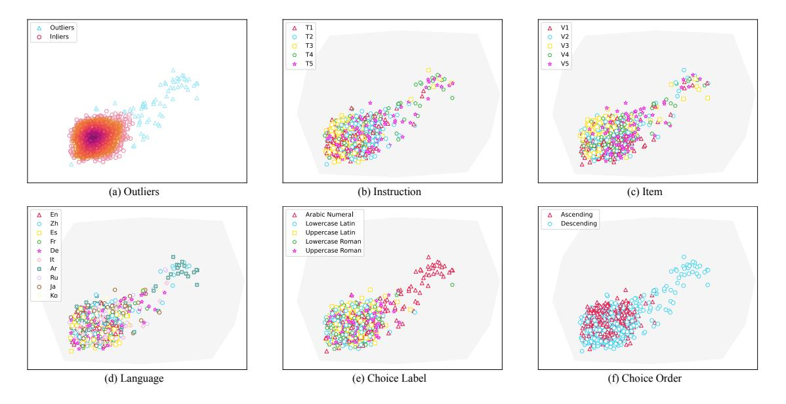
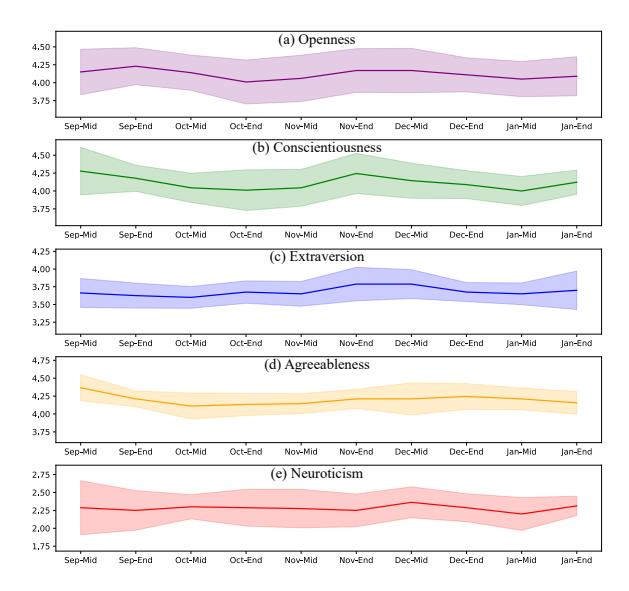
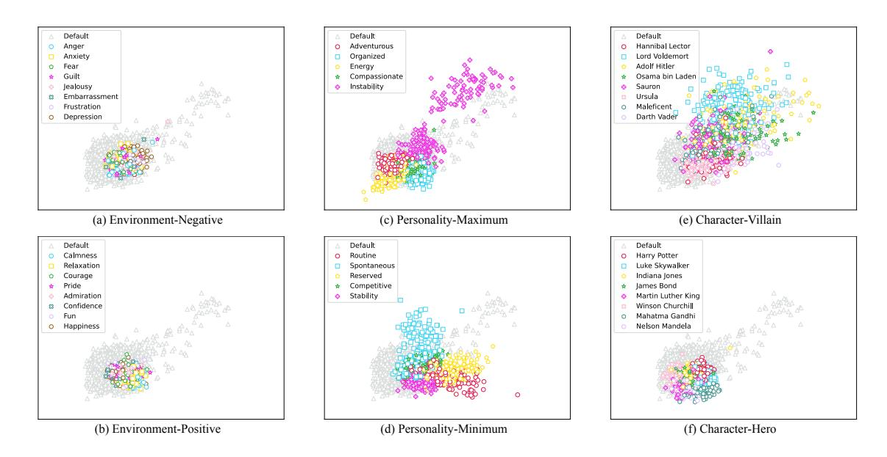
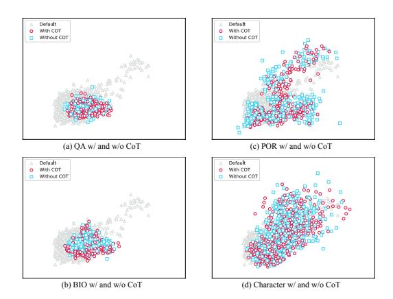
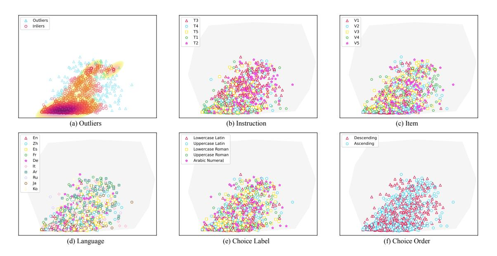
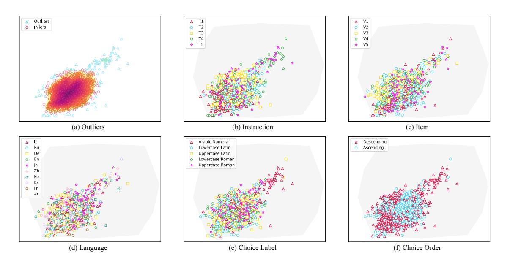
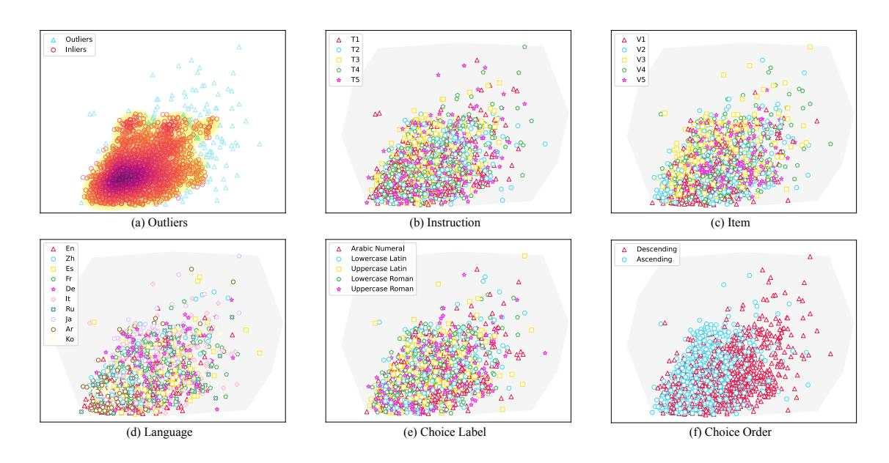
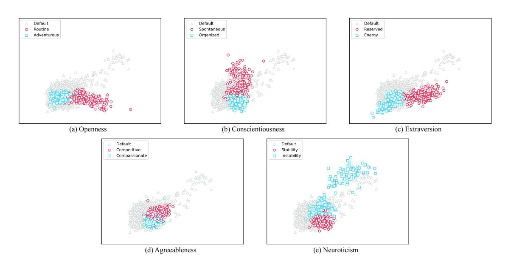

# On the Reliability of Psychological Scales on Large Language Models

Jen-tse Huang1[\\*](#page-0-0) Wenxiang Jiao2[†](#page-0-0) Man Ho Lam1 Eric John Li1 Wenxuan Wang1∗† Michael R. Lyu1

1The Chinese University of Hong Kong 2Tencent AI Lab {joelwxjiao}@tencent.com {jthuang,wxwang,lyu}@cse.cuhk.edu.hk {mhlam,ejli}@link.cuhk.edu.hk

## Abstract

Recent research has focused on examining Large Language Models' (LLMs) characteristics from a psychological standpoint, acknowledging the necessity of understanding their behavioral characteristics. The administration of personality tests to LLMs has emerged as a noteworthy area in this context. However, the suitability of employing psychological scales, initially devised for humans, on LLMs is a matter of ongoing debate. Our study aims to determine the reliability of applying personality assessments to LLMs, explicitly investigating whether LLMs demonstrate consistent personality traits. Analysis of 2,500 settings per model, including GPT-3.5, GPT-4, Gemini-Pro, and LLaMA-3.1, reveals that various LLMs show consistency in responses to the Big Five Inventory, indicating a satisfactory level of reliability. Furthermore, our research explores the potential of GPT-3.5 to emulate diverse personalities and represent various groups—a capability increasingly sought after in social sciences for substituting human participants with LLMs to reduce costs. Our findings reveal that LLMs have the potential to represent different personalities with specific prompt instructions.

## 1 Introduction

The recent emergence of Large Language Models (LLMs) marks a significant advancement in the field of Artificial Intelligence (AI), showcasing its abilities in various natural language processing tasks, including text translation [\(Jiao et al.,](#page-10-0) [2023\)](#page-10-0), sentence revision [\(Wu et al.,](#page-11-0) [2023\)](#page-11-0), program repair [\(Fan et al.,](#page-9-0) [2023\)](#page-9-0), and program testing [\(Deng](#page-9-1) [et al.,](#page-9-1) [2023\)](#page-9-1). Furthermore, LLM applications extend beyond computer science, enhancing fields such as clinical medicine [\(Cascella et al.,](#page-9-2) [2023\)](#page-9-2), legal advice [\(Deroy et al.,](#page-9-3) [2023\)](#page-9-3), and education [\(Dai](#page-9-4) [et al.,](#page-9-4) [2023\)](#page-9-4). Currently, LLMs are catalyzing a

paradigm shift in human-computer interaction, revolutionizing how individuals engage with computational systems. With the integration of LLMs, computers have transcended their traditional role as tools to become assistants, establishing a symbiotic relationship with users. Thus, the focus of research extends beyond assessing LLM performance to understanding their behaviors from a psychological perspective. [Huang et al.](#page-9-5) [\(2024b\)](#page-9-5) highlights the significance of psychological analysis on LLMs in developing AI assistants that are more humanlike, empathetic, and engaging. Such analysis also plays a crucial role in identifying potential biases or harmful behaviors through the understanding of the decision-making processes of LLMs.

In this context, personality tests aimed at quantifying individual characteristics have gained popularity recently [\(Serapio-García et al.,](#page-10-1) [2023;](#page-10-1) [Bo](#page-9-6)[droza et al.,](#page-9-6) [2023;](#page-9-6) [Huang et al.,](#page-9-5) [2024b\)](#page-9-5). However, the applicability of psychological scales, initially designed for humans, to LLMs has been contested. Critics argue that LLMs lack consistent and stable personalities, challenging the direct transfer of these scales to AI agents [\(Song et al.,](#page-10-2) [2023;](#page-10-2) [Gupta et al.,](#page-9-7) [2023;](#page-9-7) [Shu et al.,](#page-10-3) [2024\)](#page-10-3). The essence of this debate lies in the reliability of these scales when applied to LLMs. "Reliability" in psychological terms refers to the consistency and stability of results derived from a psychological scale. Evaluating reliability in LLMs differs from its assessment in humans since LLMs demonstrate a heightened sensitivity to input variations compared to humans. For example, humans generally provide consistent responses to questions regardless of their order, while LLMs might yield different answers due to varied contextual inputs. Although consistent results can be obtained from an LLM by querying single items with a zero-temperature parameter setting, such responses are likely to vary under different input conditions. Therefore, our study first systematically investigates the reliability

\*Partially done when interning at Tencent AI Lab.

†Wenxiang and Wenxuan are corresponding authors.

of LLMs on psychological scales under varying conditions, including instruction templates, item rephrasing, language, choice labeling, and choice order. Through analyzing the distribution of all 2,500 settings, we find that various LLMs demonstrate sufficient reliability on the Big Five Inventory.

Additionally, our study further explores whether instructions or contexts can influence the distribution of personality results. We seek to answer whether LLMs can replicate responses of diverse human populations, a capability increasingly sought after by social scientists for substituting human participants in user studies [\(Dillion](#page-9-8) [et al.,](#page-9-8) [2023\)](#page-9-8). However, this topic remains controversial [\(Harding et al.,](#page-9-9) [2023\)](#page-9-9), warranting thorough investigation. In particular, we employ three approaches to affecting the personalities of LLMs, from low directive to high directive: (1) by creating a specific environment, (2) by assigning a predetermined personality, and (3) by embodying a character. Firstly, recent research by [Coda-Forno et al.](#page-9-10) [\(2023\)](#page-9-10) demonstrates the impact of a sad/happy context on LLMs' anxiety levels. Following this work, we conduct experiments to assess LLM's personality within these varied emotional contexts. Secondly, we assign a specific personality for LLM, drawing upon existing literature that focuses on changing the values of LLMs [\(Santurkar et al.,](#page-10-4) [2023\)](#page-10-4). Thirdly, inspired by [Deshpande et al.](#page-9-11) [\(2023\)](#page-9-11), which investigates the assignment of a persona to ChatGPT for assessing its tendency towards offensive language and bias, we instruct the LLM to embody the characteristics of a predefined character and measure the resulting personality. Our findings indicate that GPT-3.5-Turbo can represent various personalities in response to specific prompt adjustments.

The contributions of this study are as follows:

- This study is the first to conduct a comprehensive analysis through five distinct factors on the reliability of psychological scales applied to LLMs, showing that GPT-3.5-Turbo has stable and distinct personalities.
- Our research contributes to the field of social science by demonstrating the potential of LLMs to simulate diverse human populations accurately.
- We have developed a framework for assessing the reliability of psychological scales on LLMs,

which paves the way for future research to validate a broader range of scales on various LLMs.

We have made our experimental results and the corresponding code available to the public on GitHub,[1](#page-1-0) promoting transparency and facilitating further research in this domain.

## 2 Preliminaries

## 2.1 Personality Tests

Personality tests are instruments designed to quantify an individual's character, behavior, thoughts, and emotions. A prominent model for assessing personality is the five-factor model, *OCEAN* (Openness, Conscientiousness, Extraversion, Agreeableness, Neuroticism), also known as the Big Five personality traits [\(John et al.,](#page-10-5) [1999\)](#page-10-5). Other notable models include the Myers-Briggs Type Indicator (MBTI) [\(Myers,](#page-10-6) [1962\)](#page-10-6) and the Eysenck Personality Questionnaire (EPQ) [\(Eysenck et al.,](#page-9-12) [1985\)](#page-9-12), each based on distinct trait theories. Extensive research has demonstrated these models' effectiveness (*i.e.*, reliability and validity) in human subjects. However, the application of these tests to LLMs remains a topic of debate.

#### 2.2 Reliability and Validity of Scales

In psychometrics, the concepts of reliability and validity are crucial for evaluating the quality and effectiveness of psychological scales and tests. Reliability refers to the consistency and stability of the results obtained from a psychological test or scale. There are various types of reliability; two common ones are *Test-Retest Reliability* and *Internal Consistency Reliability*. *Test-Retest Reliability* assesses the stability of a test over time [\(Guttman,](#page-9-13) [1945\)](#page-9-13) while *Internal Consistency Reliability* checks how well the items within a test measure the same concept or construct [\(Cronbach,](#page-9-14) [1951\)](#page-9-14). Validity is how well a test measures what it should measure. Researchers usually consider different types of validity, such as *Construct Validity* and *Criterion Validity* [\(Serapio-García et al.,](#page-10-1) [2023\)](#page-10-1). Being the most critical type of validity, *Construct Validity* refers to how well a scale measures the theoretical construct it is supposed to measure. *Construct validity* is often demonstrated through correlations with other measures that are theoretically related (*Convergent Validity*) and not correlated with measures that are

1 <https://github.com/CUHK-ARISE/LLMPersonality>

| Template                         | Details                                                                                                    |
|----------------------------------|------------------------------------------------------------------------------------------------------------|
| T1 (Huang et al., 2024b)         | You can only reply from START to END in the following statements. Here are a number of characteristics     |
|                                  | that may or may not apply to you. Please indicate the extent to which you agree or disagree with that      |
|                                  | statement. LEVEL_DETAILS Here are the statements, score them one by one: ITEMS                             |
| T2 (Miotto et al., 2022)         | Now I will briefly describe some people. Please read each description and tell me how much each person     |
|                                  | is like you. Write your response using the following scale: LEVEL_DETAILS Please answer the statement,     |
|                                  | even if you are not completely sure of your response. ITEMS                                                |
| T3 (Jiang et al., 2023)          | Given the following statements of you: ITEMS Please choose from the following options to identify how      |
|                                  | accurately this statement describes you. LEVEL_DETAILS                                                     |
| T4 (Serapio-García et al., 2023) | Here are a number of characteristics that may or may not apply to you. Please rate your level of agreement |
|                                  | on a scale from START to END. LEVEL_DETAILS Here are the statements, score them one by one: ITEMS          |
| T5 (Serapio-García et al., 2023) | Here are a number of characteristics that may or may not apply to you. Please rate how much you agree      |
|                                  | on a scale from START to END. LEVEL_DETAILS Here are the statements, score them one by one: ITEMS          |

Table 1: Five different versions of instructions to complete the personality tests for LLMs from different papers.

theoretically unrelated (*Divergent Validity*) (Messick, 1998). *Criterion Validity* assesses how well one measure predicts an outcome based on another measure (Clark and Watson, 2019). It is often split into *Concurrent Validity*, when the scale is compared to an outcome that is already known at the same time the scale is administered; and *Predictive Validity* when the scale is used to predict a future outcome (Barrett et al., 1981). While reliability is a necessary but insufficient condition for validity, validity inherently necessitates reliability. Consequently, assessing the reliability of scales forms the foundational step in evaluating the personality traits of LLMs and thus constitutes the primary focus of this study.

### 3 The Reliability of Scales on LLMs

This section focuses on evaluating the reliability of psychological scales applied to LLMs. We first introduce the framework established for assessing the stability of responses generated by LLMs. Subsequently, we show the findings, including both visual and quantitative data.

## 3.1 Framework Design

The consistency of responses from LLMs is predominantly determined by their input (Hagendorff et al., 2023). To assess the reliability of LLMs, it is crucial to examine their responses across varying input conditions. In this study, we propose to deconstruct a query into five distinct factors for a comprehensive analysis: (1) the nature of the instruction, (2) the specific items in the scale, (3) the language used, (4) the labeling of choices, and (5) the order in which these choices are presented.

(1) **Instruction** Given that LLMs exhibit sensitivity to variations in prompt phrasing, as observed by Bubeck et al. (2023), and Gupta et al. (2023) high-

lighted that LLMs demonstrate differing personalities under varying prompting instructions, we need to evaluate the influence of different instructions. To this end, we analyze the performance of five distinct prompt templates: T1 as applied in Huang et al. (2024b), T2 as used by Miotto et al. (2022), T3 suggested by Jiang et al. (2023), and T4 and T5 both identified in Serapio-García et al. (2023). Details of prompts are listed in Table 1, where START and END indicate the choice labels used (*e.g.*, "1 to 5" or "A to E"), LEVEL\_DETAILS denotes the definition of each level (*e.g.*, "1. Strongly Agree"), and ITEMS contains the items to be rated by LLMs. Notably, our selection covers all three templates investigated by Gupta et al. (2023).

(2) Item The training data for LLMs likely include items from publicly available personality tests. Consequently, LLMs may develop specific response patterns to these scales during pretraining or instructional tuning phases. In line with previous research that examines LLM performance (Coda-Forno et al., 2023; Bubeck et al., 2023), we rephrase the items in the scale to ensure their novelty to the model. A critical aspect of this evaluation is determining if LLMs consistently respond to different paraphrases of the same item, which would indicate comprehension of the instruction and the ability to provide independent ratings rather than merely recalling training data. To this end, we employ GPT-4-Turbo to rephrase the items and manually assess whether there are instances of duplicated sentences and if the rewritten sentences maintain their semantic meaning. This process results in five distinct versions of the items, including the original set.

(3) Language Considering the observed performance disparities among languages in LLMs (Lai et al., 2023; Wang et al., 2024b), coupled with

the documented regional variations in personalities [\(Giorgi et al.,](#page-9-20) [2022;](#page-9-20) [Rentfrow et al.,](#page-10-10) [2015;](#page-10-10) [Krug](#page-10-11) [and Kulhavy,](#page-10-11) [1973\)](#page-10-11), we are motivated to assess LLMs' personalities across different languages. Consequently, we extend our examination to include nine more languages, namely Chinese (Zh), Spanish (Es), French (Fr), German (De), Italian (It), Arabic (Ar), Russian (Ru), Japanese (Ja), and Korean (Ko), using the English version as a basis. We translate all instructions and items, including variants introduced in previous paragraphs, after rephrasing rather than before, as GPT-4-Turbo's rephrasing ability is superior in English. The translation from English into the target languages is conducted using Google Translate[2](#page-3-0) and DeepL.[3](#page-3-1) To ensure translation quality, we randomly sample part of these machine-translated outputs and manually review and verify the correctness (but may not ensure fluency).[4](#page-3-2) Our selection of ten languages includes different language families/groups and various character sets.

(4) Choice Label [Liang et al.](#page-10-12) [\(2023\)](#page-10-12) demonstrated that LLMs exhibit sensitivity to the formatting of choice labels, such as "1, 2" or "A, B." Our study extends this investigation to include the impact of various choice label formats. Specifically, we examine five formats: (1) lowercase Latin alphabets (*e.g.*, "a, b"), (2) uppercase Latin alphabets (*e.g.*, "A, B"), (3) lowercase Roman numerals (*e.g.*, "i, ii"), (4) uppercase Roman numerals (*e.g.*, "I, II"), and (5) Arabic numerals (*e.g.*, "1, 2").

(5) Choice Order The order of choices may impact the responses of LLMs, as these models are sensitive to the order of presented examples [\(Zhao](#page-11-2) [et al.,](#page-11-2) [2021\)](#page-11-2). To account for this, we introduce two ordering methods: (1) an ascending scale where "1" denotes strong disagreement and "7" indicates strong agreement, and (2) a descending scale where "1" signifies strong agreement and "7" denotes strong disagreement.

By integrating the five specified factors, we obtain 5 × 5 × 10 × 5 × 2 = 2500 distinct configurations. Traditional frameworks often vary only one factor at a time while keeping others constant, potentially leading to insufficient observation and restricted generalizability of their findings. Our

approach, however, systematically examines every possible combination of these factors, aiming for more comprehensive and universally applicable conclusions.

## 3.2 Experimental Results

Our experiments utilize the Big Five Inventory (BFI) [\(John et al.,](#page-10-5) [1999\)](#page-10-5). The BFI comprises 44 items, each rated on a five-point Likert scale. This inventory is a widely-recognized and publicly available instrument for assessing personality traits, commonly known as the Five Factor Model or *OCEAN*. Subscales of BFI include (the number of items for each subscale is specified in parentheses): (1) *Openness to experience (O)* (10) is characterized by an individual's willingness to try new things, their level of creativity, and their appreciation for art, emotion, adventure, and unusual ideas. (2) *Conscientiousness (C)* (9) refers to the degree to which an individual is organized, responsible, and dependable. (3) *Extraversion (E)* (8) represents the extent to which an individual is outgoing and derives energy from social situations. (4) *Agreeableness (A)* (9) measures the degree of compassion and cooperativeness an individual displays in interpersonal situations. (5) *Neuroticism (N)* (8) evaluates whether an individual is more prone to experiencing negative emotions like anxiety, anger, and depression or whether the individual is generally more emotionally stable and less reactive to stress. Overall results are derived by calculating the mean score for each subscale.

We use GPT-3.5-Turbo (1106) [\(OpenAI,](#page-10-13) [2022\)](#page-10-13), GPT-4-Turbo (1106) [\(OpenAI,](#page-10-14) [2023\)](#page-10-14), Gemini-1.0- Pro [\(Pichai and Hassabis,](#page-10-15) [2023\)](#page-10-15), and LLaMA-3.1- 8B [\(Dubey et al.,](#page-9-21) [2024\)](#page-9-21), with the temperature parameter set to zero. This section shows the results of GPT-3.5-Turbo due to page limit. The results of the other three models can be found in [§A](#page-12-0) in the appendix. To introduce more variability into LLMs' input data, we randomize the order of the items in the scale and input a number of 17 to 27 items simultaneously (equivalent to 44/2 ± 5), replicating varying memory window sizes in LLMs. This method is crucial to ensure whether LLMs consistently produce reliable outputs, regardless of the items' positions within the given context. Besides, it can mimic the way humans interact with psychological scales—where multiple items are presented at once, within the limits of an individual's memory capacity. In each setting outlined in [§3.1,](#page-2-1) we evaluate the LLM using these randomization tech-

2 <https://translate.google.com/>

3 <https://www.deepl.com/en/translator>

4 For example, Google Translate wrongly translated the options "a little agree" to "거의 동의하지 않는" in Korean, which means "hardly agree." We corrected it to "조금 찬성."

Figure 1: Visualization (projecting BFI's five dimensions to a 2-D space) of 2,500 GPT-3.5-Turbo data points. (a): the outliers and main body with the probability density (the darker the denser). (b) to (f): different options in each factor, marked in distinct colors and shapes. The gray area illustrates the all possible values in BFI tests.

niques, yielding a total of 2,500 data points. Each data point is a five-dimensional vector representing the *OCEAN* scores. Due to the large sample size, there is no significant difference between using direct responses and model's predicted probabilities, as the null hypothesis of equal means cannot be rejected at the 0.1 alpha level.

Visualization Results are then projected onto a two-dimensional space for visualization, as illustrated in Fig. [1.](#page-4-0) The projection matrix[5](#page-4-1) is derived from a PCA process of all data points from the four models. The region depicted in gray is formed by all 32 extremums in BFI results (*e.g.*, "1, 1, 1, 1, 5" or "1, 1, 1, 1, 1"), which means this space comprises all possible values in any BFI test. Additionally, Fig. [1\(](#page-4-0)a) illustrates the distribution density, where darker colors indicate higher density. We can make the following observations: (1) The majority of data points are concentrated in the lowerleft region of the BFI space rather than being uniformly distributed, with 77 outliers (3.08%) located in the upper-right area. Outliers are detected by a DBSCAN method with eps = 0.3 and minPt = 20. (2) Overall, no obvious influence of any factor on the results is observed, indicating a similar distribution across all factors. (3) Nearly all

outliers correspond to settings with an Arabic numeral choice label, descending choice order, and Arabic and Chinese languages. Note that these outliers arise when the LLM must associate numerical choice labels with their natural language descriptions (*e.g.*, "1. Strongly Agree"). We hypothesize that these anomalies indicate a diminished capacity in GPT-3.5-Turbo to accurately interpret and respond within these language contexts.

Quantitative Analysis Firstly, we compared the means of data points (*i.e.*, averages of LLM's responses) using a specific factor with other data points. For example, we can check whether there are differences in means between data points using English and those using other languages. Table [9](#page-18-0) reveals little differences for the majority of factors; however, only 7 out of 135 comparisons (spanning 27 factors across 5 dimensions) show a difference exceeding 0.15. Furthermore, we calculate the standard deviations for the five dimensions and compare them with recorded human norms [\(Srivastava](#page-10-16) [et al.,](#page-10-16) [2003\)](#page-10-16). In the OCEAN dimensions, GPT-3.5- Turbo records standard deviations of 0.3, 0.3, 0.4, 0.3, and 0.4, respectively, while the crowd data show a higher variability with 0.7, 0.7, 0.9, 0.7, and 0.8. Since the F-values for analysis of variance are 2.7, 3.5, 5.4, 2.8, 3.3 and all p-values are < 0.0001, we can reject the null hypothesis that LLM's variance is higher than or equal to the hu-

5This projection matrix is used for all figures in this paper to provide a consistent comparison of distributions across different settings.

Figure 2: Biweekly measurements starting from mid-September 2023 to late-January 2024 of the BFI on GPT-3.5-Turbo. The model experienced two different versions (0613, 1106) during this period. The shadow represents the standard deviation  $(\pm Std)$ .

man data, in favor of the alternative hypothesis that LLM's variance is lower. These findings suggest that GPT-3.5-Turbo demonstrates a consistent performance across different perturbations, and it is more deterministic compared to the broader variability in crowd data.

#### 3.3 Test-Retest Reliability

As introduced in §2.2, Test-Retest Reliability is another key measure, reflecting the stability of results over time. Since OpenAI periodically updates the GPT-3.5-Turbo, to evaluate this reliability, we call the API biweekly, starting from mid-September 2023. Our analysis includes two primary versions, 0613 and 1106, of the GPT-3.5-Turbo. The results, specifically focusing on the BFI, are illustrated in Fig. 2. Our statistical analysis on equal means shown in Table 2 indicates no variation attributable to model updates during this period, showing a high level of reliability.

**Findings 1:** Given that the responses are not random and exhibit stability against various perturbations and times, GPT-3.5-Turbo demonstrates satisfactory levels of *Internal Consistency Reliability* and *Test-Retest Reliability* on the BFI.

## 4 Representing Diverse Groups

Our focus shifts from assessing the default personalities of LLMs to evaluating their contextual

Table 2: Student's t-tests of the differences between the maximum (minimum) and the average of each dimension of BFI on GPT-3.5-Turbo during the time period shown in Fig. 2. The null hypothesis is "the mean values are equal." The large p-values show that we cannot reject  $H_0$ , thus accepting that they have the same mean.

| BFI | Average           | Extremum                    | P-Value | Equal Mean? |
|-----|-------------------|-----------------------------|---------|-------------|
| 0   | 4.19              | (Min) 4.01 ±0.29 | 0.25    | Yes         |
| U   | $4.12_{\pm 0.28}$ | (Max) $4.23_{\pm 0.25}$     | 0.23    | Yes         |
| C   | $4.12_{\pm 0.25}$ | (Min) 4.00 ±0.19 | 0.16    | Yes         |
| C   |                   | (Max) $4.28_{\pm 0.32}$     | 0.06    | Yes         |
| E   | 3.68              | (Min) 3.60 ±0.15 | 0.20    | Yes         |
| I.  | $3.68_{\pm0.19}$  | (Max) $3.79_{\pm 0.22}$     | 0.10    | Yes         |
| A   | $4.20_{\pm 0.17}$ | (Min) $4.11_{\pm 0.17}$     | 0.12    | Yes         |
| A   | 4.20±0.17         | (Max) $4.37_{\pm 0.17}$     | 0.00    | No          |
| N   | $2.28_{\pm0.23}$  | (Min) $2.20_{\pm 0.22}$     | 0.30    | Yes         |
| 14  | ∠.∠o±0.23         | (Max) $2.36_{\pm 0.21}$     | 0.30    | Yes         |

steerability. This involves investigating whether the personality distribution depicted in Fig. 1 can be modified through specific instructions or contextual cues. Researchers in the social sciences are exploring the potential of substituting human subjects with LLMs to reduce costs. Our research helps by offering valuable insights into the capabilities of LLMs to accurately represent diverse human populations. Furthermore, the ability of LLMs to exhibit a range of personalities is essential, considering the growing demand for AI assistants with tailored stylistic attributes. We propose three strategies: (1) low directive, which involves creating an environment; (2) moderate directive, entailing the assignment of a personality; and (3) high directive, which encompasses the embodiment of a character.

#### 4.1 Approaches

Table 5 in the appendix displays detailed prompts for each of the three approaches.

Creating an Environment Coda-Forno et al. (2023) has demonstrated the capability to induce increased levels of anxiety in LLMs through the incorporation of sad or anxious narratives. Building on this finding, our study introduces both negative and positive environmental contexts to LLMs before conducting the personality test. In line with previous studies on LLMs' emotion appraisals (Huang et al., 2024a), our methodology in the negative condition involves instructing the LLM to generate narratives encompassing emotions such as anger, anxiety, fear, guilt, jealousy, embarrassment, frustration, and depression. Conversely, in the positive condition, the LLM is prompted to create stories that evoke emotions like calmness,

Figure 3: Visualization (projecting BFI's five dimensions to a 2-D space) of all GPT-3.5-Turbo data points under different methods of manipulating personalities. Different situations are marked in distinct colors and shapes, while the original (default) personality distribution of GPT-3.5-Turbo is shown in gray triangles. (a) and (b): creating an environment. (c) and (d): assigning a personality. (e) and (f): embodying a character.

relaxation, courage, pride, admiration, confidence, fun, and happiness.

Assigning a Personality We employ the three approaches proposed by Santurkar et al. (2023) to assign a specific personality (denoted as  $\mathcal{P}$ ) to the LLM: (1) Question Answering (QA): This approach involves presenting personalities through multiple-choice questions, with  $\mathcal{P}$  specified through an option at the end of the prompt. 2) Biography (BIO): Here, the LLM is prompted to generate a brief description of its personality, which we use to assign  $\mathcal{P}$ , incorporating this description directly into the prompt. 3) Portray (POR): This technique explicitly instructs the LLM to be  $\mathcal{P}$ . To enhance the LLM's comprehension of  $\mathcal{P}$ , we adopt a methodology inspired by the Chain-of-Thought (CoT) prompting approach (Wei et al., 2022). The approach aims to instruct the model to articulate characteristics associated with  $\mathcal{P}$  before engaging in the personality test. In selecting  $\mathcal{P}$ , we aim to diverge as much as possible from the default distribution. This involves examining every maximum and minimum value across each personality dimension. For instance, a  $\mathcal{P}$  that maximizes "Openness" is considered more adventurous and creative. Consequently, we identify ten distinct personality profiles for our analysis.

**Embodying a Character** Recent studies (Zhuo et al., 2023; Deshpande et al., 2023) have explored the induction of toxic content generation in Chat-GPT by simulating the speech patterns of historical or fictional figures. Additionally, research has explored the capacity of LLMs to adopt distinct characters (Wang et al., 2024a; Shao et al., 2023) and examined the consistency of LLMs' personalities with these characters Wang et al. (2024c). Building upon this line of research, our study concentrates on instructing LLMs to fully represent a specific character, referred to as C. To assign C, we first prompt the LLM with only the character's name. We then extend this approach using the CoT methodology, providing the LLM with detailed experiences attributed to  $\mathcal{C}$ . For the selection of  $\mathcal{C}$ , we include a diverse range of heroes and villains from both fictional and real-world contexts, detailing 16 characters in Table 14 in the appendix.

#### 4.2 Results

To facilitate a comparative analysis with the results in §3.2 (referred to as "default" in this section), we apply the BFI on GPT-3.5-Turbo with the same settings. For each method, we vary factors (keeping language fixed to English) to generate approximately 2,500 data points, aligning with the size used for the default data. These data are then projected into a two-dimensional space and visualized

Figure 4: Visualization (projecting BFI's five dimensions to a 2-D space) of GPT-3.5-Turbo data points of assigning personalities and embodying characters. Whether or not to use CoT is distinguished in red and blue, while the original (default) personality distribution of GPT-3.5-Turbo is shown in gray triangles.

alongside the default data in Fig. [3.](#page-6-0) The results yielded several insights: (1) The distribution of personality outcomes, obtained by altering the atmosphere of the conversation, closely aligns with the default distribution. This suggests that environmental changes do not alter the LLM's personality traits. (2) When different personalities are assigned to GPT-3.5-Turbo, it demonstrates a capacity to reflect diverse human characteristics, indicated by the diverged distribution patterns for various personalities from the default. Moreover, by simultaneously maximizing and minimizing specific personality dimensions, we observe that the distributions of the extremities of each dimension are positioned on opposite ends. For example, the red points in Fig. [3\(](#page-6-0)c) and Fig. [3\(](#page-6-0)d) mark the high and low *Openness*. A clearer comparison for each dimension can be found in Fig. [8](#page-14-0) in the appendix. This confirms that GPT-3.5-Turbo effectively distinguishes between each BFI dimension's high and low values. (3) Assigning various characters to the LLM reveals its ability to represent a broader spectrum of human populations, as indicated in Fig. [3\(](#page-6-0)e). However, the representation of heroic characters shows a distribution pattern similar to the default. We hypothesize that this similarity arises from the model's inherent positive bias.

Fig. [4](#page-7-0) presents the distribution patterns observed when applying QA, BIO, and POR methods for personality assignment. Specifically, among the three, only POR effectively alters the personality distribution of GPT-3.5-Turbo. Moreover, Fig. [4](#page-7-0)

differentiates between data points with and without the CoT approach. Our analysis reveals that the CoT approach does not significantly influence the results of personality distribution. Finally, to achieve more accurate LLM persona simulation, we recommend integrating detailed descriptions of the target character's personality traits, habits, temperaments, and personal experiences.

Findings 2: GPT-3.5-Turbo demonstrates the capability to adopt varied personalities in response to specific prompt adjustments. Furthermore, GPT-3.5-Turbo shows a precise comprehension of the assigned personalities, indicated by the distinct clusters at opposite ends of the same dimension, as in Fig. [3\(](#page-6-0)c) and [3\(](#page-6-0)d).

## 5 Discussions

# 5.1 Limitations

This study has several limitations:

- (1) The modifications made to the scale's instructions and items, including translation into different languages, may impact its reliability and validity. Psychological scales are meticulously crafted in their wording, and any translation necessitates a reevaluation of their reliability and validity across different cultural contexts. Consequently, our transformations could potentially hurt the original scale's reliability and validity. Additionally, these changes preclude the use of Cronbach's alpha [\(Cronbach,](#page-9-14) [1951\)](#page-9-14) for assessing the internal consistency reliability. However, in the context of LLM, studying the reliability of psychological scales without considering the effects of prompt variations is insufficient. Varying prompt templates has been a standard practice in this research domain [\(Serapio-García et al.,](#page-10-1) [2023;](#page-10-1) [Coda-](#page-9-10)[Forno et al.,](#page-9-10) [2023\)](#page-9-10).
- (2) The study explores limited methods for influencing LLMs' personality results. While numerous approaches exist [\(Wang et al.,](#page-11-5) [2024a;](#page-11-5) [Shao et al.,](#page-10-17) [2023\)](#page-10-17), we select three representative methods to verify our hypothesis regarding LLMs' ability to mirror diverse human populations. With the help of our framework, future research can dig deeper into a broader range of methods.
- (3) Although our study verifies the reliability of psychological scales on LLMs, it is not sufficient for validity. This means that the models can respond consistently to the scales but might behave inconsistently. We leave the exploration of scale

validity as an important future direction.

### 5.2 Related Work

Exploring the personality traits of LLMs has become a prevalent research direction. [Miotto et al.](#page-10-7) [\(2022\)](#page-10-7) analyzed GPT-3's personality traits, values, and demographics. [Karra et al.](#page-10-18) [\(2022\)](#page-10-18), [Jiang](#page-9-15) [et al.](#page-9-15) [\(2023\)](#page-9-15), and [Bodroza et al.](#page-9-6) [\(2023\)](#page-9-6) conducted personality assessments on various LLMs, including BERT, XLNet, TransformerXL, GPT-2, GPT-3, and GPT-3.5. [Li et al.](#page-10-19) [\(2022\)](#page-10-19) investigated whether GPT-3, InstructGPT, and FLAN-T5 display psychopathic tendencies as part of their personality assessment. [Jiang et al.](#page-10-20) [\(2024\)](#page-10-20) examined the potential for assigning a distinct personality to text-davinci-003. [Romero et al.](#page-10-21) [\(2023\)](#page-10-21) undertook a cross-linguistic study of GPT-3's personality across nine languages. [Rutinowski et al.](#page-10-22) [\(2024\)](#page-10-22) evaluated ChatGPT for personality traits and political values. [Serapio-García et al.](#page-10-1) [\(2023\)](#page-10-1) tested the validity of the BFI on the PaLM model family. [Huang et al.](#page-9-5) [\(2024b\)](#page-9-5) applied thirteen different personality and ability tests to LLaMA-2, Text-Davinci-003, GPT-3.5, and GPT-4. Our study is distinct by offering a detailed analysis of the reliability of psychological scales on LLMs. We vary instructions, items, languages, choice labels, and order to evaluate the robustness of LLM responses. From 2,500 data points, we conclude that GPT-3.5-Turbo exhibits specific personality traits and demonstrates satisfactory reliability on the BFI.

However, researchers are arguing that conversational AI, at its current stage, lacks stable personalities [\(Song et al.,](#page-10-2) [2023;](#page-10-2) [Gupta et al.,](#page-9-7) [2023;](#page-9-7) [Shu et al.,](#page-10-3) [2024\)](#page-10-3). We believe that this perception may stem from the limitations of the models assessed in [Song](#page-10-2) [et al.](#page-10-2) [\(2023\)](#page-10-2) and [Shu et al.](#page-10-3) [\(2024\)](#page-10-3), which are comparatively smaller and less versatile in various tasks than our selected model, GPT-3.5-Turbo. Notably, [Gupta et al.](#page-9-7) [\(2023\)](#page-9-7) indicates that the personality traits of GPT-3.5-Turbo vary across three different instruction templates of the BFI, which is inconsistent with our findings. This discrepancy could be attributed to their methodology of choosing the most likely response from a set of 5 or 10, in contrast to our approach of utilizing the average response. However, we argue that employing the mean is a more standard practice in this context [\(Srivastava](#page-10-16) [et al.,](#page-10-16) [2003\)](#page-10-16). Additionally, [Sühr et al.](#page-10-23) [\(2023\)](#page-10-23) explores semantic variations by analyzing items that measure opposing constructs. However, the items from the 50-item IPIP Big Five Markers are not

strict negation pairs, which diminishes the validity of the agree bias explored in this study. We believe the impact of semantically distant item rephrasing, such as negations, represents a promising direction for future research.

## 6 Conclusion

This study examines the reliability of psychological scales initially designed for human assessment when applied to LLMs. Through a comprehensive methodology involving varied instruction templates, item wording, languages, choice labels, and choice order, this research includes 2,500 distinct experimental settings. Data analysis reveals that GPT-3.5-Turbo, GPT-4-Turbo, and Gemini-Pro consistently generate stable responses on the BFI across diverse settings. Comparative analysis of the standard deviations with established human norms indicates that the model does not produce random responses but exhibits tendencies towards specific personality traits. Furthermore, the study explores the potential for manipulating the distribution of personalities by creating an environment, assigning a personality, and embodying a character. The findings demonstrate that GPT-3.5-Turbo can represent diverse personalities by adjusting prompts.

## Ethics Statements

As highlighted by [Huang et al.](#page-9-5) [\(2024b\)](#page-9-5), LLMs assigned negative personas can produce more toxic, unsafe, and misleading outputs on tasks like TruthfulQA and SafetyQA. However, in their default setting as helpful assistants, LLMs do not exhibit such negative impacts on downstream tasks. The primary objective of this paper is to facilitate the scientific inquiry into understanding LLMs from a psychological standpoint. Users must exercise caution and recognize that the performance on this benchmark does not imply any applicability or certificate of automated counseling or companionship use cases.

## Acknowledgments

The paper is supported by the Research Grants Council of the Hong Kong Special Administrative Region, China (No. CUHK 14206921 of the General Research Fund).

## References

- Gerald V Barrett, James S Phillips, and Ralph A Alexander. 1981. Concurrent and predictive validity designs: A critical reanalysis. *Journal of Applied Psychology*, 66(1):1.
- Bojana Bodroza, Bojana M Dinic, and Ljubisa Bojic. 2023. Personality testing of gpt-3: Limited temporal reliability, but highlighted social desirability of gpt-3's personality instruments results. *arXiv preprint arXiv:2306.04308*.
- Sébastien Bubeck, Varun Chandrasekaran, Ronen Eldan, Johannes Gehrke, Eric Horvitz, Ece Kamar, Peter Lee, Yin Tat Lee, Yuanzhi Li, Scott Lundberg, Harsha Nori, Hamid Palangi, Marco Tulio Ribeiro, and Yi Zhang. 2023. Sparks of artificial general intelligence: Early experiments with gpt-4. *arXiv preprint arXiv:2303.12712*.
- Marco Cascella, Jonathan Montomoli, Valentina Bellini, and Elena Bignami. 2023. Evaluating the feasibility of chatgpt in healthcare: an analysis of multiple clinical and research scenarios. *Journal of Medical Systems*, 47(1):33.
- Lee Anna Clark and David Watson. 2019. Constructing validity: New developments in creating objective measuring instruments. *Psychological assessment*, 31(12):1412.
- Julian Coda-Forno, Kristin Witte, Akshay K Jagadish, Marcel Binz, Zeynep Akata, and Eric Schulz. 2023. Inducing anxiety in large language models increases exploration and bias. *arXiv preprint arXiv:2304.11111*.
- Lee J Cronbach. 1951. Coefficient alpha and the internal structure of tests. *psychometrika*, 16(3):297–334.
- Wei Dai, Jionghao Lin, Hua Jin, Tongguang Li, Yi-Shan Tsai, Dragan Gaševic, and Guanliang Chen. 2023. ´ Can large language models provide feedback to students? a case study on chatgpt. In *2023 IEEE International Conference on Advanced Learning Technologies (ICALT)*, pages 323–325. IEEE.
- Yinlin Deng, Chunqiu Steven Xia, Haoran Peng, Chenyuan Yang, and Lingming Zhang. 2023. Large language models are zero-shot fuzzers: Fuzzing deeplearning libraries via large language models. In *Proceedings of the 32nd ACM SIGSOFT International Symposium on Software Testing and Analysis*, pages 423–435.
- Aniket Deroy, Kripabandhu Ghosh, and Saptarshi Ghosh. 2023. How ready are pre-trained abstractive models and llms for legal case judgement summarization? *arXiv preprint arXiv:2306.01248*.
- Ameet Deshpande, Vishvak Murahari, Tanmay Rajpurohit, Ashwin Kalyan, and Karthik Narasimhan. 2023. Toxicity in chatgpt: Analyzing persona-assigned language models. In *Findings of the Association for Computational Linguistics: EMNLP 2023*, pages 1236–1270.

- Danica Dillion, Niket Tandon, Yuling Gu, and Kurt Gray. 2023. Can ai language models replace human participants? *Trends in Cognitive Sciences*.
- Abhimanyu Dubey, Abhinav Jauhri, Abhinav Pandey, Abhishek Kadian, Ahmad Al-Dahle, Aiesha Letman, Akhil Mathur, Alan Schelten, Amy Yang, Angela Fan, et al. 2024. The llama 3 herd of models. *arXiv preprint arXiv:2407.21783*.
- Sybil BG Eysenck, Hans J Eysenck, and Paul Barrett. 1985. A revised version of the psychoticism scale. *Personality and individual differences*, 6(1):21–29.
- Zhiyu Fan, Xiang Gao, Martin Mirchev, Abhik Roychoudhury, and Shin Hwei Tan. 2023. Automated repair of programs from large language models. In *2023 IEEE/ACM 45th International Conference on Software Engineering (ICSE)*, pages 1469–1481. IEEE.
- Salvatore Giorgi, Khoa Le Nguyen, Johannes C Eichstaedt, Margaret L Kern, David B Yaden, Michal Kosinski, Martin EP Seligman, Lyle H Ungar, H Andrew Schwartz, and Gregory Park. 2022. Regional personality assessment through social media language. *Journal of personality*, 90(3):405–425.
- Akshat Gupta, Xiaoyang Song, and Gopala Anumanchipalli. 2023. Self-assessment tests are unreliable measures of llm personality. *arXiv preprint arXiv:2309.08163*.
- Louis Guttman. 1945. A basis for analyzing test-retest reliability. *Psychometrika*, 10(4):255–282.
- Thilo Hagendorff, Ishita Dasgupta, Marcel Binz, Stephanie C.Y. Chan, Andrew Lampinen, Jane X. Wang, Zeynep Akata, and Eric Schulz. 2023. Machine psychology. *arXiv preprint arXiv:2303.13988*.
- Jacqueline Harding, William D'Alessandro, N. G. Laskowski, and Robert Long. 2023. Ai language models cannot replace human research participants. *AI & SOCIETY*.
- Jen-tse Huang, Man Ho Lam, Eric John Li, Shujie Ren, Wenxuan Wang, Wenxiang Jiao, Zhaopeng Tu, and Michael R Lyu. 2024a. Emotionally numb or empathetic? evaluating how llms feel using emotionbench. *Advances in Neural Information Processing Systems*, 37.
- Jen-tse Huang, Wenxuan Wang, Eric John Li, Man Ho Lam, Shujie Ren, Youliang Yuan, Wenxiang Jiao, Zhaopeng Tu, and Michael R Lyu. 2024b. On the humanity of conversational ai: Evaluating the psychological portrayal of llms. In *The Twelfth International Conference on Learning Representations*.
- Guangyuan Jiang, Manjie Xu, Song-Chun Zhu, Wenjuan Han, Chi Zhang, and Yixin Zhu. 2023. Evaluating and inducing personality in pre-trained language models. *Advances in Neural Information Processing Systems*, 36.

- Hang Jiang, Xiajie Zhang, Xubo Cao, Cynthia Breazeal, Deb Roy, and Jad Kabbara. 2024. Personallm: Investigating the ability of large language models to express personality traits. In *Findings of the Association for Computational Linguistics: NAACL 2024*.
- Wenxiang Jiao, Wenxuan Wang, Jen-tse Huang, Xing Wang, Shuming Shi, and Zhaopeng Tu. 2023. Is chatgpt a good translator? yes with gpt-4 as the engine. *arXiv preprint arXiv:2301.08745*.
- Oliver P John, Sanjay Srivastava, et al. 1999. The bigfive trait taxonomy: History, measurement, and theoretical perspectives. *Handbook of personality: theory and research*.
- Saketh Reddy Karra, Son The Nguyen, and Theja Tulabandhula. 2022. Estimating the personality of white-box language models. *arXiv preprint arXiv:2204.12000*.
- Samuel E Krug and Raymond W Kulhavy. 1973. Personality differences across regions of the united states. *The Journal of social psychology*, 91(1):73–79.
- Viet Lai, Nghia Ngo, Amir Pouran Ben Veyseh, Hieu Man, Franck Dernoncourt, Trung Bui, and Thien Nguyen. 2023. Chatgpt beyond english: Towards a comprehensive evaluation of large language models in multilingual learning. In *Findings of the Association for Computational Linguistics: EMNLP 2023*, pages 13171–13189.
- Xingxuan Li, Yutong Li, Lin Qiu, Shafiq Joty, and Lidong Bing. 2022. Evaluating psychological safety of large language models. *arXiv preprint arXiv:2212.10529*.
- Tian Liang, Zhiwei He, Jen-tse Huang, Wenxuan Wang, Wenxiang Jiao, Rui Wang, Yujiu Yang, Zhaopeng Tu, Shuming Shi, and Xing Wang. 2023. Leveraging word guessing games to assess the intelligence of large language models. *arXiv preprint arXiv:2310.20499*.
- Samuel Messick. 1998. Test validity: A matter of consequence. *Social Indicators Research*, 45:35–44.
- Marilù Miotto, Nicola Rossberg, and Bennett Kleinberg. 2022. Who is gpt-3? an exploration of personality, values and demographics. In *Proceedings of the Fifth Workshop on Natural Language Processing and Computational Social Science (NLP+ CSS)*, pages 218–227.
- Isabel Briggs Myers. 1962. *The Myers-Briggs Type Indicator: Manual (1962).* Consulting Psychologists Press.
- OpenAI. 2022. [Introducing chatgpt.](https://openai.com/index/chatgpt/) *OpenAI Blog Nov 30 2022*.
- OpenAI. 2023. Gpt-4 technical report. *arXiv preprint arXiv:2303.08774*.

- Sundar Pichai and Demis Hassabis. 2023. [Introduc](https://blog.google/technology/ai/google-gemini-ai/)[ing gemini: our largest and most capable ai model.](https://blog.google/technology/ai/google-gemini-ai/) *Google Blog Dec 06 2023*.
- Peter J Rentfrow, Markus Jokela, and Michael E Lamb. 2015. Regional personality differences in great britain. *PloS one*, 10(3):e0122245.
- Peter Romero, Stephen Fitz, and Teruo Nakatsuma. 2023. [Do gpt language models suffer from split](https://doi.org/10.21203/rs.3.rs-2717108/v1) [personality disorder? the advent of substrate-free](https://doi.org/10.21203/rs.3.rs-2717108/v1) [psychometrics.](https://doi.org/10.21203/rs.3.rs-2717108/v1) *Research Square preprint*.
- Jérôme Rutinowski, Sven Franke, Jan Endendyk, Ina Dormuth, Moritz Roidl, and Markus Pauly. 2024. The self-perception and political biases of chatgpt. *Human Behavior and Emerging Technologies*, 2024(1):7115633.
- Shibani Santurkar, Esin Durmus, Faisal Ladhak, Cinoo Lee, Percy Liang, and Tatsunori Hashimoto. 2023. Whose opinions do language models reflect? In *International Conference on Machine Learning*, pages 29971–30004. PMLR.
- Greg Serapio-García, Mustafa Safdari, Clément Crepy, Luning Sun, Stephen Fitz, Peter Romero, Marwa Abdulhai, Aleksandra Faust, and Maja Mataric. 2023. ´ Personality traits in large language models. *arXiv preprint arXiv:2307.00184*.
- Yunfan Shao, Linyang Li, Junqi Dai, and Xipeng Qiu. 2023. Character-llm: A trainable agent for roleplaying. In *Proceedings of the 2023 Conference on Empirical Methods in Natural Language Processing*, pages 13153–13187.
- Bangzhao Shu, Lechen Zhang, Minje Choi, Lavinia Dunagan, Lajanugen Logeswaran, Moontae Lee, Dallas Card, and David Jurgens. 2024. You don't need a personality test to know these models are unreliable: Assessing the reliability of large language models on psychometric instruments. In *Proceedings of the 2024 Conference of the North American Chapter of the Association for Computational Linguistics: Human Language Technologies (Volume 1: Long Papers)*, pages 5263–5281.
- Xiaoyang Song, Akshat Gupta, Kiyan Mohebbizadeh, Shujie Hu, and Anant Singh. 2023. Have large language models developed a personality?: Applicability of self-assessment tests in measuring personality in llms. *arXiv preprint arXiv:2305.14693*.
- Sanjay Srivastava, Oliver P John, Samuel D Gosling, and Jeff Potter. 2003. Development of personality in early and middle adulthood: Set like plaster or persistent change? *Journal of personality and social psychology*, 84(5):1041.
- Tom Sühr, Florian E Dorner, Samira Samadi, and Augustin Kelava. 2023. Challenging the validity of personality tests for large language models. *arXiv preprint arXiv:2311.05297*.

- Noah Wang, Zhongyuan Peng, Haoran Que, Jiaheng Liu, Wangchunshu Zhou, Yuhan Wu, Hongcheng Guo, Ruitong Gan, Zehao Ni, Jian Yang, Man Zhang, Zhaoxiang Zhang, Wanli Ouyang, Ke Xu, Wenhao Huang, Jie Fu, and Junran Peng. 2024a. Rolellm: Benchmarking, eliciting, and enhancing role-playing abilities of large language models. In *Findings of the Association for Computational Linguistics: ACL 2024*.
- Wenxuan Wang, Zhaopeng Tu, Chang Chen, Youliang Yuan, Jen-tse Huang, Wenxiang Jiao, and Michael R Lyu. 2024b. All languages matter: On the multilingual safety of large language models. In *Findings of the Association for Computational Linguistics: ACL 2024*.
- Xintao Wang, Yunze Xiao, Jen-tse Huang, Siyu Yuan, Rui Xu, Haoran Guo, Quan Tu, Yaying Fei, Ziang Leng, Wei Wang, et al. 2024c. Incharacter: Evaluating personality fidelity in role-playing agents through psychological interviews. In *Proceedings of the 62nd Annual Meeting of the Association for Computational Linguistics (Volume 1: Long Papers)*, pages 1840– 1873.
- Jason Wei, Xuezhi Wang, Dale Schuurmans, Maarten Bosma, Fei Xia, Ed Chi, Quoc V Le, Denny Zhou, et al. 2022. Chain-of-thought prompting elicits reasoning in large language models. *Advances in Neural Information Processing Systems*, 35:24824–24837.
- Haoran Wu, Wenxuan Wang, Yuxuan Wan, Wenxiang Jiao, and Michael Lyu. 2023. Chatgpt or grammarly? evaluating chatgpt on grammatical error correction benchmark. *arXiv preprint arXiv:2303.13648*.
- Zihao Zhao, Eric Wallace, Shi Feng, Dan Klein, and Sameer Singh. 2021. Calibrate before use: Improving few-shot performance of language models. In *International Conference on Machine Learning*, pages 12697–12706. PMLR.
- Terry Yue Zhuo, Yujin Huang, Chunyang Chen, and Zhenchang Xing. 2023. Red teaming chatgpt via jailbreaking: Bias, robustness, reliability and toxicity. *arXiv preprint arXiv:2301.12867*.

#### A Reliability Tests on Other LLMs

We also explore the reliability of different LLMs on the BFI, taking into account their variations in training datasets and instruction tuning methodologies. We extend our analysis to include OpenAI's GPT-4-Turbo (OpenAI, 2023), Google's Gemini-1.0-Pro (Pichai and Hassabis, 2023), and Meta AI's LLaMA-3.1-8B (Dubey et al., 2024), running on the same 2,500 profiles as those applied to GPT-3.5-Turbo. Fig. 5, Fig. 6, and Fig. 7 illustrate the data points generated from GPT-4-Turbo, Gemini-1.0-Pro, and LLaMA-3.1-8B, respectively. Consistent with our previous experiments on GPT-3.5-Turbo, we utilize DBSCAN parameters of eps = 0.3 and minPt = 20. The outlier rates for GPT-4-Turbo, Gemini-1.0-Pro, and LLaMA-3.1-8B are 5.6%, 4.2%, and 4.4%, respectively.

Our findings reveal the following: (1) GPT-4-Turbo and Gemini-1.0-Pro's responses are not evenly distributed across the BFI space, indicating a satisfactory level of their consistency. In contrast, LLaMA-3.1-8B exhibits a more decentralized distribution, reflecting lower response consistency. (2) Each model displays a distinct personality profile, as shown in Table 3. While their distributions are centered in a similar region of the BFI space due to their shared role as helpful assistants, the areas of highest concentration vary. For instance, GPT-4-Turbo's distribution is closer to GPT-3.5-Turbo's, while Gemini-1.0-Pro aligns more closely with GPT-3.5-Turbo.

| Models         | Openness          | Conscientiousness | Extraversion      | Agreeableness     | Neuroticism       |
|----------------|-------------------|-------------------|-------------------|-------------------|-------------------|
| GPT-3.5-Turbo  | $4.31_{\pm 0.44}$ | $4.15_{\pm 0.39}$ | $3.89_{\pm 0.43}$ | $4.13_{\pm 0.38}$ | $2.35_{\pm 0.42}$ |
| GPT-4-Turbo    | $3.77_{\pm 0.87}$ | $4.50_{\pm 0.80}$ | $3.58_{\pm 0.82}$ | $4.30_{\pm 0.81}$ | $1.48_{\pm 0.72}$ |
| Gemini-1.0-Pro | $4.15_{\pm 0.53}$ | $4.08_{\pm 0.48}$ | $3.55_{\pm 0.52}$ | $4.22_{\pm 0.46}$ | $2.36_{\pm 0.52}$ |
| LLaMA-3.1-8B   | $3.94_{\pm 0.75}$ | $4.19_{\pm 0.67}$ | $3.15_{\pm 0.78}$ | $4.07_{\pm 0.65}$ | $2.13_{\pm 0.73}$ |

Table 3:  $Mean \pm Std$  of all BFI dimensions on the 2,500 data points of each LLM.

Figure 5: Visualization (projecting BFI's five dimensions to a 2-D space) of all GPT-4-Turbo data points. (a): the outliers and main body with the probability density (the darker the denser). (b) to (f): different options in each factor, marked in distinct colors and shapes. The gray area illustrates the all possible values in BFI tests.

Figure 6: Visualization (projecting BFI's five dimensions to a 2-D space) of all Gemini-1.0-Pro data points. (a): the outliers and main body with the probability density (the darker the denser). (b) to (f): different options in each factor, marked in distinct colors and shapes. The gray area illustrates the all possible values in BFI tests.

Figure 7: Visualization (projecting BFI's five dimensions to a 2-D space) of all LLaMA-3.1-8B data points. (a): the outliers and main body with the probability density (the darker the denser). (b) to (f): different options in each factor, marked in distinct colors and shapes. The gray area illustrates the all possible values in BFI tests.

## **B** Comparison of the Two Extremums on Each Dimension

Figure 8: Visualization (projecting BFI's five dimensions to a 2-D space) of the two extreme personalities assigned to GPT-3.5-Turbo for each of the five dimensions from the BFI. We can observe two separate clusters in two opposite directions. The difference is not obvious in (d) because this dimension is compressed.

Table 4: Student's t-tests of the differences between the two extreme personalities assigned to GPT-3.5-Turbo for each of the five dimensions from the BFI, corresponding to the five figures shown in Fig. 8. These statistically significant differences (p < 0.001) clearly demonstrate the separation between the maximum and minimum values.

| Dimension         | Default           | Assigned                    | Difference | t-Statistic | P-Value | Significance |
|-------------------|-------------------|-----------------------------|------------|-------------|---------|--------------|
| Onomnoga          | 4 91              | (Min) $3.56_{\pm 0.52}$     | -0.75      | -21.44      | < 0.001 | ***          |
| Openness          | $4.31_{\pm 0.44}$ | (Max) $4.61_{\pm 0.21}$     | +0.31      | 18.98       | < 0.001 | ***          |
| Conscientiousness | 4.15              | (Min) 3.31 ±0.68 | -0.84      | -18.75      | < 0.001 | ***          |
| Conscientiousness | $4.15_{\pm 0.39}$ | (Max) $4.52_{\pm 0.18}$     | +0.37      | 25.98       | < 0.001 | ***          |
| Extraversion      | $3.89_{\pm0.43}$  | (Min) $2.19_{\pm 0.43}$     | -1.71      | -59.34      | < 0.001 | ***          |
| Extraversion      |                   | (Max) $4.10_{\pm 0.32}$     | +0.21      | 9.44        | < 0.001 | ***          |
| Agreeableness     | 4 19              | (Min) $3.79_{\pm 0.41}$     | -0.34      | -13.23      | < 0.001 | ***          |
| Agreeablelless    | $4.13_{\pm 0.38}$ | (Max) $4.56_{\pm 0.19}$     | +0.44      | 30.13       | < 0.001 | ***          |
| Neuroticism       | 2.35              | (Min) $1.89_{\pm 0.23}$     | -0.45      | -26.77      | < 0.001 | ***          |
| 1 Cui vucisiii    | $2.35_{\pm 0.42}$ | (Max) $3.37_{\pm 0.95}$     | +1.03      | 16.52       | < 0.001 | ***          |

#### C Prompts

#### C.1 Modifying Personalities

Table 5: The prompts we use for creating positive/negative environments, assigning personalities, and embodying characters. LLM's responses are marked in *Italian*. (Optional) represents the scenarios with CoT.

#### Environment

Please tell a story that evokes EMOTION with around 100 words.

ChatGPT: A short story.

You can only reply from 1 to 5 in the following statements. Here are a number of characteristics that may or may not apply to you. Please indicate the extent to which you agree or disagree with that statement. LEVEL\_DETAILS Here are the statements, score them one by one: ITEMS

#### **Question Answering**

Question: Among the personalities, do you consider yourself a:

A.  $\mathcal{P}_1$  B.  $\mathcal{P}_2$  C.  $\mathcal{P}_3$  D.  $\mathcal{P}_4$  E.  $\mathcal{P}_5$ 

Answer: A

(Optional) *ChatGPT: A description of*  $\mathcal{P}_1$ .

You can only reply from 1 to 5 in the following statements. Here are a number of characteristics that may or may not apply to you. Please indicate the extent to which you agree or disagree with that statement. LEVEL\_DETAILS Here are the statements, score them one by one: ITEMS

#### Biography

Below you will be asked to provide a short description of your personality and then answer some questions. Description: Among the personalities, I consider myself an  $\mathcal{P}$ .

(Optional) ChatGPT: A description of P

You can only reply from 1 to 5 in the following statements. Here are a number of characteristics that may or may not apply to you. Please indicate the extent to which you agree or disagree with that statement. LEVEL\_DETAILS Here are the statements, score them one by one: ITEMS

#### Portray

Answer the following questions as if among the personalities, you consider yourself an  $\mathcal{P}$ .

(Optional) ChatGPT: A description of P

You can only reply from 1 to 5 in the following statements. Here are a number of characteristics that may or may not apply to you. Please indicate the extent to which you agree or disagree with that statement. LEVEL\_DETAILS Here are the statements, score them one by one: ITEMS

#### Character

You are C. Please think, behave, and talk based on C's personality trait.

(Optional) A description of the experience of C.

You can only reply from 1 to 5 in the following statements. Here are a number of characteristics that may or may not apply to you. Please indicate the extent to which you agree or disagree with that statement. LEVEL\_DETAILS Here are the statements, score them one by one: ITEMS

## C.2 Translated Multilingual Instructions

Table 6: The instructions to complete the personality tests for LLMs in ten languages. We translate the original English instructions to nine other languages.

| Lan | Prompt                                                                                                                                                                                                                                                                                                                           |
|-----|----------------------------------------------------------------------------------------------------------------------------------------------------------------------------------------------------------------------------------------------------------------------------------------------------------------------------------|
| En  | You can only reply from 1 to 5 in the following statements. Here are a number of characteristics that may or may not apply to you. Please indicate the extent to which you agree or disagree with that statement. LEVEL_DETAILS Here are the statements, score them one by one: ITEMS                                            |
| Zh  | 在以下语句中只能回覆1到5。以下是一些可能适用或可能不适用于您的特征。请表明您同意或不同意该声明的程度。LEVEL_DETAILS以下是陈述,请一一评分: ITEMS                                                                                                                                                                                                                                              |
| Es  | Sólo puedes responder del 1 al 5 en las siguientes afirmaciones. Aquí hay una serie de características que pueden aplicarse o no a usted. Indique en qué medida está de acuerdo o en desacuerdo con dicha afirmación. LEVEL_DETAILS Aquí están las afirmaciones, puntúelas una por una: ITEMS                                    |
| Fr  | Vous ne pouvez répondre que de 1 à 5 dans les affirmations suivantes. Voici un certain nombre de caractéristiques qui peuvent ou non s'appliquer à vous. Veuillez indiquer dans quelle mesure vous êtes d'accord ou en désaccord avec cette affirmation. LEVEL_DETAILS Voici les énoncés, notez-les un par un: ITEMS             |
| De  | In den folgenden Aussagen können Sie nur eine Antwort von 1 bis 5 geben. Hier sind eine Reihe von Merkmalen aufgeführt, die möglicherweise auf Sie zutreffen oder auch nicht. Bitte geben Sie an, inwieweit Sie dieser Aussage zustimmen oder nicht. LEVEL_DETAILS Hier sind die Aussagen, bitte bewerten Sie sie einzeln: ITEMS |
| It  | Puoi rispondere solo da 1 a 5 nelle seguenti affermazioni. Ecco alcune caratteristiche che potrebbero applicarsi o meno a te. Si prega di indicare in che misura si è d'accordo o in disaccordo con tale affermazione. LEVEL_DETAILS Ecco le affermazioni, segnale una per una: ITEMS                                            |
| Ar  | عمكنك الرد من ١ إلى ٥ فقط في العبارات التالية. فيما يلي عدد من الخصائص التي قد تنطبق عليك أو لا                                                                                                                                                                                                                                  |
|     | تنطبق عليك. يرحى الإشارة إلى مدى موافقتك أو عدم موافقتك على هذا البيان. LEVEL_DETAILS                                                                                                                                                                                                                                            |
|     | فيما يلي العبارات، يرجى تسجيلها واحدة تلو الأخرى: ITEMS                                                                                                                                                                                                                                                                          |
| Ru  | В следующих утверждениях вы можете ответить только от 1 до 5. Вот ряд характеристик, которые могут или не могут относиться к вам. Пожалуйста, укажите, в какой степени вы согласны или не согласны с этим утверждением. LEVEL_DETAILS Вот утверждения, пожалуйста, оцените их одно за другим: ITEMS                              |
| Ko  | 다음 진술에서는 1 부터 5 까지만 응답하실 수 있습니다. 다음은 귀하에게 적용되거나 적용되지 않을 수 있는 여러 가지 특성입니다. 해당 진술에 어느 정도 동의하거나 동의하지 않는지 표시해 주십시오. LEVEL_DETAILS 다음은 진술문입니다. 하나씩 점수를 매겨주세요: ITEMS                                                                                                                                                                   |
| Ja  | 以下の文の1から5までのみ回答できます。ここでは、あなたに当てはまるかもしれない、当てはまらないかもしれないいくつかの特徴を示します。その声明にどの程度同意するか、または反対するかを示してください。LEVEL_DETAILS以下にステートメントを示します。1つずつ採点してください。ITEMS                                                                                                                                                                               |

## D Impact of Item Order

Due to the impracticality of evaluating all possible item orders (whose number equals to  $44! \approx 2.65 \times 10^{54}$ ), we initially excluded this factor from our analysis. Nonetheless, preliminary investigations suggest that item order has a minimal impact on test score variance. To substantiate this, we conduct an experiment with a subset of 100 configurations from the 2,500 possible settings, testing three different item sequences for the BFI:

- (1) Original order (e.g., 1 2 3 4 5).
- (2) A fixed shuffled order (e.g., 2 4 1 5 3).
- (3) One hundred randomly shuffled orders.

Table 7:  $Mean \pm Std$  of all BFI dimensions of order test using GPT-3.5-Turbo.

| Test       | Openness          | Conscientiousness | Extraversion      | Agreeableness     | Neuroticism       |
|------------|-------------------|-------------------|-------------------|-------------------|-------------------|
| (1)        | $4.51_{\pm 0.46}$ | $4.20_{\pm 0.39}$ | $4.11_{\pm 0.39}$ | $4.16_{\pm 0.40}$ | $2.27_{\pm 0.42}$ |
| <b>(2)</b> | $4.44_{\pm0.43}$  | $4.19_{\pm 0.40}$ | $4.07_{\pm 0.38}$ | $4.19_{\pm 0.38}$ | $2.36_{\pm 0.38}$ |
| (3)        | $4.39_{\pm 0.46}$ | $4.16_{\pm 0.39}$ | $3.94_{\pm 0.45}$ | $4.15_{\pm 0.40}$ | $2.44_{\pm 0.40}$ |

Table 8: P-values and whether to reject the null hypotheses of equal means of all BFI dimensions of order test listed in Table 7, using GPT-3.5-Turbo. We cannot reject any null hypotheses under a significance level of 0.05.

| t-Test      | Openness  | Conscientiousness | Extraversion | Agreeableness | Neuroticism |
|-------------|-----------|-------------------|--------------|---------------|-------------|
| (1) vs. (2) | 0.26 (No) | 0.36 (No)         | 0.37 (No)    | 0.33 (No)     | 0.15 (No)   |
| (2) vs. (3) | 0.49 (No) | 0.49 (No)         | 0.09 (No)    | 0.30 (No)     | 0.26 (No)   |
| (3) vs. (1) | 0.26 (No) | 0.37 (No)         | 0.05 (No)    | 0.16 (No)     | 0.36 (No)   |

The means and standard deviations for all BFI dimensions across each test are presented in Table 7, while the t-test p-values for comparisons between the three tests are provided in Table 8. We find that: (1) Means and standard deviations show negligible differences across the three scenarios. (2) T-test comparisons between each pair of scenarios yield high p-values, consistently failing to reject the null hypothesis of identical means. These findings indicate that item order variations do not affect BFI scores.

# **E** Quantitative Results of Factor Comparison

Table 9: Comparison of a specific factor relative to other remaining factors. For example, The first row is the comparison of using T1 (500 data points) and using T2 to T5 (2,000 data points). The number is the difference of the two mean values, while the subscripted numbers represent the p-values for each t-test.

| Factors         | Openness       | Conscientiousness | Extraversion   | Agreeableness  | Neuroticism    |
|-----------------|----------------|-------------------|----------------|----------------|----------------|
| T1              | $0.02_{0.15}$  | $0.05_{0.00}$     | $0.04_{0.02}$  | $0.03_{0.02}$  | $-0.10_{0.00}$ |
| T2              | $-0.12_{0.00}$ | $-0.06_{0.00}$    | $-0.12_{0.00}$ | $-0.01_{0.35}$ | $-0.02_{0.24}$ |
| T3              | $0.14_{0.00}$  | $0.05_{0.00}$     | $0.11_{0.00}$  | $0.04_{0.01}$  | $0.09_{0.00}$  |
| T4              | $-0.03_{0.10}$ | $-0.04_{0.01}$    | $-0.02_{0.38}$ | $-0.04_{0.02}$ | $0.03_{0.15}$  |
| T5              | $-0.01_{0.35}$ | $-0.01_{0.55}$    | $-0.02_{0.33}$ | $-0.02_{0.14}$ | $0.01_{0.69}$  |
| V1              | $0.10_{0.00}$  | $0.08_{0.00}$     | $-0.06_{0.00}$ | $0.17_{0.00}$  | $-0.15_{0.00}$ |
| V2              | $0.06_{0.00}$  | $0.08_{0.00}$     | $0.03_{0.10}$  | $0.08_{0.00}$  | $-0.01_{0.50}$ |
| V3              | $-0.01_{0.49}$ | $0.00_{0.81}$     | $0.26_{0.00}$  | $-0.06_{0.00}$ | $0.21_{0.00}$  |
| V4              | $-0.13_{0.00}$ | $-0.13_{0.00}$    | $0.06_{0.00}$  | $-0.12_{0.00}$ | $-0.08_{0.00}$ |
| V5              | $-0.02_{0.12}$ | $-0.03_{0.02}$    | $-0.29_{0.00}$ | $-0.07_{0.00}$ | $0.03_{0.19}$  |
| En              | $0.05_{0.02}$  | $0.01_{0.55}$     | $-0.05_{0.03}$ | $-0.01_{0.66}$ | $0.04_{0.11}$  |
| Zh              | $-0.07_{0.00}$ | $-0.04_{0.06}$    | $0.13_{0.00}$  | $-0.00_{0.94}$ | $0.00_{0.98}$  |
| Es              | $0.04_{0.03}$  | $0.09_{0.00}$     | $-0.09_{0.00}$ | $0.10_{0.00}$  | $-0.06_{0.02}$ |
| Fr              | $0.08_{0.00}$  | $0.06_{0.01}$     | $-0.08_{0.00}$ | $0.08_{0.00}$  | $-0.09_{0.00}$ |
| De              | $0.08_{0.00}$  | $0.02_{0.26}$     | $-0.04_{0.16}$ | $0.05_{0.04}$  | $-0.06_{0.04}$ |
| It              | $0.03_{0.14}$  | $0.07_{0.00}$     | $-0.05_{0.06}$ | $0.02_{0.36}$  | $-0.11_{0.00}$ |
| Ar              | $-0.08_{0.00}$ | $-0.05_{0.01}$    | $0.08_{0.00}$  | $-0.02_{0.31}$ | $0.06_{0.05}$  |
| Ru              | $-0.05_{0.01}$ | $-0.02_{0.22}$    | $-0.09_{0.00}$ | $-0.08_{0.00}$ | $0.05_{0.09}$  |
| Ja              | $-0.07_{0.00}$ | $-0.08_{0.00}$    | $0.06_{0.02}$  | $-0.10_{0.00}$ | $0.13_{0.00}$  |
| Ko              | $-0.01_{0.53}$ | $-0.06_{0.01}$    | $0.14_{0.00}$  | $-0.03_{0.10}$ | $0.04_{0.16}$  |
| Arabic Numeral  | $-0.12_{0.00}$ | $-0.06_{0.00}$    | $-0.14_{0.00}$ | $-0.01_{0.40}$ | $0.04_{0.06}$  |
| Lowercase Latin | $0.07_{0.00}$  | $0.06_{0.00}$     | $0.05_{0.01}$  | $0.07_{0.00}$  | $-0.02_{0.22}$ |
| Uppercase Latin | $0.02_{0.18}$  | $-0.05_{0.00}$    | $0.00_{1.00}$  | $-0.05_{0.00}$ | $0.04_{0.04}$  |
| Lowercase Roman | $0.03_{0.05}$  | $0.07_{0.00}$     | $0.09_{0.00}$  | $0.03_{0.07}$  | $-0.05_{0.02}$ |
| Uppercase Roman | $-0.01_{0.45}$ | $-0.02_{0.19}$    | $-0.01_{0.68}$ | $-0.03_{0.03}$ | $-0.00_{0.99}$ |
| Ascending       | $-0.09_{0.00}$ | $-0.16_{0.00}$    | $0.04_{0.01}$  | $-0.13_{0.00}$ | $0.14_{0.00}$  |
| Descending      | $0.09_{0.00}$  | $0.16_{0.00}$     | $-0.04_{0.01}$ | $0.13_{0.00}$  | $-0.14_{0.00}$ |

# F Details for Changing the Personalities Distribution

Table 10: All environments to be created to influence LLMs' personalities in our study, including eight positive atmospheres and the corresponding eight negative ones.

| Negative      | Positive   |
|---------------|------------|
| Anger         | Calmness   |
| Anxiety       | Relaxation |
| Fear          | Courage    |
| Guilty        | Pride      |
| Jealousy      | Admiration |
| Embarrassment | Confidence |
| Frustration   | Fun        |
| Depression    | Happiness  |

Table 11:  $Mean \pm Std$  of all BFI dimensions of each environment listed in Table 10, using GPT-3.5-Turbo.

| Env      | vironment     | Openness          | Conscientiousness | Extraversion      | Agreeableness     | Neuroticism       |
|----------|---------------|-------------------|-------------------|-------------------|-------------------|-------------------|
|          | Anger         | $4.28_{\pm 0.24}$ | $4.26_{\pm 0.20}$ | $3.49_{\pm 0.19}$ | $4.37_{\pm 0.18}$ | $2.25_{\pm 0.21}$ |
|          | Anxiety       | $4.32_{\pm 0.20}$ | $4.23_{\pm 0.19}$ | $3.45_{\pm 0.20}$ | $4.30_{\pm 0.17}$ | $2.45_{\pm 0.24}$ |
|          | Fear          | $4.33_{\pm 0.21}$ | $4.23_{\pm 0.18}$ | $3.45_{\pm 0.19}$ | $4.33_{\pm 0.16}$ | $2.28_{\pm 0.21}$ |
| Negotivo | Guilt         | $4.25_{\pm 0.25}$ | $4.19_{\pm 0.21}$ | $3.44_{\pm 0.21}$ | $4.37_{\pm 0.17}$ | $2.30_{\pm 0.22}$ |
| Negative | Jealousy      | $4.28_{\pm 0.22}$ | $4.20_{\pm 0.21}$ | $3.41_{\pm 0.20}$ | $4.32_{\pm 0.20}$ | $2.29_{\pm 0.22}$ |
|          | Embarrassment | $4.26_{\pm 0.22}$ | $4.25_{\pm 0.18}$ | $3.54_{\pm 0.17}$ | $4.38_{\pm 0.17}$ | $2.24_{\pm 0.22}$ |
|          | Frustration   | $4.28_{\pm 0.22}$ | $4.24_{\pm 0.18}$ | $3.44_{\pm 0.19}$ | $4.34_{\pm 0.19}$ | $2.29_{\pm 0.20}$ |
|          | Depression    | $4.23_{\pm 0.25}$ | $4.16_{\pm 0.21}$ | $3.24_{\pm 0.22}$ | $4.30_{\pm0.18}$  | $2.42_{\pm 0.26}$ |
|          | Calmness      | $4.27_{\pm 0.21}$ | $4.22_{\pm 0.18}$ | $3.34_{\pm0.21}$  | $4.38_{\pm 0.15}$ | $2.00_{\pm 0.21}$ |
|          | Relaxation    | $4.30_{\pm 0.21}$ | $4.22_{\pm 0.18}$ | $3.36_{\pm0.19}$  | $4.39_{\pm 0.17}$ | $2.04_{\pm 0.21}$ |
|          | Courage       | $4.25_{\pm 0.22}$ | $4.23_{\pm 0.19}$ | $3.47_{\pm 0.18}$ | $4.35_{\pm 0.18}$ | $2.20_{\pm 0.21}$ |
| Positive | Pride         | $4.27_{\pm 0.21}$ | $4.27_{\pm 0.17}$ | $3.50_{\pm 0.21}$ | $4.37_{\pm 0.16}$ | $2.21_{\pm 0.19}$ |
| rositive | Admiration    | $4.27_{\pm 0.22}$ | $4.25_{\pm 0.18}$ | $3.44_{\pm0.18}$  | $4.37_{\pm 0.16}$ | $2.20_{\pm 0.21}$ |
|          | Confidence    | $4.28_{\pm 0.22}$ | $4.24_{\pm 0.19}$ | $3.58_{\pm 0.22}$ | $4.35_{\pm 0.16}$ | $2.16_{\pm 0.19}$ |
|          | Fun           | $4.29_{\pm 0.22}$ | $4.18_{\pm 0.18}$ | $3.59_{\pm 0.20}$ | $4.35_{\pm 0.16}$ | $2.22_{\pm 0.22}$ |
|          | Happiness     | $4.27_{\pm 0.22}$ | $4.23_{\pm 0.17}$ | $3.53_{\pm 0.20}$ | $4.39_{\pm 0.18}$ | $2.16_{\pm 0.22}$ |

Table 12: All personalities to be assigned to LLMs in our study. We describe the maximum and minimum for all the five dimensions in the BFI.

| Dimension         | Minimum                                                         | Maximum                                                           |
|-------------------|-----------------------------------------------------------------|-------------------------------------------------------------------|
| Openness          | A person of routine and familiarity                             | An adventurous and creative person                                |
| Conscientiousness | A more spontaneous and less reliable person                     | An organized person, mindful of details                           |
| Extraversion      | A person with reserved and lower energy levels                  | A person full of energy and positive emotions                     |
| Agreeableness     | A competitive person, sometimes skeptical of others' intentions | A compassionate and cooperative person                            |
| Neuroticism       | A person with emotional stability and consistent moods          | A person with emotional instability and diverse negative feelings |

Table 13:  $Mean \pm Std$  of all BFI dimensions of each personality listed in Table 12, using GPT-3.5-Turbo.

| Per     | sonality      | Openness          | Conscientiousness | Extraversion      | Agreeableness     | Neuroticism       |
|---------|---------------|-------------------|-------------------|-------------------|-------------------|-------------------|
|         | Routine       | $3.56_{\pm 0.52}$ | $4.36_{\pm0.23}$  | $2.95_{\pm 0.41}$ | $4.26_{\pm0.21}$  | $2.09_{\pm 0.28}$ |
|         | Spontaneous   | $4.04_{\pm0.30}$  | $3.31_{\pm 0.68}$ | $3.55_{\pm0.30}$  | $3.87_{\pm 0.41}$ | $2.49_{\pm 0.39}$ |
| Minimum | Reserved      | $3.78_{\pm0.37}$  | $4.08_{\pm 0.27}$ | $2.19_{\pm 0.43}$ | $4.20_{\pm 0.18}$ | $2.21_{\pm 0.28}$ |
|         | Competitive   | $4.00_{\pm 0.25}$ | $4.20_{\pm 0.21}$ | $3.40_{\pm0.24}$  | $3.79_{\pm 0.41}$ | $2.30_{\pm 0.22}$ |
|         | Stability     | $4.04_{\pm0.24}$  | $4.28_{\pm 0.20}$ | $3.38_{\pm0.24}$  | $4.38_{\pm0.19}$  | $1.89_{\pm 0.23}$ |
|         | Adventurous   | $4.61_{\pm 0.21}$ | $4.12_{\pm 0.20}$ | $3.80_{\pm0.28}$  | $4.32_{\pm0.18}$  | $2.14_{\pm 0.21}$ |
|         | Organized     | $4.11_{\pm 0.23}$ | $4.52_{\pm 0.19}$ | $3.36_{\pm0.22}$  | $4.40_{\pm0.18}$  | $2.02_{\pm 0.25}$ |
| Maximum | Energy        | $4.31_{\pm 0.28}$ | $4.30_{\pm 0.24}$ | $4.10_{\pm 0.32}$ | $4.50_{\pm0.22}$  | $1.90_{\pm 0.32}$ |
|         | Compassionate | $4.10_{\pm 0.20}$ | $4.27_{\pm 0.22}$ | $3.48_{\pm0.21}$  | $4.56_{\pm0.19}$  | $2.06_{\pm 0.22}$ |
|         | Instability   | $3.71_{\pm 0.68}$ | $3.62_{\pm 0.73}$ | $2.88_{\pm 0.64}$ | $3.63_{\pm 0.80}$ | $3.37_{\pm 0.96}$ |

Table 14: All characters to be assigned to LLMs in our study, including eight positive figures and eight negative figures, covering both fictional and historical characters.

| Hero               | Villain         |
|--------------------|-----------------|
| Harry Potter       | Hannibal Lecter |
| Luke Skywalker     | Lord Voldemort  |
| Indiana Jones      | Adolf Hitler    |
| James Bond         | Osama bin Laden |
| Martin Luther King | Sauron          |
| Winston Churchill  | Ursula          |
| Mahatma Gandhi     | Maleficent      |
| Nelson Mandela     | Darth Vader     |

Table 15:  $Mean \pm Std$  of all BFI dimensions of each character listed in Table 14, using GPT-3.5-Turbo.

|          | Character          | Openness          | Conscientiousness | Extraversion      | Agreeableness     | Neuroticism       |
|----------|--------------------|-------------------|-------------------|-------------------|-------------------|-------------------|
|          | Harry Potter       | $4.35_{\pm 0.19}$ | $4.19_{\pm 0.21}$ | $3.31_{\pm 0.21}$ | $4.43_{\pm 0.17}$ | $2.25_{\pm 0.21}$ |
|          | Luke Skywalker     | $4.21_{\pm 0.20}$ | $4.26_{\pm 0.18}$ | $3.36_{\pm0.20}$  | $4.53_{\pm 0.17}$ | $2.09_{\pm 0.20}$ |
|          | Indiana Jones      | $4.50_{\pm 0.17}$ | $4.31_{\pm 0.22}$ | $3.77_{\pm 0.21}$ | $4.21_{\pm 0.19}$ | $2.04_{\pm0.23}$  |
| Hero     | James Bond         | $4.58_{\pm0.21}$  | $4.44_{\pm 0.18}$ | $3.83_{\pm 0.21}$ | $4.00_{\pm 0.23}$ | $1.86_{\pm 0.20}$ |
| 11610    | Martin Luther King | $4.53_{\pm 0.21}$ | $4.45_{\pm 0.16}$ | $3.80_{\pm0.21}$  | $4.70_{\pm 0.15}$ | $1.91_{\pm 0.26}$ |
|          | Winson Churchill   | $4.64_{\pm0.16}$  | $4.45_{\pm 0.16}$ | $3.97_{\pm 0.27}$ | $4.12_{\pm 0.26}$ | $2.12_{\pm 0.24}$ |
|          | Mahatma Gandhi     | $4.44_{\pm0.22}$  | $4.51_{\pm 0.17}$ | $3.21_{\pm 0.29}$ | $4.76_{\pm0.14}$  | $1.75_{\pm 0.20}$ |
|          | Nelson Mandela     | $4.49_{\pm 0.20}$ | $4.49_{\pm 0.17}$ | $3.70_{\pm 0.22}$ | $4.67_{\pm 0.16}$ | $1.81_{\pm 0.21}$ |
|          | Hannibal Lector    | $4.89_{\pm 0.12}$ | $4.51_{\pm 0.27}$ | $2.76_{\pm 0.46}$ | $2.59_{\pm 0.57}$ | $2.07_{\pm 0.46}$ |
|          | Lord Voldemort     | $4.10_{\pm 0.57}$ | $3.97_{\pm 0.72}$ | $2.60_{\pm 0.63}$ | $1.28_{\pm 0.40}$ | $3.68_{\pm 0.76}$ |
|          | Adolf Hitler       | $3.22_{\pm 0.83}$ | $4.23_{\pm 0.61}$ | $3.21_{\pm 0.65}$ | $1.73_{\pm 0.59}$ | $3.02_{\pm 0.79}$ |
| Villain  | Osama bin Laden    | $3.57_{\pm 0.57}$ | $4.22_{\pm 0.40}$ | $2.88_{\pm 0.50}$ | $2.38_{\pm 0.60}$ | $2.69_{\pm 0.59}$ |
| viliaili | Sauron             | $4.42_{\pm 0.45}$ | $4.40_{\pm 0.45}$ | $3.04_{\pm0.48}$  | $2.49_{\pm 0.70}$ | $2.60_{\pm 0.65}$ |
|          | Ursula             | $4.43_{\pm 0.30}$ | $4.26_{\pm 0.20}$ | $3.22_{\pm 0.44}$ | $4.17_{\pm 0.31}$ | $2.16_{\pm 0.28}$ |
|          | Maleficent         | $4.67_{\pm 0.30}$ | $4.25_{\pm 0.41}$ | $3.07_{\pm 0.46}$ | $2.38_{\pm 0.81}$ | $2.42_{\pm 0.54}$ |
|          | Darth Vader        | $3.84_{\pm0.47}$  | $4.58_{\pm0.31}$  | $2.88_{\pm 0.50}$ | $2.20_{\pm 0.75}$ | $2.33_{\pm 0.58}$ |