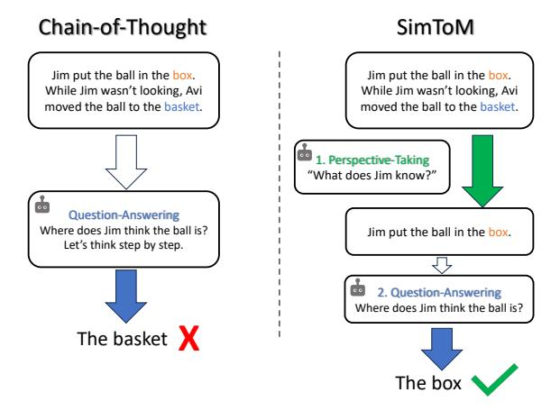
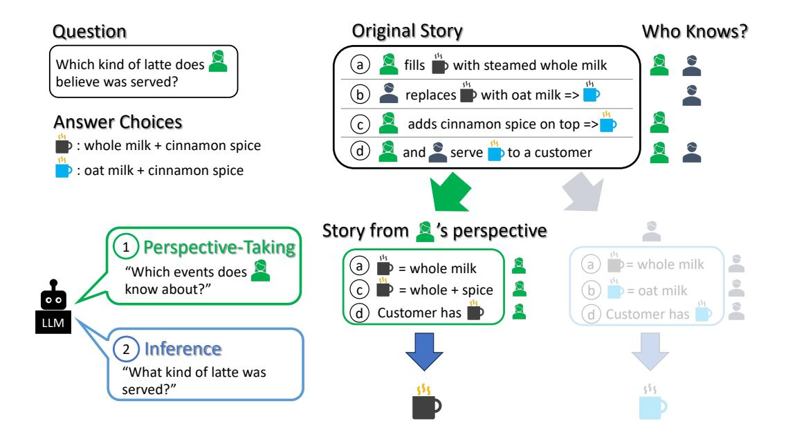

# Think Twice: Perspective-Taking Improves Large Language Models' Theory-of-Mind Capabilities

## Alex Wilf, Sihyun Shawn Lee, Paul Pu Liang, Louis-Philippe Morency

Carnegie Mellon University awilf@cs.cmu.edu

#### **Abstract**

Human interactions are deeply rooted in the interplay of thoughts, beliefs, and desires made possible by Theory of Mind (ToM): our cognitive ability to understand the mental states of ourselves and others. Although ToM may come naturally to us, emulating it presents a challenge to even the most advanced Large Language Models (LLMs). Recent improvements to LLMs' reasoning capabilities from simple yet effective prompting techniques such as Chain-of-Thought (CoT) (Wei et al., 2022) have seen limited applicability to ToM (Gandhi et al., 2023). In this paper, we turn to the prominent cognitive science theory "Simulation Theory" to bridge this gap. We introduce SIMTOM, a novel two-stage prompting framework inspired by Simulation Theory's notion of perspective-taking. To implement this idea on current ToM benchmarks, SIMTOM first filters context based on what the character in question knows before answering a question about their mental state. Our approach, which requires no additional training and minimal prompt-tuning, shows substantial improvement over existing methods, and our analysis reveals the importance of perspective-taking to Theory-of-Mind capabilities. Our findings suggest perspectivetaking as a promising direction for future research into improving LLMs' ToM capabilities. Our code is publicly available.

#### 1 Introduction

What did the group of friends feel as they gathered around the fire, exchanging stories and laughter and knowing glances? Underlying this seemingly commonplace setting is an intricate interplay of thoughts, beliefs, and desires weaving together the fabric of human interaction. This is the domain of Theory of Mind (ToM): the cognitive ability to attribute mental states to ourselves and others, and to understand that others have beliefs, desires, and intentions that may differ from our own (Premack and Woodruff, 1978; Wellman et al., 2001). This

<span id="page-0-0"></span>

Figure 1: Instead of performing Theory-of-Mind question-answering in a single inference pass, SIMTOM first prompts LLMs to perform *perspective-taking*: filtering the context only to what the character in question *knows*. Then, the LLM answers the question given this *filtered* context. The example in this figure is representative of the core idea underlying current benchmarks used to gauge LLMs' ToM capabilities, called the Sally-Anne false-belief tests (Baron-Cohen et al., 1985).

often unconscious ability is foundational to human cognition (Carruthers, 2009) and social interaction (Langley et al., 2022), yet it is a task that, despite its simplicity, seems to perplex even the most advanced Large Language Models (LLMs) (Gandhi et al., 2023; Sap et al., 2022). Recently, simple prompting strategies such as Chain-of-Thought (CoT) (Wei et al., 2022) have gained popularity because they can substantially improve LLM reasoning capabilities on some tasks without additional training or prompt tuning across models. Yet simple solutions to ToM still elude us (Gandhi et al., 2023). Are LLMs incapable of performing ToM reasoning? Or have we just not found the right way to prompt them yet?

Although most current LLM probing strategies employ a single inference pass to answer ToM questions (Gandhi et al., 2023), a prominent theory from cognitive science called "Simulation The-

ory" [\(Goldman,](#page-9-3) [2006\)](#page-9-3) postulates that humans utilize a distinct step *before* answering ToM questions called perspective-taking in which we "step into the other person's shoes", understanding their beliefs and goals before answering questions about their mental state [\(Barlassina and Gordon,](#page-9-4) [2017\)](#page-9-4). In the example in Figure [1,](#page-0-0) understanding Jim's perspective amounts to understanding Jim's *lack of knowledge* about a recent development (Avi moving the ball to the basket).

In this paper, we propose a simple two-stage prompting framework for LLMs inspired by Simulation Theory called SIMTOM that first implements perspective-taking, filtering the context only to what the person in question *knows*, before answering Theory-of-Mind questions *given that filtered context*. Our approach seamlessly integrates with pre-trained LLMs, requiring no additional training and minimal prompt-tuning across models, while still demonstrating substantial performance improvements over off-the-shelf models using 0 shot MC and CoT probing.

We perform extensive analysis and ablations of our method and find that LLM's are surprisingly capable of perspective-taking when prompted and that improved perspective-taking capabilities are tied closely to *further* improvements in ToM capabilities. These findings suggest that future research into Theory-of-Mind may find it useful to include SIMTOM as a simple yet effective baseline, and that this framework for thinking about ToM in LLMs may open new avenues for understanding and improving LLMs' abilities to simulate humanlike ToM reasoning. Our code is [publicly available.](https://github.com/shawnsihyunlee/simulatedtom)

## 2 Background

### 2.1 "Simulation" Theory of Mind

"Simulation Theory" (ST) [\(Goldman,](#page-9-3) [2006\)](#page-9-3) proposes an explanation for humans' ability to perform ToM that relies on a cognitive mechanism comprising two processes: perspective-taking ("putting yourself in their shoes"), followed by answering a ToM question from that perspective [\(Hurley,](#page-10-5) [2008;](#page-10-5) [Goldman,](#page-9-5) [2008\)](#page-9-5). ST has strong philosophical [\(Gor](#page-9-6)[don,](#page-9-6) [2007;](#page-9-6) [Evans,](#page-9-7) [1982;](#page-9-7) [Gordon,](#page-9-8) [1986\)](#page-9-8) and empirical supporte from decades of cognitive science research [\(Gallese and Goldman,](#page-9-9) [1998;](#page-9-9) [Gallese et al.,](#page-9-10) [2004;](#page-9-10) [Hurley,](#page-10-5) [2008\)](#page-10-5), though it is still an active area of debate (see Appendix [A](#page-11-0) for a detailed discussion).

Perspective-Taking ST argues that perspectivetaking, or placing oneself in another's position, is the initial step to simulating another's mental state. It involves simulating the beliefs and goals of the other individual. Crucial to this type of simulating are "imagining believing" what they believe [\(Cur](#page-9-11)[rie,](#page-9-11) [2002a;](#page-9-11) [Goldman,](#page-9-3) [2006\)](#page-9-3), or "imagining desiring" what they desire [\(Currie,](#page-9-12) [2002b\)](#page-9-12).

Question-Answering After perspective-taking, ST theorists argue that humans then answer a ToM question by observing and reasoning *as if you were in their shoes* [\(Barlassina and Gordon,](#page-9-4) [2017;](#page-9-4) [Gold](#page-9-5)[man,](#page-9-5) [2008\)](#page-9-5). Some theorists describe this as "reuse" of a "cognitive mechanism" [\(Hurley,](#page-10-5) [2008;](#page-10-5) [Craver,](#page-9-13) [2007\)](#page-9-13) shared between humans.

## 2.2 Are LLMs Capable of ToM?

Supervised models can perform well on ToM tasks after finetuning, but [Sclar et al.](#page-10-6) [\(2023\)](#page-10-6) show that they are brittle and overfit in ways that do not generalize to out-of-domain ToM tasks, suggesting that zero-shot methods may be more robust. As zeroshot methods and evaluation becoming increasingly common in NLP for this reason [\(Zhao et al.,](#page-10-7) [2023;](#page-10-7) [Sap et al.,](#page-10-8) [2019\)](#page-10-8), we consider the unsupervised zero-shot setting for this work as well.

Most modern LLMs struggle zero-shot on simple ToM tasks [\(Gandhi et al.,](#page-9-0) [2023;](#page-9-0) [Sap et al.,](#page-10-4) [2022\)](#page-10-4). Some have claimed that recent ToM capabilities have emerged in large models [\(Bubeck et al.,](#page-9-14) [2023;](#page-9-14) [Kosinski,](#page-10-9) [2023\)](#page-10-9), but others have argued that LLMs still fail on "trivial" alterations [\(Ullman,](#page-10-10) [2023\)](#page-10-10) to existing datasets, suggesting limitations in current benchmark approaches or possible dataset leakage to closed-source models' training sets [\(Shapira](#page-10-11) [et al.,](#page-10-11) [2023\)](#page-10-11).

Experimentally, current large models still lag behind human performance: for example, GPT-3.5-Turbo gets only 12.5% on the "action" subset of false belief questions in BigTOM [\(Gandhi](#page-9-0) [et al.,](#page-9-0) [2023\)](#page-9-0). We find in Section [6](#page-5-0) that GPT-4 still lags behind human performance substantially on ToMI [\(Le et al.,](#page-10-12) [2019\)](#page-10-12), and although it performs well on BigTOM, this may be partly because GPT-4 itself was used to create the BigTOM dataset. From the literature and these results, it appears that LLMs do not yet reliably display zero-shot ToM capabilities [\(Gandhi et al.,](#page-9-0) [2023\)](#page-9-0).

## <span id="page-2-4"></span>3 Benchmarking Theory-of-Mind Capabilities

One well studied method for evaluating theory of mind capabilities is through the Sally Anne falsebelief tests [\(Baron-Cohen et al.,](#page-9-1) [1985\)](#page-9-1). In essence, one agent (Sally) knows something about the world, then they leave, and another agent (Anne) changes something about the world. For example: Sally puts a ball in the basket then leaves the room, after which Anne moves the ball to the box.

We can then ask a few different types of questions, for example: "Where does Sally believe the ball is?" If Anne has moved the ball, Sally's belief will be incorrect – this type of question is called false belief, and has its counterpart in true belief questions, where Sally's belief about the world is correct. We can also ask about actions Sally would take as a result of those beliefs, for example: "What will Sally do when she returns looking for the ball?". And instead of asking about Sally directly, we could also ask about what Anne thinks Sally thinks – this is called a second order question, contrasted with the first order questions above.

To the best of our knowledge, there are two existing datasets that test these capabilities in the reading comprehension setting: ToMI and BigTOM. [1](#page-2-0)

## 3.1 ToMI

ToMI [\(Le et al.,](#page-10-12) [2019\)](#page-10-12) is a dataset of Sally-Anne stories, questions, and answer choices.[2](#page-2-1) For this paper, we use the updated version of ToMI from [\(Arodi and Cheung,](#page-9-15) [2021;](#page-9-15) [Sap et al.,](#page-10-4) [2022\)](#page-10-4) that has relabelled mislabelled second-order questions and disambiguated the location of containers after their reference (e.g., "The ball is in the basket. The basket is in the front yard.").

## 3.2 BigTOM

BigTOM [\(Gandhi et al.,](#page-9-0) [2023\)](#page-9-0) is also a Sally-Anne false belief-style ToM benchmark.[3](#page-2-2) However, Big-TOM evaluates ToM capabilities on a larger space of tasks than modification in object location and frames its stories in more natural language and social settings. BigTOM achieves this by building a causal template defining an agent's desire, percept, and initial belief, before generating a causal event that changes the environment and generating the resulting agent's belief or action. The authors of

BigTOM create these templates, and generate the outputs using GPT-4.

## <span id="page-2-5"></span>4 SIMTOM: SIMULATED Theory of Mind

SIMTOM is a simple two-stage prompting framework for that enhances zero-shot ToM capabilities in LLMs.

## 4.1 Motivation

We illustrate a motivating example in Figure [2.](#page-3-0) [4](#page-2-3) The story is as follows: the woman in green fills a cup with steamed whole milk, after which the woman *does not see* the man in purple replace the whole milk in the cup with oat milk. The woman then adds cinnamon spice on top, which *the man does not see*, then *both* observe that the customer receives their drink. The question is "Which kind of latte does the woman in green believe was served? Whole milk + cinnamon spice, or oat milk + cinnamon spice?" The correct answer is whole milk + cinnamon spice, because the woman is not aware of the change the man made.

0-shot CoT prompting will pass the whole story in as context and ask the LLM to reason through the answer:

## **CoT Prompting**

{story} {question} {answer choices} Answer the question based on the context. Reason step by step before answering.

However, CoT will often output the *true answer* – in this case, the type of latte the customer *actually received*: oat milk + cinnamon spice. This amounts to a failure of perspective-taking: answering the question based on *what she knows and what she does not know, regardless of whether it is correct or not*.

Motivated by this intuition and the literature on Simulation Theory, we hypothesize that LLMs' may be having difficulty with ToM reasoning because they are attempting to perform two tasks in a *single inference pass*: perspective-taking and question-answering. To solve this, we break the ToM reasoning process into two inference passes:

## 1. Perspective-Taking: understand what the woman knows

<span id="page-2-0"></span><sup>1</sup>Both datasets are available in the English language only.

<span id="page-2-1"></span><sup>2</sup>Made publicly available with the [CC License.](https://github.com/facebookresearch/ToMi/blob/master/LICENSE)

<span id="page-2-2"></span><sup>3</sup>Made publicly available with the [MIT license.](https://github.com/cicl-stanford/procedural-evals-tom/blob/main/LICENSE)

<span id="page-2-3"></span><sup>4</sup>The example we use is very similar to an actual question from BigTOM [\(Gandhi et al.,](#page-9-0) [2023\)](#page-9-0), although with two false beliefs instead of one.

<span id="page-3-0"></span>

Figure 2: An overview of SIMTOM, a two-stage prompting framework for enhancing zero-shot Theory-of-Mind capabilities in LLMs. The first step is **perspective-taking**, in which a model attempts to understand what the agent knows and wants. We then query the LLM to **infer** the answer to the question given this *perspective*.

2. **Question-Answering**: answer the question given *what the woman knows* (*not* the whole story)

#### 4.2 Perspective-Taking

Barlassina and Gordon (2017) describe Perspective-Taking as "switching roles" to understand the other person's "relevant beliefs and goals". In SIMTOM, we implement this in a simple, concrete way: by asking models to first *filter* the story to only the events that the character in question knows about.<sup>5</sup>. To do this, we prompt an LLM as follows:

# SimToM Step #1: Perspective-Taking The following is a sequence of events: {story} Which events does {character\_name} know about?

#### 4.3 Question-Answering

Question-Answering proceeds just as in baseline 0-shot or CoT, except that we replace the *full story* with our *modified* version resulting from Perspective-Taking. The story is modified so that information that the agent does not know about is *hidden* from

the LLM when it answers the question. In this example, the woman does not know that the man swapped the milk, so that information is removed during perspective-taking.

```
SimToM Step #2: Question-Answering

{story from character_name's perspective}
Answer the following question:
{question}
```

In this example, the story from the woman in green's perspective is: she fills a cup with steamed whole milk, adds cinnamon spice, and serves it to a customer. During Question-Answering, we would prompt the model *only* with this perspective, then ask the same question of the model.

#### <span id="page-3-2"></span>5 Experimental Details

Our experiments are intended to investigate the effectiveness of our method by evaluate LLMs 0-shot on ToM benchmarks with and without our SIMTOM prompting framework. In this section, we detail how models are prompted and evaluated on the benchmarks described in Section 3: BigTOM and ToMI.

#### 5.1 Prompting

We evaluate LLMs using MC-probing: we prompt models with a story, a question, and answer choices,

<span id="page-3-1"></span><sup>&</sup>lt;sup>5</sup>Our implementation of SIMTOM requires the name of the character the question asks about – e.g., "the woman in green". We parse this during preprocessing, described in Section 5.

<span id="page-4-0"></span>Table 1: SIMTOM results on BigTOM and ToMI across False Belief and All question types. We include the absolute accuracy difference between SIMTOM and the baselines (0-shot and 0-shot CoT) in parentheses.

|                        |                                         | False Belief                              | All                                     |                                        |  |  |
|------------------------|-----------------------------------------|-------------------------------------------|-----------------------------------------|----------------------------------------|--|--|
| Method                 | BigTOM                                  | ToMI                                      | BigTOM                                  | ToMI                                   |  |  |
| 0-Shot                 |                                         |                                           |                                         |                                        |  |  |
| Llama2-7b-chat         | 47.5                                    | 28.25                                     | 53.62                                   | 44.5                                   |  |  |
| Llama2-13b-chat        | 41.25                                   | 39.25                                     | 51.38                                   | 51.0                                   |  |  |
| gpt-3.5-turbo          | 41.0                                    | 67.25                                     | 66.38                                   | 68.6                                   |  |  |
| gpt-4                  | 89.0                                    | 25.5                                      | 92.5                                    | 66.5                                   |  |  |
| 0-shot CoT             |                                         |                                           |                                         |                                        |  |  |
| Llama2-7b-chat         | 31.5                                    | 24.0                                      | 48.62                                   | 43.7                                   |  |  |
| Llama2-13b-chat        | 52.25                                   | 16.5                                      | 56.0                                    | 45.0                                   |  |  |
| gpt-3.5-turbo          | 56.25                                   | 34.0                                      | 75.88                                   | 64.1                                   |  |  |
| gpt-4                  | 93.25                                   | 74.25                                     | 95.5                                    | 74.4                                   |  |  |
| SIMTOM                 |                                         |                                           |                                         |                                        |  |  |
| Llama2-7b-chat         | 70.5 (+23.0, 39.0)                      | 40.0 (+11.8, 16.0)                        | 57.25 (+3.6, 8.6)                       | 48.1 (+3.6, 4.4)                       |  |  |
| Llama2-13b-chat        | 61.75 (+20.5, 9.5)                      | 35.5 (-3.8, +19.0)                        | 58.0 (+6.6, 2.0)                        | 61.1 (+10.1, 16.1)                     |  |  |
| gpt-3.5-turbo<br>gpt-4 | 70.5 (+29.5, 14.2)<br>92.0 (+3.0, -1.2) | 81.0 (+13.8, 47.0)<br>87.75 (+62.2, 13.5) | 81.62 (+15.2, 5.7)<br>95.0 (+2.5, -0.5) | 72.8 (+4.2, 8.7)<br>87.8 (+21.3, 13.4) |  |  |

and ask it to choose the correct answer choice given the question and story. Models can decline to answer (and the Llama models often do this), which can reduce their performance below 50% random accuracy. We reproduce our 0-shot prompts exactly in Appendix [E.](#page-14-0)

Our prompts for SIMTOM vary somewhat based on the structure of the dataset, and vary minimally between Llama and GPT models. We reproduce the exact prompts used in Appendix [B.](#page-11-1)

## 5.2 Evaluation

Because false belief questions are the most challenging question category for modern models [\(Gandhi et al.,](#page-9-0) [2023\)](#page-9-0) and are at the core of the "Sally-Anne False-Belief Tests", we report our results averaged across all false belief question types and across All question types in our results. For BigTOM, this means averaging across "Forward Action" and "Belief" false belief questions; for ToMI, this includes averaging across first and second order question types.

We evaluate our approach on four state of the art language models: two open source – Llama2- 7b and 13-b chat [\(Touvron et al.,](#page-10-13) [2023\)](#page-10-13) – and two closed source: GPT-3.5-Turbo and GPT-4 [\(OpenAI,](#page-10-14) [2023\)](#page-10-14). We query all models with temperature=0.0 for reproducibility. We run inference on the open

source models on a single A100 GPU, and query the closed-source models using their API. The result for one model on one benchmark takes around three hours to run.

BigTOM In our experiments we consider the "Forward Action" and "Forward Belief" questions and not the "Backward Belief" so as to closely mimic the structure of the ToMI questions. Big-TOM is balanced, with 200 questions per question type, so we do not randomly sample as we do for ToMI. BigTOM is a binary MC task, with random accuracy being 50%. We parse the character name deterministically: it is the first word in each story.

ToMI To evaluate our methods on ToMI [\(Le](#page-10-12) [et al.,](#page-10-12) [2019\)](#page-10-12), we randomly sample 100 samples from each of the ten question types to create a balanced dataset of 1000 samples. We parse the name of the character in question deterministically: because ToMI is created from templates, the character name is always the third word in the question.

The original ToMI dataset does not include the answer choices in the questions. We find that this artificially depresses baseline performance, as LLMs often output ambiguous answers. For example, an LLM outputted this answer to a ToMI question: "Charlotte look for the melon in the front yard", despite the only valid choices being either

container A or B (both situated in the front yard). To rectify this, we parse the ToMI stories and include both possible answer choices (e.g., A and B) from the template used for story creation when querying the model. This process makes this setting a binary multiple-choice task similar to Big-TOM. A random guessing baseline would have 50% accuracy.

## <span id="page-5-0"></span>6 Results and Discussion

We find that SIMTOM leads to substantial performance improvements over 0-shot MC and CoT prompting. Our results in Table [1](#page-4-0) reflect these gains across both the BigTOM and ToMI benchmarks.

BigTOM Results On the BigTOM benchmark, SIMTOM provides substantial performance improvements across models. Notably, on the challenging false belief subset, SIMTOM provides 29.5% and 14.2% absolute accuracy improvements over the 0-shot and 0-shot CoT GPT-3.5- Turbo baselines, along with similarly strong results across other model types. SIMTOM led to a slight decrease with GPT-4, though this result may be partially confounded by the fact that BigTOM was generated using GPT-4. Across all question types as well, SIMTOM performed strongly compared with 0-shot CoT probing, leading to 8.6% and 5.7% absolute improvements on Llama2-7bchat and GPT-3.5-Turbo for False Belief questions. We again saw comparable performance with the strongest model, GPT-4, which had saturated human performance 0-shot [\(Gandhi et al.,](#page-9-0) [2023\)](#page-9-0).

ToMI Results SIMTOM also yields improvement over 0-shot baselines across LLMs on the ToMI benchmark. Compared to 0-shot CoT on false belief (FB) questions SIMTOM increased absolute accuracy by 16%, 19%, and a surprising 47% absolute accuracy for Llama2-7b-chat, Llama2-13b-chat, and GPT-3.5-Turbo. It is worth noting that 0-shot CoT did not perform reliably better than 0-shot, though our method performed better than both most of the time. Across all question types, SIMTOM also provided performance increases as well, although more modest, as modern models find control conditions much less challenging (e.g., "True Belief" tests, which can be answered by understanding the true state of objects *without* understanding mental states relating to them). These improvements were

still substantial, with GPT-4 seeing a 13.4% improvement and Llama-2-13b-chat improving by 16.1% over 0-shot CoT probing. Additionally, we tested two additional prompting strategies: Self-Consistency CoT [\(Wang et al.,](#page-10-15) [2022\)](#page-10-15) and Treeof-Thoughts [\(Yao et al.,](#page-10-16) [2023\)](#page-10-16) on the GPT-3.5- Turbo model. SC-CoT performs similarly to CoT across question categories, underperforming SIM-TOM significantly (33.50% on FB compared to 81.00%). Tree-of-Thoughts also underperforms SIMTOM substantially, perhaps because the original Tree-of-Thoughts voting evaluates creative writing generations instead of rationales. In general, we find that second-order questions are more difficult for most models than first-order questions; a detailed breakdown of these results across question types can be found in Appendix [G.](#page-15-0)

## 7 Analysis

We rigorously analyze SIMTOM with additional experiments and ablations intended to better understand our method explore the opportunities and it uncovers.

## <span id="page-5-1"></span>7.1 Ablation Study: Single-Prompt SIMTOM

Given SIMTOM's strong performance, we are curious to determine whether our intuition from Section [4](#page-2-5) is correct: that performing perspective-taking in a *separate* prompt before question-answering is important for enhancing LLMs' ToM capabilities.

To evaluate this, we implement a one-prompt ablation of SIMTOM, SIMTOM-Single, that combines perspective-taking and question-answering in a single prompt. A simplified version of our prompt is below, and our prompts are reproduced in full in Appendix [C.](#page-13-0) We run our ablation experiments using GPT-3.5-Turbo. Our results are depicted in Table [2.](#page-6-0)

### **SimToM-Single**

Your task is in two steps. Step 1. output only the events that {character\_name} knows about. Step 2. Imagine you are {character\_name}, then answer a question based only on the events {character\_name} knows about. Story: {story} Question: {question}

Interestingly, we find that performing perspective-taking before question-answering in a single prompt is not nearly as effective as performing the same process with two prompts.

<span id="page-6-0"></span>Table 2: Ablation Analysis of SIMTOM: we find that performing perspective-taking and question-answering in two prompts is necessary, as SIMTOM-Single does not lead to the same performance improvements over baselines. We also find that *perspective-taking* is important, as SIMTOM-Multi implements a two-step prompting asking first for rationale. By contrast, domain-specific perspective-taking prompting (SIMTOM-Domain) designed to simulate more advanced perspective-taking systems, leads to substantial performance gains, and oracle perspectivetaking (SIMTOM-Oracle) from human-annotated perspectives can help today's LLM's nearly solve current ToM benchmarks. +/- values are absolute accuracy differences relative to SIMTOM, described in Section [4.](#page-2-5)

|               |                | False Belief   | All          |                |  |  |
|---------------|----------------|----------------|--------------|----------------|--|--|
| Method        | ToMI           | BigTOM         | ToMI         | BigTOM         |  |  |
| 0-shot        | 67.25          | 41.0           | 68.6         | 66.38          |  |  |
| 0-shot CoT    | 34.0           | 56.25          | 64.1         | 75.88          |  |  |
| SIMTOM        | 81.0           | 70.5           | 72.8         | 81.62          |  |  |
| SIMTOM-Single | 58.75 (-22.25) | 50.75 (-19.75) | 67.5 (-5.3)  | 54.75 (-26.87) |  |  |
| SIMTOM-Multi  | 31.75 (-49.25) | 37.25 (-33.25) | 46.8 (-26.0) | 58.25 (-23.37) |  |  |
| SIMTOM-Domain | 85.5 (+4.5)    | 90.5 (+20)     | 79.3 (+6.5)  | 91.5 (+9.88)   |  |  |
| SIMTOM-Oracle | 96 (+15)       | 96 (+25.5)     | 82 (+9.2)    | 98 (+16.38)    |  |  |

Qualitatively, we find that single-inference approaches (i.e., 0-shot, 0-shot CoT, and SIMTOM-Single) fail in similar ways: LLMs prompted in this way often answer the question with respect to the world state instead of with respect to the person's mental state. For example, in the example from Figure [2,](#page-3-0) LLMs would output "oat milk + cinnamon spice". This result supports our intuition from Section [4,](#page-2-5) that LLMs may benefit from a *separate* perspective-taking step when performing ToM reasoning tasks.

In addition to ablating our method, we were curious whether SimTOM's strong performance was a result of its multi-turn nature instead of the exact structure of its multistep prompting strategy. To evaluate this, we also attempted a multi-step version of CoT: in the first step asking the model to output its reasoning, thinking "step by step", then in the second asking it to answer a question given this reasoning. This strategy effectively replaces our "perspective-taking" with a "reasoning" step, holding the rest of the experiment constant. The performance of the 0-shot CoT model plummeted; reducing to 58.25% on BigTOM total (a reduction of 17.63% from 0-shot CoT and a reduction of 23.37 from SIMTOM) and to 46.8% on ToMI (a reduction of (17.3%). This indicates that the strength of SimTOM is not purely in its multi-step nature, but in the perspective-taking step specifically.

### <span id="page-6-1"></span>7.2 Oracle Perspective-Taking

In this analysis, we investigate perspective-taking further by asking how much of the remaining per-

formance gap *can be improved with more effective perspective taking*. Put another way, can today's models answer ToM questions in ToMI and Big-TOM given a well-filtered story? If so, perspectivetaking may be justifiably described as a core challenge in future ToM research.

To evaluate this, we create a small dataset of "oracle perspectives": we ask four paid human annotators to output the "perspective" given the story and the name of the person, then use models to perform question-answering *contingent on this perspective, a human-edited subset of the story*. We give annotators the same perspective-taking prompts as we give to GPT-3.5-Turbo (see Appendix [B\)](#page-11-1), and additionally instruct them to output only a subset of the story, not add any additional information. Just as in Section [4,](#page-2-5) they are not shown the question or answer choices during the process of perspectivetaking. To construct this dataset, we sample from the benchmarks in a balanced manner: 100 questions from each question type across both benchmarks.

We find that with oracle perspective-taking, models can infer substantially better than with modelgenerated perspective-taking: improving on ToMI False Belief from 81.0% to 96% accuracy, and on BigTOM False Belief from 70.5% to 96.0% accuracy, close to solving these challenging false belief tasks. Performance lags behind on all ToMI questions, likely because of the different question types that do not specifically test this kind of simulation, including true belief, "memory" and "reality"-style questions. Our analysis results are shown in Table [2,](#page-6-0) in the row SIMTOM-Oracle. From this we conclude that human-level perspective-taking capabilities could enable today's LLM's to nearly solve current ToM benchmarks.

## <span id="page-7-0"></span>7.3 Domain-Specific Perspective-Taking Strategies

We next investigate to what extent current LLM's are capable of improving their perspective-taking capabilities.

To explore this question, we simulate how LLMs with advanced perspective-taking capabilities would perform on ToM by enhancing the SIM-TOM with 3 examples of perspective-taking drawn from in-domain ToMI stories. The prompts follow the simplified form below. For the exact prompts, please refer to Appendix [D.](#page-14-1)

## **SimToM-Domain** Story: 1 Jackson is wearing the pajamas 2 Logan entered the dining room ... Which events does Logan know about? Logan knows about the following events: 2 Logan entered the dining room ...

Because we include examples of perspectivetaking, we refer to this result as Domain-Specific Perspective-Taking, depicted in Table [2](#page-6-0) as SIM-TOM-Domain. We find that Domain-Specific perspective taking strategies lead to a substantial performance gain over SIMTOM, including from 70.5% to 90.5% on False Belief tests in BigTOM, a 20% absolute accuracy improvement (a 34.25% absolute improvement over 0-shot CoT), and from 72.8 to 79.3 across all ToMI questions, a 6.5% accuracy improvement. This result suggests that LLMs with improved perspective-taking capabilities may display subsantially stronger ToM capabilities. And although these performances are strong, there is still a gap to ToM based on oracle-level perspective-taking: SIMTOM-Domain lags behind SIMTOM-Oracle by over 10% on ToMI false belief, by 5.5% on BigTOM false belief, and by over 3 and 6% on All question types respectively. Future work in ToM may therefore find it fruitful to investigate perspective-taking capabilities more deeply.

## 7.4 Extension to Complex Theory-of-Mind Scenarios

One concern with SimTOM may be that it fails to generalize to more complex, real-world ToM scenarios than the synthetic BigTOM and ToMI datasets. To evaluate this, we investigate our method qualitatively on a small, hand-selected subset of 30 questions drawn from the real-world CosmosQA dataset [\(Huang et al.,](#page-10-17) [2019\)](#page-10-17) that test ToM capabilities.

On BigTOM and ToMI, perspective-taking takes the form of hiding information because all information is known to the omniscient narrator. However, in a real-world context this will not always be the case, and so perspective-taking may involve more *inferring* than *hiding* information. We observed this to be the case on the CosmosQA dataset. For example, given a question drawn from a blog post about why the speaker's romantic interest did not return a message, GPT-3.5-Turbo outputted the following as the person of interest's perspective: "it's possible that I wasn't yet completely invested in the relationship or had other priorities such as schoolwork". Interestingly, in this case the perspectivetaking actually infers the key information necessary to answer the question correctly (that the person may have been busy with schoolwork) based on only a tangential mention of studying in the original question. However, this was not always the case; oftentimes model imputations were more "hallucination" than "inference". In some cases the model took liberties with the framing of the perspective that led to incorrect inferences; in another case the model even outputted a detailed perspective based on an entirely made up premise absent from the question. The relationship between hallucination and inference will be of particular importance when applying perspective-taking to scenarios with limited information, such as many real-world ToM applications.

## 8 Related Work

Evaluating LLM Capabilities on ToM Recent approaches on evaluating zero-shot LLM capabilities on ToM have made use of LM probing [\(Sap](#page-10-4) [et al.,](#page-10-4) [2022\)](#page-10-4), often replaced by MC [\(Sap et al.,](#page-10-4) [2022;](#page-10-4) [Shapira et al.,](#page-10-11) [2023\)](#page-10-11) and CoT probing [\(Wei](#page-10-0) [et al.,](#page-10-0) [2022;](#page-10-0) [Kojima et al.,](#page-10-18) [2022\)](#page-10-18) for instructiontuned models. Though these prompt-styles can elicit different performance capabilities [\(Wei et al.,](#page-10-0) [2022\)](#page-10-0), we modify our prompts only minimally to evaluate our hypotheses, motivated by [Shapira et al.](#page-10-11) [\(2023\)](#page-10-11)'s argument that excessive prompt-tuning violates a "reasonable expectation" of evaluation standards for LLMs on ToM.

Enhancing LLM Reasoning Capabilities Motivated in part by early results that transformers can engage in reasoning tasks [\(Clark et al.,](#page-9-16) [2020\)](#page-9-16), a number of prompt-based methods for enhancing LLM reasoning capabilities have been published in recent years, such as ProofWriter [\(Tafjord et al.,](#page-10-19) [2020\)](#page-10-19). [Shi et al.](#page-10-20) [\(2023\)](#page-10-20) point out that LLMs can be easily distracted by irrelevant information during reasoning, and [Creswell et al.](#page-9-17) [\(2022\)](#page-9-17) use LLMs to select relevant facts before inferring new ones. This selection is somewhat similar to our perspectivetaking, but a key distinction lies in that perspectivetaking attempts not only to isolate *relevant* facts, but ones that agents *should not know about* when being simulated – it is not clear how to implement *relevance* for selection in ToM.

Recent approaches have also combined LLM reasoning with symbolic reasoning algorithms. [Nye](#page-10-21) [et al.](#page-10-21) [\(2021\)](#page-10-21) separates "System 1" and "System 2" into neural- and symbolic-systems respectively to perform reasoning tasks. A relevant contemporaneous work, [Sclar et al.](#page-10-6) [\(2023\)](#page-10-6), uses LLMs to construct a symbolic belief state graph and answers questions using an inference-time graph algorithm. It is not clear, however, how to apply these symbolic methods to naturalistic ToM datasets in such as BigTOM. More broadly, these approaches both represent a distinct direction to ours, as our approach studies how to enable ToM capabilities in LLMs without external memory or human-written inference-time algorithms.

## 9 Conclusion

In this paper, we propose a two-prompt approach to eliciting Theory-of-Mind capabilities in LLMs by first asking LLMs to perspective-take: to filter context to what the character in question knows. We find that LLMs are substantially stronger at ToM reasoning than they appear when probed with a single inference pass. Our key takeaways from rigorously analyzing SIMTOM are that (1) that perspective-taking is best implemented as a separate prompt before question-answering, instead of in a single prompt (Section [7.1\)](#page-5-1); (2) that *today's* LLMs could close-to-solve ToM benchmarks with access to oracle perspective-taking capabilities (Section [7.2\)](#page-6-1); and (3) that LLMs with improved perspective-taking capabilities could achieve even stronger performance on ToM tasks (Section [7.3\)](#page-7-0).

## 10 Future Work

Future work on building ToM capabilities into LLMs may find it fruitful to explore both evaluating and enhancing LLMs' perspective-taking capabilities. The idea of perspective-taking has a broader scope in cognitive science [\(Barlassina and Gordon,](#page-9-4) [2017;](#page-9-4) [Gordon,](#page-9-8) [1986\)](#page-9-8) than is currently being tested in simple Sally-Anne false-belief tests, where belief states primarily concern object locations. Further evaluating models' perspective-taking capabilities in more complex, lifelike ToM settings may uncover new challenges in modeling perspectivetaking.

## Limitations

One limitation of our work is that perspectivetaking is currently implemented by "hiding" parts of the original story when answering the question from an agent's perspective. Perspective-taking may not always involve "hiding" information from a complete knowledge of the world state, and in some cases could require feasibly imputing unseen information (e.g., "Imagine you were in their shoes..."). This is mainly due to a limitation in the datasets we use to test our method; to the best of our knowledge current reading comprehension datasets for ToM are of the Sally-Anne belief form, which tests basic abilities to anticipate beliefs and actions given a change to the world state that we (omniscient viewers) are aware of, but the character is not. Another limitation is that we have not performed tests with smaller language models than 7B parameters; it may be the case that only LLMs are capable of performing ToM to this level using SIMTOM. As LLMs are improving in performance, however, this may not be a limitation that is particularly disruptive to future research in ToM.

## Acknowledgements

This material is based upon work partially supported by National Science Foundation awards 1722822 and 1750439, and National Institutes of Health awards R01MH125740, R01MH132225, R01MH096951 and R21MH130767. Any opinions, findings, conclusions, or recommendations expressed in this material are those of the author(s) and do not necessarily reflect the views of the sponsors, and no official endorsement should be inferred. We would also like to thank Daniel Fried for insightful comments and suggestions related to this project.

## Ethics

Advanced ToM capabilities applied to real world settings could have unethical use cases and modes of operation. Unethical use cases could include inferring mental states without consent, particularly as part of deceptive politically or financially motivated automated persuasion techniques. Unethical modes of operation could include inaccurately, harmfully, or unfairly interacting with users based on ToM inferences in ways that could amplify the negative effects of biases in LLMs. However, there are many upsides of advanced ToM capabilities as well, including the benefits of more empathetic and socially aware technology. As AI seems to be trending towards inclusion in a broader swath of interactive products, advanced ToM could become increasingly impactful to the way we interact with the software systems around us. We would recommend that future research that focuses on use cases that directly interact with people (instead of offline prediction, as in our experiments), particularly in domains or tasks that may be harmful (such as unconscious belief change) carefully consider the distribution of outcomes improved ToM capabilities in that domain would effect.

# References

- <span id="page-9-15"></span>Akshatha Arodi and Jackie Chi Kit Cheung. 2021. Textual time travel: A temporally informed approach to theory of mind. In *Findings of the Association for Computational Linguistics: EMNLP 2021*, pages 4162–4172.
- <span id="page-9-4"></span>Luca Barlassina and Robert M. Gordon. 2017. Folk Psychology as Mental Simulation. In Edward N. Zalta, editor, *The Stanford Encyclopedia of Philosophy*, Summer 2017 edition. Metaphysics Research Lab, Stanford University.
- <span id="page-9-1"></span>Simon Baron-Cohen, Alan M Leslie, and Uta Frith. 1985. Does the autistic child have a "theory of mind"? *Cognition*, 21(1):37–46.
- <span id="page-9-14"></span>Sébastien Bubeck, Varun Chandrasekaran, Ronen Eldan, Johannes Gehrke, Eric Horvitz, Ece Kamar, Peter Lee, Yin Tat Lee, Yuanzhi Li, Scott Lundberg, et al. 2023. Sparks of artificial general intelligence: Early experiments with gpt-4. *arXiv preprint arXiv:2303.12712*.
- <span id="page-9-2"></span>Peter Carruthers. 2009. [How we know our own](https://doi.org/10.1017/S0140525X09000545) [minds: The relationship between mindreading and](https://doi.org/10.1017/S0140525X09000545) [metacognition.](https://doi.org/10.1017/S0140525X09000545) *Behavioral and Brain Sciences*, 32(2):121–138.

- <span id="page-9-16"></span>Peter Clark, Oyvind Tafjord, and Kyle Richardson. 2020. Transformers as soft reasoners over language. *arXiv preprint arXiv:2002.05867*.
- <span id="page-9-13"></span>Carl F. Craver. 2007. *Explaining the Brain: Mechanisms and the Mosaic Unity of Neuroscience*. New York : Oxford University Press,: Oxford University Press, Clarendon Press.
- <span id="page-9-17"></span>Antonia Creswell, Murray Shanahan, and Irina Higgins. 2022. Selection-inference: Exploiting large language models for interpretable logical reasoning. *arXiv preprint arXiv:2205.09712*.
- <span id="page-9-11"></span>Gregory Currie. 2002a. [1Introduction.](https://doi.org/10.1093/acprof:oso/9780198238089.003.0001) In *Recreative Minds*. Oxford University Press.
- <span id="page-9-12"></span>Gregory Currie. 2002b. Desire in imagination. In Tamar Szabo Gendler and John Hawthorne, editors, *Conceivability and Possibility*, pages 201–221. Oxford University Press.
- <span id="page-9-7"></span>Gareth Evans. 1982. *The Varieties of Reference*. Oxford: Oxford University Press.
- <span id="page-9-9"></span>Vittorio Gallese and Alvin Goldman. 1998. Mirror neurons and the simulation theory of mind-reading. *Trends in cognitive sciences*, 2(12):493–501.
- <span id="page-9-10"></span>Vittorio Gallese, Christian Keysers, and Giacomo Rizzolatti. 2004. A unifying view of the basis of social cognition. *Trends in cognitive sciences*, 8(9):396– 403.
- <span id="page-9-0"></span>Kanishk Gandhi, Jan-Philipp Fränken, Tobias Gerstenberg, and Noah D Goodman. 2023. Understanding social reasoning in language models with language models. *arXiv preprint arXiv:2306.15448*.
- <span id="page-9-3"></span>Alvin I. Goldman. 2006. *Simulating Minds: The Philosophy, Psychology, and Neuroscience of Mindreading*. New York, US: Oxford University Press USA.
- <span id="page-9-5"></span>Alvin I. Goldman. 2008. [Hurley on simulation.](https://doi.org/https://doi.org/10.1111/j.1933-1592.2008.00221.x) *Philosophy and Phenomenological Research*, 77(3):775– 788.
- <span id="page-9-20"></span>Alison Gopnik and Henry M Wellman. 1994. The theory theory. In *An earlier version of this chapter was presented at the Society for Research in Child Development Meeting, 1991.* Cambridge University Press.
- <span id="page-9-8"></span>Robert M. Gordon. 1986. [Folk psychology as simula](https://doi.org/10.1111/j.1468-0017.1986.tb00324.x)[tion.](https://doi.org/10.1111/j.1468-0017.1986.tb00324.x) *Mind and Language*, 1(2):158–71.
- <span id="page-9-18"></span>Robert M. Gordon. 1995. Simulation without introspection or inference from me to you. In Martin Davies and Tony Stone, editors, *Mental Simulation*. Blackwell.
- <span id="page-9-6"></span>Robert M. Gordon. 2007. [Ascent routines for proposi](https://doi.org/10.1007/s11229-007-9202-9)[tional attitudes.](https://doi.org/10.1007/s11229-007-9202-9) *Synthese*, 159(2):151–165.
- <span id="page-9-19"></span>Jane Heal. 1994. Simulation vs. theory-theory: What is at issue? In Christopher Peacocke, editor, *Objectivity, Simulation and the Unity of Consciousness: Current Issues in the Philosophy of Mind*. Oxford University Press.

- <span id="page-10-17"></span>Lifu Huang, Ronan Le Bras, Chandra Bhagavatula, and Yejin Choi. 2019. Cosmos qa: Machine reading comprehension with contextual commonsense reasoning. *arXiv preprint arXiv:1909.00277*.
- <span id="page-10-5"></span>Susan Hurley. 2008. [Understanding simulation1.](https://doi.org/https://doi.org/10.1111/j.1933-1592.2008.00220.x) *Philosophy and Phenomenological Research*, 77(3):755– 774.
- <span id="page-10-18"></span>Takeshi Kojima, Shixiang Shane Gu, Machel Reid, Yutaka Matsuo, and Yusuke Iwasawa. 2022. Large language models are zero-shot reasoners. *Advances in neural information processing systems*, 35:22199– 22213.
- <span id="page-10-9"></span>Michal Kosinski. 2023. Theory of mind may have spontaneously emerged in large language models. *arXiv preprint arXiv:2302.02083*.
- <span id="page-10-3"></span>Christelle Langley, Bogdan Ionut Cirstea, Fabio Cuzzolin, and Barbara J Sahakian. 2022. Theory of mind and preference learning at the interface of cognitive science, neuroscience, and ai: A review. *Frontiers in Artificial Intelligence*, 5:62.
- <span id="page-10-12"></span>Matthew Le, Y-Lan Boureau, and Maximilian Nickel. 2019. Revisiting the evaluation of theory of mind through question answering. In *Proceedings of the 2019 Conference on Empirical Methods in Natural Language Processing and the 9th International Joint Conference on Natural Language Processing (EMNLP-IJCNLP)*, pages 5872–5877.
- <span id="page-10-21"></span>Maxwell Nye, Michael Tessler, Josh Tenenbaum, and Brenden M Lake. 2021. Improving coherence and consistency in neural sequence models with dualsystem, neuro-symbolic reasoning. *Advances in Neural Information Processing Systems*, 34:25192– 25204.
- <span id="page-10-14"></span>OpenAI. 2023. [Gpt-4 technical report.](http://arxiv.org/abs/2303.08774)
- <span id="page-10-1"></span>David Premack and Guy Woodruff. 1978. Does the chimpanzee have a theory of mind? *Behavioral and brain sciences*, 1(4):515–526.
- <span id="page-10-4"></span>Maarten Sap, Ronan LeBras, Daniel Fried, and Yejin Choi. 2022. Neural theory-of-mind? on the limits of social intelligence in large lms. *arXiv preprint arXiv:2210.13312*.
- <span id="page-10-8"></span>Maarten Sap, Hannah Rashkin, Derek Chen, Ronan Le Bras, and Yejin Choi. 2019. [Social IQa: Com](https://doi.org/10.18653/v1/D19-1454)[monsense reasoning about social interactions.](https://doi.org/10.18653/v1/D19-1454) In *Proceedings of the 2019 Conference on Empirical Methods in Natural Language Processing and the 9th International Joint Conference on Natural Language Processing (EMNLP-IJCNLP)*, pages 4463– 4473, Hong Kong, China. Association for Computational Linguistics.
- <span id="page-10-6"></span>Melanie Sclar, Sachin Kumar, Peter West, Alane Suhr, Yejin Choi, and Yulia Tsvetkov. 2023. [Minding lan](https://aclanthology.org/2023.acl-long.780)[guage models' \(lack of\) theory of mind: A plug-and](https://aclanthology.org/2023.acl-long.780)[play multi-character belief tracker.](https://aclanthology.org/2023.acl-long.780) In *Proceedings of the 61st Annual Meeting of the Association for*

- *Computational Linguistics (Volume 1: Long Papers)*, pages 13960–13980, Toronto, Canada. Association for Computational Linguistics.
- <span id="page-10-11"></span>Natalie Shapira, Mosh Levy, Seyed Hossein Alavi, Xuhui Zhou, Yejin Choi, Yoav Goldberg, Maarten Sap, and Vered Shwartz. 2023. Clever hans or neural theory of mind? stress testing social reasoning in large language models. *arXiv preprint arXiv:2305.14763*.
- <span id="page-10-20"></span>Freda Shi, Xinyun Chen, Kanishka Misra, Nathan Scales, David Dohan, Ed H Chi, Nathanael Schärli, and Denny Zhou. 2023. Large language models can be easily distracted by irrelevant context. In *International Conference on Machine Learning*, pages 31210–31227. PMLR.
- <span id="page-10-19"></span>Oyvind Tafjord, Bhavana Dalvi Mishra, and Peter Clark. 2020. Proofwriter: Generating implications, proofs, and abductive statements over natural language. *arXiv preprint arXiv:2012.13048*.
- <span id="page-10-13"></span>Hugo Touvron, Louis Martin, Kevin Stone, Peter Albert, Amjad Almahairi, Yasmine Babaei, Nikolay Bashlykov, Soumya Batra, Prajjwal Bhargava, Shruti Bhosale, et al. 2023. Llama 2: Open foundation and fine-tuned chat models. *arXiv preprint arXiv:2307.09288*.
- <span id="page-10-10"></span>Tomer Ullman. 2023. Large language models fail on trivial alterations to theory-of-mind tasks. *arXiv preprint arXiv:2302.08399*.
- <span id="page-10-15"></span>Xuezhi Wang, Jason Wei, Dale Schuurmans, Quoc Le, Ed Chi, Sharan Narang, Aakanksha Chowdhery, and Denny Zhou. 2022. Self-consistency improves chain of thought reasoning in language models. *arXiv preprint arXiv:2203.11171*.
- <span id="page-10-0"></span>Jason Wei, Xuezhi Wang, Dale Schuurmans, Maarten Bosma, Fei Xia, Ed Chi, Quoc V Le, Denny Zhou, et al. 2022. Chain-of-thought prompting elicits reasoning in large language models. *Advances in Neural Information Processing Systems*, 35:24824–24837.
- <span id="page-10-2"></span>Henry M. Wellman, David Cross, and Julanne Watson. 2001. [Meta-analysis of theory-of-mind development:](https://doi.org/https://doi.org/10.1111/1467-8624.00304) [The truth about false belief.](https://doi.org/https://doi.org/10.1111/1467-8624.00304) *Child Development*, 72(3):655–684.
- <span id="page-10-16"></span>Shunyu Yao, Dian Yu, Jeffrey Zhao, Izhak Shafran, Thomas L Griffiths, Yuan Cao, and Karthik Narasimhan. 2023. Tree of thoughts: Deliberate problem solving with large language models. *arXiv preprint arXiv:2305.10601*.
- <span id="page-10-7"></span>Wayne Xin Zhao, Kun Zhou, Junyi Li, Tianyi Tang, Xiaolei Wang, Yupeng Hou, Yingqian Min, Beichen Zhang, Junjie Zhang, Zican Dong, et al. 2023. A survey of large language models. *arXiv preprint arXiv:2303.18223*.

## <span id="page-11-0"></span>A A Further Discussion of Cognitive Science Perspectives on Simulation Theory

ST is both philosophically and empirically supported, presenting a viable theory for ToM capabilities in humans. Philosophical support for ST comes from [\(Gordon,](#page-9-6) [2007\)](#page-9-6), who argue that the process of reporting others' beliefs can be achieved by reporting what is observed from their perspective. This relies on work by [\(Evans,](#page-9-7) [1982\)](#page-9-7), who argue that the process of performing ToM on oneself is not introspective but is achieved by observing external circumstances – e.g., to answer the question "Do I believe that p", the question asked is, "is it the case that p?". Consequently, to perform ToM on others, one needs to simulate being them, looking externally from their perspective [\(Gordon,](#page-9-8) [1986,](#page-9-8) [1995\)](#page-9-18). There is also evidence from the neuroscience community, particularly from the discovery of mirror neurons, that simulation theory may be be grounded in a measurable physical phenomenon [\(Gallese and Goldman,](#page-9-9) [1998;](#page-9-9) [Gallese](#page-9-10) [et al.,](#page-9-10) [2004;](#page-9-10) [Hurley,](#page-10-5) [2008\)](#page-10-5).

According to [Heal](#page-9-19) [\(1994\)](#page-9-19), the implementation of these cognitive mechanisms is irrelevant as long as it results in similar mental states. This suggests that ST capabilities may be possible to achieve using *artificial* cognitive processes such as those found in LLMs, motivating our approach.

ST's main alternative within the ToM literature is "Theory-Theory" (TT) [\(Gopnik and Wellman,](#page-9-20) [1994\)](#page-9-20): the idea that humans perform ToM by inferring from a large body of commonsense rules and knowledge for how the world works: e.g. the "Law of Sight": if a person has no visual impairments or occlusions and something is in front of them, they will see it [\(Barlassina and Gordon,](#page-9-4) [2017\)](#page-9-4). The debate between ST and TT has raged for decades; in this work, we do not weigh in on whether one works over another. Instead, we implement to the best of our abilities an explicitly simulation-based ToM approach and report our results on well established ToM tasks.

## <span id="page-11-1"></span>B SIMTOM Prompts

Our SIMTOM prompts are reproduced here in their entirety. Our prompts slightly differ based on model architecture due to the need to accommodate to the differing nature and format of the model outputs.

For example, Llama-2's safety guardrails often

result in the model saying that there is not enough information in the question, and thus cannot respond with a non-factual answer. Hence, we add lines such as "Do not say there is not enough information. Answer with a single word, do not output anything else" in order to mitigate this phenomenon. However, we maintain that the core content and instructions of the prompts are essentially the same.

## B.1 ToMI Prompts

### B.1.1 Perspective Taking

### **GPT/Llama-2-chat**

The following is a sequence of events about some characters, that takes place in multiple locations.

Your job is to output only the events that the specified character, {character}, knows about.

Here are a few rules:

1. A character knows about all events that they do.

2. If a character is in a certain room/location, that character knows about all other events that happens in the room. This includes other characters leaving or exiting the location, the locations of objects in that location, and whether somebody moves an object to another place. 3. If a character leaves a location, and is NOT in that location, they no longer know about any events that happen within that location. However, they can re-enter the location.

Story: {story}

What events does {character} know about? Only output the events according to the above rules, do not provide an explanation.

### B.1.2 Simulation

## **GPT**

{perspective}

You are {name}.

Based on the above information, answer the following question:

{question}

Keep your answer concise, one sentence is enough. You must choose one of the above choices.

### **Llama-2-chat**

{perspective}

You are {name}.

Based on the above information, answer the following question:

{question}

You must choose one of the above choices, do not say there is not enough information. Answer with a single word, do not output anything else.

## B.2.2 Simulation

## B.2 BigTOM Prompts

## B.2.1 Perspective Taking

### **GPT**

Imagine you are {name}, and consider this story that has an unexpected event. {story}

If the last sentence of the story says {name} notices, sees or realizes the unexpected event in this story, simply output the original story with nothing changed.

However, if the sentence says you are not aware of the changes in this story, output only the events you know, i.e., the sentences before the unexpected event happens.

Output either the original story or the edited story, nothing else.

Format your answer as follows:

Sees/Notices/Realizes: (Yes/No)

Story:

### **GPT**

{perspective}

You are {name}.

Based on the above information, answer the following question:

{question}

Answer the questions based on the context. Keep your answer concise, few words are enough, maximum one sentence. Answer as 'Answer:<option>)<answer>'.

## **Llama-2-chat**

Consider this story with an unexpected event.

{story}

Does the story say that {name} notices/sees/realizes the unexpected event?

If so, simply output the original story with nothing changed. However, if {name} is not aware of the changes in this story, output only the events that {name} knows, i.e., the events before the unexpected event happens.

## **Llama-2-chat**

Answer the questions based on the context. Keep your answer concise, few words are enough, maximum one sentence. Answer as 'Answer:<option>)<answer>'.

{perspective}

You are {name}.

{question}

Choose the most straightforward answer.

## <span id="page-13-0"></span>C Single Prompts

### **ToMI**

I will give you a sequence of events about some characters, that takes place in multiple locations. and a question that asks about the sequence of events. Your task is in two steps.

Step 1. You will first output only the events that the specified character, {character}, knows about.

Here are a few rules:

1. A character knows about all events that they do.

2. If a character is in a certain room/location, that character knows about all other events that happens in the room. This includes other characters leaving or exiting the location, the locations of objects in that location, and whether somebody moves an object to another place. 3. If a character leaves a location, and is NOT in that location, they no longer know about any events that happen within that location. However, they can re-enter the location.

Step 2. You will then imagine you are the main character, {character}, then answer the question given to you based on the story you have rewritten. Ignore the previous sequence of events – your rewritten sequence of events are now the new events. Do not output a blank answer or say you do not have enough information. Do Step 1 and Step 2 combined.

Story: {story}

Output the sentences that only {character}

knows about.

Question: {question}

Format your answer as follows:

Step 1: (list of events)

Step 2: Answer: (answer to question)

### **BigTOM**

I will give you a short story, and a question that asks about the story. Your task is in two steps.

Step 1: Imagine you are {name}, and consider this story that has an unexpected event.

{story}

If the last sentence of the story says {name} notices, sees or realizes the unexpected event in this story, simply output the original story with nothing changed.

However, if the sentence says you are not aware of the changes in this story, output only the events you know, i.e., the sentences before the unexpected event happens.

Output either the original story or the edited story, nothing else.

Format your answer for step 1 as follows: Sees/Notices/Realizes: (Yes/No)

Story:

2. You will then imagine you are the main character, {name}, then answer the question given to you based on the story you have rewritten. Ignore the previous story – your rewritten story is now the new story. Do not output a blank answer or say you do not have enough information – you must choose either choice a) or choice b). Answer as '<option>) <answer>'. Here is the story and question.

Story: {story} Question: {question}

Format your answer as follows:

Step 1: Step 2: <answer>

## <span id="page-14-1"></span>D Domain Specific (Few-Shot) Prompts

The following is a sequence of events about some characters, that takes place in multiple locations.

A character does not know about any events before they enter a location.

If a character is in a certain location, the character knows about the location of all objects within that location. The character also knows if other agents enter or leave that location. They also know if other agents move objects around.

If a character leaves that location, they no longer know about anything that occurs within that location, or changes in locations of objects.

However, note that a character can re-enter a location.

Here are a few examples.

#### Story:

- 1 Lily entered the dining room.
- 2 William entered the dining room.
- 3 The underpants is in the box.
- 4 The box is in the dining room.
- 5 William exited the dining room.
- 6 Abigail entered the cellar.
- 7 William dislikes the eggplant
- 8 Abigail exited the cellar.
- 9 William entered the dining room.
- 10 Lily moved the underpants to the suitcase.
- 11 The suitcase is in the dining room. What events does William know about? William knows about the following events:
- 2 William entered the dining room.
- 3 The underpants is in the box.
- 4 The box is in the dining room.
- 5 William exited the dining room.
- 9 William entered the dining room.
- 10 Lily moved the underpants to the suitcase.
- 11 The suitcase is in the dining room.
- ... (3x)

Story:

{story}

What events does {character} know about?

### **BigTOM**

I will give you an excerpt. Your task is three steps:

- 1. There is a sentence that describes how the situation unexpectedly changed. Identify this sentence.
- 2. Identify if the main character comes to know about, or notices, this change at the end.
- 3. If the main character does not know about this change, edit the excerpt and output the part of the excerpt BEFORE the sentence that describes the change. If the main character does know about the change, do not edit the excerpt, and output the original story.

Here are some examples.

Story: Olumide, a skilled woodcarver in a Nigerian village, is preparing to carve a beautiful sculpture for the village chief. Olumide wants to use a sharp chisel to create intricate details on the sculpture. Olumide observes his set of chisels and sees one that appears to be sharp and in perfect condition. However, while Olumide is talking to a fellow artisan, a child from the village accidentally drops the chisel, causing it to become blunt and damaged. Olumide does not notice the damaged chisel on the ground. Sentence: However, while Olumide is talking to a fellow artisan, a child from the village accidentally drops the chisel, causing it to become blunt and damaged. Knows about or notices change: No Edit: Olumide, a skilled woodcarver in a Nigerian village, is preparing to carve a beautiful sculpture for the village chief. Olumide wants to use a sharp chisel to create intricate details on the sculpture. Olumide observes his set of chisels and sees one that appears to be sharp and in perfect condition. Story:

## <span id="page-14-0"></span>E Baseline Prompts

{story}

Answer the questions based on the context. Keep your answer concise, few words are enough, maximum one sentence. Answer as 'Answer:<option>)<answer>'.

Answer the questions based on the context. Reason step by step before answering in 'Thought: Let's think step by step'. Write your final answer as 'Answer:<option>)<answer>'. Always pick an option, do not say none of the above or that there is not enough information. {question} {answer choices}

## F Non-Instruction Tuned Models

Non-instruction tuned models, such as Llama-2-7b or Llama-2-13b, cannot be prompted with the same instructional prompts. These models are usually evaluated by 1) setting up a prompt such that a natural continuation of the prompt will illicit the desired response, or 2) giving several few-shot examples in the desired format.

However, in investigations done with Llama-2- 13b and Llama-2-7b, the former method resulted not in perspective taking, but instead a continuation of the question that the prompt poses, while the latter method would no longer be a zero-shot method of evaluating theory of mind.

Thus, we limit our investigation to fine-tuned instruction-following models.

## <span id="page-15-0"></span>G Breakdown of Results Across Question Types

Table 3: Results on BigTOM dataset. sim\* methods are ablations of SIMTOM, -dom is the domain-specific perspective-taking, -1prompt is the single prompt ablation. SC-CoT is Self-Consistency Chain of Thought [\(Wang](#page-10-15) [et al.,](#page-10-15) [2022\)](#page-10-15) and ToT is Tree-of-Thoughts [\(Yao et al.,](#page-10-16) [2023\)](#page-10-16).

| model           | method      | fb    | all   | tb    | action-fb | action-tb | belief-fb | belief-tb |
|-----------------|-------------|-------|-------|-------|-----------|-----------|-----------|-----------|
| Llama2-7b-chat  | 0-shot      | 47.50 | 53.62 | 59.75 | 41.50     | 68.00     | 53.50     | 51.50     |
| Llama2-7b-chat  | 0-shot CoT  | 31.50 | 48.62 | 65.75 | 23.50     | 70.00     | 39.50     | 61.50     |
| Llama2-7b-chat  | SIMTOM      | 70.50 | 57.25 | 44.00 | 66.00     | 50.50     | 75.00     | 37.50     |
| Llama2-13b-chat | 0-shot      | 41.25 | 51.38 | 61.50 | 36.00     | 59.00     | 46.50     | 64.00     |
| Llama2-13b-chat | 0-shot CoT  | 52.25 | 56.00 | 59.75 | 52.00     | 57.50     | 52.50     | 62.00     |
| Llama2-13b-chat | SIMTOM      | 61.75 | 58.00 | 54.25 | 61.00     | 55.50     | 62.50     | 53.00     |
| gpt-3.5-turbo   | 0-shot      | 41.00 | 66.38 | 91.75 | 12.50     | 96.00     | 69.50     | 87.50     |
| gpt-3.5-turbo   | 0-shot CoT  | 56.25 | 75.88 | 95.50 | 41.00     | 96.00     | 71.50     | 95.00     |
| gpt-3.5-turbo   | SIMTOM      | 70.50 | 81.62 | 92.75 | 63.00     | 95.50     | 78.00     | 90.00     |
| gpt-3.5-turbo   | sim-1prompt | 50.75 | 54.75 | 58.75 | 46.00     | 69.50     | 55.50     | 48.00     |
| gpt-3.5-turbo   | SC-CoT      | 54.75 | 75.63 | 96.50 | 30.50     | 98.00     | 79.00     | 95.00     |
| gpt-3.5-turbo   | ToT         | 15.75 | 53.88 | 92.00 | 8.50      | 94.50     | 23.00     | 89.50     |
| gpt-3.5-turbo   | sim-dom     | 90.50 | 91.50 | 92.50 | 86.00     | 91.00     | 95.00     | 94.00     |
| gpt-4           | 0-shot      | 89.00 | 92.50 | 96.00 | 79.00     | 96.00     | 99.00     | 96.00     |
| gpt-4           | 0-shot CoT  | 93.25 | 95.50 | 97.75 | 87.50     | 98.00     | 99.00     | 97.50     |
| gpt-4           | SIMTOM      | 92.00 | 95.00 | 98.00 | 90.00     | 98.00     | 94.00     | 98.00     |
| gpt-4           | sim-dom     | 96.25 | 95.38 | 94.50 | 98.00     | 95.00     | 94.50     | 94.00     |

Table 4: Results on ToMI dataset. sim\* methods are ablations of SIMTOM, -dom is the domain-specific perspectivetaking, -1prompt is the single prompt ablation. \*-rules is the 0-shot versions with the same rules as added during SIMTOM prompting to describe ToMI's quirks. We find that this does not perform differently than without adding these rules, verifying that the rules, while helpful for our perspective-taking approach, do not artificially inflate our method's performance relative to the baselines. The columns are the different question types: nt means "no-tom", a control question type asking about a person that has not witnessed a change. Mem-real are the average of the memory and reality question type scores.

| model           | method       | fb    | all   | tb    | fo-nt | fo-t  | so-nt | so-t  | mem-real |
|-----------------|--------------|-------|-------|-------|-------|-------|-------|-------|----------|
| Llama2-7b-chat  | 0-shot       | 28.25 | 44.50 | 50.75 | 49.00 | 29.00 | 52.50 | 27.50 | 64.50    |
| Llama2-7b-chat  | 0-shot CoT   | 24.00 | 43.70 | 58.75 | 66.50 | 23.50 | 51.00 | 24.50 | 53.00    |
| Llama2-7b-chat  | SIMTOM       | 40.00 | 48.10 | 46.50 | 49.50 | 45.00 | 43.50 | 35.00 | 67.50    |
| Llama2-13b-chat | 0-shot       | 39.25 | 51.00 | 50.25 | 66.00 | 43.50 | 34.50 | 35.00 | 76.00    |
| Llama2-13b-chat | 0-shot CoT   | 16.50 | 45.00 | 63.50 | 70.50 | 15.50 | 56.50 | 17.50 | 65.00    |
| Llama2-13b-chat | SIMTOM       | 35.50 | 61.10 | 72.00 | 70.50 | 37.00 | 73.50 | 34.00 | 90.50    |
| gpt-3.5-turbo   | 0-shot       | 67.25 | 68.60 | 54.25 | 73.50 | 64.00 | 35.00 | 70.50 | 100.00   |
| gpt-3.5-turbo   | 0-shot CoT   | 34.00 | 64.10 | 77.50 | 85.50 | 31.50 | 69.50 | 36.50 | 97.50    |
| gpt-3.5-turbo   | 0-shot-rules | 71.50 | 66.80 | 48.25 | 58.00 | 69.50 | 38.50 | 73.50 | 94.50    |
| gpt-3.5-turbo   | SIMTOM       | 81.00 | 72.80 | 51.00 | 64.50 | 85.00 | 37.50 | 77.00 | 100.00   |
| gpt-3.5-turbo   | CoT-rules    | 78.75 | 66.60 | 48.00 | 65.50 | 82.00 | 30.50 | 75.50 | 79.50    |
| gpt-3.5-turbo   | sim-1prompt  | 58.75 | 67.50 | 60.00 | 66.00 | 71.50 | 54.00 | 46.00 | 100.00   |
| gpt-3.5-turbo   | sim-dom      | 85.50 | 79.30 | 62.75 | 78.50 | 89.00 | 47.00 | 82.00 | 100.00   |
| gpt-3.5-turbo   | SC-CoT       | 33.50 | 66.30 | 80.50 | 87.00 | 29.00 | 74.00 | 38.00 | 88.50    |
| gpt-3.5-turbo   | ToT          | 25.75 | 59.20 | 80.00 | 77.00 | 33.00 | 83.00 | 18.50 | 84.50    |
| gpt-4           | 0-shot       | 25.50 | 66.50 | 90.75 | 99.50 | 2.00  | 82.00 | 49.00 | 100.00   |
| gpt-4           | 0-shot CoT   | 74.25 | 74.40 | 61.75 | 84.50 | 63.00 | 39.00 | 85.50 | 100.00   |
| gpt-4           | SIMTOM       | 87.75 | 87.80 | 81.75 | 92.50 | 95.00 | 71.00 | 80.50 | 100.00   |
| gpt-4           | sim-dom      | 91.50 | 90.70 | 85.25 | 96.00 | 98.00 | 74.50 | 85.00 | 100.00   |