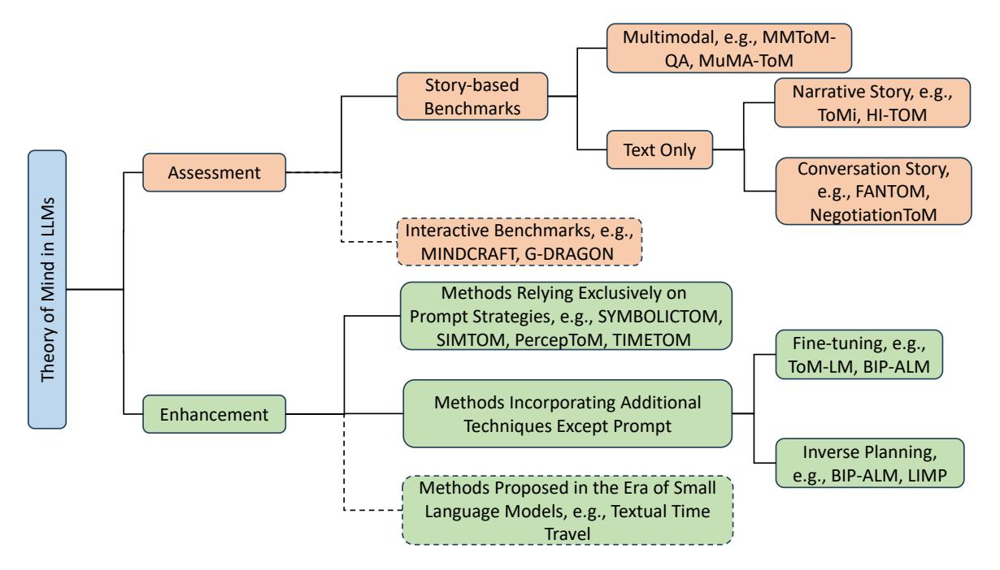
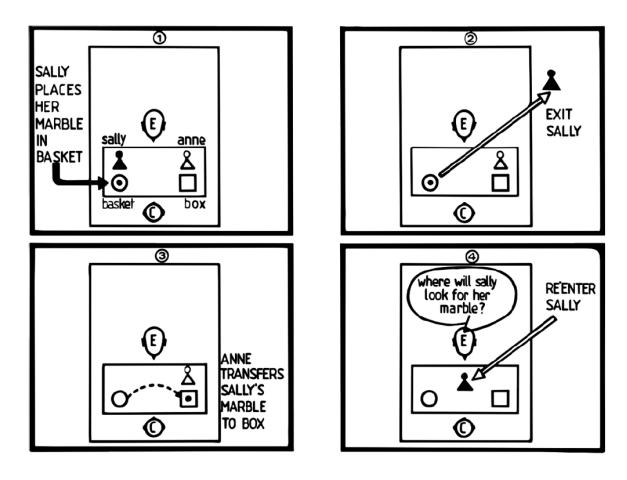
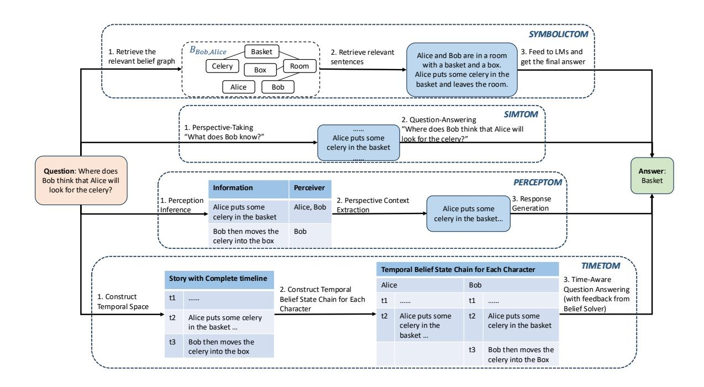

# Theory of Mind in Large Language Models: Assessment and Enhancement

#### Ruirui Chen1 , Weifeng Jiang3 , Chengwei Qin3 , Cheston Tan1,2

1 Institute of High Performance Computing, Agency for Science, Technology and Research, Singapore 2Centre for Frontier AI Research, Agency for Science, Technology and Research, Singapore 3Nanyang Technological University, Singapore

#### Abstract

Theory of Mind (ToM)—the ability to infer and reason about others' mental states—is fundamental to human social intelligence. As Large Language Models (LLMs) become increasingly integrated into daily life, it is crucial to assess and enhance their capacity to interpret and respond to human mental states. In this paper, we review LLMs' ToM capabilities by examining both evaluation benchmarks and the strategies designed to improve them. We focus on widely adopted story-based benchmarks and provide an in-depth analysis of methods aimed at enhancing ToM in LLMs. Furthermore, we outline promising future research directions informed by recent benchmarks and state-of-theart approaches. Our survey serves as a valuable resource for researchers interested in advancing LLMs' ToM capabilities.

# 1 Introduction

Theory of Mind (ToM) refers to the ability to attribute mental states, such as emotions, intentions, and beliefs, to oneself and others [\(Premack](#page-10-0) [and Woodruff,](#page-10-0) [1978\)](#page-10-0). In essence, ToM involves "putting yourself in someone else's shoes" [\(Gold](#page-9-0)[man,](#page-9-0) [2006;](#page-9-0) [Wilf et al.,](#page-12-0) [2024\)](#page-12-0). It enables us to "mind read" and understand how others feel, what their intentions are, what they believe or know. This ability to infer what others believe in a given situation is crucial for predicting their actions, forming a fundamental component of social skills. Research has shown that the ability to attribute mental states to others begins developing around the second year of life, with a fully explicit ToM capability within reach by the age of four [\(Wimmer and Perner,](#page-12-1) [1983;](#page-12-1) [Baron-Cohen et al.,](#page-8-0) [1985\)](#page-8-0).

Recently, Large Language Models (LLMs) have achieved remarkable success across various tasks, particularly in Natural Language Processing (NLP) [\(Qin et al.,](#page-10-1) [2023\)](#page-10-1). Currently, there is growing interest to explore the cognitive abilities of LLMs

through novel and intriguing tasks, including assessments of their Emotional Intelligence (EI) [\(Yang et al.,](#page-12-2) [2023;](#page-12-2) [Huang et al.,](#page-9-1) [2024;](#page-9-1) [Amin et al.,](#page-8-1) [2024;](#page-8-1) [Sabour et al.,](#page-11-0) [2024;](#page-11-0) [Liu et al.,](#page-10-2) [2024\)](#page-10-2), strategic reasoning capabilities [\(Gandhi et al.,](#page-9-2) [2023b;](#page-9-2) [Zhang et al.,](#page-12-3) [2024b\)](#page-12-3), and ToM capabilities [\(Wu](#page-12-4) [et al.,](#page-12-4) [2023;](#page-12-4) [van Duijn et al.,](#page-11-1) [2023;](#page-11-1) [Wu et al.,](#page-12-5) [2024;](#page-12-5) [Shapira et al.,](#page-11-2) [2024;](#page-11-2) [Chen et al.,](#page-8-2) [2024;](#page-8-2) [Jin et al.,](#page-9-3) [2024\)](#page-9-3). Among these capabilities, there is an ongoing debate about whether LLMs truly possess ToM abilities. Some studies suggest that LLMs demonstrate promising signs of ToM competence [\(Bubeck et al.,](#page-8-3) [2023;](#page-8-3) [Kosinski,](#page-9-4) [2024;](#page-9-4) [Street et al.,](#page-11-3) [2024\)](#page-11-3), while others contend that these abilities are often superficial and unstable [\(Shapira et al.,](#page-11-2) [2024;](#page-11-2) [Ullman,](#page-11-4) [2023;](#page-11-4) [Ma et al.,](#page-10-3) [2023a;](#page-10-3) [Verma et al.,](#page-11-5) [2024;](#page-11-5) [Zhu et al.,](#page-13-0) [2024\)](#page-13-0).

To evaluate the ToM capabilities of LLMs, various benchmarks have been developed. Although [Ma et al.](#page-10-4) [\(2023b\)](#page-10-4) advocate for a situated evaluation approach [\(Bara et al.,](#page-8-4) [2021;](#page-8-4) [Sclar et al.,](#page-11-6) [2022;](#page-11-6) [Bara et al.,](#page-8-5) [2023\)](#page-8-5), story-based benchmarks remain prevalent. Notably, these story-based benchmarks have primarily emerged over the past two years (2023–2024) and have undergone rapid iterations. However, to the best of our knowledge, only [Ma](#page-10-4) [et al.](#page-10-4) [\(2023b\)](#page-10-4) has reviewed ToM benchmarks, and their focus is limited to those published up to 2023. Moreover, recent evaluations indicate that LLMs still lack robust ToM capabilities [\(Wu et al.,](#page-12-4) [2023;](#page-12-4) [Ma et al.,](#page-10-3) [2023a;](#page-10-3) [Kim et al.,](#page-9-5) [2023;](#page-9-5) [Gandhi et al.,](#page-9-6) [2023a;](#page-9-6) [Xu et al.,](#page-12-6) [2024a;](#page-12-6) [Chan et al.,](#page-8-6) [2024;](#page-8-6) [Chen](#page-8-2) [et al.,](#page-8-2) [2024;](#page-8-2) [Jin et al.,](#page-9-3) [2024;](#page-9-3) [Shi et al.,](#page-11-7) [2024\)](#page-11-7), which has spurred significant research into strategies for enhancing these abilities. Yet, a detailed summary of these newly proposed strategies is still lacking.

Consequently, our work focuses on newly proposed story-based benchmarks from 2023–2024 that have not been covered in existing reviews, examining their evolution. We also provide a detailed review of the recent approaches aimed at enhancing

Figure 1: Scope of Our Survey. This paper examines both the evaluation and enhancement of theory of mind capabilities in LLMs. For evaluation, we cover passive, story-based benchmarks and adaptable interactive benchmarks. For enhancement, we discuss recent effective methods, including prompt-only approaches and strategies incorporating additional techniques, as well as earlier methods from the era of small language models. Due to space constraints, interactive benchmarks and earlier methods (indicated in the dashed area) are provided in the Appendix [E](#page-16-0) and Appendix [F.](#page-18-0)

LLMs' ToM capabilities. As far as we know, this is the first study to offer such an in-depth analysis of both the evaluation and enhancement of LLMs' ToM capabilities.

As illustrated in Figure [1,](#page-1-0) our survey encompasses both the evaluation of LLMs' ToM capabilities—highlighting widely used story-based benchmarks—and the strategies employed to enhance their performance, with the aim of establishing a foundation for future research in this area. Our contributions are summarized as follows:

- Broad Survey. This paper provides the first broad survey that addresses both the evaluation and enhancement of LLMs' ToM capabilities. It offers an in-depth analysis of recently proposed story-based benchmarks [\(Ma](#page-10-4) [et al.,](#page-10-4) [2023b\)](#page-10-4) and the strategies developed to improve LLM performance in this domain.
- In-depth Analysis. We provide a detailed analysis of related research, focusing on the evolution of story-based benchmarks and the development of strategies to enhance ToM capabilities. This analysis offers a clearer and more structured overview of the progress made in this field.

• Future Directions. Building on our analysis, we identify several promising directions for future research, addressing both benchmark development and strategy refinement.

# 2 Theory of Mind

The Abilities in Theory of Mind Space (ATOMS) [\(Beaudoin et al.,](#page-8-7) [2020\)](#page-8-7) defines seven mental states within ToM: beliefs, intentions, desires, emotions, knowledge, percepts, and non-literal communications. Detailed descriptions of each are provided in Appendix [B.](#page-14-0) As illustrated in Table [1,](#page-15-0) beliefs are the most extensively studied mental state in ToM. In the following, we briefly explain several key concepts—such as orders, true-belief, and falsebelief—that will recur throughout this paper.

The term "orders" refers to the number of mental state attributions required to answer a given question [\(Wu et al.,](#page-12-4) [2023\)](#page-12-4). For example, the question "Where will Sally look for her marble?" is considered first-order, while "Where does Anne think Sally will look for her marble?" is classified as second-order. When Sally's belief is incorrect, the question is categorized as a false-belief question; conversely, if her belief is accurate, it is referred to as a true-belief question.

Evaluating ToM Capabilities in LLMs As shown in Table [1,](#page-15-0) more than ten benchmarks have been recently proposed to assess the ToM capabilities of LLMs. The majority of these benchmarks are based on well-established psychological tests, including the Sally-Anne Test [\(Baron-Cohen et al.,](#page-8-0) [1985\)](#page-8-0) and the Smarties Task [\(Gopnik and Asting](#page-9-7)[ton,](#page-9-7) [1988\)](#page-9-7), both of which are discussed in detail in Appendix [A.](#page-14-1)

Enhancing LLMs' ToM Capabilities Table [3](#page-18-1) lists recent approaches to enhance LLMs' ToM capabilities, which we classify as either relying solely on prompt engineering or incorporating additional techniques. Most strategies currently focus on belief-related questions, and Section 4 provides a detailed discussion.

## 3 Benchmarks for Evaluating ToM Capabilities in LLMs

As mentioned previously, story-based benchmarks remain a leading approach for evaluating LLMs' ToM performance. In this work, we focus on these benchmarks, categorizing them by whether they include multimodal inputs. To compare different benchmarks and highlight areas for improvement, we present the coverage of mental states in Table [1.](#page-15-0) Following [Ma et al.](#page-10-4) [\(2023b\)](#page-10-4) and [Chen et al.](#page-8-2) [\(2024\)](#page-8-2), we adopt the mental state categories defined by the ATOMS framework [\(Beaudoin et al.,](#page-8-7) [2020\)](#page-8-7).

#### 3.1 Text-Only Benchmark

In this subsection, we first provide a brief overview of commonly used and recently proposed benchmarks for evaluating the ToM capabilities of LLMs[1](#page-2-0) . We then highlight key trends observed in the evolution of these benchmarks.

#### 3.1.1 Overview of Text-Only Benchmarks

ToMi [\(Le et al.,](#page-9-8) [2019\)](#page-9-8). Building on ToM-bAbi [\(Ne](#page-10-5)[matzadeh et al.,](#page-10-5) [2018\)](#page-10-5), ToMi enhanced the data generation process to create a more balanced dataset across various story types, introducing more complexity with random distractors. It also proposed generating all question types for each story, covering reality, memory, first-order and second-order beliefs (for each character). [Le et al.](#page-9-8) [\(2019\)](#page-9-8) introduced the concept of "story accuracy", where a story is considered correctly answered only if all associated questions are answered correctly. [Zhou](#page-12-7)

[et al.](#page-12-7) [\(2023a\)](#page-12-7) transform ToMi from inferring mental states to probing an agent's action decisions, introducing a new evaluation paradigm called Thinking for Doing (T4D). Expanding on ToMi, [Jung et al.](#page-9-9) [\(2024\)](#page-9-9) developed Percept-ToMi by incorporating characters' perceptions. While ToMi is widely used in current evaluations [\(Sclar et al.,](#page-11-8) [2023;](#page-11-8) [Wilf et al.,](#page-12-0) [2024;](#page-12-0) [Jung et al.,](#page-9-9) [2024;](#page-9-9) [Hou et al.,](#page-9-10) [2024\)](#page-9-10), it still relies on synthetic data, which employs simplified natural language compared to real-world scenarios.

HI-TOM [\(Wu et al.,](#page-12-4) [2023\)](#page-12-4). Recognizing the importance of higher-order ToM in social interactions and addressing the limitations of existing datasets, which are largely restricted to second-order belief evaluation, HI-TOM includes five questions per story. These questions correspond to reasoning levels from zeroth (equivalent to reality questions) to fourth order. Building on the approaches of [Nematzadeh et al.](#page-10-5) [\(2018\)](#page-10-5) and [Le et al.](#page-9-8) [\(2019\)](#page-9-8), HI-TOM's stories and questions are generated automatically using templates inspired by the Sally-Anne Test [\(Baron-Cohen et al.,](#page-8-0) [1985\)](#page-8-0), with distractor sentences incorporated into the narratives. While agent communication is integrated into the story generation process, the format of the stories remains narrative in nature.

TOMCHALLENGES [\(Ma et al.,](#page-10-3) [2023a\)](#page-10-3). [Ma](#page-10-3) [et al.](#page-10-3) [\(2023a\)](#page-10-3) identified that inconsistencies in evaluating LLMs' ToM capabilities might arise from variations in evaluation methods and prompts. To address this, they designed six distinct questions for each "order" of ToM reasoning about each narrative story, using templates that span three generation settings: fully-constrained, semi-constrained, and open-ended. The stories are adapted from classic tasks like the Sally-Anne and Smarties tasks [\(Baron-Cohen et al.,](#page-8-0) [1985;](#page-8-0) [Gopnik and Astington,](#page-9-7) [1988\)](#page-9-7), covering up to second-order belief questions. To enhance grading efficiency, they proposed an auto-grader based on the GPT-4[2](#page-2-1) model. However, the effectiveness of this automatic evaluation tool may depend on the model's own ToM capabilities.

FANTOM [\(Kim et al.,](#page-9-5) [2023\)](#page-9-5). To minimize reporting bias [\(Gordon and Van Durme,](#page-9-11) [2013\)](#page-9-11), and better align with real-world scenarios, FAN-TOM uses conversations generated by LLMs instead of narrative stories. These conversations revolve around topics such as pets, risk-taking, and personal growth. To detect "illusory ToM"[3](#page-2-2) , six

1[Due to space constraints, some benchmark descriptions](#page-12-7) [are provided in the Appendix](#page-12-7) [C.](#page-15-1)

2 <https://platform.openai.com/docs/models/gp>

3[Kim et al.](#page-9-5) [\(2023\)](#page-9-5) defines "illusory ToM" as cases where a model correctly answers some questions but fails to answer

types of questions are posed for each conversation, including belief-related questions (up to secondorder) and conclusive questions such as "List all the characters who know...". In addition, beliefrelated questions are tested under two settings: one with full factual knowledge and the other with facts limited to the perspective of a specific character. The current conversations in FANTOM are limited to small talk on specific topics generated by LLMs and it lacks prior knowledge about the individuals involved. This restricts its ability to simulate real-world social scenarios. Building on FANTOM, [Jung et al.](#page-9-9) [\(2024\)](#page-9-9) annotated characters' perceptions to develop Percept-FANTOM.

BigToM [\(Gandhi et al.,](#page-9-6) [2023a\)](#page-9-6). [Gandhi et al.](#page-9-6) [\(2023a\)](#page-9-6) proposed using LLM-generated evaluations to assess ToM capabilities in LLMs. By populating causal templates, they created BigToM, a benchmark designed to test LLMs' ToM capabilities across three dimensions: inferring beliefs from percepts, inferring actions from percepts (without access to beliefs), and inferring beliefs from actions (without access to percepts). The narratives in BigToM are limited to first-order belief evaluations; however, the benchmark incorporates both percepts and desires, and holds the potential for expansion to higher-order belief evaluations.

OpenToM [\(Xu et al.,](#page-12-6) [2024a\)](#page-12-6). The main novelty of OpenToM lies in two key aspects: first, its narratives assign characters distinct personality traits and intentions that drive their actions; second, its questions extend beyond first-order and second-order belief queries to include emotion-related questions. Additionally, OpenToM introduces "accessibility" questions to evaluate LLMs' understanding of social commonsense. OpenToM facilitates the evaluation of a broader range of mental states in ToM capabilities. However, its current design is limited to two roles—a mover and an observer—and does not fully capture the complexity of human emotions [\(Zhan et al.,](#page-12-8) [2023\)](#page-12-8).

NegotiationToM [\(Chan et al.,](#page-8-6) [2024\)](#page-8-6). Grounded in the Belief-Desire-Intention (BDI) agent modeling theory [\(Bratman,](#page-8-8) [1987\)](#page-8-8), NegotiationToM is designed to rigorously evaluate machine ToM in real-world negotiation scenarios featuring multiple rounds of dialogue. It assesses a range of multidimensional mental states, including desires, second-order beliefs, and intentions. Negotiation-ToM is based on the CaSiNo dataset [\(Chawla et al.,](#page-8-9) [2021\)](#page-8-9), which comprises negotiation scenarios between two parties. Although it is the first ToM benchmark in negotiation contexts, it remains a passive benchmark. Additionally, its reliance on an existing dataset introduces a potential risk of data contamination.

TOMBENCH [\(Chen et al.,](#page-8-2) [2024\)](#page-8-2). As shown in Table [1,](#page-15-0) TOMBENCH integrates additional tasks from psychological research, such as the Unexpected Outcome Test [\(Dyck et al.,](#page-8-10) [2001\)](#page-8-10), and covers all mental states defined in the ATOMS framework [\(Beaudoin et al.,](#page-8-7) [2020\)](#page-8-7), except for percepts. To prevent data contamination, TOMBENCH was constructed entirely from scratch, without leveraging any pre-existing datasets. Furthermore, TOMBENCH is a bilingual dataset containing both Chinese and English information. All test samples in TOMBENCH follow a multiple-choice question answering format, which minimizes subjective judgment. However, the multiple-choice question answering format poses a challenge in determining whether LLMs truly comprehend the questions and answer them correctly, as evaluation is based solely on the final answer option.

#### 3.1.2 Trends in Text-Only Benchmarks

An analysis of the aforementioned benchmarks reveals that these benchmarks have grown increasingly complex, aiming to better reflect real-world scenarios. Apart from expanding from English benchmarks to multilingual benchmarks [\(Chen](#page-8-2) [et al.,](#page-8-2) [2024\)](#page-8-2), the primary advancements can be summarized as follows:

- Order. Initially, benchmarks focused on firstorder belief questions [\(Grant et al.,](#page-9-12) [2017\)](#page-9-12). Over time, they expanded to second-order belief questions, which most benchmarks now support [\(Le et al.,](#page-9-8) [2019;](#page-9-8) [Ma et al.,](#page-10-3) [2023a\)](#page-10-3). Some even enable the evaluation of fourthorder belief reasoning [\(Wu et al.,](#page-12-4) [2023\)](#page-12-4).
- Dataset Generation. With the widespread adoption of LLMs, dataset generation methods have evolved from exclusively templatebased approaches [\(Le et al.,](#page-9-8) [2019\)](#page-9-8) to LLMgenerated datasets created through template filling [\(Gandhi et al.,](#page-9-6) [2023a;](#page-9-6) [Xu et al.,](#page-12-6) [2024a\)](#page-12-6). Recently, concerns about data contamination have led some benchmarks to rely on manually constructed datasets built from scratch by humans [\(Chen et al.,](#page-8-2) [2024\)](#page-8-2).

- Context. To better align with real-world scenarios, the format of contextual information has shifted from narrative stories [\(Le et al.,](#page-9-8) [2019;](#page-9-8) [Ma et al.,](#page-10-3) [2023a\)](#page-10-3) to multi-turn conversations [\(Kim et al.,](#page-9-5) [2023;](#page-9-5) [Chan et al.,](#page-8-6) [2024;](#page-8-6) [Soubki et al.,](#page-11-9) [2024\)](#page-11-9). Beyond format changes, the content has evolved from commonly used psychological tests [\(Le et al.,](#page-9-8) [2019;](#page-9-8) [Ma et al.,](#page-10-3) [2023a\)](#page-10-3) to topics that are more closely related to everyday life [\(Kim et al.,](#page-9-5) [2023\)](#page-9-5).
- Questions. To enable robust evaluation, benchmark questions have become more diverse and complex, evolving from multiplechoice question answering [\(Le et al.,](#page-9-8) [2019\)](#page-9-8) to open-ended question answering [\(Ma et al.,](#page-10-3) [2023a;](#page-10-3) [Kim et al.,](#page-9-5) [2023\)](#page-9-5). Additionally, the content of the questions has changed, for instance, asking about the beliefs of a group of people rather than a single individual [\(Sileo](#page-11-10) [and Lernould,](#page-11-10) [2023;](#page-11-10) [Kim et al.,](#page-9-5) [2023\)](#page-9-5).
- Mental States. Benchmarks have expanded from evaluating only beliefs [\(Le et al.,](#page-9-8) [2019\)](#page-9-8) to covering a wider range of mental states [\(Sileo and Lernould,](#page-11-10) [2023;](#page-11-10) [Chan et al.,](#page-8-6) [2024;](#page-8-6) [Chen et al.,](#page-8-2) [2024\)](#page-8-2), including percepts, desires, and even social commonsense knowledge [\(Xu](#page-12-6) [et al.,](#page-12-6) [2024a\)](#page-12-6).

#### 3.2 Multimodal Benchmark

In addition to the aforementioned developments, some researchers have recognized that ToM reasoning goes beyond simple text comprehension [\(Chen](#page-8-2) [et al.,](#page-8-2) [2024;](#page-8-2) [Jin et al.,](#page-9-3) [2024;](#page-9-3) [Shi et al.,](#page-11-7) [2024\)](#page-11-7), which has led to the introduction of several multimodal ToM benchmarks.

MMToM-QA [\(Jin et al.,](#page-9-3) [2024\)](#page-9-3). MMToM-QA is the first multimodal ToM benchmark that integrates both video and text to depict a person's activities within a household environment, specifically in VirtualHome [\(Puig et al.,](#page-10-6) [2018\)](#page-10-6). The benchmark defines seven question types, categorized into two broad categories: belief inference and goal inference. Each question offers two possible answers, with one being significantly more likely to be correct based on the information provided in the text and video. Currently, MMToM-QA focuses on a single character finding objects in a household scenario and does not address higher-order beliefs.

MuMA-ToM [\(Shi et al.,](#page-11-7) [2024\)](#page-11-7). Building on videos generated in VirtualHome [\(Puig et al.,](#page-10-6) [2018\)](#page-10-6), this benchmark introduces the first multimodal,

multi-agent ToM evaluation focusing on mental reasoning in embodied interactions. It includes three types of questions: belief inference, social goal inference, and belief-of-goal inference (a form of second-order belief). Each question presents three options, with one being the most likely to be correct. Unlike MMToM-QA [\(Jin et al.,](#page-9-3) [2024\)](#page-9-3), MuMA-ToM provides distinctly separate information available through specific modalities, enabling a deeper understanding of how models integrate multimodal inputs to accurately answer each question. The text input is presented in two forms: conversations between two agents in the video or textual descriptions of half of the video. MuMA-ToM is currently limited to three social goals and two agents. Additionally, as it relies on video content from VirtualHome, further efforts are required to enhance its sim-to-real transferability for realworld applications.

The main limitation of current multi-modal benchmarks is their focus on household settings and reliance on synthetic videos. Sim-to-real transfer strategies may be necessary to adapt approaches tested on synthetic videos for real-world applications [\(Shi et al.,](#page-11-7) [2024\)](#page-11-7). Alternatively, a multimodal benchmark incorporating real-world videos and more diverse scenarios [\(Jin et al.,](#page-9-3) [2024\)](#page-9-3) is needed to enhance applicability and robustness.

All these datasets are considered "passive benchmarks" [\(Chan et al.,](#page-8-6) [2024\)](#page-8-6), with LLMs acting as passive observers rather than active agents [\(Ma](#page-10-4) [et al.,](#page-10-4) [2023b;](#page-10-4) [Li et al.,](#page-10-7) [2023\)](#page-10-7). Evaluating LLMs as active agents to test their dynamic ToM capabilities represents a promising avenue for future research [\(Ma et al.,](#page-10-4) [2023b;](#page-10-4) [Chen et al.,](#page-8-2) [2024\)](#page-8-2). In Appendix [E,](#page-16-0) we present several interactive benchmark candidates that may be valuable in this regard.

# 4 Strategies for Enhancing the ToM capabilities of LLMs

Most evaluations on these benchmarks highlight the limitations of LLMs in ToM capabilities [\(Wu](#page-12-4) [et al.,](#page-12-4) [2023;](#page-12-4) [Ma et al.,](#page-10-3) [2023a;](#page-10-3) [Kim et al.,](#page-9-5) [2023;](#page-9-5) [Gandhi et al.,](#page-9-6) [2023a;](#page-9-6) [Xu et al.,](#page-12-6) [2024a;](#page-12-6) [Chan et al.,](#page-8-6) [2024;](#page-8-6) [Chen et al.,](#page-8-2) [2024;](#page-8-2) [Jin et al.,](#page-9-3) [2024;](#page-9-3) [Shi et al.,](#page-11-7) [2024\)](#page-11-7), prompting a surge in strategies aimed at improving their performance. Table [3](#page-18-1) summarizes several recently proposed methods for enhancing the ToM capabilities of LLMs. We categorize these approaches into two classes: methods that rely solely on prompt strategies and methods that incorporate additional techniques, such as fine-tuning.

#### 4.1 Methods Relying Exclusively on Prompt Strategies

Figure [3](#page-18-2) compares various approaches by illustrating how each method processes a second-order belief question.

SYMBOLICTOM [\(Sclar et al.,](#page-11-8) [2023\)](#page-11-8). As shown in Figure [3,](#page-18-2) they construct a belief graph for each character, capturing both their own beliefs and their beliefs about others, such as BBob and BBob,Alice. During inference, entities mentioned in the question are identified, and the corresponding belief graph is located. Relevant sentences from this belief graph are retrieved and fed into the LLM for answering the question. Theoretically, it is capable of handling belief-related questions of any order. Experimental results on the variants of ToMi [\(Le et al.,](#page-9-8) [2019\)](#page-9-8) demonstrated the effectiveness of this approach in addressing belief questions up to the third order. However, this method has several limitations. First, memory requirements grow exponentially with the order of belief-related questions. Second, the quality of the belief graph is critical; efficient and accurate methods for constructing belief graphs are essential as story complexity increases [\(Hou et al.,](#page-9-10) [2024;](#page-9-10) [Jung et al.,](#page-9-9) [2024\)](#page-9-9). Additionally, the belief graph may lose historical information, making it incapable of answering questions such as, "List the locations of object A between the start and end of this story for a specific character".

SIMTOM [\(Wilf et al.,](#page-12-0) [2024\)](#page-12-0). Inspired by "Simulation Theory" [\(Goldman,](#page-9-0) [2006\)](#page-9-0), SIMTOM introduces a two-stage prompting framework that incorporates "Perspective Taking" [\(Goldman,](#page-9-0) [2006\)](#page-9-0) as an intermediate step. Briefly, SIMTOM involves identifying the events within a story that a specific character is aware of and using this filtered scenario to prompt LLMs for answers. SIMTOM enhances LLMs' capabilities in ToM tasks, and if the perspective-taking step were executed perfectly, current models could nearly solve existing benchmarks such as ToMi [\(Le et al.,](#page-9-8) [2019\)](#page-9-8) and BigToM [\(Gandhi et al.,](#page-9-6) [2023a\)](#page-9-6). However, the perspectivetaking step often falls short of achieving humanlevel performance. Additionally, identifying which character's perspective the model should adopt becomes increasingly challenging as the complexity of the questions increases. These limitations may hinder SIMTOM's ability to handle higher-order ToM reasoning effectively [\(Hou et al.,](#page-9-10) [2024\)](#page-9-10).

PercepToM [\(Jung et al.,](#page-9-9) [2024\)](#page-9-9). PercepToM is a

framework designed to enhance the ToM capabilities of LLMs through a three-stage process. First, it identifies the perceiver of each unit of information. Second, it extracts and concatenates the units of information for which the perceiver includes the target character mentioned in the question. Finally, it prompts the LLMs with this curated information to answer the question. Experiments on ToMi [\(Le et al.,](#page-9-8) [2019\)](#page-9-8) and FANTOM [\(Kim et al.,](#page-9-5) [2023\)](#page-9-5) have demonstrated its effectiveness. However, determining the target character in complex questions remains a challenge and requires further investigation, as it is crucial for providing the most relevant perspective context.

TIMETOM [\(Hou et al.,](#page-9-10) [2024\)](#page-9-10). TIMETOM enhances story comprehension by incorporating a timeline into the sentences of a story. It then identifies the sentences known to each character, forming what they call a "temporal belief state chain (TBSC)". These sentences are further divided into "self-world beliefs" and "social-world beliefs". For first-order questions, TIMETOM prompts LLMs using self-world beliefs to derive answers. For higher-order questions, it initially prompts LLMs with all sentences the character is aware of and refines the response using feedback from the Time-Aware Belief Solver. This tool transforms higherorder reasoning into first-order reasoning by intersecting the TBSCs of different characters. Experiments on ToMi [\(Le et al.,](#page-9-8) [2019\)](#page-9-8), BigToM [\(Gandhi](#page-9-6) [et al.,](#page-9-6) [2023a\)](#page-9-6) and FANTOM [\(Kim et al.,](#page-9-5) [2023\)](#page-9-5) demonstrate that TIMETOM effectively handles higher-order belief reasoning and achieves superior performance. Its innovative approach of transforming higher-order reasoning into first-order reasoning through temporal belief intersections is particularly noteworthy. However, a significant limitation is that most models currently struggle to accurately construct the temporal belief state chain for each character.

All of these strategies take different approaches to identify the perceptions of the target character first, and then prompt LLMs to generate answers based on a limited story. They have demonstrated effectiveness across various benchmarks. Compared to fine-tuning-based methods, these strategies avoid costly training steps and have shown greater robustness to out-of-distribution samples [\(Sclar et al.,](#page-11-8) [2023\)](#page-11-8). However, all of these methods adopt a pipeline approach [\(Wan et al.,](#page-12-9) [2023\)](#page-12-9) to solve ToM reasoning, which may lead to error propagation. This makes the initial step particularly critical. For instance, TIMETOM depends on generating the correct TBSC [\(Hou et al.,](#page-9-10) [2024\)](#page-9-10). Despite their strengths, most LLMs still require significant improvement to effectively accomplish these tasks.

## 4.2 Methods Incorporating Additional Techniques

The main contribution of the following methods is their use of techniques beyond prompting, such as fine-tuning [\(Tang and Belle,](#page-11-11) [2024;](#page-11-11) [Jin et al.,](#page-9-3) [2024\)](#page-9-3) and inverse multi-agent planning [\(Shi et al.,](#page-11-7) [2024\)](#page-11-7).

ToM-LM [\(Tang and Belle,](#page-11-11) [2024\)](#page-11-11). Inspired by [Olausson et al.](#page-10-8) [\(2023\)](#page-10-8); [Pan et al.](#page-10-9) [\(2023\)](#page-10-9); [Schick](#page-11-12) [et al.](#page-11-12) [\(2024\)](#page-11-12), [Tang and Belle](#page-11-11) [\(2024\)](#page-11-11) introduced ToM-LM, a framework that leverages LLMs for semantic parsing [\(Jia and Liang,](#page-9-13) [2016\)](#page-9-13), using oneshot learning to convert a ToM problem described in natural language into a symbolic formulation, and then evaluates this formulation using an SM-CDEL model checker [\(van Benthem et al.,](#page-11-13) [2018\)](#page-11-13). To enhance semantic parsing accuracy, the authors fine-tuned the tested LLM using <natural language, symbolic formulation> pairs. Integrating a model checker into this process adds transparency and verifiability to the approach. However, this method has two key limitations: preparing the fine-tuning pairs requires substantial logic expertise and effort, and the approach may not generalize well to open-ended questions.

BIP-ALM [\(Jin et al.,](#page-9-3) [2024\)](#page-9-3). Bayesian Inverse Planning Accelerated by Language Models (BIP-ALM) extracts information such as the initial state and actions from videos and textual context, as well as hypotheses (including goals and beliefs) from questions and answer choices. All extracted information is represented in a symbolic format. Drawing inspiration from research on LLMs for decision-making [\(Huang et al.,](#page-9-14) [2022;](#page-9-14) [Li et al.,](#page-10-10) [2024\)](#page-10-10), the authors prompt LLMs with symbolic information—such as state, goal, and belief—to estimate the likelihood of observed actions. To further enhance the performance of LLMs in this task, they fine-tune the models using inputs comprising state, belief, and goal at specific timestamps to predict the corresponding actions. Using GPT-J [\(Wang](#page-12-10) [and Komatsuzaki,](#page-12-10) [2021\)](#page-12-10) and LLaMA 2 [\(Touvron](#page-11-14) [et al.,](#page-11-14) [2023\)](#page-11-14) as base models, BIP-ALM achieved superior performance on the MMTOM-QA dataset. However, the MMTOM-QA dataset is currently limited to scenarios involving a character searching for objects in household environments, and BIP-

ALM cannot support handling open-questions with the current setting.

LIMP [\(Shi et al.,](#page-11-7) [2024\)](#page-11-7). Inspired by BIP-ALM [\(Jin et al.,](#page-9-3) [2024\)](#page-9-3), Language Model-based Inverse Multi-agent Planning (LIMP) utilizes Vision-Language Models (VLMs) to extract information from videos and LLMs to extract information from textual context. These extracted details are then fused by an LLM. Mental state hypotheses—including beliefs of states, social goals, and beliefs about other agents' goals—are derived from questions and answer choices and subsequently used as inputs for inverse multi-agent planning [\(Ull](#page-11-15)[man et al.,](#page-11-15) [2009;](#page-11-15) [Netanyahu et al.,](#page-10-11) [2021\)](#page-10-11). For the inverse multi-agent planning process, LIMP prompts an LLM with hypotheses derived from questions and multi-modal inputs to estimate action and utterance policies. Designed for multi-agent scenarios, LIMP outperforms BIP-ALM on the MuMA-ToM benchmark. Moreover, it demonstrates better generality by representing all information in natural language. However, hallucinations generated by VLMs in action recognition remain a significant source of errors in LIMP.

All the above strategies also approach ToM reasoning by breaking the problem into multiple steps. When symbolic representations are involved, finetuning is typically required to achieve better performance. However, a key limitation of TOM-LM, BIP-ALM, and LIMP is that they have only been evaluated on multiple-choice settings. Adapting these methods to handle open-ended question answering remains an open challenge that requires further exploration.

# 5 Future Directions

Most evaluations indicate that LLMs still lack robust ToM reasoning abilities. A clear direction for future work is to develop strategies to enhance LLMs' ToM reasoning capabilities. To improve strategies for enhancing LLMs' ToM capabilities, more benchmarks are required—both for evaluating ToM reasoning and as resources for fine-tuning LLMs. In this section, we first explore common future directions for both benchmarks and strategies, followed by a discussion of directions that are specific to either enhancement or evaluation[4](#page-6-0) .

Common future directions for both benchmarks and strategies involve:

4Due to space limitations, additional future directions are discussed in the Appendix [G.](#page-19-0)

- Expanding the scope of mental states: As shown in Table [1](#page-15-0) and Table [3,](#page-18-1) current benchmarks and strategies predominantly focus on belief-related reasoning, while other mental states require more attention [\(Ma et al.,](#page-10-4) [2023b\)](#page-10-4). Future benchmarks should explore a broader range of mental states. To better evaluate LLMs' ToM capabilities, a wider variety of psychological tests should be integrated into the benchmarking process. [Fu et al.](#page-9-15) [\(2023\)](#page-9-15) compiled a list of 127 tests designed to measure the ToM capabilities of children from birth to 12 years old, which could be further adapted for testing LLMs as the technology advances.
- Addressing multi-modal ToM reasoning: Humans interact with the world through multiple channels—an aspect that simple textbased stories cannot fully capture [\(Liu et al.,](#page-10-12) [2023\)](#page-10-12). Research on ToM capabilities in LLMs aims to develop models that function as agents with robust ToM skills, potentially achieving human-level competence [\(Ma et al.,](#page-10-4) [2023b\)](#page-10-4). Achieving this goal requires the ability to infer mental states from visual, auditory, contextual, and other cues. For instance, incorporating multimodal content such as short films [\(Dziobek et al.,](#page-9-16) [2006\)](#page-9-16) or cartoons [\(Völlm](#page-12-11) [et al.,](#page-12-11) [2006;](#page-12-11) [Parmar et al.,](#page-10-13) [2024\)](#page-10-13) into evaluation benchmarks could enhance ToM assessments. Moreover, current methods primarily focus on multiple-choice question answering in household contexts, and converting video information to text may lead to the loss of crucial details. Developing strategies that effectively handle multimodal inputs and preserve comprehensive information remains an important direction for future research.
- Active benchmarks and strategies for agentic decision-making: Passive benchmarks [\(Ma et al.,](#page-10-4) [2023b;](#page-10-4) [Chan et al.,](#page-8-6) [2024\)](#page-8-6) are insufficient. More research is needed to leverage LLMs as agents capable of making decisions in complex environments [\(Ma et al.,](#page-10-4) [2023b;](#page-10-4) [Li et al.,](#page-10-7) [2023;](#page-10-7) [Zhou et al.,](#page-12-7) [2023a](#page-12-7)[,b\)](#page-12-12), enabling deeper investigation of their ToM capabilities.

Next, we outline directions for further investigation to enhance LLMs' ToM capabilities:

• Exploring joint approaches: Most existing methods rely on pipeline architectures with no feedback loops between stages. Error propagation is a significant issue in pipeline approaches [\(Yang and Mitchell,](#page-12-13) [2016;](#page-12-13) [Liu et al.,](#page-10-14) [2018\)](#page-10-14). For example, in SYMBOLICTOM, if the belief graph for a character is incorrect, it becomes difficult to obtain the correct answer when the question relates to this flawed belief graph. However, if conflicts are detected during the inference stage and feedback is provided during the belief graph construction stage, the accuracy of the inference and the coherence of the results can be improved. Investigating joint or iterative approaches that integrate feedback to improve ToM reasoning remains an open research question.

• Progressive learning strategies for tackling ToM task complexity: Given that ToM tasks can vary significantly in complexity, a continual/curriculum learning [\(Chen and Liu,](#page-8-11) [2018;](#page-8-11) [Soviany et al.,](#page-11-16) [2022;](#page-11-16) [Wang et al.,](#page-12-14) [2024\)](#page-12-14) strategy may be needed to address these challenges progressively, starting with simpler tasks and advancing to more complex ones.

Finally, we believe that evaluating reasoning processes is crucial. Simply assessing the correctness of answers is insufficient, benchmarks should facilitate the evaluation of reasoning processes [\(Kawa](#page-9-17)[bata and Sugawara,](#page-9-17) [2023;](#page-9-17) [Jung et al.,](#page-9-9) [2024;](#page-9-9) [Xu](#page-12-15) [et al.,](#page-12-15) [2024b\)](#page-12-15), which calls for the development of more effective and automated evaluation strategies.

#### 6 Conclusion

In this paper, we have conducted a detailed analysis of ToM research in relation to LLMs, exploring various benchmarks and strategies that aim to evaluate and enhance their ToM capabilities. Despite the introduction of numerous ToM benchmarks, achieving consistent results in assessing LLMs' ToM capabilities remains a challenge. This difficulty largely stems from the intrinsic complexity of ToM, which cannot be fully captured through a limited set of questions. Nevertheless, we remain optimistic that the development of more comprehensive benchmarks will support accurate evaluation of LLMs' true capabilities and further enhance their ToM performance. We hope that our paper will serve as an essential resource for those new to this field and that it will stimulate further research and advancements in understanding and improving the ToM capabilities in LLMs.

## Limitations

Theory of Mind (ToM) is an intriguing topic that has aroused interest across various domains, including psychology, reinforcement learning, and natural language processing. In this paper, since our focus is the theory of mind in large language models (LLMs), we structure our discussion following the evolution of LLMs—from the text-only paradigm to the multimodal paradigm. Regarding evaluation benchmarks, we primarily analyze story-based ToM benchmarks [\(Ma et al.,](#page-10-4) [2023b\)](#page-10-4), including those that are either recently proposed or widely adopted to assess the effectiveness of various strategies. We do not delve into benchmarks that involve purely spatial scenarios [\(Sclar](#page-11-6) [et al.,](#page-11-6) [2022\)](#page-11-6) (e.g., BIB [\(Gandhi et al.,](#page-9-18) [2021\)](#page-9-18)). Concerning strategies, we focus on analyzing the currently proposed and effective methods tested with LLMs. However, we also present several interactive benchmarks and strategies developed prior to the widespread adoption of LLMs in Appendix [E](#page-16-0) and Appendix [F,](#page-18-0) which have the potential to be adapted for research in this area.

## References

- Mostafa M. Amin, Rui Mao, Erik Cambria, and Björn W. Schuller. 2024. [A wide evaluation of chatgpt on](https://doi.org/10.1109/TAFFC.2024.3419593) [affective computing tasks.](https://doi.org/10.1109/TAFFC.2024.3419593) *IEEE Transactions on Affective Computing*, pages 1–9.
- Akshatha Arodi and Jackie Chi Kit Cheung. 2021. [Tex](https://doi.org/10.18653/v1/2021.findings-emnlp.351)[tual time travel: A temporally informed approach](https://doi.org/10.18653/v1/2021.findings-emnlp.351) [to theory of mind.](https://doi.org/10.18653/v1/2021.findings-emnlp.351) In *Findings of the Association for Computational Linguistics: EMNLP 2021*, pages 4162–4172, Punta Cana, Dominican Republic. Association for Computational Linguistics.
- Cristian-Paul Bara, Sky CH-Wang, and Joyce Chai. 2021. [Mindcraft: Theory of mind modeling for situ](https://doi.org/10.18653/V1/2021.EMNLP-MAIN.85)[ated dialogue in collaborative tasks.](https://doi.org/10.18653/V1/2021.EMNLP-MAIN.85) In *Proceedings of the 2021 Conference on Empirical Methods in Natural Language Processing, EMNLP 2021, Virtual Event / Punta Cana, Dominican Republic, 7-11 November, 2021*, pages 1112–1125. Association for Computational Linguistics.
- Cristian-Paul Bara, Ziqiao Ma, Yingzhuo Yu, Julie Shah, and Joyce Chai. 2023. [Towards collaborative plan ac](https://doi.org/10.24963/ijcai.2023/330)[quisition through theory of mind modeling in situated](https://doi.org/10.24963/ijcai.2023/330) [dialogue.](https://doi.org/10.24963/ijcai.2023/330) In *Proceedings of the Thirty-Second International Joint Conference on Artificial Intelligence*, IJCAI '23.
- Simon Baron-Cohen, Alan M. Leslie, and Uta Frith. 1985. [Does the autistic child have a "theory of mind"](https://doi.org/10.1016/0010-0277(85)90022-8) [?](https://doi.org/10.1016/0010-0277(85)90022-8) *Cognition*, 21(1):37–46.

- Cindy Beaudoin, Élizabel Leblanc, Charlotte Gagner, and Miriam H Beauchamp. 2020. Systematic review and inventory of theory of mind measures for young children. *Frontiers in psychology*, 10:2905.
- Marta Białecka-Pikul, Anna Kołodziejczyk, and Sandra Bosacki. 2017. [Advanced theory of mind in adoles](https://doi.org/10.1016/j.adolescence.2017.02.009)[cence: Do age, gender and friendship style play a](https://doi.org/10.1016/j.adolescence.2017.02.009) [role?](https://doi.org/10.1016/j.adolescence.2017.02.009) *Journal of Adolescence*, 56:145–156.
- Michael Bratman. 1987. Intention, plans, and practical reason. *Harvard University Press*.
- Sébastien Bubeck, Varun Chandrasekaran, Ronen Eldan, Johannes Gehrke, Eric Horvitz, Ece Kamar, Peter Lee, Yin Tat Lee, Yuanzhi Li, Scott Lundberg, et al. 2023. Sparks of artificial general intelligence: Early experiments with gpt-4. *arXiv preprint arXiv:2303.12712*.
- Chris Callison-Burch, Gaurav Singh Tomar, Lara J. Martin, Daphne Ippolito, Suma Bailis, and David Reitter. 2022. [Dungeons and dragons as a dialog chal](https://doi.org/10.18653/v1/2022.emnlp-main.637)[lenge for artificial intelligence.](https://doi.org/10.18653/v1/2022.emnlp-main.637) In *Proceedings of the 2022 Conference on Empirical Methods in Natural Language Processing*, pages 9379–9393, Abu Dhabi, United Arab Emirates. Association for Computational Linguistics.
- Chunkit Chan, Cheng Jiayang, Yauwai Yim, Zheye Deng, Wei Fan, Haoran Li, Xin Liu, Hongming Zhang, Weiqi Wang, and Yangqiu Song. 2024. [Nego](https://doi.org/10.48550/ARXIV.2404.13627)[tiationtom: A benchmark for stress-testing machine](https://doi.org/10.48550/ARXIV.2404.13627) [theory of mind on negotiation surrounding.](https://doi.org/10.48550/ARXIV.2404.13627) *CoRR*, abs/2404.13627.
- Kushal Chawla, Jaysa Ramirez, Rene Clever, Gale Lucas, Jonathan May, and Jonathan Gratch. 2021. [CaSiNo: A corpus of campsite negotiation dialogues](https://doi.org/10.18653/v1/2021.naacl-main.254) [for automatic negotiation systems.](https://doi.org/10.18653/v1/2021.naacl-main.254) In *Proceedings of the 2021 Conference of the North American Chapter of the Association for Computational Linguistics: Human Language Technologies*, pages 3167–3185, Online. Association for Computational Linguistics.
- Zhiyuan Chen and Bing Liu. 2018. *Lifelong machine learning*. Morgan & Claypool Publishers.
- Zhuang Chen, Jincenzi Wu, Jinfeng Zhou, Bosi Wen, Guanqun Bi, Gongyao Jiang, Yaru Cao, Mengting Hu, Yunghwei Lai, Zexuan Xiong, and Minlie Huang. 2024. [ToMBench: Benchmarking theory of mind](https://doi.org/10.18653/v1/2024.acl-long.847) [in large language models.](https://doi.org/10.18653/v1/2024.acl-long.847) In *Proceedings of the 62nd Annual Meeting of the Association for Computational Linguistics (Volume 1: Long Papers)*, pages 15959–15983, Bangkok, Thailand. Association for Computational Linguistics.
- Maxime Chevalier-Boisvert, Lucas Willems, and Suman Pal. 2018. Minimalistic gridworld environment for gymnasium. *Advances in Neural Information Processing Systems*, pages 8024–8035.
- Murray J Dyck, Kara Ferguson, and Ian M Shochet. 2001. Do autism spectrum disorders differ from each other and from non-spectrum disorders on emotion

- recognition tests? *European child & adolescent psychiatry*, 10:105–116.
- Isabel Dziobek, Stefan Fleck, Elke Kalbe, Kimberley Rogers, Jason Hassenstab, Matthias Brand, Josef Kessler, Jan K Woike, Oliver T Wolf, and Antonio Convit. 2006. Introducing masc: a movie for the assessment of social cognition. *Journal of autism and developmental disorders*, 36:623–636.
- I-Ning Fu, Kuan-Lin Chen, Meng-Ru Liu, Dai-Rong Jiang, Ching-Lin Hsieh, and Shih-Chieh Lee. 2023. [A systematic review of measures of theory of mind](https://doi.org/10.1016/j.dr.2022.101061) [for children.](https://doi.org/10.1016/j.dr.2022.101061) *Developmental Review*, 67:101061.
- Kanishk Gandhi, Jan-Philipp Fränken, Tobias Gerstenberg, and Noah Goodman. 2023a. [Understanding](https://openreview.net/forum?id=8bqjirgxQM) [social reasoning in language models with language](https://openreview.net/forum?id=8bqjirgxQM) [models.](https://openreview.net/forum?id=8bqjirgxQM) In *Thirty-seventh Conference on Neural Information Processing Systems Datasets and Benchmarks Track*.
- Kanishk Gandhi, Dorsa Sadigh, and Noah Goodman. 2023b. [Strategic reasoning with language models.](https://openreview.net/forum?id=MUtbsFRZwI) In *NeurIPS 2023 Foundation Models for Decision Making Workshop*.
- Kanishk Gandhi, Gala Stojnic, Brenden M Lake, and Moira R Dillon. 2021. Baby intuitions benchmark (bib): Discerning the goals, preferences, and actions of others. *Advances in neural information processing systems*, 34:9963–9976.
- Alvin I Goldman. 2006. *Simulating Minds: The Philosophy, Psychology, and Neuroscience of Mindreading*. Oxford University Press.
- Alison Gopnik and Janet W Astington. 1988. Children's understanding of representational change and its relation to the understanding of false belief and the appearance-reality distinction. *Child development*, pages 26–37.
- Jonathan Gordon and Benjamin Van Durme. 2013. [Re](https://doi.org/10.1145/2509558.2509563)[porting bias and knowledge acquisition.](https://doi.org/10.1145/2509558.2509563) In *Proceedings of the 2013 Workshop on Automated Knowledge Base Construction*, AKBC '13, page 25–30, New York, NY, USA. Association for Computing Machinery.
- Erin Grant, Aida Nematzadeh, and Thomas L Griffiths. 2017. How can memory-augmented neural networks pass a false-belief task? In *CogSci*.
- Yuling Gu, Oyvind Tafjord, Hyunwoo Kim, Jared Moore, Ronan Le Bras, Peter Clark, and Yejin Choi. 2024. Simpletom: Exposing the gap between explicit tom inference and implicit tom application in llms. *arXiv preprint arXiv:2410.13648*.
- Guiyang Hou, Wenqi Zhang, Yongliang Shen, Linjuan Wu, and Weiming Lu. 2024. [TimeToM: Temporal](https://aclanthology.org/2024.findings-acl.685) [space is the key to unlocking the door of large lan](https://aclanthology.org/2024.findings-acl.685)[guage models' theory-of-mind.](https://aclanthology.org/2024.findings-acl.685) In *Findings of the Association for Computational Linguistics ACL 2024*, pages 11532–11547, Bangkok, Thailand and virtual meeting. Association for Computational Linguistics.

- Jen-tse Huang, Wenxuan Wang, Eric John Li, Man Ho Lam, Shujie Ren, Youliang Yuan, Wenxiang Jiao, Zhaopeng Tu, and Michael R. Lyu. 2024. On the humanity of conversational ai: Evaluating the psychological portrayal of llms. In *Proceedings of the Twelfth International Conference on Learning Representations (ICLR)*.
- Wenlong Huang, Pieter Abbeel, Deepak Pathak, and Igor Mordatch. 2022. [Language models as zero-shot](https://proceedings.mlr.press/v162/huang22a.html) [planners: Extracting actionable knowledge for em](https://proceedings.mlr.press/v162/huang22a.html)[bodied agents.](https://proceedings.mlr.press/v162/huang22a.html) In *Proceedings of the 39th International Conference on Machine Learning*, volume 162 of *Proceedings of Machine Learning Research*, pages 9118–9147. PMLR.
- Robin Jia and Percy Liang. 2016. [Data recombination](https://doi.org/10.18653/v1/P16-1002) [for neural semantic parsing.](https://doi.org/10.18653/v1/P16-1002) In *Proceedings of the 54th Annual Meeting of the Association for Computational Linguistics (Volume 1: Long Papers)*, pages 12–22, Berlin, Germany. Association for Computational Linguistics.
- Chuanyang Jin, Yutong Wu, Jing Cao, Jiannan Xiang, Yen-Ling Kuo, Zhiting Hu, Tomer Ullman, Antonio Torralba, Joshua Tenenbaum, and Tianmin Shu. 2024. [MMToM-QA: Multimodal theory of mind question](https://doi.org/10.18653/v1/2024.acl-long.851) [answering.](https://doi.org/10.18653/v1/2024.acl-long.851) In *Proceedings of the 62nd Annual Meeting of the Association for Computational Linguistics (Volume 1: Long Papers)*, pages 16077–16102, Bangkok, Thailand. Association for Computational Linguistics.
- Chani Jung, Dongkwan Kim, Jiho Jin, Jiseon Kim, Yeon Seonwoo, Yejin Choi, Alice Oh, and Hyunwoo Kim. 2024. [Perceptions to beliefs: Exploring precursory](https://doi.org/10.18653/v1/2024.emnlp-main.1105) [inferences for theory of mind in large language mod](https://doi.org/10.18653/v1/2024.emnlp-main.1105)[els.](https://doi.org/10.18653/v1/2024.emnlp-main.1105) In *Proceedings of the 2024 Conference on Empirical Methods in Natural Language Processing*, pages 19794–19809, Miami, Florida, USA. Association for Computational Linguistics.
- Akira Kawabata and Saku Sugawara. 2023. [Evaluating](https://doi.org/10.18653/v1/2023.emnlp-main.9) [the rationale understanding of critical reasoning in](https://doi.org/10.18653/v1/2023.emnlp-main.9) [logical reading comprehension.](https://doi.org/10.18653/v1/2023.emnlp-main.9) In *Proceedings of the 2023 Conference on Empirical Methods in Natural Language Processing*, pages 116–143, Singapore. Association for Computational Linguistics.
- Hyunwoo Kim, Melanie Sclar, Xuhui Zhou, Ronan Bras, Gunhee Kim, Yejin Choi, and Maarten Sap. 2023. [FANToM: A benchmark for stress-testing machine](https://doi.org/10.18653/v1/2023.emnlp-main.890) [theory of mind in interactions.](https://doi.org/10.18653/v1/2023.emnlp-main.890) In *Proceedings of the 2023 Conference on Empirical Methods in Natural Language Processing*, pages 14397–14413, Singapore. Association for Computational Linguistics.
- Michal Kosinski. 2024. [Evaluating large language mod](https://doi.org/10.1073/pnas.2405460121)[els in theory of mind tasks.](https://doi.org/10.1073/pnas.2405460121) *Proceedings of the National Academy of Sciences*, 121(45):e2405460121.
- Matthew Le, Y-Lan Boureau, and Maximilian Nickel. 2019. [Revisiting the evaluation of theory of mind](https://doi.org/10.18653/v1/D19-1598) [through question answering.](https://doi.org/10.18653/v1/D19-1598) In *Proceedings of the 2019 Conference on Empirical Methods in Natural Language Processing and the 9th International*

- *Joint Conference on Natural Language Processing (EMNLP-IJCNLP)*, pages 5872–5877, Hong Kong, China. Association for Computational Linguistics.
- Huao Li, Yu Chong, Simon Stepputtis, Joseph Campbell, Dana Hughes, Charles Lewis, and Katia Sycara. 2023. [Theory of mind for multi-agent collabora](https://doi.org/10.18653/v1/2023.emnlp-main.13)[tion via large language models.](https://doi.org/10.18653/v1/2023.emnlp-main.13) In *Proceedings of the 2023 Conference on Empirical Methods in Natural Language Processing*, pages 180–192, Singapore. Association for Computational Linguistics.
- Shuang Li, Xavier Puig, Chris Paxton, Yilun Du, Clinton Wang, Linxi Fan, Tao Chen, De-An Huang, Ekin Akyürek, Anima Anandkumar, Jacob Andreas, Igor Mordatch, Antonio Torralba, and Yuke Zhu. 2024. Pre-trained language models for interactive decisionmaking. In *Proceedings of the 36th International Conference on Neural Information Processing Systems*, NIPS '22, Red Hook, NY, USA. Curran Associates Inc.
- Haotian Liu, Chunyuan Li, Qingyang Wu, and Yong Jae Lee. 2023. Visual instruction tuning.
- Xiao Liu, Zhunchen Luo, and Heyan Huang. 2018. [Jointly multiple events extraction via attention-based](https://doi.org/10.18653/v1/D18-1156) [graph information aggregation.](https://doi.org/10.18653/v1/D18-1156) In *Proceedings of the 2018 Conference on Empirical Methods in Natural Language Processing*, pages 1247–1256, Brussels, Belgium. Association for Computational Linguistics.
- Zhiwei Liu, Kailai Yang, Qianqian Xie, Tianlin Zhang, and Sophia Ananiadou. 2024. Emollms: A series of emotional large language models and annotation tools for comprehensive affective analysis. In *Proceedings of the 30th ACM SIGKDD Conference on Knowledge Discovery and Data Mining*, pages 5487– 5496.
- Xiaomeng Ma, Lingyu Gao, and Qihui Xu. 2023a. [ToM-](https://doi.org/10.18653/v1/2023.conll-1.2)[Challenges: A principle-guided dataset and diverse](https://doi.org/10.18653/v1/2023.conll-1.2) [evaluation tasks for exploring theory of mind.](https://doi.org/10.18653/v1/2023.conll-1.2) In *Proceedings of the 27th Conference on Computational Natural Language Learning (CoNLL)*, pages 15–26, Singapore. Association for Computational Linguistics.
- Ziqiao Ma, Jacob Sansom, Run Peng, and Joyce Chai. 2023b. [Towards a holistic landscape of situated the](https://doi.org/10.18653/v1/2023.findings-emnlp.72)[ory of mind in large language models.](https://doi.org/10.18653/v1/2023.findings-emnlp.72) In *Findings of the Association for Computational Linguistics: EMNLP 2023*, pages 1011–1031, Singapore. Association for Computational Linguistics.
- Aida Nematzadeh, Kaylee Burns, Erin Grant, Alison Gopnik, and Tom Griffiths. 2018. [Evaluating theory](https://doi.org/10.18653/v1/D18-1261) [of mind in question answering.](https://doi.org/10.18653/v1/D18-1261) In *Proceedings of the 2018 Conference on Empirical Methods in Natural Language Processing*, pages 2392–2400, Brussels, Belgium. Association for Computational Linguistics.
- Aviv Netanyahu, Tianmin Shu, Boris Katz, Andrei Barbu, and Joshua B Tenenbaum. 2021. Phase: Physically-grounded abstract social events for machine social perception. In *Proceedings of the*

- *aaai conference on artificial intelligence*, volume 35, pages 845–853.
- Theo Olausson, Alex Gu, Ben Lipkin, Cedegao Zhang, Armando Solar-Lezama, Joshua Tenenbaum, and Roger Levy. 2023. [LINC: A neurosymbolic approach](https://doi.org/10.18653/v1/2023.emnlp-main.313) [for logical reasoning by combining language models](https://doi.org/10.18653/v1/2023.emnlp-main.313) [with first-order logic provers.](https://doi.org/10.18653/v1/2023.emnlp-main.313) In *Proceedings of the 2023 Conference on Empirical Methods in Natural Language Processing*, pages 5153–5176, Singapore. Association for Computational Linguistics.
- Liangming Pan, Alon Albalak, Xinyi Wang, and William Wang. 2023. [Logic-LM: Empowering large](https://doi.org/10.18653/v1/2023.findings-emnlp.248) [language models with symbolic solvers for faithful](https://doi.org/10.18653/v1/2023.findings-emnlp.248) [logical reasoning.](https://doi.org/10.18653/v1/2023.findings-emnlp.248) In *Findings of the Association for Computational Linguistics: EMNLP 2023*, pages 3806–3824, Singapore. Association for Computational Linguistics.
- Paritosh Parmar, Eric Peh, Ruirui Chen, Ting En Lam, Yuhan Chen, Elston Tan, and Basura Fernando. 2024. [Causalchaos! dataset for comprehensive causal ac](http://papers.nips.cc/paper_files/paper/2024/hash/a89558069b44ae56ee0daf1f32aae1f6-Abstract-Datasets_and_Benchmarks_Track.html)[tion question answering over longer causal chains](http://papers.nips.cc/paper_files/paper/2024/hash/a89558069b44ae56ee0daf1f32aae1f6-Abstract-Datasets_and_Benchmarks_Track.html) [grounded in dynamic visual scenes.](http://papers.nips.cc/paper_files/paper/2024/hash/a89558069b44ae56ee0daf1f32aae1f6-Abstract-Datasets_and_Benchmarks_Track.html) In *Advances in Neural Information Processing Systems 38: Annual Conference on Neural Information Processing Systems 2024, NeurIPS 2024, Vancouver, BC, Canada, December 10 - 15, 2024*.
- Josef Perner, Susan R Leekam, and Heinz Wimmer. 1987. [Three-year-olds' difficulty with false belief:](https://api.semanticscholar.org/CorpusID:145532269) [The case for a conceptual deficit.](https://api.semanticscholar.org/CorpusID:145532269) *British Journal of Development Psychology*, 5:125–137.
- Josef Perner and Heinz Wimmer. 1985. ["john thinks](https://doi.org/10.1016/0022-0965(85)90051-7) [that mary thinks that. . . " attribution of second-order](https://doi.org/10.1016/0022-0965(85)90051-7) [beliefs by 5- to 10-year-old children.](https://doi.org/10.1016/0022-0965(85)90051-7) *Journal of Experimental Child Psychology*, 39(3):437–471.
- David Premack and Guy Woodruff. 1978. [Does the](https://doi.org/10.1017/S0140525X00076512) [chimpanzee have a theory of mind?](https://doi.org/10.1017/S0140525X00076512) *Behavioral and Brain Sciences*, 1(4):515–526.
- Xavier Puig, Kevin Ra, Marko Boben, Jiaman Li, Tingwu Wang, Sanja Fidler, and Antonio Torralba. 2018. [Virtualhome: Simulating household activities](https://doi.org/10.1109/CVPR.2018.00886) [via programs.](https://doi.org/10.1109/CVPR.2018.00886) In *2018 IEEE Conference on Computer Vision and Pattern Recognition, CVPR 2018, Salt Lake City, UT, USA, June 18-22, 2018*, pages 8494–8502. Computer Vision Foundation / IEEE Computer Society.
- Chengwei Qin, Aston Zhang, Zhuosheng Zhang, Jiaao Chen, Michihiro Yasunaga, and Diyi Yang. 2023. [Is](https://doi.org/10.18653/v1/2023.emnlp-main.85) [ChatGPT a general-purpose natural language process](https://doi.org/10.18653/v1/2023.emnlp-main.85)[ing task solver?](https://doi.org/10.18653/v1/2023.emnlp-main.85) In *Proceedings of the 2023 Conference on Empirical Methods in Natural Language Processing*, pages 1339–1384, Singapore. Association for Computational Linguistics.
- Neil Rabinowitz, Frank Perbet, Francis Song, Chiyuan Zhang, S. M. Ali Eslami, and Matthew Botvinick. 2018. [Machine theory of mind.](https://proceedings.mlr.press/v80/rabinowitz18a.html) In *Proceedings of the 35th International Conference on Machine Learning*, volume 80 of *Proceedings of Machine Learning Research*, pages 4218–4227. PMLR.

- Sahand Sabour, Siyang Liu, Zheyuan Zhang, June Liu, Jinfeng Zhou, Alvionna Sunaryo, Tatia Lee, Rada Mihalcea, and Minlie Huang. 2024. [EmoBench: Eval](https://aclanthology.org/2024.acl-long.326)[uating the emotional intelligence of large language](https://aclanthology.org/2024.acl-long.326) [models.](https://aclanthology.org/2024.acl-long.326) In *Proceedings of the 62nd Annual Meeting of the Association for Computational Linguistics (Volume 1: Long Papers)*, pages 5986–6004, Bangkok, Thailand. Association for Computational Linguistics.
- Timo Schick, Jane Dwivedi-Yu, Roberto Dessì, Roberta Raileanu, Maria Lomeli, Eric Hambro, Luke Zettlemoyer, Nicola Cancedda, and Thomas Scialom. 2024. Toolformer: Language models can teach themselves to use tools. *Advances in Neural Information Processing Systems*, 36.
- Melanie Sclar, Sachin Kumar, Peter West, Alane Suhr, Yejin Choi, and Yulia Tsvetkov. 2023. [Minding lan](https://doi.org/10.18653/v1/2023.acl-long.780)[guage models' \(lack of\) theory of mind: A plug-and](https://doi.org/10.18653/v1/2023.acl-long.780)[play multi-character belief tracker.](https://doi.org/10.18653/v1/2023.acl-long.780) In *Proceedings of the 61st Annual Meeting of the Association for Computational Linguistics (Volume 1: Long Papers)*, pages 13960–13980, Toronto, Canada. Association for Computational Linguistics.
- Melanie Sclar, Graham Neubig, and Yonatan Bisk. 2022. [Symmetric machine theory of mind.](https://proceedings.mlr.press/v162/sclar22a.html) In *Proceedings of the 39th International Conference on Machine Learning*, volume 162 of *Proceedings of Machine Learning Research*, pages 19450–19466. PMLR.
- Natalie Shapira, Mosh Levy, Seyed Hossein Alavi, Xuhui Zhou, Yejin Choi, Yoav Goldberg, Maarten Sap, and Vered Shwartz. 2024. [Clever hans or neural](https://aclanthology.org/2024.eacl-long.138) [theory of mind? stress testing social reasoning in](https://aclanthology.org/2024.eacl-long.138) [large language models.](https://aclanthology.org/2024.eacl-long.138) In *Proceedings of the 18th Conference of the European Chapter of the Association for Computational Linguistics (Volume 1: Long Papers)*, pages 2257–2273, St. Julian's, Malta. Association for Computational Linguistics.
- Haojun Shi, Suyu Ye, Xinyu Fang, Chuanyang Jin, Layla Isik, Yen-Ling Kuo, and Tianmin Shu. 2024. Muma-tom: Multi-modal multi-agent theory of mind. *arXiv preprint arXiv:2408.12574*.
- Damien Sileo and Antoine Lernould. 2023. [MindGames: Targeting theory of mind in large lan](https://doi.org/10.18653/v1/2023.findings-emnlp.303)[guage models with dynamic epistemic modal logic.](https://doi.org/10.18653/v1/2023.findings-emnlp.303) In *Findings of the Association for Computational Linguistics: EMNLP 2023*, pages 4570–4577, Singapore. Association for Computational Linguistics.
- Adil Soubki, John Murzaku, Arash Yousefi Jordehi, Peter Zeng, Magdalena Markowska, Seyed Abolghasem Mirroshandel, and Owen Rambow. 2024. [Views are](https://aclanthology.org/2024.findings-acl.880) [my own, but also yours: Benchmarking theory of](https://aclanthology.org/2024.findings-acl.880) [mind using common ground.](https://aclanthology.org/2024.findings-acl.880) In *Findings of the Association for Computational Linguistics ACL 2024*, pages 14815–14823, Bangkok, Thailand and virtual meeting. Association for Computational Linguistics.
- Petru Soviany, Radu Tudor Ionescu, Paolo Rota, and Nicu Sebe. 2022. Curriculum learning: A survey. *International Journal of Computer Vision*, 130(6):1526– 1565.

- Robert Stalnaker. 2002. Common ground. *Linguistics and philosophy*, 25(5/6):701–721.
- Winnie Street, John Oliver Siy, Geoff Keeling, Adrien Baranes, Benjamin Barnett, Michael McKibben, Tatenda Kanyere, Alison Lentz, Robin IM Dunbar, et al. 2024. Llms achieve adult human performance on higher-order theory of mind tasks. *arXiv preprint arXiv:2405.18870*.
- Weizhi Tang and Vaishak Belle. 2024. [Tom-lm: Del](https://doi.org/10.1007/978-3-031-71170-1_20)[egating theory of mind reasoning to external sym](https://doi.org/10.1007/978-3-031-71170-1_20)[bolic executors in large language models.](https://doi.org/10.1007/978-3-031-71170-1_20) In *Neural-Symbolic Learning and Reasoning - 18th International Conference, NeSy 2024, Barcelona, Spain, September 9-12, 2024, Proceedings, Part II*, volume 14980 of *Lecture Notes in Computer Science*, pages 245–257. Springer.
- Hugo Touvron, Louis Martin, Kevin Stone, Peter Albert, Amjad Almahairi, Yasmine Babaei, Nikolay Bashlykov, Soumya Batra, Prajjwal Bhargava, Shruti Bhosale, et al. 2023. Llama 2: Open foundation and fine-tuned chat models. *arXiv preprint arXiv:2307.09288*.
- Tomer Ullman. 2023. Large language models fail on trivial alterations to theory-of-mind tasks. *arXiv preprint arXiv:2302.08399*.
- Tomer D. Ullman, Chris L. Baker, Owen Macindoe, Owain Evans, Noah D. Goodman, and Joshua B. Tenenbaum. 2009. Help or hinder: Bayesian models of social goal inference. In *Proceedings of the 22nd International Conference on Neural Information Processing Systems*, NIPS'09, page 1874–1882, Red Hook, NY, USA. Curran Associates Inc.
- Johan van Benthem, Jan van Eijck, Malvin Gattinger, and Kaile Su. 2018. [Symbolic model checking for](https://doi.org/10.1093/LOGCOM/EXX038) [dynamic epistemic logic - S5 and beyond.](https://doi.org/10.1093/LOGCOM/EXX038) *J. Log. Comput.*, 28(2):367–402.
- Max van Duijn, Bram van Dijk, Tom Kouwenhoven, Werner de Valk, Marco Spruit, and Peter van der Putten. 2023. [Theory of mind in large language mod](https://doi.org/10.18653/v1/2023.conll-1.25)[els: Examining performance of 11 state-of-the-art](https://doi.org/10.18653/v1/2023.conll-1.25) [models vs. children aged 7-10 on advanced tests.](https://doi.org/10.18653/v1/2023.conll-1.25) In *Proceedings of the 27th Conference on Computational Natural Language Learning (CoNLL)*, pages 389–402, Singapore. Association for Computational Linguistics.
- Jan van Eijck. 2014. [Dynamic epistemic logics.](https://doi.org/10.1007/978-3-319-06025-5_7) In Alexandru Baltag and Sonja Smets, editors, *Johan van Benthem on Logic and Information Dynamics*, pages 175–202. Springer.
- Mudit Verma, Siddhant Bhambri, and Subbarao Kambhampati. 2024. [Theory of mind abilities of large](https://doi.org/10.1145/3610978.3640767) [language models in human-robot interaction: An illu](https://doi.org/10.1145/3610978.3640767)[sion?](https://doi.org/10.1145/3610978.3640767) In *Companion of the 2024 ACM/IEEE International Conference on Human-Robot Interaction*, HRI '24, page 36–45, New York, NY, USA. Association for Computing Machinery.

- Birgit A Völlm, Alexander NW Taylor, Paul Richardson, Rhiannon Corcoran, John Stirling, Shane McKie, John FW Deakin, and Rebecca Elliott. 2006. Neuronal correlates of theory of mind and empathy: a functional magnetic resonance imaging study in a nonverbal task. *Neuroimage*, 29(1):90–98.
- Qizhi Wan, Changxuan Wan, Keli Xiao, Dexi Liu, Chenliang Li, Bolong Zheng, Xiping Liu, and Rong Hu. 2023. [Joint document-level event extraction via](https://doi.org/10.18653/v1/2023.acl-long.584) [token-token bidirectional event completed graph.](https://doi.org/10.18653/v1/2023.acl-long.584) In *Proceedings of the 61st Annual Meeting of the Association for Computational Linguistics (Volume 1: Long Papers)*, pages 10481–10492, Toronto, Canada. Association for Computational Linguistics.
- Ben Wang and Aran Komatsuzaki. 2021. Gpt-j-6b: A 6 billion parameter autoregressive language model.
- Liyuan Wang, Xingxing Zhang, Hang Su, and Jun Zhu. 2024. [A comprehensive survey of continual learn](https://doi.org/10.1109/TPAMI.2024.3367329)[ing: Theory, method and application.](https://doi.org/10.1109/TPAMI.2024.3367329) *IEEE Transactions on Pattern Analysis and Machine Intelligence*, 46(8):5362–5383.
- Jason Weston, Antoine Bordes, Sumit Chopra, and Tomás Mikolov. 2016. [Towards ai-complete question](http://arxiv.org/abs/1502.05698) [answering: A set of prerequisite toy tasks.](http://arxiv.org/abs/1502.05698) In *4th International Conference on Learning Representations, ICLR 2016, San Juan, Puerto Rico, May 2-4, 2016, Conference Track Proceedings*.
- Alex Wilf, Sihyun Lee, Paul Pu Liang, and Louis-Philippe Morency. 2024. [Think twice: Perspective](https://aclanthology.org/2024.acl-long.451)[taking improves large language models' theory-of](https://aclanthology.org/2024.acl-long.451)[mind capabilities.](https://aclanthology.org/2024.acl-long.451) In *Proceedings of the 62nd Annual Meeting of the Association for Computational Linguistics (Volume 1: Long Papers)*, pages 8292–8308, Bangkok, Thailand. Association for Computational Linguistics.
- Deanna Wilkes-Gibbs and Herbert H Clark. 1992. [Coor](https://doi.org/10.1016/0749-596X(92)90010-U)[dinating beliefs in conversation.](https://doi.org/10.1016/0749-596X(92)90010-U) *Journal of Memory and Language*, 31(2):183–194.
- Heinz Wimmer and Josef Perner. 1983. [Beliefs about](https://doi.org/10.1016/0010-0277(83)90004-5) [beliefs: Representation and constraining function of](https://doi.org/10.1016/0010-0277(83)90004-5) [wrong beliefs in young children's understanding of](https://doi.org/10.1016/0010-0277(83)90004-5) [deception.](https://doi.org/10.1016/0010-0277(83)90004-5) *Cognition*, 13(1):103–128.
- Jincenzi Wu, Zhuang Chen, Jiawen Deng, Sahand Sabour, Helen Meng, and Minlie Huang. 2024. [COKE: A cognitive knowledge graph for machine](https://doi.org/10.18653/v1/2024.acl-long.848) [theory of mind.](https://doi.org/10.18653/v1/2024.acl-long.848) In *Proceedings of the 62nd Annual Meeting of the Association for Computational Linguistics (Volume 1: Long Papers)*, pages 15984– 16007, Bangkok, Thailand. Association for Computational Linguistics.
- Yufan Wu, Yinghui He, Yilin Jia, Rada Mihalcea, Yulong Chen, and Naihao Deng. 2023. [Hi-ToM: A](https://doi.org/10.18653/v1/2023.findings-emnlp.717) [benchmark for evaluating higher-order theory of](https://doi.org/10.18653/v1/2023.findings-emnlp.717) [mind reasoning in large language models.](https://doi.org/10.18653/v1/2023.findings-emnlp.717) In *Findings of the Association for Computational Linguistics: EMNLP 2023*, pages 10691–10706, Singapore. Association for Computational Linguistics.

- Hainiu Xu, Runcong Zhao, Lixing Zhu, Jinhua Du, and Yulan He. 2024a. [OpenToM: A comprehensive](https://aclanthology.org/2024.acl-long.466) [benchmark for evaluating theory-of-mind reasoning](https://aclanthology.org/2024.acl-long.466) [capabilities of large language models.](https://aclanthology.org/2024.acl-long.466) In *Proceedings of the 62nd Annual Meeting of the Association for Computational Linguistics (Volume 1: Long Papers)*, pages 8593–8623, Bangkok, Thailand. Association for Computational Linguistics.
- Kaishuai Xu, Yi Cheng, Wenjun Hou, Qiaoyu Tan, and Wenjie Li. 2024b. [Reasoning like a doctor: Im](https://doi.org/10.18653/v1/2024.findings-acl.406)[proving medical dialogue systems via diagnostic rea](https://doi.org/10.18653/v1/2024.findings-acl.406)[soning process alignment.](https://doi.org/10.18653/v1/2024.findings-acl.406) In *Findings of the Association for Computational Linguistics: ACL 2024*, pages 6796–6814, Bangkok, Thailand. Association for Computational Linguistics.
- Bishan Yang and Tom M. Mitchell. 2016. [Joint extrac](https://doi.org/10.18653/v1/N16-1033)[tion of events and entities within a document context.](https://doi.org/10.18653/v1/N16-1033) In *Proceedings of the 2016 Conference of the North American Chapter of the Association for Computational Linguistics: Human Language Technologies*, pages 289–299, San Diego, California. Association for Computational Linguistics.
- Kailai Yang, Shaoxiong Ji, Tianlin Zhang, Qianqian Xie, Ziyan Kuang, and Sophia Ananiadou. 2023. [To](https://doi.org/10.18653/v1/2023.emnlp-main.370)[wards interpretable mental health analysis with large](https://doi.org/10.18653/v1/2023.emnlp-main.370) [language models.](https://doi.org/10.18653/v1/2023.emnlp-main.370) In *Proceedings of the 2023 Conference on Empirical Methods in Natural Language Processing*, pages 6056–6077, Singapore. Association for Computational Linguistics.
- Hongli Zhan, Desmond Ong, and Junyi Jessy Li. 2023. [Evaluating subjective cognitive appraisals of emo](https://doi.org/10.18653/v1/2023.findings-emnlp.962)[tions from large language models.](https://doi.org/10.18653/v1/2023.findings-emnlp.962) In *Findings of the Association for Computational Linguistics: EMNLP 2023*, pages 14418–14446, Singapore. Association for Computational Linguistics.
- Shao Zhang, Xihuai Wang, Wenhao Zhang, Yongshan Chen, Landi Gao, Dakuo Wang, Weinan Zhang, Xinbing Wang, and Ying Wen. 2024a. Mutual theory of mind in human-ai collaboration: An empirical study with llm-driven ai agents in a real-time shared workspace task. *arXiv preprint arXiv:2409.08811*.
- Yadong Zhang, Shaoguang Mao, Tao Ge, Xun Wang, Yan Xia, Wenshan Wu, Ting Song, Man Lan, and Furu Wei. 2024b. [LLM as a mastermind: A survey](https://openreview.net/forum?id=iMqJsQ4evS) [of strategic reasoning with large language models.](https://openreview.net/forum?id=iMqJsQ4evS) In *First Conference on Language Modeling*.
- Pei Zhou, Aman Madaan, Srividya Pranavi Potharaju, Aditya Gupta, Kevin R McKee, Ari Holtzman, Jay Pujara, Xiang Ren, Swaroop Mishra, Aida Nematzadeh, et al. 2023a. How far are large language models from agents with theory-of-mind? *arXiv preprint arXiv:2310.03051*.
- Pei Zhou, Andrew Zhu, Jennifer Hu, Jay Pujara, Xiang Ren, Chris Callison-Burch, Yejin Choi, and Prithviraj Ammanabrolu. 2023b. [I cast detect thoughts: Learn](https://doi.org/10.18653/v1/2023.acl-long.624)[ing to converse and guide with intents and theory](https://doi.org/10.18653/v1/2023.acl-long.624)[of-mind in dungeons and dragons.](https://doi.org/10.18653/v1/2023.acl-long.624) In *Proceedings*

*of the 61st Annual Meeting of the Association for Computational Linguistics (Volume 1: Long Papers)*, pages 11136–11155, Toronto, Canada. Association for Computational Linguistics.

Wentao Zhu, Zhining Zhang, and Yizhou Wang. 2024. Language models represent beliefs of self and others. In *Forty-first International Conference on Machine Learning*.

#### A Psychology Tests

#### A.1 Sally-Anne Test

The Sally-Anne test [\(Baron-Cohen et al.,](#page-8-0) [1985\)](#page-8-0) has been widely used in psychology studies. As illustrated in Figure [2,](#page-16-1) the test typically involves two characters, Sally and Anne. While Sally is away, Anne hides a marble, setting the stage for a set of questions designed to assess children's ToM capabilities.

- Belief Question: "Where will Sally look for her marble?"
- Reality Question "Where is the marble really?"
- Memory Question "Where was the marble in the beginning?"

#### A.2 Ice cream Van Experiment

The Ice Cream Van Experiment [\(Perner and Wim](#page-10-15)[mer,](#page-10-15) [1985\)](#page-10-15) features three characters: Mary, John, and the ice cream man. In this scenario, the story unfolds as follows:

- Mary and John both see the ice cream man in the park, and he informs them that he will be there for the entire afternoon.
- Mary leaves the park and goes home. Later the ice cream man departs and tells John that he is heading to church.
- On his way to the church, he runs into Mary and informs her that he will be selling ice cream near the church for the rest of the afternoon.

Based on this setup, researchers can pose both first-order and second-order belief questions. For example:

- First-Order Belief Question: "Does Mary know the van is at the church?"
- Second-Order Belief Question: "Where does John think Mary will go to buy ice cream?"

#### A.3 Smarties Task

The Smarties task [\(Perner et al.,](#page-10-16) [1987\)](#page-10-16), sometimes referred to as "unexpected contents[5](#page-14-2) " or "appearance-reality[6](#page-14-3) " task, involves asking children what they think is inside a box that looks like

it contains smarties. After the child guesses "smarties", they are shown that the box actually holds a different item, such as pencils. The box is then resealed, and the child is asked what they think someone else, who hasn't seen the real contents, will believe is inside. The child succeeds if they say the other person will think "smarties" are in the box, and fails if they say the other person will think it contains pencils. According to Gopnik and Astington's research, children generally pass this task by the age of four or five [\(Gopnik and Astington,](#page-9-7) [1988\)](#page-9-7).

These task, with adjustments to elements like the characters, the container, or the objects involved, forms the basis for various ToM benchmarks [\(Ma](#page-10-3) [et al.,](#page-10-3) [2023a\)](#page-10-3).

# B Abilities in Theory of Mind Space (ATOMS)

The ATOMS framework [\(Beaudoin et al.,](#page-8-7) [2020\)](#page-8-7) defines seven key mental states essential for Theory of Mind: beliefs, intentions, desires, emotions, knowledge, percepts, and non-literal communications. Here's a brief explanation of each:

- Beliefs: Represent an individual's assumptions or interpretations of reality.
- Intentions: Capture the planned actions or motivations behind behavior.
- Desires: Reflect what an individual wants or hopes to achieve.
- Emotions: Encompass the range of feelings a person experiences.
- Knowledge: Consists of the factual information and experiences a person has accumulated.
- Percepts: Involve the sensory information or observations made by an individual.
- Non-literal Communications: Cover the use of figurative language, sarcasm, and implied meanings that go beyond the literal interpretation of words.

Each of these mental states plays a distinct role in how individuals understand and predict others' behavior during social interactions.

5 [https://en.wikipedia.org/wiki/Theory\\_of\\_mind](https://en.wikipedia.org/wiki/Theory_of_mind) 6

<http://www.sfu.ca/~hedberg/ToM.pdf>

| Benchmarks                           | Mental States |              |              |              |              |              |                           |
|--------------------------------------|---------------|--------------|--------------|--------------|--------------|--------------|---------------------------|
| Benchinarks                          | Beliefs       | Intentions   | Desires      | Emotions     | Knowledge    | Percepts     | Non-literal Communication |
| ToMi (Le et al., 2019)               | ✓             |              |              |              |              |              |                           |
| MindGames (Sileo and Lernould, 2023) | $\checkmark$  |              |              |              |              | $\checkmark$ |                           |
| HI-TOM (Wu et al., 2023)             | $\checkmark$  |              |              |              |              |              |                           |
| TOMCHALLENGES (Ma et al., 2023a)     | $\checkmark$  |              |              |              |              |              |                           |
| FANTOM (Kim et al., 2023)            | $\checkmark$  |              |              |              |              |              |                           |
| BigToM (Gandhi et al., 2023a)        | $\checkmark$  |              | $\checkmark$ |              |              | $\checkmark$ |                           |
| OpenToM (Xu et al., 2024a)           | $\checkmark$  | $\checkmark$ |              | ✓            |              |              |                           |
| NegotiationToM (Chan et al., 2024)   | $\checkmark$  | $\checkmark$ | $\checkmark$ |              |              |              |                           |
| TOMBENCH (Chen et al., 2024)         | $\checkmark$  | $\checkmark$ | $\checkmark$ | $\checkmark$ | $\checkmark$ |              | ✓                         |
| COMMON-TOM (Soubki et al., 2024)     | $\checkmark$  |              |              |              |              |              |                           |
| SimpleToM (Gu et al., 2024)          | $\checkmark$  |              | $\checkmark$ |              | $\checkmark$ | $\checkmark$ |                           |
| MMToM-QA (Jin et al., 2024)          | <b>√</b>      | <b>√</b>     |              |              |              |              |                           |
| MuMA-ToM (Shi et al., 2024)          | ✓             | ✓            |              |              |              |              |                           |

Table 1: Benchmarks and Their Coverage of Mental States: The mental state categories are derived from the ATOMS (Beaudoin et al., 2020). In this paper, we treat the "goals" referenced in MMToM-QA and MuMA-ToM as equivalent to "intentions" in ATOMS. Benchmarks are divided into two categories: text-only benchmark and multimodal benchmark

## C Overview of Additional Text-Only Benchmarks

ToM-bAbi (Nematzadeh et al., 2018). Drawing inspiration from the influential Sally-Anne task (Wimmer and Perner, 1983; Baron-Cohen et al., 1985) and adopting the dataset generation procedure of the bAbI (Weston et al., 2016) dataset generation procedure, Grant et al. (2017) took the initial step in designing benchmarks aimed at evaluating the mental-state reasoning abilities of question answering models, specifically focusing on firstorder beliefs (Nematzadeh et al., 2018). Building upon this foundation and drawing inspiration from the "beliefs about belief" questions posed in the Ice Cream Van Experiment (Perner and Wimmer, 1985), Nematzadeh et al. (2018) introduced two new datasets, ToM and ToM-easy, that further enables the assessment of a model's capacity to reason about Second-order False Belief. These benchmarks were later referred to as ToM-bAbi by Le et al. (2019).

MindGames (Sileo and Lernould, 2023). Unlike most of benchmarks, MindGames incorporates variations of the Muddy Children and Drinking Logicians problems (van Eijck, 2014). During data generation, dynamic epistemic logic (van Eijck, 2014) problems are first created and then verbalized using predefined templates. Although the published MindGames dataset is currently limited to testing second-order beliefs, it has the potential to assess higher-order reasoning.

In MindGames, some questions involve evaluating hypotheses like: "Catherine can now know whether Shelley can know whether or not every-

one's forehead is muddy"7. Such problems are more challenging because they require understanding and integrating information from all individuals involved. Additionally, with its use of visual cues (Chen et al., 2024), MindGames also explores the "percept" dimension of mental states, further broadening its evaluation capabilities.

COMMONTOM (Soubki et al., 2024). COMMON-TOM, grounded in the concept of common ground (CG) (Wilkes-Gibbs and Clark, 1992; Stalnaker, 2002), is a question-answering benchmark designed around spoken dialogues. It evaluates the ToM capabilities of LLMs, particularly their ability to handle belief-related questions up to the third order.

SimpleToM (Gu et al., 2024). SimpleToM consists of two-sentence narrative stories, each accompanied by three binary questions designed to assess both "explicit ToM" (Gu et al., 2024) and "applied ToM" (Gu et al., 2024) capabilities of LLMs. For "explicit ToM," the questions require models to predict a person's mental state, while for "applied ToM," they involve predicting a person's behavior or determining whether a behavior is reasonable. The stories are based on ten real-life scenarios, such as "selecting a food item in a grocery store" and "seeking provider information in healthcare." As shown in Table 1, the benchmark supports the evaluation of various mental states, including beliefs, desires, perceptions, and knowledge. Although some scenarios involve two individuals, the beliefrelated questions focus exclusively on first-order reasoning.

 $^{7} \verb|https://huggingface.co/datasets/sileod/mindgames|$ 

Figure 2: Experimental Scenario in Sally-Anne Test [\(Baron-Cohen et al.,](#page-8-0) [1985\)](#page-8-0).

## D Comparative Information on Benchmarks

In addition to the comparison in Table [1,](#page-15-0) we present Table [2](#page-17-0) for a more detailed comparison, allowing readers to gain a deeper understanding of each benchmark, including aspects such as story structure, QA formats, and more.

## E Interactive Benchmarks

Although they are not yet widely used for evaluating LLMs' ToM capabilities, a few interactive benchmarks or tasks have been proposed to help improve or test neural models' ToM skills. Most of these benchmarks are derived from game-based or reinforcement learning research scenarios, such as Minecraft [\(Bara et al.,](#page-8-4) [2021\)](#page-8-4), Dungeons and Dragons [\(Zhou et al.,](#page-12-12) [2023b\)](#page-12-12), and Grid [\(Rabinowitz](#page-10-17) [et al.,](#page-10-17) [2018;](#page-10-17) [Sclar et al.,](#page-11-6) [2022;](#page-11-6) [Ma et al.,](#page-10-4) [2023b\)](#page-10-4). These benchmarks can be adapted to develop situated and interactive evaluations for LLMs. A few potential interactive benchmark candidates are listed below.

MINDCRAFT [\(Bara et al.,](#page-8-4) [2021\)](#page-8-4). It is set in a Minecraft[8](#page-16-2) environment where two partners collaborate to create new structures by combining blocks. Each partner possesses asymmetric knowledge (represented in a knowledge graph) and distinct skill sets, requiring them to negotiate via a text channel to effectively achieve their final goal. Regarding visual information, both first-person and third-person perspectives are available. The dataset includes three types of questions: task completion status, player knowledge, and the player's current task. Unlike story-based benchmarks, MIND-CRAFT places a greater emphasis on perception and knowledge aspects within the ToM.

SymmToM [\(Sclar et al.,](#page-11-6) [2022\)](#page-11-6). SymmToM is a symmetric multi-agent environment in which agents can speak, listen, see one another, and navigate freely across a grid world. All agents—each possessing identical abilities and roles—actively participate in a information-gathering game. Although agents have perfect vision of the entire grid, their hearing is confined to a limited range. To gather information efficiently, agents should model one another's mental states. Ultimately, each agent's goal is to maximize its reward by collecting all available information.

Generating Guidance in Goal-Driven and Grounded Communication (G4C) [\(Zhou et al.,](#page-12-12) [2023b\)](#page-12-12). In the G4C task, a dataset called G-DRAGON is created, based on a dialogue dataset set in the Dungeons and Dragons scenario [\(Callison-Burch et al.,](#page-8-12) [2022\)](#page-8-12). This task explicitly incorporates the intent of the Dungeon Master into the natural language generation process to examine whether integrating intent and ToM enhances the communicative abilities of computational models.

Situated ToM in Grid World [\(Ma et al.,](#page-10-4) [2023b\)](#page-10-4). [Ma et al.](#page-10-4) [\(2023b\)](#page-10-4) advocate for a situated evaluation of Theory of Mind (ToM), as it encompasses more aspects than text-only datasets while also mitigating data contamination and shortcuts. They compile a multiple-choice question-answering dataset in MiniGrid [\(Chevalier-Boisvert et al.,](#page-8-13) [2018\)](#page-8-13), which covers all aspects of ATOMS as well as a "reality check."

Beyond these benchmarks, there is still room for further improvement. For example, incorporating more agents, as the current MINDCRAFT [\(Bara](#page-8-4) [et al.,](#page-8-4) [2021\)](#page-8-4) and G-DRAGON [\(Zhou et al.,](#page-12-12) [2023b\)](#page-12-12) benchmarks involve only two; integrating multimodal information, as G-DRAGON [\(Zhou et al.,](#page-12-12) [2023b\)](#page-12-12), and Situated ToM in Grid World [\(Ma et al.,](#page-10-4) [2023b\)](#page-10-4) currently focus solely on text input; and extending introspective beliefs to first-order or even higher-order beliefs [\(Li et al.,](#page-10-7) [2023\)](#page-10-7). Additionally, negotiation-based or tabletop games, such as auction games, and human-AI collaboration tasks [\(Zhang et al.,](#page-12-18) [2024a\)](#page-12-18), could further contribute to benchmark development for evaluating the ToM capabilities of LLMs.

8 <https://www.minecraft.net/en-us>

| Benchmarks     | Databases                                                                                      | Story                              | QA Formats                                                                | Highest Order | Language         | Publish                                                  |
|----------------|------------------------------------------------------------------------------------------------|------------------------------------|---------------------------------------------------------------------------|------------------|------------------|----------------------------------------------------------|
| ToMi           | Sally-Anne Test                                                                                | Narrative                          | Open QA                                                                   | 2                | English          | EMNLP- IJCNLP (2019)                                  |
| MindGames      | Muddy Children and Drinking Logician problems                                            | Narrative                          | Yes/No QA                                                                 | 2                | English          | EMNLP Findings (2023)                                    |
| HI-TOM         | Sally-Anne Test                                                                                | Narrative                          | Multi-Choice QA                                                        | 4                | English          | EMNLP Findings (2023)                                    |
| TOMCHALLENGES  | Sally-Anne and Smarties Tests                                                               | Narrative                          | Fill-in-the- Blank, Multi- choice, Yes/No, Open-Ended QA etc. | 2                | English          | CoNLL (2023)                                             |
| FANTOM         | LLM-generated conversations related to pets, personal growth, and travel- ling etc | Conversation                       | Open-Ended, Yes/No, Multi- Choice QA                                | 2                | English          | EMNLP (2023)                                             |
| BigToM         | LLM-generated based on causal templates                                                  | Narrative                          | Multi-choice QA (2 answer options)                                  | 1                | English          | NeurIPS Track on Datasets and Benchmarks (2023) |
| OpenToM        | LLM-generated based on Sally-Anne Test with personality traits and prefer- ences   | Narrative                          | Multi-choice QA (2 or 3 answer options)                             | 2                | English          | ACL (2024)                                               |
| NegotiationToM | CaSiNo                                                                                         | Conversation                       | Multi-Choice QA, Ranking                                               | 2                | English          | EMNLP Findings (2024)                                    |
| TOMBENCH       | Build from scratch                                                                             | Narrative                          | Multi-Choice QA                                                        | 2                | English, Chinese | ACL (2024)                                               |
| COMMON- TOM | Common ground (CG) Corpus                                                                      | Conversation                       | Yes/No QA                                                                 | 3                | English          | ACL Findings (2024)                                      |
| SimpleToM      | LLM-generated based on ten real-life scenarios                                           | Narrative                          | Yes/No QA                                                                 | 1                | English          | arXiv (2024)                                             |
| MMToM-QA       | People looking for objects scenario                                                            | Narrative                          | Multi-Choice QA (2 answer options)                                  | 1                | English          | ACL (2024)                                               |
| MuMA-ToM       | Household activities                                                                           | Narrative and Con- versation | Multi-Choice QA (3 answer options)                                  | 2                | English          | AAAI (2025)                                              |

Table 2: Comparison of Benchmarks Based on Their Foundations, Story and QA Format, Highest Order of Reasoning Involved, Language Coverage, and Publication Details. Due to width constraints, citations have been omitted from this table.

Figure 3: A comparison of methods for enhancing LLMs' ToM capabilities through different prompting techniques, using the following narrative as context. Story: Alice and Bob are in a room with a basket and a box. Alice puts some celery in the basket and leaves the room. Bob then moves the celery into the box. (Sclar et al., 2023)

| Approaches                                                                                                                    | Order                                                                                                                                                 | Fine-Tuning      |
|-------------------------------------------------------------------------------------------------------------------------------|-------------------------------------------------------------------------------------------------------------------------------------------------------|------------------|
| SYMBOLICTOM (Sclar et al., 2023) SIMTOM (Wilf et al., 2024) PercepToM (Jung et al., 2024) TIMETOM (Hou et al., 2024) | Designed for any depth, tested up to third-order Tested up to second-order Tested up to second-order Designed for any depth, tested up to third-order | No No No   |
| ToM-LM (Tang and Belle, 2024) BIP-ALM (Jin et al., 2024) LIMP (Shi et al., 2024)                                        | Tested up to second-order Tested only first-order Tested up to third-order                                                                            | Yes Yes No |

Table 3: Comparison of Approaches for Enhancing LLMs' ToM Capabilities. This table categorizes various methods into two groups based on whether they rely solely on prompt strategies. It also compares these methods in terms of the complexity of supported belief questions and the need for fine-tuning.

## F Methods Proposed in the Era of Small Language Models

Before the widespread adoption of LLMs, researchers had already recognized the importance of theory of mind and proposed several methods to enhance models' ToM capabilities. For example,

Textual Time Travel (Arodi and Cheung, 2021). This framework consists of two stages: a memory updater and a textual time-travel mechanism. The memory updater captures a snapshot of the memory contents at every time step. The textual time-travel mechanism then identifies a relevant time step, retrieves the corresponding memory contents, and uses them to generate an answer to a given query.

They introduce both a heuristic (rule-based) and a learning-based version of the textual time-travel mechanism, guided by three key assumptions:

- Local entity perception: An entity is only aware of objects and other entities in its current location, with no knowledge of those elsewhere.
- Recency assumption: An entity assumes that the most recent information it has about an object or another entity is correct.
- Reciprocity assumption: Entities assume that all other entities also operate under the local perception and recency assumptions.

Additionally, multiple sequence-to-sequence models have been implemented [\(Bara et al.,](#page-8-4) [2021\)](#page-8-4), and several reinforcement learning approaches—such as Explicitly Modeling Symmetric Theory of Mind [\(Sclar et al.,](#page-11-6) [2022\)](#page-11-6) and ToM-Inspired RL [\(Zhou et al.,](#page-12-12) [2023b\)](#page-12-12)—have also been proposed. These methods could also guide future improvements in LLMs' ToM capabilities.

#### G Additional Future Directions

Exploring multilingual benchmarks. Currently, most of the benchmarks are still in English. Multilingual benchmarks [\(Chen et al.,](#page-8-2) [2024\)](#page-8-2) are crucial for evaluating and advancing LLMs' comprehensive Theory of Mind capabilities across different languages.

Advancing higher-order belief reasoning: Most existing strategies and benchmarks still focus on second-order beliefs, whereas higher-order belief reasoning demands further attention and innovation [\(Wu et al.,](#page-12-4) [2023;](#page-12-4) [Hou et al.,](#page-9-10) [2024\)](#page-9-10) in order to achieve "advanced ToM" [\(Białecka-Pikul et al.,](#page-8-15) [2017;](#page-8-15) [Sclar et al.,](#page-11-8) [2023\)](#page-11-8) in LLMs.

Exploring the ToM capabilities in smaller language models: Most strategies have been tested on models with over 7 billion parameters. However, these strategies may not be effective on models with fewer than 7 billion parameters, as smaller language models typically have a reduced capacity for understanding instructions [\(Hou et al.,](#page-9-10) [2024\)](#page-9-10). Additionally, LLMs require substantial resources, which may not always be available. Therefore, it is crucial to investigate the ToM capabilities of smaller language models. Appendix [F](#page-18-0) presents several effective methods developed during the era of small language models that may offer valuable insights for this research direction.