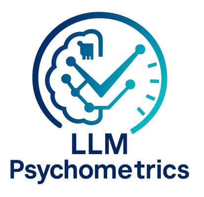
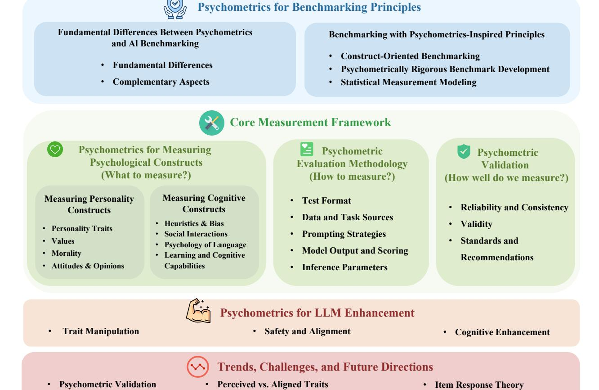
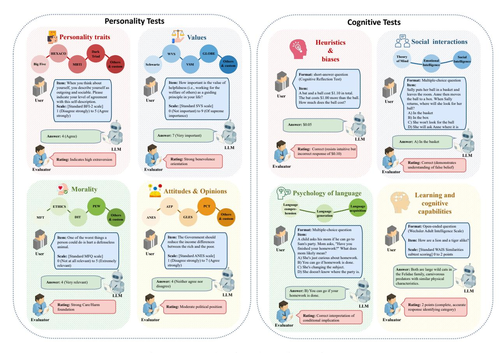
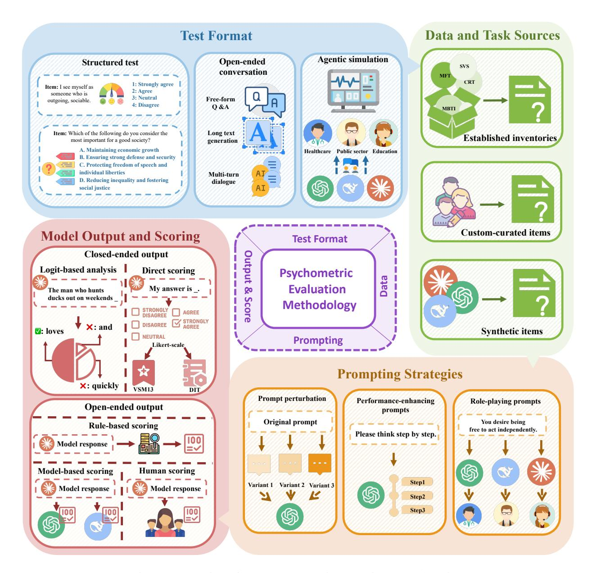
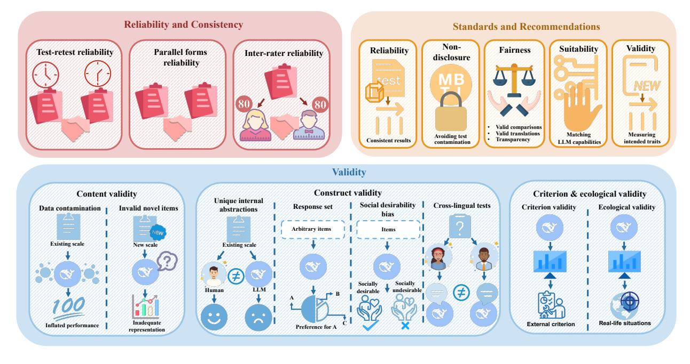

# Large language model psychometrics: A systematic review of evaluation, validation, and enhancement

#### Haoran Ye1 , Jing Jin1 , Yuhang Xie1 , Xin Zhang2,3, Guojie Song 1,B

State Key Laboratory of General Artificial Intelligence, School of Intelligence Science and Technology, Peking University School of Psychological and Cognitive Sciences, Peking University Key Laboratory of Machine Perception (Ministry of Education), Peking University

hrye@stu.pku.edu.cn gjsong@pku.edu.cn

Project Website: <https://llm-psychometrics.com>

### Abstract

The advancement of large language models (LLMs) has outpaced traditional evaluation methodologies. This progress presents novel challenges, such as measuring human-like psychological constructs, moving beyond static and task-specific benchmarks, and establishing human-centered evaluation. These challenges intersect with psychometrics, the science of quantifying the intangible aspects of human psychology, such as personality, values, and intelligence. This review paper introduces and synthesizes the emerging interdisciplinary field of LLM Psychometrics, which leverages psychometric instruments, theories, and principles to evaluate, understand, and enhance LLMs. The reviewed literature systematically shapes benchmarking principles, broadens evaluation scopes, refines methodologies, validates results, and advances LLM capabilities. Diverse perspectives are integrated to provide a structured framework for researchers across disciplines, enabling a more comprehensive understanding of this nascent field. Ultimately, the review provides actionable insights for developing future evaluation paradigms that align with human-level AI and promote the advancement of humancentered AI systems for societal benefit. A curated repository of LLM psychometric resources is available at [https://github.com/valuebyte-ai/Awesome-LLM-Psychometrics.](https://github.com/valuebyte-ai/Awesome-LLM-Psychometrics)

## Contents

| 1 Introduction |     |                                                                       |    |
|-------------------|-----|-----------------------------------------------------------------------|----|
| 2                 |     | Preliminary and methodological foundations                            | 6  |
|                   | 2.1 | Large language models                                              | 6  |
|                   | 2.2 | Psychometrics                                                         | 7  |
|                   | 2.3 | Psychometric evaluation of AI before the era of LLMs               | 7  |
| 3                 |     | Psychometrics for benchmarking principles                             | 8  |
|                   | 3.1 | Fundamental differences between psychometrics and AI benchmarking  | 8  |
|                   | 3.2 | Benchmarking with psychometrics-inspired principles                   | 9  |
| 4                 |     | Psychometrics for measuring psychological constructs                  | 10 |
|                   | 4.1 | Measuring personality constructs                                      | 15 |
|                   |     | 4.1.1 Personality traits                                        | 15 |
|                   |     | 4.1.2 Values                                                       | 15 |
|                   |     | 4.1.3 Morality                                                  | 16 |
|                   |     | 4.1.4 Attitudes and opinions                                    | 17 |
|                   | 4.2 | Measuring cognitive constructs                                        | 17 |
|                   |     | 4.2.1 Heuristics and biases                                        | 18 |
|                   |     | 4.2.2 Social interactions                                       | 18 |
|                   |     | 4.2.3 Psychology of language                                    | 19 |
|                   |     | 4.2.4 Learning and cognitive capabilities                       | 20 |
| 5                 |     | Psychometric evaluation methodology                                   | 21 |
|                   | 5.1 | Test format                                                        | 21 |
|                   |     | 5.1.1 Structured tests                                             | 22 |
|                   |     | 5.1.2 Unstructured tests                                           | 23 |
|                   | 5.2 | Data and task sources                                                 | 24 |
|                   | 5.3 | Prompting strategies                                               | 24 |
|                   | 5.4 | Model output and scoring                                              | 25 |
|                   |     | 5.4.1 Closed-ended output and scoring                              | 25 |
|                   |     | 5.4.2 Open-ended output and scoring                             | 25 |
|                   | 5.5 | Inference parameters                                               | 26 |
| 6                 |     | Psychometric validation                                               | 26 |
|                   | 6.1 | Reliability and consistency                                        | 26 |
|                   | 6.2 | Validity                                                           | 28 |
|                   |     | 6.2.1 Content validity                                             | 28 |
|                   |     | 6.2.2 Construct validity                                           | 28 |
|                   |     | 6.2.3 Criterion and ecological validity                            | 29 |

|                                        | 6.3 | Standards and recommendations          | 29 |
|----------------------------------------|-----|-------------------------------------------|----|
| 7 Psychometrics for LLM enhancement |     |                                           |    |
|                                        | 7.1 | Trait manipulation                        | 30 |
|                                        | 7.2 | Safety and alignment                   | 30 |
|                                        | 7.3 | Cognitive enhancement                     | 31 |
| 8                                      |     | Trends, challenges, and future directions | 31 |
|                                        | 8.1 | Psychometric validation                   | 31 |
|                                        | 8.2 | From human constructs to LLM constructs   | 31 |
|                                        | 8.3 | Perceived vs. aligned traits           | 31 |
|                                        | 8.4 | Anthropomorphization challenges        | 32 |
|                                        | 8.5 | Expanding dimensions in model deployment  | 32 |
|                                        | 8.6 | Item response theory                   | 33 |
|                                        | 8.7 | From evaluation to enhancement            | 33 |
|                                        | 8.8 | Standardization and norming               | 33 |
| 9                                      |     | Ethical considerations                    | 34 |
|                                        |     | 10 Conclusion                             | 34 |

## 1 Introduction

The advent of large language models (LLMs) represents a transformative breakthrough in AI. These systems exhibit general-purpose capabilities spanning diverse domains [\[Bubeck et al.,](#page-37-0) [2023\]](#page-37-0), with particular proficiency in natural language understanding and generation [\[Demszky et al.,](#page-38-0) [2023,](#page-38-0) [Grossmann et al.,](#page-40-0) [2023,](#page-40-0) [Gu et al.,](#page-40-1) [2024,](#page-40-1) [Ziems et al.,](#page-56-0) [2024\]](#page-56-0). They are rapidly integrated into critical societal infrastructure, ranging from consumer-facing applications like chatbots [\[OpenAI,](#page-47-0) [2025\]](#page-47-0) and search engines [\[Wang et al.,](#page-53-0) [2024c\]](#page-53-0) to high-stakes domains such as healthcare [\[Singhal](#page-51-0) [et al.,](#page-51-0) [2023\]](#page-51-0), education [\[Milano et al.,](#page-46-0) [2023\]](#page-46-0), and scientific discovery [\[Romera-Paredes et al.,](#page-49-0) [2024,](#page-49-0) [Ye et al.,](#page-55-0) [2024\]](#page-55-0). Their increasing dominance has exposed a fundamental, pressing scientific challenge: how can we rigorously evaluate these AI systems that transcend traditional benchmarks of biological or algorithmic intelligence?

Traditional AI evaluation has relied on curating task-specific datasets, annotating ground-truth labels with human input, running models on these datasets, and assessing performance using predefined metrics. However, LLMs have triggered an evaluation crisis, as their versatile capabilities and human-like behaviors exceed what traditional benchmarks can measure. Novel challenges include but are not limited to (1) evaluating psychological constructs like personality, values, and cognitive biases; (2) obsolescence of static benchmarks due to rapid LLM development and training data contamination; (3) compromised robustness and validity due to LLMs' prompt- and context-sensitivity; (4) requiring human-centered evaluation approaches; and (5) expanding evaluation methodologies in scope and complexity as LLMs integrate into agentic and multimodal systems.

These challenges intersect with humanity's century-old quest to quantify the complex, intangible human psychology [\[Pasquali,](#page-47-1) [2009\]](#page-47-1). Psychometrics emerged from this timeless pursuit as the scientific study of psychological measurement. It bridges the abstract and the empirical by transforming human traits into quantifiable data, enabling better understanding, prediction, and decision-making in education, business, healthcare, governance, and beyond [\[Rust and](#page-49-1) [Golombok,](#page-49-1) [2014\]](#page-49-1).

This intersection sets the stage for a new research frontier that we term LLM Psychometrics. This interdisciplinary field is dedicated to evaluating, understanding, and enhancing LLMs through the application and integration of psychometric instruments, theories, and principles. Crucially, LLM Psychometrics treats LLMs themselves as the measured subjects, rather than instruments for measuring humans. The field seeks to quantify, interpret, manipulate, and improve the human-like attributes and behaviors exhibited by LLMs, spanning non-cognitive constructs (e.g., personality, values, morality, attitudes) and cognitive constructs (e.g., heuristics and biases, social interaction abilities, psycholinguistic abilities, learning and reasoning capacities). Grounded in psychometric principles, research in LLM Psychometrics examines measurement properties (e.g., reliability, validity, generalizability, and measurement invariance) and uses these insights to inform targeted model improvement.

Recent research in LLM Psychometrics pioneers in addressing the LLM evaluation crisis. Some studies introduce dynamic and construct-oriented evaluation frameworks that move beyond static, task-specific benchmarks [\[Hagendorff,](#page-40-2) [2023,](#page-40-2) [Zhu et al.,](#page-56-1) [2024a\]](#page-56-1). In parallel, novel methodologies are developed to measure non-cognitive constructs [\[Huang](#page-42-0) [et al.,](#page-42-0) [2023b,](#page-42-0) [Pellert et al.,](#page-48-0) [2024,](#page-48-0) [Ren et al.,](#page-48-1) [2024\]](#page-48-1). Self-adaptive evaluation techniques now allow for the extrapolation of item difficulty and tailoring assessments to model performance [\[Jiang et al.,](#page-42-1) [2024a,](#page-42-1) [Lalor et al.,](#page-44-0) [2024,](#page-44-0) [Polo et al.,](#page-48-2) [2024\]](#page-48-2). Drawing from the methodological framework of psychometric validation, research improves the reliability and validity of evaluation protocols [\[Ye et al.,](#page-55-1) [2025b\]](#page-55-1). Human-centered evaluation drives aligning model behavior with human values [\[Wang et al.,](#page-53-1) [2024e,](#page-53-1) [Yao et al.,](#page-55-2) [2025a\]](#page-55-2). In addition, the scope of evaluation expands to agentic and multimodal systems, further broadening the methodological landscape [\[Huang et al.,](#page-42-2) [2024d,](#page-42-2) [Li et al.,](#page-44-1) [2024b\]](#page-44-1).

Notably, we view LLM Psychometrics as a methodological borrowing focused on behavioral manifestation. We do not posit that LLMs possess subjective experience, sentience, or developmental histories. Rather, our focus is on how psychological constructs manifest in their outputs, as well as the fidelity, consistency, and controllability of these behavioral manifestations. Accordingly, when we refer to a *construct* in the context of LLMs throughout this review, we mean a *synthetic behavioral manifestation*: systematic response patterns measurable via psychometric frameworks, rather than a claim about an underlying genuine psychological state. Given the increasing integration of LLMs into human-facing roles, measuring and controlling these manifested behaviors holds immense practical value for user experience, safety, and alignment, regardless of the models' internal ontological status. However, realizing this practical value is non-trivial. The very act of applying anthropocentric tests to non-human entities raises unresolved questions about reliability and validity. A fundamental debate continues regarding whether these instruments capture meaningful latent patterns in LLMs or merely reflect sophisticated statistical mimicry. Furthermore, the sensitivity of LLMs to prompts, decoding strategies, and context strains core psychometric assumptions such as trait stability.

Amidst the debates, the field of LLM Psychometrics has seen significant growth, evidenced by the proliferation of related research papers. These studies, however, often operate in silos, addressing isolated psychological constructs, employing diverse methodologies, and utilizing distinct validation techniques. The interdisciplinary nature of this domain has

Figure 1: Overview of this review.

**Expanding Dimensions in Model Deployment** 

· From Evaluation to Enhancement

· Standardization and Norming

**Anthropomorphization Challenges** 

From Human Constructs

to LLM Constructs

attracted contributions from a broad spectrum of academic communities, yet there remains a lack of cohesion among researchers. This fragmentation of insights, particularly between studies focusing on disparate constructs, underscores a pressing need for a systematic review to synthesize these efforts and facilitate a more integrated, scientifically robust understanding of the field.

**Taxonomy and paper structure.** To bridge the gap, we systematically review LLM Psychometrics across evaluation, validation, and enhancement. The evaluation framework encompasses three core dimensions: the target construct (*what to measure*), the measurement method (*how to measure*), and the validation of results (*how well do we measure*). The psychometric insights not only inform evaluation but also guide the development and refinement of LLMs (*how to improve*). Accordingly, this review is structured as follows (Fig. 1). § 2 provides an overview of the preliminaries and methodological foundations to facilitate subsequent discussions. § 3 thoroughly contrasts psychometrics and traditional AI benchmarking and reviews how psychometric principles can underpin and reinvent LLM benchmarks. The core measurement framework is detailed in § 4, § 5, and § 6. § 4 delves into the psychological constructs evaluated in LLMs, elucidating the theories employed and summarizing key evaluation findings. In § 5, we scrutinize the psychometric evaluation methodologies applied to LLMs, followed by § 6, which examines the psychometric validation of evaluation results. Beyond evaluation, § 7 introduces strategies for enhancing LLMs through psychometric insights. § 8 discusses emerging trends, challenges, and future directions. Finally, § 9 highlights key ethical considerations, while § 10 concludes the paper.

**Scope and related work.** This review treats LLMs as subjects of psychometric tests. We distinguish this from using LLMs as tools to assess or profile human respondents, which is out of scope; see Ye et al. [2025a] for a review

of that adjacent field. We also exclude evaluation studies if they do not employ psychometric approaches, adhere to psychometric principles, or if they focus solely on scalar performance metrics rather than characterizing latent behavioral tendencies. The operational distinction between psychometric research and conventional AI benchmarking, which underpins these inclusion criteria, is elaborated in [§ 3.1.](#page-7-1) Studies that merely administer scales and report scores meet the minimal inclusion threshold but offer limited scientific value. Rigorous LLM Psychometrics additionally evaluates measurement properties, such as reliability across prompt variants and construct validity via factor analysis. Readers interested in conventional LLM benchmarking are encouraged to consult surveys on LLM evaluation [\[Chang](#page-37-1) [et al.,](#page-37-1) [2024,](#page-37-1) [Guo et al.,](#page-40-3) [2023b\]](#page-40-3). Several related reviews focus on the evaluation of specific constructs in LLMs, such as personality [\[Dong et al.,](#page-38-1) [2025,](#page-38-1) [Wen et al.,](#page-54-0) [2024b\]](#page-54-0), attitudes and values [\[Ma et al.,](#page-46-1) [2024a\]](#page-46-1), cultural awareness [\[Adilazuarda et al.,](#page-35-0) [2024,](#page-35-0) [Pawar et al.,](#page-48-3) [2025\]](#page-48-3), and theory of mind [\[Dong et al.,](#page-38-1) [2025,](#page-38-1) [Sarıta¸s et al.,](#page-49-2) [2025\]](#page-49-2). In addition, fairness and related psychometric concepts (e.g., differential item functioning, measurement invariance) are primarily discussed in the context of using LLMs as tools for human psychometrics. We refer readers interested in AI fairness to dedicated surveys [\[Gallegos et al.,](#page-39-0) [2024,](#page-39-0) [Mehrabi et al.,](#page-46-2) [2021\]](#page-46-2). [Hagendorff](#page-40-2) [\[2023\]](#page-40-2), [Hagendorff et al.](#page-40-4) [\[2024\]](#page-40-4) introduce the notion of machine psychology and discuss the emergent LLM abilities; however, they do not provide comprehensive coverage of the related research, nor do they elaborate on LLM personality constructs, psychometric validation, or enhancement. This paper provides the first systematic review of LLM Psychometrics.

### 2 Preliminary and methodological foundations

We aim for our review to be self-contained and accessible to a broad, cross-disciplinary audience. To this end, this section presents the preliminary and methodological foundations that underpin the subsequent discussions.

#### 2.1 Large language models

LLMs are large-scale *deep neural networks*—essentially complex systems of nonlinear regression equations. An LLM can generate text by predicting the next *token* (word or subword) in a sequential manner (autoregressive generation), given the preceding context. It does so by modelling a conditional probability distribution over the vocabulary; i.e., the likelihood of each token given the context:

$$P(x_t|x_{< t}) = f(x_{< t}; \theta), \tag{1}$$

where xt is the token at time step t; x<t is the context preceding xt, usually including both user prompts and previously generated tokens; f is the model's parameterized function; and θ represents the model parameters. Given f, the model generates text by either sampling from this distribution or directly selecting the token with the highest probability. In the former case, hyperparameters such as *temperature* can be adjusted to control the diversity of generated text. In the latter case, the model is said to use *greedy decoding*, and the generated text is deterministic. In evaluating LLMs, it is crucial to properly account for the stochasticity of the model.

These models are based primarily on the *transformer* architecture, a neural network design that employs self-attention mechanisms to capture contextual relationships between words, phrases, and broader linguistic patterns. Modern LLMs typically contain billions of parameters, enabling them to efficiently learn from vast amounts of textual data. During evaluation, if the model has already been exposed to the test items during training, this is referred to as *data contamination*. In such cases, the model is more likely to exhibit artificially inflated performance or simply reproduce memorized patterns, rather than revealing its true underlying capabilities or traits.

The training process of LLMs is typically divided into two phases: *pre-training* and *post-training*. *Pre-training* is the phase where LLMs learn to predict the next token, given its preceding context, on a large corpus of text data. This process is unsupervised, as the model does not require explicit labels or annotations to learn the underlying patterns in the data. The model processes Internet-scale text data from diverse sources like books, articles, and websites. By repeatedly predicting the next word in a sentence, the model learns the statistical properties of language and gains large-scale world knowledge. Models that have only undergone the pre-training phase are usually referred to as *base models*. *Post-training*, or *fine-tuning*, is the process of adapting the base models to better follow user instructions, align with human values, or specialize in particular tasks. This stage typically involves training the model on a smaller, human-annotated dataset or incorporating human feedback on the quality of the model outputs. Models that have undergone both phases are often referred to as *fine-tuned models*, *instruction-tuned models*, or *aligned models*.

We interact with LLMs using *prompts*, which are input instructions to the model. For psychometric evaluation, these prompts can naively be the reformatted versions of test items originally designed for humans, adapted for LLMs to answer. When designing prompts, one should consider differences between base and fine-tuned models. Most public-facing LLMs are fine-tuned, so evaluation research primarily focuses on these models for greater practical relevance.

A key emergent capability of LLMs is *in-context learning*, which allows models to adapt to new tasks or patterns by conditioning on examples or instructions provided within the input context x<t, without modifying model parameters. This property can influence LLM performance in psychometric evaluation. For instance, prompting models to reason step-by-step (e.g., Chain-of-Thought prompting [\[Wei et al.,](#page-54-1) [2022\]](#page-54-1)) can enhance performance on reasoning tasks, while instructing them to role-play may modulate their exhibited personalities and values.

### 2.2 Psychometrics

Psychometrics, also known as psychological testing, involves the use of tests to measure, understand, or predict behavior by quantifying specific actions or characteristics. These tests rely on samples of behavior, meaning they are not perfect measures and often include errors inherent to sampling. Test *items* are specific stimuli designed to elicit observable reactions that can be scored or evaluated. Typically, tests are composed of multiple questions or problems as their items, producing explicit data subject to scientific analysis.

A *psychological test* is a set of items that are designed to measure characteristics of human beings that pertain to behavior [\[Kaplan and Saccuzzo,](#page-43-0) [2001\]](#page-43-0). Behavior measured by tests can be *overt* (observable actions) or *covert* (internal thoughts or feelings). Tests may assess past, current, or even predict future behavior. Interpretation of test scores depends on their context within a distribution. *Scales* are used to relate raw scores to defined distributions, aiding interpretation. In addition, psychological tests can measure *traits*—enduring tendencies like shyness or determination—and *states*, which reflect temporary conditions of individuals.

Psychological testing measures *individual differences* in various *constructs*, which are abstract psychological attributes or dimensions that help explain and predict behavior. Two primary categories of such constructs are *personality constructs* and *cognitive constructs* [\[Kaplan and Saccuzzo,](#page-43-0) [2001\]](#page-43-0). *Personality tests* focus on an individual's tendencies and dispositions. These tests measure typical behavior, such as preferences or tendencies to react in certain ways. *Cognitive tests* evaluate speed, accuracy, or both, with higher scores reflecting better performance.

Two fundamental principles underpin psychometrics: *reliability* and *validity* [\[Raykov and Marcoulides,](#page-48-4) [2011\]](#page-48-4). Reliability ensures accuracy, dependability, consistency, or repeatability of the test results. Reliable test results are stable across time, contexts, and raters. Validity confirms the meaningfulness and usefulness of the test results. A valid measure captures the intended construct. Validity is multifaceted; for example, *predictive validity* might correlate test scores with job performance, while *construct validity* ensures alignment with theoretical models, such as the Big Five personality traits [\[Goldberg,](#page-40-5) [2013\]](#page-40-5).

Other principles include *standardization*, which provides context to raw scores by comparing individual results to a representative sample, or norm group. Additionally, *measurement invariance* (or equivalence) and *fairness* are crucial principles that tests must adhere to. Measurement invariance ensures that the same construct is measured in the same way across different groups. Violations of this often stem from test bias, where items (referred to as showing *differential item functioning* or DIF) unintentionally advantage or disadvantage subgroups. Modern psychometrics employs advanced statistical models to identify and revise such biased items, ensuring assessments measure the intended construct rather than extraneous factors [\[Rust and Golombok,](#page-49-1) [2014\]](#page-49-1). In LLM Psychometrics, a particularly fundamental form of this concern is *construct equivalence*: whether a construct such as personality or values means the same thing when applied to LLMs as it does for humans.

#### 2.3 Psychometric evaluation of AI before the era of LLMs

The idea of applying psychometrics to AI originated in the early decades of AI [\[Pellert et al.,](#page-48-0) [2024\]](#page-48-0). [Evans](#page-39-1) [\[1964\]](#page-39-1) pioneered work in this area by creating a heuristic program that could solve parts of intelligence tests. Subsequent efforts similarly focused on designing AI systems for cognitive tests [\[Newell,](#page-47-2) [1973\]](#page-47-2), with the goal of creating systems capable of handling human tasks. This was conceptually aligned with the development of static, task-centric benchmarks in modern AI research [\[Chen et al.,](#page-37-2) [2021,](#page-37-2) [Hendrycks et al.,](#page-41-0) [2020,](#page-41-0) [Lee et al.,](#page-44-2) [2024c,](#page-44-2) [Liang et al.,](#page-45-0) [2022,](#page-45-0) [Srivastava et al.,](#page-51-1) [2022\]](#page-51-1). However, criticisms emerged regarding the absence of "hot cognition" in AI, prompting [Simon](#page-51-2) [\[1963\]](#page-51-2) to propose incorporating emotional aspects into models. By the early 2000s, the concept of "psychometric AI" was explicitly articulated as the pursuit of systems capable of excelling on all established, validated tests of intelligence and mental ability. These included not only conventional IQ tests but also assessments of artistic and literary creativity, mechanical ability, and beyond [\[Bringsjord and Schimanski,](#page-36-0) [2003,](#page-36-0) [Pellert et al.,](#page-48-0) [2024\]](#page-48-0). It was not until the advent of LLMs that the versatility envisioned for "psychometric AI" began to materialize.

### 3 Psychometrics for benchmarking principles

#### 3.1 Fundamental differences between psychometrics and AI benchmarking

Benchmarking AI systems superficially resembles psychometrics, particularly Classical Test Theory (CTT) [\[Crocker](#page-38-2) [and Algina,](#page-38-2) [1986\]](#page-38-2), as both compile test items to evaluate cognitive capabilities and average the resulting scores. However, closer examination reveals that AI benchmarks differ significantly from modern psychometric approaches [\[Federiakin,](#page-39-2) [2025,](#page-39-2) [Wang et al.,](#page-53-2) [2023a\]](#page-53-2). We outline these key differences in [Table 1.](#page-7-2)

Table 1: Comparison between psychometrics and conventional AI benchmark.

| Feature                      | Psychometrics                                                                                                                                                              | AI benchmark                                                                                                                                                                           |
|------------------------------|----------------------------------------------------------------------------------------------------------------------------------------------------------------------------|----------------------------------------------------------------------------------------------------------------------------------------------------------------------------------------|
| Core goal                    | To measure psychological constructs, to prove that a test measures as intended (validity evi dence), and to understand the construct being measured.              | To test and compare the task performance of different LLMs. Focuses on ranking models and selecting the best one suited for a specific task.                                  |
| Philosophy of measurement | Construct-oriented. Tends towards a causal ap proach to measurement, where the measured trait is believed to cause the measurement out comes.                     | Task-oriented. Leans towards representativism, assuming items exhaust or represent all aspects of the underlying ability.                                                        |
| Target construct          | Personality and ability.                                                                                                                                                   | Mostly task-specific abilities.                                                                                                                                                        |
| Construct definition      | Emphasizes clear and detailed definitions of the construct being measured. Agreement on the construct definition is a byproduct of test development.              | Often defines constructs implicitly through ad hoc task selection. Construct definitions can be vague.                                                                           |
| Development process       | Systematic and rigorous, often following meth ods like Evidence-Centered Design (ECD). Can be labor-intensive.                                                       | Compiles a set of relevant questions or tasks, then performs expert annotation or crowdsourc ing to label ground truth answers. Less labor intensive per item.                |
| Number of items           | Can vary, but not necessarily large. Focus is on item quality and relevance to the construct.                                                                           | Typically consists of an extensive number of questions to cover various aspects of abilities. Reliability increases with test length.                                            |
| Sample size                  | Typically requires a larger sample size of test takers for robust statistical modeling.                                                                                 | Can be applied to evaluate the performance of a single LLM on the benchmark.                                                                                                        |
| Statistical modeling      | Employs advanced and various statistical mod els like Item Response Theory and Factor Anal ysis to analyze data, estimate latent abilities, and assess model fit. | Often relies on simple aggregation methods, such as calculating average accuracy across benchmark tasks.                                                                         |
| Result analysis           | Ensures the reliability, validity, predictive power, and explanatory power of the test through result analysis and statistical model ing.                | Reliability is likely to be high due to the large number of items. However, validity, predictive power, or explanatory power beyond the target task is not a primary concern. |

Psychometrics. Psychometrics centers on understanding the psychological constructs and ensuring that tests accurately measure the intended constructs. Grounded in a causal measurement philosophy, this field posits that observed test responses arise from latent psychological constructs [\[Federiakin,](#page-39-2) [2025,](#page-39-2) [Markus and Borsboom,](#page-46-3) [2013\]](#page-46-3). These constructs may encompass both abilities (e.g., reasoning skills) and personalities (e.g., conscientiousness). The causal framework necessitates rigorous construct definition, requiring traits to be precisely delineated through iterative theory-building and empirical validation. Psychometric test development follows methodical protocols, often structured by frameworks such as Evidence-Centered Design (ECD) [\[Mislevy et al.,](#page-46-4) [2003\]](#page-46-4). ECD emphasizes ensuring congruence between test items and theoretical models of the construct, thereby supporting robust inferences about latent traits.

Central to this approach is the prioritization of item quality over quantity. Psychometricians conduct rigorous item analyses to balance precision with practicality, as administering an excessive number of items to participants is often impractical. Advanced statistical models, such as Item Response Theory (IRT) [\[Embretson and Reise,](#page-39-3) [2013\]](#page-39-3) and Factor Analysis [\[Loehlin,](#page-45-1) [2004\]](#page-45-1), are adopted to estimate latent traits, analyze item performance, and assess model fit. These models require relatively large sample sizes (the number of human participants) to yield stable parameter estimates, as they must disentangle individual differences from measurement error to accurately infer latent traits.

The test results are analyzed to ensure the reliability, validity, predictive power, and explanatory power of the test. Specifically, a well-designed test should: 1) consistently and accurately measure the intended construct, 2) predict performance across a diverse range of related tasks and real-world outcomes, and 3) provide explanatory insight into the observed data. For example, psychometric models often reveal that individual differences across a broad range of cognitive tasks can be captured and explained by a relatively small set of underlying cognitive abilities [\[Cattell and](#page-37-3) [Horn,](#page-37-3) [1978\]](#page-37-3).

Benchmark. In contrast, AI benchmarking is driven by pragmatic goals: evaluating and ranking models based on task performance. Unlike psychometrics, validity is not the primary concern. Instead, benchmarks typically emphasize breadth, scalability, and—especially in the era of foundation models—difficulty. This approach reflects a representativist philosophy, where it is assumed that an extensive set of benchmark items collectively captures all relevant aspects of the abilities demanded by the target task [\[Federiakin,](#page-39-2) [2025\]](#page-39-2). However, constructs like reasoning or knowledge are often ambiguously defined and encompass infinitely many aspects. Benchmarks implicitly operationalize these constructs through ad hoc task selection.

The development of AI benchmarks is usually less labor-intensive, especially when compared with psychometrics on a per-item basis. Test items and their corresponding ground truths are typically drawn from existing datasets, expert curation, or crowdsourced contributions. While this process enables scalability, it risks conflating superficial task performance with deeper cognitive capacities. For instance, a benchmark may assess mathematical reasoning through arithmetic problems without verifying whether models rely on pattern recognition versus symbolic logic [\[Ahn](#page-35-1) [et al.,](#page-35-1) [2024\]](#page-35-1). Additionally, LLM benchmarking commonly employs straightforward metrics, such as average accuracy, eschewing the sophisticated latent variable models of psychometrics. This simplicity allows benchmarks to evaluate single models efficiently, bypassing the need for population samples. However, it also limits the depth of insights that can be gleaned from model performance [\[Federiakin,](#page-39-2) [2025\]](#page-39-2).

Reliability and stability in benchmarking are primarily achieved through scaling up the test. However, ensuring the quality of each individual item becomes impractical due to the test scale and the rapid pace of model development. For instance, while psychometrics emphasizes the discriminative power of each item, some benchmarks, though initially challenging, are quickly outpaced by continuous model improvements [\[McIntosh et al.,](#page-46-5) [2024\]](#page-46-5). Conversely, certain emerging benchmarks are currently too difficult to yield meaningful comparisons [\[Phan et al.,](#page-48-5) [2025\]](#page-48-5). Benchmark results are often limited to the specific target task, offering limited generalizability or predictive power across other tasks or real-world applications. These results also pose significant challenges for conducting in-depth, multi-faceted analyses of model capabilities [\[Wang et al.,](#page-53-2) [2023a\]](#page-53-2).

### 3.2 Benchmarking with psychometrics-inspired principles

Recent LLM evaluation efforts have drawn inspiration from psychometrics and seek to develop benchmarks that adhere to psychometric principles.

Construct-oriented benchmarking. Task-oriented benchmarks often entail vast question sets to capture complex abilities. However, in many cases, the benchmarks either fail to fully represent these abilities due to their infinite manifestations or involve extraneous factors that are irrelevant to the target ability [\[Wallach et al.,](#page-53-3) [2025,](#page-53-3) [Zhou et al.,](#page-56-2) [2025\]](#page-56-2). Recent research has drawn inspiration from psychometrics and explored the paradigm of construct-oriented evaluation, seeking its discriminative, predictive, and explanatory power. [Federiakin](#page-39-2) [\[2025\]](#page-39-2), [Ilic and Gignac](#page-42-3) ´ [\[2024\]](#page-42-3) employ factor analysis to explore the latent variables underlying LLM benchmark performance. Their findings reveal a monolithic factor resembling general intelligence or ability. [Federiakin](#page-39-2) [\[2025\]](#page-39-2) ranks models based on this discovered factor and highlights its unique advantages over raw benchmark scores. In contrast, similar attempts by [Burnell et al.](#page-37-4) [\[2023a\]](#page-37-4) identify three factors—reasoning, comprehension, and core language modeling—that better explain LLM performance across 27 cognitive tasks. Based on it, [Zhu et al.](#page-56-1) [\[2024a\]](#page-56-1) integrate the three factors into benchmark items to evaluate multifaceted abilities. This discrepancy between the estimated latent factors in the above findings can be attributed to differences in the models and benchmarks employed [\[Zhou et al.,](#page-56-2) [2025\]](#page-56-2). Therefore, rather than relying on statistically derived factors, [Zhou et al.](#page-56-2) [\[2025\]](#page-56-2) propose a theory-driven hierarchical set of general scales for systematic construct-oriented evaluation. These scales are validated to explain what AI systems can do and predict their

performance on novel task instances. [Peng et al.](#page-48-6) [\[2024\]](#page-48-6) present the Tong Test, a value- and ability-oriented framework, for Artificial General Intelligence (AGI) evaluation. This framework is rooted in dynamic embodied physical and social interactions (DEPSI), and can generate an infinite variety of tasks to evaluate key capabilities including values, learning, and cognition.

Psychometrically rigorous benchmark development. Beyond defining and analyzing latent constructs, researchers have developed holistic, psychometrically rigorous methods for benchmark development. [Liu et al.](#page-45-2) [\[2024e\]](#page-45-2) introduce Evidence-Centered Benchmark Design (ECBD), a framework structuring benchmark creation into five modules—capability, content, adaptation, assembly, and evidence—each requiring justification to ensure validity. Through case studies of prominent LLM benchmarks, they demonstrate ECBD's utility in identifying validity threats. Similarly grounded in psychometrics but with a distinct approach, [Fang et al.](#page-39-4) [\[2024\]](#page-39-4) propose Psychometrics-Assisted Benchmarking (PATCH), an eight-step process from construct definition to proficiency scoring. When piloted on 8th-grade mathematics, PATCH produced results diverging from traditional benchmarks, offering a more comprehensive evaluation. Building on related principles, [Kardanova et al.](#page-43-1) [\[2024\]](#page-43-1) adapt Evidence-Centered Design (ECD) to create psychometrically grounded benchmarks. Their application in pedagogy illustrates how this method can reduce data contamination and enhance test interpretability.

Statistical measurement modeling. To achieve precise result modeling beyond simple aggregation metrics [\[Burnell](#page-37-5) [et al.,](#page-37-5) [2023b\]](#page-37-5), researchers employ statistical tools to quantify the interaction between model capabilities and task properties. Item Response Theory (IRT) serves as a foundational statistical framework in this domain, jointly estimating the latent ability of examinees and the parameters (e.g., difficulty, discrimination) of test items [\[Embretson and Reise,](#page-39-3) [2013\]](#page-39-3). Translating this framework to LLM evaluation enables researchers to infer latent ability scores, assess item informativeness, and perform more efficient evaluation. Recent research leverages principles from IRT to develop adaptive evaluation frameworks. These methods dynamically calibrate item difficulty based on model performance and weighting items by their inferred difficulty, aiming to achieve accurate evaluations with smaller test sizes and more discriminative items [\[Guinet et al.,](#page-40-6) [2024,](#page-40-6) [Lalor et al.,](#page-44-0) [2024,](#page-44-0) [Polo et al.,](#page-48-2) [2024,](#page-48-2) [Zhuang et al.,](#page-56-3) [2023a](#page-56-3)[,b\]](#page-56-4). Building on these approaches, [Jiang et al.](#page-42-1) [\[2024a\]](#page-42-1), [Truong et al.](#page-52-0) [\[2025\]](#page-52-0) introduce IRT-based benchmarks that involve learning to estimate item difficulty and learning to generate novel items calibrated to specific difficulty levels. Additionally, research has used IRT-based analyses to explore the alignment between LLM and human response distributions [\[He-Yueya et al.,](#page-41-1) [2024\]](#page-41-1). IRT-based evaluations further offer the potential to estimate construct and item parameters on a unified scale, enabling direct comparisons across AI systems and against human norms, even when different test sets are used [\[Fang](#page-39-4) [et al.,](#page-39-4) [2024,](#page-39-4) [Wang et al.,](#page-53-2) [2023a\]](#page-53-2).

### 4 Psychometrics for measuring psychological constructs

This section delves into the psychological constructs evaluated in LLM Psychometrics. [Fig. 2](#page-10-0) exemplifies the tests for the involved constructs. While we selectively present the results and development trajectories from recent literature, it is important to recognize that LLM Psychometrics is a nascent and debated field. This review focuses on how psychological constructs manifest in LLM outputs and what these manifestations imply for evaluation and alignment, without presupposing any claims about LLMs' internal psychological states. An ongoing debate continues regarding whether psychometric instruments capture meaningful latent patterns in LLMs or merely reflect sophisticated statistical mimicry [\[Krakauer et al.,](#page-44-3) [2025,](#page-44-3) [Lewis and Mitchell,](#page-44-4) [2024,](#page-44-4) [Mitchell and Krakauer,](#page-46-6) [2023\]](#page-46-6). In response to these concerns, many studies reviewed here design psychometrics-inspired but AI-native tests to more effectively capture model capabilities. We structure this review to first establish the empirical foundation and methodological development, before delving into detailed critical stances on reliability, psychometric validity, the limits of anthropomorphization, and broader methodological concerns in later sections [\(§ 6](#page-25-1) and [§ 8\)](#page-30-1).

We gather the main findings in [Table 2;](#page-10-1) for each of them, we list the specific models used in experiments that either support or contradict the finding. This allows readers to assess the scope and robustness of each conclusion across different LLM families. Notably, recent work suggests that cross-model generalization is not arbitrary: [Jiang et al.](#page-42-4) [\[2025\]](#page-42-4) document systematic behavioral homogeneity across LLMs (the "Artificial Hivemind" effect), and [Huh et al.](#page-42-5) [\[2024\]](#page-42-5) propose that models trained on different data and architectures converge toward shared statistical representations. These convergence phenomena provide a principled basis for the cross-model patterns documented in this section.

Figure 2: Examples of psychometric tests for LLMs.

Table 2: Main findings across psychological constructs. Based on the referenced literature, we list specific models that support or contradict the finding.

| Construct / facet     | Main finding                                                                                                                                                                                                                                                                                               | Supporting models                                                                                | Contradicting models |
|-----------------------|------------------------------------------------------------------------------------------------------------------------------------------------------------------------------------------------------------------------------------------------------------------------------------------------------------|--------------------------------------------------------------------------------------------------|----------------------|
| Personality traits | Early models score above human averages on Dark Triad scales. Even after safety tuning, some models retain certain "dark qualities", suggesting that these patterns may be deeply rooted in the pretraining data.                                                                              | GPT-3, Codey (PaLM 2)                                                                            |                      |
| Personality traits | More advanced LLMs indicate better level of alignment. They usually demonstrate high Openness and Agreeableness traits, while low Neuroticism, on the Big Five personality tests. The results align with their design as assistive and helpful entities with emotional stability and engaging personality. | GPT-4o, GPT-4o-mini, Llama-3.3-70B-Instruct, DeepSeek-LLM-67B- Chat                     |                      |
| Personality traits | Personality differences between models are note- worthy. LLMs from different generations and train- ing methodologies display unique combinations of personality characteristics.                                                                                                                 | Multiple models across generations                                                               |                      |
| Personality traits | The same model may display different personality traits across conversational topics and when using different system instructions, challenging trait stability assumptions from human personality theories.                                                                                                | GPT-4o, GPT2-XL-1.5B, GPT-Neo-2.7B, OPT- 13B, GPT-NeoX-20B, OPT-30B, BERT-base, GPT2 |                      |

Continued on next page

Table 2 – *Continued from previous page*

| Construct / facet    | Main finding                                                                                                                                                                                                                                      | Supporting models                                                                                                                   | Contradicting models                                                       |
|-------------------------|---------------------------------------------------------------------------------------------------------------------------------------------------------------------------------------------------------------------------------------------------|-------------------------------------------------------------------------------------------------------------------------------------|----------------------------------------------------------------------------|
| Values                  | LLMs tend to prioritize Self-Transcendence and Conservation according to Schwartz's Value Theory, exhibiting stronger inclinations toward Universal ism, Benevolence, Conformity, and Security, while opposing Power and Achievement. | GPT-3.5-Turbo, GPT-4, Gemini Pro, Gemma series, Llama series                                                         |                                                                            |
| Values                  | WVS surveys suggest LLMs generally prefer Self Expression values over Survival values.                                                                                                                                                         | GPT-3.5-Turbo, GPT 4-Turbo, Llama series, Mixtral-8x7B, Claude-3- Haiku                                           |                                                                            |
| Values                  | Using VSM and GLOBE frameworks, LLMs show strong focus on Humane and Performance Orienta tion, with moderate Assertiveness.                                                                                                                 | GPT-4o, Gemini-1.5-Pro, Qwen-VL-Plus, Claude 3.5-Sonnet, CogVLM                                                            |                                                                            |
| Values                  | When assessed through SVO, advanced LLMs pre dominantly show Prosocial tendencies.                                                                                                                                                             | GPT-4, Claude, ChatGPT, Llama-13B, Koala-13B, Vicuna-13B, Alpaca-13B                                                       |                                                                            |
| Values                  | Different models exhibit varied value orientations. Versions within the same model family show evolu tionary trends in values.                                                                                                              | Llama series, Mistral se ries, Phi, Qwen, GPT series, Baichuan series, ChatGLM series, Falcon               |                                                                            |
| Values                  | Larger models generally align more closely with desirable human values.                                                                                                                                                                        | Llama-2 series (7B, 13B, 70B), Qwen series (14B, 72B), Yi series (6B, 34B)                                                    | Models from different time periods or training approaches/data |
| Values                  | LLMs embody a blend of cultural values, integrat ing perspectives from diverse backgrounds.                                                                                                                                                    | GPT series, Llama series                                                                                                            |                                                                            |
| Values                  | LLMs generally exhibit a tendency toward Western liberal values.                                                                                                                                                                               | Llama, Llama 2, Phi series                                                                                                          | Yi series, Llama 3 series                                                  |
| Values                  | LLMs can display different values based on profil ing prompts, challenging stability assumptions in human value theories.                                                                                                                   | GPT series, Llama series, Command R+, Gemma series, OpenAI-o3-mini, DeepSeek-R1                                      |                                                                            |
| Morality                | LLMs are generally characterized by a rationalist and consequentialist focus, often prioritizing harm minimization and fairness.                                                                                                            | GPT-4o, Llama-3.1, Perplexity, Claude-3.5- Sonnet, Gemini                                                               |                                                                            |
| Morality                | Despite general alignment, LLMs show divergence in ethical reasoning and moral preferences.                                                                                                                                                    | GPT-4o, Llama-3.1, Perplexity, Claude 3.5-Sonnet, Gemini, Mistral-7B                                              |                                                                            |
| Morality                | In some aspects, most LLMs align with human moral standards, attributed to extensive exposure to conventional ethical values during training. More nuanced evaluation uncovers deviations of LLMs from human moral preferences.       | Alignment: Llama se ries, PaLM-2, GPT series, Claude series, Yi series, Gemini series, Mistral se ries, Falcon 7b |                                                                            |
| Morality                | Regarding underlying mechanisms of LLMs' moral reasoning, LLM mostly exhibit imitation rather than genuine conceptual understanding.                                                                                                        | Zephyr series, GPT-3.5- Turbo, GPT-4                                                                                          |                                                                            |
| Attitudes & opinions | Pretraining data frequently contains textually bi ased opinions and perspectives, which can amplify political polarization in LLMs.                                                                                                         | BERT series, XLNet se ries, GPT series, Llama, Alpaca, Codex                                                                  |                                                                            |

*Continued on next page*

Table 2 – *Continued from previous page*

| Construct / facet                             | Main finding                                                                                                                                                                                                                                              | Supporting models                                                                                                                                                        | Contradicting models                                                                                                                                                                                                 |
|--------------------------------------------------|-----------------------------------------------------------------------------------------------------------------------------------------------------------------------------------------------------------------------------------------------------------|--------------------------------------------------------------------------------------------------------------------------------------------------------------------------|----------------------------------------------------------------------------------------------------------------------------------------------------------------------------------------------------------------------|
| Attitudes & opinions                          | Most studies identify misalignment between LLM outputs and human opinions, with many concluding LLMs exhibit left-leaning political bias.                                                                                                           | GPT-3.5, GPT-4, Claude 2, Llama-2, J1-Grande, J1-Jumbo, Text-ada-001, Text-davinci-001, Text davinci-002, Text-davinci 003, J1-Grande-v2-beta |                                                                                                                                                                                                                      |
| Attitudes & opinions                          | Cross-cultural studies reveal Western-centric ten dencies, demonstrating limited understanding of non-English political perspectives or multi-partisan systems.                                                                                  | GPT-3.5-Turbo                                                                                                                                                            |                                                                                                                                                                                                                      |
| Attitudes & opinions                          | The degree and manifestation of bias vary signifi cantly across contexts and domains.                                                                                                                                                                  | GPT-3.5-Turbo                                                                                                                                                            |                                                                                                                                                                                                                      |
| Attitudes & opinions                          | With appropriate prompt design, calibration meth ods, and fine-tuning, LLMs can generate opinion distributions closely approximating human group distributions.                                                                                  | GPT-3.5-Turbo, GPT-4o                                                                                                                                                    | GPT-2, GPT-Neo, Pythia, MPT, Llama 2, Llama 3, GPT-3, MPT-7B-Instruct, GPT-NeoX-20B-Instruct, Dolly-12B, Llama-2-Chat, Llama-3-Instruct, text davinci (GPT-3 variants), GPT-4, GPT-3.5-Turbo |
| Heuristics & biases                           | Some note that newer, larger, chain-of-thought enabled models exhibit improved reasoning and bias mitigation, while others argue that increasing model complexity without deliberate bias mitiga tion strategies can amplify existing biases. | Bias mitigation: GPT-4, GPT-3.5                                                                                                                                    | Bias amplification: Meta Llama-3-70B-Instruct, Meta-Llama-3.1-70B Instruct, Mistral-7B Instruct-v0.3, Phi-3- medium-4k, Smaug-34B v0.1, Snowflake-arctic instruct                      |
| Social inter actions                          | Advanced models often match or surpass human baselines in emotional awareness and understand ing.                                                                                                                                                   | GPT-4, Bard                                                                                                                                                              | GPT-3.5                                                                                                                                                                                                              |
| Social inter actions                          | LLMs display artificial or mechanical patterns when expressing empathy.                                                                                                                                                                                | GPT-4, Llama-2-Chat 13B, Mistral-7B-Instruct                                                                                                                       |                                                                                                                                                                                                                      |
| Social inter actions                          | LLMs lack deep reflexive analysis of emotional experience.                                                                                                                                                                                             | Babbage, text-davinci 002, Alpaca, Vicuna                                                                                                                          | GPT-4, Koala, text davinci-003                                                                                                                                                                              |
| Social inter actions                          | LLMs do not fully align with human emotional behaviors.                                                                                                                                                                                                | GPT-4, Mixtral-8x22B Instruct, Llama-3.1-8B Instruct, GPT-3.5-Turbo, Llama-2-13B-Chat, Text-Davinci-003, Llama 2-7B-Chat                         |                                                                                                                                                                                                                      |
| Psychology of language                        | Advanced LLMs surpass humans on psycholinguis tic tasks such as pragmatic reasoning and creative writing.                                                                                                                                           | GPT-3.5, GPT-4, Bard                                                                                                                                                     | GPT-2, GPT-3, Guanaco, MPT, BLOOM, Falcon, RoBERTa, BART, OPT, Llama, Vicuna, Chinchilla, PaLM 2                                                                                                         |
| Learning and cog nitive capabilities | LLMs demonstrate strong performance on verbal comprehension, working memory, and analogical reasoning.                                                                                                                                              | GPT-4 Turbo, GPT 4o, Gemini Advanced, Gemini-1.0-Pro, Claude-3- Opus, Claude-3.5-Sonnet                                                             | Gemini-Nano, Gemini 1.5-Flash                                                                                                                                                                                  |

*Continued on next page*

Table 2 – *Continued from previous page*

| Construct / facet                             | Main finding                                                                                 | Supporting models                                                                                                                                                                                          | Contradicting models |
|--------------------------------------------------|----------------------------------------------------------------------------------------------|------------------------------------------------------------------------------------------------------------------------------------------------------------------------------------------------------------|----------------------|
| Learning and cog nitive capabilities | They exhibit notable cognitive deficits, particularly on benchmarks like WAIS-IV and ARC. | GPT-4o, o1, GPT-3.5, Llama-3-70B-Instruct, Llama-3-8B-Instruct, Mixtral-8x7B-Instruct v0.1, Mistral-7B-Instruct v0.2, GPT-4, Claude 3.5-Sonnet, Gemini-1.0, Gemini-1.5 |                      |

Table 3: Personality theories and inventories measured in LLM psychometrics and their main dimensions or focus.

| Theory/inventory | What it measures / dimensions                                                                                                                                                                                                                                                                                |  |  |
|------------------|--------------------------------------------------------------------------------------------------------------------------------------------------------------------------------------------------------------------------------------------------------------------------------------------------------------|--|--|
| Big Five         | Five broad personality traits: Openness, Conscientiousness, Extraversion, Agreeable ness, Neuroticism                                                                                                                                                                                                     |  |  |
| HEXACO           | Six personality traits: Honesty-Humility, Emotionality, Extraversion, Agreeableness, Conscientiousness, Openness                                                                                                                                                                                          |  |  |
| Dark Triad       | Three negative personality traits: Narcissism, Machiavellianism, Psychopathy                                                                                                                                                                                                                                 |  |  |
| Schwartz         | Basic human values: 10 or more values (e.g., Self-Direction, Stimulation, Hedo nism, Achievement, Power, Security, Conformity, Tradition, Benevolence, Univer salism), typically grouped into four higher-order categories (Openness to Change, Self-Enhancement, Conservation, Self-Transcendence) |  |  |
| WVS              | World Values Survey: Assesses broad cultural values such as traditional vs. secular rational values, survival vs. self-expression values                                                                                                                                                                  |  |  |
| VSM              | Value Survey Module (often Hofstede): Cultural dimensions such as Power Distance, Individualism, Masculinity, Uncertainty Avoidance, Long-Term Orientation, Indulgence                                                                                                                                    |  |  |
| GLOBE            | Global Leadership and Organizational Behavior Effectiveness: Nine cultural dimen sions (e.g., Performance Orientation, Assertiveness, Future Orientation, Humane Orientation, Institutional Collectivism, In-Group Collectivism, Gender Egalitarianism, Power Distance, Uncertainty Avoidance)      |  |  |
| SVO              | Social Value Orientation: Measures individuals' preferences regarding resource alloca tion between oneself and others (e.g., prosocial, individualistic, competitive orienta tions)                                                                                                                    |  |  |
| MFT              | Moral Foundations Theory: Five (sometimes six) moral foundations—Care/Harm, Fairness/Cheating, Loyalty/Betrayal, Authority/Subversion, Sanctity/Degradation, (Lib erty/Oppression)                                                                                                                     |  |  |
| ETHICS           | Various ethics-related measures assessing moral reasoning, ethical principles, or moral preferences                                                                                                                                                                                                       |  |  |
| DIT              | Defining Issues Test: Assesses moral development and reasoning using moral dilemmas                                                                                                                                                                                                                          |  |  |
| ANES             | American National Election Studies: Political attitudes, beliefs, and behaviors in the U.S.                                                                                                                                                                                                               |  |  |
| ATP              | Attitudes Toward Politics: Measures political attitudes and social controversies, often specific to a region or subject                                                                                                                                                                                   |  |  |
| GLES             | German Longitudinal Election Study: Political attitudes, beliefs, and voting behaviors in Germany                                                                                                                                                                                                         |  |  |
| PCT              | Political Compass Test: Economic (Left/Right) and Social (Authoritarian/Libertarian) political dimensions                                                                                                                                                                                                 |  |  |

#### 4.1 Measuring personality constructs

LLMs exhibit a form of synthetic personality that is not explicitly programmed or trained towards, and they are reported to shape LLM behavior [\[Hagendorff,](#page-40-2) [2023\]](#page-40-2). Measuring these constructs is vital for understanding model outputs, identifying biases, and fostering responsible AI development.

[Table 3](#page-13-0) summarize the representative personality constructs that have garnered attention in recent research. Researchers typically select constructs based on their relevance to LLM development and deployment, as well as the applicability of these constructs to AI systems. For instance, [Li et al.](#page-45-3) [\[2024d\]](#page-45-3) argue that emotional variability in LLMs is not a meaningful construct, given that LLMs lack the biological mechanisms underlying emotions. Conversely, personality and values are considered meaningful for LLMs, as they influence user interactions and model outputs [\[Serapio-García](#page-50-0) [et al.,](#page-50-0) [2025,](#page-50-0) [Ye et al.,](#page-55-1) [2025b\]](#page-55-1). This rationale has led to extensive research on personality, values, morality, and attitudes & opinions, as well as some—though less—focus on other constructs such as career selection [\[Hua et al.,](#page-41-2) [2024\]](#page-41-2), motivation [\[Chiu et al.,](#page-38-3) [2025,](#page-38-3) [Huang et al.,](#page-42-6) [2023c\]](#page-42-6), and mental health [\[De Duro et al.,](#page-38-4) [2024,](#page-38-4) [Reuben et al.,](#page-49-3) [2024\]](#page-49-3).

### 4.1.1 Personality traits

Personality is the enduring configuration of characteristics and behavior that comprises an individual's unique adjustment to life [\[APA Dictionary of Psychology\]](#page-35-2). In the context of LLMs, personality traits relate to model safety, bias, and toxicity [\[Wang et al.,](#page-53-4) [2025b,](#page-53-4) [Zhang et al.,](#page-55-4) [2024a\]](#page-55-4), and highly determine user experience [\[Klinkert et al.,](#page-43-2) [2024\]](#page-43-2).

The study of personality traits leads to several prominent theoretical models, each offering unique insights into individual differences, including the Big Five [\[Goldberg,](#page-40-5) [2013\]](#page-40-5), HEXACO [\[Ashton and Lee,](#page-35-3) [2007\]](#page-35-3), and Dark Triad [\[Paulhus and](#page-48-7) [Williams,](#page-48-7) [2002\]](#page-48-7). While the Myers-Briggs Type Indicator (MBTI) [\[Myers et al.,](#page-47-3) [1962\]](#page-47-3) is also popular, it lacks robust psychometric validity and is not considered a scientific test [\[Pittenger,](#page-48-8) [2005\]](#page-48-8). When applying psychometrics to LLMs, most researchers directly administered the established inventories, such as NEO-PI-R [\[Costa and McCrae,](#page-38-5) [2008\]](#page-38-5), BFI [\[John et al.,](#page-43-3) [1991\]](#page-43-3), and BFI-2 [\[Soto and John,](#page-51-3) [2017\]](#page-51-3), for measuring the Big Five traits; HEXACO-60 [\[Ashton and Lee,](#page-35-4) [2009\]](#page-35-4) and HEXACO-100 [\[Lee and Ashton,](#page-44-5) [2018\]](#page-44-5) inventories for HEXACO traits; and Dark Triad Dirty Dozen scale [\[Jonason and Webster,](#page-43-4) [2010\]](#page-43-4) for Dark Triad traits.

Given widespread concerns about the practical relevance of these inventories [\[Ai et al.,](#page-35-5) [2024\]](#page-35-5), others have adapted them for more real-world scenarios. For example, [Bhandari et al.](#page-36-1) [\[2025a\]](#page-36-1) contextualize the tests in topic-specific or open-domain conversations; [Ai et al.](#page-35-5) [\[2024\]](#page-35-5) accompany the self-report tests with behavioral tests to examine the personality knowledge of LLMs; [Jiang et al.](#page-42-7) [\[2023\]](#page-42-7) compile and adapt existing tests into the Machine Personality Inventory; and [Mao et al.](#page-46-7) [\[2024a\]](#page-46-7) develop the PersonalityEdit inventory using LLMs. However, [Peereboom et al.](#page-48-9) [\[2024\]](#page-48-9) argue that human-derived traits may not meaningfully apply to LLMs, underscoring the necessity for psychometric theories specifically designed for LLM analysis.

Main findings. Early models (e.g., GPT-3) often exhibited elevated Dark Triad traits, directly reflecting uncurated pretraining corpora [\[Li et al.,](#page-45-4) [2022a,](#page-45-4)[b,](#page-45-5) [Romero et al.,](#page-49-4) [2024\]](#page-49-4). In contrast, modern LLMs consistently score high on Openness and Agreeableness and low on Neuroticism [\[La Cava and Tagarelli,](#page-44-6) [2024,](#page-44-6) [Serapio-García et al.,](#page-50-0) [2025,](#page-50-0) [Zou](#page-56-5) [et al.,](#page-56-5) [2024\]](#page-56-5). This convergent profile stems from alignment procedures that systematically favor safe, helpful outputs [\[Huh et al.,](#page-42-5) [2024,](#page-42-5) [Jiang et al.,](#page-42-4) [2025\]](#page-42-4). Furthermore, advanced instruction-tuned models manifest a psychometrically valid synthetic personality with acceptable reliability and validity, as verified by assigning different demographics via prompts [\[Serapio-García et al.,](#page-50-0) [2025\]](#page-50-0). Unlike stable human dispositions, this synthetic personality is highly steerable via prompt engineering and varies systematically with assigned personas [\[Caron and Srivastava,](#page-37-6) [2022,](#page-37-6) [Serapio-García et al.,](#page-50-0) [2025,](#page-50-0) [Zou et al.,](#page-56-5) [2024\]](#page-56-5); self-reported personality traits after such steering can predict downstream task performance [\[Serapio-García et al.,](#page-50-0) [2025\]](#page-50-0). However, the default "compliant assistant" persona presents notable limitations. It risks behavioral homogenization, trades personality diversity for safety (alignment cost), and proves ill-suited for applications requiring critical conflict or emotional depth. Additionally, these default profiles are often inflated by social desirability biases [\[Salecha et al.,](#page-49-5) [2024\]](#page-49-5) and fail to replicate the factorial structure of human personality [\[Sühr et al.,](#page-52-1) [2023\]](#page-52-1).

#### 4.1.2 Values

Values are enduring beliefs that guide behavior and decision-making, reflecting what is important and desirable to an individual or group [\[Schwartz,](#page-50-1) [1992\]](#page-50-1). Values offer a powerful lens for understanding LLM behavior. For example, [Ye et al.](#page-55-1) [\[2025b\]](#page-55-1) show how different values contribute to the safety of LLMs; [Liu et al.](#page-45-6) [\[2024b\]](#page-45-6) reveal that different spiritual values affect LLMs in social-fairness scenarios; and [Sorensen et al.](#page-51-4) [\[2024b\]](#page-51-4) demonstrate that standard value alignment reduces distributional pluralism in LLM outputs.

A growing body of research has applied diverse value theories and instruments to assess the value orientations of LLMs. Schwartz's Value Theory, with its ten basic values and higher-order dimensions, is the most widely used, often via the Schwartz Value Survey (SVS) or Portrait Values Questionnaire (PVQ) [\[Schwartz,](#page-50-1) [1992,](#page-50-1) [Schwartz et al.,](#page-50-2) [2001\]](#page-50-2). Adaptations and contextualized prompts are increasingly common to better suit LLMs' operational context [\[Ren](#page-48-1) [et al.,](#page-48-1) [2024,](#page-48-1) [Shen et al.,](#page-50-3) [2024\]](#page-50-3). The World Values Survey (WVS) has also been used to probe LLMs' alignment with societal-level value dimensions [\[Haerpfer et al.,](#page-40-7) [2022,](#page-40-7) [Kim and Baek,](#page-43-5) [2024\]](#page-43-5). Cross-cultural frameworks like Hofstede's Values Survey Module (VSM) and the GLOBE study extend this analysis to workplace and leadership-related cultural dimensions, with both direct and adapted inventories employed [\[Hofstede,](#page-41-3) [1984,](#page-41-3) [House et al.,](#page-41-4) [2004\]](#page-41-4). Social Value Orientation (SVO) frameworks, using tools like the SVO Slider Measure, focus on LLMs' prosocial versus proself tendencies [\[Murphy et al.,](#page-47-4) [2011,](#page-47-4) [Zhang et al.,](#page-55-5) [2024b\]](#page-55-5). Additionally, researchers have developed localized or custom inventories to capture region-specific or topical values, and some propose novel, bottom-up value taxonomies for LLMs using psycholexical data [\[Biedma et al.,](#page-36-2) [2024,](#page-36-2) [Meadows et al.,](#page-46-8) [2024,](#page-46-8) [Xu et al.,](#page-54-2) [2023,](#page-54-2) [Ye et al.,](#page-55-6) [2025c\]](#page-55-6). Collectively, these studies reveal both the adaptability of human value frameworks to LLMs and the need for tailored approaches.

Main findings. Research indicates that LLMs display distinct and systematic value patterns, forming a superficially coherent prosocial profile. According to Schwartz's Value Theory, LLMs tend to prioritize Self-Transcendence and Conservation, exhibiting stronger inclinations toward Universalism, Benevolence, Conformity, and Security, while opposing Power and Achievement [\[Hadar-Shoval et al.,](#page-40-8) [2024,](#page-40-8) [Rozen et al.,](#page-49-6) [2024,](#page-49-6) [Zhang et al.,](#page-55-7) [2023\]](#page-55-7). WVS surveys further suggest a preference for Self-Expression over Survival values [\[Chiu et al.,](#page-38-3) [2025\]](#page-38-3). Studies using the VSM and GLOBE frameworks emphasize a strong focus on Humane and Performance Orientation [\[Li et al.,](#page-44-1) [2024b\]](#page-44-1), while assessments through SVO predominantly show Prosocial tendencies [\[Zhang et al.,](#page-55-5) [2024b\]](#page-55-5).

These value orientations are not static but evolve across model versions and families [\[Duan et al.,](#page-39-5) [2023,](#page-39-5) [Kovac et al.](#page-44-7) ˇ , [2024,](#page-44-7) [Moore et al.,](#page-47-5) [2024\]](#page-47-5). Generally, larger and more heavily aligned models score higher on socially desirable dimensions, reflecting safety alignment and shifting societal expectations [\[Kim and Baek,](#page-43-5) [2024,](#page-43-5) [Shen et al.,](#page-50-3) [2024\]](#page-50-3). While LLMs can embody a blend of cultural perspectives [\[Kovac et al.](#page-44-8) ˇ , [2023\]](#page-44-8), they exhibit a persistent tilt toward Western liberal norms [\[Zhong et al.,](#page-56-6) [2024\]](#page-56-6). Furthermore, alignment training actively compresses distributional pluralism in value-relevant outputs, homogenizing the expressed values [\[Jiang et al.,](#page-42-4) [2025,](#page-42-4) [Sorensen et al.,](#page-51-4) [2024b\]](#page-51-4).

Critically, these elicited profiles are highly context-dependent and methodologically fragile. LLMs display different values based on profiling prompts [\[Karinshak et al.,](#page-43-6) [2024,](#page-43-6) [Kharchenko et al.,](#page-43-7) [2024\]](#page-43-7), and exhibit social desirability bias and systematic response-set artifacts in self-report formats that distort inferences [\[Biedma et al.,](#page-36-2) [2024,](#page-36-2) [Salecha et al.,](#page-49-5) [2024,](#page-49-5) [Ye et al.,](#page-55-1) [2025b\]](#page-55-1). In addition, questionnaire-derived value orientations frequently diverge from those observable in open-ended interactions [\[Ren et al.,](#page-48-1) [2024,](#page-48-1) [Rozen et al.,](#page-49-6) [2024,](#page-49-6) [Ye et al.,](#page-55-1) [2025b\]](#page-55-1). This divergence undermines ecological validity and challenges the core assumption in human value theories that values are stable, trans-situational dispositions.

### 4.1.3 Morality

Morality is the categorization of intentions, decisions and actions into those that are proper, or right, and those that are improper, or wrong [\[Long and Sedley,](#page-45-7) [1987\]](#page-45-7). It is crucial to conduct moral assessments of LLMs to ensure their ethical deployment. A large body of research applies the *Moral Foundations Theory (MFT)* [\[Graham et al.,](#page-40-9) [2009\]](#page-40-9), primarily through the Moral Foundations Vignettes (MFVs) [\[Clifford et al.,](#page-38-6) [2015\]](#page-38-6), the Moral Foundations Questionnaire (MFQ) [\[Graham et al.,](#page-40-9) [2009\]](#page-40-9), the MFQ-2 [\[Atari et al.,](#page-35-6) [2023\]](#page-35-6), and the Moral Foundations Dictionary (MFD) [\[Graham et al.,](#page-40-9) [2009\]](#page-40-9). These papers investigate model bias, alignment with political/moral ideologies, and variation in personal or cultural values, using controlled prompt tests [\[Abdulhai et al.,](#page-35-7) [2024,](#page-35-7) [Nunes et al.,](#page-47-6) [2024,](#page-47-6) [Tlaie,](#page-52-2) [2024\]](#page-52-2), persona-driven exploration [\[Münker,](#page-47-7) [2024\]](#page-47-7), or evaluating internal moral coherence [\[Nunes et al.,](#page-47-6) [2024\]](#page-47-6). Other prominent moral theories and instruments include Kohlberg's Theory via the Defining Issues Test (DIT) [\[Kohlberg,](#page-44-9) [1964\]](#page-44-9), the Consequentialist-Deontological distinction [\[Beauchamp,](#page-36-3) [2001\]](#page-36-3), the PEW 2013 Global Attitudes Survey [\[Center,](#page-37-7) [2013\]](#page-37-7), and localized moral theories [\[Liu et al.,](#page-45-8) [2024d,](#page-45-8) [Takeshita et al.,](#page-52-3) [2023\]](#page-52-3). Specialized datasets are also curated for scalable and comprehensive morality evaluation [\[Hendrycks et al.,](#page-41-5) [2021,](#page-41-5) [Jin et al.,](#page-43-8) [2024b,](#page-43-8) [Jinnai,](#page-43-9) [2024,](#page-43-9) [Marraffini et al.,](#page-46-9) [2024\]](#page-46-9)

Main findings. Converging evidence indicates that LLMs generally exhibit a rationalist, consequentialist, and harmavoidant moral profile, often prioritizing fairness and aligning with human moral standards in various scenarios [\[Ahmad](#page-35-8) [and Takemoto,](#page-35-8) [2024,](#page-35-8) [Neuman et al.,](#page-47-8) [2025,](#page-47-8) [Takemoto,](#page-52-4) [2024\]](#page-52-4). However, the evaluation results do not necessarily imply stable moral beliefs or suitability for ethical decision-making [\[Bonagiri et al.,](#page-36-4) [2024,](#page-36-4) [Nunes et al.,](#page-47-6) [2024\]](#page-47-6).

The mechanistic debate and behavioral evidence strongly suggest that LLMs primarily exhibit sophisticated pattern matching and imitation rather than genuine conceptual understanding. For instance, [Simmons](#page-51-5) [\[2023\]](#page-51-5) demonstrate that LLMs generate moral rationalizations calibrated to the political identity cued in prompts ("moral mimicry"). Furthermore, [Nunes et al.](#page-47-6) [\[2024\]](#page-47-6) document a systematic gap between stated principles and applied judgments under MFT, while [Scherrer et al.](#page-50-4) [\[2023\]](#page-50-4) reveal probabilistically inconsistent moral beliefs under distributional perturbation; [Bonagiri et al.](#page-36-4) [\[2024\]](#page-36-4) similarly report low moral consistency. On complex developmental frameworks like Kohlberg's

DIT, nominal post-conventional performance degrades substantially with language and prompt variation [\[Khandelwal](#page-43-10) [et al.,](#page-43-10) [2024,](#page-43-10) [Tanmay et al.,](#page-52-5) [2023\]](#page-52-5), consistent with form-matching rather than principled reasoning.

Beyond mechanistic fragility, research uncovers significant cross-cultural divergence and deviations from diverse human moral preferences [\[Aksoy,](#page-35-9) [2024,](#page-35-9) [Jin et al.,](#page-43-8) [2024b,](#page-43-8) [Meijer et al.,](#page-46-10) [2024,](#page-46-10) [Vida et al.,](#page-53-5) [2024\]](#page-53-5). Studies using the Moral Machine paradigm [\[Ahmad and Takemoto,](#page-35-8) [2024,](#page-35-8) [Takemoto,](#page-52-4) [2024,](#page-52-4) [Vida et al.,](#page-53-5) [2024\]](#page-53-5) and multilingual scenarios [\[Aksoy,](#page-35-9) [2024,](#page-35-9) [Jin et al.,](#page-43-8) [2024b\]](#page-43-8) show that LLMs suffer from systematic Western-centric biases, reproducing culturally dominant norms from their training corpora rather than encoding moral pluralism [\[Aksoy,](#page-35-9) [2024,](#page-35-9) [Vida et al.,](#page-53-5) [2024\]](#page-53-5).

#### 4.1.4 Attitudes and opinions

Attitude refers to the cognitive construction and affective evaluation of an attitude object by an agent [\[Bergman,](#page-36-5) [1998\]](#page-36-5). We use the term "attitude" to encompass both attitudes and opinions, following [\[Bergman,](#page-36-5) [1998,](#page-36-5) [Ma et al.,](#page-46-1) [2024a\]](#page-46-1). Most research on LLM attitudes examines political attitudes and public opinions [\[Ma et al.,](#page-46-1) [2024a\]](#page-46-1), which are key cognitive and behavioral foundations in human society and closely tied to model fairness, credibility, and social impact [\[Durmus et al.,](#page-39-6) [2023,](#page-39-6) [Hartmann et al.,](#page-41-6) [2023,](#page-41-6) [Sanders et al.,](#page-49-7) [2023,](#page-49-7) [Santurkar et al.,](#page-49-8) [2023\]](#page-49-8). For a broader discussion on bias and fairness in LLMs, we refer readers to [\[Gallegos et al.,](#page-39-0) [2024,](#page-39-0) [Ranjan et al.,](#page-48-10) [2024\]](#page-48-10).

Researchers assess LLMs' political attitudes using standardized questionnaires and scales from political science and social psychology. US-focused instruments include the American National Election Studies (ANES) [\[Qi et al.,](#page-48-11) [2024\]](#page-48-11) and the American Trends Panel (ATP) [\[Santurkar et al.,](#page-49-8) [2023\]](#page-49-8). For cross-national comparisons, studies use tools like the German Longitudinal Election Study (GLES) [\[Ball et al.,](#page-36-6) [2025,](#page-36-6) [Ma et al.,](#page-46-11) [2024b,](#page-46-11) [von der Heyde et al.,](#page-53-6) [2024\]](#page-53-6). The Political Compass Test (PCT) is also widely used to map LLMs within multidimensional political spectrums [\[Azzopardi](#page-35-10) [and Moshfeghi,](#page-35-10) [2024,](#page-35-10) [Bernardelle et al.,](#page-36-7) [2024,](#page-36-7) [Hartmann et al.,](#page-41-6) [2023,](#page-41-6) [Röttger et al.,](#page-49-9) [2024\]](#page-49-9).

Other survey instruments include the General Social Survey (GSS) [\[Kim and Lee,](#page-43-11) [2023\]](#page-43-11), the American Community Survey (ACS) [\[Dominguez-Olmedo et al.,](#page-38-7) [2024\]](#page-38-7), the Canadian Election Study (CES) [\[Sanders et al.,](#page-49-7) [2023\]](#page-49-7), the European Social Survey (ESS) [\[Geng et al.,](#page-40-10) [2024\]](#page-40-10), the Survey of Russian Elites [\[Kalinin,](#page-43-12) [2023\]](#page-43-12), and the Supreme Court Case Political Evaluation (SCOPE) [\[Xu et al.,](#page-54-3) [2025b\]](#page-54-3). Additionally, researchers have developed specialized datasets and tailored tools for LLMs, such as OpinionQA [\[Santurkar et al.,](#page-49-8) [2023\]](#page-49-8), a comprehensive dataset based on ATP surveys; IssueBench [\[Röttger et al.,](#page-49-10) [2025\]](#page-49-10), a benchmark covering controversial issues with multiple response formats; GlobalOpinionQA [\[Durmus et al.,](#page-39-6) [2023\]](#page-39-6), which extends political opinion evaluation to cross-cultural contexts; and OpinionGPT [\[Haller et al.,](#page-41-7) [2023\]](#page-41-7), a web tool that demonstrates how input data biases influence model outputs.

Main findings. A substantial body of research identifies a persistent misalignment between LLM outputs and human opinion distributions [\[Santurkar et al.,](#page-49-8) [2023,](#page-49-8) [von der Heyde et al.,](#page-53-6) [2024\]](#page-53-6). Multiple studies report a left-libertarian orientation in major instruction-tuned models when evaluated via the Political Compass Test and voting-advice questionnaires [\[Ceron et al.,](#page-37-8) [2024,](#page-37-8) [Hartmann et al.,](#page-41-6) [2023,](#page-41-6) [Rozado,](#page-49-11) [2023\]](#page-49-11). Additionally, cross-cultural comparative studies reveal Western-centric tendencies, demonstrating a limited understanding of non-English political perspectives or multi-partisan systems [\[Qi et al.,](#page-48-11) [2024\]](#page-48-11).

The measurement framework used to derive these findings is increasingly contested. [Röttger et al.](#page-49-9) [\[2024\]](#page-49-9) show that political test scores shift substantially across response formats, and [Dominguez-Olmedo et al.](#page-38-7) [\[2024\]](#page-38-7) find that after correcting for option-position response sets, political survey responses can become statistically random, rendering demographic alignment analyses highly problematic. Furthermore, the degree and manifestation of bias vary significantly across contexts; for example, political-electoral propositions exhibit different bias patterns than socioeconomic issues like climate change [\[Ceron et al.,](#page-37-8) [2024,](#page-37-8) [Yang et al.,](#page-54-4) [2024\]](#page-54-4).

Despite these structural limitations, some researchers offer more optimistic perspectives on the "silicon sampling" hypothesis—the idea that LLMs can simulate population-level opinions and supplement traditional survey methods [\[Argyle et al.,](#page-35-11) [2023,](#page-35-11) [Kalinin,](#page-43-12) [2023,](#page-43-12) [Sanders et al.,](#page-49-7) [2023,](#page-49-7) [Sun et al.,](#page-52-6) [2024\]](#page-52-6). They suggest that with appropriate prompt design, calibration methods, and fine-tuning, LLMs can generate opinion distributions closely approximating human group distributions. However, this hypothesis is challenged by evidence of underrepresentation, misportrayal, and flattening of identity groups [\[Bisbee et al.,](#page-36-8) [2024,](#page-36-8) [Wang et al.,](#page-53-7) [2025a\]](#page-53-7).

#### 4.2 Measuring cognitive constructs

Traditional NLP benchmarks struggle to capture cognitive abilities in state-of-the-art LLMs [\[Chollet et al.,](#page-38-8) [2025,](#page-38-8) [Hagendorff et al.,](#page-40-4) [2024,](#page-40-4) [Ying et al.,](#page-55-8) [2025a\]](#page-55-8), leading researchers to adapt psychometric techniques for LLM evaluation. [Hagendorff et al.](#page-40-4) [\[2024\]](#page-40-4) propose "machine psychology," categorizing cognitive constructs into four aspects: heuristics and biases, social interactions, psychology of language, and learning and cognitive capabilities. We organize the discussions below following this taxonomy.

#### 4.2.1 Heuristics and biases

Heuristics and biases are mental shortcuts that simplify decision-making but can introduce systematic errors [\[Tversky](#page-52-7) [and Kahneman,](#page-52-7) [1974\]](#page-52-7). Recent research employs psychometric tools to evaluate rationality and biases in LLM outputs and offer theoretical explanations for these biases.

Early studies, such as [Binz and Schulz](#page-36-9) [\[2023\]](#page-36-9), found that GPT-3 performs comparably to humans on cognitive ability tests, exhibiting biases like framing and anchoring. More advanced models, such as GPT-4, show fewer System 1 (intuitive) errors and more System 2 (deliberative) reasoning, though biases persist [\[Hagendorff et al.,](#page-40-11) [2023\]](#page-40-11). Large-scale evaluations now cover a wide range of biases (e.g., conjunction fallacy, unwarranted beliefs, and loss aversion) using synthetic scenarios and multi-agent dialogue [\[Malberg et al.,](#page-46-12) [2024,](#page-46-12) [Xie et al.,](#page-54-5) [2024\]](#page-54-5). Multimodal models are also being assessed for similar patterns [\[Schulze Buschoff et al.,](#page-50-5) [2025\]](#page-50-5).

To explain these findings, researchers draw on dual-process theory, linking LLM reasoning to intuitive and deliberative modes [\[Hagendorff et al.,](#page-40-11) [2023,](#page-40-11) [Yax et al.,](#page-55-9) [2024\]](#page-55-9). Other frameworks highlight LLMs' lack of metacognitive abilities, i.e., the inability to monitor or control reasoning processes. Such inability perpetuates systematic biases in LLMs [\[Scholten et al.,](#page-50-6) [2024\]](#page-50-6). Additional perspectives use cognitive dissonance and elaboration likelihood theories to interpret inconsistencies [\[Sundaram and Alwar,](#page-52-8) [2024\]](#page-52-8), while mechanistic approaches leverage influence graphs and Shapley values to trace the origins of biases in model training [\[Shaikh et al.,](#page-50-7) [2024\]](#page-50-7).

Main findings. By administering psychometrics to LLMs, studies consistently find that LLMs exhibit cognitive biases superficially similar to humans, such as anchoring, framing, and the conjunction fallacy. Large-scale tests, such as [\[Echterhoff et al.,](#page-39-7) [2024,](#page-39-7) [Malberg et al.,](#page-46-12) [2024,](#page-46-12) [Xie et al.,](#page-54-5) [2024\]](#page-54-5), systematically categorize these biases and enable scalable evaluations. Some note that newer, larger, chain-of-thought-enabled models exhibit improved reasoning and bias mitigation [\[Hagendorff et al.,](#page-40-11) [2023,](#page-40-11) [Tang and Kejriwal,](#page-52-9) [2024\]](#page-52-9), while others argue that increasing model complexity without deliberate bias mitigation strategies can amplify existing biases [\[Kumar et al.,](#page-44-10) [2024\]](#page-44-10). In addition, researchers explore mechanistic interpretability [\[Shaikh et al.,](#page-50-7) [2024\]](#page-50-7) and present theoretical explanations from cognitive psychology and reasoning theories [\[Hagendorff et al.,](#page-40-11) [2023,](#page-40-11) [Scholten et al.,](#page-50-6) [2024,](#page-50-6) [Yax et al.,](#page-55-9) [2024\]](#page-55-9). While LLMs exhibit dual-process reasoning dynamics reminiscent of human cognition [\[Hagendorff et al.,](#page-40-11) [2023\]](#page-40-11), detailed analysis reveals differences between LLM and human reasoning [\[Yax et al.,](#page-55-9) [2024\]](#page-55-9).

#### 4.2.2 Social interactions

Researchers apply psychometric tools from social and developmental psychology to assess LLMs' capabilities in navigating social dynamics. Related evaluation focuses on interconnected dimensions such as Theory of Mind (ToM), Emotional Intelligence (EI), and Social Intelligence (SI).

Theory of Mind (ToM). ToM is the ability to attribute mental states such as beliefs, intentions, and knowledge to others [\[Premack and Woodruff,](#page-48-12) [1978\]](#page-48-12). Advanced LLMs can simulate ToM-like reasoning under certain conditions, which prompts questions about how these behaviors arise and how robustly they generalize. Foundational studies apply classic psychometrics (false belief tasks) to evaluate ToM in LLMs. [\[Kosinski,](#page-44-11) [2023a,](#page-44-11)[b\]](#page-44-12) report that GPT-3.5 and GPT-4 perform at levels matching or exceeding those of children in structured ToM tasks, suggesting that ToM-like behavior appears to develop as models scale in size. Through mechanistic interpretation, [Jamali et al.](#page-42-8) [\[2023\]](#page-42-8) offer evidence of parallels between the LLM embeddings and neurons in the human brain.

However, these claims have been challenged. [Holterman and Deemter](#page-41-8) [\[2023\]](#page-41-8), [Shapira et al.](#page-50-8) [\[2023a\]](#page-50-8), [Ullman](#page-52-10) [\[2023\]](#page-52-10) show that minor task changes often cause LLMs' performance to drop, suggesting reliance on brittle heuristics rather than true semantic understanding. To address this, researchers have developed more robust benchmarks and evaluation protocols featuring procedurally generated, higher-order, or broader ToM tasks [\[Chen et al.,](#page-38-9) [2024b,](#page-38-9) [Gandhi et al.,](#page-40-12) [2023,](#page-40-12) [He et al.,](#page-41-9) [2023,](#page-41-9) [Shinoda et al.,](#page-50-9) [2025,](#page-50-9) [Xu et al.,](#page-54-6) [2024a\]](#page-54-6). These benchmarks frequently reveal significant declines in performance on complex tasks, such as 6th-order belief attribution [\[Street et al.,](#page-52-11) [2024\]](#page-52-11) or faux pas detection [\[Strachan](#page-51-6) [et al.,](#page-51-6) [2024a\]](#page-51-6).

Some argue these failures stem from a lack of general commonsense reasoning rather than an inability to represent mental states [\[Pi et al.,](#page-48-13) [2024\]](#page-48-13). [Riemer et al.](#page-49-12) [\[2025\]](#page-49-12) further suggest distinguishing between literal and functional ToM, noting that current benchmarks inadequately assess functional ToM. While newer models continue to improve on structured ToM tasks [\[Strachan et al.,](#page-51-6) [2024a,](#page-51-6) [Street et al.,](#page-52-11) [2024\]](#page-52-11), they remain inconsistent in open-ended, adversarial, or pragmatic reasoning scenarios [\[Nickel et al.,](#page-47-9) [2024,](#page-47-9) [Sclar et al.,](#page-50-10) [2024,](#page-50-10) [Yu et al.,](#page-55-10) [2025\]](#page-55-10). Comparisons with human baselines show that LLMs can approximate ToM behavior in narrow contexts but still fall short of general human-like social cognition [\[Jones et al.,](#page-43-13) [2024,](#page-43-13) [Strachan et al.,](#page-51-6) [2024a,](#page-51-6) [van Duijn et al.,](#page-53-8) [2023\]](#page-53-8). Recent work has also extended

ToM evaluation to multimodal settings [\[Chen et al.,](#page-38-10) [2024a,](#page-38-10) [Jin et al.,](#page-43-14) [2024a,](#page-43-14) [Strachan et al.,](#page-52-12) [2024b\]](#page-52-12) and multi-agent interactions [\[Li et al.,](#page-44-13) [2023b\]](#page-44-13).

Main findings in ToM. LLMs exhibit psychometrically measurable ToM-like reasoning, especially when appropriately prompted or structured, but current evidence suggests these capabilities depend on surface-level linguistic cues and lack robustness. The proficiency of LLMs in ToM remains a contentious issue. Interested readers are referred to recent comprehensive reviews on ToM in LLMs [\[Ma et al.,](#page-46-13) [2023,](#page-46-13) [Mao et al.,](#page-46-14) [2024b,](#page-46-14) [Sarıta¸s et al.,](#page-49-2) [2025\]](#page-49-2).

Emotional Intelligence (EI). EI is the subset of social intelligence that involves the ability to monitor one's own and others' feelings and emotions, to discriminate among them and to use this information to guide one's thinking and actions [\[Salovey and Mayer,](#page-49-13) [1990\]](#page-49-13).

Recent work introduces benchmarks to assess EI in LLMs using structured, theory-driven tasks. Tools like EmoBench [\[Sabour et al.,](#page-49-14) [2024\]](#page-49-14) and EQ-Bench [\[Paech,](#page-47-10) [2023\]](#page-47-10) operationalize constructs such as emotional understanding and regulation, often referencing frameworks like Mayer-Salovey-Caruso Emotional Intelligence Test. Other studies adapt established psychometric instruments, including Situational Evaluation of Complex Emotional Understanding (SECEU) [\[Wang et al.,](#page-53-9) [2023b\]](#page-53-9), the Levels of Emotional Awareness Scale (LEAS) [\[Elyoseph et al.,](#page-39-8) [2023\]](#page-39-8), the Toronto Alexithymia Scale (TAS-20) and Empathy Quotient (EQ-60) [\[Patel and Fan,](#page-48-14) [2023\]](#page-48-14), among others [\[Huang et al.,](#page-42-9) [2024c\]](#page-42-9). Advanced models like GPT-4 often match or surpass human baselines in emotional awareness and understanding [\[Elyoseph et al.,](#page-39-8) [2023,](#page-39-8) [Patel and Fan,](#page-48-14) [2023,](#page-48-14) [Wang et al.,](#page-53-9) [2023b\]](#page-53-9), though they lack deep reflexive analysis of emotional experience and motivation [\[Vzorinab et al.,](#page-53-10) [2024\]](#page-53-10). Recent benchmarks also extend EI evaluation to multimodal settings [\[Hu et al.,](#page-41-10) [2025\]](#page-41-10).

Main findings in EI. Advanced LLMs can perform on par with or better than humans in some tasks of EI [\[Elyoseph](#page-39-8) [et al.,](#page-39-8) [2023,](#page-39-8) [Patel and Fan,](#page-48-14) [2023\]](#page-48-14). However, they show evident limitations in several areas, such as displaying artificial or mechanical patterns when expressing empathy [\[Lee et al.,](#page-44-14) [2024d\]](#page-44-14), the deep reflexive analysis of emotional experiences [\[Vzorinab et al.,](#page-53-10) [2024\]](#page-53-10), and the misalignment with human emotional behaviors [\[Huang et al.,](#page-42-10) [2023a\]](#page-42-10).

Social Intelligence (SI). SI is the ability to understand and manage people [\[Thorndike and Stein,](#page-52-13) [1937\]](#page-52-13). SI in LLMs determines how well these models interpret and respond to social situations. Psychometric tools applied to LLMs yield mixed results. [Mittelstädt et al.](#page-47-11) [\[2024\]](#page-47-11) use Situational Judgment Tests (SJTs) and find some LLMs outperform humans in expert-rated social appropriateness. However, LLMs still struggle with implicit social understanding: [Shapira et al.](#page-50-11) [\[2023b\]](#page-50-11) show LLMs perform poorly on faux pas tests, and [Xu et al.](#page-54-7) [\[2024b\]](#page-54-7) find superficial friendliness often leads to errors in the Situational Evaluation of SI (SESI). The AgentSense benchmark further highlights LLMs' limitations in complex social interactions, especially regarding high-level needs and private information [\[Mou et al.,](#page-47-12) [2024\]](#page-47-12).

Recent work expands to multi-agent environments. SOTOPIA [\[Zhou et al.,](#page-56-7) [2024b\]](#page-56-7) and SOTOPIA-π [\[Wang et al.,](#page-53-11) [2024d\]](#page-53-11) simulate cooperative and competitive social contexts, while the STSS benchmark [\[Wang et al.,](#page-53-12) [2024a\]](#page-53-12) evaluates SI through task-oriented simulations focused on outcomes and goals. The CogMir framework [\[Liu et al.,](#page-45-9) [2024c\]](#page-45-9) finds LLMs and humans are similarly consistent in irrational and prosocial decisions under uncertainty. DeSIQ [\[Guo](#page-40-13) [et al.,](#page-40-13) [2023a\]](#page-40-13) extends SI evaluation to multimodal settings. Critically, [Kovac et al.](#page-44-15) ˇ [\[2024\]](#page-44-15) argue current benchmarks lack developmental grounding and propose the SocialAI school as a more comprehensive framework for studying LLM-based SI.

Main findings in SI. LLMs show measurable competence in rule-based, socially appropriate behavior, particularly in structured environments. They perform well on: 1) following predefined social norms [\[Mittelstädt et al.,](#page-47-11) [2024\]](#page-47-11); 2) completing interactional goals in multi-agent settings [\[Wang et al.,](#page-53-11) [2024d,](#page-53-11) [Zhou et al.,](#page-56-7) [2024b\]](#page-56-7); 3) replicating human-like prosocial decisions [\[Liu et al.,](#page-45-9) [2024c\]](#page-45-9); and 4) being persuasive, even better than human persuaders [\[Schoenegger](#page-50-12) [et al.,](#page-50-12) [2025\]](#page-50-12). Weaker performance is noted in tasks where superficial friendliness causes errors [\[Xu et al.,](#page-54-7) [2024b\]](#page-54-7), understanding high-level growth needs is essential [\[Mou et al.,](#page-47-12) [2024\]](#page-47-12), and LLMs must implicitly describe social situations [\[Shapira et al.,](#page-50-11) [2023b\]](#page-50-11).

#### 4.2.3 Psychology of language

Psycholinguistics, a subfield of psychology, explores how humans comprehend, generate, and acquire language [\[Carroll,](#page-37-9) [1986\]](#page-37-9). Insights from this discipline help evaluate how LLMs process language and mirror human linguistic features.

Language comprehension. LLM language comprehension is evaluated across multiple linguistic levels—sound, word, syntax, meaning, and discourse. [Duan et al.](#page-39-9) [\[2024a\]](#page-39-9) introduce a benchmark of 10 psycholinguistic tests to assess these comprehensively. Many studies focus on specific aspects, such as syntactic and semantic processing [\[Arehalli](#page-35-12)

[et al.,](#page-35-12) [2022,](#page-35-12) [Wang et al.,](#page-53-13) [2024b,](#page-53-13) [Wilcox et al.,](#page-54-8) [2021,](#page-54-8) [Wolfman et al.,](#page-54-9) [2024\]](#page-54-9). Surprisal, a measure of word predictability, is widely used to model processing difficulty in syntactic ambiguities and hierarchical structures [\[Arehalli et al.,](#page-35-12) [2022,](#page-35-12) [Li et al.,](#page-44-16) [2024a,](#page-44-16) [Wilcox et al.,](#page-54-8) [2021\]](#page-54-8). Results are mixed: for example, GPT-2-XL shows human-like competence in sound-gender association and implicit causality, but not in sound-shape association [\[Duan et al.,](#page-39-10) [2024b\]](#page-39-10). Other evaluation tasks include grammaticality judgment [\[Ide et al.,](#page-42-11) [2024,](#page-42-11) [Qiu et al.,](#page-48-15) [2024\]](#page-48-15), pragmatic inference [\[Bojic et al.](#page-36-10) ´ , [2023,](#page-36-10) [Hu et al.,](#page-41-11) [2023,](#page-41-11) [Ruis et al.,](#page-49-15) [2023\]](#page-49-15), argument role processing [\[Lee et al.,](#page-44-17) [2024a\]](#page-44-17), and discourse comprehension [\[Duan et al.,](#page-39-9) [2024a\]](#page-39-9). Advanced models like GPT-4 often match or surpass humans in pragmatic reasoning [\[Bojic et al.](#page-36-10) ´ , [2023\]](#page-36-10) and grammaticality judgment [\[Dentella et al.,](#page-38-11) [2024\]](#page-38-11), though performance varies with prompt format [\[Hu and](#page-41-12) [Levy,](#page-41-12) [2023\]](#page-41-12) and implicature understanding remains limited [\[Ruis et al.,](#page-49-15) [2023\]](#page-49-15).

Language generation. A rich line of research evaluates the creativity of LLM language generation [\[Bellemare-Pepin](#page-36-11) [et al.,](#page-36-11) [2024,](#page-36-11) [Boussioux et al.,](#page-36-12) [2024,](#page-36-12) [Chakrabarty et al.,](#page-37-10) [2024,](#page-37-10) [Hubert et al.,](#page-42-12) [2023,](#page-42-12) [Orwig et al.,](#page-47-13) [2024,](#page-47-13) [Stevenson et al.,](#page-51-7) [2022\]](#page-51-7), using tests like Guilford's Alternative Uses Test (AUT) [\[Guilford et al.,](#page-40-14) [1978\]](#page-40-14) and the Torrance Test of Creative Thinking (TTCT) [\[Torrance,](#page-52-14) [1966\]](#page-52-14). Early models such as GPT-3 lack originality and novelty, while advanced LLMs like GPT-4 surpass the human average in creativity. Notably, [Tang and Kejriwal](#page-52-9) [\[2024\]](#page-52-9) find LLMs underperform in divergent creativity (e.g., novel uses for familiar objects) but can rival humans in open-ended creative writing. [Cai](#page-37-11) [et al.](#page-37-11) [\[2024\]](#page-37-11) show that ChatGPT produces human-like responses in most of 12 psycholinguistic tests, but AI-generated analogies often lack human-like linguistic properties [\[Seals and Shalin,](#page-50-13) [2023\]](#page-50-13). LLM-generated stories tend to be positive and lack suspense or narrative diversity compared to human writing [\[Tian et al.,](#page-52-15) [2024\]](#page-52-15). Linguistic profiling has also been used to characterize the task-specific language abilities of LLMs [\[Miaschi et al.,](#page-46-15) [2024\]](#page-46-15).

Language acquisition. Work on developmental plausibility examines whether LLMs replicate stages of language learning analogous to those in children [\[Shah et al.,](#page-50-14) [2024,](#page-50-14) [Steuer et al.,](#page-51-8) [2023\]](#page-51-8). It is shown that regardless of model size, the developmental trajectories of pretrained language models consistently exhibit a window of maximal alignment with human cognitive development [\[Shah et al.,](#page-50-14) [2024\]](#page-50-14). Another study by [Frank](#page-39-11) [\[2023b\]](#page-39-11) draws inspiration from human language development to explain the data inefficiency of LLMs; the relative efficiency of human language acquisition is possibly due to pre-existing conceptual knowledge, multimodal grounding, and the interactive, social nature of their input.

Main findings. Early foundations that evaluate language models based on BERT and LSTM link computational linguistics and psycholinguistic mechanisms [\[Arehalli and Linzen,](#page-35-13) [2020,](#page-35-13) [Ettinger,](#page-39-12) [2020,](#page-39-12) [Futrell et al.,](#page-39-13) [2019\]](#page-39-13); these models generally fall short in diverse psycholinguistic tasks. Recent studies extend evaluations to LLMs and broader tasks [\[Duan et al.,](#page-39-9) [2024a\]](#page-39-9), where advanced LLMs are shown to surpass humans on tasks such as pragmatic reasoning [\[Bojic et al.](#page-36-10) ´ , [2023\]](#page-36-10) and creative writing [\[Tang and Kejriwal,](#page-52-9) [2024\]](#page-52-9). Some deficiencies still exist, such as limited implicature understanding [\[Ruis et al.,](#page-49-15) [2023\]](#page-49-15), prompt-sensitive linguistic competence [\[Hu and Levy,](#page-41-12) [2023\]](#page-41-12), and lack of human-like psycholinguistic properties [\[Seals and Shalin,](#page-50-13) [2023,](#page-50-13) [Tian et al.,](#page-52-15) [2024\]](#page-52-15). In addition, alignment between LLMs and humans shows mixed results in both linguistic cognition [\[Duan et al.,](#page-39-10) [2024b,](#page-39-10) [Wolfman et al.,](#page-54-9) [2024\]](#page-54-9) as well as language acquisition [\[Frank,](#page-39-11) [2023b,](#page-39-11) [Shah et al.,](#page-50-14) [2024\]](#page-50-14).

#### 4.2.4 Learning and cognitive capabilities

Psychometrics of learning and cognitive capabilities measures mental functions such as memory, reasoning, problemsolving, and comprehension to identify cognitive strengths and weaknesses. Early adaptations of human psychometric tools to LLMs reported striking successes. For instance, [Galatzer-Levy et al.](#page-39-14) [\[2024\]](#page-39-14) used the Wechsler Adult Intelligence Scale (WAIS-IV) to show LLMs reaching top human levels in verbal comprehension, while other studies indicated that models could match or surpass humans in analogical reasoning on tests like Raven's Progressive Matrices [\[Sartori and](#page-49-16) [Orrú,](#page-49-16) [2023,](#page-49-16) [Webb et al.,](#page-54-10) [2022\]](#page-54-10).

However, a critical re-examination suggests these findings may be unreliable. High accuracy on such benchmarks often reflects "shortcut learning", rather than genuine intelligence. Models exploit statistical patterns without engaging in true abstract reasoning. [Beger et al.](#page-36-13) [\[2025\]](#page-36-13) reveal that while models may achieve state-of-the-art results on the ARC-AGI benchmark, their solutions frequently rely on surface-level heuristics that fail to capture the intended abstractions. This brittleness is further exposed when models are tested for robustness and generalization: unlike humans, LLMs often fail to transfer analogical reasoning to novel domains or slightly modified tasks [\[Lewis and Mitchell,](#page-44-4) [2024,](#page-44-4) [Stevenson et al.,](#page-51-9) [2024\]](#page-51-9).

From this perspective, documented failures on tests like the Montreal Cognitive Assessment (MoCA) [\[Dayan et al.,](#page-38-12) [2024\]](#page-38-12) and the Abstraction and Reasoning Challenge (ARC) [\[Chollet et al.,](#page-38-8) [2025,](#page-38-8) [Wu et al.,](#page-54-11) [2025\]](#page-54-11) appear not as isolated deficits but as symptoms of a fundamental limitation in deep understanding. The "emergence" of reasoning capabilities is thus contested, with arguments that these traits may result from massive scale and memorization rather than novel

Table 4: Overview of test formats: structured tests, open-ended conversations, and agentic simulations. For each format, representative examples are provided for each construct.

| Construct                                 | Structured tests                                            | Open-ended conversations                                            | Agentic simulations                                    |
|-------------------------------------------|-------------------------------------------------------------|---------------------------------------------------------------------|--------------------------------------------------------|
| Personality traits                     | Jiang et al. [2023], Serapio García et al. [2025]        | Jiang et al. [2024b], Zheng et al. [2025]                        | Frisch and Giulianelli [2024], Huang et al. [2024d] |
| Values                                    | Kovac et al. ˇ [2023], Zhong et al. [2024]               | Ren et al. [2024], Yao et al. [2025b]                            | Chiu et al. [2025], Shen et al. [2024]              |
| Morality                                  | Abdulhai et al. [2024], Ji et al. [2024]                 | Neuman et al. [2025], Sachdeva and van Nuenen [2025] | Chiu et al. [2025], Nunes et al. [2024]             |
| Attitudes & opinions                   | Argyle et al. [2023], Bernardelle et al. [2024] | Röttger et al. [2024], Wright et al. [2024]                      | -                                                      |
| Heuristics and biases                  | Hagendorff et al. [2023], Yax et al. [2024]              | Healey et al. [2024], Wen et al. [2024a]                         | Bai et al. [2024], Xie et al. [2024]                |
| Social interaction                     | Mittelstädt et al. [2024], Sabour et al. [2024] | Elyoseph et al. [2023], We livita and Pu [2024]                  | Wang et al. [2024d], Zhou et al. [2024b]            |
| Psychology of language                 | Amouyal et al. [2024], Duan et al. [2024a]               | -                                                                   | -                                                      |
| Learning and cognitive capabilities | Coda-Forno et al. [2024], Wu et al. [2025]               | Galatzer-Levy et al. [2024]                                         | Lv et al. [2024]                                       |

cognitive properties [\[Krakauer et al.,](#page-44-3) [2025\]](#page-44-3). Overall, LLMs are widely acknowledged to exhibit a "jagged intelligence," characterized by uneven performance across tasks: while specific training and scaffolding have unlocked significant success in specialized domains such as mathematical Olympiads [\[Luong et al.,](#page-45-11) [2025\]](#page-45-11), these models often struggle with some tasks that could be simple and intuitive for humans.

Main findings. While early studies using adapted tools like WAIS-IV and Raven's Matrices suggest LLMs possess human-like cognitive abilities [\[Galatzer-Levy et al.,](#page-39-14) [2024,](#page-39-14) [Webb et al.,](#page-54-10) [2022\]](#page-54-10), a critical evaluation reveals these claims to be potentially misleading. Current methods often fail to account for shortcut learning, where high accuracy masks a lack of genuine abstract reasoning [\[Beger et al.,](#page-36-13) [2025\]](#page-36-13). The cognitive abilities of LLMs are shown to be brittle, collapsing under task modification or transfer, which starkly contrasts with human cognition [\[Lewis and Mitchell,](#page-44-4) [2024,](#page-44-4) [Stevenson](#page-51-9) [et al.,](#page-51-9) [2024\]](#page-51-9). Deficits on benchmarks like MoCA and ARC highlight a fundamental lack of robust, generalizable understanding. Overall, models demonstrate a "jagged intelligence," achieving high performance in specialized domains (e.g., mathematics and coding) through targeted training and scaffolding [\[Luong et al.,](#page-45-11) [2025,](#page-45-11) [Novikov et al.,](#page-47-14) [2025\]](#page-47-14), while failing on tasks that are trivial and intuitive for humans. This reveals a fundamentally uneven cognitive profile compared to human intelligence. Future psychometric frameworks should move beyond accuracy-based metrics to assess the robustness, process, and validity of reasoning [\[Mitchell,](#page-46-16) [2025\]](#page-46-16).

### 5 Psychometric evaluation methodology

This section examines the methodologies employed in LLM Psychometrics. As illustrated in [Fig. 3,](#page-21-1) the methodological framework encompasses four key components: test formats [\(§ 5.1\)](#page-20-1), data and task sources [\(§ 5.2\)](#page-23-0), prompting strategies [\(§ 5.3\)](#page-23-1), and model output and scoring [\(§ 5.4\)](#page-24-0). The configuration of inference parameters [\(§ 5.5\)](#page-25-0) is additionally discussed.

#### 5.1 Test format

Test formats of LLM psychometric evaluation can be categorized into structured tests, open-ended conversations, and agentic simulations. [Table 4](#page-20-2) collects exemplary works illustrating the test formats used for each construct.

Figure 3: Overview of LLM psychometric evaluation methodologies.

#### 5.1.1 Structured tests

Structured tests feature predefined instructions, questions, and response formats. These items may include alternativechoice questions, multiple-choice questions, rating scales, and short-answer questions. When adapting structured psychometric tests for LLMs, it is common practice to retain the original items and simply reformat them as prompts.

For example, personality and values are often measured with Likert scales (e.g., BFI statements like "I see myself as someone who is outgoing, sociable"), while morality is assessed using tools like the DIT or MFQ, which require decisions and agreement ratings. Heuristics and biases are often tested with scenario-based choices. Social interaction and psycholinguistic abilities are evaluated with multiple-choice, forced-choice, or masked word prediction. Cognitive tests also involve short-answer questions (e.g., WAIS-IV Digit Span).

Structured psychometric tests are advantageous due to their scalability, objectivity, and automated scoring. However, critical perspectives underline their limitations, such as gaps in real-world applicability; biases; data contamination; and issues with reliability, validity, and depth of insights.

Table 5: Overview of data and task sources: established inventories, custom-curated items, and synthetic items. For each data source, representative examples are provided for each construct.

| Construct                                 | Established inventories                                     | Custom-curated items                                       | Synthetic items                |
|-------------------------------------------|-------------------------------------------------------------|------------------------------------------------------------|--------------------------------|
| Personality                               | Barua et al. [2024], Serapio                                | Ai et al. [2024], Jiang et al.                             | Zeng [2024]                    |
| traits                                    | García et al. [2025]                                        | [2023]                                                     |                                |
| Values                                    | Fischer et al. [2023], Miotto                               | Meadows et al. [2024], Shen                                | Moore et al. [2024], Ye et al. |
|                                           | et al. [2022]                                               | et al. [2024]                                              | [2025b]                        |
| Morality                                  | Abdulhai et al. [2024], Khan                                | Hendrycks et al. [2021], Jin                               | Liu et al. [2024d], Scherrer   |
|                                           | delwal et al. [2024]                                        | et al. [2022]                                              | et al. [2023]                  |
| Attitudes & opinions                   | Argyle et al. [2023], Bernardelle et al. [2024] | Ceron et al. [2024], Durmus et al. [2023]               | Wan and Chang [2024]           |
| Heuristics and                            | Binz and Schulz [2023], Ha                                  | Ando et al. [2023], Momen                                  | Malberg et al. [2024], Xie     |
| biases                                    | gendorff et al. [2023]                                      | nejad et al. [2023]                                        | et al. [2024]                  |
| Social                                    | [Chen et al., 2024b, Ullman,                                | Shapira et al. [2023a], Street                             | Gandhi et al. [2023]           |
| interaction                               | 2023]                                                       | et al. [2024]                                              |                                |
| Psychology of language                 | Cai et al. [2024], Duan et al. [2024a]                   | He et al. [2024], Pérez Mayos et al. [2021] | -                              |
| Learning and cognitive capabilities | Coda-Forno et al. [2024], Dayan et al. [2024]   | Song et al. [2024], Wu et al. [2025]                    | -                              |

#### 5.1.2 Unstructured tests

Unstructured tests probe LLMs' personalities and abilities by analyzing their free-form responses, usually with rationale and justification, to user queries, or by contextualizing LLMs to observe their decision-making in real-world scenarios.

Open-ended conversations. Unstructured testing often engages LLMs in open-ended, typically single-turn conversations that elicit specific constructs, mirroring real-world human-LLM interactions. For example, [Jiang et al.](#page-42-13) [\[2024b\]](#page-42-13) have LLMs generate long-form narratives to reveal personality traits. ValueBench uses advice-seeking queries to assess LLMs' influence on users' values [\[Ren et al.,](#page-48-1) [2024\]](#page-48-1), while [Sachdeva and van Nuenen](#page-49-17) [\[2025\]](#page-49-17) present moral dilemmas from Reddit, prompting LLMs to provide community-style moral judgments. To probe political attitudes, [Röttger](#page-49-9) [et al.](#page-49-9) [\[2024\]](#page-49-9) convert PCT multiple-choice items into forced-choice and open-ended formats. For cognitive constructs, [Healey et al.](#page-41-13) [\[2024\]](#page-41-13) design pipelines to detect nuanced biases in free responses, and [Welivita and Pu](#page-54-14) [\[2024\]](#page-54-14) evaluate empathy by asking LLMs to respond to emotional scenarios. Many cognitive tests, such as WAIS-IV vocabulary and comprehension, also use open-ended questions [\[Galatzer-Levy et al.,](#page-39-14) [2024\]](#page-39-14).

Agentic simulations. Advanced unstructured tests evaluate LLMs as agents in complex, contextualized role-playing scenarios, analyzing their decision-making in dynamic environments. [Huang et al.](#page-42-2) [\[2024d\]](#page-42-2) design LLM-Agents with distinct personalities and analyze them by replicating human-like behaviors in agentic simulations. [Shen et al.](#page-50-3) [\[2024\]](#page-50-3) measure values using four real-world vignettes: collaborative writing, education, public sectors, and healthcare. [Chiu](#page-38-3) [et al.](#page-38-3) [\[2025\]](#page-38-3) present value and moral dilemmas to LLMs, examining their decisions and rationales. Cognitive construct tests are often more complex, extending to multi-agent settings; for example, [Bai et al.](#page-36-14) [\[2024\]](#page-36-14), [Xie et al.](#page-54-5) [\[2024\]](#page-54-5) identify cognitive biases in multi-agent communication. SOTOPIA simulates open-ended social interactions among LLM agents to evaluate social intelligence [\[Wang et al.,](#page-53-11) [2024d,](#page-53-11) [Zhou et al.,](#page-56-7) [2024b\]](#page-56-7). [Lv et al.](#page-45-10) [\[2024\]](#page-45-10) benchmark cognitive dynamics by having LLMs repeatedly complete cognitive questionnaires and reason over information flows.

Unstructured tests assess LLMs in free-form, contextualized scenarios, offering greater ecological validity and revealing complex behaviors—such as nuanced reasoning, subtle biases, and dynamic social interactions—not captured by structured formats. However, they pose challenges in standardization, scoring, and reproducibility.

#### 5.2 Data and task sources

Data and task sources LLM Psychometrics can be 1) drawn from established psychometric inventories, 2) humanauthored and custom-curated, and 3) synthesized by AI models. [Table 5](#page-22-1) provides an overview of the data and task sources for each construct.

Established inventories. Established psychometric inventories offer standardized, well-validated tools for LLM evaluation. Common examples include BFI and HEXACO for personality [\[Barua et al.,](#page-36-15) [2024,](#page-36-15) [Serapio-García et al.,](#page-50-0) [2025\]](#page-50-0); SVS, PVQ, WVS, and VSM for values [\[Fischer et al.,](#page-39-16) [2023,](#page-39-16) [Miotto et al.,](#page-46-17) [2022\]](#page-46-17); MFT and DIT for morality [\[Abdulhai et al.,](#page-35-7) [2024,](#page-35-7) [Khandelwal et al.,](#page-43-10) [2024\]](#page-43-10); ANES and PCT for political attitudes [\[Argyle et al.,](#page-35-11) [2023,](#page-35-11) [Bernardelle](#page-36-7) [et al.,](#page-36-7) [2024\]](#page-36-7); CRT for heuristics and biases [\[Binz and Schulz,](#page-36-9) [2023,](#page-36-9) [Hagendorff et al.,](#page-40-11) [2023\]](#page-40-11); and False-Belief Tasks for ToM [\[Chen et al.,](#page-38-9) [2024b,](#page-38-9) [Ullman,](#page-52-10) [2023\]](#page-52-10). While these inventories enable straightforward, standardized assessment, their use with LLMs raises concerns about data contamination, response bias, and limited ecological validity for complex AI tasks [\[Ye et al.,](#page-55-1) [2025b\]](#page-55-1).

Custom-curated items. Human-authored, custom-curated items offer tailored psychometric tests that are often more relevant to LLMs, enabling exploration of novel capability dimensions. For example, [Shen et al.](#page-50-3) [\[2024\]](#page-50-3) find SVS and PVQ insufficient for LLM value alignment, so they create 11 AI-informed value statements based on a systematic review of alignment literature. [Ceron et al.](#page-37-8) [\[2024\]](#page-37-8) highlight the unreliability of standard political questionnaires for LLMs and introduce tests using annotated voting-advice questionnaires from seven EU countries to assess stance consistency. For morality, [Hendrycks et al.](#page-41-5) [\[2021\]](#page-41-5) curate a dataset of over 130,000 open-world scenarios requiring moral judgments. In ToM, [Soubki et al.](#page-51-11) [\[2024\]](#page-51-11) develop a dataset from real spoken dialogues to address gaps between synthetic benchmarks and human behavior. While custom-curated items offer high ecological validity, their development and validation are labor-intensive, limiting scalability and diversity.

Synthetic items. Synthetic items—generated primarily by LLMs—are an emerging approach in LLM Psychometrics, enabling large-scale, diverse, and contextually rich test content. This method requires careful prompt engineering and validation. Some studies adapt established inventories to improve ecological validity, reduce data contamination, and enhance scalability. For instance, [Ren et al.](#page-48-1) [\[2024\]](#page-48-1) convert self-report items into advice-seeking queries to better reflect real-world human-AI interactions. [Bhandari et al.](#page-36-16) [\[2025b\]](#page-36-16) rewrite established items into semantically equivalent forms, validating them via semantic embedding similarity thresholds. [Zhu et al.](#page-56-1) [\[2024a\]](#page-56-1) diversify cognitive test items to enable more comprehensive analysis of LLM cognitive abilities. Other work generates synthetic tests entirely from scratch. [Hadar-Shoval et al.](#page-40-15) [\[2025\]](#page-40-15) demonstrate that LLM-generated cognitive tests correlate strongly with human performance on established tests. [Ye et al.](#page-55-1) [\[2025b\]](#page-55-1) create value-eliciting prompts and confirm the reliability and validity of the resulting measurements. [Jiang et al.](#page-42-1) [\[2024a\]](#page-42-1) introduce generative evolving testing, where an LLM-based Item Generator produces items of specified difficulty. [Chiu et al.](#page-38-3) [\[2025\]](#page-38-3) use GPT-4 to generate moral dilemmas for evaluating LLM moral judgment. For social intelligence, agentic simulations prompt LLMs to generate components of social interactions [\[Mou et al.,](#page-47-12) [2024,](#page-47-12) [Zhou et al.,](#page-56-7) [2024b\]](#page-56-7).

### 5.3 Prompting strategies

Many structured tests employ standard test prompts, reformatted from those used for human participants. Others involve various prompting strategies.

Role-playing prompts. Role-playing prompts (persona or profiling prompts) embed demographic or personal attributes into the LLM context during testing. These prompts enable the generation of multiple simulated participants from a single LLM for statistical analysis. For example, [Serapio-García et al.](#page-50-0) [\[2025\]](#page-50-0) prepend persona instructions to each item to elicit diverse responses, allowing examining reliability and validity within one LLM. Similarly, [Ye et al.](#page-55-6) [\[2025c\]](#page-55-6) use value-anchoring prompts to create hundreds of LLM-based participants for value measurement, supporting the development of an LLM-specific value system. LLMs can represent a superposition of personalities, values, and perspectives [\[Kovac et al.](#page-44-8) ˇ , [2023\]](#page-44-8), prompting research into their adaptability. Role-playing prompts show that LLMs can shift between personality types, though steerability varies by model and dimension [\[Jiang et al.,](#page-42-7) [2023,](#page-42-7) [La Cava](#page-44-6) [and Tagarelli,](#page-44-6) [2024,](#page-44-6) [Lu et al.,](#page-45-12) [2023\]](#page-45-12). Such prompts are also used to test the stability of LLM values [\[Kovac et al.](#page-44-7) ˇ , [2024,](#page-44-7) [Rozen et al.,](#page-49-6) [2024\]](#page-49-6) and to measure how well LLMs can mimic moral or political profiles and their susceptibility to related biases [\[Münker,](#page-47-7) [2024,](#page-47-7) [Simmons,](#page-51-5) [2023,](#page-51-5) [Wright et al.,](#page-54-12) [2024\]](#page-54-12). Cognitive benchmarks, especially for social interactions, often use persona prompts in agentic simulations [\[Huang et al.,](#page-42-10) [2023a,](#page-42-10) [Mou et al.,](#page-47-12) [2024,](#page-47-12) [Zhou et al.,](#page-56-7) [2024b\]](#page-56-7), with task performance depending on the LLM's ability to embody these roles. These prompts influence social-cognitive reasoning when controlling for other variables [\[Tan et al.,](#page-52-16) [2024\]](#page-52-16). While role-playing capabilities enable

diverse perspectives useful for social simulations, they can also lead to unstable values and perspectives, potentially compromising test validity and complicating value alignment.

Performance-enhancing prompts. Performance-enhancing prompts are crafted to augment LLMs in psychometric evaluations, as recommended by [Hagendorff](#page-40-2) [\[2023\]](#page-40-2). Chain of Thought (CoT) prompting [\[Wei et al.,](#page-54-1) [2022\]](#page-54-1) reduces biases [\[Hagendorff et al.,](#page-40-11) [2023\]](#page-40-11), enhances social intelligence [\[Shapira et al.,](#page-50-8) [2023a\]](#page-50-8), and improves cognitive capabilities [\[Coda-Forno et al.,](#page-38-13) [2024\]](#page-38-13). Its variant Emotional CoT [\[Li et al.,](#page-45-13) [2024e\]](#page-45-13) boosts EI, while emotional prompts [\[Li](#page-44-18) [et al.,](#page-44-18) [2023a\]](#page-44-18) enhance general cognitive abilities through emotional stimuli. Few-shot prompting [\[Brown et al.,](#page-36-17) [2020\]](#page-36-17) has demonstrated improvements in ToM performance [\[Moghaddam and Honey,](#page-47-16) [2023\]](#page-47-16). Research has also developed construct-specific prompting strategies. [Zhou et al.](#page-56-9) [\[2024a\]](#page-56-9) propose MFT-guided reasoning prompts for moral alignment, while [Echterhoff et al.](#page-39-7) [\[2024\]](#page-39-7), [Sumita et al.](#page-52-17) [\[2024\]](#page-52-17) focus on self-debiasing approaches. ToM-specific enhancements include SymbolicToM [\[Sclar et al.,](#page-50-15) [2023\]](#page-50-15) and temporal decomposition-based prompting [\[Hou et al.,](#page-41-15) [2024,](#page-41-15) [Sarangi](#page-49-18) [et al.,](#page-49-18) [2025\]](#page-49-18). Additionally, [Zhao et al.](#page-56-10) [\[2025a\]](#page-56-10) develop a framework using self-reflection prompts to examine both explicit and implicit social biases, where explicit bias measurement reflects implicit bias.

Prompt perturbation and adversarial attacks. Prompt perturbations can test the robustness of LLMs' personality traits and cognitive abilities. Researchers have investigated whether LLMs can maintain stable personality, values, opinions, and cognitive abilities when item options are reordered [\[Lee et al.,](#page-44-19) [2024b,](#page-44-19) [Schelb et al.,](#page-50-16) [2025\]](#page-50-16), prompts are rephrased [\[Fraser et al.,](#page-39-17) [2022,](#page-39-17) [Lee et al.,](#page-44-19) [2024b,](#page-44-19) [Strachan et al.,](#page-51-6) [2024a\]](#page-51-6), prompt formats are altered [\[Moore et al.,](#page-47-5) [2024,](#page-47-5) [Schelb et al.,](#page-50-16) [2025\]](#page-50-16), or different languages are used [\[Cahyawijaya et al.,](#page-37-12) [2024,](#page-37-12) [Moore et al.,](#page-47-5) [2024\]](#page-47-5). For instance, [Faulborn et al.](#page-39-18) [\[2025\]](#page-39-18) introduce 30 variations of prompts to evaluate the political biases of LLMs. In addition, [Wen](#page-54-13) [et al.](#page-54-13) [\[2024a\]](#page-54-13) propose psychometric-inspired adversarial attacks to uncover implicit biases in LLMs. Similarly, [Li](#page-45-3) [et al.](#page-45-3) [\[2024d\]](#page-45-3) utilize persuasive adversarial prompts (PAP) [\[Zeng et al.,](#page-55-13) [2024a\]](#page-55-13) to test the robustness of LLMs' values. Since LLMs are sensitive to these perturbations, researchers have begun to scrutinize the reliability of the test results obtained under standard conditions [\[Dominguez-Olmedo et al.,](#page-38-7) [2024,](#page-38-7) [Röttger et al.,](#page-49-9) [2024,](#page-49-9) [Strachan et al.,](#page-51-6) [2024a,](#page-51-6) [Ye](#page-55-1) [et al.,](#page-55-1) [2025b\]](#page-55-1).

#### 5.4 Model output and scoring

#### 5.4.1 Closed-ended output and scoring

LLM performance on structured tests is typically evaluated using logit-based probabilistic analysis and closed-ended output scoring. In multiple-choice or Likert-scale settings, some studies analyze token-level logits—especially the first token—to infer latent traits, detect response entropy, or compare LLM output distributions against human data [\[Arehalli](#page-35-12) [et al.,](#page-35-12) [2022,](#page-35-12) [Dominguez-Olmedo et al.,](#page-38-7) [2024,](#page-38-7) [Pellert et al.,](#page-48-0) [2024,](#page-48-0) [Santurkar et al.,](#page-49-8) [2023\]](#page-49-8). Psycholinguistic tests often use logit-based metrics such as surprisal (the negative log probability of a token), which quantifies predictability and cognitive effort, allowing researchers to align LLM uncertainty patterns with those of humans [\[Steuer et al.,](#page-51-8) [2023,](#page-51-8) [Wang](#page-53-13) [et al.,](#page-53-13) [2024b\]](#page-53-13).

Conversely, closed-ended outputs, which are explicit numerical scores or categorical selections, can be analyzed using predefined scoring protocols. For Likert-scale responses, scores are typically averaged or aggregated based on established rubrics (e.g., VSM13 [\[Ye et al.,](#page-55-1) [2025b\]](#page-55-1) and DIT [\[Khandelwal et al.,](#page-43-10) [2024\]](#page-43-10)). In standardized cognitive tests, model outputs are evaluated against ground-truth labels (e.g., accuracy in arithmetic tasks) or rule-based criteria (e.g., established standards in the Verbal Comprehension Index) [\[Galatzer-Levy et al.,](#page-39-14) [2024\]](#page-39-14).

#### 5.4.2 Open-ended output and scoring

Scoring open-ended outputs is more complex and typically falls into three categories: 1) rule-based, 2) model-based, and 3) human scoring.

Rule-based scoring. Rule-based scoring predominantly relies on the lexical hypothesis [\[Allport and Odbert,](#page-35-16) [1936\]](#page-35-16), analyzing the presence and frequency of specific keywords or phrases. For example, [Jiang et al.](#page-42-13) [\[2024b\]](#page-42-13) apply LIWC (Linguistic Inquiry and Word Count) features [\[Pennebaker et al.,](#page-48-17) [2001\]](#page-48-17) to evaluate LLM personalities, and [Fischer](#page-39-16) [et al.](#page-39-16) [\[2023\]](#page-39-16) employ a theory-driven value dictionary [\[Ponizovskiy et al.,](#page-48-18) [2020\]](#page-48-18) for value measurement. However, such lexicon-based approaches struggle to capture semantic nuance [\[Ye et al.,](#page-55-1) [2025b\]](#page-55-1). Some rule-based methods go beyond keyword matching; for instance, [Healey et al.](#page-41-13) [\[2024\]](#page-41-13) detect bias by checking for deviations from equivalent treatment in responses.

Model-based scoring. Model-based scoring is prevalent in unstructured testing for its flexibility and scalability. Many studies train models to evaluate LLM responses, such as fine-tuning BERT variants on the MyPersonality dataset for personality scoring [\[Hilliard et al.,](#page-41-16) [2024\]](#page-41-16). Others fine-tune LLMs with psychometric inventories or human annotations to classify value valence [\[Sorensen et al.,](#page-51-12) [2024a,](#page-51-12) [Yao et al.,](#page-54-15) [2024,](#page-54-15) [2025b,](#page-55-11) [Ye et al.,](#page-55-1) [2025b\]](#page-55-1). Scoring can be conducted at the item level (e.g., Generative Psychometrics: item parsing, scoring, aggregation [\[Ye et al.,](#page-55-1) [2025b\]](#page-55-1)) or at the response level, evaluating the entire output [\[Yao et al.,](#page-54-15) [2024,](#page-54-15) [2025b\]](#page-55-11). Some models are tailored to specific frameworks (e.g., Schwartz's Value Theory [\[Yao et al.,](#page-54-15) [2024\]](#page-54-15)), while others are trained to be generalists by leveraging broader fine-tuning data and LLM prior knowledge [\[Ye et al.,](#page-55-1) [2025b\]](#page-55-1). Model-based evaluators are especially common for personality and value assessment, where textual cues map readily to target dimensions. Many studies now use the LLM-as-a-judge approach [\[Gu et al.,](#page-40-1) [2024\]](#page-40-1) for scoring open-ended responses. For instance, [Li et al.](#page-45-3) [\[2024d\]](#page-45-3), [Zheng et al.](#page-56-8) [\[2025\]](#page-56-8) prompt LLMs to rate responses on personality, ToM, and motivation, validating consistency with other LLMs or human raters. This method is especially useful in unstructured simulation settings, such as SI measurement across goal completion, relationship maintenance, and social rule adherence [\[Mou et al.,](#page-47-12) [2024,](#page-47-12) [Wang et al.,](#page-53-12) [2024a](#page-53-12)[,d,](#page-53-11) [Zhou et al.,](#page-56-7) [2024b\]](#page-56-7). Embedding models are also used to measure similarity between LLM outputs and prototypical examples [\[Amirizaniani](#page-35-17) [et al.,](#page-35-17) [2024,](#page-35-17) [Cahyawijaya et al.,](#page-37-12) [2024,](#page-37-12) [Huang et al.,](#page-42-2) [2024d\]](#page-42-2).

Human scoring. Human scoring is employed when rigorous evaluation, adhering strictly to standard psychometric manuals, is necessary. For instance, [Elyoseph et al.](#page-39-8) [\[2023\]](#page-39-8) engage psychologists to assess the contextual suitability of LLM responses using the Levels of Emotional Awareness Scale (LEAS). [Castello et al.](#page-37-13) [\[2024\]](#page-37-13) conduct an examination of cognitive biases in LLMs through human evaluation and linguistic comparison. [Healey et al.](#page-41-13) [\[2024\]](#page-41-13) present a semi-automated pipeline to classify LLM responses into nuanced bias types. Other examples include ToM evaluation in open-ended responses [\[Amirizaniani et al.,](#page-35-17) [2024\]](#page-35-17) and cognitive evaluation based on the Montreal Cognitive Assessment (MoCA) [\[Dayan et al.,](#page-38-12) [2024\]](#page-38-12).

#### 5.5 Inference parameters

Evaluation and validation depend on LLM inference parameters. Greedy decoding yields deterministic, reproducible outputs but limits diversity, while sampling-based decoding (adjusting *temperature*, *top-k*, *top-p*) introduces stochasticity and diversifies responses. Sampling-based decoding may reveal a broader spectrum of latent traits, opinions, or cognitive strategies, but also introduce variability that complicates psychometric validation. Conversely, deterministic settings enhance reproducibility but may obscure the model's full range of capabilities or biases. Most studies report and control inference settings for fair comparisons, and some analyze sensitivity to these parameters. Transparent reporting and careful parameter selection are essential; both deterministic and stochastic settings should be considered to fully understand the implications of test results.

### 6 Psychometric validation

Unlike AI benchmarking, which focuses on system performance, psychometrics prioritizes theoretical grounding, standardized protocols, and reproducibility. Psychometric validation ensures that tests are reliable, valid, and fair. As an emerging field, LLM Psychometrics lacks standardization in test design and administration, and recent work is beginning to address these issues. We outline the landscape of psychometric validation in [Fig. 4.](#page-26-0) Model fairness is also paramount; however, given the extensive literature on AI fairness, we refer readers to dedicated surveys [\[Gallegos et al.,](#page-39-0) [2024,](#page-39-0) [Mehrabi et al.,](#page-46-2) [2021\]](#page-46-2).

#### 6.1 Reliability and consistency

Reliability, a core aspect of psychometric validation, measures how consistently a test performs—over time (test-retest), across versions (parallel forms), and among evaluators (inter-rater). However, applying these concepts to LLMs requires a fundamental shift in perspective compared to human psychology. In human psychometrics, the subject (the person) is assumed to have relatively stable traits, and reliability metrics (e.g., Cronbach's α) primarily evaluate the quality of the instrument. In contrast, LLM Psychometrics faces a dual challenge: the instability of the instrument (due to flawed design) and the stochastic nature of the subject (due to models' context sensitivity).

Researchers adapt these metrics for LLMs to tackle the dual challenges. For example, [Li et al.](#page-45-3) [\[2024d\]](#page-45-3) propose a benchmark covering five reliability forms: internal consistency, parallel forms, inter-rater, option position robustness, and adversarial attack robustness. Other studies [\[Ceron et al.,](#page-37-8) [2024,](#page-37-8) [Huang et al.,](#page-42-15) [2024b,](#page-42-15) [Shu et al.,](#page-50-17) [2024,](#page-50-17) [Zheng et al.,](#page-56-8) [2025\]](#page-56-8) examine LLM output consistency across repeated trials, prompt variations, and languages.

When measuring reliability, many studies implicitly or explicitly adopt the "LLM as a population" perspective when applying reliability metrics [\[Serapio-García et al.,](#page-50-0) [2025\]](#page-50-0). Unlike human psychometrics, where reliability usually assesses consistency across a population of distinct individuals, here reliability often verifies whether a single tool

Figure 4: Overview of psychometric validation: reliability and consistency, validity, and standards and recommendations.

consistently measures a construct within a single LLM, which is treated as a population of diverse generated responses elicited by diverse prompts. The prompts can be diversified in terms of model profiling, item rephrasing, or both. If a model's responses remain internally consistent across prompt variations (e.g., high Cronbach's  $\alpha$ ), it demonstrates that the test reliably captures the latent traits of that specific model-population.

Other works treat the LLM as a single individual, focusing on the stability of its outputs for a specific test. When treating LLM as a single entity, reliability is assessed through metrics like parallel forms reliability, option position robustness, and adversarial attack robustness, which measure whether the model's responses remain stable despite minor variations in the test items or presentation format.

Some advanced LLMs show stable Big Five personality trait responses across settings [Huang et al., 2024b], with larger and instruction-tuned models achieving even higher reliability using role-playing prompts [Serapio-García et al., 2025]. LLMs also display consistent value orientations across paraphrased, related, and translated questions, as well as different response formats [Moore et al., 2024]. Strong inter-rater reliability is reported when LLMs act as judges, though personality stability and value consistency vary by model and cultural context [Li et al., 2024d]. However, other studies report less favorable results. LLMs are notoriously sensitive to prompt variations: small changes in prompt form [Ren et al., 2024, Röttger et al., 2024], option order [Dominguez-Olmedo et al., 2024, Li et al., 2024d], or syntax [Hu and Levy, 2023] can systematically shift outputs, undermining parallel forms reliability. Studies also find inconsistencies between next-token logits and forced-choice responses in psycholinguistic tests [Hu and Levy, 2023], and between forced-choice and free-form responses in value [Kovač et al., 2024, Ye et al., 2025b] and political opinion surveys [Röttger et al., 2024]. In cognitive tests, minor changes to ToM tasks often cause poor performance, indicating low parallel forms reliability and reliance on fragile heuristics [Holterman and Deemter, 2023, Shapira et al., 2023a, Ullman, 2023]. The Words and Deeds Consistency Test (WDCT) [Xu et al., 2025a] further shows LLMs' verbal and behavioral responses are inconsistent across domains.

Reliability findings are mixed and depend on factors such as construct, reliability type, test format, prompting, and model. LLMs are generally more reliable in personality assessments [Huang et al., 2024b, Serapio-García et al., 2025] than in political opinion evaluations [Dominguez-Olmedo et al., 2024, Röttger et al., 2024]. Inter-rater agreement varies across instruments and domains [Bodroža et al., 2024]. LLMs often show high internal consistency (Cronbach's alpha > 0.8) in closed-choice personality tests [Huang et al., 2024b, Serapio-García et al., 2025, Zheng et al., 2025], but low parallel form reliability due to prompt sensitivity [Gupta et al., 2024, Li et al., 2024d, Shu et al., 2024]. Consistency improves in structured tests with strong prompt control [Klinkert et al., 2024, Rozen et al., 2024, Serapio-García et al., 2025], but declines with less standardized prompts [Petrov et al., 2024] or controversial topics [Moore et al., 2024]. Reliability also varies by model: base models are more consistent than fine-tuned ones on value-laden questions [Moore et al., 2024], and higher model safety correlates with greater trait consistency [Tosato et al., 2025, Ye et al., 2025c].

Advanced models also perform better in role-playing personality tests, increasing reliability [\[Serapio-García et al.,](#page-50-0) [2025\]](#page-50-0).

#### 6.2 Validity

Validity assesses whether a test truly measures its intended construct. Recent work in LLM Psychometrics has explored various facets of validity, highlighting both challenges and emerging solutions.

#### 6.2.1 Content validity

Content validity requires that a test fully represents the intended construct. Key challenges include data contamination from established tests and insufficiently vetted novel items. Directly applying human tests to LLMs risks contamination, as LLMs may have seen test items or similar content during training [\[Hagendorff et al.,](#page-40-4) [2024,](#page-40-4) [Jiang et al.,](#page-43-16) [2024c\]](#page-43-16). This can inflate performance or bias trait measurement. To mitigate this, researchers reformat tests or generate new items; see [§ 5.2.](#page-23-0) On the other hand, reformatted or newly generated items may inadequately capture the construct or introduce extraneous factors. This may be due to a less rigorous crowd-sourcing process for benchmark curation, or the inherent biases and limited capabilities of the AI models used for stimulus synthesis. Evaluating content validity for custom-curated and model-generated items is crucial but rarely conducted in LLM Psychometrics.

#### 6.2.2 Construct validity

Construct validity determines if a test truly measures its intended construct. Literature suggests that construct validity is challenged by LLMs' reasoning shortcuts, unique internal abstractions, systematic response patterns, and social desirability bias.

Procedural validity. Procedural validity refers to the extent to which the internal processes producing a response align with the theoretical construct being measured. Standard psychometrics often relies on a functionalist assumption: correct answers imply underlying competence. However, it has been argued that for LLMs, high accuracy is a poor proxy for intelligence if the process of reasoning is flawed or based on "shortcuts" [\[Lewis and Mitchell,](#page-44-4) [2024,](#page-44-4) [Mitchell,](#page-46-16) [2025,](#page-46-16) [Stevenson et al.,](#page-51-9) [2024\]](#page-51-9). Research warns against the "anthropomorphic fallacy", which assumes that human-like outputs evidence human-like cognition [\[Lin,](#page-45-14) [2025\]](#page-45-14). Without verifying procedural validity, LLM Psychometrics risks conflating sophisticated statistical mimicry with genuine understanding. Pioneering works exemplified by [Beger et al.](#page-36-13) [\[2025\]](#page-36-13) evaluate LLMs' abstract reasoning capabilities across modalities, analyzing both output accuracy and generated rules. The results indicate top reasoning models like o3 achieve human-level accuracy but frequently rely on unintended "shortcut" rules. [Han et al.](#page-41-17) [\[2025b\]](#page-41-17) further delve into the internal mechanisms of LLMs and reveal that LLMs express values through two distinct pathways: *intrinsic expression*, reflecting values learned during training, and *prompted expression*, elicited by specific instructions. These mechanisms rely on partially distinct internal components (e.g., value vectors and neurons), demonstrating that similar outputs may arise from different processes. Further work must move beyond output accuracy to scrutinize the reasoning process itself.

Construct equivalence. A foundational concern in LLM Psychometrics is construct equivalence: whether a psychological construct such as personality or values carries the same meaning when applied to LLMs as it does for humans. This problem is structurally analogous to the "imposed etic" issue in cross-cultural psychometrics, where instruments developed in one cultural context are applied to another without first verifying conceptual equivalence [\[Berry,](#page-36-19) [1969\]](#page-36-19). Transposing this logic to LLM Psychometrics: applying human personality inventories to LLMs presupposes that the constructs are equivalent across the human-LLM divide, which is an assumption that requires explicit empirical testing rather than being taken for granted [\[Vandenberg and Lance,](#page-53-15) [2000\]](#page-53-15).

When investigating the latent psychological structure of LLMs, researchers usually treat a single LLM or multiple LLMs with diverse prompts as a population. This approach ensures sufficient variance for factor analysis or other structural equation modeling techniques to identify underlying dimensions. Based on this statistical probing, recent studies find that LLMs and humans may fundamentally differ in their internal representations of psychological constructs.

[Kovac et al.](#page-44-8) ˇ [\[2023\]](#page-44-8) argue that LLMs display contextually adaptive traits, unlike the stable characteristics seen in humans. [Sühr et al.](#page-52-1) [\[2023\]](#page-52-1) show that LLM personality types do not align with the clear separation of Big Five traits found in humans. Similarly, [Peereboom et al.](#page-48-9) [\[2024\]](#page-48-9) find that human-oriented HEXACO tests are inapplicable to LLMs, as key personality factors may be absent. For values, [Ye et al.](#page-55-1) [\[2025b\]](#page-55-1) report that LLM self-reports do not fit Schwartz's model, and while open-ended responses improve alignment, it remains an imperfect fit; [Hadar-Shoval](#page-40-8) [et al.](#page-40-8) [\[2024\]](#page-40-8) also find LLMs encode values distinct from humans. Taken together, these findings constitute evidence of construct non-equivalence: the same instrument does not measure the same latent property across the human-LLM divide. Researchers therefore agree that robust LLM psychometric evaluation requires new operational definitions, distinct from or only loosely analogous to human traits.

To address this, the field is moving toward AI-native psychometrics. Pioneering research presents value systems tailored to LLMs' unique latent abstractions [\[Biedma et al.,](#page-36-2) [2024,](#page-36-2) [Ye et al.,](#page-55-6) [2025c\]](#page-55-6). [Ye et al.](#page-55-6) [\[2025c\]](#page-55-6) introduce a generative psycho-lexical approach based on GPV value measurement [\[Ye et al.,](#page-55-1) [2025b\]](#page-55-1), demonstrating through various tasks that their value factors are valid and outperform Schwartz's system. The distinct nature of LLM constructs requires rigorously designed tests: [Ma et al.](#page-46-18) [\[2025\]](#page-46-18) present the Core Sentiment Inventory (CSI) for measuring LLM emotional tendencies and personality; [Fang et al.](#page-39-4) [\[2024\]](#page-39-4) create a psychologically grounded mathematics benchmark to improve validity, model item difficulty, and enable human comparison; and [Lee et al.](#page-44-19) [\[2024b\]](#page-44-19) propose the TRAIT test, achieving higher validity and reliability than other personality measures.

Response set. Response set refers to systematic answer patterns regardless of item content. Some LLMs show option position bias, favoring responses labeled "A" in political opinion tests [\[Dominguez-Olmedo et al.,](#page-38-7) [2024,](#page-38-7) [Li et al.,](#page-45-3) [2024d\]](#page-45-3). After correcting for this bias, [Dominguez-Olmedo et al.](#page-38-7) [\[2024\]](#page-38-7) find LLM responses to political questions are uniformly random, rendering demographic alignment analyses meaningless. Similar findings are observed in LLM personality [\[Song et al.,](#page-51-13) [2023,](#page-51-13) [Sühr et al.,](#page-52-1) [2023\]](#page-52-1) and value tests [\[Ye et al.,](#page-55-1) [2025b\]](#page-55-1). [Sühr et al.](#page-52-1) [\[2023\]](#page-52-1) also note LLMs often affirm both the original and reverse-coded items, while [Ye et al.](#page-55-1) [\[2025b\]](#page-55-1) observe some LLMs consistently prefer low or high ratings. These observations suggest self-report tests may be unsuitable for LLM Psychometrics.

Social desirability bias. Social desirability bias—the tendency to give socially acceptable rather than genuine responses—is observed in LLMs as in humans. [Salecha et al.](#page-49-5) [\[2024\]](#page-49-5) find LLMs skew toward favorable traits in personality tests, inflating extraversion and lowering neuroticism scores. Similarly, [Ye et al.](#page-55-6) [\[2025c\]](#page-55-6) show LLMs avoid reporting less desirable values (e.g., hedonism) in direct self-reports [\[Biedma et al.,](#page-36-2) [2024\]](#page-36-2), but reveal them in indirect, contextual prompts. While tuning for social desirability is important, overemphasis risks producing homogeneous models that lack diverse perspectives and fail to meet varied user needs.

Cross-lingual tests. Cross-lingual psychometric tests reveal notable inconsistencies in LLM measurement results across languages [\[Romero et al.,](#page-49-4) [2024\]](#page-49-4). Despite multilingual capabilities, LLMs often lack consistent psychological trait assessments between languages [\[Cahyawijaya et al.,](#page-37-12) [2024\]](#page-37-12). These inconsistencies complicate validation, requiring careful separation of model biases, translation issues, and cultural differences represented by the models.

#### 6.2.3 Criterion and ecological validity

Criterion validity examines how well test results correspond to external standards, while ecological validity concerns their relevance to real-world scenarios. In LLM Psychometrics, external standards often coincide with real-world evaluation results. Studies find that value orientations from forced-choice tests frequently diverge from those observed in human-LLM interactions [\[Ren et al.,](#page-48-1) [2024,](#page-48-1) [Ye et al.,](#page-55-1) [2025b\]](#page-55-1), with similar gaps in personality [\[Ai et al.,](#page-35-5) [2024\]](#page-35-5) and morality [\[Nunes et al.,](#page-47-6) [2024\]](#page-47-6). As a result, researchers advocate linking LLM personality to safety [\[Zhang et al.,](#page-55-4) [2024a\]](#page-55-4), measuring values within real-world interactions [\[Ren et al.,](#page-48-1) [2024\]](#page-48-1), and using open-ended dialog to improve construct validity [\[Ye et al.,](#page-55-1) [2025b\]](#page-55-1). Further work connects LLM value measurement to safety prediction and value alignment tasks to ensure conformity with external standards [\[Ye et al.,](#page-55-6) [2025c\]](#page-55-6).

### 6.3 Standards and recommendations

To address key challenges, researchers have proposed standards and recommendations to guide LLM Psychometrics and establish methodological rigor. [Frank](#page-39-19) [\[2023a\]](#page-39-19) suggests leveraging developmental psychology to understand LLM cognition, recommending simplified and novel stimuli to prevent training data contamination. [Löhn et al.](#page-45-15) [\[2024\]](#page-45-15) critique current practices and outline seven requirements for valid assessment: reliability, validity, suitability to LLM capabilities, non-disclosure (to avoid contamination), and fairness—including valid comparisons, translations, and transparency. Their review of 25 studies reveals these principles are often overlooked.

More recently, [Hagendorff et al.](#page-40-4) [\[2024\]](#page-40-4) advocate for procedural test generation, multiple task versions, performanceenhancing prompts, shuffling options, and diverse scoring methods to reduce contamination and improve reliability. They also recommend deterministic settings for reproducibility, automated evaluation tools, manual review of unreliable outputs, and statistical analysis of results. [Vaugrante et al.](#page-53-16) [\[2024\]](#page-53-16) highlight poor replicability in recent work and offer four main recommendations: (1) ensure benchmark validity, sufficient task coverage, standardization, prompt control, and alignment with research goals; (2) use standardized methods, avoid cherry-picking, maintain statistical transparency, document setups, and define consistent metrics; (3) monitor model changes, account for model diversity, adjust benchmark difficulty as models advance, and document model versions and experiment dates; (4) standardize

scoring and verification, with clear guidelines and rubrics for implementers. [Schelb et al.](#page-50-16) [\[2025\]](#page-50-16) introduce a framework for robust, flexible, and reproducible psychometric experiments, centered on standardized configuration files.

### 7 Psychometrics for LLM enhancement

Psychometric principles not only enable rigorous evaluation but also drive LLM development and improvement. We focus specifically on methods in which psychometric constructs or measurements serve as a substantive foundation for enhancement: either as the specification of the enhancement target (e.g., validated dimensional scales defining what is to be improved and how success is measured), as a training or reward signal derived from psychometric assessments, or as a theoretical framework directly inspiring the architecture or prompt design. This criterion distinguishes the work reviewed here from general fine-tuning or prompting surveys. Under this scope, three main advancements emerge: trait manipulation for personalized and controlled behaviors, psychometrically-informed safety and alignment, and cognitive enhancement for more human-like reasoning and communication.

#### 7.1 Trait manipulation

Psychometrics enables targeted manipulation of LLM traits for personalization, role-play, and demographic simulation, providing a principled framework across prompting, inference, and training.

Structured prompts based on validated psychometric inventories reliably elicit and modulate specific personality traits in LLMs [\[He and Zhang,](#page-41-18) [2024,](#page-41-18) [Huang et al.,](#page-42-2) [2024d\]](#page-42-2), supporting controlled simulation or alignment of synthetic personas [\[Jiang et al.,](#page-42-7) [2023,](#page-42-7) [La Cava and Tagarelli,](#page-44-6) [2024,](#page-44-6) [Serapio-García et al.,](#page-50-0) [2025,](#page-50-0) [Zhang,](#page-55-14) [2024\]](#page-55-14). For instance, [Jiang](#page-42-7) [et al.](#page-42-7) [\[2023\]](#page-42-7) introduce personality prompting (P 2 ), where Big Five lexicons are expanded into detailed personality descriptions, enabling LLMs to adopt diverse behaviors. [Chuang et al.](#page-38-14) [\[2024\]](#page-38-14) propose a systematic prompting strategy using empirically-derived human belief networks, aligning LLMs with related beliefs across 64 topics and 9 latent factors.

Beyond prompt engineering, inference-time interventions manipulate hidden representations during the forward pass, often guided by patterns recognized using psychometric scales. Methods such as ControlLM [\[Weng et al.,](#page-54-17) [2024\]](#page-54-17), Personality Alignment Search [\[Zhu et al.,](#page-56-11) [2024b\]](#page-56-11), Neuron-based Intervention [\[Deng et al.,](#page-38-15) [2024\]](#page-38-15), Probing-then-Editing [\[Ju et al.,](#page-43-17) [2025\]](#page-43-17), and Latent Feature Steering [\[Yang et al.,](#page-54-18) [2025\]](#page-54-18) achieve trait control by shifting activations or neuron values at inference, without retraining.

Other approaches fine-tune LLMs for trait manipulation. [Vu et al.](#page-53-17) [\[2024\]](#page-53-17) modify model architectures to enable control over continuous Big Five and mental health traits. [Dan et al.](#page-38-16) [\[2024\]](#page-38-16), [Jain et al.](#page-42-16) [\[2024\]](#page-42-16), [Li et al.](#page-45-16) [\[2024c\]](#page-45-16) deploy LoRA modules or routing networks linked to personality traits, training specialist adapters for trait-driven generation. [Cui](#page-38-17) [et al.](#page-38-17) [\[2023\]](#page-38-17), [Liu et al.](#page-45-17) [\[2024a\]](#page-45-17), [Zeng et al.](#page-55-15) [\[2024b\]](#page-55-15) embed traits by training on large, annotated dialogue datasets from validated psychometric tools. Some methods directly edit model parameters without retraining; for example, [Hwang](#page-42-17) [et al.](#page-42-17) [\[2025\]](#page-42-17) use MBTI-based adjustment queries to edit model parameters and steer target personality traits.

Trait manipulation in LLMs offers a promising alternative to human participants in social science research [\[Cui et al.,](#page-38-18) [2025,](#page-38-18) [Gao et al.,](#page-40-17) [2024\]](#page-40-17). Fine-tuning enables LLMs to more accurately simulate survey response distributions for specific subpopulations, even on unseen questions [\[Cao et al.,](#page-37-14) [2025,](#page-37-14) [Suh et al.,](#page-52-19) [2025\]](#page-52-19). [He-Yueya et al.](#page-41-1) [\[2024\]](#page-41-1) propose psychometric alignment, training LLMs on human response data to better match human understanding on novel items, though effectiveness varies by domain. Additionally, [Kang et al.](#page-43-18) [\[2023\]](#page-43-18), [Sorensen et al.](#page-51-14) [\[2025\]](#page-51-14) investigate human value representation in LLMs and use value injection to fine-tune models for simulating human opinions.

While current personalization methods can induce more than superficial changes in model outputs, achieving robust, authentic, and context-independent personalization remains challenging [\[Dominguez-Olmedo et al.,](#page-38-7) [2024,](#page-38-7) [Kovac et al.](#page-44-7) ˇ , [2024\]](#page-44-7).

#### 7.2 Safety and alignment

Recent work demonstrates that psychometric measurements of LLMs are closely linked to their safety and alignment, one of the most pressing issues in the field. [Wang et al.](#page-53-4) [\[2025b\]](#page-53-4), [Zhang et al.](#page-55-4) [\[2024a\]](#page-55-4) show that LLM personality traits, as measured by MBTI-M and HEXACO scales, correlate with model safety. For example, [Zhang et al.](#page-55-4) [\[2024a\]](#page-55-4) find that better-aligned LLMs exhibit higher Extraversion, Sensing, and Judging, and that modifying LLM personalities can improve safety, especially regarding privacy and fairness.

Similarly, studies have connected LLM values to safety and alignment. [Yao et al.](#page-54-15) [\[2024\]](#page-54-15) distinguish safe from unsafe LLM responses by analyzing correlations with Schwartz's values, while [Ye et al.](#page-55-1) [\[2025b,](#page-55-1)[c\]](#page-55-6) accurately predict LLM safety scores from value orientations measured by the GPV tool. Both [Yao et al.](#page-54-15) [\[2024\]](#page-54-15), [Ye et al.](#page-55-6) [\[2025c\]](#page-55-6) use reinforcement learning to align LLMs with human values, improving safety. In morality, [Huang et al.](#page-41-19) [\[2024a\]](#page-41-19), [Tlaie](#page-52-2) [\[2024\]](#page-52-2) apply MFT-based prompting to enhance LLM moral reasoning and alignment. [Ohashi et al.](#page-47-17) [\[2024\]](#page-47-17), [Takeshita](#page-52-3) [et al.](#page-52-3) [\[2023\]](#page-52-3) introduce the JCommonsenseMorality (JCM) dataset and fine-tune LLMs for local cultural adaptation.

### 7.3 Cognitive enhancement

Psychometrics effectively enhances LLMs' human-like reasoning, empathy, and communication skills. Recent work applies psychological theories and psychometric frameworks to improve LLM cognition via prompting, architectural modules, and specialized training.

Psychology-inspired prompts boost LLM cognitive abilities. For instance, [Li et al.](#page-44-18) [\[2023a\]](#page-44-18) show that emotional prompts enhance general cognition. Role-playing prompts improve ToM [\[Tan et al.,](#page-52-16) [2024\]](#page-52-16) and foster more human-like reasoning [\[Nighojkar et al.,](#page-47-18) [2025\]](#page-47-18). [Zhao et al.](#page-56-12) [\[2025b\]](#page-56-12) propose a finite-state machine based on Hill's Helping Skills theory, embedding state transitions for emotional support into the model's multi-hop inference. This structures dialogues around psychological support and emotional states, improving human-rated effectiveness and strategic alignment.

[Liu et al.](#page-45-18) [\[2023\]](#page-45-18) introduce a neural listener module into LLMs, jointly optimizing ToM reasoning during training and highlighting the value of psycholinguistic theories for improving LLM language acquisition. Preference-based and RL-based approaches further internalize empathy by leveraging cognitive and affective models to construct composite reward functions or preference signals. For example, [Sotolar et al.](#page-51-15) [\[2024\]](#page-51-15) utilize formal emotion theories (e.g., Plutchik's wheel) to generate preference pairs for model optimization, while others employ empathy classifiers to shape RL rewards and promote empathetic outputs [\[Sharma et al.,](#page-50-18) [2021\]](#page-50-18). Preference optimization based on human judgments in open-ended social tasks also enhances LLM social-pragmatic reasoning [\[Wu et al.,](#page-54-19) [2024\]](#page-54-19).

### 8 Trends, challenges, and future directions

This section explores emerging trends, challenges, and future directions in LLM Psychometrics.

### 8.1 Psychometric validation

Psychometric validation is increasingly recognized as essential for evaluating LLM personality traits, with multiple studies addressing different aspects [\(§ 6\)](#page-25-1). However, ability testing lags behind: most current assessments use structured tests (e.g., multiple-choice questions) adapted from human-focused instruments. These face notable limitations. For example, [Ullman](#page-52-10) [\[2023\]](#page-52-10) show that LLMs often fail on minor variations of ToM tasks, revealing poor parallel forms reliability. LLMs' unique internal representations also undermine construct validity, resulting in flawed benchmarks [\[Riemer et al.,](#page-49-12) [2025\]](#page-49-12). Moreover, the generalizability of structured test results to real-world human-AI interactions is rarely examined, leaving criterion and ecological validity underexplored.

In contrast, newly developed and sophisticated simulation-based tests often lack rigorous psychometric development. As a result, they may include extraneous factors or insufficiently capture the intended constructs. Notable construct-oriented efforts include [Zhu et al.](#page-56-1) [\[2024a\]](#page-56-1), who propose multifaceted evaluations of three cognitive factors from benchmarking data, and [Zhou et al.](#page-56-2) [\[2025\]](#page-56-2), who introduce a theory-driven, richer set of general scales. However, defining core abilities and designing valid, comprehensive ability tests remains an open challenge.

### 8.2 From human constructs to LLM constructs

Recent research is moving from applying human-based constructs to developing constructs tailored for LLMs. Studies such as [Biedma et al.](#page-36-2) [\[2024\]](#page-36-2), [Peereboom et al.](#page-48-9) [\[2024\]](#page-48-9), [Sühr et al.](#page-52-1) [\[2023\]](#page-52-1), [Ye et al.](#page-55-6) [\[2025c\]](#page-55-6) show that human personality and value factor structures often do not transfer to LLMs. In response, [Biedma et al.](#page-36-2) [\[2024\]](#page-36-2), [Burnell et al.](#page-37-4) [\[2023a\]](#page-37-4), [Federiakin](#page-39-2) [\[2025\]](#page-39-2), [Ye et al.](#page-55-6) [\[2025c\]](#page-55-6) have adapted or created constructs better suited to LLMs. However, these new constructs may be dependent on the measurement tools, tasks, and specific LLMs used. For example, [Ye et al.](#page-55-6) [\[2025c\]](#page-55-6) and [Biedma et al.](#page-36-2) [\[2024\]](#page-36-2) find different value structures, while [Federiakin](#page-39-2) [\[2025\]](#page-39-2) and [Burnell et al.](#page-37-4) [\[2023a\]](#page-37-4) identify distinct ability factors. Further research is needed to clarify the fundamental structures underlying LLM behaviors.

#### 8.3 Perceived vs. aligned traits

[Han et al.](#page-41-20) [\[2025a\]](#page-41-20) suggest a discrepancy between perceived values in text (objective human annotation) and how responses align with annotators' personal values (subjective human annotation). For example, the LLM response, "Wealthy individuals are not necessarily greedy; some may be motivated by concern for the greater good," is objectively

annotated as expressing Power due to its societal themes. Yet, annotators who value Conformity, rather than Power, feel the response aligns more closely with their own views. Here, Power is the perceived value, while Conformity is the aligned value.

This discrepancy, which may apply to other traits, has important methodological implications for LLM Psychometrics. It raises the question of whether perceived or aligned traits are more significant. While research on value evaluation often focuses on LLMs' potential to influence human values, the mechanisms of such influence remain unclear. For instance, when individuals adopt LLM decisions and values [\[Glickman and Sharot,](#page-40-18) [2024,](#page-40-18) [Schoenegger et al.,](#page-50-12) [2025\]](#page-50-12), it is uncertain whether they follow perceived or aligned traits. The role of judges' subjectivity in psychometric evaluation is also not well understood; most scoring models or LLM-as-a-judge approaches assume a universal standard. How individual differences among judges affect interpretation remains largely unexplored.

#### 8.4 Anthropomorphization challenges

Research anthropomorphizes LLMs in varying ways, which shapes statistical analysis and the interpretation of results. A critical psychometric challenge lies in distinguishing between the elicitation of a model's inherent characteristics versus its capability to simulate or "act" out a persona. Recent mechanistic research supports this distinction, suggesting that LLMs express values through two distinct pathways: *intrinsic expression*, reflecting inherent values learned during training, and *prompted expression*, elicited by specific instructions [\[Han et al.,](#page-41-17) [2025b\]](#page-41-17). These mechanisms rely on partially distinct components (e.g., value vectors and neurons) within the model's residual stream. Consequently, intrinsic mechanisms promote stability and lexical diversity, whereas prompted mechanisms primarily strengthen instruction following.

This mechanistic duality informs the choice between treating an LLM as a single entity or a population. Evaluating the model as a single entity typically involves using default settings to measure "intrinsic alignment" or default latent traits. In this view, reliability and validity depend mainly on the measurement tools, and can be computed when many LLMs are measured (each as an individual). Therefore, it allows comparisons between different measurement methods [\[Ye](#page-55-1) [et al.,](#page-55-1) [2025b\]](#page-55-1). Conversely, conceptualizing the LLM as a population involves using diverse role-playing prompts to elicit different profiles, measuring the model's "steerability" or the range of its prompted mechanism [\[Serapio-García et al.,](#page-50-0) [2025\]](#page-50-0). Here, the LLM is viewed as a generator of diverse agents, and validity depends on the fidelity of the role-playing. Using established measurement tools (reliable and valid for humans), this approach allows comparison between models in terms of authenticity and consistency in their human-like role-playing. A hybrid approach treats the LLM as a monolithic entity but generates multiple result sets by permuting prompts for the same test items (without eliciting different profiles). This approach enables assessment of both model consistency and the suitability of measurement tools for LLMs [\[Hagendorff et al.,](#page-40-11) [2023\]](#page-40-11).

The value of evaluating LLMs in default settings is sometimes debated given their ability to adopt diverse profiles, yet research on the full spectrum of LLM trait expression (a continuum of possible behaviors) remains limited. It is often unclear how to identify the extremes of LLM behavior or to finely steer LLMs along a continuous psychometric dimension. Future research must explicitly define whether the target construct is the model's inherent disposition (alignment) or its adaptive capacity (simulation), as these may rely on different underlying mechanisms and require different validation strategies. Furthermore, the goal of LLM alignment may fundamentally shape this choice. Advocates for consistency favor treating LLMs as monolithic entities, where profile-eliciting prompts serve as adversarial tests to verify the stability of the model's alignment [\[Röttger et al.,](#page-49-9) [2024\]](#page-49-9). Conversely, proponents of pluralistic alignment view LLMs as populations, where the ability to elicit variable profiles is a desirable feature rather than a flaw [\[Sorensen et al.,](#page-51-4) [2024b\]](#page-51-4).

#### 8.5 Expanding dimensions in model deployment

LLM Psychometrics is expanding beyond traditional text-based, single-turn interactions, introducing new opportunities and challenges.

Multi-lingual evaluation. Most psychometric evaluations focus on English, but multilingual LLMs require thorough cross-linguistic validation. Studies show LLMs display different personality traits and cognitive abilities across languages [\(§ 6.2.2\)](#page-27-2), highlighting potential cultural and linguistic biases in current frameworks. Future work should explore how results and psychometric properties (reliability, validity) vary by language and develop culturally appropriate instruments.

Multi-turn interactions. Multi-turn interactions more closely mirror real human testing, where responses are influenced by prior interactions. This setting is more challenging and rarely investigated in LLM Psychometrics. Studies show that LLMs can display markedly different traits across multiple turns, such as greater susceptibility to jailbreaking attacks [\[Ying et al.,](#page-55-16) [2025b\]](#page-55-16). It underscores the need for evaluation methods that account for temporal dynamics in extended conversations.

Multi-modal capabilities. Multi-modal models demand novel psychometric methods, as existing text-based evaluations do not capture the complexity of multi-modal understanding and generation. [Li et al.](#page-44-1) [\[2024b\]](#page-44-1) present one of the first value measurement tools for Vision-Language Models (VLMs), but it is limited to a simplified setting using only the first frame of videos. Measuring psychological traits like values is also conceptually challenging in multi-modal settings: even with clear definitions (e.g., honesty), mapping them to specific real-world actions is often ambiguous. Extending psychometric tests to embodied agents and action modalities thus poses even greater methodological challenges. Future work should broaden psychometric tests to additional modalities. Cross-modal evaluation should uphold psychometric rigor while addressing each modality's unique features.

Agent and multi-agent systems. LLM-based agents and multi-agent systems add new complexity to psychometric evaluation, as agent behavior is shaped by environmental factors, memory, tool use, and interactions with other agents. Systematic methods for evaluating psychometrics in these dynamic contexts are still largely lacking.

#### 8.6 Item response theory

Applying IRT to LLM outputs offers several advantages: more informative benchmarking [\[Guinet et al.,](#page-40-6) [2024\]](#page-40-6), identification of items that best discriminate among high-performing models [\[Lalor et al.,](#page-44-0) [2024\]](#page-44-0), and adaptive testing to reduce evaluation costs [\[Truong et al.,](#page-52-0) [2025,](#page-52-0) [Zhuang et al.,](#page-56-3) [2023a\]](#page-56-3). Most work to date uses standard IRT models (1PL, 2PL, 3PL), with little exploration of polytomous, hierarchical, or fully multidimensional models, despite the complexity of LLM capabilities. Integrating IRT with generative AI for automated item generation is emerging, but current methods are often too complex for practical use [\[Jiang et al.,](#page-42-1) [2024a\]](#page-42-1). Although IRT could standardize measurement of LLMs and humans on a unified scale—even with different test items—this potential is largely untapped.

Systematic use of IRT for bias analysis, such as detecting differential item functioning across model families, is still nascent [\[He-Yueya et al.,](#page-41-1) [2024\]](#page-41-1). IRT provides a principled way to uncover biases by analyzing performance across items of varying difficulty and demographic context. For example, if items involving certain groups are disproportionately difficult, this may reveal model or data biases. IRT may also strengthen robustness evaluation by testing model performance on adversarial or edge-case items.

IRT is also valuable for evaluating AI benchmarks. While benchmarks often include many test items, their informativeness and design quality are uncertain; some items may lack discrimination or may favor certain model designs. IRT enables systematic analysis of item difficulty, discrimination, informativeness, and susceptibility to bias or guessing, supporting the development of more robust and equitable evaluation frameworks. Despite its promise, IRT is rarely used beyond evaluation. Highly discriminating items may indicate better training directions, as they can distinguish between low- and high-performing models.

#### 8.7 From evaluation to enhancement

Evaluation should not only deepen our understanding of models but also drive their improvement. While psychometric research has focused on evaluating, comparing, and interpreting LLMs, applying these insights to model enhancement remains underdeveloped. As noted in [§ 7,](#page-29-0) psychometric principles can guide prompt engineering, inference-time control, training data selection, reward design for fine-tuning, and methodological development. Enhancement methods are still nascent. For example, value targets for LLM alignment in [Yao et al.](#page-54-15) [\[2024\]](#page-54-15), [Ye et al.](#page-55-6) [\[2025c\]](#page-55-6) are statically defined, limiting the integration of context-dependent value states seen in humans [\[Skimina et al.,](#page-51-16) [2021\]](#page-51-16). Leveraging psychometric insights can enable more effective model improvement strategies.

#### 8.8 Standardization and norming

While reliability, validity, and fairness have been adapted with varying degrees of success in LLM psychometrics [\(§ 6\)](#page-25-1), two fundamental psychometric properties remain significantly underdeveloped: standardization and scale (norming). These represent critical gaps that require both theoretical and empirical advancement.

Standardization. In human psychometric testing, standardization ensures strict, uniform protocols for test administration. However, LLM evaluations lack consensus on standardized inference parameters (temperature, top-p sampling, system prompts) and prompting strategies [\(§ 5.3\)](#page-23-1). This heterogeneity makes cross-study comparisons problematic and

undermines reproducibility. Establishing standardized evaluation protocols (e.g., via a public leaderboard [\[Yao et al.,](#page-55-2) [2025a\]](#page-55-2)) is essential for the field to mature toward cumulative, comparable science.

Scale and norming. Norming in psychometrics establishes reference distributions that render raw scores interpretable. While human test scores derive meaning from comparisons to defined populations (e.g., "90th percentile among college students"), the appropriate reference population for LLMs remains undefined. Current research typically reports raw scores without context, applies human norms (implicitly assuming a construct equivalence that may be invalid, [§ 8.4\)](#page-31-0), or compares models within ad-hoc subsets constrained by rapid development and selective sampling. Given that a single model's profile can shift dramatically based on prompting strategies, and that the population of models is rapidly evolving, the applicability of traditional norming concepts in LLM Psychometrics remains an open question.

## 9 Ethical considerations

The emerging field of LLM Psychometrics raises a range of ethical considerations that warrant careful attention. The considerations discussed here are not exhaustive; we aim to highlight key issues and call for broader awareness and dialogue around the ethical implications, challenges, and responsibilities associated with applying psychometric principles to evaluate and enhance LLMs.

Anthropomorphization of LLMs. A central ethical concern in LLM Psychometrics is the risk of anthropomorphization—attributing human-like psychological traits, intentions, or consciousness to language models. While psychometric frameworks offer powerful tools for quantifying and interpreting LLM behaviors, applying constructs such as personality, values, or intelligence to non-human entities can mislead both researchers and the public. This misrepresentation may foster unwarranted trust, emotional attachment, or misplaced expectations regarding LLM capabilities, especially in sensitive domains like healthcare, education, or counseling. Researchers must exercise caution in language and framing, clearly distinguishing between metaphorical and literal attributions, and avoid overstating the human-likeness of LLMs. Developing precise, model-appropriate terminology and interpretive frameworks is essential to prevent the conflation of machine outputs with genuine human psychological states.

Bias amplification and manipulation in psychometric enhancement. Psychometric evaluation and enhancement of LLMs risk amplifying existing biases or enabling manipulation, especially when using unrepresentative data or instruments. Such tools often reflect the values of specific groups, potentially marginalizing others or promoting narrow perspectives [\[Wang et al.,](#page-53-7) [2025a\]](#page-53-7). Psychometric insights can also be used to shape LLM behavior for particular interests, raising concerns about fairness and transparency. Researchers should ensure data and instruments are inclusive and representative, and clearly report limitations and potential biases.

Privacy and consent in human data use. LLM Psychometrics routinely benchmarks LLMs against human participants and repurposes large-scale normative datasets—personality inventories, value surveys, moral judgment corpora—collected from participants who consented to research on human psychology, not to their responses serving as reference baselines or training signals for AI systems. This secondary-use consent gap manifests in three ways: (1) *normative comparison*, where human response distributions define the standard against which LLM outputs are judged; (2) *fine-tuning and alignment*, where individual-level psychometric responses are used directly as training signal; and (3) *instrument repurposing*, where items from copyrighted or access-restricted tests are administered to LLMs without licensing consideration. Beyond these data issues, studies involving live human–LLM interactions require informed consent, data anonymization, and transparent usage policies to prevent unintended psychological profiling. We call for field-level norms: reporting the provenance and original consent scope of human comparison data, and preferring open, freely licensed instruments or purpose-built LLM benchmarks where possible.

Implications for human psychology. Comparing LLMs and humans using psychometric methods risks reducing complex human traits to algorithmic terms and may undermine human uniqueness. Researchers should recognize methodological limits and key differences between human and machine cognition. Collaboration with psychologists, ethicists, and social scientists is essential to ensure such research deepens, rather than oversimplifies, our understanding of human psychology.

### 10 Conclusion

This paper presents a systematic review of LLM Psychometrics. The integration of psychometric instruments, theories, and principles into LLM evaluation promises to overcome the limitations of traditional AI benchmarks. This approach

enables us to more effectively capture the broad, latent psychological constructs of LLMs, encompassing both personality and cognitive dimensions. Psychometric evaluation methodologies vary in test formats, data and task sources, prompting strategies, model outputs, and scoring methods. They each have distinct strengths, weaknesses, and application scenarios, yet all must adhere to psychometric principles such as reliability, validity, and fairness. Beyond evaluation, psychometrics-inspired techniques enhance LLMs in trait manipulation, safety and alignment, and cognitive capabilities, contributing to the development of more powerful and responsible AI systems.

AI development is increasingly driven by evaluation [\[AAAI,](#page-35-18) [2025,](#page-35-18) [Silver and Sutton,](#page-51-17) [2025,](#page-51-17) [Yao,](#page-55-17) [2025\]](#page-55-17). We argue that LLM Psychometrics will play a pivotal role in this shift, introducing new principles, dimensions, techniques, and insights. We hope this review inspires future evaluation paradigms for human-level AI and advances AI psychology for the greater good.

## References

- [1] AAAI. Ai evaluation. In Francesca Rossi, editor, *Future of AI Research*. Association for the Advancement of Artificial Intelligence (AAAI), 2025. URL [https://aaai.org/wp-content/uploads/2025/03/](https://aaai.org/wp-content/uploads/2025/03/AAAI-2025-PresPanel-Report_FINAL.pdf) [AAAI-2025-PresPanel-Report\\_FINAL.pdf](https://aaai.org/wp-content/uploads/2025/03/AAAI-2025-PresPanel-Report_FINAL.pdf). Report by the AAAI 2025 Presidential Panel on the Future of AI Research.
- [2] Marwa Abdulhai, Gregory Serapio-García, Clement Crepy, Daria Valter, John Canny, and Natasha Jaques. Moral foundations of large language models. In *Proceedings of the 2024 Conference on Empirical Methods in Natural Language Processing*, pages 17737–17752, 2024.
- [3] Muhammad Farid Adilazuarda, Sagnik Mukherjee, Pradhyumna Lavania, Siddhant Singh, Alham Fikri Aji, Jacki O'Neill, Ashutosh Modi, and Monojit Choudhury. Towards measuring and modeling" culture" in llms: A survey. *arXiv preprint arXiv:2403.15412*, 2024.
- [4] Muhammad Shahrul Zaim bin Ahmad and Kazuhiro Takemoto. Large-scale moral machine experiment on large language models. *arXiv preprint arXiv:2411.06790*, 2024.
- [5] Janice Ahn, Rishu Verma, Renze Lou, Di Liu, Rui Zhang, and Wenpeng Yin. Large language models for mathematical reasoning: Progresses and challenges. In *Proceedings of the 18th Conference of the European Chapter of the Association for Computational Linguistics: Student Research Workshop*, pages 225–237, 2024.
- [6] Yiming Ai, Zhiwei He, Ziyin Zhang, Wenhong Zhu, Hongkun Hao, Kai Yu, Lingjun Chen, and Rui Wang. Is self-knowledge and action consistent or not: Investigating large language model's personality. *arXiv preprint arXiv:2402.14679*, 2024.
- [7] Meltem Aksoy. Whose morality do they speak? unraveling cultural bias in multilingual language models. *arXiv preprint arXiv:2412.18863*, 2024.
- [8] Gordon W Allport and Henry S Odbert. Trait-names: A psycho-lexical study. *Psychological monographs*, 47(1):i, 1936.
- [9] Maryam Amirizaniani, Elias Martin, Maryna Sivachenko, A. Mashhadi, and Chirag Shah. Do llms exhibit human-like reasoning? evaluating theory of mind in llms for open-ended responses, 2024.
- [10] S. Amouyal, A. Meltzer-Asscher, and Jonathan Berant. Large language models for psycholinguistic plausibility pretesting, 2024.
- [11] Risako Ando, Takanobu Morishita, Hirohiko Abe, Koji Mineshima, and Mitsuhiro Okada. Evaluating large language models with neubaroco: Syllogistic reasoning ability and human-like biases. *arXiv preprint arXiv:2306.12567*, 2023.
- [12] APA Dictionary of Psychology. Personality. URL <https://dictionary.apa.org/personality>. n.d.
- [13] Suhas Arehalli and Tal Linzen. Neural language models capture some, but not all, agreement attractioneffects. In *Proceedings of the Annual Meeting of the Cognitive Science Society*, volume 42, 2020.
- [14] Suhas Arehalli, Brian Dillon, and Tal Linzen. Syntactic surprisal from neural models predicts, but underestimates, human processing difficulty from syntactic ambiguities, 2022.
- [15] Lisa P Argyle, Ethan C Busby, Nancy Fulda, Joshua R Gubler, Christopher Rytting, and David Wingate. Out of one, many: Using language models to simulate human samples. *Political Analysis*, 31(3):337–351, 2023.
- [16] Michael C Ashton and Kibeom Lee. Empirical, theoretical, and practical advantages of the hexaco model of personality structure. *Personality and social psychology review*, 11(2):150–166, 2007.
- [17] Michael C Ashton and Kibeom Lee. The hexaco–60: A short measure of the major dimensions of personality. *Journal of personality assessment*, 91(4):340–345, 2009.
- [18] Mohammad Atari, Jonathan Haidt, Jesse Graham, Sena Koleva, Sean T Stevens, and Morteza Dehghani. Morality beyond the weird: How the nomological network of morality varies across cultures. *Journal of Personality and Social Psychology*, 125(5):1157, 2023.
- [19] Leif Azzopardi and Yashar Moshfeghi. Prism: a methodology for auditing biases in large language models. *arXiv preprint arXiv:2410.18906*, 2024.

- [20] Yanhong Bai, Jiabao Zhao, Jinxin Shi, Zhentao Xie, Xingjiao Wu, and Liang He. Fairmonitor: A dual-framework for detecting stereotypes and biases in large language models. *arXiv preprint arXiv:2405.03098*, 2024.
- [21] Sarah Ball, Simeon Allmendinger, Frauke Kreuter, and Niklas Kühl. Human preferences in large language model latent space: A technical analysis on the reliability of synthetic data in voting outcome prediction. *arXiv preprint arXiv:2502.16280*, 2025.
- [22] Adrita Barua, Gary Brase, Ke Dong, Pascal Hitzler, and Eugene Vasserman. On the psychology of gpt-4: Moderately anxious, slightly masculine, honest, and humble. *arXiv preprint arXiv:2402.01777*, 2024.
- [23] Tom L. Beauchamp. *Philosophical Ethics: An Introduction to Moral Philosophy*. McGraw-Hill, Boston, Mass., 2001.
- [24] Claas Beger, Ryan Yi, Shuhao Fu, Arseny Moskvichev, Sarah W Tsai, Sivasankaran Rajamanickam, and Melanie Mitchell. Do ai models perform human-like abstract reasoning across modalities? *arXiv preprint arXiv:2510.02125*, 2025.
- [25] Antoine Bellemare-Pepin, François Lespinasse, Philipp Thölke, Yann Harel, Kory Mathewson, Jay A Olson, Yoshua Bengio, and Karim Jerbi. Divergent creativity in humans and large language models. *arXiv preprint arXiv:2405.13012*, 2024.
- [26] Manfred Max Bergman. A theoretical note on the differences between attitudes, opinions, and values. *Swiss Political Science Review*, 4(2):81–93, 1998.
- [27] Pietro Bernardelle, Leon Fröhling, Stefano Civelli, Riccardo Lunardi, Kevin Roitero, and Gianluca Demartini. Mapping and influencing the political ideology of large language models using synthetic personas. *arXiv preprint arXiv:2412.14843*, 2024.
- [28] John W Berry. On cross-cultural comparability. *International Journal of Psychology*, 4(2):119–128, 1969.
- [29] Pranav Bhandari, Nicolas Fay, Michael Wise, Amitava Datta, Stephanie Meek, Usman Naseem, and Mehwish Nasim. Can llm agents maintain a persona in discourse? *arXiv preprint arXiv:2502.11843*, 2025a.
- [30] Pranav Bhandari, Usman Naseem, Amitava Datta, Nicolas Fay, and Mehwish Nasim. Evaluating personality traits in large language models: Insights from psychological questionnaires. *arXiv preprint arXiv:2502.05248*, 2025b.
- [31] Pablo Biedma, Xiaoyuan Yi, Linus Huang, Maosong Sun, and Xing Xie. Beyond human norms: Unveiling unique values of large language models through interdisciplinary approaches. *arXiv preprint arXiv:2404.12744*, 2024.
- [32] Marcel Binz and Eric Schulz. Using cognitive psychology to understand gpt-3. *Proceedings of the National Academy of Sciences*, 120(6):e2218523120, 2023.
- [33] James Bisbee, Joshua D Clinton, Cassy Dorff, Brenton Kenkel, and Jennifer M Larson. Synthetic replacements for human survey data? the perils of large language models. *Political Analysis*, 32(4):401–416, 2024.
- [34] Bojana Bodroža, Bojana M Dinic, and Ljubiša Boji ´ c. Personality testing of large language models: limited ´ temporal stability, but highlighted prosociality. *Royal Society Open Science*, 11(10):240180, 2024.
- [35] Ljubiša Bojic, Predrag Kovacevic, and Milan ´ Cabarkapa. Gpt-4 surpassing human performance in linguistic ˇ pragmatics, 2023.
- [36] Vamshi Krishna Bonagiri, Sreeram Vennam, Priyanshul Govil, Ponnurangam Kumaraguru, and Manas Gaur. Sage: Evaluating moral consistency in large language models. In *Proceedings of the 2024 Joint International Conference on Computational Linguistics, Language Resources and Evaluation (LREC-COLING 2024)*, pages 14272–14284, 2024.
- [37] Léonard Boussioux, Jacqueline N Lane, Miaomiao Zhang, Vladimir Jacimovic, and Karim R Lakhani. The crowdless future? generative ai and creative problem-solving. *Organization Science*, 35(5):1589–1607, 2024.
- [38] Selmer Bringsjord and Bettina Schimanski. What is artificial intelligence? psychometric ai as an answer. In *IJCAI*, pages 887–893. Citeseer, 2003.
- [39] Tom Brown, Benjamin Mann, Nick Ryder, Melanie Subbiah, Jared D Kaplan, Prafulla Dhariwal, Arvind Neelakantan, Pranav Shyam, Girish Sastry, Amanda Askell, et al. Language models are few-shot learners. *Advances in neural information processing systems*, 33:1877–1901, 2020.

- [40] Sébastien Bubeck, Varun Chadrasekaran, Ronen Eldan, Johannes Gehrke, Eric Horvitz, Ece Kamar, Peter Lee, Yin Tat Lee, Yuanzhi Li, Scott Lundberg, et al. Sparks of artificial general intelligence: Early experiments with gpt-4, 2023.
- [41] Ryan Burnell, Han Hao, Andrew RA Conway, and Jose Hernandez Orallo. Revealing the structure of language model capabilities. *arXiv preprint arXiv:2306.10062*, 2023a.
- [42] Ryan Burnell, Wout Schellaert, John Burden, Tomer D. Ullman, Fernando Martinez-Plumed, Joshua B. Tenenbaum, Danaja Rutar, Lucy G. Cheke, Jascha Sohl-Dickstein, Melanie Mitchell, Douwe Kiela, Murray Shanahan, Ellen M. Voorhees, Anthony G. Cohn, Joel Z. Leibo, and Jose Hernandez-Orallo. Rethink reporting of evaluation results in ai. *Science*, 380(6641):136–138, April 2023b. ISSN 1095-9203. doi: 10.1126/science.adf6369. URL <http://dx.doi.org/10.1126/science.adf6369>.
- [43] Samuel Cahyawijaya, Delong Chen, Yejin Bang, Leila Khalatbari, Bryan Wilie, Ziwei Ji, Etsuko Ishii, and Pascale Fung. High-dimension human value representation in large language models. *arXiv preprint arXiv:2404.07900*, 2024.
- [44] Zhenguang Cai, Xufeng Duan, David Haslett, Shuqi Wang, and Martin Pickering. Do large language models resemble humans in language use? In *Proceedings of the Workshop on Cognitive Modeling and Computational Linguistics*, pages 37–56, 2024.
- [45] Yong Cao, Haijiang Liu, Arnav Arora, Isabelle Augenstein, Paul Röttger, and Daniel Hershcovich. Specializing large language models to simulate survey response distributions for global populations. *arXiv preprint arXiv:2502.07068*, 2025.
- [46] Graham Caron and Shashank Srivastava. Identifying and manipulating the personality traits of language models. *arXiv preprint arXiv:2212.10276*, 2022.
- [47] David W Carroll. *Psychology of language.* Thomson Brooks/Cole Publishing Co, 1986.
- [48] Marta Castello, Giada Pantana, and Ilaria Torre. Examining cognitive biases in chatgpt 3.5 and chatgpt 4 through human evaluation and linguistic comparison. In *Proceedings of the 16th Conference of the Association for Machine Translation in the Americas (Volume 1: Research Track)*, pages 250–260, 2024.
- [49] Raymond B Cattell and John L Horn. A check on the theory of fluid and crystallized intelligence with description of new subtest designs. *Journal of Educational Measurement*, 15(3):139–164, 1978.
- [50] Pew Research Center. Spring 2013 survey data, 2013. URL [https://www.pewresearch.org/dataset/](https://www.pewresearch.org/dataset/spring-2013-survey-data/) [spring-2013-survey-data/](https://www.pewresearch.org/dataset/spring-2013-survey-data/).
- [51] Tanise Ceron, Neele Falk, Ana Baric, Dmitry Nikolaev, and Sebastian Padó. Beyond prompt brittleness: Evaluating ´ the reliability and consistency of political worldviews in llms. *Transactions of the Association for Computational Linguistics*, 12:1378–1400, 2024.
- [52] Tuhin Chakrabarty, Philippe Laban, Divyansh Agarwal, Smaranda Muresan, and Chien-Sheng Wu. Art or artifice? large language models and the false promise of creativity. In *Proceedings of the 2024 CHI Conference on Human Factors in Computing Systems*, pages 1–34, 2024.
- [53] Yupeng Chang, Xu Wang, Jindong Wang, Yuan Wu, Linyi Yang, Kaijie Zhu, Hao Chen, Xiaoyuan Yi, Cunxiang Wang, Yidong Wang, et al. A survey on evaluation of large language models. *ACM transactions on intelligent systems and technology*, 15(3):1–45, 2024.
- [54] Mark Chen, Jerry Tworek, Heewoo Jun, Qiming Yuan, Henrique Ponde de Oliveira Pinto, Jared Kaplan, Harri Edwards, Yuri Burda, Nicholas Joseph, Greg Brockman, Alex Ray, Raul Puri, Gretchen Krueger, Michael Petrov, Heidy Khlaaf, Girish Sastry, Pamela Mishkin, Brooke Chan, Scott Gray, Nick Ryder, Mikhail Pavlov, Alethea Power, Lukasz Kaiser, Mohammad Bavarian, Clemens Winter, Philippe Tillet, Felipe Petroski Such, Dave Cummings, Matthias Plappert, Fotios Chantzis, Elizabeth Barnes, Ariel Herbert-Voss, William Hebgen Guss, Alex Nichol, Alex Paino, Nikolas Tezak, Jie Tang, Igor Babuschkin, Suchir Balaji, Shantanu Jain, William Saunders, Christopher Hesse, Andrew N. Carr, Jan Leike, Josh Achiam, Vedant Misra, Evan Morikawa, Alec Radford, Matthew Knight, Miles Brundage, Mira Murati, Katie Mayer, Peter Welinder, Bob McGrew, Dario Amodei, Sam McCandlish, Ilya Sutskever, and Wojciech Zaremba. Evaluating large language models trained on code, 2021.

- [55] Zhawnen Chen, Tianchun Wang, Yizhou Wang, Michal Kosinski, Xiang Zhang, Yun Fu, and Sheng Li. Through the theory of mind's eye: Reading minds with multimodal video large language models, 2024a.
- [56] Zhuang Chen, Jincenzi Wu, Jinfeng Zhou, Bosi Wen, Guanqun Bi, Gongyao Jiang, Yaru Cao, Mengting Hu, Yunghwei Lai, Zexuan Xiong, and Minlie Huang. Tombench: Benchmarking theory of mind in large language models, 2024b.
- [57] Yu Ying Chiu, Liwei Jiang, and Yejin Choi. Dailydilemmas: Revealing value preferences of llms with quandaries of daily life. In *The Thirteenth International Conference on Learning Representations*, 2025.
- [58] Francois Chollet, Mike Knoop, Gregory Kamradt, Bryan Landers, and Henry Pinkard. Arc-agi-2: A new challenge for frontier ai reasoning systems. *arXiv preprint arXiv:2505.11831*, 2025.
- [59] Yun-Shiuan Chuang, Krirk Nirunwiroj, Zach Studdiford, Agam Goyal, Vincent Frigo, Sijia Yang, Dhavan Shah, Junjie Hu, and Timothy Rogers. Beyond demographics: Aligning role-playing llm-based agents using human belief networks. In *Findings of the Association for Computational Linguistics: EMNLP 2024*, pages 14010–14026, 2024.
- [60] Scott Clifford, Vijeth Iyengar, Roberto Cabeza, and Walter Sinnott-Armstrong. Moral foundations vignettes: A standardized stimulus database of scenarios based on moral foundations theory. *Behavior research methods*, 47 (4):1178–1198, 2015.
- [61] Julian Coda-Forno, Marcel Binz, Jane X Wang, and Eric Schulz. Cogbench: a large language model walks into a psychology lab. *arXiv preprint arXiv:2402.18225*, 2024.
- [62] Paul T Costa and Robert R McCrae. The revised neo personality inventory (neo-pi-r). *The SAGE handbook of personality theory and assessment*, 2(2):179–198, 2008.
- [63] Linda Crocker and James Algina. *Introduction to classical and modern test theory.* ERIC, 1986.
- [64] Jiaxi Cui, Liuzhenghao Lv, Jing Wen, Rongsheng Wang, Jing Tang, YongHong Tian, and Li Yuan. Machine mindset: An mbti exploration of large language models. *arXiv preprint arXiv:2312.12999*, 2023.
- [65] Ziyan Cui, Ning Li, and Huaikang Zhou. A large-scale replication of scenario-based experiments in psychology and management using large language models. *Nature Computational Science*, pages 1–8, 2025.
- [66] Yuhao Dan, Jie Zhou, Qin Chen, Junfeng Tian, and Liang He. P-tailor: Customizing personality traits for language models via mixture of specialized lora experts. *arXiv preprint arXiv:2406.12548*, 2024.
- [67] Roy Dayan, Benjamin Uliel, and Gal Koplewitz. Age against the machine-susceptibility of large language models to cognitive impairment: cross sectional analysis., 2024.
- [68] Edoardo Sebastiano De Duro, Enrique Taietta, Riccardo Improta, and Massimo Stella. Phdgpt: Introducing a psychometric and linguistic dataset about how large language models perceive graduate students and professors in psychology. *arXiv preprint arXiv:2411.10473*, 2024.
- [69] Dorottya Demszky, Diyi Yang, David S Yeager, Christopher J Bryan, Margarett Clapper, Susannah Chandhok, Johannes C Eichstaedt, Cameron Hecht, Jeremy Jamieson, Meghann Johnson, et al. Using large language models in psychology. *Nature Reviews Psychology*, 2(11):688–701, 2023.
- [70] Jia Deng, Tianyi Tang, Yanbin Yin, Wenhao Yang, Wayne Xin Zhao, and Ji-Rong Wen. Neuron-based personality trait induction in large language models. *arXiv preprint arXiv:2410.12327*, 2024.
- [71] Vittoria Dentella, Fritz Guenther, and Evelina Leivada. Language in vivo vs. in silico: Size matters but larger language models still do not comprehend language on a par with humans, 2024.
- [72] Ricardo Dominguez-Olmedo, Moritz Hardt, and Celestine Mendler-Dünner. Questioning the survey responses of large language models. *Advances in Neural Information Processing Systems*, 37:45850–45878, 2024.
- [73] Wenhan Dong, Yuemeng Zhao, Zhen Sun, Yule Liu, Zifan Peng, Jingyi Zheng, Zongmin Zhang, Ziyi Zhang, Jun Wu, Ruiming Wang, et al. Humanizing llms: A survey of psychological measurements with tools, datasets, and human-agent applications. *arXiv preprint arXiv:2505.00049*, 2025.

- [74] Shitong Duan, Xiaoyuan Yi, Peng Zhang, Tun Lu, Xing Xie, and Ning Gu. Denevil: Towards deciphering and navigating the ethical values of large language models via instruction learning. *arXiv preprint arXiv:2310.11053*, 2023.
- [75] Xufeng Duan, Bei Xiao, Xuemei Tang, and Zhenguang G. Cai. Hlb: Benchmarking llms' humanlikeness in language use, 2024a.
- [76] Xufeng Duan, Xinyu Zhou, Bei Xiao, and Zhenguang G. Cai. Unveiling language competence neurons: A psycholinguistic approach to model interpretability, 2024b.
- [77] Esin Durmus, Karina Nguyen, Thomas I Liao, Nicholas Schiefer, Amanda Askell, Anton Bakhtin, Carol Chen, Zac Hatfield-Dodds, Danny Hernandez, Nicholas Joseph, et al. Towards measuring the representation of subjective global opinions in language models. *arXiv preprint arXiv:2306.16388*, 2023.
- [78] Jessica Echterhoff, Yao Liu, Abeer Alessa, Julian McAuley, and Zexue He. Cognitive bias in decision-making with llms. *arXiv preprint arXiv:2403.00811*, 2024.
- [79] Zohar Elyoseph, Dorit Hadar-Shoval, Kfir Asraf, and Maya Lvovsky. Chatgpt outperforms humans in emotional awareness evaluations. *Frontiers in psychology*, 14:1199058, 2023.
- [80] Susan E Embretson and Steven P Reise. *Item response theory for psychologists*. Psychology Press, 2013.
- [81] Allyson Ettinger. What bert is not: Lessons from a new suite of psycholinguistic diagnostics for language models. *Transactions of the Association for Computational Linguistics*, 8:34–48, 2020.
- [82] Thomas G Evans. A heuristic program to solve geometric-analogy problems. In *Proceedings of the April 21-23, 1964, spring joint computer conference*, pages 327–338, 1964.
- [83] Qixiang Fang, Daniel L Oberski, and Dong Nguyen. Patch! psychometrics-assisted benchmarking of large language models: A case study of proficiency in 8th grade mathematics. *arXiv preprint arXiv:2404.01799*, 2024.
- [84] Mats Faulborn, Indira Sen, Max Pellert, Andreas Spitz, and David Garcia. Only a little to the left: A theorygrounded measure of political bias in large language models. *arXiv preprint arXiv:2503.16148*, 2025.
- [85] Denis Federiakin. Improving llm leaderboards with psychometrical methodology. *arXiv preprint arXiv:2501.17200*, 2025.
- [86] Ronald Fischer, Markus Luczak-Roesch, and Johannes A Karl. What does chatgpt return about human values? exploring value bias in chatgpt using a descriptive value theory. *arXiv preprint arXiv:2304.03612*, 2023.
- [87] Michael C Frank. Baby steps in evaluating the capacities of large language models. *Nature Reviews Psychology*, 2 (8):451–452, 2023a.
- [88] Michael C Frank. Bridging the data gap between children and large language models. *Trends in Cognitive Sciences*, 27(11):990–992, 2023b.
- [89] Kathleen C Fraser, Svetlana Kiritchenko, and Esma Balkir. Does moral code have a moral code? probing delphi's moral philosophy. In *Proceedings of the 2nd Workshop on Trustworthy Natural Language Processing (TrustNLP 2022)*, pages 26–42, 2022.
- [90] Ivar Frisch and Mario Giulianelli. Llm agents in interaction: Measuring personality consistency and linguistic alignment in interacting populations of large language models. *arXiv preprint arXiv:2402.02896*, 2024.
- [91] Richard Futrell, Ethan Wilcox, Takashi Morita, Peng Qian, Miguel Ballesteros, and Roger Levy. Neural language models as psycholinguistic subjects: Representations of syntactic state. In *Proceedings of the 2019 Conference of the North American Chapter of the Association for Computational Linguistics: Human Language Technologies, Volume 1 (Long and Short Papers)*, pages 32–42, 2019.
- [92] Isaac R. Galatzer-Levy, David Munday, Jed N McGiffin, Xin Liu, Danny Karmon, Ilia Labzovsky, Rivka Moroshko, Amir Zait, and Daniel McDuff. The cognitive capabilities of generative ai: A comparative analysis with human benchmarks, 2024.
- [93] Isabel O Gallegos, Ryan A Rossi, Joe Barrow, Md Mehrab Tanjim, Sungchul Kim, Franck Dernoncourt, Tong Yu, Ruiyi Zhang, and Nesreen K Ahmed. Bias and fairness in large language models: A survey. *Computational Linguistics*, 50(3):1097–1179, 2024.

- [94] Kanishk Gandhi, Jan-Philipp Franken, Tobias Gerstenberg, and Noah D. Goodman. Understanding social reasoning in language models with language models, 2023.
- [95] Chen Gao, Xiaochong Lan, Nian Li, Yuan Yuan, Jingtao Ding, Zhilun Zhou, Fengli Xu, and Yong Li. Large language models empowered agent-based modeling and simulation: A survey and perspectives. *Humanities and Social Sciences Communications*, 11(1):1–24, 2024.
- [96] Mingmeng Geng, Sihong He, and Roberto Trotta. Are large language models chameleons? an attempt to simulate social surveys. *arXiv preprint arXiv:2405.19323*, 2024.
- [97] Moshe Glickman and Tali Sharot. How human–ai feedback loops alter human perceptual, emotional and social judgements. *Nature Human Behaviour*, pages 1–15, 2024.
- [98] Lewis R Goldberg. An alternative "description of personality": The big-five factor structure. In *Personality and personality disorders*, pages 34–47. Routledge, 2013.
- [99] Jesse Graham, Jonathan Haidt, and Brian A Nosek. Liberals and conservatives rely on different sets of moral foundations. *Journal of personality and social psychology*, 96(5):1029, 2009.
- [100] Igor Grossmann, Matthew Feinberg, Dawn C Parker, Nicholas A Christakis, Philip E Tetlock, and William A Cunningham. Ai and the transformation of social science research. *Science*, 380(6650):1108–1109, 2023.
- [101] Jiawei Gu, Xuhui Jiang, Zhichao Shi, Hexiang Tan, Xuehao Zhai, Chengjin Xu, Wei Li, Yinghan Shen, Shengjie Ma, Honghao Liu, et al. A survey on llm-as-a-judge. *arXiv preprint arXiv:2411.15594*, 2024.
- [102] Joy Paul Guilford, Paul R Christensen, Philip R Merrifield, and Robert C Wilson. *Alternate Uses: Manual of Instructions and Interpretation*. Sheridan Psychological Services, 1978.
- [103] Gauthier Guinet, Behrooz Omidvar-Tehrani, Anoop Deoras, and Laurent Callot. Automated evaluation of retrieval-augmented language models with task-specific exam generation. In *Proceedings of the 41st International Conference on Machine Learning*, ICML'24. JMLR.org, 2024.
- [104] Xiao-Yu Guo, Yuan-Fang Li, and Reza Haf. Desiq: Towards an unbiased, challenging benchmark for social intelligence understanding. In *Proceedings of the 2023 Conference on Empirical Methods in Natural Language Processing*, pages 3169–3180, 2023a.
- [105] Zishan Guo, Renren Jin, Chuang Liu, Yufei Huang, Dan Shi, Linhao Yu, Yan Liu, Jiaxuan Li, Bojian Xiong, Deyi Xiong, et al. Evaluating large language models: A comprehensive survey. *arXiv preprint arXiv:2310.19736*, 2023b.
- [106] Akshat Gupta, Xiaoyang Song, and Gopala Anumanchipalli. Self-assessment tests are unreliable measures of llm personality. In *Proceedings of the 7th BlackboxNLP Workshop: Analyzing and Interpreting Neural Networks for NLP*, pages 301–314, 2024.
- [107] Dorit Hadar-Shoval, Kfir Asraf, Yonathan Mizrachi, Yuval Haber, and Zohar Elyoseph. Assessing the alignment of large language models with human values for mental health integration: cross-sectional study using schwartz's theory of basic values. *JMIR Mental Health*, 11:e55988, 2024.
- [108] Dorit Hadar-Shoval, Maya Lvovsky, Kfir Asraf, Yoav Shimoni, Zohar Elyoseph, et al. The feasibility of large language models in verbal comprehension assessment: Mixed methods feasibility study. *JMIR Formative Research*, 9(1):e68347, 2025.
- [109] Christian Haerpfer, Ronald Inglehart, Alejandro Moreno, Christian Welzel, Kseniya Kizilova, Jaime Diez-Medrano, Marta Lagos, Pippa Norris, Eduard Ponarin, and Bi Puranen. World values survey wave 7 (2017-2022) cross-national data-set. *(No Title)*, 2022.
- [110] Thilo Hagendorff. Machine psychology: Investigating emergent capabilities and behavior in large language models using psychological methods. *arXiv preprint arXiv:2303.13988*, 1, 2023.
- [111] Thilo Hagendorff, Sarah Fabi, and Michal Kosinski. Human-like intuitive behavior and reasoning biases emerged in large language models but disappeared in chatgpt. *Nature Computational Science*, 3(10):833–838, 2023.
- [112] Thilo Hagendorff, Ishita Dasgupta, Marcel Binz, Stephanie CY Chan, Andrew Lampinen, Jane X Wang, Zeynep Akata, and Eric Schulz. Machine psychology. *arXiv preprint cs.CL/2303.13988*, 2024.

- [113] Patrick Haller, Ansar Aynetdinov, and Alan Akbik. Opiniongpt: Modelling explicit biases in instruction-tuned llms. *arXiv preprint arXiv:2309.03876*, 2023.
- [114] Jongwook Han, Dongmin Choi, Woojung Song, Eun-Ju Lee, and Yohan Jo. Value portrait: Understanding values of llms with human-aligned benchmark. *arXiv preprint arXiv:2505.01015*, 2025a.
- [115] Jongwook Han, Jongwon Lim, Injin Kong, and Yohan Jo. Dual mechanisms of value expression: Intrinsic vs. prompted values in llms. *arXiv preprint arXiv:2509.24319*, 2025b.
- [116] Jochen Hartmann, Jasper Schwenzow, and Maximilian Witte. The political ideology of conversational ai: Converging evidence on chatgpt's pro-environmental, left-libertarian orientation. *arXiv preprint arXiv:2301.01768*, 2023.
- [117] Linyang He, Ercong Nie, Helmut Schmid, Hinrich Schutze, N. Mesgarani, and Jonathan Brennan. Large language models as neurolinguistic subjects: Discrepancy in performance and competence for form and meaning, 2024.
- [118] Yinghui He, Yufan Wu, Yilin Jia, Rada Mihalcea, Yulong Chen, and Naihao Deng. Hi-tom: A benchmark for evaluating higher-order theory of mind reasoning in large language models, 2023.
- [119] Zihong He and Changwang Zhang. Afspp: Agent framework for shaping preference and personality with large language models. *arXiv preprint arXiv:2401.02870*, 2024.
- [120] Joy He-Yueya, Wanjing Anya Ma, Kanishk Gandhi, Benjamin W Domingue, Emma Brunskill, and Noah D Goodman. Psychometric alignment: Capturing human knowledge distributions via language models. *arXiv preprint arXiv:2407.15645*, 2024.
- [121] Jennifer Healey, Laurie Byrum, Md Nadeem Akhtar, and Moumita Sinha. Evaluating nuanced bias in large language model free response answers. In *International Conference on Applications of Natural Language to Information Systems*, pages 378–391. Springer, 2024.
- [122] Dan Hendrycks, Collin Burns, Steven Basart, Andy Zou, Mantas Mazeika, Dawn Song, and Jacob Steinhardt. Measuring massive multitask language understanding. *arXiv preprint arXiv:2009.03300*, 2020.
- [123] Dan Hendrycks, Collin Burns, Steven Basart, Andrew Critch, Jerry Li, Dawn Song, and Jacob Steinhardt. Aligning ai with shared human values. In *International Conference on Learning Representations*, 2021.
- [124] Airlie Hilliard, Cristian Munoz, Zekun Wu, and Adriano Soares Koshiyama. Eliciting personality traits in large language models. *arXiv preprint arXiv:2402.08341*, 2024.
- [125] Geert Hofstede. *Culture's consequences: International differences in work-related values*, volume 5. sage, 1984.
- [126] Bart Holterman and K. V. Deemter. Does chatgpt have theory of mind?, 2023.
- [127] Guiyang Hou, Wenqi Zhang, Yongliang Shen, Linjuan Wu, and Weiming Lu. Timetom: Temporal space is the key to unlocking the door of large language models' theory-of-mind, 2024.
- [128] Robert J House, Paul J Hanges, Mansour Javidan, Peter W Dorfman, and Vipin Gupta. *Culture, leadership, and organizations: The GLOBE study of 62 societies*. Sage publications, 2004.
- [129] He Hu, Yucheng Zhou, Lianzhong You, Hongbo Xu, Qianning Wang, Zheng Lian, Fei Richard Yu, Fei Ma, and Laizhong Cui. Emobench-m: Benchmarking emotional intelligence for multimodal large language models. *arXiv preprint arXiv:2502.04424*, 2025.
- [130] Jennifer Hu and Roger Levy. Prompt-based methods may underestimate large language models' linguistic generalizations, 2023.
- [131] Jennifer Hu, Sammy Floyd, Olessia Jouravlev, Evelina Fedorenko, and Edward Gibson. A fine-grained comparison of pragmatic language understanding in humans and language models. In *Proceedings of the 61st Annual Meeting of the Association for Computational Linguistics (Volume 1: Long Papers)*, pages 4194–4213, 2023.
- [132] Meng Hua, Yuan Cheng, and Hengshu Zhu. The career interests of large language models. *arXiv preprint arXiv:2407.08564*, 2024.
- [133] Allison Huang, Carlos Mougan, and Yulu Pi. Moral persuasion in large language models: Evaluating susceptibility and ethical alignment. In *The Third Workshop on New Frontiers in Adversarial Machine Learning*, 2024a.

- [134] Jen-tse Huang, Man Ho Lam, Eric John Li, Shujie Ren, Wenxuan Wang, Wenxiang Jiao, Zhaopeng Tu, and Michael R Lyu. Emotionally numb or empathetic? evaluating how llms feel using emotionbench. *arXiv preprint arXiv:2308.03656*, 2023a.
- [135] Jen-tse Huang, Wenxuan Wang, Eric John Li, Man Ho Lam, Shujie Ren, Youliang Yuan, Wenxiang Jiao, Zhaopeng Tu, and Michael Lyu. On the humanity of conversational ai: Evaluating the psychological portrayal of llms. In *The Twelfth International Conference on Learning Representations*, 2023b.
- [136] Jen-tse Huang, Wenxuan Wang, Eric John Li, Man Ho Lam, Shujie Ren, Youliang Yuan, Wenxiang Jiao, Zhaopeng Tu, and Michael R Lyu. Who is chatgpt? benchmarking llms' psychological portrayal using psychobench. *arXiv preprint arXiv:2310.01386*, 2023c.
- [137] Jen-tse Huang, Wenxiang Jiao, Man Ho Lam, Eric John Li, Wenxuan Wang, and Michael Lyu. On the reliability of psychological scales on large language models. In Yaser Al-Onaizan, Mohit Bansal, and Yun-Nung Chen, editors, *Proceedings of the 2024 Conference on Empirical Methods in Natural Language Processing*, pages 6152–6173, Miami, Florida, USA, November 2024b. Association for Computational Linguistics. doi: 10.18653/v1/2024.emnlp-main.354. URL <https://aclanthology.org/2024.emnlp-main.354/>.
- [138] Jen-tse Huang, Man Ho Lam, Eric John Li, Shujie Ren, Wenxuan Wang, Wenxiang Jiao, Zhaopeng Tu, and Michael R Lyu. Apathetic or empathetic? evaluating llms' emotional alignments with humans. *Advances in Neural Information Processing Systems*, 37:97053–97087, 2024c.
- [139] Muhua Huang, Xijuan Zhang, Christopher Soto, and James Evans. Designing llm-agents with personalities: A psychometric approach. *arXiv preprint arXiv:2410.19238*, 2024d.
- [140] K. Hubert, K. N. Awa, and D. Zabelina. Artificial intelligence is more creative than humans: A cognitive science perspective on the current state of generative language models, 2023. URL [https://doi.org/10.31234/osf.](https://doi.org/10.31234/osf.io/6py2m) [io/6py2m](https://doi.org/10.31234/osf.io/6py2m). Preprint, September 18.
- [141] Minyoung Huh, Brian Cheung, Tongzhou Wang, and Phillip Isola. The platonic representation hypothesis. *arXiv preprint arXiv:2405.07987*, 2024.
- [142] Seojin Hwang, Yumin Kim, Byeongjeong Kim, and Hwanhee Lee. Personality editing for language models through relevant knowledge editing. *arXiv preprint arXiv:2502.11789*, 2025.
- [143] Yusuke Ide, Yuto Nishida, Miyu Oba, Yusuke Sakai, Justin Vasselli, Hidetaka Kamigaito, and Taro Watanabe. How to make the most of llms' grammatical knowledge for acceptability judgments, 2024.
- [144] David Ilic and Gilles E Gignac. Evidence of interrelated cognitive-like capabilities in large language models: ´ Indications of artificial general intelligence or achievement? *Intelligence*, 106:101858, 2024.
- [145] Navya Jain, Zekun Wu, Cristian Munoz, Airlie Hilliard, Xin Guan, Adriano Koshiyama, Emre Kazim, and Philip Treleaven. From text to emoji: How peft-driven personality manipulation unleashes the emoji potential in llms. *arXiv preprint arXiv:2409.10245*, 2024.
- [146] Mohsen Jamali, Ziv M. Williams, and Jing Cai. Unveiling theory of mind in large language models: A parallel to single neurons in the human brain, 2023.
- [147] Jianchao Ji, Yutong Chen, Mingyu Jin, Wujiang Xu, Wenyue Hua, and Yongfeng Zhang. Moralbench: Moral evaluation of llms. *arXiv preprint arXiv:2406.04428*, 2024.
- [148] Guangyuan Jiang, Manjie Xu, Song-Chun Zhu, Wenjuan Han, Chi Zhang, and Yixin Zhu. Evaluating and inducing personality in pre-trained language models. *Advances in Neural Information Processing Systems*, 36: 10622–10643, 2023.
- [149] Han Jiang, Xiaoyuan Yi, Zhihua Wei, Ziang Xiao, Shu Wang, and Xing Xie. Raising the bar: Investigating the values of large language models via generative evolving testing. *arXiv preprint arXiv:2406.14230*, 2024a.
- [150] Hang Jiang, Xiajie Zhang, Xubo Cao, Cynthia Breazeal, Deb Roy, and Jad Kabbara. Personallm: Investigating the ability of large language models to express personality traits. In *Findings of the Association for Computational Linguistics: NAACL 2024*, pages 3605–3627, 2024b.
- [151] Liwei Jiang, Yuntian Chai, Margaret Li, Monica Liu, Raymond Fok, Nouha Dziri, and Yejin Choi. Artificial hivemind: The open-ended homogeneity of language models (and beyond). In *The Thirty-ninth Annual Conference on Neural Information Processing Systems Datasets and Benchmarks Track*, 2025.

- [152] Minhao Jiang, Ken Ziyu Liu, Ming Zhong, Rylan Schaeffer, Siru Ouyang, Jiawei Han, and Sanmi Koyejo. Investigating data contamination for pre-training language models. *arXiv preprint arXiv:2401.06059*, 2024c.
- [153] Chuanyang Jin, Yutong Wu, Jing Cao, Jiannan Xiang, Yen-Ling Kuo, Zhiting Hu, T. Ullman, Antonio Torralba, Joshua B. Tenenbaum, and Tianmin Shu. Mmtom-qa: Multimodal theory of mind question answering, 2024a.
- [154] Zhijing Jin, Sydney Levine, Fernando Gonzalez Adauto, Ojasv Kamal, Maarten Sap, Mrinmaya Sachan, Rada Mihalcea, Josh Tenenbaum, and Bernhard Schölkopf. When to make exceptions: Exploring language models as accounts of human moral judgment. *Advances in neural information processing systems*, 35:28458–28473, 2022.
- [155] Zhijing Jin, Max Kleiman-Weiner, Giorgio Piatti, Sydney Levine, Jiarui Liu, Fernando Gonzalez, Francesco Ortu, András Strausz, Mrinmaya Sachan, Rada Mihalcea, et al. Language model alignment in multilingual trolley problems. *arXiv preprint arXiv:2407.02273*, 2024b.
- [156] Yuu Jinnai. Does cross-cultural alignment change the commonsense morality of language models? In *Proceedings of the 2nd Workshop on Cross-Cultural Considerations in NLP*, pages 48–64, 2024.
- [157] Oliver P. John, Emily M. Donahue, and Robert L. Kentle. Big five inventory, 1991. URL [https://psycnet.](https://psycnet.apa.org/doiLanding?doi=10.1037%2Ft07550-000) [apa.org/doiLanding?doi=10.1037%2Ft07550-000](https://psycnet.apa.org/doiLanding?doi=10.1037%2Ft07550-000). Journal of Personality and Social Psychology.
- [158] Peter K Jonason and Gregory D Webster. The dirty dozen: a concise measure of the dark triad. *Psychological assessment*, 22(2):420, 2010.
- [159] Cameron R. Jones, Sean Trott, and Benjamin K. Bergen. Comparing humans and large language models on an experimental protocol inventory for theory of mind evaluation (epitome), 2024.
- [160] Tianjie Ju, Zhenyu Shao, Bowen Wang, Yujia Chen, Zhuosheng Zhang, Hao Fei, Mong-Li Lee, Wynne Hsu, Sufeng Duan, and Gongshen Liu. Probing then editing response personality of large language models. *arXiv preprint arXiv:2504.10227*, 2025.
- [161] Kirill Kalinin. Improving gpt generated synthetic samples with sampling-permutation algorithm. *Available at SSRN 4548937*, 2023.
- [162] Dongjun Kang, Joonsuk Park, Yohan Jo, and JinYeong Bak. From values to opinions: Predicting human behaviors and stances using value-injected large language models. *arXiv preprint arXiv:2310.17857*, 2023.
- [163] Robert M Kaplan and Dennis P Saccuzzo. *Psychological testing: Principles, applications, and issues*. Wadsworth/Thomson Learning, 2001.
- [164] Elena Kardanova, Alina Ivanova, Ksenia Tarasova, Taras Pashchenko, Aleksei Tikhoniuk, Elen Yusupova, Anatoly Kasprzhak, Yaroslav Kuzminov, Ekaterina Kruchinskaia, and Irina Brun. A novel psychometricsbased approach to developing professional competency benchmark for large language models. *arXiv preprint arXiv:2411.00045*, 2024.
- [165] Elise Karinshak, Amanda Hu, Kewen Kong, Vishwanatha Rao, Jingren Wang, Jindong Wang, and Yi Zeng. Llm-globe: A benchmark evaluating the cultural values embedded in llm output. *arXiv preprint arXiv:2411.06032*, 2024.
- [166] Aditi Khandelwal, Utkarsh Agarwal, Kumar Tanmay, and Monojit Choudhury. Do moral judgment and reasoning capability of llms change with language? a study using the multilingual defining issues test. In *Proceedings of the 18th Conference of the European Chapter of the Association for Computational Linguistics (Volume 1: Long Papers)*, pages 2882–2894, 2024.
- [167] Julia Kharchenko, Tanya Roosta, Aman Chadha, and Chirag Shah. How well do llms represent values across cultures? empirical analysis of llm responses based on hofstede cultural dimensions. *arXiv preprint arXiv:2406.14805*, 2024.
- [168] Junsol Kim and Byungkyu Lee. Ai-augmented surveys: Leveraging large language models and surveys for opinion prediction. *arXiv preprint arXiv:2305.09620*, 2023.
- [169] Minsang Kim and Seungjun Baek. Exploring large language models on cross-cultural values in connection with training methodology. *arXiv preprint arXiv:2412.08846*, 2024.
- [170] Lawrence J Klinkert, Stephanie Buongiorno, and Corey Clark. Driving generative agents with their personality. *arXiv preprint arXiv:2402.14879*, 2024.

- [171] Lawrence Kohlberg. *Development of moral character and moral ideology*, volume 1. University of Chicago, 1964.
- [172] Michal Kosinski. Theory of mind may have spontaneously emerged in large language models, 2023a.
- [173] Michal Kosinski. Evaluating large language models in theory of mind tasks, 2023b.
- [174] Grgur Kovac, Masataka Sawayama, Rémy Portelas, Cédric Colas, Peter Ford Dominey, and Pierre-Yves Oudeyer. ˇ Large language models as superpositions of cultural perspectives. *arXiv preprint arXiv:2307.07870*, 2023.
- [175] Grgur Kovac, Rémy Portelas, Masataka Sawayama, Peter Ford Dominey, and Pierre-Yves Oudeyer. Stick to ˇ your role! stability of personal values expressed in large language models. *Plos one*, 19(8):e0309114, 2024.
- [176] Grgur Kovac, Rémy Portelas, P. Dominey, and Pierre-Yves Oudeyer. The socialai school: a framework leveraging ˇ developmental psychology toward artificial socio-cultural agents, 2024.
- [177] David C Krakauer, John W Krakauer, and Melanie Mitchell. Large language models and emergence: A complex systems perspective. *arXiv preprint arXiv:2506.11135*, 2025.
- [178] Divyanshu Kumar, Umang Jain, Sahil Agarwal, and Prashanth Harshangi. Investigating implicit bias in large language models: A large-scale study of over 50 llms. *arXiv preprint arXiv:2410.12864*, 2024.
- [179] Lucio La Cava and Andrea Tagarelli. Open models, closed minds? on agents capabilities in mimicking human personalities through open large language models. *arXiv preprint arXiv:2401.07115*, 2024.
- [180] John P Lalor, Pedro Rodriguez, João Sedoc, and Jose Hernandez-Orallo. Item response theory for natural language processing. In *Proceedings of the 18th Conference of the European Chapter of the Association for Computational Linguistics: Tutorial Abstracts*, pages 9–13, 2024.
- [181] Eun-Kyoung Rosa Lee, Sathvik Nair, and Naomi H. Feldman. A psycholinguistic evaluation of language models' sensitivity to argument roles, 2024a.
- [182] Kibeom Lee and Michael C Ashton. Psychometric properties of the hexaco-100. *Assessment*, 25(5):543–556, 2018.
- [183] Seungbeen Lee, Seungwon Lim, Seungju Han, Giyeong Oh, Hyungjoo Chae, Jiwan Chung, Minju Kim, Beongwoo Kwak, Yeonsoo Lee, Dongha Lee, et al. Do llms have distinct and consistent personality? trait: Personality testset designed for llms with psychometrics. *arXiv preprint arXiv:2406.14703*, 2024b.
- [184] Tony Lee, Haoqin Tu, Chi Heem Wong, Wenhao Zheng, Yiyang Zhou, Yifan Mai, Josselin Roberts, Michihiro Yasunaga, Huaxiu Yao, Cihang Xie, et al. Vhelm: A holistic evaluation of vision language models. *Advances in Neural Information Processing Systems*, 37:140632–140666, 2024c.
- [185] Yoon Kyung Lee, Jina Suh, Hongli Zhan, Junyi Jessy Li, and Desmond C Ong. Large language models produce responses perceived to be empathic. *arXiv preprint arXiv:2403.18148*, 2024d.
- [186] Martha Lewis and Melanie Mitchell. Evaluating the robustness of analogical reasoning in large language models, 2024. URL <https://arxiv.org/abs/2411.14215>.
- [187] Andrew Li, Xianle Feng, Siddhant Narang, Austin Peng, Tianle Cai, Raj Sanjay Shah, and Sashank Varma. Incremental comprehension of garden-path sentences by large language models: Semantic interpretation, syntactic re-analysis, and attention, 2024a.
- [188] Cheng Li, Jindong Wang, Yixuan Zhang, Kaijie Zhu, Wenxin Hou, Jianxun Lian, Fang Luo, Qiang Yang, and Xing Xie. Large language models understand and can be enhanced by emotional stimuli. *arXiv preprint arXiv:2307.11760*, 2023a.
- [189] Huao Li, Yu Quan Chong, Simon Stepputtis, Joseph Campbell, Dana Hughes, Michael Lewis, and Katia P. Sycara. Theory of mind for multi-agent collaboration via large language models, 2023b.
- [190] Jingxuan Li, Yuning Yang, Shengqi Yang, Yizhou Zhao, and Ying Nian Wu. Quantifying preferences of vision-language models via value decomposition in social media contexts. *arXiv preprint arXiv:2411.11479*, 2024b.

- [191] Wenkai Li, Jiarui Liu, Andy Liu, Xuhui Zhou, Mona Diab, and Maarten Sap. Big5-chat: Shaping llm personalities through training on human-grounded data. *arXiv preprint arXiv:2410.16491*, 2024c.
- [192] Xingxuan Li, Yutong Li, Linlin Liu, Lidong Bing, and Shafiq Joty. Is gpt-3 a psychopath? evaluating large language models from a psychological perspective. *arXiv preprint arXiv:2212.10529*, 10, 2022a.
- [193] Xingxuan Li, Yutong Li, Lin Qiu, Shafiq Joty, and Lidong Bing. Evaluating psychological safety of large language models. *arXiv preprint arXiv:2212.10529*, 2022b.
- [194] Yuan Li, Yue Huang, Hongyi Wang, Xiangliang Zhang, James Zou, and Lichao Sun. Quantifying ai psychology: A psychometrics benchmark for large language models. *arXiv preprint arXiv:2406.17675*, 2024d.
- [195] Zaijing Li, Gongwei Chen, Rui Shao, Yuquan Xie, Dongmei Jiang, and Liqiang Nie. Enhancing emotional generation capability of large language models via emotional chain-of-thought. *arXiv preprint arXiv:2401.06836*, 2024e.
- [196] Percy Liang, Rishi Bommasani, Tony Lee, Dimitris Tsipras, Dilara Soylu, Michihiro Yasunaga, Yian Zhang, Deepak Narayanan, Yuhuai Wu, Ananya Kumar, et al. Holistic evaluation of language models. *arXiv preprint arXiv:2211.09110*, 2022.
- [197] Zhicheng Lin. Six fallacies in substituting large language models for human participants. *Advances in Methods and Practices in Psychological Science*, 8(3), July 2025. ISSN 2515-2467. doi: 10.1177/25152459251357566. URL <http://dx.doi.org/10.1177/25152459251357566>.
- [198] Andy Liu, Hao Zhu, Emmy Liu, Yonatan Bisk, and Graham Neubig. Computational language acquisition with theory of mind. In *The Eleventh International Conference on Learning Representations*, 2023.
- [199] Jianzhi Liu, Hexiang Gu, Tianyu Zheng, Liuyu Xiang, Huijia Wu, Jie Fu, and Zhaofeng He. Dynamic generation of personalities with large language models. *arXiv preprint arXiv:2404.07084*, 2024a.
- [200] Songyuan Liu, Ziyang Zhang, Runze Yan, Wei Wu, Carl Yang, and Jiaying Lu. Measuring spiritual values and bias of large language models. *arXiv preprint arXiv:2410.11647*, 2024b.
- [201] Xuan Liu, Jie Zhang, Song Guo, Haoyang Shang, Chengxu Yang, and Quanyan Zhu. Exploring prosocial irrationality for llm agents: A social cognition view, 2024c.
- [202] Xuelin Liu, Yanfei Zhu, Shucheng Zhu, Pengyuan Liu, Ying Liu, and Dong Yu. Evaluating moral beliefs across llms through a pluralistic framework. In *Findings of the Association for Computational Linguistics: EMNLP 2024*, pages 4740–4760, 2024d.
- [203] Yu Liu, Su Blodgett, Jackie Chi Kit Cheung, Vera Liao, Alexandra Olteanu, and Ziang Xiao. Ecbd: Evidencecentered benchmark design for nlp. In *Proceedings of the 62nd Annual Meeting of the Association for Computational Linguistics (Volume 1: Long Papers)*, pages 16349–16365, 2024e.
- [204] John C Loehlin. *Latent variable models: An introduction to factor, path, and structural equation analysis*. Psychology Press, 2004.
- [205] Lea Löhn, Niklas Kiehne, Alexander Ljapunov, and Wolf-Tilo Balke. Is machine psychology here? on requirements for using human psychological tests on large language models. In *Proceedings of the 17th International Natural Language Generation Conference*, pages 230–242, 2024.
- [206] Anthony A Long and David N Sedley. *The Hellenistic philosophers: Volume 2, Greek and Latin texts with notes and bibliography*. Cambridge University Press, 1987.
- [207] Yang Lu, Jordan Yu, and Shou-Hsuan Stephen Huang. Illuminating the black box: A psychometric investigation into the multifaceted nature of large language models. *arXiv preprint arXiv:2312.14202*, 2023.
- [208] Thang Luong, Edward Lockhart, et al. Advanced version of gemini with deep think officially achieves gold-medal standard at the international mathematical olympiad. *Google DeepMind Blog*, 1, 2025.
- [209] Yaojia Lv, Haojie Pan, Zekun Wang, Jiafeng Liang, Yuanxing Liu, Ruiji Fu, Ming Liu, Zhongyuan Wang, and Bing Qin. Coggpt: Unleashing the power of cognitive dynamics on large language models. In *Findings of the Association for Computational Linguistics: EMNLP 2024*, pages 6074–6091, 2024.

- [210] Bolei Ma, Xinpeng Wang, Tiancheng Hu, Anna-Carolina Haensch, Michael Hedderich, Barbara Plank, and Frauke Kreuter. The potential and challenges of evaluating attitudes, opinions, and values in large language models. In *Findings of the Association for Computational Linguistics: EMNLP 2024*, pages 8783–8805, 2024a.
- [211] Bolei Ma, Berk Yoztyurk, Anna-Carolina Haensch, Xinpeng Wang, Markus Herklotz, Frauke Kreuter, Barbara Plank, and Matthias Assenmacher. Algorithmic fidelity of large language models in generating synthetic german public opinions: A case study. *arXiv preprint arXiv:2412.13169*, 2024b.
- [212] Huanhuan Ma, Haisong Gong, Xiaoyuan Yi, Xing Xie, and Dongkuan Xu. Leveraging implicit sentiments: Enhancing reliability and validity in psychological trait evaluation of llms. *arXiv preprint arXiv:2503.20182*, 2025.
- [213] Ziqiao Ma, Jacob Sansom, Run Peng, and Joyce Chai. Towards a holistic landscape of situated theory of mind in large language models, 2023.
- [214] Simon Malberg, Roman Poletukhin, Carolin M Schuster, and Georg Groh. A comprehensive evaluation of cognitive biases in llms. *arXiv preprint arXiv:2410.15413*, 2024.
- [215] Shengyu Mao, Xiaohan Wang, Mengru Wang, Yong Jiang, Pengjun Xie, Fei Huang, and Ningyu Zhang. Editing personality for large language models. In *CCF International Conference on Natural Language Processing and Chinese Computing*, pages 241–254. Springer, 2024a.
- [216] Yuanyuan Mao, Shuang Liu, Qin Ni, Xin Lin, and Liang He. A review on machine theory of mind, 2024b.
- [217] Keith A Markus and Denny Borsboom. *Frontiers of test validity theory: Measurement, causation, and meaning*. Routledge, 2013.
- [218] Giovanni Marraffini, Andrés Cotton, Noe Hsueh, Axel Fridman, Juan Wisznia, and Luciano Corro. The greatest good benchmark: Measuring llms' alignment with utilitarian moral dilemmas. In *Proceedings of the 2024 Conference on Empirical Methods in Natural Language Processing*, pages 21950–21959, 2024.
- [219] Timothy R McIntosh, Teo Susnjak, Nalin Arachchilage, Tong Liu, Paul Watters, and Malka N Halgamuge. Inadequacies of large language model benchmarks in the era of generative artificial intelligence. *arXiv preprint arXiv:2402.09880*, 2024.
- [220] Gwenyth Isobel Meadows, Nicholas Wai Long Lau, Eva Adelina Susanto, Chi Lok Yu, and Aditya Paul. Localvaluebench: A collaboratively built and extensible benchmark for evaluating localized value alignment and ethical safety in large language models. *arXiv preprint arXiv:2408.01460*, 2024.
- [221] Ninareh Mehrabi, Fred Morstatter, Nripsuta Saxena, Kristina Lerman, and Aram Galstyan. A survey on bias and fairness in machine learning. *ACM computing surveys (CSUR)*, 54(6):1–35, 2021.
- [222] Mijntje Meijer, Hadi Mohammadi, and Ayoub Bagheri. Llms as mirrors of societal moral standards: reflection of cultural divergence and agreement across ethical topics. *arXiv preprint arXiv:2412.00962*, 2024.
- [223] Alessio Miaschi, Felice Dell'Orletta, and Giulia Venturi. Evaluating large language models via linguistic profiling. In *Proceedings of the 2024 Conference on Empirical Methods in Natural Language Processing*, pages 2835–2848, 2024.
- [224] Silvia Milano, Joshua A McGrane, and Sabina Leonelli. Large language models challenge the future of higher education. *Nature Machine Intelligence*, 5(4):333–334, 2023.
- [225] Marilù Miotto, Nicola Rossberg, and Bennett Kleinberg. Who is gpt-3? an exploration of personality, values and demographics. In *Proceedings of the fifth workshop on Natural Language Processing and Computational Social Science (NLP+ CSS)*, pages 218–227. Association for Computational Linguistics, 2022.
- [226] Robert J Mislevy, Russell G Almond, and Janice F Lukas. A brief introduction to evidence-centered design. *ETS Research Report Series*, 2003(1):i–29, 2003.
- [227] Melanie Mitchell. Artificial intelligence learns to reason, 2025.
- [228] Melanie Mitchell and David C. Krakauer. The debate over understanding in ai's large language models. *Proceedings of the National Academy of Sciences*, 120(13), March 2023. ISSN 1091-6490. doi: 10.1073/pnas. 2215907120. URL <http://dx.doi.org/10.1073/pnas.2215907120>.

- [229] J. Mittelstädt, Julia Maier, P. Goerke, Frank Zinn, and Michael Hermes. Large language models can outperform humans in social situational judgments, 2024.
- [230] Shima Rahimi Moghaddam and C. Honey. Boosting theory-of-mind performance in large language models via prompting, 2023.
- [231] Ida Momennejad, Hosein Hasanbeig, Felipe Vieira Frujeri, Hiteshi Sharma, Nebojsa Jojic, Hamid Palangi, Robert Ness, and Jonathan Larson. Evaluating cognitive maps and planning in large language models with cogeval. *Advances in Neural Information Processing Systems*, 36:69736–69751, 2023.
- [232] Jared Moore, Tanvi Deshpande, and Diyi Yang. Are large language models consistent over value-laden questions? In Yaser Al-Onaizan, Mohit Bansal, and Yun-Nung Chen, editors, *Findings of the Association for Computational Linguistics: EMNLP 2024*, pages 15185–15221, Miami, Florida, USA, November 2024. Association for Computational Linguistics. doi: 10.18653/v1/2024.findings-emnlp.891. URL <https://aclanthology.org/2024.findings-emnlp.891/>.
- [233] Xinyi Mou, Jingcong Liang, Jiayu Lin, Xinnong Zhang, Xiawei Liu, Shiyue Yang, Rong Ye, Lei Chen, Haoyu Kuang, Xuanjing Huang, and Zhongyu Wei. Agentsense: Benchmarking social intelligence of language agents through interactive scenarios, 2024.
- [234] Simon Münker. Towards" differential ai psychology" and in-context value-driven statement alignment with moral foundations theory. *arXiv preprint arXiv:2408.11415*, 2024.
- [235] Ryan O Murphy, Kurt A Ackermann, and Michel JJ Handgraaf. Measuring social value orientation. *Judgment and Decision making*, 6(8):771–781, 2011.
- [236] Isabel Briggs Myers et al. *The myers-briggs type indicator*, volume 34. Consulting Psychologists Press Palo Alto, CA, 1962.
- [237] W Russell Neuman, Chad Coleman, and Manan Shah. Analyzing the ethical logic of six large language models. *arXiv preprint arXiv:2501.08951*, 2025.
- [238] Allen Newell. You can't play 20 questions with nature and win: Projective comments on the papers of this symposium. In William G. Chase, editor, *Visual Information Processing*, pages 283–308. Elsevier, 1973. doi: 10. 1016/B978-0-12-170150-5.50012-3. URL <https://doi.org/10.1016/B978-0-12-170150-5.50012-3>.
- [239] Christian Nickel, Laura Schrewe, and Lucie Flek. Probing the robustness of theory of mind in large language models, 2024.
- [240] Animesh Nighojkar, Bekhzodbek Moydinboyev, My Duong, and John Licato. Giving ai personalities leads to more human-like reasoning. *arXiv preprint arXiv:2502.14155*, 2025.
- [241] Alexander Novikov, Ngân Vu, Marvin Eisenberger, Emilien Dupont, Po-Sen Huang, Adam Zsolt Wagner, Sergey ˜ Shirobokov, Borislav Kozlovskii, Francisco JR Ruiz, Abbas Mehrabian, et al. Alphaevolve: A coding agent for scientific and algorithmic discovery. *arXiv preprint arXiv:2506.13131*, 2025.
- [242] José Luiz Nunes, Guilherme FCF Almeida, Marcelo de Araujo, and Simone DJ Barbosa. Are large language models moral hypocrites? a study based on moral foundations. In *Proceedings of the AAAI/ACM Conference on AI, Ethics, and Society*, volume 7, pages 1074–1087, 2024.
- [243] Takumi Ohashi, Tsubasa Nakagawa, and Hitoshi Iyatomi. Extended japanese commonsense morality dataset with masked token and label enhancement. In *Proceedings of the 33rd ACM International Conference on Information and Knowledge Management*, pages 3964–3968, 2024.
- [244] OpenAI. Chatgpt, 2025. URL <https://chat.openai.com>. Accessed: 2025-05-01.
- [245] William Orwig, Emma R Edenbaum, Joshua D Greene, and Daniel L Schacter. The language of creativity: Evidence from humans and large language models. *The Journal of creative behavior*, 58(1):128–136, 2024.
- [246] Samuel J Paech. Eq-bench: An emotional intelligence benchmark for large language models. *arXiv preprint arXiv:2312.06281*, 2023.
- [247] Luiz Pasquali. Psychometrics. *Revista da Escola de Enfermagem da USP*, 43:992–999, 2009.

- [248] Suketu C Patel and Jin Fan. Identification and description of emotions by current large language models. *bioRxiv*, pages 2023–07, 2023.
- [249] Delroy L Paulhus and Kevin M Williams. The dark triad of personality: Narcissism, machiavellianism, and psychopathy. *Journal of research in personality*, 36(6):556–563, 2002.
- [250] Siddhesh Pawar, Junyeong Park, Jiho Jin, Arnav Arora, Junho Myung, Srishti Yadav, Faiz Ghifari Haznitrama, Inhwa Song, Alice Oh, and Isabelle Augenstein. Survey of cultural awareness in language models: Text and beyond. *Computational Linguistics*, 51(3):907–1004, 2025.
- [251] Sanne Peereboom, Inga Schwabe, and Bennett Kleinberg. Cognitive phantoms in llms through the lens of latent variables. *arXiv preprint arXiv:2409.15324*, 2024.
- [252] Max Pellert, Clemens M Lechner, Claudia Wagner, Beatrice Rammstedt, and Markus Strohmaier. Ai psychometrics: Assessing the psychological profiles of large language models through psychometric inventories. *Perspectives on Psychological Science*, 19(5):808–826, 2024.
- [253] Yujia Peng, Jiaheng Han, Zhenliang Zhang, Lifeng Fan, Tengyu Liu, Siyuan Qi, Xue Feng, Yuxi Ma, Yizhou Wang, and Song-Chun Zhu. The tong test: Evaluating artificial general intelligence through dynamic embodied physical and social interactions. *Engineering*, 34:12–22, 2024.
- [254] James W Pennebaker, Martha E Francis, and Roger J Booth. Linguistic inquiry and word count: Liwc 2001. *Mahway: Lawrence Erlbaum Associates*, 71(2001):2001, 2001.
- [255] Nikolay B Petrov, Gregory Serapio-García, and Jason Rentfrow. Limited ability of llms to simulate human psychological behaviours: a psychometric analysis. *arXiv preprint arXiv:2405.07248*, 2024.
- [256] Long Phan, Alice Gatti, Ziwen Han, Nathaniel Li, Josephina Hu, Hugh Zhang, Chen Bo Calvin Zhang, Mohamed Shaaban, John Ling, Sean Shi, et al. Humanity's last exam. *arXiv preprint arXiv:2501.14249*, 2025.
- [257] Zhiqiang Pi, Annapurna Vadaparty, Benjamin K. Bergen, and Cameron R. Jones. Dissecting the ullman variations with a scalpel: Why do llms fail at trivial alterations to the false belief task?, 2024.
- [258] David J Pittenger. Cautionary comments regarding the myers-briggs type indicator. *Consulting Psychology Journal: Practice and Research*, 57(3):210, 2005.
- [259] Felipe Maia Polo, Lucas Weber, Leshem Choshen, Yuekai Sun, Gongjun Xu, and Mikhail Yurochkin. tinybenchmarks: evaluating llms with fewer examples. In *Proceedings of the 41st International Conference on Machine Learning*, pages 34303–34326, 2024.
- [260] Vladimir Ponizovskiy, Murat Ardag, Lusine Grigoryan, Ryan Boyd, Henrik Dobewall, and Peter Holtz. Development and validation of the personal values dictionary: A theory–driven tool for investigating references to basic human values in text. *European Journal of Personality*, 34(5):885–902, 2020.
- [261] David Premack and Guy Woodruff. Does the chimpanzee have a theory of mind? *Behavioral and brain sciences*, 1(4):515–526, 1978.
- [262] Laura Pérez-Mayos, Alba T'aboas Garc'ia, Simon Mille, and L. Wanner. Assessing the syntactic capabilities of transformer-based multilingual language models, 2021.
- [263] Weihong Qi, Hanjia Lyu, and Jiebo Luo. Representation bias in political sample simulations with large language models. *arXiv preprint arXiv:2407.11409*, 2024.
- [264] Zhuang Qiu, Xufeng Duan, and Zhenguang G. Cai. Evaluating grammatical well-formedness in large language models: A comparative study with human judgments, 2024.
- [265] Rajesh Ranjan, Shailja Gupta, and Surya Narayan Singh. A comprehensive survey of bias in llms: Current landscape and future directions. *arXiv preprint arXiv:2409.16430*, 2024.
- [266] Tenko Raykov and George A Marcoulides. *Introduction to psychometric theory*. Routledge, 2011.
- [267] Yuanyi Ren, Haoran Ye, Hanjun Fang, Xin Zhang, and Guojie Song. Valuebench: Towards comprehensively evaluating value orientations and understanding of large language models. In *Proceedings of the 62nd Annual Meeting of the Association for Computational Linguistics (Volume 1: Long Papers)*, pages 2015–2040, 2024.

- [268] Maor Reuben, Ortal Slobodin, Aviad Elyshar, Idan-Chaim Cohen, Orna Braun-Lewensohn, Odeya Cohen, and Rami Puzis. Assessment and manipulation of latent constructs in pre-trained language models using psychometric scales. *arXiv preprint arXiv:2409.19655*, 2024.
- [269] Matthew Riemer, Zahra Ashktorab, Djallel Bouneffouf, Payel Das, Miao Liu, Justin D. Weisz, and Murray Campbell. Position: Theory of mind benchmarks are broken for large language models, 2025. URL [https:](https://arxiv.org/abs/2412.19726) [//arxiv.org/abs/2412.19726](https://arxiv.org/abs/2412.19726).
- [270] Bernardino Romera-Paredes, Mohammadamin Barekatain, Alexander Novikov, Matej Balog, M Pawan Kumar, Emilien Dupont, Francisco JR Ruiz, Jordan S Ellenberg, Pengming Wang, Omar Fawzi, et al. Mathematical discoveries from program search with large language models. *Nature*, 625(7995):468–475, 2024.
- [271] Peter Romero, Stephen Fitz, and Teruo Nakatsuma. Do gpt language models suffer from split personality disorder? the advent of substrate-free psychometrics. *arXiv preprint arXiv:2408.07377*, 2024.
- [272] Paul Röttger, Valentin Hofmann, Valentina Pyatkin, Musashi Hinck, Hannah Rose Kirk, Hinrich Schütze, and Dirk Hovy. Political compass or spinning arrow? towards more meaningful evaluations for values and opinions in large language models. *arXiv preprint arXiv:2402.16786*, 2024.
- [273] Paul Röttger, Musashi Hinck, Valentin Hofmann, Kobi Hackenburg, Valentina Pyatkin, Faeze Brahman, and Dirk Hovy. Issuebench: Millions of realistic prompts for measuring issue bias in llm writing assistance. *arXiv preprint arXiv:2502.08395*, 2025.
- [274] David Rozado. The political biases of chatgpt. *Social Sciences*, 12(3):148, 2023.
- [275] Naama Rozen, Liat Bezalel, Gal Elidan, Amir Globerson, and Ella Daniel. Do llms have consistent values? *arXiv preprint arXiv:2407.12878*, 2024.
- [276] Laura Ruis, Akbir Khan, Stella Biderman, Sara Hooker, Tim Rocktäschel, and Edward Grefenstette. The goldilocks of pragmatic understanding: fine-tuning strategy matters for implicature resolution by llms. *Advances in Neural Information Processing Systems*, 36:20827–20905, 2023.
- [277] John Rust and Susan Golombok. *Modern psychometrics: The science of psychological assessment*. Routledge, 2014.
- [278] Sahand Sabour, Siyang Liu, Zheyuan Zhang, June Liu, Jinfeng Zhou, Alvionna Sunaryo, Tatia Lee, Rada Mihalcea, and Minlie Huang. Emobench: Evaluating the emotional intelligence of large language models. In *Proceedings of the 62nd Annual Meeting of the Association for Computational Linguistics (Volume 1: Long Papers)*, pages 5986–6004, 2024.
- [279] Pratik S Sachdeva and Tom van Nuenen. Normative evaluation of large language models with everyday moral dilemmas. *arXiv preprint arXiv:2501.18081*, 2025.
- [280] Aadesh Salecha, Molly E Ireland, Shashanka Subrahmanya, João Sedoc, Lyle H Ungar, and Johannes C Eichstaedt. Large language models show human-like social desirability biases in survey responses. *arXiv preprint arXiv:2405.06058*, 2024.
- [281] Peter Salovey and John D Mayer. Emotional intelligence. *Imagination, cognition and personality*, 9(3):185–211, 1990.
- [282] Nathan E Sanders, Alex Ulinich, and Bruce Schneier. Demonstrations of the potential of ai-based political issue polling. *arXiv preprint arXiv:2307.04781*, 2023.
- [283] Shibani Santurkar, Esin Durmus, Faisal Ladhak, Cinoo Lee, Percy Liang, and Tatsunori Hashimoto. Whose opinions do language models reflect? In *International Conference on Machine Learning*, pages 29971–30004. PMLR, 2023.
- [284] Sneheel Sarangi, Maha Elgarf, and Hanan Salam. Decompose-tom: Enhancing theory of mind reasoning in large language models through simulation and task decomposition, 2025.
- [285] Karahan Sarıta¸s, Kıvanç Tezören, and Yavuz Durmazkeser. A systematic review on the evaluation of large language models in theory of mind tasks. *arXiv preprint arXiv:2502.08796*, 2025.
- [286] Giuseppe Sartori and G. Orrú. Language models and psychological sciences, 2023.

- [287] Julian Schelb, Orr Borin, David Garcia, and Andreas Spitz. Ru psycho? robust unified psychometric testing of language models. *arXiv preprint arXiv:2503.10229*, 2025.
- [288] Nino Scherrer, Claudia Shi, Amir Feder, and David Blei. Evaluating the moral beliefs encoded in llms. *Advances in Neural Information Processing Systems*, 36:51778–51809, 2023.
- [289] Philipp Schoenegger, Francesco Salvi, Jiacheng Liu, Xiaoli Nan, Ramit Debnath, Barbara Fasolo, Evelina Leivada, Gabriel Recchia, Fritz Günther, Ali Zarifhonarvar, et al. Large language models are more persuasive than incentivized human persuaders. *arXiv preprint arXiv:2505.09662*, 2025.
- [290] Florian Scholten, Tobias R Rebholz, and Mandy Hütter. Metacognitive myopia in large language models. *arXiv preprint arXiv:2408.05568*, 2024.
- [291] Luca M Schulze Buschoff, Elif Akata, Matthias Bethge, and Eric Schulz. Visual cognition in multimodal large language models. *Nature Machine Intelligence*, pages 1–11, 2025.
- [292] Shalom H Schwartz. Universals in the content and structure of values: Theoretical advances and empirical tests in 20 countries. In *Advances in experimental social psychology*, volume 25, pages 1–65. Elsevier, 1992.
- [293] Shalom H Schwartz, Gila Melech, Arielle Lehmann, Steven Burgess, Mari Harris, and Vicki Owens. Extending the cross-cultural validity of the theory of basic human values with a different method of measurement. *Journal of cross-cultural psychology*, 32(5):519–542, 2001.
- [294] Melanie Sclar, Sachin Kumar, Peter West, Alane Suhr, Yejin Choi, and Yulia Tsvetkov. Minding language models' (lack of) theory of mind: A plug-and-play multi-character belief tracker, 2023.
- [295] Melanie Sclar, Jane Yu, Maryam Fazel-Zarandi, Yulia Tsvetkov, Yonatan Bisk, Yejin Choi, and Asli Celikyilmaz. Explore theory of mind: Program-guided adversarial data generation for theory of mind reasoning, 2024.
- [296] SM Seals and Valerie Shalin. Long-form analogies generated by chatgpt lack human-like psycholinguistic properties. In *Proceedings of the Annual Meeting of the Cognitive Science Society*, volume 45, 2023.
- [297] Gregory Serapio-García, Mustafa Safdari, Clément Crepy, Luning Sun, Stephen Fitz, Peter Romero, Marwa Abdulhai, Aleksandra Faust, and Maja Mataric. A psychometric framework for evaluating and shaping personality ´ traits in large language models. *Nature Machine Intelligence*, pages 1–15, 2025.
- [298] Raj Sanjay Shah, Khushi Bhardwaj, and Sashank Varma. Development of cognitive intelligence in pre-trained language models. *arXiv preprint arXiv:2407.01047*, 2024.
- [299] Ammar Shaikh, Raj Abhijit Dandekar, Sreedath Panat, and Rajat Dandekar. Cbeval: A framework for evaluating and interpreting cognitive biases in llms. *arXiv preprint arXiv:2412.03605*, 2024.
- [300] Natalie Shapira, Mosh Levy, S. Alavi, Xuhui Zhou, Yejin Choi, Yoav Goldberg, Maarten Sap, and Vered Shwartz. Clever hans or neural theory of mind? stress testing social reasoning in large language models, 2023a.
- [301] Natalie Shapira, Guy Zwirn, and Yoav Goldberg. How well do large language models perform on faux pas tests?, 2023b.
- [302] Ashish Sharma, Inna W Lin, Adam S Miner, David C Atkins, and Tim Althoff. Towards facilitating empathic conversations in online mental health support: A reinforcement learning approach. In *Proceedings of the web conference 2021*, pages 194–205, 2021.
- [303] Hua Shen, Tiffany Knearem, Reshmi Ghosh, Yu-Ju Yang, Tanushree Mitra, and Yun Huang. Valuecompass: A framework of fundamental values for human-ai alignment. *arXiv preprint arXiv:2409.09586*, 2024.
- [304] Kazutoshi Shinoda, Nobukatsu Hojo, Kyosuke Nishida, Saki Mizuno, Keita Suzuki, Ryo Masumura, Hiroaki Sugiyama, and Kuniko Saito. Tomato: Verbalizing the mental states of role-playing llms for benchmarking theory of mind, 2025.
- [305] Bangzhao Shu, Lechen Zhang, Minje Choi, Lavinia Dunagan, Lajanugen Logeswaran, Moontae Lee, Dallas Card, and David Jurgens. You don't need a personality test to know these models are unreliable: Assessing the reliability of large language models on psychometric instruments. In *Proceedings of the 2024 Conference of the North American Chapter of the Association for Computational Linguistics: Human Language Technologies (Volume 1: Long Papers)*, pages 5263–5281, 2024.

- [306] David Silver and Richard S Sutton. Welcome to the era of experience. *Google AI*, 2025.
- [307] Gabriel Simmons. Moral mimicry: Large language models produce moral rationalizations tailored to political identity. In *Proceedings of the 61st Annual Meeting of the Association for Computational Linguistics (Volume 4: Student Research Workshop)*, pages 282–297, 2023.
- [308] Herbert A. Simon. A theory of emotional behaviour. Working Paper 55, CIP (Complex Information Processing Project), 1963. URL <https://digitalcollections.library.cmu.edu/node/1087>.
- [309] Karan Singhal, Shekoofeh Azizi, Tao Tu, S Sara Mahdavi, Jason Wei, Hyung Won Chung, Nathan Scales, Ajay Tanwani, Heather Cole-Lewis, Stephen Pfohl, et al. Large language models encode clinical knowledge. *Nature*, 620(7972):172–180, 2023.
- [310] Ewa Skimina, Jan Cieciuch, and William Revelle. Between-and within-person structures of value traits and value states: Four different structures, four different interpretations. *Journal of Personality*, 89(5):951–969, 2021.
- [311] Wei Song, Yadong Li, Jianhua Xu, Guowei Wu, Lingfeng Ming, Kexin Yi, Weihua Luo, Houyi Li, Yi Du, Fangda Guo, and Kaicheng yu. M3gia: A cognition inspired multilingual and multimodal general intelligence ability benchmark, 2024.
- [312] Xiaoyang Song, Akshat Gupta, Kiyan Mohebbizadeh, Shujie Hu, and Anant Singh. Have large language models developed a personality?: Applicability of self-assessment tests in measuring personality in llms. *arXiv preprint arXiv:2305.14693*, 2023.
- [313] Taylor Sorensen, Liwei Jiang, Jena D Hwang, Sydney Levine, Valentina Pyatkin, Peter West, Nouha Dziri, Ximing Lu, Kavel Rao, Chandra Bhagavatula, et al. Value kaleidoscope: Engaging ai with pluralistic human values, rights, and duties. In *Proceedings of the AAAI Conference on Artificial Intelligence*, volume 38, pages 19937–19947, 2024a.
- [314] Taylor Sorensen, Jared Moore, Jillian Fisher, Mitchell Gordon, Niloofar Mireshghallah, Christopher Michael Rytting, Andre Ye, Liwei Jiang, Ximing Lu, Nouha Dziri, et al. Position: a roadmap to pluralistic alignment. In *Proceedings of the 41st International Conference on Machine Learning*, pages 46280–46302, 2024b.
- [315] Taylor Sorensen, Pushkar Mishra, Roma Patel, Michael Henry Tessler, Michiel Bakker, Georgina Evans, Iason Gabriel, Noah Goodman, and Verena Rieser. Value profiles for encoding human variation. *arXiv preprint arXiv:2503.15484*, 2025.
- [316] Christopher J Soto and Oliver P John. The next big five inventory (bfi-2): Developing and assessing a hierarchical model with 15 facets to enhance bandwidth, fidelity, and predictive power. *Journal of personality and social psychology*, 113(1):117, 2017.
- [317] Ondrej Sotolar, Vojtech Formanek, Alok Debnath, Allison Lahnala, Charles Welch, and Lucie FLek. Empo: Emotion grounding for empathetic response generation through preference optimization. *arXiv preprint arXiv:2406.19071*, 2024.
- [318] Adil Soubki, John Murzaku, Arash Yousefi Jordehi, Peter Zeng, Magdalena Markowska, S. Mirroshandel, and Owen Rambow. Views are my own, but also yours: Benchmarking theory of mind using common ground, 2024.
- [319] Aarohi Srivastava, Abhinav Rastogi, Abhishek Rao, Abu Awal Md Shoeb, Abubakar Abid, Adam Fisch, Adam R Brown, Adam Santoro, Aditya Gupta, Adrià Garriga-Alonso, et al. Beyond the imitation game: Quantifying and extrapolating the capabilities of language models. *Transactions on Machine Learning Research*, 2022.
- [320] Julius Steuer, Marius Mosbach, and D. Klakow. Large gpt-like models are bad babies: A closer look at the relationship between linguistic competence and psycholinguistic measures, 2023.
- [321] Claire Stevenson, Iris Smal, Matthijs Baas, Raoul Grasman, and Han van der Maas. Putting gpt-3's creativity to the (alternative uses) test. *arXiv preprint arXiv:2206.08932*, 2022.
- [322] Claire E Stevenson, Alexandra Pafford, Han LJ van der Maas, and Melanie Mitchell. Can large language models generalize analogy solving like people can? *arXiv preprint arXiv:2411.02348*, 2024.
- [323] James W. A. Strachan, Dalila Albergo, Giulia Borghini, Oriana Pansardi, E. Scaliti, Saurabh Gupta, Krati Saxena, Alessandro Rufo, Stefano Panzeri, Guido Manzi, Michael S. A. Graziano, and Cristina Becchio. Testing theory of mind in large language models and humans, 2024a.

- [324] James W. A. Strachan, Oriana Pansardi, E. Scaliti, Marco Celotto, Krati Saxena, Chunzhi Yi, Fabio Manzi, Alessandro Rufo, Guido Manzi, Michael S. A. Graziano, Stefano Panzeri, and Cristina Becchio. Gpt-4o reads the mind in the eyes, 2024b.
- [325] Winnie Street, John Oliver Siy, Geoff Keeling, Adrien Baranes, Benjamin Barnett, Michael McKibben, Tatenda Kanyere, Alison Lentz, B. A. Y. Arcas, and Robin I. M. Dunbar. Llms achieve adult human performance on higher-order theory of mind tasks, 2024.
- [326] Joseph Suh, Erfan Jahanparast, Suhong Moon, Minwoo Kang, and Serina Chang. Language model fine-tuning on scaled survey data for predicting distributions of public opinions. *arXiv preprint arXiv:2502.16761*, 2025.
- [327] Tom Sühr, Florian E Dorner, Samira Samadi, and Augustin Kelava. Challenging the validity of personality tests for large language models. *Preprint at arXiv. arXiv-2311 https://doi. org/10.48550/arXiv*, 2311, 2023.
- [328] Yasuaki Sumita, Koh Takeuchi, and Hisashi Kashima. Cognitive biases in large language models: A survey and mitigation experiments. *arXiv preprint arXiv:2412.00323*, 2024.
- [329] Seungjong Sun, Eungu Lee, Dongyan Nan, Xiangying Zhao, Wonbyung Lee, Bernard J Jansen, and Jang Hyun Kim. Random silicon sampling: Simulating human sub-population opinion using a large language model based on group-level demographic information. *arXiv preprint arXiv:2402.18144*, 2024.
- [330] Sowmya S Sundaram and Balaji Alwar. Can a hallucinating model help in reducing human" hallucination"? *arXiv preprint arXiv:2405.00843*, 2024.
- [331] Kazuhiro Takemoto. The moral machine experiment on large language models. *Royal Society open science*, 11 (2):231393, 2024.
- [332] Masashi Takeshita, Rafal Rzpeka, and Kenji Araki. Jcommonsensemorality: Japanese dataset for evaluating commonsense morality understanding. In *In Proceedings of The Twenty Nineth Annual Meeting of The Association for Natural Language Processing (NLP2023)*, pages 357–362, 2023.
- [333] Fiona Anting Tan, Gerard Christopher Yeo, Kokil Jaidka, Fanyou Wu, Weijie Xu, Vinija Jain, Aman Chadha, Yang Liu, and See-Kiong Ng. Phantom: Persona-based prompting has an effect on theory-of-mind reasoning in large language models. *arXiv preprint arXiv:2403.02246*, 2024.
- [334] Zhisheng Tang and Mayank Kejriwal. Humanlike cognitive patterns as emergent phenomena in large language models. *arXiv preprint arXiv:2412.15501*, 2024.
- [335] Kumar Tanmay, Aditi Khandelwal, Utkarsh Agarwal, and Monojit Choudhury. Probing the moral development of large language models through defining issues test. *arXiv preprint arXiv:2309.13356*, 2023.
- [336] Robert L Thorndike and Saul Stein. An evaluation of the attempts to measure social intelligence. *Psychological bulletin*, 34(5):275, 1937.
- [337] Yufei Tian, Tenghao Huang, Miri Liu, Derek Jiang, Alexander Spangher, Muhao Chen, Jonathan May, and Nanyun Peng. Are large language models capable of generating human-level narratives? In *Proceedings of the 2024 Conference on Empirical Methods in Natural Language Processing*, pages 17659–17681, 2024.
- [338] Alejandro Tlaie. Exploring and steering the moral compass of large language models. *arXiv preprint arXiv:2405.17345*, 2024.
- [339] E Paul Torrance. Torrance tests of creative thinking. *Educational and psychological measurement*, 1966.
- [340] Tommaso Tosato, Saskia Helbling, Yorguin-Jose Mantilla-Ramos, Mahmood Hegazy, Alberto Tosato, David John Lemay, Irina Rish, and Guillaume Dumas. Persistent instability in llm's personality measurements: effects of scale, reasoning, and conversation history. *arXiv preprint arXiv:2508.04826*, 2025.
- [341] Sang Truong, Yuheng Tu, Percy Liang, Bo Li, and Sanmi Koyejo. Reliable and efficient amortized model-based evaluation. *arXiv preprint arXiv:2503.13335*, 2025.
- [342] Amos Tversky and Daniel Kahneman. Judgment under uncertainty: Heuristics and biases: Biases in judgments reveal some heuristics of thinking under uncertainty. *science*, 185(4157):1124–1131, 1974.
- [343] T. Ullman. Large language models fail on trivial alterations to theory-of-mind tasks, 2023.

- [344] Max J. van Duijn, Bram van Dijk, Tom Kouwenhoven, Werner de Valk, M. Spruit, and P. V. D. Putten. Theory of mind in large language models: Examining performance of 11 state-of-the-art models vs. children aged 7-10 on advanced tests, 2023.
- [345] Robert J Vandenberg and Charles E Lance. A review and synthesis of the measurement invariance literature: Suggestions, practices, and recommendations for organizational research. *Organizational Research Methods*, 3 (1):4–70, 2000.
- [346] Laurène Vaugrante, Mathias Niepert, and Thilo Hagendorff. A looming replication crisis in evaluating behavior in language models? evidence and solutions. *arXiv preprint arXiv:2409.20303*, 2024.
- [347] Karina Vida, Fabian Damken, and Anne Lauscher. Decoding multilingual moral preferences: Unveiling llm's biases through the moral machine experiment. In *Proceedings of the AAAI/ACM Conference on AI, Ethics, and Society*, volume 7, pages 1490–1501, 2024.
- [348] Leah von der Heyde, Anna-Carolina Haensch, and Alexander Wenz. Vox populi, vox ai? using language models to estimate german public opinion. *arXiv preprint arXiv:2407.08563*, 2024.
- [349] Huy Vu, Huy Anh Nguyen, Adithya V Ganesan, Swanie Juhng, Oscar NE Kjell, Joao Sedoc, Margaret L Kern, Ryan L Boyd, Lyle Ungar, H Andrew Schwartz, et al. Psychadapter: Adapting llm transformers to reflect traits, personality and mental health. *arXiv preprint arXiv:2412.16882*, 2024.
- [350] Gleb D Vzorinab, Alexey M Bukinichac, Anna V Sedykha, Irina I Vetrovab, and Elena A Sergienkob. The emotional intelligence of the gpt-4 large language model. *Psychology in Russia: State of the art*, 17(2):85–99, 2024.
- [351] Hanna Wallach, Meera Desai, A Feder Cooper, Angelina Wang, Chad Atalla, Solon Barocas, Su Lin Blodgett, Alexandra Chouldechova, Emily Corvi, P Alex Dow, et al. Position: Evaluating generative ai systems is a social science measurement challenge. *arXiv preprint arXiv:2502.00561*, 2025.
- [352] Yixin Wan and Kai-Wei Chang. White men lead, black women help? benchmarking language agency social biases in llms. *arXiv preprint arXiv:2404.10508*, 2024.
- [353] Angelina Wang, Jamie Morgenstern, and John P Dickerson. Large language models that replace human participants can harmfully misportray and flatten identity groups. *Nature Machine Intelligence*, pages 1–12, 2025a.
- [354] Chenxu Wang, Bin Dai, Huaping Liu, and Baoyuan Wang. Towards objectively benchmarking social intelligence of language agents at the action level. In *Findings of the Association for Computational Linguistics ACL 2024*, pages 8885–8897, 2024a.
- [355] Daphne Wang, M. Sadrzadeh, Milos Stanojevic, Wing-Yee Chow, and Richard Breheny. How can large language models become more human?, 2024b.
- [356] Liang Wang, Nan Yang, Xiaolong Huang, Linjun Yang, Rangan Majumder, and Furu Wei. Large search model: Redefining search stack in the era of llms. In *ACM SIGIR Forum*, volume 57, pages 1–16. ACM New York, NY, USA, 2024c.
- [357] Ruiyi Wang, Haofei Yu, Wenxin Zhang, Zhengyang Qi, Maarten Sap, Yonatan Bisk, Graham Neubig, and Hao Zhu. Sotopia-π: Interactive learning of socially intelligent language agents. In *Proceedings of the 62nd Annual Meeting of the Association for Computational Linguistics (Volume 1: Long Papers)*, pages 12912–12940, 2024d.
- [358] Shuo Wang, Renhao Li, Xi Chen, Yulin Yuan, Derek F Wong, and Min Yang. Exploring the impact of personality traits on llm bias and toxicity. *arXiv preprint arXiv:2502.12566*, 2025b.
- [359] Xintao Wang, Yunze Xiao, Jen-tse Huang, Siyu Yuan, Rui Xu, Haoran Guo, Quan Tu, Yaying Fei, Ziang Leng, Wei Wang, et al. Incharacter: Evaluating personality fidelity in role-playing agents through psychological interviews. In *Proceedings of the 62nd Annual Meeting of the Association for Computational Linguistics (Volume 1: Long Papers)*, pages 1840–1873, 2024e.
- [360] Xiting Wang, Liming Jiang, Jose Hernandez-Orallo, David Stillwell, Luning Sun, Fang Luo, and Xing Xie. Evaluating general-purpose ai with psychometrics. *arXiv preprint arXiv:2310.16379*, 2023a.
- [361] Xuena Wang, Xueting Li, Zi Yin, Yue Wu, and Jia Liu. Emotional intelligence of large language models. *Journal of Pacific Rim Psychology*, 17:18344909231213958, 2023b.

- [362] Taylor W. Webb, K. Holyoak, and Hongjing Lu. Emergent analogical reasoning in large language models, 2022.
- [363] Jason Wei, Xuezhi Wang, Dale Schuurmans, Maarten Bosma, Fei Xia, Ed Chi, Quoc V Le, Denny Zhou, et al. Chain-of-thought prompting elicits reasoning in large language models. *Advances in neural information processing systems*, 35:24824–24837, 2022.
- [364] Anuradha Welivita and Pearl Pu. Are large language models more empathetic than humans? *arXiv preprint arXiv:2406.05063*, 2024.
- [365] Yuchen Wen, Keping Bi, Wei Chen, Jiafeng Guo, and Xueqi Cheng. Evaluating implicit bias in large language models by attacking from a psychometric perspective. *arXiv preprint arXiv:2406.14023*, 2024a.
- [366] Zhiyuan Wen, Yu Yang, Jiannong Cao, Haoming Sun, Ruosong Yang, and Shuaiqi Liu. Self-assessment, exhibition, and recognition: a review of personality in large language models. *arXiv preprint arXiv:2406.17624*, 2024b.
- [367] Yixuan Weng, Shizhu He, Kang Liu, Shengping Liu, and Jun Zhao. Controllm: Crafting diverse personalities for language models. *arXiv preprint arXiv:2402.10151*, 2024.
- [368] Ethan Gotlieb Wilcox, P. Vani, and R. Levy. A targeted assessment of incremental processing in neural language models and humans, 2021.
- [369] Michael Wolfman, Donald Dunagan, Jonathan Brennan, and John Hale. Hierarchical syntactic structure in human-like language models, 2024.
- [370] Dustin Wright, Arnav Arora, Nadav Borenstein, Srishti Yadav, Serge Belongie, and Isabelle Augenstein. Revealing fine-grained values and opinions in large language models. *arXiv preprint arXiv:2406.19238*, 2024.
- [371] Junjie Wu, Mo Yu, Lemao Liu, D. Yeung, and Jie Zhou. Understanding llms' fluid intelligence deficiency: An analysis of the arc task, 2025.
- [372] Shengguang Wu, Shusheng Yang, Zhenglun Chen, and Qi Su. Rethinking pragmatics in large language models: Towards open-ended evaluation and preference tuning. In *Proceedings of the 2024 Conference on Empirical Methods in Natural Language Processing*, pages 22583–22599, 2024.
- [373] Zhentao Xie, Jiabao Zhao, Yilei Wang, Jinxin Shi, Yanhong Bai, Xingjiao Wu, and Liang He. Mindscope: Exploring cognitive biases in large language models through multi-agent systems. *arXiv preprint arXiv:2410.04452*, 2024.
- [374] Guohai Xu, Jiayi Liu, Ming Yan, Haotian Xu, Jinghui Si, Zhuoran Zhou, Peng Yi, Xing Gao, Jitao Sang, Rong Zhang, et al. Cvalues: Measuring the values of chinese large language models from safety to responsibility. *arXiv preprint arXiv:2307.09705*, 2023.
- [375] Hainiu Xu, Runcong Zhao, Lixing Zhu, Jinhua Du, and Yulan He. Opentom: A comprehensive benchmark for evaluating theory-of-mind reasoning capabilities of large language models, 2024a.
- [376] Ruoxi Xu, Hongyu Lin, Xianpei Han, Le Sun, and Yingfei Sun. Academically intelligent llms are not necessarily socially intelligent, 2024b.
- [377] Ruoxi Xu, Hongyu Lin, Xianpei Han, Jia Zheng, Weixiang Zhou, Le Sun, and Yingfei Sun. Large language models often say one thing and do another. *arXiv preprint arXiv:2503.07003*, 2025a.
- [378] Shanshan Xu, TYS Santosh, Yanai Elazar, Quirin Vogel, Barbara Plank, and Matthias Grabmair. Better aligned with survey respondents or training data? unveiling political leanings of llms on us supreme court cases. *arXiv preprint arXiv:2502.18282*, 2025b.
- [379] Kaiqi Yang, Hang Li, Yucheng Chu, Yuping Lin, Tai-Quan Peng, and Hui Liu. Unpacking political bias in large language models: Insights across topic polarization. *arXiv preprint arXiv:2412.16746*, 2024.
- [380] Shu Yang, Shenzhe Zhu, Liang Liu, Lijie Hu, Mengdi Li, and Di Wang. Exploring the personality traits of llms through latent features steering, 2025. URL <https://arxiv.org/abs/2410.10863>.
- [381] Jing Yao, Xiaoyuan Yi, Yifan Gong, Xiting Wang, and Xing Xie. Value fulcra: Mapping large language models to the multidimensional spectrum of basic human value. In *Proceedings of the 2024 Conference of the North American Chapter of the Association for Computational Linguistics: Human Language Technologies (Volume 1: Long Papers)*, pages 8754–8777, 2024.

- [382] Jing Yao, Xiaoyuan Yi, Shitong Duan, Jindong Wang, Yuzhuo Bai, Muhua Huang, Peng Zhang, Tun Lu, Zhicheng Dou, Maosong Sun, et al. Value compass leaderboard: A platform for fundamental and validated evaluation of llms values. *arXiv preprint arXiv:2501.07071*, 2025a.
- [383] Jing Yao, Xiaoyuan Yi, and Xing Xie. Clave: An adaptive framework for evaluating values of llm generated responses. *Advances in Neural Information Processing Systems*, 37:58868–58900, 2025b.
- [384] Shunyu Yao. The second half, 2025. URL <https://ysymyth.github.io/The-Second-Half/>. Accessed: 2025-05-01.
- [385] Nicolas Yax, Hernán Anlló, and Stefano Palminteri. Studying and improving reasoning in humans and machines. *Communications Psychology*, 2(1):51, 2024.
- [386] Haoran Ye, Jiarui Wang, Zhiguang Cao, Federico Berto, Chuanbo Hua, Haeyeon Kim, Jinkyoo Park, and Guojie Song. Reevo: Large language models as hyper-heuristics with reflective evolution. *Advances in neural information processing systems*, 37:43571–43608, 2024.
- [387] Haoran Ye, Tao Huo, Zhe Guo, Xin Zhang, Hanjun Dong, and Guojie Song. Psychometrics with ai foundation models, 2025a. URL [https://doi.org/10.31234/osf.io/qh5e3\\_v3](https://doi.org/10.31234/osf.io/qh5e3_v3).
- [388] Haoran Ye, Yuhang Xie, Yuanyi Ren, Hanjun Fang, Xin Zhang, and Guojie Song. Measuring human and ai values based on generative psychometrics with large language models. In *Proceedings of the AAAI Conference on Artificial Intelligence*, volume 39, 2025b.
- [389] Haoran Ye, Tianze Zhang, Yuhang Xie, Liyuan Zhang, Yuanyi Ren, Xin Zhang, and Guojie Song. Generative psycho-lexical approach for constructing value systems in large language models. *arXiv preprint arXiv:2502.02444*, 2025c.
- [390] Lance Ying, Katherine M Collins, Lionel Wong, Ilia Sucholutsky, Ryan Liu, Adrian Weller, Tianmin Shu, Thomas L Griffiths, and Joshua B Tenenbaum. On benchmarking human-like intelligence in machines. *arXiv preprint arXiv:2502.20502*, 2025a.
- [391] Zonghao Ying, Deyue Zhang, Zonglei Jing, Yisong Xiao, Quanchen Zou, Aishan Liu, Siyuan Liang, Xiangzheng Zhang, Xianglong Liu, and Dacheng Tao. Reasoning-augmented conversation for multi-turn jailbreak attacks on large language models. *arXiv preprint arXiv:2502.11054*, 2025b.
- [392] Fangxu Yu, Lai Jiang, Shenyi Huang, Zhen Wu, and Xinyu Dai. Persuasivetom: A benchmark for evaluating machine theory of mind in persuasive dialogues, 2025.
- [393] Yi Zeng, Hongpeng Lin, Jingwen Zhang, Diyi Yang, Ruoxi Jia, and Weiyan Shi. How johnny can persuade llms to jailbreak them: Rethinking persuasion to challenge ai safety by humanizing llms. In *Proceedings of the 62nd Annual Meeting of the Association for Computational Linguistics (Volume 1: Long Papers)*, pages 14322–14350, 2024a.
- [394] Yifan Zeng. Quantifying risk propensities of large language models: Ethical focus and bias detection through role-play. *arXiv preprint arXiv:2411.08884*, 2024.
- [395] Zheni Zeng, Jiayi Chen, Huimin Chen, Yukun Yan, Yuxuan Chen, Zhenghao Liu, Zhiyuan Liu, and Maosong Sun. Persllm: A personified training approach for large language models. *arXiv preprint arXiv:2407.12393*, 2024b.
- [396] Haoyang Zhang. Harnessing in-context learning for personality elicitation in large language models. In *2024 6th International Conference on Frontier Technologies of Information and Computer (ICFTIC)*, pages 1521–1531. IEEE, 2024.
- [397] Jie Zhang, Dongrui Liu, Chen Qian, Ziyue Gan, Yong Liu, Yu Qiao, and Jing Shao. The better angels of machine personality: How personality relates to llm safety. *arXiv preprint arXiv:2407.12344*, 2024a.
- [398] Zhaowei Zhang, Fengshuo Bai, Jun Gao, and Yaodong Yang. Valuedcg: Measuring comprehensive human value understanding ability of language models. *arXiv preprint arXiv:2310.00378*, 2023.
- [399] Zhaowei Zhang, Ceyao Zhang, Nian Liu, Siyuan Qi, Ziqi Rong, Song-Chun Zhu, Shuguang Cui, and Yaodong Yang. Heterogeneous value alignment evaluation for large language models. In *AAAI-2024 Workshop on Public Sector LLMs: Algorithmic and Sociotechnical Design*, 2024b.

- [400] Yachao Zhao, Bo Wang, and Yan Wang. Explicit vs. implicit: Investigating social bias in large language models through self-reflection. *arXiv preprint arXiv:2501.02295*, 2025a.
- [401] Yue Zhao, Qingqing Gu, Xiaoyu Wang, Teng Chen, Zhonglin Jiang, Yong Chen, and Luo Ji. Fisminess: A finite state machine based paradigm for emotional support conversations. *arXiv preprint arXiv:2504.11837*, 2025b.
- [402] Jingyao Zheng, Xian Wang, Simo Hosio, Xiaoxian Xu, and Lik-Hang Lee. Lmlpa: Language model linguistic personality assessment. *Computational Linguistics*, pages 1–41, 2025.
- [403] Qishuai Zhong, Yike Yun, and Aixin Sun. Cultural value differences of llms: Prompt, language, and model size. *arXiv preprint arXiv:2407.16891*, 2024.
- [404] Jingyan Zhou, Minda Hu, Junan Li, Xiaoying Zhang, Xixin Wu, Irwin King, and Helen Meng. Rethinking machine ethics–can llms perform moral reasoning through the lens of moral theories? In *Findings of the Association for Computational Linguistics: NAACL 2024*, pages 2227–2242, 2024a.
- [405] Lexin Zhou, Lorenzo Pacchiardi, Fernando Martínez-Plumed, Katherine M Collins, Yael Moros-Daval, Seraphina Zhang, Qinlin Zhao, Yitian Huang, Luning Sun, Jonathan E Prunty, et al. General scales unlock ai evaluation with explanatory and predictive power. *arXiv preprint arXiv:2503.06378*, 2025.
- [406] Xuhui Zhou, Hao Zhu, Leena Mathur, Ruohong Zhang, Haofei Yu, Zhengyang Qi, Louis-Philippe Morency, Yonatan Bisk, Daniel Fried, Graham Neubig, et al. Sotopia: Interactive evaluation for social intelligence in language agents. In *The Twelfth International Conference on Learning Representations*, 2024b.
- [407] Kaijie Zhu, Jindong Wang, Qinlin Zhao, Ruochen Xu, and Xing Xie. Dynamic evaluation of large language models by meta probing agents. In *International Conference on Machine Learning*, pages 62599–62617. PMLR, 2024a.
- [408] Minjun Zhu, Yixuan Weng, Linyi Yang, and Yue Zhang. Personality alignment of large language models. *arXiv preprint arXiv:2408.11779*, 2024b.
- [409] Yan Zhuang, Qi Liu, Yuting Ning, Weizhe Huang, Rui Lv, Zhenya Huang, Guanhao Zhao, Zheng Zhang, Qingyang Mao, Shijin Wang, et al. Efficiently measuring the cognitive ability of llms: An adaptive testing perspective. *CoRR*, 2023a.
- [410] Yan Zhuang, Qi Liu, Yuting Ning, Weizhe Huang, Zachary A Pardos, Patrick C Kyllonen, Jiyun Zu, Qingyang Mao, Rui Lv, Zhenya Huang, et al. From static benchmarks to adaptive testing: Psychometrics in ai evaluation. *arXiv preprint arXiv:2306.10512*, 2023b.
- [411] Caleb Ziems, William Held, Omar Shaikh, Jiaao Chen, Zhehao Zhang, and Diyi Yang. Can large language models transform computational social science? *Computational Linguistics*, 50(1), 2024.
- [412] Huiqi Zou, Pengda Wang, Zihan Yan, Tianjun Sun, and Ziang Xiao. Can llm" self-report"?: Evaluating the validity of self-report scales in measuring personality design in llm-based chatbots. *arXiv preprint arXiv:2412.00207*, 2024.