Contents lists available at [ScienceDirect](http://www.sciencedirect.com/science/journal/0925-2312)

# Neurocomputing

journal homepage: [www.elsevier.com/locate/neucom](https://www.elsevier.com/locate/NEUCOM)

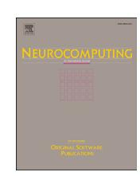

# Game-theoretic evaluation of strategic reasoning in large language models: From complete coverage to compositional complexity

Yu Guo[a](#page-0-0) , Haochuan Wang[a](#page-0-0) , Xiachong Feng [b,](#page-0-1)[∗](#page-0-2) [iD](https://orcid.org/0000-0002-4761-7484)

- a *Harbin Institute of Technology, Harbin, China*
- b *The University of Hong Kong, Pok Fu Lam Hong Kong, China*

## H I G H L I G H T S

- First benchmark covering all 144 canonical games from Robinson-Goforth topology for evaluating AI strategic reasoning.
- Synthetic data generation framework prevents contamination, ensuring reliable evaluation of AI decision-making.
- Hierarchical framework reveals catastrophic performance drops (60% to *<*20%) as complexity grows, exposing LLM limitations.

#### A R T I C L E I N F O

#### Communicated by H. Fei

*Keywords:* Large language model Game theory Strategic reasoning Synthetic data generation Theory-of-mind

## A B S T R A C T

Game-theoretic evaluation of strategic reasoning in large language models (LLMs) is crucial for advancing artificial intelligence systems, yet it faces fundamental challenges: incomplete game coverage, data contamination risks, and the inability to assess compositional reasoning complexity. We present TMGBench, a benchmark that progresses from complete coverage to compositional complexity through systematic design. For complete coverage, TMGBench incorporates all 144 canonical game types from the Robinson-Goforth topology, the first benchmark to achieve exhaustive game-theoretic representation, eliminating the sampling bias that undermines existing evaluations. Each game is instantiated through synthetically generated narrative scenarios, rigorously validated to ensure novelty and prevent data leakage. To address compositional complexity, we introduce a hierarchical framework where these atomic games are programmatically composed into sequential, parallel, and nested structures, creating scalable challenges that systematically probe reasoning depth from simple strategic decisions to complex multi-agent interactions. Our evaluation reveals critical limitations in LLM strategic reasoning across this complete-to-complex spectrum. Even state-of-the-art models fail at basic game-theoretic reasoning, exhibiting logical inconsistencies and superficial Theory-of-Mind understanding. Performance degrades catastrophically as compositional complexity increases: models achieving 60% accuracy on isolated games drop below 20% on compositional structures, exposing fundamental architectural limitations in current AI systems' ability to handle strategic dependencies. These results demonstrate that current LLMs lack the compositional reasoning capabilities required for genuine strategic thinking. TMGBench thus provides both comprehensive diagnostic coverage and a scalable complexity framework essential for advancing artificial intelligence toward human-level game-theoretic reasoning and strategic decision-making capabilities.

## **1 . Introduction**

The rapid advancement of large language models (LLMs) has reshaped the paradigm of artificial intelligence, achieving breakthroughs across various domains [\[1–4\]](#page-28-0). These achievements are largely attributed to LLMs' ability to assimilate vast amounts of knowledge during training, emerging with the capacity to organize information at a coarse level and link knowledge at a fine-grained level through their internal representations [\[5\]](#page-28-1). These core capabilities have driven the success of LLMs in numerous reasoning tasks, including mathematical reasoning [\[6\]](#page-28-2), commonsense reasoning [\[7\]](#page-28-3), logical reasoning [\[8\]](#page-28-4), and strategic reason

∗ Corresponding author. *Email address:* [fengxc@hku.hk](mailto:fengxc@hku.hk) (X. Feng).

ing [\[9,10\]](#page-28-5). Among these, strategic reasoning has attracted considerable attention due to its multi-agent nature and close association with social intelligence [\[11,12\]](#page-28-6).

Strategic reasoning refers to the cognitive process of anticipating, planning, and responding to others' actions to achieve specific objectives within competitive or cooperative contexts [\[13\]](#page-28-7). Consequently, game scenarios that naturally involve both cooperation and competition, have intuitively become a fertile ground for studying LLMs' strategic reasoning abilities [\[14\]](#page-28-8). In particular, researchers have engaged LLMs in game-playing, analyzing their decision-making behaviors and evaluating their strategic intelligence in such scenarios [\[10\]](#page-28-9). The Prisoner's Dilemma, as one of the most classic game theory scenarios, has been extensively studied in this context [\[15\]](#page-28-10). Additionally, other traditional games such as the Battle of the Sexes [\[16\]](#page-28-11), the Stag Hunt [\[17\]](#page-28-12), and the Dictator Game [\[18\]](#page-28-13) have also drawn significant attention. These studies provide initial insights into the strategic reasoning capabilities of LLMs [\[19–24\]](#page-28-14).

However, current research has three major limitations, hindering a comprehensive, robust, and sustainable evaluation of LLMs' strategic reasoning capabilities:(1) *Limited coverage of game types*: Most studies focus on a handful of classic games without considering the full diversity of game structures.(2) *Potential risk of game scenario leakage*: Classic game scenarios are likely to be present in the training corpus, raising concerns over data leakage.(3) *Poor extensibility of game forms*: Existing studies primarily focus on a narrow range of game forms, which may no longer suffice to challenge high-performing LLMs such as o3-mini from OpenAI.

To address the above issues, we introduce TMGBench, a benchmark that encompasses a comprehensive range of game types, features synthesized game scenarios, and supports scalable and reorganizable game forms. Specifically, *to address the first issue*, we include all 144 game types defined by the Robinson-Goforth topology of 2x2 games [\[25\]](#page-28-15). This topology encompasses a variety of game structures based on different numerical payoff matrices, including but not limited to classic games like the Prisoner's Dilemma[\(Section 3.2\)](#page-3-0). *To address the second issue*, we employ synthetic data generation techniques to create five different story-based games for each classic game. In essence, a story-based game is a contextual framing counterpart of its corresponding classic game, sharing the same structure but differing in context [\[9\]](#page-28-5). To ensure highquality data synthesis, we introduce two additional steps: topic control and human inspection. We first define a set of topics commonly associated with cooperation and competition, such as business and law, to guide the data generation process. Then, to ensure that the synthesized games meet the required game structures and are easily understandable, we conduct rigorous human inspection [\(Section 3.3\)](#page-4-0). *To address the third issue*, we propose three forms for expanding and organizing games: sequential, parallel, and nested. Using the above constructed games as atomic units, we reorganize them into these complex forms to assess the strategic reasoning of LLMs. The sequential and parallel forms evaluate the model's capacity for sequential and parallel decision-making, respectively, while the nested form explores the LLMs' multi-layered strategic reasoning abilities [\(Section 3.4\)](#page-4-1).

Based on TMGBench, [1](#page-1-0) we conduct comprehensive analyses and evaluations of current mainstream LLMs [\(Section 4\)](#page-5-0), focusing on four core aspects essential for strategic reasoning: (1) *rational reasoning*, the ability to identify optimal strategies through payoff analysis, which forms the foundation of game-theoretic decision-making; (2) *reasoning robustness*, the capacity to maintain consistent strategic choices across different contextual framings of equivalent games [\[9\]](#page-28-5); (3) *Theory-of-Mind (ToM) capabilities*, the ability to model opponents' mental states and anticipate their strategies, which is fundamental for higher-order strategic reasoning [\[21,26,27\]](#page-28-16); and (4) *complex game reasoning*, the capacity to handle compositional strategic scenarios. We further validate TMGBench through human evaluation studies that establish performance baselines and confirm task quality through systematic comprehension assessment. Our evaluation leads to the following key findings:

- Advanced LLMs (o3-mini, Qwen3, deepseek-reasoner) achieve over 90% accuracy on atomic games, but most models struggle below 60%, revealing that strategic reasoning requires specific capabilities beyond general language understanding.
- LLMs show up to 75% performance reduction on story-based games compared to equivalent classic forms, with high variance across narratives ( ≈ 0*.*5), indicating reliance on surface patterns rather than abstract game structure understanding.
- First-order ToM prompting benefits some models but not others; second-order ToM provides minimal additional gain, suggesting LLMs lack the recursive reasoning capacity for robust opponent modeling.
- GPT models exhibit systematic asymmetric patterns in 0-task games, with answers correlated to position rather than payoff structure, revealing heuristic-based shortcuts rather than genuine strategic analysis.
- Performance degrades catastrophically with compositional complexity: models drop from 60% on isolated games to below 20% on 10-game compositions, exposing fundamental architectural limitations.

### **2 . Preliminary**

#### *2.1 . Strategic reasoning*

Strategic reasoning [\[11,13\]](#page-28-6) is a unique and sophisticated form of reasoning that focuses on making optimal decisions in multi-agent environments. It involves carefully selecting strategies by *anticipating the actions of others* and *understanding how one's choices will influence their responses*. What sets strategic reasoning apart from other reasoning paradigms, such as commonsense reasoning, symbolic reasoning, and causal reasoning, is its *dynamic nature* and the *inherent uncertainty of adversarial or cooperative actions*. Unlike these paradigms, strategic reasoning demands a deep comprehension of ever-changing contexts and the ability to make rational, forward-thinking decisions based on the anticipated behaviors of others. [Table 1](#page-1-1) summarizes these key distinctions.

Real-world applications such as online advertising auctions [\[28\]](#page-28-17), societal simulation, economic modeling, and gaming [\[13\]](#page-28-7) frequently require strategic reasoning, as agents must continuously adjust strategies based on others' behaviors. The significance of strategic reasoning for LLMs extends beyond static information retrieval. Equipping LLMs with these capabilities allows them to simulate realistic decision-making, navigate dynamic social or economic systems, and collaborate or compete with other agents, which is crucial for applications such as policy design, automated negotiations, and multi-agent simulations.

**Table 1** Characteristics distinguishing strategic reasoning from other reasoning paradigms.

| Characteristic          | Strategic Reasoning                                  | Other Paradigms                                                                  |
|-------------------------|------------------------------------------------------|----------------------------------------------------------------------------------|
| Nature Key Challenge | Dynamic, multi-agent Anticipating others' actions | Typically static, single-agent Understanding patterns, rules, or causality |
| Uncertainty Source      | Adversarial/cooperative actions                   | Environmental or factual uncertainty                                          |
| Decision Basis          | Anticipated behaviors of others                   | Known facts, rules, or prior knowledge                                        |

1 Our codes and benchmark are available at [https://www.kaggle.com/](https://www.kaggle.com/datasets/pinkex/tmgbench/) [datasets/pinkex/tmgbench/](https://www.kaggle.com/datasets/pinkex/tmgbench/)

**Table 2**Game-theoretic approaches to evaluating LLM strategic reasoning.

| Reference         | Game Types                       | Strategic Reasoning Aspect                                                  |
|-------------------|----------------------------------|-----------------------------------------------------------------------------|
| Akata et al. [21] | Repeated 2×2 games               | Cooperative strategy formation and coordination equilibrium selection |
| Brookins and      | Prisoner's Dilemma,              | Strategic cooperation and fairness-                                         |
| DeBacker [14]     | Dictator                         | driven decision-making                                                      |
| Lorè and          | PD, Stag Hunt,                   | Abstract strategic reasoning under                                          |
| Heydar [9]        | Snowdrift                        | varied contextual framing                                                   |
| Herr et al. [15]  | Stag Hunt, Prisoner's Dilemma | Rational strategy selection under positional and payoff variations          |
| Duan et al. [10]  | 10 game-theoretic                | Strategic reasoning under                                                   |
|                   | tasks                            | complete and incomplete information                                         |
| TMGBENCH          | All 144 2×2 game                 | Comprehensive coverage of all                                               |
| (Ours)            | types                            | strategic interaction structures                                            |

#### 2.2. Strategic reasoning and game theory

Game theory provides the foundational mathematical framework for studying strategic reasoning, which is the process of choosing optimal actions while anticipating the rational responses of other agents [29]. Strategic reasoning is inherently game-theoretic: it requires understanding payoff structures, modeling opponent behavior, and computing equilibrium strategies, capabilities that distinguish it from general language understanding. This theoretical grounding has led recent research to adopt game-theoretic tasks as the standard methodology for evaluating LLM strategic capabilities, as summarized in Table 2.

#### 2.3. Strategic reasoning and theory of mind

Theory of Mind (ToM) is the cognitive ability to attribute mental states (beliefs, intentions, desires) to oneself and others [30]. In strategic reasoning, ToM is essential because anticipating opponents' actions requires understanding their mental states. This recursive modeling distinguishes strategic reasoning from purely computational optimization.

Effective strategic reasoning demands multiple levels of ToM [26]. First-order ToM involves modeling what an opponent will do based on their payoffs. Second-order ToM extends this to consider what the opponent believes you will do. This recursive reasoning is precisely what Nash equilibrium computation requires: each player reasons about the other's best response, which depends on beliefs about one's own strategy.

Recent research explores whether machine ToM exists in LLMs. [27] showed that ToM planning helps LLM agents adapt strategies against adversaries in imperfect information games. [21] found that LLMs perform well in self-interested games but struggle with coordination, and that modeling opponent perspectives improves performance. These findings suggest LLMs may exhibit ToM-like capabilities, but these abilities remain task-dependent and are not yet robust [31].

Given ToM's central role, evaluating whether LLMs possess genuine ToM capabilities is essential. TMGBENCH provides an ideal testbed: its  $2\times2$  games require explicit opponent modeling, and 144 game types ensure comprehensive testing across diverse strategic structures. Through first-order ToM (FoToM) and second-order ToM (SoToM) prompting, we systematically assess whether LLMs engage in genuine recursive opponent modeling or rely on shallow heuristics.

#### 2.4. Benchmark design principles

A comprehensive benchmark for strategic reasoning must systematically cover three fundamental dimensions: (1) *Problem Cardinality*, evaluating both single-game and multi-game reasoning; (2) *Task Dependencies*, ranging from independent games to sequential ordering to interdependent decision-making; and (3) *Representation Modality*, spanning formal payoff matrices to narrative-embedded scenarios. TMGBENCH achieves comprehensive coverage by designing five task

**Table 3**The form of a typical 2×2 matrix game.

| Player A | Player B               |                        |
|----------|------------------------|------------------------|
|          | $B_1$                  | $B_2$                  |
| $A_1$    | $(u_A^{11}, u_B^{11})$ | $(u_A^{12}, u_B^{12})$ |
| $A_2$    | $(u_A^{21}, u_B^{21})$ | $(u_A^{22}, u_B^{22})$ |

types that span all combinations: Atomic (Classic) tests single-game formal reasoning, Atomic (Story) tests single-game narrative comprehension, Sequential tests ordered multi-game reasoning, Parallel tests simultaneous independent reasoning, and Nested tests interdependent multi-game reasoning with forward-looking strategy. Combined with the Robinson-Goforth topology's exhaustive coverage of 144 game types, this design ensures TMGBENCH provides a complete evaluation framework for LLM strategic reasoning. While existing work focuses on only a handful of classic games (e.g., Prisoner's Dilemma, Stag Hunt), TMGBENCH provides the first systematic coverage of all 144 2×2 game types, ensuring comprehensive strategic reasoning evaluation within this well-established paradigm.

## 2.5. Task formalization

We first formalize the task definition by specifying the game representation, evaluation criteria, and task categories used in TMGBENCH.

**Preliminary Definitions.** A  $2\times 2$  normal-form game  $\mathcal{G}=(\mathcal{P},\mathcal{S},u)$  consists of two players  $\mathcal{P}=\{A,B\}$ , strategy sets  $\mathcal{S}_A=\{A_1,A_2\}$  and  $\mathcal{S}_B=\{B_1,B_2\}$ , and payoff functions  $u_A,u_B:\mathcal{S}_A\times\mathcal{S}_B\to\mathbb{R}$ . The payoff structure is represented as a matrix (Table 3), where each cell (i,j) contains the payoff pair  $(u_A(A_i,B_j),u_B(A_i,B_j))$  for the corresponding strategy combination.

**Nash Equilibrium.** A *Nash Equilibrium* (NE) is a strategy profile  $(s_A^*, s_B^*) \in S_A \times S_B$  where no player can unilaterally improve their payoff:

$$u_A(s_A^*, s_B^*) \ge u_A(s_A, s_B^*), \quad \forall s_A \in \mathcal{S}_A \tag{1}$$

$$u_B(s_A^*, s_B^*) \ge u_B(s_A^*, s_B), \quad \forall s_B \in S_B$$
 (2)

The set of all Nash equilibria of the game  $\mathcal G$  is denoted  $\mathrm{NE}(\mathcal G) \subseteq \mathcal S_A \times \mathcal S_B$ . In TMGBENCH, finding  $\mathrm{NE}(\mathcal G)$  serves as the evaluation criterion: given a game description, the LLM must identify all Nash equilibria.

**Task Types.** TMGBENCH organizes evaluation tasks into five types with increasing complexity (Table 4). Each task type is formally defined with explicit input specifications, output requirements, and constraints that govern the evaluation process.

#### 2.6. Notation

Table 5 summarizes the key notation used throughout this paper. The notation is organized into four categories: (1) game-theoretic concepts including game instances, player strategies, payoffs, and Nash equilibria; (2) prompting methods ranging from direct answering to Theory-of-Mind approaches; (3) evaluation metrics for measuring accuracy, inconsistency, and bias; and (4) task categories based on the number of Nash equilibria.

#### 3. TMGBENCH

### 3.1. Benchmark overview

TMGBENCH is a benchmark designed to evaluate the strategic reasoning capabilities of LLMs in game-theoretic scenarios, illustrated by Fig. 1. It comprehensively covers 144 types of games (see Section 3.2), with each type containing multiple instances (in each instance, there are two players and each player can choose between two strategies, resulting in four possible situations), which can be categorized into

**Table 4**Task type categorization in TMGBENCH with formal definitions and constraints.

| Task Type        | Formal Definition                                                                                                           | Input                                                                           | Output                                           | Constraints & Success Criterion                                                                          |
|------------------|-----------------------------------------------------------------------------------------------------------------------------|---------------------------------------------------------------------------------|--------------------------------------------------|----------------------------------------------------------------------------------------------------------|
| Atomic (Classic) | Single game reasoning on an explicit payoff matrix; the LLM directly applies Nash equilibrium calculation             | Payoff matrix $M \in \mathbb{R}^{2 \times 2 \times 2}$                          | $S\subseteq S_A\times S_B$                       | Direct matrix parsing required; Success: $S = NE(G)$                                                     |
| Atomic (Story)   | Single game reasoning requiring semantic extraction; the LLM must first comprehend the narrative to identify game structure | Narrative text $T$ encoding game $G$                                            | $S \subseteq \mathcal{S}_A \times \mathcal{S}_B$ | Extract $G$ from $T$ before reasoning; Success: $S = NE(G)$                                           |
| Sequential       | Ordered multi game reasoning with tem- poral constraints; games must be solved in the given sequence                  | Ordered tuple $(G_1, \dots, G_n)$                                               | $(S_1,\ldots,S_n)$                               | Process games in order; no backtracking; Success: $\forall i: S_i = NE(G_i)$                             |
| Parallel         | Simultaneous multi game reasoning; all games are presented at once and must be solved together                              | Unordered set $\{G_1, \dots, G_n\}$                                             | $\{S_1,\ldots,S_n\}$                             | All games given simultaneously; Success: $\forall i: S_i = NE(G_i)$                                      |
| Nested           | Two level game with inter game depen- dency; pre game decisions constrain core game strategy space                    | Pre game $\mathcal{G}_p$ , core game $\mathcal{G}_C$ , restriction function $R$ | $(S_P,S_C)$                                      | $R(S_p)$ restricts strategy space in $\mathcal{G}_C$ ; Success: Forward looking NE across both levels |

Table 5
Notation summary.

| Symbol                        | Definition                                                    |
|-------------------------------|---------------------------------------------------------------|
| Game Theory                   |                                                               |
| G = (P, S, u)                 | Game instance (players, strategies, payoffs)                  |
| $P, S_A, S_B$                 | Players and their strategy sets                               |
| $u_A^{ij}, u_B^{ij}$          | Payoffs when A plays $A_i$ , B plays $B_i$                    |
| S, $NE(G)$                    | Predicted strategy set; Nash equilibrium set                  |
| $\mathcal{G}_P,\mathcal{G}_C$ | Pre-game and core-game (nested form)                          |
| Prompting Methods             |                                                               |
| DA, CoT                       | Direct Answer; Chain-of-Thought                               |
| FoToM, SoToM                  | First/Second-order Theory-of-Mind                             |
| Evaluation Metrics            |                                                               |
| PAR, ID, BD, SD               | Perfect Accuracy Rate; Inconsistency/Bias/Significance Degree |
| $\text{Freq}_{i,j,o}$         | Frequency of outcome $o$ at grid $(i, j)$                     |
| Task Categories               |                                                               |
| n-task                        | Task with $n$ Nash equilibria $(n \in \{0, 1, 2\})$           |

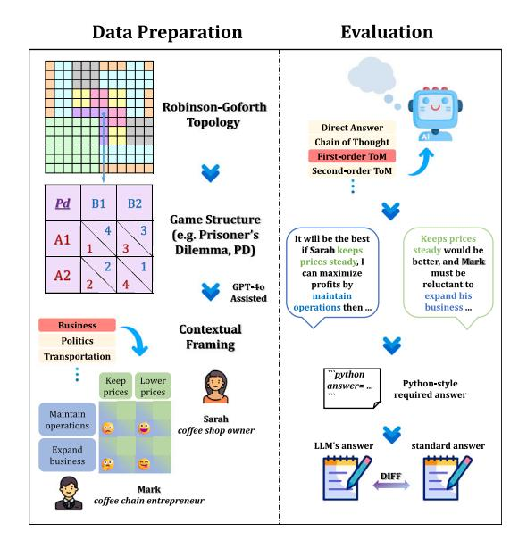

**Fig. 1.** Conceptual overview of TMGBENCH with three key components: Robinson-Goforth topology, game structure, and contextual framing.

classic and story-based settings. Notably, the story-based instances are produced using synthetic data generation techniques and are grounded in real-life themes, effectively mitigating the issue of data leakage (see Section 3.3). Furthermore, each game in TMGBENCH can be treated as an atomic unit, and multiple atomic games can be structured into a more complex task with parallel, sequential, or nested forms (see Section 3.4). These complex scenarios effectively facilitate the evaluation of advanced LLMs' abilities in parallel, sequential, and multi-layered decision-making. To precisely evaluate the reasoning abilities of LLMs, we use their performance in inferring the optimal strategy combination, i.e., the *Nash equilibrium*, as the evaluation criterion. Additionally, the designed evaluation metrics provide a fine-grained assessment of the robustness and self-consistency of LLMs' strategic reasoning abilities (see Section 3.5).

### 3.2. Game topology

Although previous research has explored the reasoning abilities of LLMs within game theory, existing studies have primarily focused on a few well-known games, such as the Prisoner's Dilemma and Stag Hunt [14,20,32]. This narrow focus results in incomplete evaluations and highlights the urgent need for a broader variety of games to conduct a systematic assessment.

To address this gap, we first establish the fundamental unit of our analysis: the  $2\times2$  normal-form game. As formalized in Section 2.5, a  $2\times2$  game  $\mathcal{G}$  involves two players choosing between two strategies, with payoffs specified in a matrix (Table 3).

While a single game matrix defines one interaction, a systematic evaluation requires covering all possible strategic structures. For this, we adopt the Robinson-Goforth topology of 2×2 games, which classifies all 144 distinct strategic scenarios [25]. This framework is organized as a 12×12 grid, where well-known symmetric games are situated on the counter-diagonal (including famous games shown in Fig. A.11(a) in Appendix A), and asymmetric games are paired with a "sister game" across the diagonal (see Fig. A.11 in Appendix A for the complete topology visualization with a detailed grid structure in Fig. A.11(b)).

The topology's true power for evaluation lies in its distribution of solutions. The 144 games are categorized into three distinct groups based on their number of Nash equilibria, stable outcomes where neither player has an incentive to unilaterally change their strategy. There are 108 games with a single Nash equilibrium (where at least one player has a dominant strategy), 18 with two, and 18 with none (where at least one player always has an incentive to deviate). This distribution of solution types is symmetric across the counter-diagonal, presenting a diverse and challenging landscape for testing LLM reasoning (see Fig. A.12 in Appendix A for a visual representation of this distribution). We categorize all 144 games, using the numerical payoffs from the original topology, as the *classic game setting* for our benchmark.

### *3.3 . Contextual framing*

Relying on the Robinson-Goforth topology, we can systematically construct all types of classic setting tasks. However, this alone is insufficient, as games often take place in diverse real-life contexts, involving different topics, types of participants and their preferences. Such contextual framing of games introduces new challenges for LLMs [\[9\]](#page-28-5).

To further explore LLMs' strategic reasoning capabilities in realworld scenarios, we use classic games as seed data and employ synthetic data generation techniques, leveraging GPT-4o to construct story-based games. Specifically, in story-based games, we replace the pure game information of classic games with real-life scenarios, covering topics such as business, law and transportation. Additionally, the two players are substituted with characters representing broader semantics (e.g., people, animals, organizations, and even nations), and the payoff values are transformed from pure numbers into specific states or rewards relevant to the characters. For each classic game, we generate 5 corresponding story-based games. To ensure the generation of a high-quality and diverse dataset, the pipeline is organized into three carefully designed stages:

**Classic Game Construction.** Our process begins by converting the 144 abstract payoff matrices from the topology into classic games. Through context engineering [\[33\]](#page-28-23), we craft a specific description for each game type. The example below, for instance, mirrors the structure of the Prisoner's Dilemma. These 144 classic games provide the structural blueprint for the next stage: generating a wider variety of rich, story-based games.

An example of a classic game with a 2×2 payoff matrix structure similar to the Prisoner's Dilemma is provided in [Appendix B.1.](#page-14-0)

**Story-based Game Generation.** While classic games provide robust mathematical formalisms, real-world strategic interactions are seldom context-free; they are deeply embedded in rich social narratives. To bridge this gap between abstract theory and applied reasoning, we developed story-based games designed to simulate this complexity with narrative depth and situational details.

To generate these scenarios systematically, we employed a synthetic data generation pipeline guided by meticulously crafted prompts. These prompts imposed specific structural constraints to ensure each narrative accurately reflected its underlying game-theoretic structure. To ground these narratives in plausible contexts, we curated a set of 20 diverse thematic categories drawn from real-world situations, such as business negotiations or family disputes. Following this procedure, we generated 5 unique story-based counterparts for each of the 144 classic games. The prompt structure governing this synthesis, with variable placeholders indicated in red, is detailed below.

The detailed prompt template used for generating story-based games with GPT-4o is provided in [Appendix B.2.](#page-15-0) This prompt imposes specific structural constraints to ensure each narrative accurately reflects its underlying game-theoretic structure while grounding it in one of 20 diverse thematic categories.

The resulting story-based games are designed to be more than just reskinned matrices; they are complex, narrative-rich scenarios that better reflect the ambiguity and contextual nature of real-world strategic decisions. This narrative layer introduces a significant challenge, as models must first parse and comprehend the story to extract the underlying game structure, a task that is fundamentally more demanding than solving a pre-defined matrix. The example below illustrates this leap in complexity and realism, serving as a narrative counterpart to the classic Prisoner's Dilemma game.

An example of a generated story-based game featuring Sarah's coffee shop versus Mark's coffee chain, which follows the same game structure as the Prisoner's Dilemma, is provided in [Appendix B.3.](#page-16-0) This example illustrates the leap in complexity and realism from abstract payoff matrices to narrative-rich scenarios.

**Quality Verification.** To guarantee the coherence and internal consistency of each narrative, we employ a rigorous two-stage human validation process. In the first stage, GPT-4o generates a draft scenario, which is then subjected to meticulous human review to identify any logical flaws. If a draft fails this inspection, it enters an iterative refinement cycle where GPT-4o is prompted to self-diagnose and correct the problematic sections. This process continues until the narrative meets our stringent quality standards; scenarios that repeatedly fail are discarded entirely to maintain the integrity of the dataset. In the second stage, we conducted a formal comprehension validation study to ensure the finalized scenarios are understandable and preserve gametheoretic structure. Three expert annotators (graduate students with a game theory background) evaluated all 144 story-based scenarios across five criteria: narrative clarity, role clarity, option clarity, payoff clarity, and structure preservation, each on a 1–5 Likert scale. Results demonstrate high overall quality (mean = 4.34/5.0, SD = 0.62) with substantial inter-annotator agreement (Fleiss' = 0.78). Role clarity scored highest (4.52), confirming that player identities are well-defined, and structure preservation scored 4.43, indicating accurate representation of game-theoretic relationships. Importantly, 98.6% of scenarios (142/144) received overall ratings ≥4.25, confirming consistent quality across the benchmark.

**Benchmark Diversity.** A key feature of our story-based tasks is their designed diversity in both thematic context and narrative length. To ensure contextual richness, we established 20 distinct topics from everyday life, such as Business, Ecology, and Politics. The distribution of these topics is intentionally varied, with Business (11.1%) as the most prominent category and the remainder spread evenly to ensure broad coverage. In parallel, we controlled for narrative length, with most scenarios ranging from 200 to 450 words and over 90% concentrated between 250 and 400 words. This systematic variation in both what the stories are about and how long they are creates a robust and comprehensive testbed for evaluating LLM reasoning (see [Fig. A.13](#page-14-1) in [Appendix A,](#page-13-1) which shows the topic distribution in [Fig. A.13\(](#page-14-1)a) and narrative length patterns in [Fig. A.13\(](#page-14-1)b)).

### *3.4 . Complex forms*

The 2×2 games in the topology represent a highly condensed game structure. However, in real life, we often encounter more complex game forms, such as making continuous decisions, making multiple decisions simultaneously, or considering the impact of one decision on another.

To evaluate LLMs' strategic reasoning abilities with more constraints, we treat the aforementioned individual games as atomic games and expand them in three forms: sequential, parallel, and nested. The organization of these forms is illustrated in [Fig. 2.](#page-5-2) Specifically, in the *sequential form*, we randomly sample multiple games from the story-based games, requiring the LLM to make decisions sequentially. Only if the LLM provides correct answers for all games is it considered to have made correct decisions. In the *parallel form*, the LLM is given multiple randomly sampled games and must make decisions simultaneously. Similarly, the LLM is deemed to have made correct decisions only if it solves all games correctly. In the *nested form*, we randomly sample two games, designated as the pre-game and the core-game, where the core-game holds greater importance. The decisions made by the LLM in the pre-game affect the strategy space in the core-game. Thus, the LLM is judged to have made correct decisions only if it demonstrates forward-looking reasoning by choosing a sub-optimal solution in the pre-game to achieve the optimal solution in the core-game. This design mirrors *extensive-form games* [\[34\]](#page-28-24) where sequential decisions create outcome-contingent strategy constraints. The restriction rule is explicitly stated in the prompt as a conditional constraint, ensuring logical consistency with standard gametheoretic multi-stage dynamics. We demonstrate a template to generate a nested form game in [Appendix B.4.](#page-18-0)

After a nested form game is generated through our template, we still need to check if the Nash equilibria of the pre-game change after the restriction from the core game. If the set of Nash equilibria does change,

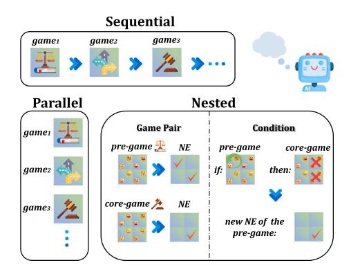

Fig. 2. Three complex game forms in TMGBENCH: sequential (games in sequence), parallel (simultaneous games), and nested (linked pre-game and core-game).

then we use this as a piece of data to evaluate LLMs, observing whether they can detect such a violation of the original NEs' structure.

Theoretically, using these atomic games, we can expand the framework to generate infinitely many increasingly complex game forms, thereby providing a continuous benchmark for evaluating the performance of more advanced LLMs. Fig. 3 illustrates how we build sequential, parallel, and nested games from atomic games.

#### 3.5. Evaluation metrics

As explained in Section 3.2, our benchmark is perfectly suitable for display in a 12x12 square table, with each grid representing one of the 144 equivalence classes. In the evaluation process we conduct *repetitive* tests at every data point of each equivalence class. Each test starts with the input of the setting (classic/story-based) and the question, and ends with the LLM's response containing a list of choices corresponding to multiple choices or no choice (when the given list is empty).

 ${\bf Evaluation\ Process.\ Algorithm\ 1\ formalizes\ our\ evaluation\ procedure\ for\ assessing\ LLM\ strategic\ reasoning\ capabilities.}$ 

**Inconsistency Heat Map.** According to the conclusions of the Robinson-Goforth topology [25], we convert the standard answer of each equivalence class into a heat map named the *standard heat map*, with the colored quarter-grid being the choice in the standard answer. Similarly, as for the practical result provided by LLMs, we set the value of  $\operatorname{Freq}_{i,j,o}$  as the color depth of each quarter grid, which builds up the *practical heat map*. Naturally, we subtract the standard heat map from the practical heat map in an element-wise manner to get the *inconsistency heat map*, which is a standardised tool for our evaluation as shown in Fig. 4.

**Inconsistency Degree.** In order to display the quantified performance of LLMs, we extract the inconsistency degree from a map, which helps reveal the gap between LLMs' responses and the standard answer, and it is defined as:  $ID = \frac{1}{144} \sum_{i=1}^{12} \sum_{j=1}^{12} \frac{1}{4} \sum_{o=1}^{4} \Delta \operatorname{Freq}_{i,j,o}^{2}$ , where  $\Delta \operatorname{Freq}_{i,j,o}$  indicates the difference (between the LLM's answer and the standard answer) in the frequency of the o-th choice at the i-th row, j-th column.

**Bias Degree.** Owing to the symmetric property of the topology framework of  $2\times 2$  matrix games, the distribution of answers over the heat map has axial symmetry along the counter-diagonal as shown in Fig. 5. Motivated by this elegant property, we set up another metric to evaluate the bias degree of LLMs' answers, as we expect more robust LLMs to display lower degrees of bias. The bias degree reflects the stability and symmetry of LLMs' strategy, and it is defined as: BD =  $\frac{1}{144}\sum_{i=1}^{12}\sum_{j=1}^{12}\frac{1}{4}\sum_{o=1}^{4} (\text{Freq}_{i,j,o} - \text{Freq}_{j,i,\text{ref}_o})^2$ , where the meaning of  $\text{ref}_o$  is the index of choice o's counterpart considering the reflection operation along the counter-diagonal, and we have the mapping relation:  $\{1,2,3,4\} \mapsto \{4,2,3,1\}$ . (e.g.,  $\text{ref}_1 = 4$  means that the reflection counterpart of choice 1 is choice 4, and vice versa)

Perfect Accuracy Rate. In addition to the metrics mentioned above. we also set up a more rigorous metric named perfect accuracy rate, which ignores the partially correct answers and only considers perfectly correct answers in each test, and it is defined as: PAR =  $\frac{1}{144} \sum_{i=1}^{12} \sum_{j=1}^{12} \frac{1}{T} \sum_{t=1}^{T} \mathbb{I}\{ \text{rsp}_{t,i,j} = \text{std}_{i,j} \}, \text{ which means that we count only}$  $\overline{_{144}} \angle_{i=1} \angle_{j=1} \underline{_{T}} \angle_{t=1} \underline{_{T}} \underline{_{L_{13}}} - \underline{_{SC_{13}}},$  if the response perfectly matches the standard answer, where T represents the number of times we invoke a LLM to respond to a certain game task. Notably, the 144 game types in our topology exhibit varying equilibrium structures: 108 games have exactly one Nash equilibrium, 18 games have two Nash equilibria, and 18 games have no pure-strategy Nash equilibrium. For no-NE games (18 games), the standard answer is an empty set  $(NE(G) = \emptyset)$ ; the model must correctly identify that no purestrategy equilibrium exists. For multiple-NE games (18 games), the model must identify the complete set of all equilibria. Identifying only one valid NE is insufficient. The PAR criterion requires exact set equality: the predicted set S must match NE(G) precisely, neither missing any equilibrium nor including spurious ones. This strict criterion ensures that high PAR scores reflect genuine game-theoretic understanding rather than partial pattern matching.

**Metrics with Subscript.** As a matter of fact, within the topology, different equivalence classes have different numbers of Nash equilibria (ranging from  $\{0,1,2\}$ ), leading to a discrepancy in reasoning difficulty, we propose metrics with subscripts that represent different types of equivalence groups (we refer to them to 0-task, 1-task, and 2-task respectively), which we refer as as sub-metrics. Therefore we have  $\mathrm{ID}_n, \mathrm{BD}_n, \mathrm{PAR}_n (n=0,1,2)$  which mean the inconsistency degree, the bias degree, and the perfect accuracy rate across all equivalence classes that have n equilibria.

Detailed worked examples demonstrating step-by-step calculations for all evaluation metrics, including Inconsistency Degree (ID), Bias Degree (BD) and Perfect Accuracy Rate (PAR) are provided in Appendix E.

## 4. Analysis

#### 4.1. Overview of LLMs' performance

Overall, we select several SOTA models according to the Open LLM Leaderboard [35] and conduct extensive experiments on TMGBENCH. These models include GPT (o3-mini, gpt-40, gpt-40-mini, gpt-3.5-turbo), Claude (claude-3-5-sonnet, claude-3-haiku), Llama (Llama-3.1-8B, Llama-3.1-70B), Gemma (gemma-3-27b-it), Qwen (Qwen3-32B, Qwen2-72B) and Deepseek (deepseek-reasoner). We perform 4 independent tests on each data point, covering both the classic setting and the story-based setting (thus we conduct 2880 tests to evaluate a certain model). During the evaluation, we set the generation temperature to 0, ensuring the lowest degree of uncertainty and enhancing the faithfulness of the evaluation.

Games in TMGBENCH are not easy for most LLMs. We initially adopt two basic prompting methods: Direct Answer (DA) prompting and Chain-of-Thought (CoT, [36]) prompting, which represent shallower, faster thinking patterns and deeper, slower thinking patterns, respectively. All prompting methods used in our experiments are detailed in Appendix C. The Direct Answer (DA) prompting method is detailed in Appendix C.1. The Chain-of-Thought (CoT) prompting method is detailed in Appendix C.2. All prompting methods require structured Python-style output for automated evaluation; a sensitivity analysis confirming that this format does not interfere with reasoning is provided in Appendix G.

As seen from Table 6, o3-mini, Qwen3-32B, and deepseek-reasoner are more capable compared to other models, with a high overall accuracy rate (over 90%) and low inconsistency and low bias scores (around 1%). Specifically, as shown in Fig. 6 formed by 9 sub-metrics, Qwen3-32B and deepseek-reasoner almost surpass any other models in every aspect. Moreover, comparing the performance of employing DA

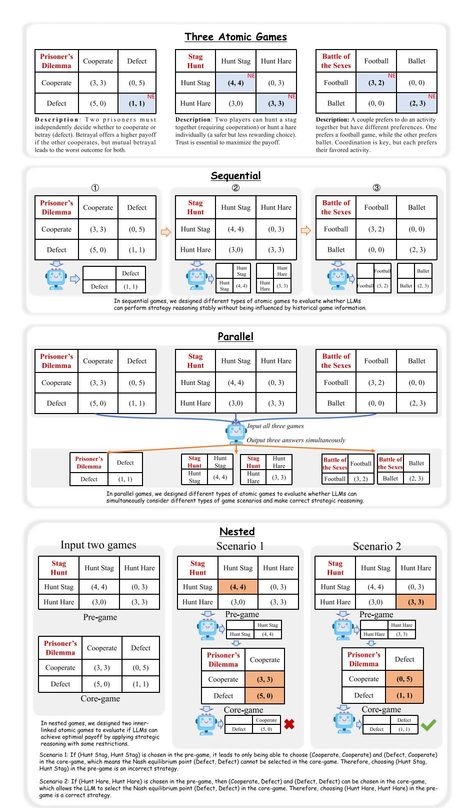

**Fig. 3.** An example of how we build sequential, parallel, and nested game from some of the atomic games in TMGBench.

prompting and CoT prompting, we find that CoT prompting almost provides comprehensive improvement. Despite the excellent performance of Qwen3-32B and deepseek-reasoner, other models often do not exhibit robust performance across all 3 different types of tasks. This indicates that even classic setting tasks from TMGBench are challenging for most LLMs.

The sharp capability gap (most models fall below 60% accuracy) reveals that strategic reasoning is not simply a byproduct of general

#### **Algorithm 1** TMGBench Evaluation Procedure.

**Require:** Game instance G, LLM M, Prompting method

**Ensure:** Correctness indicator, Predicted set , Ground truth NE(G)

- 1: prompt ← CONSTRUCTPROMPT(G*,*  )
- 2: response ← M(prompt)
- 3: ← PARSERESPONSE(response) {Extract strategy set  *⊆* S × S}
- 4: correct ← ( = NE(G)) {Check exact match}
- 5: **return** correct*, ,* NE(G)

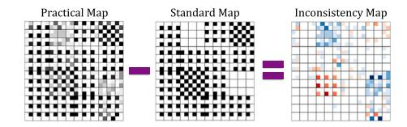

**Fig. 4.** Inconsistency heat map showing differences between LLM responses and standard answers. Blue indicates positive difference, red indicates negative difference.

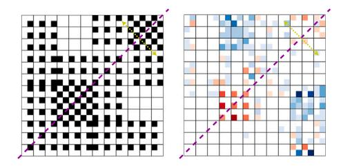

**Fig. 5.** Axisymmetry comparison: standard heat map (left) shows perfect counter-diagonal symmetry, while LLM responses (right) exhibit quasiaxisymmetry with position-specific discrepancies.

language ability. The models that succeed share explicit reasoning architectures designed for multi-step logical analysis, suggesting that strategic reasoning demands specific computational capabilities beyond standard natural language tasks.

**LLMs' performance is vulnerable across various narratives.** At the theoretical level, we consider classic setting tasks and story-based tasks to be fundamentally the same problems within the domain of game theory. However, this conclusion does not appear to be transferable to LLMs at the practical level. For LLMs, the complexity and nuance of story-based tasks introduce unique challenges, where LLMs are required to be robust in understanding and reasoning concurrently.

In [Fig. 7,](#page-9-0) we compare the performance of LLMs using CoT prompting, which is more robust according to previous analysis. The figure reveals the vulnerable performance of LLMs on tasks in a story-based setting (corresponding to various narratives), marked by two primary characteristics: (1) Some models like o3-mini, gpt-4o, claude-3-5 sonnet and gemma-3-7b-it, exhibit significant performance degradation. Notably, o3-mini, gpt-4o and gemma-3-7b-it demonstrate a broad underperformance, while claude-3-5-sonnet shows the largest drop in 0-task, with its -PAR0 metric reduced to less than one-fourth of -PAR0 , and its -ID0 metric exceeding four times that of -ID0 . (2) The performance of certain localities exhibits significant fluctuations. A particularly notable degradation occurs in the PAR scores for 0-task and 2-task scenarios handled by claude-3-5-sonnet, where the coefficients of variation (defined as = , with representing the standard deviation and the mean) approach 0.5. These eminent values of suggest a lack of robustness in performance across different narratives.

This sensitivity to surface presentation while game structure remains constant indicates that LLMs do not learn abstract representations of game-theoretic relationships. Instead, they appear to rely on pattern matching with familiar scenarios from training data. When narrative framing changes, these learned associations break down, revealing the absence of genuine structural understanding.

**Human Performance Baseline.** To contextualize LLM performance and validate task difficulty, we conducted a human baseline study. Five graduate students with a game theory background (economics, computer science, mathematics) completed 72 tasks: 36 classic and 36 matched story-based scenarios (12 each from 0-task, 1-task, 2-task categories), yielding 180 responses per setting. Human participants achieved 86.7% accuracy on classic tasks (156/180 correct) and 82.2% on story-based tasks (148/180 correct), a modest 5.2% relative reduction [\(Table 7\)](#page-9-1). This contrasts sharply with LLMs: average models dropped from 60.7% to 46.5% (23.4% relative reduction), while even top models dropped from 94.5% to 78.7% (16.7% reduction). The consistency of human performance across representations validates two key points: (1) story-based tasks preserve the underlying game structure, as humans can still solve them effectively; and (2) the larger LLM performance drop reflects genuine limitations in handling narrative-embedded strategic reasoning, not task design artifacts. Notably, humans required significantly more time for story-based tasks (73s vs. 42s per task), indicating additional cognitive load from narrative comprehension, yet maintained accuracy, a capability current LLMs lack.

## *4.2 . Findings of LLMs' behaviors*

**LLMs demonstrate first/second-order ToM abilities.** In all equivalence classes of tasks, 1-tasks have the lowest reasoning difficulty since at least one player has a dominant strategy, which means the player can make an unconditionally optimal decision regardless of the counterpart's choice. In such cases, once a player (denoted as A) can make an unconditionally optimal decision, their counterpart (B) can, using first-order Theory-of-Mind (ToM), easily determine the best response for themselves (B).

This insight motivated us to apply FoToM prompting to LLMs, representing the **F**irst-**o**rder **T**heory-**o**f-**M**ind thinking, to aid in solving these tasks. As seen in [Table 8,](#page-10-0) gpt-4o shows improvement in both 0-tasks and 1-tasks when utilizing FoToM. Model claude-3-5-sonnet improves on 1-tasks and 2-tasks, and gpt-4o-mini displays a significant surge in performance on 1-tasks and so does Llama-3.1-70B on 2-tasks. However, no LLM achieves overall improvement across all task categories by merely using first-order ToM, and 0-tasks appear to be the most challenging for LLMs to solve. The First-order Theory-of-Mind (FoToM) prompting method is detailed in [Appendix C.3.](#page-19-1)

Furthermore, we wondered if LLMs that display some ability to use first-order ToM could also be capable of second-order ToM. According to [\[37\]](#page-28-27), higher-order ToMs are generally more difficult to master than first-order ToM. Thus we selected only advanced models that demonstrated proficiency in first-order ToM to attempt solving specific tasks using **S**econd-**o**rder **T**heory-**o**f-**M**ind (SoToM) prompting. As seen in [Table 8,](#page-10-0) gpt-4o, gpt-4o-mini and claude-3-5-sonnet show consistent performance when applying second-order ToM to tasks they

**Table 6** Overall statistics of LLMs' performance on classic setting tasks. The up  $\operatorname{arrow}(\uparrow)$  means the a larger value indicates better performance, while that down  $\operatorname{arrow}(\downarrow)$  means that a smaller value indicates better performance. All values are expressed as percentages.

|                      |                                           | Metric / Prompting |                        |       |                           |       |       |  |  |
|----------------------|-------------------------------------------|--------------------|------------------------|-------|---------------------------|-------|-------|--|--|
| Family               | Model                                     | PAI                | $\mathrm{R}(\uparrow)$ | ID    | $\mathrm{ID}(\downarrow)$ |       | )(\b) |  |  |
|                      |                                           | DA                 | CoT                    | DA    | CoT                       | DA    | CoT   |  |  |
|                      | o3-mini                                   | 93.40              | 93.23                  | 1.91  | 2.17                      | 3.82  | 4.34  |  |  |
| CDT                  | gpt-4o                                    | 52.08              | 80.38                  | 16.81 | 3.78                      | 28.49 | 7.79  |  |  |
| $\operatorname{GPT}$ | ${\rm gpt-4o-mini}$                       | 14.93              | 74.02                  | 27.15 | 4.38                      | 48.59 | 8.29  |  |  |
|                      | ${\rm gpt}\text{-}3.5\text{-}{\rm turbo}$ | 30.21              | 34.38                  | 27.64 | 17.87                     | 50.15 | 30.19 |  |  |
| Cl1-                 | claude-3-5-sonnet                         | 59.38              | 79.69                  | 14.79 | 7.13                      | 27.76 | 14.34 |  |  |
| Claude               | claude-3-haiku                            | 24.31              | 40.28                  | 39.58 | 25.17                     | 72.22 | 44.10 |  |  |
| Llama                | Llama-3.1-70B                             | 13.02              | 54.29                  | 36.15 | 15.32                     | 40.71 | 26.63 |  |  |
| Liama                | Llama-3.1-8B                              | 18.75              | 22.63                  | 38.49 | 31.19                     | 81.32 | 47.64 |  |  |
| 0                    | ${\bf Qwen 3\text{-}32B}$                 | 99.13              | 98.78                  | 0.09  | 0.31                      | 0.17  | 0.63  |  |  |
| Qwen                 | ${\bf Qwen 2\text{-}72B}$                 | 43.06              | 46.21                  | 26.30 | 19.94                     | 35.59 | 29.29 |  |  |
| Google               | gemma-3-27b-it                            | 20.83              | 86.11                  | 35.15 | 3.31                      | 63.35 | 6.55  |  |  |
| Deepseek             | deepseek-reasoner                         | 98.78              | 97.74                  | 0.09  | 0.29                      | 0.17  | 0.59  |  |  |

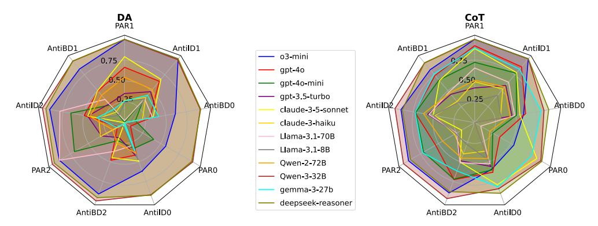

Fig. 6. Radar charts of the 9 sub-metrics of LLMs' performance, comparing the DA prompting (left side) and the CoT prompting (right side). AntiID and AntiBD are derived from ID and BD while higher values indicate better performances (in order to consistent with PAR) (AntiBD =  $1 - \sqrt{BD}$ ), AntiID =  $1 - \sqrt{ID}$ ).

are already capable of solving better with first-order ToM. However, the improvements from using SoToM generally do not exceed those achieved with first-order ToM. In addition, Llama-3.1-70B's underperformance with SoToM suggests that possessing first-order ToM capabilities does not necessarily imply proficiency with second-order ToM. The Second-order Theory-of-Mind (SoToM) prompting method is detailed in Appendix C.4.

The inconsistent benefits of ToM prompting reveal a fundamental limitation: strategic reasoning requires recursive modeling of opponents' beliefs about one's own strategy. Models that benefit from FoToM can simulate one level of opponent reasoning, but the minimal gains from SoToM suggest they cannot recursively apply this process, as they lack the architectural capacity for genuine recursive computation over mental states.

#### Finding 3: Theory-of-Mind Canabilities Are Limited and Inconsiste

First-order ToM prompting benefits some models (gpt-40, claude-3-5-sonnet) but not others, while second-order ToM provides minimal additional gain. LLMs lack robust opponent modeling, which is a core requirement for strategic interaction that demands recursive reasoning about others' mental states.

## Certain behavioural patterns contribute to poor performance.

Based on the analysis from the previous sections, it is encouraging to note that most LLMs demonstrate the best performance when solving 1-task scenarios, regardless of the prompting used (CoT, FoToM, or SoToM). However, some models, specifically gpt-40 and gpt-40-mini, experience a significant decline in performance when addressing other types of tasks, and it is particularly noteworthy that they perform the

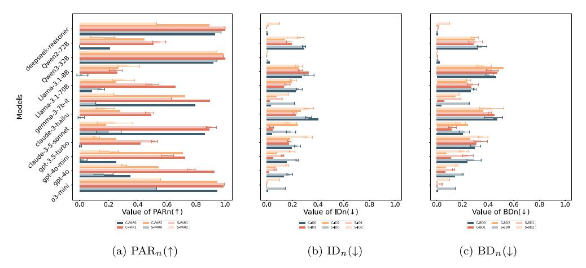

**Fig. 7.** Comparison of LLMs' performance under classic ('*C-*', opaque) and story-based ('*S-*', semi-opaque with error bars) settings. Bar length represents metric values; error bars show standard deviation across 5 story-based data points.

**Table 7** Human vs. LLM performance comparison across settings and task types. Human accuracy remains stable across representations, while LLMs show significant degradation on story-based tasks. Human results are based on 5 participants × 12 tasks per category = 60 responses per cell.

| Agent               | 0-task | 1-task | 2-task | Overall |
|---------------------|--------|--------|--------|---------|
| Classic Setting     |        |        |        |         |
| Human               | 78.3%  | 95.0%  | 86.7%  | 86.7%   |
| Best LLM (o3-mini)  | 91.2%  | 97.8%  | 94.5%  | 94.5%   |
| Average LLM         | 52.3%  | 71.5%  | 58.2%  | 60.7%   |
| Story-based Setting |        |        |        |         |
| Human               | 73.3%  | 91.7%  | 81.7%  | 82.2%   |
| Best LLM (o3-mini)  | 68.5%  | 89.2%  | 78.3%  | 78.7%   |
| Average LLM         | 38.7%  | 56.8%  | 44.1%  | 46.5%   |

worst on 0-tasks out of all types. Surprisingly, as illustrated in [Fig. 8,](#page-10-1) these models display a similar answering pattern that appears noncoincidental. Within the topological framework, there are two square areas representing 0-tasks (enclosed in yellow boxes and green boxes), which should theoretically be symmetric across the counter-diagonal. The standard heat map of these two areas is entirely blank, reflecting no existing equilibrium, so the two areas of the inconsistency heat maps just reflect the distribution of LLMs' practical responses. Thus it is evident that the models exhibit a consistent pattern when addressing 0-tasks. In yellow-box areas, their answers tend to emphasize the upper-right and lower-left quarter-grids, whereas in green-box areas, their answers tend to emphasize the upper-left and lower-right quarter-grids. This positiondependent pattern (rather than random errors) suggests systematic bias in the models' decision-making process.

To mitigate the possible effects of the position bias in the *FoToM* prompting and *SoToM* prompting, we design the *reFoToM* prompting (see [Appendix C.5\)](#page-20-1) and the *reSoToM* prompting (see [Appendix C.6\)](#page-21-0), which swap the order of the players as it occurs in the FoToM prompting and the SoToM prompting respectively.

We show in [Fig. 10](#page-10-2) that GPT series models still display a similar pattern when using reFoToM and reSoToM prompting. Yellow-box areas and green-box areas display an asymmetric inconsistency pattern. The Reversed First-order Theory-of-Mind (reFoToM) prompting method is detailed in [Appendix C.5.](#page-20-1) The Reversed Second-order Theory-of-Mind (reSoToM) prompting method is detailed in [Appendix C.6.](#page-21-0)

In order to further quantify how significant the results display such a pattern, we also propose a metric named significance degree which is confined to [0, 1], defined as:

$$SD = \frac{1}{18} \sum_{i,j} \mathbb{I} \{ \#NE(i,j) = 0 \} \cdot \frac{1}{4}$$

$$\times (Freq_{i,j,1} + Freq_{i,j,4} - Freq_{i,j,2} - Freq_{i,j,3}) \times S(i,j)$$
(3)

where #NE(*,* ) represents the number of Nash equilibria of the tasks of grid (*,* ), and S(*,* ) is determined by the area that the grid (*,* ) belongs to, having a value of 1 if the grid is in the green area and a value of −1 if the grid is in the yellow area.

We present the statistical results of LLMs' performance in [Table 9,](#page-10-3) which show that the SD values for using ReFoToM are similar to those for FoToM, and the values for ReSoToM are close to those for SoToM. Additionally, the results indicate that employing ToM helps gpt-4o reduce the asymmetric inconsistency pattern, while it conversely makes gpt-4o-mini more 'stubborn' in maintaining this pattern. Furthermore, higher-order ToM appears to have a stronger effect than first-order ToM.

The systematic nature of these patterns is revealing. If models were performing genuine payoff analysis, their errors would be randomly distributed across equivalent game positions. Instead, the consistent correlation between answer patterns and game positions suggests that models use positional heuristics (likely learned associations between answer positions and success in training data) as shortcuts for strategic decision-making.

To verify that these asymmetric patterns originate from model reasoning rather than potential bias in story generation (e.g., Player A being framed as the protagonist), we conducted a role-swap sensitivity analysis. The results confirm that swapping character assignments has minimal impact on performance, indicating that the underlying game structure (not narrative role assignment) determines model behavior (see [Appendix H\)](#page-26-1).

**Complex forms bring more challenging tasks.** To verify that TMGBench can be extended to harder tasks which may better align with complicated scenarios from reality, we run the test on the three complex forms mentioned in [Section 3.4,](#page-4-1) to assess the performance of four topperforming LLMs (o3-mini, gpt-4o, Qwen3-27B, and deepseek-reasoner) in complex strategic reasoning. Full experimental configurations for reproducing these results are provided in [Appendix F.](#page-26-2) We set up the

**Table 8** Performance of LLMs using different ToM compared to CoT. Text in red color indicates that the performance gets better and text in blue color indicates that the performance declines (both compared to CoT). Bold text represents the best performance across the three prompting methods. Grey areas indicate that an LLM is proficient in using some kind(s) of ToM. All values are expressed as percentages.

| Model                | Prompting        | ompting 0-Task             |                          |                             | 1-Task                     |                             |                             | 2-Task                     |                             |                             |
|----------------------|------------------|----------------------------|--------------------------|-----------------------------|----------------------------|-----------------------------|-----------------------------|----------------------------|-----------------------------|-----------------------------|
|                      |                  | $\mathbf{PAR}_0(\uparrow)$ | ${\rm ID}_0(\downarrow)$ | $\mathrm{BD}_0(\downarrow)$ | $\mathbf{PAR}_1(\uparrow)$ | $\mathbf{ID}_1(\downarrow)$ | $\mathrm{BD}_1(\downarrow)$ | $\mathbf{PAR}_2(\uparrow)$ | $\mathrm{ID}_2(\downarrow)$ | $\mathrm{BD}_2(\downarrow)$ |
|                      | CoT              | 34.72                      | 13.37                    | 14.41                       | 92.36                      | 1.58                        | 6.76                        | 54.17                      | 7.38                        | 7.38                        |
| gpt-4o               | FoToM            | 43.06                      | 9.46                     | 9.81                        | 95.14                      | 0.72                        | 4.14                        | 50.00                      | 8.94                        | 8.59                        |
|                      | $\mathbf{SoToM}$ | 31.94                      | 9.81                     | 10.68                       | 91.67                      | 1.45                        | 6.00                        | 52.78                      | 7.99                        | 8.16                        |
|                      | CoT              | 25.00                      | 15.62                    | 23.94                       | 72.45                      | 5.08                        | 11.09                       | 70.83                      | 7.97                        | 7.69                        |
| gpt-4o-mini          | FoToM            | 25.00                      | 19.53                    | 19.53                       | 99.54                      | 0.03                        | 5.08                        | 47.22                      | 10.59                       | 10.59                       |
|                      | $\mathbf{SoToM}$ | 18.06                      | 26.56                    | 26.22                       | 98.84                      | 0.19                        | 5.38                        | 68.06                      | 5.38                        | 5.38                        |
|                      | CoT              | 86.11                      | 4.25                     | 20.23                       | 88.89                      | 4.72                        | 11.68                       | 18.06                      | 24.48                       | 24.48                       |
| claude-3-5-sonnet    | FoToM            | 68.06                      | 7.73                     | 16.06                       | 92.13                      | 2.56                        | 7.74                        | 47.22                      | 15.10                       | 15.10                       |
|                      | $\mathbf{SoToM}$ | 47.22                      | 21.35                    | 28.99                       | 90.05                      | 4.05                        | 14.38                       | 33.33                      | 14.93                       | 14.93                       |
|                      | CoT              | 8.33                       | 22.47                    | 26.43                       | 65.59                      | 13.43                       | 27.16                       | 25.00                      | 19.53                       | 23.70                       |
| Llama- $3.1$ - $70B$ | $\mathbf{FoToM}$ | 2.78                       | 30.82                    | 35.59                       | 49.54                      | 18.68                       | 27.49                       | 69.44                      | 6.08                        | 22.74                       |
|                      | $\mathbf{SoToM}$ | 23.61                      | 21.27                    | 28.73                       | 60.42                      | 14.09                       | 23.70                       | 12.50                      | 24.05                       | 25.26                       |

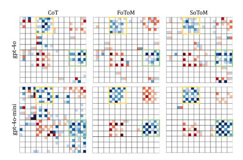

**Fig. 8.** Inconsistency heat map of gpt-4o and gpt-4o-mini using different prompting methods. The yellow boxes and green boxes represent the 0-task areas in the topological framework.

**Table 9** The significance degree of top-tier GPT models performance. A larger value indicates a higher significance of the peculiar answering pattern. A near-zero value means no particular pattern. All values are expressed as percentages.

| Model       | CoT   | FoToM | ReFoToM | SoToM | ReSoToM |
|-------------|-------|-------|---------|-------|---------|
| gpt-4o      | 13.89 | 9.38  | 8.33    | 4.51  | 6.25    |
| gpt-4o-mini | 5.56  | 26.74 | 20.49   | 32.64 | 35.42   |

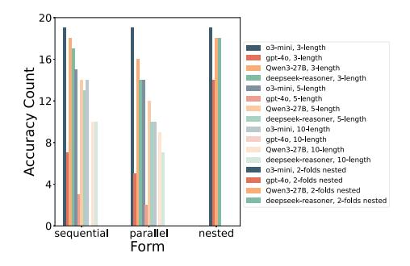

**Fig. 9.** Advanced LLMs' performance on the games in complex forms of three types. We run 20 times for each configuration. Detailed cost analysis is provided in [Appendix I.](#page-27-0)

test as follows: (1) in sequential and parallel forms, we set the number of games from the set {3*,* 5*,* 10}; (2) in nested form, we use 2-fold nested games (the maximum depth achievable with 2×2 atomic games; scalability limitations are discussed in [Section 6\)](#page-11-0).

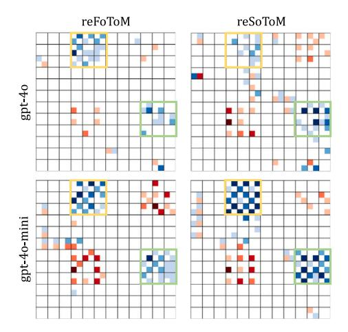

**Fig. 10.** Inconsistency heat map of GPT series models using reFoToM and reSoToM prompting.

**Table 10** Accuracy (%) for extended sequential and parallel game compositions. Values for 15, 20, and 25 games are in bold.

| Model      | Sequential |    |    |    |    |    | Parallel |    |    |    |    |    |
|------------|------------|----|----|----|----|----|----------|----|----|----|----|----|
|            | 3          | 5  | 10 | 15 | 20 | 25 | 3        | 5  | 10 | 15 | 20 | 25 |
| o3-mini    | 95         | 75 | 70 | 65 | 60 | 55 | 95       | 70 | 55 | 43 | 33 | 25 |
| gpt-4o     | 35         | 15 | 0  | 0  | 0  | 0  | 25       | 10 | 0  | 0  | 0  | 0  |
| Qwen3-27B  | 85         | 70 | 50 | 35 | 25 | 18 | 80       | 60 | 45 | 33 | 24 | 17 |
| deepseek-r | 80         | 65 | 50 | 38 | 28 | 20 | 70       | 55 | 35 | 22 | 14 | 9  |

As seen from [Fig. 9,](#page-10-4) among the four models, gpt-4o has a dramatically low accuracy rate in either sequential or parallel games. On the other hand, o3-mini performs best, but it still fails at times. When the number of the games increases, their performances both drop, which is consistent with intuition. As for the games of nested form, all models' performances are relatively reasonable, while it is fair to infer that if we increase the number of layers of the games in the nested structures, it will present a great challenge for LLMs.

To further investigate the scalability of complex forms, we extend the experiments on sequential and parallel forms to larger compositions with {15*,* 20*,* 25} games, as shown in [Table 10.](#page-10-5)

The results reveal a consistent exponential decay pattern across all models. For gpt-4o, performance collapses entirely beyond 10-game

compositions, reaching 0% accuracy. Even the best-performing model o3-mini shows substantial degradation, dropping from 95% at 3 games to 55% (sequential) and 25% (parallel) at 25 games. The parallel form exhibits steeper decay than the sequential form across all models, suggesting that simultaneous multi-context reasoning poses greater challenges than sequential decision-making.

The catastrophic degradation as game count increases exposes a fundamental architectural limitation. Strategic reasoning across multiple games requires: (1) maintaining distinct game states in working memory, (2) tracking dependencies between decisions, and (3) computing equilibria while considering cross-game effects. Current transformer architectures lack explicit mechanisms for these operations, relying instead on implicit attention patterns that break down under compositional load.

### *4.3 . Cases of failure*

To better understand the limitations of LLM strategic reasoning, we analyzed specific failure cases from GPT-4o-mini on symmetric game pairs. These cases reveal fundamental issues in how the model applies game-theoretic concepts, particularly in Nash Equilibrium identification. We found two distinct types of reasoning errors: logical leaps where the model skips crucial verification steps, and direct logical contradictions where the model's conclusions contradict its own stated evidence. A comprehensive analysis of these failures is provided in [Appendix D,](#page-21-1) including detailed examples from games at positions row 3, column 4 [\(Appendix D.2\)](#page-22-0) and row 9, column 10 [\(Appendix D.3\)](#page-23-0) in the topology.

#### *4.4 . Synthesis: implications for LLM strategic reasoning*

Our analysis reveals a coherent picture of how current LLMs approach, and ultimately fail at, strategic reasoning. Rather than performing genuine game-theoretic analysis, models rely on a hierarchy of shortcuts that break down progressively as task complexity increases. The five findings are interconnected: models that succeed in atomic games (Finding 1) do so through explicit reasoning architectures, but even their understanding is shallow, failing to generalize across representations (Finding 2), unable to robustly model opponents (Finding 3), exhibiting systematic biases (Finding 4), and breaking down under compositional load (Finding 5).

These findings suggest strategic reasoning requires three capabilities absent from current architectures: (1) **Abstract game representations** invariant to surface presentation; (2) **Recursive opponent modeling** for Theory-of-Mind reasoning; and (3) **Compositional reasoning structures** for multi-context integration. The consistent failure patterns indicate these are architectural constraints, not merely limitations of the training data.

### **5 . Related work**

**Strategical Reasoning of LLMs.** Large language models have made notable breakthroughs in reasoning tasks, such as mathematical, causal, and commonsense reasoning, enabling their increasing use in complex tasks that support human decision-making [\[38–40\]](#page-28-28). This progress has sparked a growing interest in studying their strategic reasoning capabilities [\[13\]](#page-28-7). Game theory, with its highly abstract representation of real-world strategic scenarios, has garnered significant attention from researchers [\[10,41\]](#page-28-9). The prisoner's dilemma, as one of the most classical games, has been widely used to evaluate the strategic reasoning abilities of LLMs [\[14,20,21,32,42\]](#page-28-8). In addition, several well-known game theory scenarios, such as the Dictator Game [\[14,19,43\]](#page-28-8), the Ultimatum Game [\[44\]](#page-28-29), the Public Goods Game [\[22\]](#page-28-30) and the Battle of the Sexes [\[21\]](#page-28-16), have been employed to evaluate LLMs' capabilities. However, current studies often focus on individual games, resulting in incomplete assessments and less robust conclusions. To address this, we propose TMGBench for evaluating LLMs by 2×2 games, where its atomic games can be further organized using sequential, parallel, and nested formats to provide an in-depth evaluation of the SOTA models like o3-mini.

**Theory-of-Mind of LLMs.** Theory-of-Mind (ToM) refers to the ability to understand and infer human mental states [\[30\]](#page-28-19). Due to the multi-player nature of game theory, players' ability to reason about the "minds" of other participants is crucial. Existing research has initiated discussions on whether machines possess ToM capabilities. For instance, [\[45\]](#page-28-31) suggested that ToM might emerge spontaneously in LLMs, as demonstrated through assessments using false-belief tasks. However, [\[46\]](#page-28-32) argued that such successes are fragile, and easily disrupted by minor perturbations that would not affect an entity genuinely possessing ToM. Nevertheless, many researchers propose enhancing LLMs' strategic reasoning abilities by incorporating ToM. [\[47\]](#page-28-33) designed the Suspicion-Agent, which integrates a ToM-aware planning approach that leverages higher-order ToM capabilities, considering not only what the opponent might do (first-order ToM) but also what the opponent believes the Suspicion-Agent will do (second-order ToM). Additionally, [\[27\]](#page-28-21) introduced a ToM planning method in the Guandan poker game, [\[48\]](#page-28-34) proposed an intention-guided mechanism, [\[42\]](#page-28-35) developed Probabilistic Graphical Modeling, and [\[49\]](#page-28-36) introduced K-Level-Reasoning, all utilizing ToM to enhance LLMs' strategic reasoning. Given the broad application of ToM, this paper leverages TMGBench to comprehensively evaluate LLMs' ability to employ first-order and second-order ToM reasoning techniques for strategic reasoning.

## **6 . Discussion**

## *6.1 . Generalization to larger games*

Larger strategic scenarios are often composed of or reducible to simpler atomic interactions, suggesting that our findings on fundamental building blocks have broader relevance. Our complex game forms directly correspond to important classes of larger games. Sequential compositions mirror multi-round negotiations where players make decisions in turns. Parallel compositions correspond to multi-market competition requiring simultaneous independent decisions. Most notably, nested compositions are grounded in standard multi-stage game dynamics [\[34\]](#page-28-24), mirroring *extensive-form games* where outcomes of earlier stages reduce feasible action sets in subsequent stages, such as qualification-based auctions or conditional contracts.

Our findings have direct implications for these larger settings. The compositional failure we observe, with performance dropping from 60% on isolated games to below 20% on 10-game compositions, directly predicts difficulties with larger games that inherently require tracking decisions across multiple stages. The context sensitivity finding suggests that richer narratives characteristic of real-world negotiations would further exacerbate performance degradation. The limited Theory-of-Mind capabilities indicate that multi-player games requiring deeper opponent modeling would pose even greater challenges.

## *6.2 . Connection to theory-of-mind literature*

Our findings align with and extend recent ToM evaluations. [\[50\]](#page-28-37) demonstrated that GPT-4 solves 75% of false-belief tasks, matching 6-year-old children, yet concluded these capabilities may emerge as byproducts of language training rather than genuine understanding. Our results corroborate this interpretation: FoToM prompting benefits some models while leaving others unchanged, suggesting ToM-like capabilities are inconsistent and task-dependent rather than robust.

The heuristic patterns we observe resonate with [\[26\]](#page-28-20), who showed that humans employ probabilistic shortcuts when higher-order ToM reasoning exceeds cognitive limits. LLMs appear to exhibit similar behavior, substituting positional heuristics for genuine recursive opponent modeling when strategic demands increase. Our framework extends traditional ToM evaluation by requiring *active* strategic ToM: while false-belief tasks assess passive mental-state inference, game-theoretic scenarios demand simultaneous opponent reasoning and decision optimization [\[51\]](#page-28-38). The systematic gap between FoToM and SoToM performance reveals that current LLMs cannot recursively apply opponent modeling, a limitation invisible in traditional passive ToM assessments.

### *6.3 . Limitations*

Our benchmark has two key limitations. First, our games assume *complete information* where all payoffs are known to both players. However, incomplete information is central to settings like sealed-bid auctions and poker, where players have private valuations or hidden cards. Evaluating strategic reasoning under uncertainty requires extending to Bayesian game frameworks.

Second, our nested form experiments are limited to *2-fold nesting depth*. This represents the maximum achievable with 2×2 atomic games under strategy-space restriction: the pre-game outcome eliminates one strategy from the core-game (reducing 2×2 to 2×1), and additional nesting levels would exhaust all remaining choices. This constrains our ability to evaluate deeper backward induction reasoning.

## *6.4 . Future work*

Each limitation suggests a concrete research direction. For incomplete information, incorporating Bayesian game frameworks would enable the evaluation of strategic reasoning under uncertainty. This extension is particularly relevant for assessing whether LLMs can reason about opponent beliefs and update strategies based on observed actions.

For deeper nesting, several approaches could extend complexity: (1) *payoff-based interdependency*, where earlier game outcomes modify payoffs rather than eliminate strategies, preserving the full 2×2 structure across arbitrarily deep chains; (2) *parallel pre-games*, where multiple pregames feed into a single core-game with mutually exclusive restriction rules; (3) *larger atomic games* that can sustain deeper strategy-space restrictions. These extensions would enable the evaluation of backward induction capabilities across more complex hierarchical structures.

Beyond benchmark extensions, recent advances offer promising directions for improving LLM strategic reasoning. Dynamic ensemble methods integrating multiple LLM experts could leverage complementary reasoning strengths [\[52\]](#page-29-0). Test-time learning paradigms that dynamically adapt LLMs to specialized domains [\[53\]](#page-29-1) could address the distribution shift from general language understanding to strategic reasoning, potentially mitigating the context sensitivity and compositional failures observed in our evaluation. TMGBench provides a rigorous foundation for such research by establishing baseline capabilities on fundamental game-theoretic building blocks.

### **7 . Conclusion**

This work introduces TMGBench, a benchmark designed to systematically evaluate the strategic reasoning abilities of AI systems, specifically Large Language Models, using matrix games founded on the Robinson-Goforth topology of 144 fundamental game types. To enhance realism and mitigate data leakage risks, the benchmark leverages AI-powered synthetic data generation through GPT-4o to create rich, narrative-driven game scenarios, and assembles these atomic games into complex sequential, parallel, and nested structures to challenge the most advanced AI models. Our evaluation reveals that current LLMs have significant and widespread limitations in strategic reasoning, with even top-tier models struggling with logical consistency and accuracy. Furthermore, the models' grasp of Theory-of-Mind is inconsistent, and their performance degrades significantly when faced with these complex game structures, highlighting the benchmark's effectiveness in identifying critical bottlenecks in AI reasoning capabilities and providing essential guidance for advancing artificial intelligence toward more sophisticated strategic decision-making.

#### **CRediT authorship contribution statement**

**Yu Guo:** Writing – original draft, Methodology, Data curation, Conceptualization. **Haochuan Wang:** Writing – original draft, Validation, Software, Methodology, Data curation, Conceptualization. **Xiachong Feng:** Writing – review & editing, Supervision, Project administration, Investigation, Funding acquisition.

### **Declaration of generative AI and AI-assisted technologies in the writing process**

During the preparation of this work the authors used large language models to improve readability and language quality. After using this tool, the authors reviewed and edited the content as needed and take full responsibility for the content of the published article.

## **Funding**

This work was supported by the Hong Kong Innovation and Technology Support Programme Platform Research Project fund [grant number ITS/269/22FP].

#### **Declaration of competing interest**

The authors declare that they have no known competing financial interests or personal relationships that could have appeared to influence the work reported in this paper.

### **Appendix A . Game theory fundamentals**

This appendix presents the fundamental concepts and visualizations that underpin the game-theoretic framework used in our benchmark.

#### *A.1 . Robinson-Goforth topology visualization*

The Robinson-Goforth topology provides a comprehensive framework for classifying all 144 distinct types of 2×2 games. [Fig. A.11](#page-13-0) illustrates this topological structure, showing both the positions of famous games and the detailed information contained in each grid.

#### *A.2 . Distribution of solution types in the game topology*

[Fig. A.12](#page-13-2) visualizes the distribution of Nash equilibria and dominant strategies across the Robinson-Goforth topology. This topology systematically organizes all 144 distinct types of 2×2 games, providing a comprehensive framework for evaluating LLM strategic reasoning capabilities.

#### *A.3 . Benchmark diversity statistics*

[Fig. A.13](#page-14-1) provides detailed visualizations of the diversity in our story-based game dataset. The left panel shows the distribution across 20 distinct real-world topics, while the right panel displays the cumulative distribution of narrative lengths, demonstrating the comprehensive coverage and controlled variation in our benchmark design.

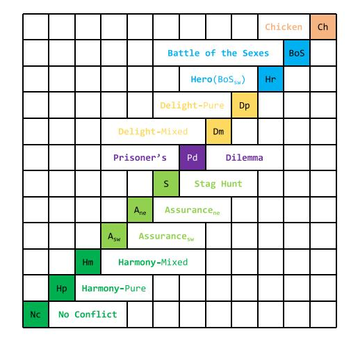

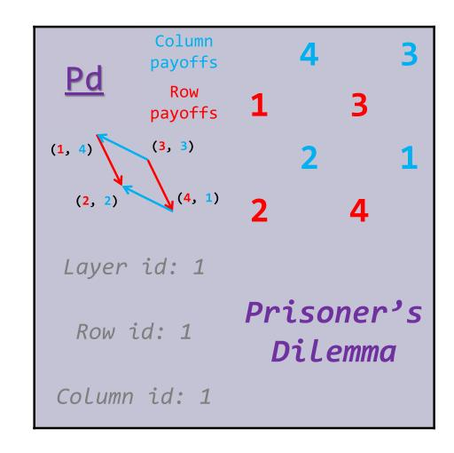

**Fig. A.11.** The topology of the normal-form game system, which is presented by a square consisting of 12×12 grids. [Fig. A.11\(](#page-13-0)a) displays the position of the most famous games in the topology. In each grid, there are specific details of the game, which is shown in [Fig. A.11\(](#page-13-0)b).

| 1 NE | 0 NE  | 1 NE | 2 NEs |  |
|------|-------|------|-------|--|
|      |       |      |       |  |
|      |       |      |       |  |
| 1 NE | 1 NE  | 1 NE | 1 NE  |  |
|      |       |      |       |  |
|      |       |      |       |  |
| 1 NE | 2 NEs | 1 NE | Ø NE  |  |
|      |       |      |       |  |
|      |       |      |       |  |
| 1 NE | 1 NE  | 1 NE | 1 NE  |  |
|      |       |      |       |  |

**Fig. A.12.** The figure illustrates the distribution of solution types across the topology. The number of Nash equilibria is indicated by grid color (grey=1, white=0, other=2), while the presence of dominant strategies is shown by text color (blue=column player, red=row player, white=both, black=neither).

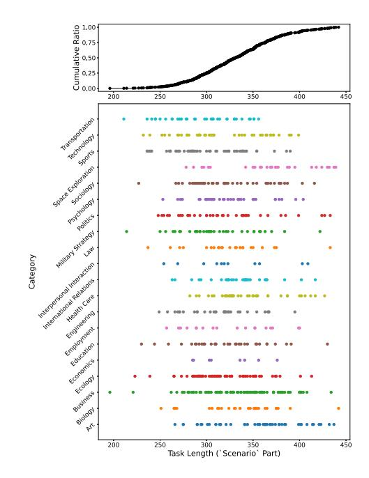

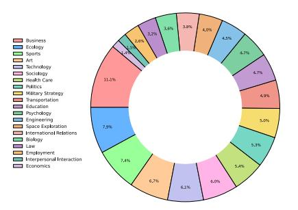

**Fig. A.13.** Statistical distribution of story-based games over 20 topics.

#### **Appendix B . Game examples and prompts**

## *B.1 . Classic game example*

The following shows an example of a classic game used in our benchmark, structured as a standard 2x2 payoff matrix game:

#### *B.2 . Story-based game generation prompt*

To generate contextually rich story-based games, we use the following prompt template with GPT-4o:

#### *B.3 . Story-based game example*

The following illustrates a generated story-based game that corresponds to the classic Prisoner's Dilemma structure:

### *B.4 . Nested game generation prompt*

For creating complex nested game structures, we use the following template:

## **Appendix C . Prompting methods for evaluation**

#### *C.1 . Direct answer (DA) prompting*

### *C.2 . Chain-of-thought (CoT) prompting*

#### *C.3 . First-order theory-of-mind (FoToM) prompting*

## *C.4 . Second-order theory-of-mind (SoToM) prompting*

## *C.5 . Reversed first-order theory-of-mind (reFoToM) prompting*

## *C.6 . Reversed second-order theory-of-mind (reSoToM) prompting*

### **Appendix D . Failure case analysis**

This section is referenced as in the main text.

### *D.1 . Overview of failure cases*

We present detailed analyses of two symmetric failure cases from GPT-4o-mini that demonstrate fundamental issues in LLM strategic reasoning. These examples, derived from symmetric data points in the topology (grid positions (row 3, column 4) and (row 9, column 10)), theoretically have the same answer and similar reasoning patterns. The red colored text in the original responses indicates the mistaken parts of the reasoning processes.

### *D.1.1 . Analysis of the "Row 3 column 4" game failure*

In the first example, the model correctly identifies the best responses for each player, which should lead to the conclusion that no pure-strategy Nash Equilibrium exists (the best responses form a cycle: A1 → B2 → A2 → B1 → A1). However, the failure occurs in a critical **Logical Leap**. Instead of identifying the cycle, the model incorrectly concludes that the pairs of best responses, (A1, B2) and (A2, B1), are themselves Nash Equilibria. This demonstrates an inability to apply the final, crucial step of checking for *mutual* best responses.

## *D.1.2 . Analysis of the "Row 9 column 10" game failure*

In the second example, which is the "sister game" to the first and thus has the same logical structure, the model fails in a different but equally fundamental way: **direct logical contradiction**. The model again correctly identifies the best responses. However, when it attempts to state the Nash Equilibria, its reasoning becomes self-contradictory. For instance, it claims: "(A1, B1) is a Nash Equilibrium because A's best response to B1 is A2…" This statement is nonsensical. The fact that Player A's best response to B1 is A2 is the very reason why (A1, B1) is *not* a Nash Equilibrium (as Player A has a clear incentive to switch). The model explicitly states the evidence that disproves its own conclusion, revealing a profound inability to correctly apply the definition of a Nash Equilibrium.

#### *D.1.3 . Summary of failures*

These two symmetric cases demonstrate the brittleness and inconsistency of the model's strategic reasoning. Faced with the same logical puzzle, it produces two different types of errors: one rooted in *logical leaps* and the other in *severe logical contradictions*. This suggests that the model is not relying on a robust, generalizable reasoning framework but is instead prone to unpredictable and fundamental errors.

### *D.2 . Row 3 column 4 game - complete response*

### *D.3 . Row 9 column 10 game - complete response*

Neurocomputing 675 (2026) 133006 Y. Guo, H. Wang and X. Feng

#### Appendix E. Worked examples for evaluation metrics

This section provides concrete worked examples demonstrating how each evaluation metric is computed from model outputs. We use a simplified 2×2 subset of the topology grid to illustrate all calculations with consistent example data.

#### E.1. Preliminaries: choice mapping and example setup

In a 2×2 game, each outcome corresponds to one of four quarters in the payoff matrix. We denote these outcomes as  $o \in \{1, 2, 3, 4\}$  (Table E.11):

Table E.11 Choice-to-quarter mapping in a 2×2 game.

|             | $\boldsymbol{B}_1$                       | $B_2$                                      |
|-------------|------------------------------------------|--------------------------------------------|
| $A_1$ $A_2$ | o = 1 (upper-left) o = 3 (lower-left) | o = 2 (upper-right) o = 4 (lower-right) |

For our worked examples, we consider a hypothetical model tested on a 2×2 subset of the topology grid. Table E.12 shows the setup: each position has a standard answer (the Nash equilibrium) and observed model output frequencies across T = 4 independent tests.

Table E.12 Example setup for metric calculation on a  $2\times2$  topology subset. Position: grid coordinates (i, j); #NE: number of Nash equilibria; Std.: ground-truth equilibrium outcome ("N/A" denotes no pure-strategy NE);  $f_k$ : model's prediction frequency for outcome o = k across T = 4 tests.

| Position         | #NE    | Std.             | Model Freq $(o = 1, 2, 3, 4)$ |              |              |              |  |
|------------------|--------|------------------|-------------------------------|--------------|--------------|--------------|--|
|                  |        | $\overline{f_1}$ | $f_2$                         | $f_3$        | $f_4$        |              |  |
| (1, 1)           | 1      | o = 1            | 0.75                          | 0.00         | 0.25         | 0.00         |  |
| (1, 2)           | 0      | N/A              | 0.25                          | 0.50         | 0.00         | 0.25         |  |
| (2, 1) (2, 2) | 0 1 | N/A $o = 4$      | 0.00 0.00                  | 0.25 0.50 | 0.50 0.00 | 0.25 0.50 |  |

### E.2. PAR: perfect accuracy rate

PAR measures the proportion of tests where the model's response exactly matches the standard answer. For each position (i, j) with T tests (Table E.13):

$$\mathrm{PAR}_{i,j} = \frac{1}{T} \sum_{t=1}^{T} \mathbb{I}\{\mathrm{rsp}_{t,i,j} = \mathrm{std}_{i,j}\}$$

Table E.13 PAR calculation example.

| Position | Std   | Test 1  | Test 2  | Test 3             | Test 4          | $\mathrm{PAR}_{i,j}$ |
|----------|-------|---------|---------|--------------------|-----------------|----------------------|
| (1, 1)   | o = 1 | o = 1 ✓ | o = 1 ✓ | $o = 1 \checkmark$ | $o = 3 \times $ | 3/4 = 0.75           |
| (2, 2)   | o = 4 | o = 4 ✓ | o = 4 ✓ | o = 2 ×            | $o = 2 \times $ | 2/4 = 0.50           |

For 0-task games (positions (1,2) and (2,1) with no Nash equilibrium), PAR is computed against an empty answer set, meaning any non-empty response is incorrect. The global PAR averages across all 144 positions.

#### E.3. ID: inconsistency degree

ID quantifies the deviation between model outputs and standard answers using frequency differences. For each position (Table E.14):

$$ID_{i,j} = \frac{1}{4} \sum_{o=1}^{4} (\Delta Freq_{i,j,o})^2$$

where  $\Delta \mathrm{Freq}_{i,j,o} = \mathrm{Freq}_{i,j,o}^{\mathrm{model}} - \mathrm{Freq}_{i,j,o}^{\mathrm{std}}$ . The global ID averages across all 144 positions:  $\mathrm{ID} = \frac{1}{144} \sum_{i,j} \mathrm{ID}_{i,j}$ .

## E.4. BD: bias degree

BD evaluates whether model responses maintain consistency across symmetric game positions. The Robinson-Goforth topology has counterdiagonal symmetry: swapping players in game (i, j) produces game (j, i). A robust model should produce equivalent responses at symmetric positions. The ref0 Mapping. When players swap, choices must be reflected. The mapping ref2:  $\{1, 2, 3, 4\} \rightarrow \{4, 2, 3, 1\}$  captures this (Table E.15):

**Table E.14** ID calculation for position (1*,* 1) where the standard answer is = 1.

| 𝑜                    | Std Freq                    | Model Freq | ΔFreq | 2 (ΔFreq) |
|----------------------|-----------------------------|------------|-------|--------------|
| 1                    | 1.00                        | 0.75       | −0.25 | 0.0625       |
| 2                    | 0.00                        | 0.00       | 0.00  | 0.0000       |
| 3                    | 0.00                        | 0.25       | 0.25  | 0.0625       |
| 4                    | 0.00                        | 0.00       | 0.00  | 0.0000       |
| 1 ID1,1 = 4 | (0.0625 + 0 + 0.0625 + 0) = |            |       | 0.03125      |

**Table E.15** The ref*o* reflection mapping.

| Original 𝑜 | Strategy Pair    | refo | Interpretation                     |
|------------|------------------|------|------------------------------------|
| 1          | (𝐴1 , 𝐵1 ) | 4    | Upper-left ↔ Lower-right           |
| 2          | (𝐴1 , 𝐵2 ) | 2    | Upper-right stays (self-symmetric) |
| 3          | (𝐴2 , 𝐵1 ) | 3    | Lower-left stays (self-symmetric)  |
| 4          | (𝐴2 , 𝐵2 ) | 1    | Lower-right ↔ Upper-left           |

**BD Calculation.** For symmetric pairs (*,* ) and (*,* ) [\(Table E.16\)](#page-25-2):

$$BD_{i,j} = \frac{1}{4} \sum_{o=1}^{4} (Freq_{i,j,o} - Freq_{j,i,ref_o})^2$$

**Table E.16** BD calculation for symmetric pair: (1*,* 2) vs (2*,* 1).

| 𝑜          | refo   | Freq1,2,𝑜                      | Freq2,1,ref𝑜        | Difference | Diff2   |
|------------|--------|--------------------------------|---------------------|------------|---------|
| 1          | 4      | 0.25                           | Freq2,1,4 = 0.25 | 0.00       | 0.0000  |
| 2          | 2      | 0.50                           | Freq2,1,2 = 0.25 | 0.25       | 0.0625  |
| 3          | 3      | 0.00                           | Freq2,1,3 = 0.50 | −0.50      | 0.2500  |
| 4          | 1      | 0.25                           | Freq2,1,1 = 0.00 | 0.25       | 0.0625  |
| BD1,2 = | 1 4 | (0 + 0.0625 + 0.25 + 0.0625) = |                     |            | 0.09375 |

A BD value of 0 indicates perfect symmetry (robust reasoning), while higher values indicate position-dependent biases.

### *E.5 . SD: significance degree*

SD specifically measures systematic asymmetric patterns in 0-task games (games with no Nash equilibrium). Within the topology, certain regions exhibit characteristic bias patterns.

**Spatial Factor.** The 18 0-task games are divided into two regions with a spatial factor (*,* ):

- **Green region** ( = +1): Models tend toward diagonal outcomes ( = 1*,*  = 4)
- **Yellow region** ( = −1): Models tend toward anti-diagonal outcomes ( = 2*,*  = 3)

**SD Calculation.** For each 0-task position [\(Table E.17\)](#page-25-3):

$$SD_{i,j} = \frac{1}{4} \cdot (Freq_{i,j,1} + Freq_{i,j,4} - Freq_{i,j,2} - Freq_{i,j,3}) \cdot S(i,j)$$

**Table E.17** SD calculation for 0-task positions.

| Position         | 𝑆(𝑖, 𝑗)                      | 𝑓1 + 𝑓4                                  | 𝑓2 + 𝑓3                                  | Diff          | 1 Diff ×𝑆 4 |
|------------------|------------------------------|------------------------------------------|------------------------------------------|---------------|-------------------|
| (1, 2) (2, 1) | +1 −1                     | 0.25 + 0.25 = 0.50 0.00 + 0.25 = 0.25 | 0.50 + 0.00 = 0.50 0.25 + 0.50 = 0.75 | 0.00 −0.50 | 0.00 +0.125    |
|                  | Example SD (2 positions) = 1 | (0.00 + 0.125) = 2                    |                                          |               | 0.0625            |

Higher SD values indicate stronger systematic positional biases, suggesting the model uses heuristic shortcuts rather than genuine strategic analysis. The global SD averages across all 18 0-task games.

### **Appendix F . Complex-form experiment reproducibility**

To ensure reproducibility of our complex-form experiments, this section provides complete experimental details including the number of atomic games sampled, composite tasks constructed, and prompts sent to each model. [\(Table F.18\)](#page-26-3)

**Table F.18** Complex-form experiment configuration and scale. All experiments use story-based atomic games randomly sampled from the pool of 720 instances (5 stories × 144 game types).

| Parameter                      | Sequential           | Parallel                                            | Nested         |  |  |
|--------------------------------|----------------------|-----------------------------------------------------|----------------|--|--|
| Atomic games per task          | 3, 5, 10, 15, 20, 25 | 3, 5, 10, 15, 20, 25                                | 2 (pre + core) |  |  |
| Number of configurations       | 6                    | 6                                                   | 1 (2-fold)     |  |  |
| Independent runs per config    | 20                   | 20                                                  | 20             |  |  |
| Composite tasks per form       | 120                  | 120                                                 | 20             |  |  |
| Shared Experimental Parameters |                      |                                                     |                |  |  |
| Atomic games pool              |                      | 720 story-based games (5 stories × 144 types)       |                |  |  |
| Sampling method                |                      | Random selection without replacement                |                |  |  |
| Data consistency               |                      | All 4 models evaluated on identical composite tasks |                |  |  |
| Models evaluated               |                      | o3-mini, gpt-4o, Qwen3-27B, deepseek-reasoner       |                |  |  |
| Generation temperature         | 0 (deterministic)    |                                                     |                |  |  |
| Total prompts per model        | 260 (120 + 120 + 20) |                                                     |                |  |  |

The success criteria differ by form type: for sequential and parallel forms, a composite task is considered correct only if all constituent atomic games are solved correctly. For nested forms, success requires the model to demonstrate forward-looking reasoning by choosing a sub-optimal solution in the pre-game to achieve the optimal solution in the core-game.

## **Appendix G . Output format sensitivity analysis**

To investigate whether the Python-style code output format interferes with LLMs' semantic reasoning capabilities, we conducted a pilot experiment comparing two output formats across representative models and game types.

We compared two output formats:

- **Python code style** (original): Models output structured code blocks following the format answer = [("Ax", `"By")]. Answers are extracted by parsing the Python-style code.
- **Free-form answer** (alternative): Models output natural language responses that must include the strategies chosen by Player A and Player B, but without any format restrictions. We then use GPT-4o to extract the strategy pairs into a structured format for evaluation.

We tested three representative LLMs from diverse model families, including GPT-4o, Claude-3.5-Sonnet, and Qwen3-32B, on 30 randomly sampled games (15 classic, 15 story-based) using Direct Answer (DA) prompting. Notably, GPT-4o achieved 100% extraction accuracy on all free-form responses, demonstrating that modern LLMs possess strong instruction-following capabilities for such extraction tasks [\(Table G.19\)](#page-26-4).

**Table G.19** Output format comparison: PAR (%) across different formats and game types.

| Model             | Classic |           | Story-based |           | Overall |           |
|-------------------|---------|-----------|-------------|-----------|---------|-----------|
|                   | Python  | Free-form | Python      | Free-form | Python  | Free-form |
| GPT-4o            | 73.3    | 71.7      | 66.7        | 65.0      | 70.0    | 68.3      |
| Claude-3.5-Sonnet | 68.3    | 70.0      | 61.7        | 60.0      | 65.0    | 65.0      |
| Qwen3-32B         | 86.7    | 85.0      | 78.3        | 76.7      | 82.5    | 80.8      |
| Average           | 76.1    | 75.6      | 68.9        | 67.2      | 72.5    | 71.4      |

The results demonstrate that the output format has minimal impact on reasoning performance. Across all three models and both game types, the PAR differences between Python code style and free-form answer formats remain within 1.1 percentage points on average (72.5% vs 71.4% overall). This finding suggests that the formatting constraint does not meaningfully interfere with semantic reasoning capabilities. The structured Python format offers practical advantages for automated evaluation while preserving the models' underlying reasoning ability.

## **Appendix H . Role-swap sensitivity analysis**

To investigate whether GPT-4o's story generation process introduces a "Player A bias" (treating Player A as the protagonist more often), we conducted a role-swap experiment to isolate the source of observed asymmetries.

For each story-based game, we created a role-swapped version by interchanging the character assignments: the character originally designated as Player A becomes Player B, and vice versa. Crucially, the underlying payoff structure remains fixed, and only the narrative role labels are exchanged. This allows us to test whether observed performance asymmetries stem from (a) systematic bias in the story generation process, or (b) inherent patterns in model reasoning.

We tested three representative LLMs from diverse model families, including GPT-4o, Claude-3.5-Sonnet, and Qwen3-32B, on 30 randomly sampled story-based games using both original and role-swapped versions with Direct Answer (DA) prompting [\(Table H.20\)](#page-27-1).

The results show that role swapping has minimal impact on model performance, with an average PAR difference of only 0.4 percentage points. The varying directions across models indicate no systematic bias toward either role assignment, suggesting that the asymmetric patterns observed in [Section 4.2](#page-7-3) stem from models' reasoning processes rather than story generation bias. This confirms that the payoff matrix, not narrative role labels, fundamentally determines model behavior.

**Table H.20** Role-swap sensitivity analysis results (PAR %). "Original" refers to the standard character assignment; "Swapped" refers to versions where Player A and Player B roles are interchanged.

| Model             | Original (%) | Swapped (%) | Difference |  |
|-------------------|--------------|-------------|------------|--|
| GPT-4o            | 66.7         | 65.7        | +1.0       |  |
| Claude-3.5-Sonnet | 60.0         | 60.3        | −0.3       |  |
| Qwen3-32B         | 76.7         | 76.3        | +0.4       |  |
| Average           | 67.8         | 67.4        | +0.4       |  |

## **Appendix I . Inference cost analysis**

To assist future researchers in better estimating the cost of TMGBench experiments, we provide detailed inference cost estimates for the complexform experiments shown in [Fig. 9.](#page-10-4) The complete calculation process is presented in [Table I.21](#page-27-2) (API pricing), [Table I.22](#page-27-3) (token counts and per-query costs), and [Table I.23](#page-27-4) (total experiment cost).

GPT-4o represents the most expensive model at \$19.80 total, while budget-friendly alternatives like Qwen3-27B (\$0.33) enable cost-effective reproduction. The complete [Fig. 9](#page-10-4) experiment cost approximately \$29.87, demonstrating that TMGBench complex-form evaluation remains accessible to the research community.

**Table I.21** API pricing per 1M tokens.

| Model             | Input  | Output  |
|-------------------|--------|---------|
| o3-mini           | \$1.10 | \$4.40  |
| GPT-4o            | \$2.50 | \$10.00 |
| Qwen3-27B         | \$0.11 | \$0.11  |
| deepseek-reasoner | \$0.28 | \$0.42  |

**Table I.22** Token counts and per-query costs by configuration.

| Config        | Input | Output | o3-mini | GPT-4o  | Qwen     | deepseek-r |
|---------------|-------|--------|---------|---------|----------|------------|
| 3-game        | 1.4K  | 1.7K   | \$0.009 | \$0.021 | \$0.0003 | \$0.001    |
| 5-game        | 2.2K  | 2.7K   | \$0.014 | \$0.033 | \$0.0005 | \$0.002    |
| 10-game       | 4.2K  | 5.2K   | \$0.028 | \$0.063 | \$0.001  | \$0.003    |
| 15-game       | 6.2K  | 7.7K   | \$0.041 | \$0.093 | \$0.0015 | \$0.005    |
| 20-game       | 8.2K  | 10.2K  | \$0.054 | \$0.123 | \$0.002  | \$0.007    |
| 25-game       | 10.2K | 12.7K  | \$0.067 | \$0.153 | \$0.0025 | \$0.008    |
| Nested 2-fold | 1.1K  | 1.5K   | \$0.008 | \$0.018 | \$0.0003 | \$0.001    |

**Table I.23** Total experiment cost for [Fig. 9](#page-10-4) (20 runs × 13 configurations × 4 models = 1040 API calls).

| Form                       | o3-mini | GPT-4o  | Qwen3-27B | deepseek-r | Subtotal |
|----------------------------|---------|---------|-----------|------------|----------|
| Sequential (all 6 configs) | \$4.26  | \$9.72  | \$0.16    | \$0.52     | \$14.66  |
| Parallel (all 6 configs)   | \$4.26  | \$9.72  | \$0.16    | \$0.52     | \$14.66  |
| Nested (2-fold)            | \$0.16  | \$0.36  | \$0.006   | \$0.02     | \$0.55   |
| Model Total                | \$8.68  | \$19.80 | \$0.33    | \$1.06     | \$29.87  |

## **Data availability**

The benchmark dataset and evaluation code are available at [TMGBench.](https://www.kaggle.com/datasets/pinkex/tmgbench/)

## **References**

- [1] A. Jaech, A. Kalai, A. Lerer, A. Richardson, A. El-Kishky, A. Low, et al., Openai o1 system card, arXiv preprint [arXiv:2412.16720,](http://arxiv.org/abs/2412.16720) 2024.
- [2] A. Yang, B. Yang, B. Zhang, B. Hui, B. Zheng, B. Yu, et al., Qwen2.5 technical report, arXiv preprint [arXiv:2412.15115,](http://arxiv.org/abs/2412.15115) 2024.
- [3] D. Guo, D. Yang, H. Zhang, J. Song, R. Zhang, R. Xu, et al., Deepseek-r1: Incentivizing reasoning capability in llms via reinforcement learning, arXiv preprint [arXiv:2501.12948,](http://arxiv.org/abs/2501.12948) 2025.
- [4] G. Team, G. Kamath, A. Ferret, J. Pathak, S. Vieillard, N. Merhej, R. Perrin, S. Matejovicova, et al., Gemma 3 technical report, arXiv preprint [arXiv:2503.19786,](http://arxiv.org/abs/2503.19786) 2025.
- [5] M. Wang, Y. Yao, Z. Xu, S. Qiao, S. Deng, P. Wang, et al., Knowledge mechanisms in large language models: A survey and perspective, arXiv preprint [arXiv:2407.15017,](http://arxiv.org/abs/2407.15017) 2024.
- [6] Z. Shao, P. Wang, Q. Zhu, R. Xu, J. Song, X. Bi, et al., Deepseekmath: Pushing the limits of mathematical reasoning in open language models, arXiv preprint [arXiv:2402.03300,](http://arxiv.org/abs/2402.03300) 2024.
- [7] A. Toroghi, W. Guo, A. Pesaranghader, S. Sanner, Verifiable, debuggable, and repairable commonsense logical reasoning via LLM-based theory resolution, in: Y. Al-Onaizan, M. Bansal, Y.-N. Chen (Eds.), Proceedings of the 2024 Conference on Empirical Methods in Natural Language Processing, Association for Computational Linguistics, Miami, Florida, USA, 2024, pp. 6634–6652, [https://doi.org/10.18653/](https://doi.org/10.18653/v1/2024.emnlp-main.379) [v1/2024.emnlp-main.379.](https://doi.org/10.18653/v1/2024.emnlp-main.379)
- [8] B. Lei, C. Liao, C. Ding, et al., Boosting logical reasoning in large language models through a new framework: The graph of thought, arXiv preprint [arXiv:2308.08614,](http://arxiv.org/abs/2308.08614) 2023.
- [9] N. Lorè, B. Heydari, Strategic behavior of large language models: Game structure vs. contextual framing, arXiv preprint [arXiv:2309.05898,](http://arxiv.org/abs/2309.05898) 2023.
- [10] J. Duan, R. Zhang, J. Diffenderfer, B. Kailkhura, L. Sun, E. Stengel-Eskin, et al., Gtbench: uncovering the strategic reasoning capabilities of llms via game-theoretic evaluations, in: A. Globersons, L. Mackey, D. Belgrave, A. Fan, U. Paquet, J.M. Tomczak, C. Zhang (Eds.), Advances in Neural Information Processing Systems 38: Annual Conference on Neural Information Processing Systems 2024, NeurIPS 2024, Vancouver, BC, Canada, December 10–15, 2024, 2024, [http://papers.nips.cc/paper\\_files/paper/2024/](http://papers.nips.cc/paper_files/paper/2024/hash/3191170938b6102e5c203b036b7c16dd-Abstract-Conference.html) [hash/3191170938b6102e5c203b036b7c16dd-Abstract-Conference.html.](http://papers.nips.cc/paper_files/paper/2024/hash/3191170938b6102e5c203b036b7c16dd-Abstract-Conference.html)
- [11] [K. Gandhi, D. Sadigh, N. Goodman, Strategic reasoning with language models, in:](http://refhub.elsevier.com/S0925-2312(26)00403-0/sbr0055)  [NeurIPS 2023 Foundation Models for Decision Making Workshop, 2023.](http://refhub.elsevier.com/S0925-2312(26)00403-0/sbr0055)
- [12] X. Feng, L. Dou, E. Li, Q. Wang, H. Wang, Y. Guo, et al., A survey on large language model-based social agents in game-theoretic scenarios, arXiv preprint [arXiv:2412.03920,](http://arxiv.org/abs/2412.03920) 2024.
- [13] Y. Zhang, S. Mao, T. Ge, X. Wang, A. de Wynter, Y. Xia, et al., Llm as a mastermind: A survey of strategic reasoning with large language models, arXiv preprint [arXiv:2404.01230,](http://arxiv.org/abs/2404.01230) 2024.
- [14] P. Brookins, J.M. DeBacker, Playing games with GPT: what can we learn about a large language model from canonical strategic games? Available at SSRN 4493398 (2023).
- [15] N. Herr, F. Acero, R. Raileanu, M. Pérez-Ortiz, Z. Li, Are large language models strategic decision makers? a study of performance and bias in two-player nonzero-sum games, arXiv preprint [arXiv:2407.04467,](http://arxiv.org/abs/2407.04467) 2024.
- [16] [D.M. Kreps, Game Theory and Economic Modelling, Oxford University Press, 1990.](http://refhub.elsevier.com/S0925-2312(26)00403-0/sbr0080)
- [17] [H. Carlsson, E. Van Damme, 12 equilibrium selection in stag hunt games, Frontiers](http://refhub.elsevier.com/S0925-2312(26)00403-0/sbr0085)  [of game theory \(1993\) 237.](http://refhub.elsevier.com/S0925-2312(26)00403-0/sbr0085)
- [18] [R. Forsythe, J.L. Horowitz, N.E. Savin, M. Sefton, Fairness in simple bargaining](http://refhub.elsevier.com/S0925-2312(26)00403-0/sbr0090)  [experiments, Games Econ. Behav. 6 \(1994\) 347–369.](http://refhub.elsevier.com/S0925-2312(26)00403-0/sbr0090)
- [19] [J.J. Horton, Large Language Models as Simulated Economic Agents: what Can](http://refhub.elsevier.com/S0925-2312(26)00403-0/sbr0095)  [We Learn from Homo Silicus? Technical Report, National Bureau of Economic](http://refhub.elsevier.com/S0925-2312(26)00403-0/sbr0095)  [Research, 2023.](http://refhub.elsevier.com/S0925-2312(26)00403-0/sbr0095)
- [20] S. Phelps, Y.I. Russell, The machine psychology of cooperation: can GPT models operationalise prompts for altruism, cooperation, competitiveness and selfishness in economic games? arXiv preprint, 2023, [https://api.semanticscholar.org/CorpusID:](https://api.semanticscholar.org/CorpusID:258685424) [258685424.](https://api.semanticscholar.org/CorpusID:258685424)
- [21] [E. Akata, L. Schulz, J. Coda-Forno, S.J. Oh, M. Bethge, E. Schulz, Playing repeated](http://refhub.elsevier.com/S0925-2312(26)00403-0/sbr0105)  [games with large language models, Nat. Hum. Behav. \(2025\) 1–11.](http://refhub.elsevier.com/S0925-2312(26)00403-0/sbr0105)
- [22] J. Li, R. Li, Q. Liu, Beyond static datasets: A deep interaction approach to llm evaluation, arXiv preprint [arXiv:2309.04369,](http://arxiv.org/abs/2309.04369) 2023.
- [23] W. Hua, O. Liu, L. Li, A. Amayuelas, J. Chen, L. Jiang, et al., Game-theoretic llm: Agent workflow for negotiation games, arXiv preprint [arXiv:2411.05990,](http://arxiv.org/abs/2411.05990) 2024.
- [24] E. Shapira, O. Madmon, I. Reinman, S.J. Amouyal, R. Reichart, M. Tennenholtz, Glee: A unified framework and benchmark for language-based economic environments, arXiv preprint [arXiv:2410.05254,](http://arxiv.org/abs/2410.05254) 2024.
- [25] [D. Robinson, D. Goforth, The Topology of the 2x2 Games: A New Periodic Table,](http://refhub.elsevier.com/S0925-2312(26)00403-0/sbr0125)  [vol. 3, Psychology Press, 2005.](http://refhub.elsevier.com/S0925-2312(26)00403-0/sbr0125)
- [26] M.L. Stanley, et al., Strategic reasoning under pressure: testing heuristics in higherorder theory of mind, Cognition 266 (2026) 106331, [https://doi.org/10.1016/j.](https://doi.org/10.1016/j.cognition.2025.106331) [cognition.2025.106331](https://doi.org/10.1016/j.cognition.2025.106331)

[27] Y. Yim, C. Chan, T. Shi, Z. Deng, W. Fan, T. Zheng, et al., Evaluating and enhancing llms agent based on theory of mind in guandan: A multi-player cooperative game under imperfect information, arXiv preprint [arXiv:2408.02559,](http://arxiv.org/abs/2408.02559) 2024.

- [28] [B. Edelman, M. Ostrovsky, M. Schwarz, Internet advertising and the generalized](http://refhub.elsevier.com/S0925-2312(26)00403-0/sbr0140)  [second-price auction: selling billions of dollars worth of keywords, Am. Econ. Rev.](http://refhub.elsevier.com/S0925-2312(26)00403-0/sbr0140)  [97 \(2007\) 242–259.](http://refhub.elsevier.com/S0925-2312(26)00403-0/sbr0140)
- [29] [T.S. Ferguson, A Course in Game Theory, World Scientific, 2020.](http://refhub.elsevier.com/S0925-2312(26)00403-0/sbr0145)
- [30] [D. Premack, G. Woodruff, Does the chimpanzee have a theory of mind? Behav.](http://refhub.elsevier.com/S0925-2312(26)00403-0/sbr0150)  [Brain Sci. 1 \(1978\) 515–526.](http://refhub.elsevier.com/S0925-2312(26)00403-0/sbr0150)
- [31] X. Feng, L. Dou, M. Li, Q. Wang, Y. Guo, H. Wang, et al., A survey on large language model-based social agents in game-theoretic scenarios, Trans. Mach. Learn. Res. (2025) [https://openreview.net/forum?id=CsoSWpR5xC.](https://openreview.net/forum?id=CsoSWpR5xC), survey Certification.
- [32] F. Guo, Gpt in game theory experiments, arXiv preprint [arXiv:2305.05516,](http://arxiv.org/abs/2305.05516) 2023.
- [33] L. Mei, J. Yao, Y. Ge, Y. Wang, B. Bi, Y. Cai, et al., A survey of context engineering for large language models, arXiv preprint [arXiv:2507.13334,](http://arxiv.org/abs/2507.13334) 2025.
- [34] P.J. Reny, Rationality in extensive-form games, J. Econ. Perspect. 6 (1992) 103–118, [https://doi.org/10.1257/jep.6.4.103.](https://doi.org/10.1257/jep.6.4.103)
- [35] C. Fourrier, N. Habib, A. Lozovskaya, K. Szafer, T. Wolf, Open LLM leaderboard v2, 2024, [https://huggingface.co/spaces/open-llm-leaderboard/open\\_llm\\_](https://huggingface.co/spaces/open-llm-leaderboard/open_llm_leaderboard) [leaderboard.](https://huggingface.co/spaces/open-llm-leaderboard/open_llm_leaderboard)
- [36] J. Wei, X. Wang, D. Schuurmans, M. Bosma, B. Ichter, F. Xia, et al., Chain-ofthought prompting elicits reasoning in large language models, in: S. Koyejo, S. Mohamed, A. Agarwal, D. Belgrave, K. Cho, A. Oh (Eds.), Advances in Neural Information Processing Systems 35: Annual Conference on Neural Information Processing Systems 2022, NeurIPS 2022, New Orleans, LA, USA, November 28 - December 9, 2022, 2022, [http://papers.nips.cc/paper\\_files/paper/2022/hash/](http://papers.nips.cc/paper_files/paper/2022/hash/9d5609613524ecf4f15af0f7b31abca4-Abstract-Conference.html) [9d5609613524ecf4f15af0f7b31abca4-Abstract-Conference.html.](http://papers.nips.cc/paper_files/paper/2022/hash/9d5609613524ecf4f15af0f7b31abca4-Abstract-Conference.html)
- [37] [B. Liddle, D. Nettle, Higher-order theory of mind and social competence in school](http://refhub.elsevier.com/S0925-2312(26)00403-0/sbr0185)[age children, J. Cult. Evol. Psychol. 4 \(2006\) 231–244.](http://refhub.elsevier.com/S0925-2312(26)00403-0/sbr0185)
- [38] S. Imani, L. Du, H. Shrivastava, MathPrompter: mathematical reasoning using large language models, in: S. Sitaram, B.B. Klebanov, J.D. Williams (Eds.), Proceedings of the 61st Annual Meeting of the Association for Computational Linguistics (Volume 5: Industry Track), Association for Computational Linguistics, Toronto, Canada, 2023, pp. 37–42, [https://doi.org/10.18653/v1/2023.acl-industry.4.](https://doi.org/10.18653/v1/2023.acl-industry.4)
- [39] E. Kıcıman, R. Ness, A. Sharma, C. Tan, Causal reasoning and large language models: Opening a new frontier for causality, arXiv preprint [arXiv:2305.00050,](http://arxiv.org/abs/2305.00050) 2023.
- [40] Z. Zhao, W.S. Lee, D. Hsu, Large language models as commonsense knowledge for large-scale task planning, in: A. Oh, T. Naumann, A. Globerson, K. Saenko, M. Hardt, S. Levine (Eds.), Advances in Neural Information Processing Systems 36: Annual Conference on Neural Information Processing Systems 2023, NeurIPS 2023, New Orleans, LA, USA, December 10 - 16, 2023, 2023, [http://papers.](http://papers.nips.cc/paper_files/paper/2023/hash/65a39213d7d0e1eb5d192aa77e77eeb7-Abstract-Conference.html) [nips.cc/paper\\_files/paper/2023/hash/65a39213d7d0e1eb5d192aa77e77eeb7-](http://papers.nips.cc/paper_files/paper/2023/hash/65a39213d7d0e1eb5d192aa77e77eeb7-Abstract-Conference.html) [Abstract-Conference.html.](http://papers.nips.cc/paper_files/paper/2023/hash/65a39213d7d0e1eb5d192aa77e77eeb7-Abstract-Conference.html)
- [41] J.-T. Huang, E.J. Li, M.H. Lam, T. Liang, W. Wang, Y. Yuan, et al., How far are we on the decision-making of llms? evaluating llms' gaming ability in multi-agent environments, arXiv preprint [arXiv:2403.11807,](http://arxiv.org/abs/2403.11807) 2024.
- [42] [L. Xu, Z. Hu, D. Zhou, H. Ren, Z. Dong, K. Keutzer, et al., Magic: investigation](http://refhub.elsevier.com/S0925-2312(26)00403-0/sbr0210)  [of large language model powered multi-agent in cognition, adaptability, rational](http://refhub.elsevier.com/S0925-2312(26)00403-0/sbr0210)[ity and collaboration, in: ICLR 2024 Workshop on Large Language Model \(LLM\)](http://refhub.elsevier.com/S0925-2312(26)00403-0/sbr0210)  [Agents, 2023.](http://refhub.elsevier.com/S0925-2312(26)00403-0/sbr0210)
- [43] C. Fan, J. Chen, Y. Jin, H. He, Can large language models serve as rational players in game theory? A systematic analysis, in: M.J. Wooldridge, J.G. Dy, S. Natarajan (Eds.), Thirty-Eighth AAAI Conference on Artificial Intelligence, AAAI 2024, Thirty-Sixth Conference on Innovative Applications of Artificial Intelligence, IAAI 2024, Fourteenth Symposium on Educational Advances in Artificial Intelligence, EAAI 2014, Feb 20–27, 2024, Vancouver, Canada, AAAI Press, 2024, pp. 17960–17967,<https://doi.org/10.1609/AAAI.V38I16.29751>
- [44] G.V. Aher, R.I. Arriaga, A.T. Kalai, Using large language models to simulate multiple humans and replicate human subject studies, in: A. Krause, E. Brunskill, K. Cho, B. Engelhardt, S. Sabato, J. Scarlett (Eds.), International Conference on Machine Learning, ICML 2023, 23-29 July 2023, Honolulu, Hawaii, USA, Volume 202 of Proceedings of Machine Learning Research, PMLR, 2023, pp. 337–371, [https://proceedings.mlr.press/v202/aher23a.html.](https://proceedings.mlr.press/v202/aher23a.html)
- [45] M. Kosinski, Theory of mind might have spontaneously emerged in large language models, arXiv preprint [arXiv:2302.02083,](http://arxiv.org/abs/2302.02083) 2023.
- [46] T. Ullman, Large language models fail on trivial alterations to theory-of-mind tasks, arXiv preprint [arXiv:2302.08399,](http://arxiv.org/abs/2302.08399) 2023.
- [47] J. Guo, B. Yang, P. Yoo, B.Y. Lin, Y. Iwasawa, Y. Matsuo, Suspicion-agent: Playing imperfect information games with theory of mind aware gpt-4, arXiv preprint [arXiv:2309.17277,](http://arxiv.org/abs/2309.17277) 2023.
- [48] Z. Liu, A. Anand, P. Zhou, J.-T. Huang, J. Zhao, Interintent: Investigating social intelligence of llms via intention understanding in an interactive game context, arXiv preprint [arXiv:2406.12203,](http://arxiv.org/abs/2406.12203) 2024.
- [49] Y. Zhang, S. Mao, T. Ge, X. Wang, Y. Xia, M. Lan, et al., K-level reasoning with large language models, arXiv preprint [arXiv:2402.01521,](http://arxiv.org/abs/2402.01521) 2024.
- [50] [M. Kosinski, Evaluating large language models in theory of mind tasks, Proc. Natl.](http://refhub.elsevier.com/S0925-2312(26)00403-0/sbr0250)  [Acad. Sci. 121 \(2024\) e2405460121.](http://refhub.elsevier.com/S0925-2312(26)00403-0/sbr0250)
- [51] G. Hou, W. Zhang, Y. Shen, Z. Tan, S. Shen, W. Lu, Entering real social world! benchmarking the theory of mind and socialization capabilities of llms from a firstperson perspective, ArXiv preprint, 2024.

[52] [J. Hu, Y. Wang, S. Zhang, K. Zhou, G. Chen, Y. Hu, et al., Efficient dynamic ensem](http://refhub.elsevier.com/S0925-2312(26)00403-0/sbr0260)[bling for multiple LLM experts, in: Proceedings of the Thirty-Fourth International](http://refhub.elsevier.com/S0925-2312(26)00403-0/sbr0260)  [Joint Conference on Artificial Intelligence, IJCAI, 2025a, pp. 16–22.](http://refhub.elsevier.com/S0925-2312(26)00403-0/sbr0260)

[53] J. Hu, Z. Zhang, G. Chen, X. Wen, C. Shuai, W. Luo, et al., Test-time learning for large language models, in: A. Singh, M. Fazel, D. Hsu, S. Lacoste-Julien, F. Berkenkamp, T. Maharaj, K. Wagstaff, J. Zhu (Eds.), Proceedings of the 42nd International Conference on Machine Learning, Volume 267 of Proceedings of Machine Learning Research, PMLR, 2025b, pp. 24823–24849, [https://proceedings.](https://proceedings.mlr.press/v267/hu25z.html) [mlr.press/v267/hu25z.html.](https://proceedings.mlr.press/v267/hu25z.html)

#### **Author biography**

**Yu Guo**, Ph.D. student, Harbin Institute of Technology. Research interests: Agent Modeling, Artificial Intelligence.

**Haochuan Wang**, Undergraduate student, Harbin Institute of Technology. Research interests: Large Language Models.

**Xiachong Feng**, Postdoctoral Researcher, The University of Hong Kong. Research interests: Large Language Models.